# `Java`

## 基本概念

`Java` 是一种广泛使用的高级编程语言，由 `Sun Microsystems`公司（现为` Oracle `甲骨文公司所有）于 1995 年正式发布（第一个版本）由`James Gosling`编写。它以跨平台性、面向对象和健壮性著称，是当今企业级应用、移动开发和大数据领域的核心技术之一，`Java`使用最多的版本是8和11

***

### `Java`的重要特点

- `Java`语言是面向对象的（`oop`）

- `Java`语言是健壮性的，`Java`的强类型机制、异常处理、垃圾的自动收集等是健壮性的重要保证

- `Java`语言是跨平台性的：编译后的`.class`文件可以在跨平台上进行运行，不需要重新进行编译（由于底层中有`Java`虚拟机机制（`JVM`）的存在）

  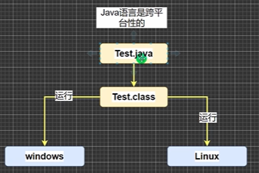

- `Java`语言是解释型性的

  解释性语言有：`JavaScript`、`PHP`、`Java`

  编译性语言有：`c`、`c++`

  解释性语言，编译后的代码不能直接被机器执行，需要解释器来执行；编译性语言，编译后的代码可以直接被机器执行（编译后的代码已经是二进制的了）

***

### 环境安装

#### 代码编辑器安装

一开始在学习的时候，推荐使用`Sublime Text`代码编辑器进行敲代码，后续大规模开发的时候，推荐使用`IDEA`代码编辑器进行代码的编写，该编辑器有较好的代码提示，能帮助我们快速的编写代码

##### `Sublime Text`

###### 常见的问题

1. 汉化`Sublime Text`
   - 打开`Sublime Text`代码编辑器
   - 使用快捷键`shift+ctrl+p`
   - 输入`Package Control: Install Package`
   - 在搜索框中输入`Chinese`，选择下拉框中的`ChineseLocalizations`
   - 下载完重新打开编辑器，即可汉化
2. `Sublime`里面找不到`GBK`编码格式 
   - 打开`Sublime Text`代码编辑器
   - 使用快捷键`shift+ctrl+p`
   - 输入`Package Control: Install Package`
   - 在搜索框输入`converToUTF8`，选择并安装
   - 后续在文件->`Set File Encoding to`中就可以选择`gbk`进行编码了

##### `IntelliJ IDEA`

[下载官网](https://www.jetbrains.com/)

- 从官网下载安装包，推荐使用专业版

- 右键，以管理员身份运行

- 指定安装目录，选择64位，其他都不选，点击下一步

- 打开安装好的代码编辑器，新建一个项目，选择一个`Java`项目，默认会加载电脑中安装的`JDK`环境，如果没有加载上，我们手动添加即可，选择到本地安装的`JDK`的顶级安装目录即可

- 创建具体项目的名称，并指定具体目录的位置

- 在项目文件中的`src`文件中创建开发文件：单机`src`文件夹右键-->`new`-->`Java Class`-->输入具体项目的文件名

- 编写好代码后，直接通过代码左边的绿色小箭头，或者右键，选择`run`即可编译运行，在终端得到结果

  在`idea`中，当我们`run`一个文件时，会先编译成`.class`，再运行

  具体的文件结构逻辑：编译运行后，会在项目根目录文件夹中生成`out`文件夹，文件夹下有`production`文件，里面就有编译后的类文件

###### 基本设置

- 设置字体大小：菜单`file`-->`settings`-->`Appearance`-->选中`use custom font`-->设置合适字体大小
- 字符编码设置：菜单`file`-->`settings`-->`Editor`-->`File Encoding`-->在`Global Encoding`设置`UTF-8`（设置全局编码，默认是`UTF-8`），也可以在`Project Encoding`设置项目编码

###### `IDEA`快捷键自定义配置

快捷键自定义配置：菜单`file`-->`settings`-->`Keymap`-->选择具体的规则进行快捷键的修改

- 删除当前行：建议设置为`ctrl+d`

- 复制当前行：建议设置为`ctrl+alt+向下光标`

- 补全代码：`alt+/`

- 添加或取消注释：`ctrl+/`

- 导入该行需要的类：配置`auto import`

  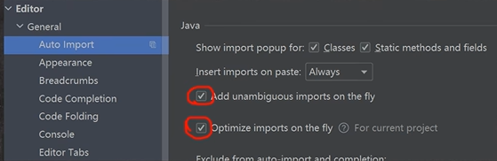

  然后使用`alt+enter`即可

- 快速格式化代码：`ctrl+alt+l`

- 快速运行程序：建议设置为`alt+r`

- 生成构造器的快捷键：`alt+insert`

- 查看一个类的层级关系：`ctrl+h`

- 定位到具体的方法：`ctrl+b`  将光标放在一个方法上，输入快捷键，可以定位到对应的方法

- 自动分配变量名：在变量后面加`.var`回车即可

###### 模板快捷键

模块快捷键可以帮助我们加快代码的编写速度，只需要输入定义的快捷键内容，就可以得到对于的代码模板

我们可以在`file`-->`settings`-->`editor`-->`Live templates`-->查看有哪些模板快捷键/自定义模板快捷键

系统提供的常用模板快捷键有：

- `main`模板快捷键对应的内容：

  ```java
  public static void main(String[] args) {
      
  }
  ```

- `sout`模板快捷键对应的内容：

  ```java
  System.out.println("hello,world");
  ```

- `fori`模板快捷键对应的内容：

  ```java
  for (int i = 0; i < ; i++) {
      
  }
  ```

对于自定义的模板快捷键，我们点击右上角的加号，输入快捷键的名字和内容，同时设置应用的范围，我们一般要应用给`Java`使用

#### `JDK`的安装

`JDK`是`Java`开发工具包，`JDK`=`JRE`+`Java`的开发工具（`java`、`javac`、`javadoc`、`javap`等）

`JRE`是`Java`的运行环境，包括了`Java`虚拟机和`Java`程序所需的核心类库等，如果想要运行一个开发好的（编译好的）`Java`程序，计算机中只需安装`JRE`即可

安装后的文件系统结构：

- `bin`目录：包含了所有的`Java`开发工具

  安装后，需要配置环境变量，将`bin`目录的路径添加到环境变量中

- `jre`目录：`jdk`中安装的`jre`目录

- `src.zip`：是`JDK`的源码包，里面有其源代码

***

### 运行机制

程序：计算机执行某些操作或解决某个问题而编写的一系列**有序指令的集合**

`Java`的运行机制和过程：`Java`程序可以运行在跨平台的系统上，其根本原因是由于`JVM`（`Java`的虚拟计算机，具有指令集并使用不同的存储区域，负责执行指令，管理数据、内存、寄存器），每个操作系统都可以去下载其对应的`JVM`，从而去运行`Java`程序，`JVM`是包含在`JDK`中的

`Java`虚拟机机制屏蔽了底层运行平台的差别，实现了一次编译，到处运行：

- 编译：将`Java`源文件通过编译器将其编译成`JVM`可以识别的字节码文件

  编译指令：`javac 编写的Java文件`

  如果程序没有错误，就可以编译成功，会在源文件目录中出现一个字节码文件，也就是可执行的`Java`程序

- 运行：通过运行工具`java.exe`对字节码文件进行执行，本质就是将`.class`文件装载到`jvm`机执行

- 运行指令：`java 编译后的Java文件`

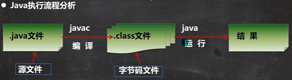

对修改后的源文件，需要进行重新编译，生成新的`.class`文件，再执行，**才能生效**

***

### 第一个`Java`程序

```java
// 第一个java程序
// 编写一个类
public class Hello {
	// 编写一个类方法
	public static void main(String[] args) {
		System.out.println("helloWorld!");    // 一个结束语句要以分号结尾
	}
}
```

> 声明`Hello`是一个公有的类
>
> `public static void main(String[] args)`表示定义一个主方法，是一个程序执行的入口
>
> `static`表示定义一个静态的方法
>
> `System.out.printIn()`：内置的输入方法，将内容输出到屏幕上
>
> 在编译的时候，如果文件内有中文，包括注释，我们需要将编码方式改为`gbk`的形式，这样才能正常编译

使用命令行终端，在当前代码的目录下输入`javac Hello.java`进行编译，成功编译后，会出现`Hello.class`的编译结果文件，使用命令`java Hello`即可运行，得到运行结果

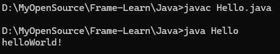

***

### 注释

注释是用于说明解释程序的文字提示，提高了代码的可读性，编写程序需要养成注释的好习惯，推荐先将自己的思想通过注释整理出来，再用代码去实现

- 单行注释

  ```java
  // 单行注释
  ```

  > 单行注释快捷键：选中区域+`ctrl`+`/ `取消注释同样是这个快捷键

- 多行注释

  ```java
  /* 多行
     注释 */
  ```

  > 多行注释中不能嵌套多行注释
  >
  > 多行注释快捷键：选中区域+`Ctrl`+`shift`+/ 取消注释是选中区域+Ctrl+shift+
  > 选中区域+Ctrl+shift+\

- 文档注释

  文档注释的内容可以被`JDK`提供的工具`javadoc`所解析，生成一套以网页文件形式体现的该程序的说明文档，文档注释一般写在类中（想要对类提供相关的注释，我们一般使用文档注释），只放在类、接口、成员变量、方法之前（因为Javadoc只处理这些地方的文档注释，而忽略其他地方的文档注释）

  文档注释要按照`javadoc`工具提供的标签进行，以`/**`开始， 以`*/`结束：

  ```java
  /**
   * @author  jlc
   * @version 1.0
   */
  ```

  > 将文档标签生成网页文件的命令：`javadoc -d 存放生成文档标签的文件夹目录地址 -xx -yy 要编译的文件`
  >
  > 对应的`xx`和`yy`，分别是文档注释中使用了的标签：`author`和`version`
  >
  > 文档注释在协作化项目开发过程中使用的是非常多的
  >
  > 文档注释快捷键：`alt`+`shift`+`j`

  文档注释常见的`javadoc`标签有：

  |      标签       |                             描述                             |
  | :-------------: | :----------------------------------------------------------: |
  |    `@author`    |                           作者标识                           |
  |  `@deprecated`  | 标识当前`API`已经过期，仅为了保证兼容性依然存在，以此告之开发者不应再用这个`API` |
  |  `{@docRoot}`   |                   指明当前文档根目录的路径                   |
  |  `@exception`   |                     标志一个类抛出的异常                     |
  | `{@inheritDoc}` |                     从直接父类继承的注释                     |
  |    `{@link}`    |               链接到某个特定的成员对应的文档中               |
  | `{@linkplain}`  |     插入一个到另一个主题的链接，但是该链接显示纯文本字体     |
  |    `@param`     |     方法的入参名及描述信息，如入参有特别要求，可在此注释     |
  |    `@return`    |                      对函数返回值的注释                      |
  |     `@see`      |            引用,查看相关内容，如类、方法、变量等             |
  |    `@serial`    |                      说明一个序列化属性                      |
  |  `@serialData`  |  说明通过`writeObject( )` 和` writeExternal( )`方法写的数据  |
  | `@serialField`  |               说明一个`ObjectStreamField`组件                |
  |    `@since`     |          描述文本,API在什么程序的什么版本后开发支持          |
  |    `@throws`    |                 构造函数或方法所会抛出的异常                 |
  |   `{@value}`    |             显示常量的值，该常量必须是static属性             |
  |   `@version`    |                            版本号                            |

***

### 标识符命名规则和规范

`Java`对各种变量、方法和类等命名时使用的字符序列称为标识符（凡是可以自己起名字的地方都叫标识符）

标识符命名规则（必须遵守的）：

- 由26个英文字母大小写，0-9.`_`或`$`组成

- 不可以以数字开头

- 不可以使用关键字和保留字，但是可以包括关键字和保留字

  `Java`中的关键字：被`Java`语言赋予了特殊的含义，用于专门用途的字符串（单词）

  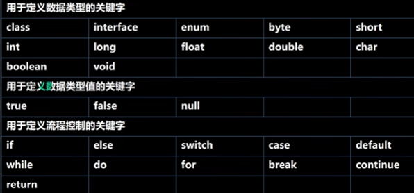

  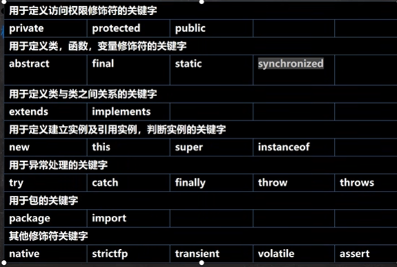

  `Java`中的保留字：现有的`Java`版本没有使用，但以后的版本可能会作为关键字使用

  

- 严格区分大小写，长度无限制

- 标识符不能包含空格

标识符命名规范（规范可以显得代码更加专业）：

- 包名：多单词组成时所有字母都小写：`aaa.bbb.ccc`
- 类名、接口名：多单词组成时，所有单词的首字母大写：`XxxYyy`（大驼峰形式）
- 变量名、方法名：多单词组成时，第一个单词首字母小写，第二个单词开始每个单词首字母大写：`xxxYyy`（小驼峰形式，简称驼峰法）
- 常量名：所有字母都大写，多单词时每个单词用下划线连接：`XXX_YYY`

***

### 开发规范

在`Java`开发过程中，我们需要遵守一些开发细节，这样才能减少一些不必要的错误：

1. `Java`应用程序的执行入口是`main()`方法，有固定的书写格式：

   `public static void main(String[] args) {...}`

2. `Java`严格区分大小写

3. `Java`方法由一条语句构成，每个语句以`;`结束

4. 大括号是成对出现的，建议先写`{}`，再写代码

5. 一个源文件中最多只能有一个`public`类，其他类的个数不限，但是，只要有一个类，不管是不是`public`类，在编译后，都会生成一个`.class`文件，即有几个类，就生成几个`.class`文件

6. 如果源文件包含一个`public`类，则文件名必须按照该类进行命名

7. 可以将`main`方法写在非`public`类中，然后指定运行编译后的非`public`类，这样入口方法就是非`public`的`main`方法，也就是说会运行这个类中的入口方法

8. 我们需要确保文件名和主类名保持一致，否则会编译出错

开发规范：

- 对于类、方法的注释，要以`javadoc`的方式来进行编写
- 对于非`javadoc`的注释，往往是给代码的维护者看的，着重告诉读者为什么这么写，如何修改，要注意什么问题等
- 运算符和等号左右各加一个空格
- 源文件使用`utf-8`编码
- 行宽不要超过80个字符

***

### `windows`系统下的`DOS`指令

`DOS`：磁盘操作系统，可以使用指令的方式对文件系统进行操作，常见的指令有：

- `dir`：查看当前目录中有什么

- `tree`：查看指定的目录下所有的子级目录

- `cd`：切换到其他目录    `cd .. `：返回上一级    `cd \`：切换到根目录

  切换到`C`盘：`cd /D c:`

- `md`：新建文件夹（目录）

- `rd`：删除文件夹（目录）

- `cls`：清除终端屏幕中的内容，清屏

- `exit`：退出命令行终端

- `type`：创建文件    `type nul > 文件名`

- `echo`：输入内容到文件中

  `echo hello > hello.txt`   在`hello.txt`文件中就插入了`hello`内容，先创建在写入

- `copy`：复制文件

- `move`：剪切文件

- `del`：删除文件

相对路径：从当前目录开始定位，形成的一个路径

绝对路径：从根目录（顶级目录）开始定位，形成的路径

***

### 断点调试

在开发过程中，断点调试可以一步步的看源码的执行过程，从而帮助我们发现错误所在

重要提示：在断点调试的过程中，是运行状态，对象是以运行类型来执行的

断点调试是指在程序的某一行设置一个断点，调试时，程序运行到这一行就会停住，然后可以一步步的往下调试，调试过程中可以看各个变量的当前值，出错的话，调试到出错的代码执行会显示错误，程序停止，我们可以进行分析找打`Bug`

断点调试可以帮助我们查看`Java`的底层代码执行过程，提高程序员的代码水平

断点可以在`debug`过程中，动态的进行下断点的

在`IDEA`中，断点调试的快捷键：

- `F7`（跳入方法内）、`F8`（跳过，逐行执行代码）、`shift+F8`（跳出当前方法）、`F9`（`resume`，执行到下一个断点）

对于系统的方法，我们无法进入源码的设置：

点击`Setting`-->`Build,Exection,Deployment`-->`Debugger`-->`Stepping`-->把`Do not step into the classes`中的`java.*`、`javax.*`取消勾选，这样我们就可以通过快捷键`F7`进入源码了


## 转义字符

`Java`中常见的转义字符有：

- `\t`：一个制表位，实现左对齐的功能

- `\n`：换行符

- `\\`：一个`\`      如果要在控制台中输出两个`\`，需要使用两个斜杠进行转义：`\\\\`

- `\"`：一个`"`

- `\'`：一个`‘`

- `\r`：一个回车

  回车是将光标放到最前面，如`System.out.println("jlc\r1")`，打印的结果就是：`1lc`

  光标回到最前面，在打印1，将第一个字符覆盖掉了


## 进制

对于一个整数，有四种表示方式：

- 二进制：0，1     满2进1    以`0b`或者`0B`开头
- 十进制：0 - 9     满10进1
- 八进制：0 - 7     满8进1    以数字`0`开头
- 十六进制：0 - 9以及A(10) - F(15)  （A-F不区分大小写） 满16进1    以`0x`或者`0X`开头

***

### 进制的转换

进制的转换是程序员的一个基本功

#### 其他进制转十进制

- 二进制转十进制

  从最低位（右边）开始，将每个位上的数提取出来，乘以2的（位数-1）次方，再求和

  0b1011 = 1 * 2^0 + 1 * 2^1 + 0 * 2^2 + 1 * 2^3 = 11

- 八进制转十进制

  从最低位（右边）开始，将每个位上的数提取出来，乘以8的（位数-1）次方，再求和

  0234 = 4 * 8^0 + 3 * 8^1 + 2 * 8^2 = 156

- 十六进制转十进制

  从最低位（右边）开始，将每个位上的数提取出来，乘以16的（位数-1）次方，再求和

  0x23A = 10 * 16^0 + 3 * 16^1 + 2 * 16^2 = 570

#### 十进制转其他进制

- 十进制转二进制

  将该数不断除以2，直到商为0为止，然后将每步得到的余数倒过来，就得到对应的二进制

  34 = 0B100010

  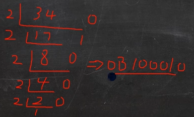

  由于一个字节是有八位的，所以最后的结果位34 = 0B00100010

- 十进制转八进制

  将该数不断除以8，直到商为0为止，然后将每步得到的余数倒过来，就得到对应的八进制

  131 = 0203

  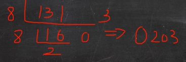

- 十进制转十六进制

  将该数不断除以16，直到商为0为止，然后将每步得到的余数倒过来，就得到对应的十六进制

  237 = 0XED

  

#### 其他进制转二进制

- 八进制转二进制

  将八进制的每一位，转成对应的一个3位二进制即可

  0237 = 0b010011111

  由于一个字节是有八位的，所以最后的结果位0237 = 0b10011111

- 十六进制转二进制

  将十六进制的每一位，转成对应的一个4位二进制即可

  0x23B = 0b001000111011

#### 二进制转其他进制

- 二进制转八进制

  从低位开始，将二进制数每三位一组，转成对应的八进制即可

  0b11010101 = 0325

- 二进制转十六进制

  从低位开始，将二进制数每四位一组，转成对应的十六进制即可

  0b11010101 = 0xd5


## 变量

程序中需要变量，我们可以通过不同类型的变量来代表不同的数据，变量是程序的基本组成单位

变量相当于内存中一个数据存储空间的表示，通过变量名，我们可以访问到这个变量的具体值（总之，变量可以代表一个变化的值）

变量有三个基本的要素：类型、名称和值，如`int a = 1;`

- 变量需要先声明，再使用，可以简写声明和赋值在同一行
- 变量的值可以在同一类型中进行不断的变化，即可以重复的进行同一类型的赋值
- 变量是在内存中的一个存储区域，不同类型的变量，占用的空间大小是不同的，如`int`占4个字节，`double`占8个字节
- 变量名在同一个作用域不能重名

***

### 数据类型

`Java`是强类型语言，每一种数据都要明确数据类型

在实际的使用中，有很多的数据类型，对于不同用途的数据，我们声明不同数据类型的变量

#### 基本数据类型

##### 数值型

- 整数类型，用来存放整数：

  - `byte[1]`：`byte`类型（字节），占1个字节，范围-128~127
  - `short[2]`：`short`类型（短整型），占2个字节，范围-32768~32767
  - `int[4]`：`int`类型（整型），占4个字节，范围-2147483648~2147483647
  - `long[8]`：`long`类型（长整型），占8个字节，范围-2^63~2^63-1

  > `bit`是计算机中的最小存储单位，1`byte` =8`bit`，字节`byte`是计算机中的基本存储单位
  >
  > `byte b = 10;`通常情况下，10在`Java`中默认是一个`int`类型，但是当把具体的数赋值给`byte`（`short`类型同理）时，系统会先判断当前值是否在`byte`范围内，如果是，就可以正常的赋值，但是以下的方式是不正确的：
  >
  > ```java
  > int n = 1;
  > byte b = n;   // 编译报错，变量赋值，需要先判断类型
  > ```
  >
  > n在内存中先声明了4个字节大小的存储空间中，但是b声明的存储空间只有1个字节
  >
  > 总之，具体数赋值，先判断范围；变量赋值，先判断类型
  >
  > `Java`的整型常量（具体值）默认为`int`型，声明`long`型常量需后面加上`l`或`L`，如`long n = 1L;`

- 浮点型，用来存放小数：

  - `float[4]`：单精度浮点类型，占4个字节，范围-3.403E38~3.403E38
  - `double[8]`：双精度浮点类型，占8个字节，范围-1.798E308~1.798E308

  > 浮点数在计算机中的存放形式：浮点数=符号位+指数位+尾数位
  >
  > 其中，尾数部分可能丢失，造成精度的损失（小数都是近似值）
  >
  > `Java`的浮点型常量（具体值）默认为`double`型，声明`float`型常量，需后面加`f`或者`F`，如`float n = 1.1F;`（`float n = 1.1;`会报错，不能将`double`类型赋值给`float`类型的变量），大的字节范围不能往小的字节范围内放，但是小的字节范围可以往大的字节范围内放，如`double n = 1.1f;`是正确的，编译不会报错
  >
  > 通常情况下，我们应该使用`double`类型，因为它的精度比`float`型更精确（精度低，会导致过长的小数点后的内容丢失）
  >
  > 浮点型常量有两种表示形式：
  >
  > - 十进制数形式：如：5.12     512.0f    .512（前面的0可以省略，但是必须有小数点）
  > - 科学计数法形式：如：5.12e2（5.12*10的2次方，返回的是512.0，因为是浮点数类型）    5.12E-2
  >
  > 浮点数的使用陷阱：
  >
  > 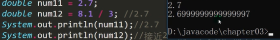
  >
  > 计算机在接收8.1的时候，不能确定8.1小数位的1后面是否还有其他的位数，它可能认为是8.10000001，所以，在计算结果的时候，也是以精度的方式进行返回的
  >
  > 所以说，当我们对小数的运行结果进行相等判断的时候，要格外的注意，应该通过两个数的差值的绝对值，在某个精度范围内进行判断

##### 字符型

- 字符类型：`char[2]`，存放单个字符`'a'`，该类型占两个字节，可以存放一个汉字

> 字符常量是用单引号`''`括起来的单个字符，不能使用双引号，如果使用双引号，就是字符串类型了
>
> 如`char c = "9";`编译器就会报错，字符串类型不能赋值给字符类型的变量
>
> `String`字符串类型，不是基本数据类型，实际上它是一个类，多个字符，我们使用字符串来存放
>
> 在`Java`中，`char`的本质是一个整数，在输出的时候，是`unicode`码对应的字符，字符类型也可以直接存放一个数字：`char c = 97;`，但是输出的是`a`，97在计算机中的`ASSCII`码中对应的是`a`，对于任意的汉字字符，也有具体对应的`unicode`码，如果我们想要将对应的字符转换为对应的`unicode`码，我们将这个字符通过`int`类型进行转化即可得到对应的`unicode`码
>
> `Java`中允许使用转义字符`\`，来将其后面跟着的字符转变为特殊字符型常量，如`char c = '\n';`
>
> `char`类型是可以进行运算的，该类型相当于一个整数，任何字符都要对应的`unicode`码
>
> 字符串的比较，使用到了`equals`的字符串方法：`"jlc".equals(name);`   判断`name`字符串类型的值是不是`“jlc”`，如果是，返回`true`，否则返回`false`

字符类型的本质讨论：字符型数据存储到计算机中，需要将字符对应的码值（整数）找出来，如`'a'`字符：

存储：`'a'`  --->  码值  --->   二进制    --->   存储

读取：二进制   --->   97   --->   `'a'`   --->   显示

##### 布尔型

- `boolean[1]`：布尔类型，占1个字节，只允许取`true`和 `false`

  `boolean`类型适用于逻辑运算

  在`Java`语言中，不能使用0或非0的整数来代替`false`和`true`，这一点和`C`语言是不同的

##### 自动类型转换

当`Java`程序在进行赋值或者运算时，精度小的类型可以自动转换为精度大的数据类型，这个就是自动类型的转换

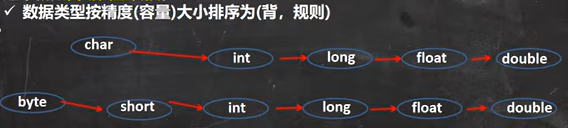

箭头的流向表示低精度向高精度进行转换

在理论上，`int a = 'c';`该语句的语法是错误的，不能将`char`字符类型赋值给`int`数值类型，但是有了自动类型转换，精度低的`char`类型，可以自动的转化为`int`类型，所有`int a = 'c';`该语句在编译的过程中不会报错

低精度的类型，可以连跨级别的向高精度的类型进行自动转换

自动类型转换细节：

1. 有多种类型的数据混合运算时，系统首先自动将所有数据转换成容量（精度）最大的那种数据类型，然后再进行计算

2. 当我们把容量（精度）大的数据类型赋值给容量（精度）小的数据类型时，就会报错，反之则会进行自动类型的转换

3. （`byte`、`short`）和`char`之间不会互相自动转换

   ```java
   byte b = 10;
   char c = b;   // 报错，byte类型不会自动转换为char类型
   ```

4. `byte`、`short`和`char`它们三者可以计算，在计算时（不管是单独类型的计算还是混合类型的计算）首先转换为`int`类型

   ```java
   byte b = 1;
   short s1 = 1;
   short s2 = b + s1;   // 报错，运算后，转化成了int类型，不能赋值给精度小的short类型
   
   byte b2 = 1;
   byte b3 = b + b2;   // 报错，byte类型在运算后会转化为int类型
   ```

5. `boolean`类型不参与转换

6. 自动提升原则：表达式结果的类型自动提升为操作数中最大的类型

##### 强制类型转化

强制类型转化是自动类型转换的逆过程，将容量（精度）大的数据类型转换为容量（精度）小的数据类型，使用时需要加上强制转换符`()`，但是，强制类型转换可能会造成精度的降低或溢出，需要格外注意

```java
int i = (int)1.9;    // 强制将double类型转换为int类型，精度损失了，结果输出为1，掉了小数位
```

强制类型转换细节：

1. 强制符号只针对于最近的操作数有效，往往会使用小括号提升优先级

   ```java
   int x = (int)10 * 3.5 + 6 * 1.5;    // 编译不通过，不能将double类型赋值给int类型
   
   int x = (int)(10 * 3.5 + 6 * 1.5);  // 结果为44
   ```

#### 引用数据类型

- 类（`class`）
- 接口（`interface`）
- 数组（`[]`）

#### 基本数据类型和`String`类型的转换

- 基本数据类型转`String`类型，语法：将基本类型的值+`""`即可：

  ```java
  int n = 100;
  float f = 1.1F;
  double d = 4.5;
  bollean b = true;
  // 基本数据类型转String字符串
  String s1 = n + "";
  String s2 = f + "";
  String s3 = d + "";
  String s4 = b + "";
  ```

- `String`类型转基本数据类型，语法：通过基本类型的包装类调用`parseXX`方法：

  ```java
  String s = "123";
  // String字符串转换为基本数据类型
  int n = Integer.parseInt(s);  // 123
  double d = Double.parseDouble(s);  // 123.0
  float f = Float.parseFloat(s);   // 123.0
  Long l = Long.parseLong(s);   // 123
  byte b = Byte.parseByte(s);   // 123
  short s = Short.parseShort(s);  // 123
  boolean b = Boolean.parseBoolean("true");   // true
  ```

  > 使用基本数据类型对应包装类的相应方法进行转换，将字符串类型转换为基本数据类型

  对于将字符串转换成字符`char`类型，是将字符串的第一个字符取下来：

  ```java
  String s = "123";
  s.charAt(0);   // '1'
  ```

  注意：将字符串类型转换成基本的数据类型时，要确保字符串类型能够转成有效的数据，如，不能将字母转换成整数，如果格式不正确，系统会抛出异常

***

### 加号的使用

在程序中，加号有不同的用途：

- 当左右两边都是数值型时，则做加法运算
- 当左右两边有一方为字符串，则做拼接运算

***

### 编码

字符和码值的对应关系是通过字符编码决定的（是规定好的）常见的字符编码表有：

- `ASCII`：一个字节表示，一共表示了128个字符，实际上一个字节可以表示256个字符，但是`ASCII`字符集只使用了128个字符，这个编码是为英文国家创建的，英文只有26个字母，加上一些符号，128个字符足够使用了
- `Unicode`：`ASCII`表的一个扩展（`Unicode`码是兼容`ASCII`码的，同样的`'a'`都是用97来表示），固定大小的编码，使用两个字节来表示字符，字母和汉字统一都是占用两个字节，比较浪费空间
- `utf-8`：大小可变的编码，可以使用1至6个字节来表示一个符号，根据不同的符号而变化字节长度，字母使用一个字节，汉字使用三个字节，在互联网中使用最广的一种`Unicode` 的实现形式
- `gbk`：可以表示汉字，而且范围广，字母使用一个字节，汉字使用两个字节（编码的汉字种类较`utf-8`少，`utf-8`汉字是使用三个字节的，涉及到的汉字种类范围广）
- `big5`：可以表示繁体中文

不同的编码，对文件的大小是有影响的，有的编码汉字是用两个字节表示的，有的编码汉字是用三个字节表示的，会对保存的文件大小造成影响


## 运算符

运算符是一种特殊的符号，用于表示数据的运算、赋值和比较等

### 算数运算符

算数运算符是对数值类型的变量进行运算的，常见的算数运算符有：

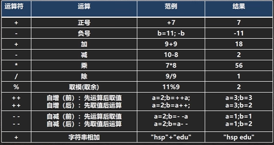

```java
System.out.println(10 / 4);   // 结果显示2   10和4都是整数，结果也要是整数，会把小数部分去掉
System.out.println(10.0 / 4);  // 结果为2.5
double d = 10 / 4;   // 结果为2.0

System.out.println(10 % 3);   // 结果显示1
System.out.println(-10 % 3);   // 结果显示-1
System.out.println(10 % -3);   // 结果显示1
System.out.println(-10 % -3);   // 结果显示-1
```

> 在`Java`中，`a % b`取模的本质是`a - a / b * b`

```java
// 如果独立使用++，前自增和后自增是一样的
int i = 10;
i++;   // 等价于 i = i + 1
++i;   // 等价于 i = i + 1
System.out.println(i);  // 结果显示12

// 如果自增作为表达式使用，前++：先自增后赋值；后++：先赋值后自增
int i = 8;
int k = ++i;   // k为9，i为9
int j = 8;
int h = j++;   // h为8，j为9
```

***

### 关系运算符

关系运算符也叫比较运算符，运算结果都是`boolean`类型，也就是要么是`true`，要么是`false`

关系运算符经常用在`if`结构的条件中或循环结构的条件中，常见的关系运算符有：

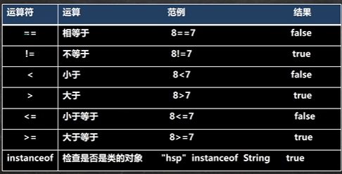

关系运算符组成的表达式，我们称为关系表达式

***

### 逻辑运算符

逻辑运算符是用于连接多个条件（多个关系表达式），最终的结果也是一个布尔类型

逻辑运算符有两种形式：

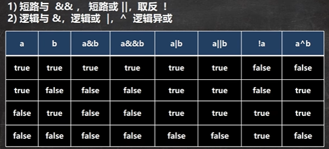

逻辑运算符规则：

- 逻辑与：`a & b`，当`a`和`b`同时为真时，结果为真，否则为假

- 逻辑或：`a | b`，当`a`和`b`有一个为真时，结果为真，否则为假

- 逻辑非：`!a`，取反运算，当`a`为真时，结果为假

- 短路与：`a && b`，当`a`和`b`同时为真时，结果为真，否则为假，如果`a`为假，则`b`语句将不会执行判断

  ```java
  int a = 4;
  int b = 9;
  if (a < 1 && ++b < 50) {
      System.out.println('ok');    // 不执行
  }
  System.out.println(a, b);   // 结果显示4,9
  ```

  但是对于逻辑与来说，如果`a`为假，`b`语句还会进行判断：

  ```java
  int a = 4;
  int b = 9;
  if (a < 1 & ++b < 50) {
      System.out.println('ok');    // 不执行
  }
  System.out.println(a, b);   // 结果显示4,10
  ```

- 短路或：`a || b`，当`a`和`b`有一个为真时，结果为真，否则为假，如果`a`为真，则`b`语句将不会执行判断

  但是对于逻辑或来说，如果`a`为真，`b`语句还会进行判断

- 逻辑异或：`a ^ b`，当`a`和`b`不同时，结果为真，否则为假

> - 在开发中，基本上都是使用短路与为主，因为前一个为假，后面的就不在判断执行了，效率高
> - 在开发中，基本上都是使用短路或为主，因为前一个为真，后面的就不在判断执行了，效率高

***

### 赋值运算符

赋值运算符就是将某个运算后的值，赋给指定的变量

- 基本赋值运算符  `=`
- 复合赋值运算符  `+=`、`-=`、`*=`、`/=`、`%=`

注意事项：

- 赋值运算符的运算顺序是从右往左

- 赋值运算符的左边只能是变量，右边可以是变量、表达式、常量值

- 复合赋值运算符会进行类型的强制转换

  ```java
  byte b = 2;
  b += 3;   // 等价于 b = (byte)(b + 3);    b + 3的类型是int，如果没有进行类型转换是编译不了的
  ```

***

### 三元运算符

基本语法：`条件表达式 ? 表达式1 : 表达式2;`

如果条件表达式为`true`，运算后的结果是表达式1；如果条件表达式为`false`，运算后的结果是表达式2

如果执行了表达式1，那么表达式2是不会执行的，反之同理

注意事项：

- 表达式1和表达式2要为可以赋给接收变量的类型（或可以进行自动转换）

  ```java
  int a = 3;
  int b = 4;
  int c = a > b ? 1.1 : 3.4;     // 报错，编译不通过，double类型不能赋值给int类型
  double d = a > b ? a ; b;  // 不会报错，可以进行自动的类型转换，int类型可以自动转化到double类型
  ```

***

### 位运算符

计算机内部处理信息都是采用二进制数来表示

原码、反码和补码的概念：

对于有符号的数而言，有以下的八个规则（要背下来）：

1. 二进制的最高位是符号位：0表示正数；1表示负数
2. 正数的原码、反码和补码都一样
3. 负数的反码=它的原码符号位不变，其他位取反
4. 负数的补码=它的反码+1；   负数的反码=负数的补码-1
5. 0的反码、补码都是0
6. `Java`没有无符号数，也就是说`Java`中的数都是有符号的
7. 在计算机运算的时候，都是以补码的方式进行运算的（补码可以解决正数和负数）
8. 当我们看运算结果的时候，要看他的原码

常见的位运算符有：位运算符的使用，先将两边的值先全部转成二进制，再得到这个二进制的补码，最后参与运算，运算后的结果先转回二进制的原码，再转回十进制

- `~`按位取反：0变1，1变0

  ~-2的运算过程：

  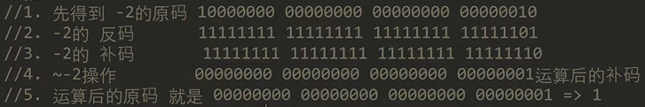

  ~2的运算过程：

  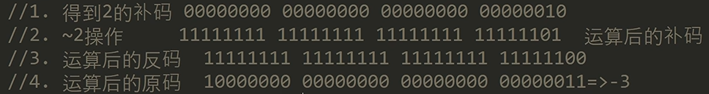

- `&`按位与：两位全为1，结果为1，否则为0

  2 & 3的运算过程：由于是`int`类型，占4个字节

  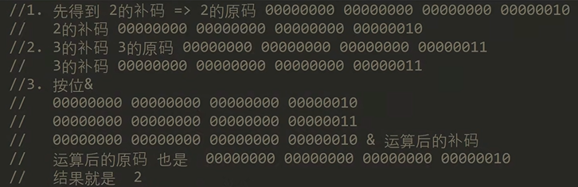

- `|`按位或：两位有一个为1，结果为1，否则为0

- `^`按位异或：两位一个为0一个为1，结果为1，否则为0

- `>>`算数右移：低位溢出，符号位不变，并用符号位补溢出的高位

  `1 >> 2;`结果为0，表示将十进制的1先转为二进制，再向右位移两位，本质就是`1/2/2`

- `<<`算数左移：符号位不变，低位补0

  ``1 << 2;`结果为4，表示将十进制的1先转为二进制，再向左位移两位，本质是`1*2*2`

- `>>>`无符号右移：低位溢出，高位补0

***

### 运算符的优先级

运算符有不同的优先级，下图中的运算符优先级从高到低依次为：

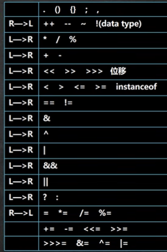

只有单目运算符、赋值运算符是从右往左的，其他运算符都是从左到右的

优先级由高到低大致优先级分类为括号、单目运算符、算数运算符、位移运算符、比较运算符、逻辑运算符、三元运算符、赋值运算符


## 键盘输入语句

在编程中，需要接收用户输入的数据，我们可以使用键盘输入语句来进行获取

使用键盘输入语句需要使用一个扫描器对象（`Scanner`）

```java
import java.util.Scanner;    // 将包java.util下的Scanner类进行导入
pubilc class Input {
    public static void main(String[] args) {
        // 创建Scanner对象
        Scanner myScanner = new Scanner(System,in);
        // 接收用户的输入，使用相关的方法
        System.out.println("请输入名字");
        String name = myScanner.next();   // 程序执行到这句话时，会等待用户进行输入
        
        System.out.println("请输入年龄");
        int age = myScanner.nextInt();
        
        System.out.println("请输入成绩");
        double score = myScanner.nextDouble();
    }
}
```


## 控制结构

在程序中，程序运行的流程控制决定程序是如何执行的，控制结构主要有三大流程控制语句

### 顺序控制

程序从上到下逐行执行，中间没有任何判断和跳转，顺序控制是程序默认的控制语句

***

### 分支控制

#### `if else`分支

分支控制是让程序有选择（根据判断进行选择）的执行，分支控制有三种形式：

- 单分支

  基本语法：

  ```java
  if(条件表达式) {
      执行代码块;
  }
  ```

  > 当条件表达式为`true`时，就会执行`{}`的代码，如果`{}`中只有一条语句，可以不使用`{}`进行包裹

- 双分支

  基本语法：

  ```java
  if(条件表达式) {
      执行代码块1;
  }
  else {
      执行代码块2;
  }
  ```

  > 当条件表达式为`true`时，执行代码块1，否则执行代码块2

- 多分支

  基本语法：

  ```java
  if(条件表达式1) {
      执行代码块1;
  }
  else if(条件表达式2) {
      执行代码块2;
  }
  ...
  else {
      执行代码块n;
  }
  ```

  > 当对应的表达式为`true`时，执行对应的代码块，如果条件表达式都不成立，则执行代码块n
  >
  > 多分支可以没有`else`，如果所有的条件表达式都不成立，则一个执行入口都没有

嵌套分支：在一个分支结构中又完整的嵌套了另一个完整的分支结构，里面的分支结构称为内层分支，外面的分支结构称为外层分支，但是建议分支不要超过3层，因为可读性不好

基本语法：

```java
if(条件表达式1) {
    if(条件表达式2) {
        执行代码块2;
    }
    else {
        执行代码块3;
    }
}
```

#### `switch`分支

基本语法：

```java
switch(表达式) {
    case 常量1:
        语句块1;
        break;
    case 常量2:
        语句块2;
        break;
    default:
        default语句块;
        break;
}
```

> 如果表达式的结果和`case`常量1匹配，就执行语句块1，如果没有匹配，就继续和`case`常量2进行匹配，以此类推，如果一个都没有匹配上，执行`default`语句块
>
> `break`表示退出`switch`语句
>
> 如果执行完一个`case`语句块后，没有执行`break`语句，那么不会退出`switch`语句，会继续进行后面`case`的语句块，不需要进行匹配，会直接穿透执行，同时，如果前面没有`break`的话还会执行`default`的语句块
>
> 对于`default`匹配项，有没有`break`是无所谓的，执行了`default`语句块都会退出`switch`语句

注意细节：

- 表达式的数据类型，应该和`case`后面的常量类型一致，或者是可以自动转换成可以相互比较的类型（如输入的是字符，而常量是`int`）

- `switch`（表达式）中表达式的返回值必须是

  ```java
  double c = 1.1;
  switch(c) {   // 报错double类型不能使用
      case 1.1:
          ...
  }
  ```

- `case`句子中的值必须是常量（具体的值），或者是计算表达式（得到的也是常量），不能是变量

- `default`句子是可选的，当没有匹配的`case`时，执行`default`

- `break`语句用来执行完一个`case`分支后使程序跳出`seitch`语句块，如果没有写`break`，程序会顺序执行到`switch`结尾

#### `if`和`switch`使用的选择

- 如果判断的具体数值不多，而且符合（`byte`、`short`、`int`、`char`、`enum`、`String`）这六种类型，建议使用`switch`语句
- 其他情况，对区间判断，对结果为`boolean`类型判断，使用`if`语句，`if`语句的使用范围更广

***

### 循环控制

循环控制就是让代码可以循环的执行

#### `for`循环

基本语法：

```java
for(循环变量初始化;循环条件;循环变量迭代) {
    循环操作(语句);
}
```

> 如果循环条件为`true`，就会执行一次循环操作

注意事项：

- 循环条件是返回一个布尔值的表达式

- `for(;循环条件;)`中的初始化和变量迭代可以其它地方，但是两边的分号不能省略

  ```java
  int i = 1;
  for(;i <= 10;) {
      循环操作(语句);
      i++;
  }
  ```

- 循环的初始值可以有多条初始化语句，但要求类型一样，并且中间用逗号隔开，循环变量迭代也可以有多条变量迭代语句，中间用逗号隔开

  ```java
  int count = 3;
  for(int i = 0, j = 0; i < count; i++, j += 2) {
      System.out.println(i, j);     // 0,0   1,2   2,4
  }
  ```

  编程思想：化繁为简（将复杂的需求先拆分一个个简单的需求，逐步完成），先死后活（先考虑固定的值，再转成可以灵活变化的值）

#### `while`循环

基本语法：

```java
循环变量初始化;
while(循环条件) {
    循环体(语句);
    循环变量迭代;
}
```

注意事项：

- 循环条件是返回一个布尔值的表达式
- `while`循环是先判断，再执行语句

#### `do..while`循环

基本语法：

```java
循环变量初始化;
do {
    循环体(语句);
    循环变量迭代;
}while(循环条件);
```

注意事项：

- `do..while`循环是先执行，再判断，也就是说至少会执行一次

#### 多重循环控制

将一个循环放在另一个循环体内，就形成了嵌套循环，一般建议使用两层即可，最多不要超过三层，否则代码可读性大大降低

实际上，嵌套循环就是把内层循环当外层循环的循环体，当只有内存循环的循环条件为`false`时，才会完全跳出内层循环，才可以结束外层的当次循环，开始外层的下一次循环

设置外层循环次数为`m`次，内层循环为`n`次，则内层循环体一共执行`m*n`次

```java
// 打印空心金字塔
public class HollowPyramids {
	public static void main(String[] args) {
		int totalLevel = 5;
		for(int i = 1; i <= totalLevel; i++) {
			for(int k = 1; k <= totalLevel - i; k++) {
				System.out.print(" ");
			}
			for(int j = 1; j <= 2 * i - 1; j++) {
				if (j == 1 || j == 2 * i - 1 || i == totalLevel) {
					System.out.print("*");
				}
				else {
					System.out.print(" ");
				}
			}
			System.out.println(" ");
		}
	}
}
```

> `System.out.print("*");`表示输出后不换行
>
> `System.out.println("*");`表示输出后换行

#### `break`关键字

在循环语句的流程控制中，我们可以使用`break`语句来终止某个语句块的执行

基本语法：

```java
{
    ...
    break;
}
```

> 执行到`break`时跳出整个循环，用于提前终止循环
>
> ```java
> for(int i = 0; i < 10; i++) {
>     if(i == 3) {
>         break;
>     }
>     System.out.print(i);
> }
> // 结果输出  012
> ```

`break`语句出现在多层嵌套语句块中时，可以通过标签指明要终止的是哪一层语句块

```java
label1: {   ......
label2:		{   ......
label3:			{   ......
    				break label2;
                 	......
				}    
			}    
        }
```

> `break`语句可以指定退出到哪层
>
> `label1`是标签，名称由程序员指定，`break`后指定到哪个`label`，就退出到哪里
>
> 如果没有指定`break`，则默认退出最近的循环体
>
> 在实际开发中，尽量不要使用标签，会导致可读性变差

#### `continue`关键字

`continue`语句用于结束本次循环，继续执行下一次循环

基本语法：

```java
{
    ...   
    continue;
    // 执行了continue语句，本次循环后面的内容就不执行了
}
```

如果`continue`语句出现在多层嵌套的循环语句体中，可以通过标签指明要跳出哪一层循环

#### `return`关键字

`return`通常与方法函数一起使用，表示跳出所在的方法，如果`return`写在`main`方法中，会退出主程序


## 数组

数组可以存放多个同一类型的数据，数组也是一种数据类型，是引用类型

数组就是一组数据

数组的定义：

```java
double[] newArray = {1.2, 2, 3.5};
```

> `double[] newArray `等价于`double newArray[] `
>
> `double[]`表示声明`double`类型的数组，数组中的数据都应该是`double`类型
>
> `newArray`表示定义的数组名
>
> `{1.2, 2, 3.5}`表示数组的值（数组的元素），我们可以通过元素的下标来进行数组中具体元素的访问`[i]`
>
> 下标是从0开始编号的，表示数组中的第一个元素

数组可以通过`for`循环进行遍历，从而读取数组中的每个元素：

```java
double[] newArray = {1.2, 2, 3.5};
for (int i = 0; i < newArray.length; i++) {
    System.out.println(newArray[i]);
}
```

注意事项：

- 数组是多个相同类型数据的组合，实现对这些数据的统一管理

- 数组中的元素可以是任何数据类型，包括基本类型和引用类型，但不能混用

  如果满足自动类型转换的，那么可以混合使用

- 数组创建后，如果没有赋值，有默认值，不同的类型默认值不一样：`int 0`、`short 0`、`byte 0`、`long 0`、`float 0.0`、`double 0.0`、`char \u0000`、`boolean false`、`String null`

- 使用数组的步骤：1.声明数组并开辟空间；2.给数组各个元素赋值；3.使用数组

- 数组的下标是从0开始的

- 数组下标必须在指定范围内使用，下标的最大值是数组的长度减一，否则会报错：下标越界异常

- 数组属于引用类型，数组的数据类型是对象`object`

***

### 动态初始化

动态初始化方式一：`数据类型 数组名[] = new 数据类型[大小];`

如：`int a[] = new int[5];`   创建了一个数组，名字为`a`，存放5个`int`类型的数据，变量`a[0]`就指向了数组中的第一个元素

动态初始化方式二：

- 先声明数组：`数据类型 数组名[];`      如：`int a[];`   内存中有了数组`a`变量，但是是空值，没有返回空间
- 再创建数组：`数组名 = new 数据类型[大小];`     如：`a = new int[10];`    内存中开辟了空间

***

### 静态初始化

直接在声明的时候给定具体的值：`数据类型 数组名[] = {元素值, 元素值, ...};`

***

### 数组赋值机制

对于基本数据类型赋值，这个值就是具体的数据，且互相不影响，这种赋值方式为值拷贝，但是对于数组进行赋值，数组在默认情况下是引用传递，赋的值是地址，赋值方式为地址拷贝或者引用拷贝

```java
int arr1[] = {1, 2, 3};
int arr2[] = arr1;     
arr2[0] = 10; // arr1数组的第一个值也变成了10，数组arr2的变化会影响arr1的变化，两个数组共有一共内存地址
```

从内存地址的角度进行分析：

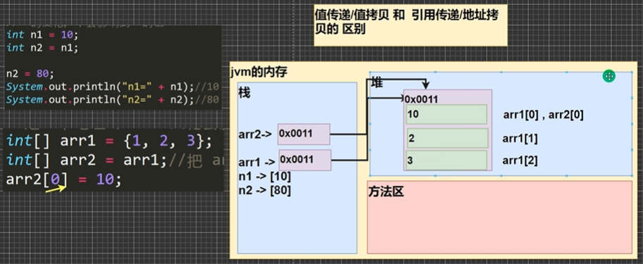

> 在`jvm`中，内存由三个部分组成：栈、堆和方法区
>
> 对于值传递\值拷贝：会在栈中开辟一块空间（基本类型的存储都是在栈中开辟空间的），如果将`n1`赋值给`n2`，会将值拷贝一份，放到一个新开辟的内存空间，后续`n2`的值发生改变，不会对`n1`的值造成任何影响
>
> 对于引用传递\地址拷贝：数组会在栈中开辟一块空间，用于存放地址，地址的具体内容在堆中存放，通过地址可以访问到堆中的数据，如果数组进行赋值，会将地址进行拷贝，但是指向的还是同一个区域，所有对`arr2`数组的内容进行修改，会影响`arr1`的内容

***

### 数组的拷贝

经过数组的赋值机制，我们知道，我们对数组的赋值只是地址拷贝，两个数组公用一个内存地址

如果我们就想要得到一个完整的数组，我们需要进行数组的拷贝，这样两个数组的数据空间是独立的

```java
int arr1[] = {10, 20, 30};
// 为arr2开辟一个新的数据空间，大小和arr1数组一样
int arr2[] = new int[arr1.length];
for(int i = 0; i < arr1.length; i++) {
    arr2[i] = arr1[i];
}
```

***

### 数组的反转

将数组中的元素值进行反转，第一个元素变成最后一个

常见方法：

```java
int arr[] = {11, 22, 33, 44, 55, 66};
int length = arr.length;
int temp = 0;
for(int i = 0; i < length / 2; i++) {
    temp = arr[length - 1 - i];  // 使用临时变量进行保存
    arr[arr.length - 1 - i] = arr[i];
    arr[i] = temp;
}
```

逆序遍历：创建一个相等大小的新数组，逆序遍历，顺序拷贝，最后将原数组进行指向（原数组就会被垃圾回收）

```java
int arr[] = {11, 22, 33, 44, 55, 66};
int arr2[] = new int[arr.length];
for(int i = arr.length - 1; i >= 0; i--) {
    arr2[arr2.length - i] = arr[i]; 
}
arr = arr2;
```

***

### 数组的扩容

数组的扩容也叫数组的添加，可以实现动态的给数组添加元素，实现对数组的扩容

我们需要定义一个新的数组，其数组的大小是原先数组大小加一，将原数组的数组值依次进行拷贝，最后一个数组值存放新的内容，最后将原数组进行指向这个新的数组：

```java
int arr[] = {1, 2, 3};
int arr2[] = new int[arr.length + 1];
for(int i = 0; i < arr.length; i++) {
    arr2[i] = arr[i];
}
arr2[arr2.lengh - 1] = 4;
arr = arr2;
```

数组的缩减和数组的扩容思路类似

***

### 排序

排序是将多个数据，依指定的顺序进行排序的过程

排序的分类：

- 内部排序：将需要处理的所有数据都加载到内部存储器中进行排序，包括：交换式排序法、选择式排序法和插入式排序法
- 外部排序法：数据量过大，无法全部加载到内存中，需要借助外部存储进行排序，包括：合并排序法和直接合并排序法

#### 冒泡排序法

通过对待排序序列从前向后（从下标小的元素开始），依次比较相邻元素的值，若发现逆序则交换，使值较大的元素逐渐从前移向后部，就像水底下的气泡一样逐渐向上冒


> 有多少个元素，就进行了几轮的排序（可以看成是外层循环），每一轮排序会确定一个数的位置（如第一轮排序确定最大数，第二轮排序确定第二大的数）
>
> 当进行比较时，如果发现前面的数大于后面的数，就交换两个数的位置
>
> 每一轮的比较在逐渐减小（因为每一轮比较的数据量在减小）

代码实现：

```java
int arr[] = {24, 69, 80, 57, 13};
int temp = 0;
for (int i = 0; i < arr.length - 1; i++) {
    for (int j = 0; j <  arr.length - 1 - i; j++) {
        if(arr[j] > arr[j + 1]) {
            temp = arr[j];
            arr[j] = arr[j + 1];
            arr[j + 1] = temp;
        }
    }
    System.out.println("\n==第" + (i + 1) + "轮排序==");
    for(int j = 0; j < arr.length; j++) {
        System.out.print(arr[j] + "\t");
    }
}
```

***

### 查找

在`java`中，常见的查找方式有两种：

1. 顺序查找：先和第一个元素进行比较，如果不匹配，再和下一个元素进行比较，如果找到了，就将结果返回即可
2. 二分查找：对一个排列从小到大的有序数组进行查找，先查找中间这个数，如果匹配就返回，如果不匹配，就和中间这个数进行判断大小，如果要查找的数组比中间这个数大，就往右边（后面）查找，依次二分类推

***

### 二维数组

对于一维数组中的每一个元素，如果这个元素还是一个数组，我们将这个数组称为二维数组

动态初始化：`类型[][] 数组名 = new 类型[大小][大小];`    如：`int a[][] = new int[2][3];`

> 第一个大小表示包含几个一维数组；第二个大小表示一维数组中包含几个元素

定义二维数组（静态初始化）：`数据类型 数组名[][] = {一维数组, 一维数组};`    其中`[][]`可以写在数据类型的后面，二维数组的每一个元素都是一个一维数组，二维数组中只能放一维数组，不能放其他基本类型的数据

输出二维数组：

```java
int arr[][] = {{1, 2}, {2, 3}};
for(int i = 0; i < arr.length; i++) {   // 统计多少个一维数组
    // 遍历二维数组的每个元素
    // arr[i]表示二维数组的第i个元素
    // arr[i].length表示得到对应的一维数组的长度
    for(int j = 0; j < arr[i].length; j++) {
        System.out.print(arr[i][j]);
    } 
    System.out.println();  // 换行
}
```

> 对于二维数组，如果要访问第(i+1)个元素的第(j+1)个值，我们应该这样访问：`arr[i][j]`

二维数组在内存中的存在形式：（重要）

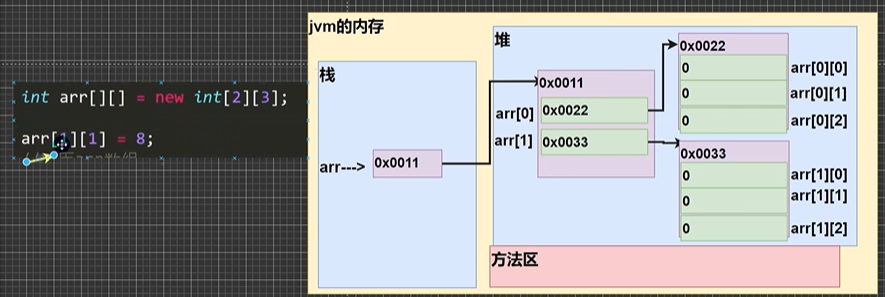

> 二维数组在栈中，通过一个地址指向堆中的一个空间，该空间中存放的还是地址，用于被一维数组进行指向，一维数组通过地址指向堆中的另一个空间，这个空间中存放具体的值

二维数组动态初始化--列数不确定方式：在`Java`中允许二维数组中的一维数组的长度可以不相同

创建如下方式的二维数组：（一共有三个一维数组，每个一维数组的长度不一致）

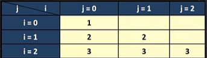

```java
int[][] arr = new int [3][];  // 创建了二维数组，一共有3个一维数组，但是列数不确定
for(int i = 0; i < arr.length; i++) {   // 遍历arr每个一维数组
    // 给每个一维数组开辟空间，如果没有给一维数组new，那么arr[i]就是null
    arr[i] = new int[i + 1];
    
    // 遍历一维数组，并给一维数组的每个元素赋值
    for(int j = 0; j < arr[i].length; j++) {
        arr[i][j] = i + 1;   // 赋值
    }
}
```

输出10行的杨辉三角：

```java
int arr[][] = new int[10][];
for(int i = 0; i < arr.length; i++) {
    arr[i] = new int[i + 1];
    for(int j = 0; j < arr[i].length; j++) {
        if(j == 0 || j == arr[i].length - 1) {
            arr[i][j] = 1;
        }
        else {
            arr[i][j] = arr[i - 1][j] + arr[i - 1][j - 1];
        }
    }
}
```

注意事项：

- 对于二维数组的声明方式，有以下几种合法的方法：`int[][] arr`、`int[] arr[]`和`int arr[][]`
- 二维数组的本质是由多个一维数组构成的，它的各个一维数组的长度可以相同，也可以不相同


## 类与对象

单独使用定义变量的方式和数组的方式进行大量数据的管理，效率低下

在面向对象中，我们使用对象来体现各种各样的事物，对象中有两个关键的内容：属性（内在的特征，与自身关联，如年龄，名字等）和行为（行为方法。如修改名称等），将属性提取出来，就形成了一个类（类是一个数据类型）

类与对象的关系示意图：

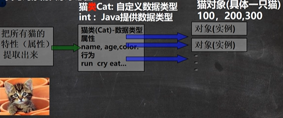

> 将猫类的所有属性提取出来，形成一个猫类的数据类型（自己定义的数据类型，`int`是`Java`系统提供的数据类型），这个数据类型有以下常用的属性：`name`、`age`等，当然所有的猫都有行为，如：跑、叫和吃等
>
> 对于一个猫类，我们可以使用这个类定义许多的猫，这些猫就是对象（简而言之，我们可以通过猫类来创建猫对象，即创建一只具体的猫）

```java
// 定义一个猫类（自定义的数据类型）
class Cat {
    String name;
    int age;
    String color;
}

// 使用OOP面向对象解决
// 实例化一只猫对象
Cat cat1 = new Cat();
// 为对象添加属性
cat1.name = "小白";
cat1.age = 3;
cat1.color = "白色";
```

综上所述：类就是一个数据类型，对象就是一个具体的实例，从类到对象有几种说法：

- 创建了一个对象
- 实例化一个对象
- 把类实例化

***

### 对象的内存布局

`Java`内存的结构分析：

- 栈：一般存放基本数据类型（局部变量）
- 堆：存放对象（自定义类，数组等）
- 方法区：常量池（常量、比如字符串），类的加载信息（自定义的类信息只会加载一次）

对象在内存中的存在形式（重要）：

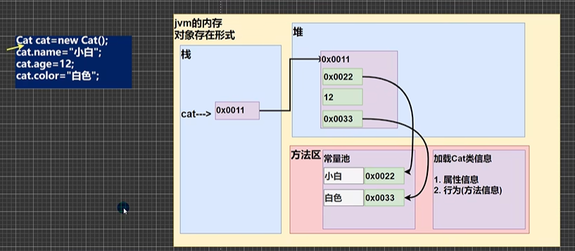

> 字符串是一个引用类型，在堆中存放的是地址，实际上将数据放在方法区中的常量池中，基础数据类型的值会直接存放到堆中
>
> 在执行实例化对象的时候，会将类的信息（属性信息和方法信息）加载到方法区中
>
> `Java`创建对象流程的简单分析：
>
> 1. 先加载`Cat`类信息（属性和方法信息，只会加载一次）
> 2. 在堆中分配空间，进行默认初始化（和数组初始化类似）
> 3. 把地址赋值给`cat`（创建的对象名），对象名就指向这个对象
> 4. 进行指定初始化，如`cat.age = 12;`

将实例化的对象赋值给另一个对象名，`Person p2 = p1;`   把`p1`赋值给了`p2`，或者说让`p2`指向`p1`，是引用类型，实现的是地址拷贝，指向的都是同一个堆中的对象，其内存分配过程如下：

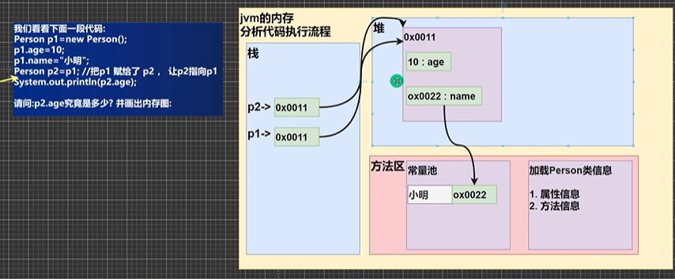

小练习：

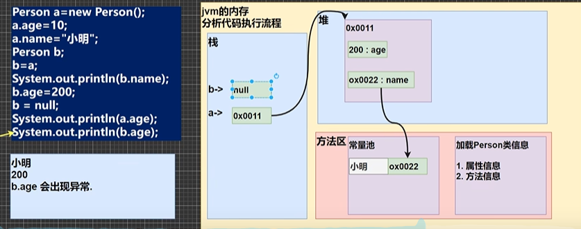

***

### 属性的概念

属性也叫成员变量，或者叫`field`字段，属性是类的一个组成部分，一般是基本数据类型，也可以是引用类型（对象、数组）

```java
public class Object {
    // main方法
    public static void main(String[] args) {
        // 实例化一个对象
        // cat1是对象名，new Cat()是真正的对象，在堆中创建了对象空间，将地址与对象名的指向地址联系起来
        Cat cat1 = new Cat();
        // 访问属性
        cat1.name;
    }
}

// 定义一个猫类（自定义的数据类型）
class Cat {
    // 定义属性/成员变量
    String name;
    int age;
    String color;
    String[] master;  // 属性可以是引用数据类型
}
```

注意事项：

- 属性的定义语法同变量的定义，但是多了一个访问修饰符的概念：`访问修饰符 属性类型 属性名;`

  访问修饰符是用于控制属性的范围，有四种访问修饰符：`public`、`proctected`、`默认情况`、`private`

- 属性的定义类型可以为任意类型，包含基本类型或引用类型

- 属性如果不赋值，有默认值，规则和数组一致

***

### 方法的概念

成员方法的定义：

```java
访问修饰符 返回的数据类型 方法名(形参列表..) {
    方法体语句;
    return 返回值;
}
```

> - 访问修饰符：控制方法的使用范围，常用的方法修饰符有四个
>
> - 形参列表：表示成员方法的输入
>
>   - 一个方法可以有0个参数，也可以有多个参数，中间使用逗号隔开
>   - 参数类型可以为任意类型，包含基本类型或引用类型，同一列表的参数类型可以是不同的类型
>   - 调用参数的方法时，一定对应着参数列表传入相同类型或兼容类型（可以进行自动转换）的参数
>   - 方法定义时的参数称为形式参数，简称行参；方法调用时传入的参数称为实际参数，简称实参，实参和形参的类型要一致或兼容，个数、顺序必须一致
>
> - 返回的数据类型：表示成员方法输出，`void`表示没有返回值，返回的类型可以为任意类型，包含基本类型和引用类型，但是接收返回值时，需要声明与返回值同类型的变量去接收
>
>   一个方法最多只有一个返回值，如果需要多个返回值，我们可以返回数组
>
>   ```java
>   // 返回两个数的和差
>   class Num {
>       public int[] getSumAndSub(int n1, int n2) {
>           int res[] = new int[2];
>           res[0] = n1 + n2;
>           res[1] = n1 - n2;
>           return res;
>       }
>   }
>   ```
>
> - 方法主体：表示为了实现某一功能代码块，可以为输入、输出、运算、分支、循环、方法调用，但是在方法主体中不能再定义方法，即：方法不能嵌套定义
>
> - `return`语句不是必须的，如果方法要求有返回数据类型，则方法体中最后的执行语句必须为`return`值，而且要求返回值类型必须和`return`的值类型一致或者兼容（可以自动转换的）
>
>   ```java
>   // 类型一样，编译通过
>   public double f1() {
>       return 1.1;
>   }
>                                                                                       
>   // 兼容（可以自动转换），编译通过
>   public double f1() {
>       int n = 1;
>       return n;
>   }
>                                                                                       
>   // 类型不一致，且不能自动转换，编译不通过
>   public int f1() {
>       return 1.1;
>   }
>   ```
>
>   如果方法是`void`，则方法中可以没有`return`语句，或者只写`return;`，但是不能返回具体的内容

成员方法简称为方法，用于声明一些具体的行为

```java
public class Object {
    // main方法
    public static void main(String[] args) {
        // 实例化一个对象
        Person person1 = new Person();
        // 调用方法
        person1.speak();
        person1.cal(6);
        int data = person1.getSum(3, 6);  // 将方法返回的值赋给data
    }
}

// 定义一个猫类（自定义的数据类型）
class Person {
    // 定义属性/成员变量
    String name;
    int age;
    // 定义方法/成员方法
    // public表示方法是公开的；void表示方法没有返回值；speak表示方法名
    public void speak() {
        System.out.println("我是一个好人");
    }
    // (int n)表示形参列表，表示当前有一个形参n，可以接收调用者的输入
    public void cal(int n) {
        int res = 0;
        for(int i; i <= n; i++) {
            res += i;
        }
        System.out.println("计算结果=" + res);
    }
    // 方法有返回值的形式
    // int表示方法执行后，返回一个int值
    public int getSum(int num1, int num2) {
        int res = num1 + num2;
        return res;
    }
}
```

方法调用机制的原理图：（重要）

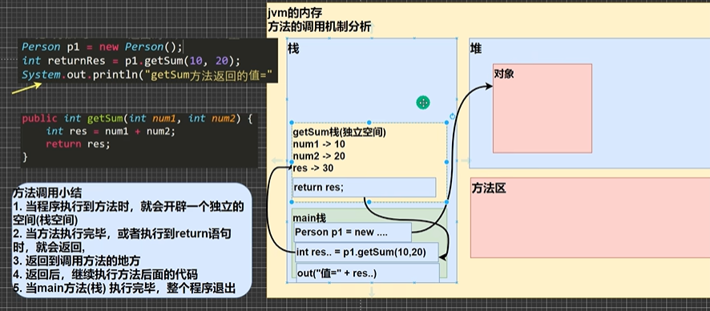

首先会在栈中创建一个栈空间（`main`栈空间），当执行了方法时，会在开辟一个独立的栈空间（栈和栈之间不会相互影响），进行形参的赋值，执行完方法后，会将结果进行返回，当返回之后，这个临时开辟的独立栈空间就会被释放

成员方法的好处：减少代码冗余，提高了代码的复用性；同时可以将实现的细节封装起来，然后供其他用户来调用

方法调用细节：

- 同一个类中的方法调用：直接调用即可

  ```java
  class A {
      public void print(int n) {
          System.out.println("print()方法被调用 n=" + n);
      }
      
      public void sayOk() {
          // 调用同一个类中的print()方法
          print(10);
      }
  }
  ```

- 跨类中的方法A类调用B类的方法：需要通过对象名调用，跨类的方法调用共和方法访问修饰符相关

  ```java
  class A {
      public void print(int n) {
          System.out.println("print()方法被调用 n=" + n);
      }
  }
  
  class B {
      public void sayOk() {
          // 创建一个A类的对象
          A a = new A();
          // 调用a对象的方法
          a.print(10);
      }
  }
  ```

#### 方法的传参机制

方法的传参机制在编程中是非常重要的：

- 对于基本数据类型的传参机制，传递的是值（值拷贝），形参的任何改变不影响实参

  ```java
  public class MethodParameter {
  	public static void main(String[] args) {
          int a = 10;
          int b = 20;
          // 实例化AA对象
          AA obj = new AA();
          obj.swap(a, b);
          System.out.prinln(a, b);    // 10 20
  	}
  }
  
  class AA {
      public void swap(int a, int b) {
          System.out.prinln(a, b);   // 10 20
          int temp = a;
          a = b;
          b = temp;
          System.out.prinln(a, b);   // 20 10
      }
  }
  ```

  通过内存来进行辅助理解：

  调用`obj.swap(a, b);`方法，传递的是10和20，`swap()`方法中接收的是10和20，两个栈是独立的空间，其基本数据类型的变量是不冲突的

- 对于引用数据类型的传参机制，传递的是地址（传递的也是值，但这个值是地址），形参的改变会影响实参

  ```java
  public class MethodParameter {
  	public static void main(String[] args) {
          int[] arr = {1, 2, 3};
          BB obj = new BB();
          obj.test(arr);    // 200 2 3
          
          // 遍历数组
          for(int i = 0; i < arr.length; i++) {
              System.out.print(arr[i] + "\t");
          }
          System.out.println();    // 200 2 3
  	}
  }
  
  class BB {
      public void test(int arr) {
          arr[0] = 200;   // 修改了传递进来的数组元素
          // 遍历数组
          for(int i = 0; i < arr.length; i++) {
              System.out.print(arr[i] + "\t");
          }
          System.out.println();
      }
  }
  ```

  ```java
  public class MethodParameter {
  	public static void main(String[] args) {
          Person p = new Person();
          p.name = "jlc";
          p.age = 25;
          BB b = new BB();
          b.test(p);
          System.out.println(p.age);   // 100
  	}
  }
  
  class Person {
      String name;
      int age;
  }
  
  class BB {
      public void test(Person p) {
          p.age = 100;
      }
  }
  ```

  小变化：

  ```java
  public class MethodParameter {
  	public static void main(String[] args) {
          Person p = new Person();
          p.name = "jlc";
          p.age = 25;
          BB b = new BB();
          b.test(p);
          System.out.println(p.age);   // 10
  	}
  }
  
  class Person {
      String name;
      int age;
  }
  
  class BB {
      public void test(Person p) {
          p = null;
      }
  }
  ```

  `BB`类中的将传入的`p`对象设置为`null`，是切断了当前方法栈空间中的`P`指向的堆中的对象，但是不会影响原先`main`栈空间中`p`的指向，`p`还是指向堆中的对象，因此，其值还是25

  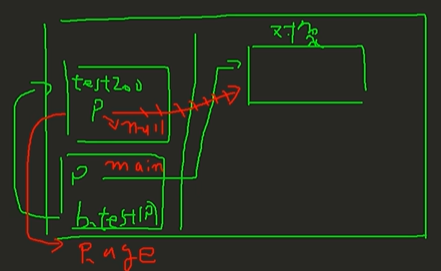

#### 方法的递归调用

递归调用就是方法调用自己，每次调用时传入不同的变量，递归有助于解决复杂的问题，同时让代码更简洁

递归调用的本质仍然是方法的调用

递归使用规则：

- 执行一个方法时，就创建一个新的受保护的独立空间（栈空间）
- 一般传递的是基本类型数据，所以方法的局部变量是独立的，不会相互影响
- 如果方法中使用的是引用类型的变量，如数组，就会共享该引用类型的数据
- 递归必须向退出递归的条件逼近，否则就是无限递归
- 当一个方法执行完毕，或者遇到`return`，就会返回，遵守谁调用，就将结果返回给谁，同时当方法执行完毕或者返回时，该方法也就执行完毕了，开辟的空间也会清除掉

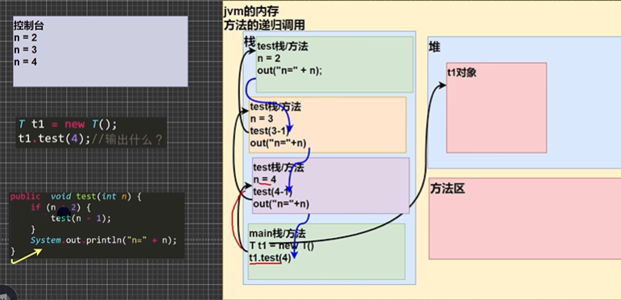

每一次调用方法的递归，都会在栈空间中开辟一块方法空间，当方法执行完后，方法空间会消失，同时会返回到上一个调用空间，在哪里调用就返回给哪里，依次递归的返回，最后返回到`main`方法中，执行完后退出

##### 阶乘

```java
// 递归调用---阶乘
public int factorial(int n) {
    if(n == 1) {
        return 1;
    }
    else {
        return factorial(n - 1) * n;
    }
}
```

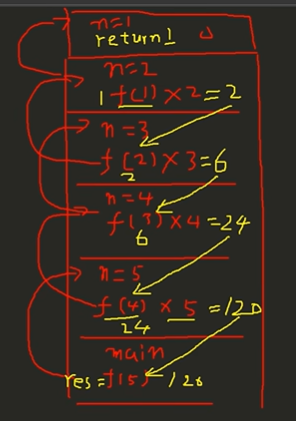

##### 斐波那契

斐波那契是指，一个数为前面两个数的和

```java
// 递归调用---斐波那契
public int fibonacci(int n) {
    if(n == 1 || n == 2) {
        return 1;
    }
    else {
        return fibonacci(n - 1) + fibonacci(n - 2);
    }
}
```

#### 方法的重载

在`Java`中允许同一个类中有多个同名方法的存在，但要求形参列表不一致，方法重载有利于减轻了起名和记名的麻烦，如系统定义的`System.out.println()`方法，方法名都是`println()`，但是可以输出数值，字符串等，是由于使用了方法的重载，设置了同名的方法，但是传递的形参列表不一致

```java
class MyCalculator {
    // 计算两个整数的和
    public int calculate(int n1, int n2) {
        return n1 + n2;
    }
    // 计算一个整数，一个浮点数的和
    public double calculate(int n1, double n2) {
        return n1 + n2;
    }
}
```

方法重载的注意事项：

- 方法名必须相同
- 形参列表必须不同（形参类型或个数或顺序，至少有一个是不同的，参数名无要求）
- 返回类型无要求（返回类型不是构成方法重载的条件）

#### 可变参数

`Java`允许将同一个类中多个同名同功能但参数个数不同的方法，重载成一个方法，但是这样要不断的重复编写，对于这个问题，我们可以通过可变参数进行简化

可变参数的基本语法：

```java
访问修饰符 返回类型 方法名(数据类型... 形参名) {}

// 对传入的所有参数进行求和
// int...表示接收的是可变参数，类型为int类型，可以接收多个int类型的参数（0-n个）
public int sum(int... nums) {
    int res = 0;
    // 使用可变参数的时候，我们可以将其当作数值进行使用，即传入的nums可以当作数组
    for(int i = 0; i < nums.length; i++) {
        res += nums[i];
    }
    return res;
}
```

注意事项：

- 可变参数的实参可以为0个或者任意多个

- 可变参数的实参可以为数组

  ```java
  public class VarParameterDetail {
  	public static void main(String[] args) {
          int[] arr = {1, 2, 3};
          T t = new T();
          t.f1(arr);
  	}
  }
  
  class T {
      public void f1(int... nums) {
          System.out.println(nums.length);
      }
  }
  ```

- 可变参数的本质就是数组

- 可变参数可以和普通类型的参数一起放在形参列表中，但必须保证可变参数在最后

- 一个形参列表中只能出现一个可变参数

***

### 克隆对象

克隆对象，要求新对象和原来对象是两个独立的对象，只是他们的属性和属性值完全相同

```java
public class MethodParameter {
	public static void main(String[] args) {
        Person p = new Person();
        p.name = "jlc";
        p.age = 25;
        MyTools myTools = new MyTools();
        Person p2 = myTools.copyPerson(p);
        // p和p2都是Person对象，但是是两个独立的对象，其属性和属性值相同
	}
}

class Person {
    String name;
    int age;
}

class MyTools {
    public Person copyPerson(Person p) {
        // 创建一个新对象
        Person p2 = new Person();
        p2.name = p.name;   // 将原来对象的名字赋值给p2.name
        p2.age = p.age;
        return p2;
    }
}
```

***

### 作用域

在面向对象编程中，变量的作用域是非常重要的知识点

在`Java`中，主要的变量就是属性（成员变量）和局部变量（在成员方法或者代码块中定义的变量）

- 全局变量：也就是属性，作用域为整个类体，全局变量可以不赋值，直接使用，因为有默认值
- 局部变量：除了属性之外的其他变量，作用域定义在它的代码块中，局部变量必须赋值后才能使用，因为它没有默认值

```java
class T {
    // 定义全局变量，作用域在整个T类中，可以在这个类的任意地方使用
    // 全局变量可以不进行赋值
    int age = 25;
    
    public void show() {
        // 定义局部变量，只能在当前的作用域中进行使用
        // 局部变量必须要进行赋值
        int n = 10;
        System.out.println(age);  // 在方法中使用全局变量
    }
}
```

注意事项：

- 属性和局部变量是可以重名的，访问时遵循就近原则
- 在同一个作用域中，比如同一个成员方法中，两个局部变量是不能重名的
- 属性（全局变量）生命周期较长，伴随着对象的创建而创建，伴随着对象的销毁而销毁；局部变量的生命周期较短，伴随着它的代码块的执行而创建，伴随着代码块的销毁而销毁，即在一次方法调用过程中，通过内存空间进行理解

全局变量/属性可以被本类使用，也可以被其他类使用（通过对象调用）

```java
class T {
    // 属性
    int age = 25;
}

class D {
    // 在其他类中调用T类中的属性
    // 先定义一个T类的对象
    public void test() {
        T t = new T();
        System.out.println(t.age);
    }
}
```

局部变量只能在本类中对应的方法中使用

全局变量/属性可以加修饰符；但是局部变量不能加修饰符

***

### 构造器

构造器也叫构造方法，主要作用是完成对新对象的初始化，我们可以通过构造器，在创建对象的时候，直接指定这个对象的具体属性值（即在创建对象时，系统会自动调用该类的构造器，完成对象的初始化）

基本语法：

```java
修饰符 方法名(形参列表) {
    方法体;
}
```

> - 构造器的修饰符可以默认，也可以是`public`、`protected`和`private`
> - 构造器没有返回值，也不能写`void`
> - 构造器的方法名和类的名字必须一样
> - 参数列表和成员方法一样的规则
> - 构造器的调用由系统完成，即在`new`的时候，系统会自动完成构造器中的方法

```java
public class Constructor01 {
	public static void main(String[] args) {
		// 当我们new一个对象时，直接通过构造器指定属性值
        Person p = new Person("jlc", 25);
	}
}

class Person {
    String name;
    int age;
    // 构造器
    public Person(String pName, int pAge) {
        name = pName;
        age = pAge;
    }
}
```

注意事项：

- 一个类可以定义多个不同的构造器，即构造器的重载，如我们可以再给`Person`类定义一个构造器，用来创建对象的时候，只指定姓名，不需要指定年龄，那么后续初始化对象的时候，年龄就是默认值
- 构造器是完成对象的初始化，并不是创建对象
- 如果程序员没有定义构造器，系统会自动给类生成一个默认无参构造器（也叫默认构造方法），如`Person() {}`，可以通过反编译`javap Person.class`进行查看
- 一旦定义了自己的构造器，默认的构造器就被覆盖了，就不能再使用默认的无参构造器，除非显示的定义一个，即：`Person() {}`

#### 引入构造器后的对象创建流程

引入构造器后的对象创建流程是一个经典的面试题

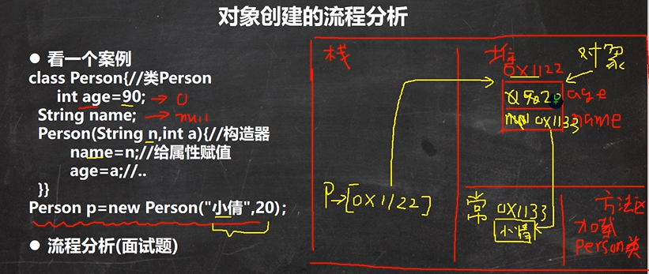

> 1. 先在方法区中加载类信息
> 2. 在堆中开辟空间
> 3. 对属性进行默认初始化
> 4. 根据是否赋值，进行显式的初始化（如`age = 90;`）
> 5. 通过构造器进行属性初始化，引用类型的属性值在常量池中，通过地址进行指向，基本类型的数据直接在堆空间中修改
> 6. 最后将堆中的地址进行放回，供实例化的对象`p`进行指向（真正的对象在堆中，`p`只是对象的引用，只是一个对象名）

上述流程简而言之：

1. 加载`Person`类信息（`Person.class`），只会加载一次
2. 在堆中分配空间（地址）
3. 完成对象的初始化
   1. 默认初始化 `age = 0  name = null`
   2. 显式初始化 `age = 90`
   3. 构造器的初始化 `age = 20  name = “小倩”`
4. 对象在堆中的地址，返回给`p`（对象名，也可以理解为对象的引用）

***

### `this`关键字

构造器的输入参数名不是非常友好，如果能将`pName`改成`name`就好了，但是由于变量作用域的原因，`name`的值最后是`null`，这时我们就要引入`this`关键字来解决

```java
public class Constructor01 {
	public static void main(String[] args) {
		// 当我们new一个对象时，直接通过构造器指定属性值
        Person p = new Person("jlc", 25);
	}
}

class Person {
    String name;
    int age;
    // 构造器
    public Person(String name, int age) {
        // this.name表示当前对象的name属性   后面的name是局部变量，就近访问，找不到在访问属性
        this.name = name;   
        this.age = age;
    }
}
```

`java`虚拟机给每个对象分配了`this`，代表当前对象，比如，人是一个对象，这个人说我的，就表示`this`

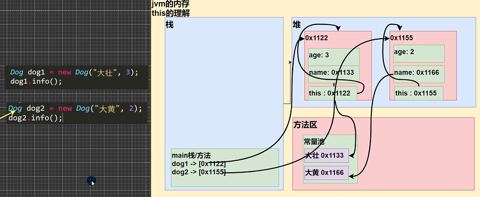

在堆中开辟空间后，除了属性，还有一个隐藏的属性`this`，引用的地址是对象的地址，指向的是对象自己

总之，哪个对象调用，`this`就代表哪个对象

注意事项：

- `this`关键字可以用来访问本类的属性、方法和构造器

- `this`用于区分当前类的属性和局部变量

- 访问成员方法的语法：`this,方法名(参数列表);`

  ```java
  class T {
      public void f1() {
          System.out.println("f1方法");
      }
      public void f2() {
          System.out.println("f2方法");
          // 调用本类的f1()方法
          // 方式一：传统方法
          f1();
          // 方式二：使用this关键字
          this.f1();
      }
  }
  ```

- 访问构造器语法：`this(参数列表);`   只能在构造器中使用（即只能在构造器中访问另一个构造器）

  ```java
  class T {
      public T() {
          // 通过this关键字访问另一个构造器
          this("jlc", 25);
          System.out.println("T()构造器");
      }
      public T(String name, int age) {
          System.out.println("T(String name, int age)构造器");
      }
  }
  ```

  > 注意：访问构造器语法：`this(参数列表);`，必须放在第一条语句中

- `this`不能再类定义的外部使用，只能在类定义的方法中使用

  ```java
  class Person {
      String name = "jlc";
      int age = 25;
      public void f() {
          String name = "abc";
          System.out.println(name, age);   // abc, 25
          System.out.println(this.name, this.age);   // jlc, 25
      }
  }
  ```

  > `this.name`表示当前对象的`name`属性   后面的`name`是局部变量，就近访问，找不到在访问属性


## `API`

`Java`系统官方为我们提供了基本的编程接口（系统提供的类和相关方法）

我们可以去`Java API`文档中快速的查找需要的`API`：[Java 8 中文版 - 在线API手册 - 码工具](https://www.matools.com/api/java8)

### `Java`类的组织形式

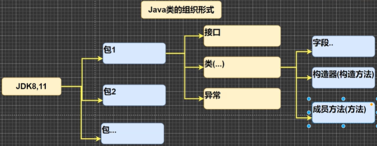

我们查询文档的思路是：按照包去查找类，再去查找具体的方法，如果我们不知道这个类在哪个包的下面，我们可以直接进行搜索，找到这个类

***

### 包的概念

包的原理就是创建不同的文件夹\目录来保存类文件

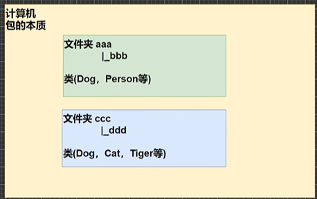

对于相同名称的类，在不同文件夹下是允许的，文件夹就相当于对应一个包

包具有三个主要的作用：

- 区分相同名字的类，放在不同的包下
- 当类很多时，使用包可以很好的管理类
- 包可以访问范围

包的基本语法：

```java
package com.myabc;
```

> - `package`关键字，表示打包
> - `com.myabc`表示包名
>
> 注意事项：
>
> 1. `package`的作用是声明当前类所在的包，需要放在`class`类的最上面，一个类中最多只有一句`package`
> 2. 我们在导入包的时候，`import`命令的位置放在`package`的下面，在类定义前面，可以有多句且没有顺序的要求
>
> ```java
> package com.myabc;
> 
> import java.util.Scanner;
> 
> public class Dog {
>     public static void main(String[] args) {
>         Scanner myScanner = new Scanner(System.in);
>     }
> }
> ```

在不同的包下创建`Dog`类：

在`src`文件夹下建立两个新的文件夹，代表两个不同的包，新建文件夹分别为`com.abc`和`com.efg`

其中`com`表示第一级目录，`abc`和`efg`表示`com`目录下的两个下一级目录

在`abc`文件夹下创建一个`Java Class`类`Dog`，我们只能在`abc`文件夹下创建一个`Dog`类，但是我们可以在`efg`文件夹下创建同名字的类`Dog`

我们后续在其他文件中使用`Dog`类，就需要进行对具体包中的类进行引用，如：

```java
import com.abc.Dog;

public class Test {
    public static void main(String[] args) {
        Dog dog = new Dog();
    }
}
```

如果引入不同包下名称相同的类，系统会在第二个类前面加上包名：

```java
import com.abc.Dog;

public class Test {
    public static void main(String[] args) {
        Dog dog = new Dog();
        com.efg.Dog dog1 = new com.efg.Dog();  // 不会直接引入了，引入会报错
    }
}
```

#### 包的命名

包的命名规则：只能包含数字、字母、下划线、小圆点，但不能用数字开头，不能是关键字和保留字

```java
demo.class.exec1   // 不正确，class是关键字
demo.12a   // 不正确，12a不能以数字开头
demo.ab12.oa   // 正确
```

包的命名规范：一般是小写字母+小圆点，具体而言：`com.公司名.项目名.业务模块名`

如：`com.sina.crm.user`    用户模块

#### 常用的包

一个包下包含很多的类，`Java`中常用的包有：

- `java.lang.*`：`lang`包是基本包，默认引入，不需要额外进行引入
- `java.util.*`：`util`包，系统提供的工具包，工具类，使用`Scanner`
- `java.net.*`：网络包，网络开发
- `java.awt.*`：`Java GUI`界面开发时需要引用的包

#### 包的引入

我们引入一个包的主要目的是要使用该包下面的类，如`import java.util.Scanner;`，引入了`java.util.*`包下面的`Scanner`类

我们也可以将整个包下的所有类都进行引入\导入：`import java.util.*;`  （推荐需要什么再导入什么）


## 面向对象编程

面向对象编程有三大特征：封装、继承和多态

类的五大成员：(1) 属性 (2) 方法 (3) 构造器 (4) 代码块 (5) 内部类

### 访问修饰符

`Java`一共提供了四种访问控制修饰符，用于控制方法和属性（成员变量）的访问权限（范围）：

- `public`：公开级别，对外公开
- `protected`：受保护级别，对子类和同一个包中的类公开
- 默认级别：没有修饰符号，向同一个包类公开
- `private`：私有级别，只有类本身可以访问，不对外公开

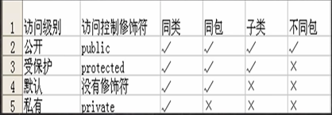

注意事项：

- 修饰符可以用来修饰类中的属性，成员方法以及类
- 只有默认的和`public`修饰符才能修饰类，其他两个修饰符不能修饰类，并且遵循上述访问权限的特点
- 成员方法的访问规则和属性完全一样

对于类中的四个属性，分别使用不同的访问修饰符进行修饰：

```java
package com.jlctest.modifier;

public class A {
    public int  n1 = 100;
    protected int n2 = 200;
    int n3 = 300;
    private int n4 = 400;
    
    // 本类的方法是可以访问到上述不同修饰符的属性
    public void m1() {
        System.out.println(n1, n2, n3, n4);
    }
}
```

在同包中创建一个B类：

```java
package com.jlctest.modifier;

public class B {
    A a = new A();    // 同一个包中，不需要对同包下的类进行引入
    // 在同一个包下，可以访问 public、protected和默认的属性或方法，但是不能访问私有的属性或方法
    System.out.println(a.n1, a.n2, a.n3);   // a.n4访问不到
}
```

在不同包中创建一个C类：

```java
package com.jlctest.modifier2;

public class B {
    A a = new A();    // 同一个包中，不需要对同包下的类进行引入
    // 在不同包下，只能访问 public修饰的属性或方法，不能访问protected、默认的和私有的属性或方法
    System.out.println(a.n1);   // a.n2   a.n3  a.n4访问不到
}
```

***

### 封装

封装就是把抽象出的数据（属性）和对数据操作的方法封装在一起，数据被保护在内部，程序的其他部分只有通过被授权的操作（方法），才能对数据进行操作。对电视机的封装操作就是典型的封装，开关等按键被暴露出来了

封装有以下的好处：

- 隐藏了实现细节，只需在调用时传递参数即可
- 可以对数据进行验证（对于一些非常不合理的数据进行验证处理，如`age = 1000;`，显然是不合理的），保证安全合理

#### 封装步骤

1. 将属性进行私有化`private`，在外部不能直接的修改属性

2. 提供一个公共（`public`）的`set`方法，用于属性判断并赋值

   ```java
   public void setXxx(类型 参数名) {  // xxx表示某个属性
       // 加入数据验证的业务逻辑
       属性 = 参数名;
   }
   ```

3. 提供一个公共（`public`）的`get`方法，用于获取属性的值

   ```java
   public XX getXxx() {   // xxx表示某个属性
       // 权限判断
       return xx;
   }
   ```

封装小案例：封装一个`Person`类，不能随便查看人的年龄，工资等隐私，并对设置的年龄进行合理的验证（1-120岁之间），年龄合理就设置，否则使用默认的年龄，工资不能直接查看，`name`的长度在2-6个字符之间，具体封装如下：

```java
package com.jlctest.encap;

public class Encapsulation01 {
    Person person = new Person();
    person.setName("jlc");
    person.setAge("25");
    person.setSalary(20000);
    // 不能通过person.salary进行访问当前对象的薪水，只能通过person.getSalary()进行薪水的访问
    // 读取信息
    System.out.println(person,info());
}

class Person {
    public String name;   // 名字公开
    private int age;     // 年龄私有化
    private double salary;  // 工资私有化
    
    // 给每个属性提供set和get方法，可以使用快捷键alt+insert，选择Getter and Setter
    // 之后根据要求来完善代码
    public void setName(String name) {
        // 对名字长度的校验
        if (name.length() >= 2 && name.length() <= 6) {
            this.name = name;
        }
        else {
            System.out.println("名字长度不合法");
            // 设置默认的名字
            this.name = "null";
        }
    }
    public String getName() {
        return name;
    }
    public void setAge(int age) {
        // 合理范围判断
        if (age >= 1 && age <= 120) {
            this.age = age;
        }
        else {
            System.out.println("年龄要在1-120之间");
            // 不符合范围设置给定的默认值
            this.age = 18;
        }
    }
    public int getAge() {
        return age;
    }
    public void setSalary(double salary) {
        this.salary = salary;
    }
    public double getSalary() {
        // 可以在这里增加对当前对象的权限判断
        return salary;
    }
    
    // 写一个方法，返回属性信息
    public String info() {
        return "信息为： name:" + name + "age:" + age + "salary:" + salary;
    } 
}
```

#### 封装结合构造器

使用构造器会导致封装的过滤校验机制失效，如果我们不希望校验方法失效，我们可以将`set`方法在构造器中进行调用，如：

```java
package com.jlctest.encap;

public class Encapsulation01 {
    Person person = new Person();
    person.setName("jlc");
    person.setAge("25");
    person.setSalary(20000);
    // 不能通过person.salary进行访问当前对象的薪水，只能通过person.getSalary()进行薪水的访问
    // 读取信息
    System.out.println(person,info());
    
    // 通过构造器初始化
    Person person1 = new Person("JLC", 125, 20000);
    System.out.println(person1,info());   // JLC 18 20000
}

class Person {
    public String name;   // 名字公开
    private int age;     // 年龄私有化
    private double salary;  // 工资私有化
    
    // 使用构造器
    public Person(String name, int age, double salery) {
        //// 下面方式会使验证失效
        //this.name = name;
        //this.age = age;
        //this.salary = salary;
        // 如果需要用到验证，需要调用set方法
        this.setName(name);
        this.setAge(age);
        this.setSalary(salary);
    }
    
    // 给每个属性提供set和get方法，可以使用快捷键alt+insert，选择Getter and Setter
    // 之后根据要求来完善代码
    public void setName(String name) {
        // 对名字长度的校验
        if (name.length() >= 2 && name.length() <= 6) {
            this.name = name;
        }
        else {
            System.out.println("名字长度不合法");
            // 设置默认的名字
            this.name = "null";
        }
    }
    public String getName() {
        return name;
    }
    public void setAge(int age) {
        // 合理范围判断
        if (age >= 1 && age <= 120) {
            this.age = age;
        }
        else {
            System.out.println("年龄要在1-120之间");
            // 不符合范围设置给定的默认值
            this.age = 18;
        }
    }
    public int getAge() {
        return age;
    }
    public void setSalary(double salary) {
        this.salary = salary;
    }
    public double getSalary() {
        // 可以在这里增加对当前对象的权限判断
        return salary;
    }
    
    // 写一个方法，返回属性信息
    public String info() {
        return "信息为： name:" + name + "age:" + age + "salary:" + salary;
    } 
}
```

***

### 继承

对于两个类的属性和方法，有很多是相同的，这个时候，我们就需要用到继承的概念，实现代码的复用性，同时代码的扩展性和维护性提高了

继承可以解决代码的复用，让我们的编程更加靠近人类的思维，当多个类存在相同的属性（变量）和方法时，可以从这些类中抽象出父类，在父类中定义这些相同的属性和方法，所有的子类不需要重新定义这些属性和方法，只需要通过`extends`来声明继承父类即可，继承的示意图如下：

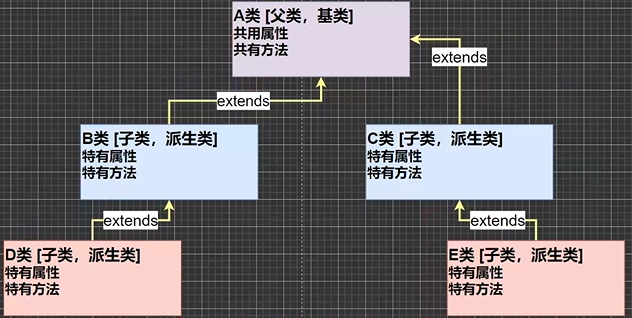

> `B`类和`C`类中有很多属性和方法是相同的，我们将`B`类和`C`类中共有的属性写在`A`类中，供`B`类和`C`类进行继承，在`B`类和`C`类中只写该类特有的属性和方法，我们可以在写一个类`D`来继承`B`类，这样`D`类就同时拥有了`B`类和`A`类的所有方法

继承的基本语法：

```java
class 子类 extends 父类 {
    ...
}
```

> - 子类会自动拥有父类定义的属性和方法
> - 父类又叫超类或基类
> - 子类又叫派生类

代码描述：创建一个学生的父类，和小学生子类、大学生子类，父类文件代码：

```java
package com.jlctest.extend;

// 父类
public class Student {
    // 共有的属性
    public String name;
    public int age;
    private double score;
    
    // 共有的方法
    public void setScore(double score) {
        this.score = score;
    }
    public void showInfo() {
        System.out.println("学生名：" + name + "年龄：" + age + "成绩：" + score);
    }
}
```

创建子类进行继承父类和编写子类独特的属性和方法：

```java
package com.jlctest.extend;

// 小学生子类 Pupil继承Student父类
public class Pupil extends Student {
    public void testing() {
        System.out.println("小学生" + name + "正在考试...");
    }
}
```

```java
package com.jlctest.extend;

// 大学生子类 Graduate继承Student父类
public class Graduate extends Student {
    public void testing() {
        System.out.println("大学生" + name + "正在考试...");
    }
}
```

测试文件：

```java
package com.jlctest.extend;

public class Extends01 {
    public static void main(String[] args) {
        com.jlctest.extend.Pupil pupil = new Pupil();
        pupil.name = "abc";
        pupil.age = 12;
        pupil.testing();
        pupil.setScore(60);
        pupil.showInfo();
    }
}
```

注意事项：

- 子类继承了所有的属性和方法，但是私有属性不能在子类中直接访问（但是可以间接访问的），要通过父类提供的公共方法去访问

  代码解释：先创建一个父类`Base`：

  ```java
  package com.jlctest.extend;
  
  public class Base {
      public int n1 = 100;    // 公共属性
      protected int n2 = 200; // 受保护属性
      int n3 = 300;           // 默认属性
      private int n4 = 400;   // 私有属性
      
      // 无参构造器
      public Base() {
          System.out.println("Base...");
      }
      // 公共方法
      public void test100() {
          System.out.println("test100...");
      }
      // 受保护方法
      protected void test200() {
          System.out.println("test200...");
      }
      // 默认方法
      void test300() {
          System.out.println("test300...");
      }
      // 私有方法
      private void test400() {
          System.out.println("test400...");
      }
      
      // 父类提供一个公共的方法去返回私有的属性
      public int getN4() {
          return n4;
      }
      
      // 父类提供一个公共的方法去返回私有的方法
      public void callTest400() {
          test400();
      }
  }
  ```

  创建一个子类`Sub`继承父类`Base`：

  ```java
  package com.jlctest.extend;
  
  public class Sub extends Base {
      // 子类的构造器
      public Sub() {
          System.out.println("Sub...");
      }
      
      public void sayOk() {
          // 非私有的属性和方法可以在子类中直接访问
          System.out.println(n1, n2, n3);   // n4是私有属性，不能直接访问
          // 通过父类提供的公共方法去访问私有的属性
          System.out.println(getN4());
          
          test100();
          test200();
          test300();    // test400()是私有方法，不能直接访问
          // 通过父类提供的公共方法去访问私有的方法
          callTest400();
      }
  }
  ```

- 子类必须调用父类的构造器，完成父类的初始化

  在创建子类的时候，父类的无参构造器也会被调用，会先于子类的无参构造器调用（先完成对父类的初始化）

  在子类中有一个默认的被省略的语句`super();`，完整的子类构造器语句为：

  ```java
  package com.jlctest.extend;
  
  public class Sub extends Base {
      // 子类的构造器
      public Sub() {
          super();   // 默认调用父类的无参构造器
          System.out.println("Sub...");
      }
  }
  ```

- 当创建子类对象时，不管使用子类的哪个构造器，默认情况下总会去调用父类的无参构造器，如果父类没有提供无参构造器，则必须在子类的构造器中用`super`去指定父类的哪个构造器完成对父类的初始化工作，否则编译不会通过

  ```java
  package com.jlctest.extend;
  
  public class Base {
      public int n1 = 100;    // 公共属性
      protected int n2 = 200; // 受保护属性
      int n3 = 300;           // 默认属性
      private int n4 = 400;   // 私有属性
      
      // 有参构造器，覆盖了默认的无参构造器
      public Base(int n1) {
          System.out.println("Base(int n1)...");
      }
  }
  ```

  子类在调用的时候，需要指定父类中具体的构造器：

  ```java
  package com.jlctest.extend;
  
  public class Sub extends Base {
      // 子类的构造器
      public Sub() {
          super(150);    // 指定一个构造器合法的实例，显示的调用一下
          System.out.println("Sub...");
      }
  }
  ```

- 如果希望指定去调用父类的某个构造器，则显式的用`super()`调用一下，如果不写，则默认调用父类的无参构造器

- `super`在使用时，必须放在构造器第一行

- `super()`和`this()`都只能放在构造器第一行，因此这两个方法不能共存在一个构造器中

- `Java`所有的类都是`Object`类的子类，`Object`是所有类的基类

- 父类构造器的调用不限于直接调用上级的父类，可以一直往上追溯到`Object`类（顶级父类），但是注意`Object`的无参构造器是没有任何输出的

- 子类最多只能继承一个父类（指直接继承），即`Java`中是单继承机制的

  如果想要让`A`类继承`B`类和`C`类，我们可以让`A`类先继承`B`类，再让`B`类去继承`C`类

- 不能滥用继承，子类和父类之间必须满足`is-a`（是一个...）的逻辑关系

  `Person is a Music?`   人不是音乐，不合理，不应该是继承关系

练习题：

```java
public class ExtendsExercise01 {
    public static void main(String[] args) {
        B b = new B();   // 执行内容：a    b name   b
    }
}

class A {
    A() {
        System.out.println("a");
    }
    A(String name) {
        System.out.println("a name");
    }
}
class B extends A {
    B() {
        this("abc");    // 执行B(String name){}
        System.out.println("b");
    }
    B(String name) {
        // 默认为super();   // 执行A()
        System.out.println("b name");
    }
}
```

#### 继承的本质

继承的本质可以帮助我们理解，当子类继承父类时，创建子类对象时，内存中发生了什么（结论：当子类对象创建好后，内存中会建立查找关系）

```java
public class ExtendsTheory {
    public static void main(String[] args) {
        Son son = new Son();    // new一个Son时，内存到底发生了什么，内存的布局是怎么样的
        // 当我们使用实例出的子类去访问属性时，是根据什么规则呢？
        System.out.println(son.name);  // 大头儿子
        System.out.println(son.age);  // 45   子类没有，访问的父类的属性
        System.out.println(son.hobby);  // 旅游   子类父类都没有，继续往上找
    }
}

class GrandPa {
    String name = "大头爷爷";
    String hobby = "旅游";
}
class Father extends GrandPa {
    String name = "大头爸爸";
    int age = 45;
}
class Son extends Father {
    String name = "大头儿子";
}
```

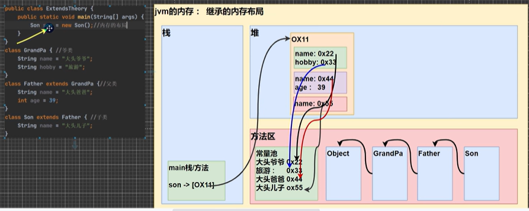

> `new`一个`Son`类的时候，首先会加载类信息，在加载`Son`类信息的时候，会先加载顶层的父类信息，也就是`Object`类，之后依次加载`GrandPa`的类信息和`Father`的类信息，等父类的信息加载完后，最后才会加载`Son`的类信息
>
> 加载完类信息之后，会在堆中分配地址空间，首先会给爷爷类分配属性；再会开辟一个空间，为爸爸类分配属性，最后为子类自己开辟空间，分配属性

当我们使用实例出的子类去访问属性时，是根据什么规则呢？我们需要按照查找关系来返回数据，查找规则如下：

1. 首先看子类是否有目前要访问的属性，如果子类有这个属性，并且可以访问，则返回信息
2. 如果子类没有这个属性，就看父类有没有这个属性，如果父类有这个属性，并且可以访问，就返回信息
3. 如果父类没有这个属性，就继续往上找，直到`Object`类

如果父级中的一个属性是私有的，那么子类是不可以进行直接访问的（但是这个私有的属性在内存地址中还是存在的），只是我们需要通过公共的方法进行访问

另外，如果爸爸类中有一个`age`是私有的，爷爷类中也有一个`age`是公共的，那我们子类访问`age`属性会卡在爸爸类中（直接访问报错，即有一个堵住了，不会跳过这个继续往上查找），不会继续往爷爷类去查找（即使爷爷类中的`age`是私有的）

#### `super`关键字

`super`代表父类的引用，用于访问父类的属性、方法和构造器

- `super`可以访问父类的属性（访问方式：`super.属性名;`），但不能访问父类的私有属性
- `super`可以访问父类的方法（访问方式：`super.方法名(参数列表);`），但不能访问父类的私有方法
- `super`可以访问父类的构造器（访问方式：`super(参数列表);`），只能放在构造器的第一句

```java
package com.jlctest.super;

// 父类
public class A {
    // 四个属性
    public int n1 = 100;
    protected int n2 = 200;
    int n3 = 300;
    private n4 = 400;
    
    // 四个方法
    public void test100() {}
    protected void test200() {}
    void test300() {}
    private void test400() {}
}
```

```java
package com.jlctest.super;

// 子类
public class B extends A {
    public void h1() {
        System.out.println(super.n1, super.n2, super.n3);   // super.n4不能访问，报错
    }
    public void ok() {
        super.test100();
        super.test200();
        super.test300();
        // super.test400();不能访问，报错
    }
}
```

`super`关键字可以给编程带来便利：

- 调用父类的构造器的好处：分工明确，父类属性由父类初始化，子类的属性由子类初始化
- 当子类中有和父类中的成员（属性和方法）重名时，为了访问父类的成员，必须通过`super`（`super`访问属性和方法时，是没有查找本类该属性和方法的过程，直接去父类中进行查找，这个和`this`和直接访问是有区别的）；如果没有重名，使用`super`、`this`和直接访问是一样效果的
- 对于父类中私有的属性和方法，访问会报错：`cannot access`；如果父类中都没有这个属性和方法，会提示属性或方法不存在
- `super`的访问不限于直接父类，如果爷爷类和本类中有同名的成员，也可以使用`super`去访问爷爷类的成员，如果多个基类（上级类）中都有同名的成员，使用`super`访问遵循就近原则。当然也需要遵循访问权限的相关规则（如私有属性和方法是不能访问的）

##### `super`和`this`的比较

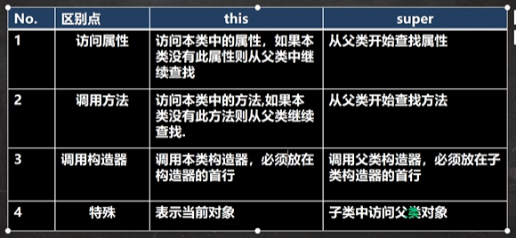

#### 方法重写

方法重写也叫方法覆盖，就是子类有一个方法和父类（这里的父类可以一直追溯到顶级父类）的某个方法的名称、返回类型、形参列表都一样，那么我们就说子类的这个方法覆盖了父类的方法

对于一个`Animal`父类中，有一个方法：

```java
package com.jlctest.override;

public class Animal {
    public void cry() {
        System.out.println("动物叫..");
    }
}
```

对于子类`Dog`中，也有`cry`这个方法：

```java
package com.jlctest.override;

public class Dog extends Animal {
    public void cry() {
        System.out.println("狗叫..");
    }
}
```

> 因为`Dog`是`Animal`的子类，`	Dog`的`cry`方法和`Animal`的`cry`方法的定义形式一样（名称、返回类型和形参列表），这时我们就说`Dog`的`cry`方法重写了`Animal`的`cry`方法

在一个测试文件中进行测试：

```java
package com.jlctest.override;

public class Test {
    public static void main(String[] args) {
        Dog dog = new Dog();
        dog.cry();   // 狗叫..
    }
}
```

方法重写的注意事项：

- 子类的方法的形参列表，方法名称要和父类方法的形参列表，方法名称和返回类型完全一样，会出现方法的重写

- 在方法名称和形参列表一样的基础上，如果父类方法的返回类型是子类方法返回类型的父类，也会构成方法的重写（如：父类方法返回的类型是`Object`，子类方法返回的类型是`String`）`String`类型的本质就是`Object`，如果子类方法返回的类型是`Object`，父类方法返回的类型是`String`，系统会直接报错

- 对于方法的重写，子类方法不能缩小父类方法的访问权限（可以扩大，但是不能缩小）

  对于访问修饰符的权限，由大到小依次为：`public`>`protected`>默认>`private`

  如果父类的方法是`public`，那么子类的方法必须为`public`，否则报错

  如果父类的方法是`protected`，那么子类的方法可以为`protected`和`public`

- 对于重写后的方法，如果我们想要重新使用子类的方法，我们可以使用`super.父类方法()`的形式调用

方法重写和方法重载的比较：

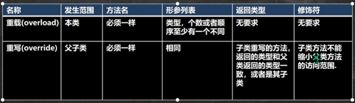

***

### 多态

多态，通俗来讲就说多种状态，是面向对象的第三大特征，多态是建立在封装和继承的基础上的

多态可以提高我们代码的复用性，从而利于维护

#### 方法的多态

重写和重载就体现了方法的多态

```java
package com.jlctest.Ploy;

public class Ploy {
    public static void main(String[] args) {
        B b = new B();
        A a = new A();
        // 方法的重载体现多态：这里我们传入不同的参数，就会调用不同的sum方法，就体现多态
        System.out.println(a.sum(10, 20));   // 30
        System.out.println(a.sum(10, 20, 30));  // 60
        // 方法重写体现多态：
        a.say();   // A say
        b.say();   // B say
    }
}

// 父类
class B {
    public void say() {
        System.out.println("B say");
    }
}

// 子类
class A extends B {
    public int sum(int n1, int n2) {
        return n1 + n2;
    }
    public int sum(int n1, int n2, int n3) {
        return n1 + n2 + n3;
    }
    
    public void say() {
        System.out.println("A say");
    }
}
```

#### 对象的多态

对象多态的前提是两个对象（类）存在继承关系

对象的多态是多态的核心：

- 一个对象的编译类型和运行类型可以不一致（可以使用父类的引用指向子类的对象）
- 编译类型在定义对象时，就确定了，不能改变
- 运行类型是可以变化的
- 编译类型看定义时等号的左边，运行类型看等号的右边

```java
// Dog类是Animal类的子类
// 可以使用父类的引用指向子类的对象
Animal animal = new Dog();

animal = new Cat();   // animal的运行类型变成了Cat，但是编译类型仍然是Animal
```

> 其中`animal`的编译类型是`Animal`，运行类型是`Dog`

```java
// animal的编译类型是Animal，运行类型是Dog
Animal animal = new Dog();
animal,cry(); // 因为运行时，执行到该行时，animal的运行类型是Dog，所以这里的cry方法，就是Dog类中的方法

// 将animal的运行类型改为Cat，但是编译类型还是为Animal
animal = new Cat();
animal.cry();   // 运行类型为Cat，执行的是Cat类中的cry方法
```

> 运行类型可以理解为真实的当前类型

##### 多态的向上转型

- 本质：父类的引用指向了子类的对象

- 语法：`父类类型 引用名 = new 子类类型();`

- 特点：编译类型看左边，运行类型看右边

  可以调用父类中的所有成员（需遵循访问权限）

  不能调用子类中特有成员

  最终运行的效果看子类的具体实现

  ```java
  Animal animal = new Cat();     // 父类的引用指向了子类的对象
  // 实例出的animal的类型完全是由编译器决定的，遵循的是引用类型Animal
  animal.*;     // 可以调用父类中的所有成员方法（属性和方法）（需遵循访问权限，私有的成员不能访问）
  // 但是不能调用子类中特有的成员（即子类有父类没有的成员）
  animal.catchMouse();  // 报错catchMouse()是Cat类特有的方法
  
  // 最终运行的效果看子类的具体实现，调用方法时，按照从子类开始进行查找，子类没有才往父类进行查找
  animal.eat();    // 根据运行类型，调用Cat类中的eat()方法（如果子类中有这个方法的情况下）    
  animal.run();  // 如果子类中没有run()这个方法，才会去父类中进行找
  ```

  > 在编译阶段，能调用哪些成员（属性和方法），是由编译类型决定的
  >
  > 但是在最终运行的时候，还是要看子类实现具体的效果

##### 多态的向下转型

- 语法：`子类类型 引用名 = (子类类型) 父类引用;`（将一个父类的引用强制转换为一个子类的引用，使其可以调用子类中的特有方法）
- 只能强转父类的引用，不能强转父类的对象
- 要求父类的引用必须指向的是当前目标类型的对象
- 当向下转型后，就可以调用子类类型中的所有成员

```java
Animal animal = new Cat();     // 父类的引用指向了子类的对象
animal.catchMouse();  // 报错catchMouse()是Cat类特有的方法（我们使用向下转型来解决）
// 向下转型，强转，将父类的引用重写转换为子类的引用
Cat cat = (Cat) animal;    // 这个时候cat的编译类型和运行类型都是Cat
// 要求父类的引用必须指向的是当前目标类型的对象，也就是说animal原先的指向类型就是Cat类
// 转换完后，就可以调用子类的特有方法
cat.catchMouse();
```

```java
Animal animal = new Cat();     // 父类的引用指向了子类的对象
// 要求父类的引用必须指向的是当前目标类型的对象，也就是说animal原先的指向类型就是Cat类
Cat cat = (Cat) animal;  

Dog dag = (Dog) animal;  // 报错，没有满足父类的引用必须指向的是当前目标类型的对象
```

##### 属性没有重写

属性没有重写，属性的值看其编译类型

```java
package com.jlctest.poly;

public class PloyDetail {
    public static void main(String[] args) {
        Base base = new Sub();   // 向上转型
        System.out.println(base.count);  // 10   看编译类型，编译类型为Base
        
        Sub sub = new Sub();
        System.out.println(base.count);  // 20   看编译类型，编译类型为Sub
    }
}

// 父类
class Base {
    int count = 10;   // 父类的count属性设置为10
}
// 子类
class Sub extends Base {
    int count = 20;   // 子类的count属性设置为20
}
```

##### `instanceOf`比较操作符

`instanceOf`比较操作符，用于判断对象的运行类型是否为`XX`类型或者`XX`类型的子类型

```java
package com.jlctest.poly;

public class PloyDetail {
    public static void main(String[] args) {
        // 运行类型和编译类型都为BB
        BB bb = new BB();
        System.out.println(bb instanceOf BB);   // true
        System.out.println(bb instanceOf AA);   // true
        
        // 运行类型为BB   编译类型为AA
        AA aa = new BB();
        System.out.println(aa instanceOf AA);   // true
        System.out.println(aa instanceOf BB);   // true
        
        Object obj = new Object();
        System.out.println(obj instanceOf AA);   // false
    }
}

// 父类
class AA {}
// 子类
class BB extends AA {}
```

***

#### 动态绑定机制

`Java`的动态绑定机制是非常重要的

1. 当调用对象方法的时候，该方法会和该对象的内存地址/运行类型绑定
2. 当调用对象属性时，没有动态绑定机制，哪里声明，哪里调用（在当前的类中查找）

```java
package com.jlctest.dynamicBinding;

public class DynamicBinding {
    public static void main(String[] args) {
        A a = new B();  // 向上转型
        // 调用的对象方法看运行类型
        System.out.println(a.sum());  // 40
        System.out.println(a.sum1());  // 30
        
        // 如果将子类B中的sum方法注释掉
        // 当调用对象方法的时候，该方法会和该对象的内存地址/运行类型绑定，getI()还是从运行类型开始查找
        System.out.println(a.sum());  // 20 + 10 = 30
        // 如果将子类B中的sum1方法注释掉
        // 当调用对象属性时，没有动态绑定机制，哪里声明，哪里调用（在当前的类中查找）
        System.out.println(a.sum1());  // 10 + 10 = 20
    }
}

// 父类
class A {
    pubilc int i = 10;
    public int sum() {
        return getI() + 10;
    }
    public int sum1() {
        return i + 10;
    }
    public int getI() {
        return i;
    }
}
// 子类
class B extends A {
    public int i = 20;
    public int sum() {
        return i + 20;
    }
    public int getI() {
        return i;
    }
    public int sum1() {
        return i + 10;
    }
}
```

#### 多态的应用

##### 多态数组

多态数组：数组的定义类型为父类类型，里面保存的实际元素类型为子类类型

创建一个`Person`对象，两个`Student`对象和两个`Teacher`对象，统一放在多态数组中，并调用每个对象的`say`方法

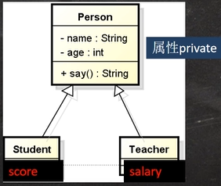

创建`Person`父类：

```java
package com.jlctest.ploy;

public class Person {
    private String name;
    private int age;
    
    // 定义构造器
    public Person(String name, int age) {
        this.name = name;
        this.age = age;
    }
    // 属性的设置和获取方法
    public void setName(String name) {
        this.name = name;
    }
    public String getName() {
        return name;
    }
    public void setAge(int age) {
        this.age = age;
    }
    public int getAge() {
        return age;
    }
    
    // 自定义say方法，返回名字和年龄
    public String say() {
        return name + "\t" + age;
    }
}
```

创建`Student`子类：

```java
package com.jlctest.ploy;

public class Student extends Person {
    private double score;
    
    // 定义构造器
    public Person(String name, int age, double score) {
        super(name, age);
        this.score = score;
    }
    // 属性的设置和获取方法
    public void setScore(double score) {
        this.score = score;
    }
    public String getScore() {
        return score;
    }
    
    // 重写父类的say方法，返回名字和年龄还有分数
    public String say() {
        return super.say() + "score" + score;
    }
    
    // 学生类中特有的方法
    public void study() {
        System.out.println("学生" + getName() + "正在听课");
    }
}
```

创建`Teacher`子类：

```java
package com.jlctest.ploy;

public class Teacher extends Person {
    private double salary;
    
    // 定义构造器
    public Person(String name, int age, double salary) {
        super(name, age);
        this.salary = salary;
    }
    // 属性的设置和获取方法
    public void setSalary(double salary) {
        this.salary = salary;
    }
    public String getSalary() {
        return salary;
    }
    
    // 重写父类的say方法，返回名字和年龄还有分数
    public String say() {
        return super.say() + "salary" + salary;
    }
    
    // 老师类中特有的方法
    public void teach() {
        System.out.println("老师" + getName() + "正在授课");
    }
}
```

使用多态数组进行声明和方法的调用：

```java
package com.jlctest.ploy;

public static void main(String[] args) {
    // 创建一个Person对象，两个Student对象和两个Teacher对象，统一放在多态数组中
    // Person[]类型的多态数组，其元素子要是Person类和其子类都可以进行存放
    Person[] persons = new Person[5];
    persons[0] = new Person("jack", 20);
    persons[1] = new Student("mary", 18, 80);
    persons[2] = new Student("frank", 19, 100);
    persons[3] = new Teacher("scoot", 35, 18000);
    persons[4] = new Teacher("king", 55, 22000);
    
    // 循环遍历多态数组，调用say方法
    for (int i = 0; i < persons.length; i++) {
        // 使用了动态绑定机制，编译类型是Person，运行类型会根据实际变化
        System.out.println(person[i].say());  
        
        // 这里的persons[] 元素的编译类型是Person，是没有办法调用老师类或者学生类中的特有方法的
        // persons[i].teach();   // 报错
        // 我们要使用向下转型，将编译类型转成具体的子类，再去调用具体的方法
        if (persons[i] instanceof Student) {   // 先判断运行类型是不是Student类型
            Student student = (Student)persons[i];
            student.study();
            // 上述两条语句可以合二为一：  (Student)persons[i].study();
        } else if(persons[i] instanceof Teacher) {
            Teacher teacher = (Teacher)persons[i];
            teacher.teach();
        } else if(persons[i] instanceof Person) {
            // 不做任何处理
        } else {
            System.out.println("类型有误");
        }
    }
}
```

##### 多态参数

多态参数是指方法定义的形参类型为父类类型，实参类型允许为子类类型

定义员工类`Employee`，包含姓名和月工资`[private]`，以及计算年工资`getAnnual`的方法。普通员工和经理继承了员工，经理类多了奖金`bonus`属性和管理`manage`方法，普通员工类多了`work`方法，普通员工类和经理类要求分别重写`getAnnual`方法：

创建`Employee`父类：

```java
package com.jlctest.ploy;

public class Employee {
    private String name;
    private double salary;
    
    // 定义构造器
    public Person(String name, double salary) {
        this.name = name;
        this.salary = salary;
    }
    // 属性的设置和获取方法
    public void setName(String name) {
        this.name = name;
    }
    public String getName() {
        return name;
    }
    public void setSalary(double salary) {
        this.salary = salary;
    }
    public double getSalary() {
        return salary;
    }
    
    // 自定义年工资方法
    public double getAnnual() {
        return 12 * salary;
    }
}
```

创建一个普通员工`Worker`子类：

```java
package com.jlctest.ploy;

public class Worker extends Employee {
    // 定义构造器
    public Person(String name, double salary) {
        super(name, salary);
    }
    // 普通员工类中特有的work方法
    public void work() {
        System.out.println("普通员工" + getName() + "正在工作");
    }
    
    // 重写getAnnual方法
    public double getAnnual() {
        // 因为普通员工没有其他收入，直接调用父类的方法即可
        return super.getAnnual();
    }
}
```

创建一个经理`Manager`子类：

```java
package com.jlctest.ploy;

public class Manager extends Employee {
    private double bonus;
    
    // 定义构造器
    public Person(String name, double salary, double bonus) {
        super(name, salary);
        this.bonus = bonus;
    }
    
    public String getBonus() {
        return bonus;
    }
    public void setBonus(double bonus) {
        this.bonus = bonus;
    }
    
    // 经理类中特有的manage方法
    public void manage() {
        System.out.println("经理" + getName() + "正在管理");
    }
    
    // 重写getAnnual方法
    public double getAnnual() {
        return super.getAnnual() + bonus;
    }
}
```

在测试类中添加一个方法`showEmpAnnual(Employee e)`，实现获取任何员工对象的年工资，并在`main`方法中调用该方法`[e.getAnnual]`

在测试类中添加一个方法`testWork`，如果是普通员工，则调用`work`方法，如果是经理，则调用`manage`方法

```java
package com.jlctest.ploy;

public class PloyParameter {
    public static void main(String[] args) {
        Worker tom = new Worker("tom", 2000);
        Manager milan = new Manager("milan", 5000, 10000);
        PloyParameter ployParameter = new PloyParameter();
        ployParameter.showEmpAnnual(tom);   // 30000
        ployParameter.showEmpAnnual(milan);   // 70000
        
        ployParameter.testWork(tom);  // 普通员工tom正在工作
        ployParameter.testWork(milan);  // 经理milan正在管理
    }
    
    // 获取任何员工对象的年工资的方法
    public void showEmpAnnual(Employee e) {
        System.out.println(e.getAnnual());  // 使用了动态绑定机制
    }
    
    // 添加一个方法testWork，如果是普通员工，则调用work方法，如果是经理，则调用manage方法
    public void testWork(Employee e) {
        if (e instanceof Worker) {
            ((Worker) e).work();    // 向下转型
        } else if (e instanceof Manager) {
            ((Manager) e).manage();
        }
    }
}
```

***

### `Object`根类

`Object`是类层次结构的根类，每个类都使用`Object`类作为超类，所有对象（包括数组）都可以使用`Object`类的方法，`Object`类中常用的方法有：

|     方法     |                             描述                             |
| :----------: | :----------------------------------------------------------: |
|  `clone()`   |                  创建并返回此对象的一个副本                  |
|  `equals()`  |              指示其他某个对象是否与此对象"相等"              |
| `finalize()` | 当垃圾回收器确定不存在对该对象的更多引用时，由对象的垃圾回收器调用此方法 |
| `getClass()` |                   返回此`Object`的运行时类                   |
| `hashCode()` |                     返回该对象的哈希码值                     |
| `toString()` |                    返回该对象的字符串表示                    |

#### `equals`方法

常见面试题：

`==`（比较运算符）和`equals`的对比：

- `==`既可以判断基本类型，又可以判断引用类型

  - `==`如果判断基本类型，判断的是值是否相等（是判断值相等，而不深入到类型）

    ```java
    int num1 = 10;
    double num2 = 10.0;
    System.out.println(num1 == num2);   // ture
    ```

  - `==`如果判断引用类型，判断的是地址是否相等，即判断是不是同一个对象

    ```java
    A a = new A();
    A b = a;
    A c = b;
    System.out.println(a == c); // true
    ```

- `equals`方法是`Object`类中的方法，只能判断引用类型

  默认判断的是地址是否相等，子类中往往重写该方法，用于判断内容是否相等，比如`Integer`、`String`中都会将`equals`方法进行重写（加入了比较具体的值是否相等）

  ```java
  // Object中的equals方法，默认就是比较对象地址是否相同，即也就是判断两个对象是不是同一个对象
  public boolean equals(Object obj) {
      // 如果是同一个对象，就返回true
      return (this == obj);
  }
  
  // Integer中的equals方法
  public boolean equals(Object obj) {
      if (obj instanceof Integer) {
          return value == ((Integer)obj).intValue();
      }
      return false;
  }
  ```

  ```java
  Integer integer1 = new Integer(1000);
  Integer integer2 = new Integer(1000);
  System.out.println(integer1 == integer2);  // false   开辟了不同的地址空间
  System.out.println(integer1.equals(integer2));  // true   判断具体的值是否相等 
  ```

  如何查看`jdk`原码：

  - 一般来说`IDEA`配置好`JDK`以后，`jdk`的源码也就自动配置好了，如果没有，可以点击菜单`File`-->`Project Structure`-->`SDKs`-->`Sourcepath`，然后点击右侧绿色的加号，选中我们下载的`jdk`子目录下的`javafx-src.zip`文件和`src.zip`文件
  - 在查看某个方法的源码时，将光标放在该方法上，输入`ctrl+b`或者在该方法上点击右键-->`go to`-->`Declaration or Usages`即可跳转到该方法的源码

##### 如何重写`equals`方法

案例：判断两个`Person`对象的内容是否相等，如果两个`Person`对象的各个属性值都一样，则返回`true`，反之，返回`false`

```java
package com.jlctest.object;

public class EqualsExercise {
    public static void main(String[] args) {
        Person person1 = new Person("jack", 10, '男');
        Person person2 = new Person("jack", 10, '男');
        
        System.out.println(person1.equals(person2));  // false   继承的是Object中的equals
        // 有了自定义的equals方法
        System.out.println(person1.equals(person2));  // ture
    }
}

class Person {
    private String name;
    private int age;
    private char gender;
    
    // 创建构造器
    public Person(String name, int age, char gender) {
        this.name = name;
        this,age = age;
        this.gender = gender;
    }
    
    // 重写Object的equals方法
    public boolean equals(Object obj) {
        // 判断如果比较的两个对象是同一个对象，则直接返回true
        if (this == obj) {
            return true;
        }
        // 类型判断，是Person，再进行比较
        if (obj instanceof Person) {
            // 进行向下转型，获取具体的属性
            Person p = (Person)obj;
            // 判断全部属性是否相等
            return this.name.equals(p.name) && this.age==p.age && this.gender==p.gender;
        }
        // 如果不是Person对象，则直接返回false
        return false;
    }
}
```

#### `hashCode`方法

`hashCode`方法用于返回该对象的哈希码值（哈希码值是为了提高哈希表的性能）

该方法主要有以下几个方面：

- 提高具有哈希结构的容器的效率
- 两个引用，如果指向的是同一个对象，则哈希值是一样的
- 两个引用，如果指向的是不同的对象，则哈希值是不一样的
- 哈希值主要根据地址号来计算的，但是不能完全将哈希值等价于地址
- 在后续的集合中，一般会将`hashCode`方法进行重写

```java
package com.jlctest.object;

public class HashCode {
    public static void main(String[] args) {
        AA aa1 = new AA();
        AA aa2 = new AA();
        AA aa3 = aa1;
        // 此时  aa1.hashCode和aa2.hashCode的值是不一样的，但是与aa3.hashCode的值是一样的
    }
}

class AA {}
```

#### `toString`方法

返回该对象的字符串表示，具体而言，就是返回一个以文本方式表示的此对象字符串

默认返回：全类名（包名+类名）+@+哈希值的十六进制

方法的源码：

```java
public String toString() {
    return getClass().getName() + "@" + Integer.toHexString(hashCode());
}
```

在子类中往往重写`toString`方法，用于返回对象的属性信息

当直接输出一个对象时，`toString`方法会被默认的调用，如`System.out.print(monster);`等价于`System.out.print(monster.toString());`

#### `finalize`方法

- 当对象被回收时（在堆中的空间被释放出来了），系统自动调用该对象的`finalize`方法，子类可以重写该方法，做一些释放资源的操作
- 什么时候被回收：当某个对象没有任何引用时，则`jvm`就认为这个对象使一个垃圾对象，就会使用垃圾回收机制来销毁该对象，在销毁对象之前，会先调用`finalize`方法
- 垃圾回收机制的调用，是由系统来决定的（即有自己的`GC`算法），也可以通过`System.gc()`主动触发垃圾回收机制

```java
package com.jlctest.object;

public class Finalize {
    public static void main(String[] args) {
        Car bmw = new Car("宝马");
        // 将对象的指向连线断掉，即对象没有任何引用了，这个Car对象就变成了垃圾，被回收
        // 在回收前（销毁前），会调用该对象的finalize方法
        // 这时程序员就可以在finalize方法中写一些自己业务逻辑的方法（如释放资源：数据库连接或者打开文件）
        // 如果程序员不重写finalize，那么就会调用Object类的finalize，即默认调用
        bwm = null;
        System.gc();  // 主动触发垃圾回收
        System.out.println("程序退出了")
    }
}

class Car {
    private String name;
    publuc Car(String name) {
        this.name = name;
    }
    // 重写finalize方法
    @Override
    protected void finalize() throws Throwable {
        System.out.println("我们销毁了汽车" + name);
    }
}
```

> 最后结果显示：程序退出了     我们销毁了汽车宝马

`finalize`方法在实际的开发中使用的比较少，但是在面试中问的比较多

***

### 类变量和类方法

类变量和类方法是面向对象的一个重点，类变量和类方法，又叫静态变量和静态方法，用`static`关键字进行修饰

#### 类变量

类变量也叫静态变量/静态属性，是该类的所有对象共享的变量，任何一个该类的对象去访问它时，取到的都是相同的值，同样任何一个该类的对象去修改它时，修改的也是同一个变量

定义类变量：

- `访问修饰符 static 数据类型 变量名;`     推荐使用
- `static 访问修饰符 数据类型 变量名;`

```java
class Child {
    private String name;
    // 定义一个类变量为所有的Child类的对象共享
    public static int totalNum = 0;
}
```

类变量的访问：静态变量的访问修饰符的访问权限和范围和普通属性是一样的

- `类名.类变量名;`    推荐使用
- `对象名.类变量名;`

类变量可以通过对象进行访问，也可以通过类名进行访问`Child.totalNum;`

```java
package com.jlctest.static;

public class VisitStatic {
    public static void main(String[] args) {
        // 类变量是随着类的加载而创建的，所以即使没有创建对象实例也可以访问
        System.out.println(A.name);   // jlc
        
        // 也可以通过一个对象实例进行访问
        A a = new A();
        System.out.println(a.name);   // jlc
    }
}

class A {
    // 定义类变量
    public static String name = "jlc";
}
```

类变量的使用细节：

- 当我们需要让某个类的所有对象都共享一个变量时，就可以考虑使用类变量（静态变量）
- 加上`static`就称为类变量\静态变量，否则就为实例变量\普通变量\非静态变量
- 类变量是该类的所有对象共享的，而实例变量（普通属性）是对每个对象独享的
- 实例变量不能通过类名.变量名的方式访问
- 类变量是随着类的加载而创建的，所以即使没有创建对象实例也可以访问
- 类变量的生命周期是随着类的加载开始，随着类的消亡而销毁

##### 内存布局

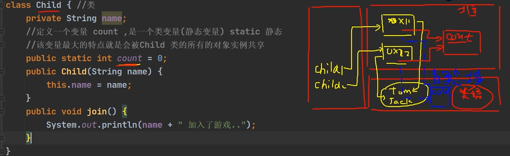

> - 类变量`count`是被该类实例化出来的对象共享的（静态变量是被对象共享的）都指向静态变量所在的空间（堆空间）
> - `jdk`的版本如果大于等于8，静态对象是放在堆中的，通过反射机制会加载一个`Class`对象（在方法区中类加载之后，会通过反射机制生成一个`Class`对象实例），在对象实例的最后，会将这个静态数据放入；`jdk`的版本如果小于8，静态对象放在方法区中的，静态变量在加载的时候，有一个类加载，类信息会放在方法区中，就会在方法区中产生一个静态域来存放这个类变量，但是不管静态变量在哪里，都是可以被对象共享的
> - 类变量，在类加载的时候就生成了

#### 类方法

类方法也叫静态方法

基本语法：

- `访问修饰符 static 数据返回类型 方法名() {}`     推荐使用
- `static 访问修饰符 数据返回类型 方法名() {}`

类方法的调用：`类名.类方法名`或者`对象名.类方法名`   调用的前提是满足访问修饰符的访问权限和范围

```java
package com.jlctest.static;

public class StaticMethod {
    public static void main(Stringp[] args) {
        // 创建两个学生对象，交学费
        Stu tom = new Stu("tom");
        tom.payFee(1000);    // 通过对象来调用静态方法，也可以使用类名进行调用
        
        Stu mary = new Stu("mary");
        mary.payFee(2000);    // 通过对象来调用静态方法，也可以使用类名进行调用
        
        // 输出当前收到的总学费，通过类进行调用静态方法
        Stu.showFee();    // 总学费为：3000.0
    }
}

class Stu {
    private String name;  // 普通私有成员
    // 定义一个静态变量，来累积学生的学费
    private static double fee = 0;
    
    public Stu(String name) {
        this.name = name;
    }
    
    // 创建静态方法    静态方法可以访问静态属性/变量
    public static void payFee(double fee) {
        Stu.fee += fee;   // 学费累积
    }
    public static void showFee() {
        System.out.println("总学费为：" + Stu.fee);
    }
}
```

类方法的使用场景：当方法中不涉及到任何和对象相关的成员，则可以将方法设计成静态方法，提高开发效率，如工具类中的方法`utils`、`Math`类、`Arrays`类等，如`Math.sqrt()`，其中的`sqrt()`就是一个静态方法，我们可以直接通过类进行调用（如果我们希望不创建实例，也可以调用某个方法，即当作工具来使用，这时将方法做成静态方法是非常合适的）

在程序员实际开发中，往往会将一些通用的方法，设计成静态方法，这样我们就可以不需要创建对象就直接使用

类方法使用的注意事项：

- 类方法和普通方法都是随着类的加载而加载，将结构信息存储在方法区：类方法中无`this`参数，普通方法隐含着`this`参数

- 类方法可以通过类名调用，也可以通过对象名调用

- 普通方法和对象有关，需要通过对象名调用，不能通过类名调用

- 类方法中不允许使用和对象有关的关键字，比如`this`和`super`，普通方法（成员方法）可以

- 类方法中只能访问静态成员；普通成员方法既可以访问普通成员，也可以访问静态成员（构造器方法也属于普通方法，可以方法普通成员和静态成员）（但是两种方法访问都必须遵守访问权限）

  ```java
  class D {
      private int n1 = 100;   // 普通变量
      private static int n2 = 200;  // 静态变量
      
      public static void hello() {
          System.out.println(n2);  // 合法
          System.out.println(D.n2);  // 合法
          System.out.println(this.n2);  // 不合法，类方法中不允许使用和对象有关的关键字
          System.out.println(n1);  // 不合法，不能访问普通变量（方法）
      }
  }
  ```

***

### `main`方法

`main`方法的语法形式：`public static void main(String[] args) {}`

- `main()`方法是`Java`虚拟机在调用

- `Java`虚拟机需要调用类的`main()`方法，所以该方法的访问权限必须是`public`

- `Java`虚拟机在执行`main()`方法时不必创建对象，所以该方法必须是`static`

- 该方法接收`String`类型的数组参数，该数组中保存执行`Java`命令时传递给所运行的类的参数

- `Java`执行的程序 参数1 参数2 参数3

  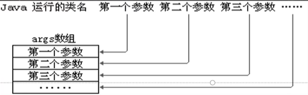

  ```java
  public class Hello {
      public static void main(String[] args) {
          // 遍历args接收传入的参数
          for(int i = 0; i < args.length; i++) {
              System.out.println("第" + (i + 1) + "个参数为" + args[i]);
          }
      }
  }
  ```

  编译代码：`javac Hello.java`

  运行代码并传入参数：`java Hello jlc abc qwer`    （如果不传入参数，就什么也不会输出）

  结果显示：

  第1个参数为`jlc`

  第2个参数为`abc`

  第3个参数为`qwer`

  参数在执行程序的时候进行传入，在传入参数后，会将`jlc abc qwer`这三个参数当作一个字符串数组`String[]`传给我们的方法

注意事项：

- 在`main()`方法中，我们可以直接调用`main`方法所在类的静态方法或静态属性，但是不能直接访问该类中的非静态成员，必须创建该类的一个实例对象后，才能通过这个对象去访问类中的非静态方法

***

### 代码块

代码块又称为初始化块，属于类中的成员（即是类的一部分），类似于方法，将逻辑语句封装在方法体中，通过`{}`包围起来；但是和方法不同，代码块没有方法名，没有返回，没有参数，只有方法体（代码块可以理解为只有方法体的方法），而且不用通过对象或类显示调用，而是在加载类时，或创建对象时隐式调用

基本语法：

```java
修饰符 {
    代码;
};
```

> - 修饰符可选，要写的化，也只能写`static`
> - 代码块分为两类，使用`static`修饰的静态代码块，和没有`static`修饰的普通代码块
> - 代码块中的语句可以为任何逻辑语句（输入、输出、方法调用、循环、判断等）
> - 结尾的`;`可以省略

使用代码块的好处：代码块相当于另一种形式的构造器（对构造器的补充机制），可以做初始化的操作

应用场景：如果多个构造器中都有重复的语句，可以抽取到初始化块中，提高代码的复用性

```java
public class CodeBlock {
    public static void main(String[] args) {
        Movie movie1 = new Movie("movie1");  
    }
}

class Movie {
    private String name;
    private double price;
    
    // 2个构造器，构成了重载
    // 两个构造器中存在相同的内容，这样代码看起来比较冗余，我们可以将相同的语句，放到一个代码块中
    {
        System.out.println("电影屏幕打开...");
        System.out.println("电影开始...");
    };
    // 不管我们调用哪个构造器，创建对象，都会调用代码块中的内容
    public Movie(String name) {
        System.out.println("Movie(String name)构造器被调用");
        this.name = name;
    }
    public Movie(String name, double price) {
        System.out.println("Movie(String name, double price)构造器被调用");
        this.name = name;
        this.price = price;
    }
}
```

> 结果显示：
>
> 电影屏幕打开...
>
> 电影开始...
>
> `Movie(String name)`构造器被调用

代码块的调用的顺序是优先于我们的构造器调用的

代码块使用注意事项：

- `static`代码块也叫静态代码块，作用是对类进行初始化，而且它随着类的加载而执行，并且只会执行一次。如果是普通代码块，每创建一个对象，就执行

- 类什么时候被加载（重要）：

  - 创建对象实例时（`new`）
  - 创建子类对象实例，父类也会被加载，如果子类和父类中都有代码块，父类的代码块会先被执行
  - 使用类的静态成员时（静态属性，静态方法），代码块中的内容会先被执行
  - 使用类的静态成员时（静态属性，静态方法），如果这个子类的父类有代码块，也会被加载执行，而且父类的代码块会先被执行

- 普通代码块，在创建对象实例时，会被隐式的调用，被创建一次，就会被调用一次；如果只是使用类的静态成员时，普通代码块并不会执行

- 创建一个对象时，在一个类调用的顺序是（由先到后）：（重点和难点）

  1. 调用静态代码块和静态属性初始化

     静态代码块和静态属性初始化调用的优先级一样，如果有多个静态代码块和多个静态变量初始化，则按它们定义的顺序调用

     ```java
     public class CodeBlock {
         public static void main(String[] args) {
             A a = new A();  // 输出顺序：（1）getN1被调用... （2）A 静态代码块
         }
     }
     
     class A {
         // 静态属性初始化
         private static int n1 = getN1();
         // 静态代码块
         static {
             System.out.println("A 静态代码块");
         }
         public static int getN1() {
             System.out.println("getN1被调用...");
             return 100;
         }
     }
     ```

  2. 调用普通代码块和普通属性初始化

     普通代码块和普通属性初始化调用的优先级一样，如果有多个普通代码块和多个普通变量初始化，则按它们定义的顺序调用

  3. 调用构造器方法

- 构造器的代码最前面是隐含了`super()`和调用普通代码块

  ```java
  class A {
      public A() {
          System.out.println("ok");
      }
      
      // 上述构造器有隐藏的执行要求
      public A() {
          // （1）调用父类的无参构造器
          // 如果父类中也有其本类的普通代码块，在调用父类构造器时，会先进行父类中普通代码块的调用
          super();
          // （2）调用本类普通代码块的隐藏逻辑
          System.out.println("ok");
      }
  }
  ```

- 在创建一个子类对象时（有继承关系），它们的静态代码块，静态属性初始化，普通代码块，普通属性初始化，构造方法的调用顺序为（由先到后）：（高频面试题）

  1. 父类的静态代码块和静态属性（优先级一样，按照定义顺序执行）
  2. 子类的静态代码块和静态属性（优先级一样，按照定义顺序执行）
  3. 父类的普通代码块和普通属性初始化（优先级一样，按照定义顺序执行）
  4. 父类的构造方法
  5. 子类的普通代码块和普通属性初始化（优先级一样，按照定义顺序执行）
  6. 子类的构造方法

  1和2，是类加载时必须会执行的；后面4步是与对象相关的内容（入口是对应子类的构造器，遵守构造顺序）

- 静态代码块只能直接调用静态成员（静态属性和静态方法），普通代码块可以调用任意成员

***

### `final`关键字

`final`关键字可以修饰类、属性、方法和局部变量

有以下的四个情况会使用到`final`关键字：

- 当不希望类被继承时，可以用`final`修饰（希望这个类是最后的类，不希望被其他类继承扩展）

  ```java
  // 如果我们要求A类不能被其他类继承，使用final关键字修饰即可
  final class A {}
  
  // 这样其他类继承就会直接报错
  class B extends A {}  // 报错
  ```

- 当不希望父类的某个方法被子类覆盖/重写时，可以使用`final`关键字修饰

  ```java
  // 如果我们不希望父类的某个方法被子类覆盖/重写时，使用final关键字修饰即可
  // A作为父类
  class A {
      // 不希望hi()方法被子类覆盖/重写，使用final关键字修饰即可
      public final void hi() {}
  }
  ```

- 当不希望类的某个属性值被修改，可以用`final`关键字修饰

  ```java
  class A {
      // 不希望某个属性值被修改，使用final关键字修饰即可
      public final double TAX_RATE = 0.08;
  }
  ```

- 当不希望某个局部变量被修改，可以使用`final`关键字修饰

  ```java
  class A {
      public void hi() {
          // 不希望某个局部变量被修改，使用final关键字修饰即可
          final double NUM = 0.01;   // 这时NUM也被称为局部常量
          NUM = 0.2; // 报错
      }
  }
  ```

注意事项：

- `final`修饰的属性又叫常量，一般用`XX_XX_XX`来命名

- `final`修饰的属性在定义时，必须赋初值，并且以后不能再修改，赋值可以在下面几个位置：

  - 定义时：如：`public final double TAX_RATE = 0.08;`

  - 在构造器中

    ```java
    class A {
        // 在构造器中赋初值
        public final double TAX_RATE;
        
        public A() {
            TAX_RATE = 0.08;
        }
    }
    ```

  - 在代码块中

    ```java
    class A {
        // 在代码块中赋初值
        public final double TAX_RATE;
        
        {
            TAX_RATE = 0.08;
        }
    }
    ```

- 如果`final`修饰的属性是静态的，则初始化的位置只能是在定义时和在静态代码块中，不能在构造器中赋值

  ```java
  class A {
      public static final double TAX_RATE1 = 0.02;
      
      public static final double TAX_RATE2;
      static {
          TAX_RATE2 = 0.08;
      }
  }
  ```

- `final`类不能继承，但是可以实例化出具体的对象

- 如果类不是`final`类，但是含有`final`方法，则该方法虽然不能重写，但是可以被继承下来供子类进行使用

- 一般来说，如果一个类已经是`final`类了，就没有必要再将方法修饰成`final`方法了（因为这个类已经是不能被继承了，就没有子类会去重写这个方法了）

- `final`不能修饰构造方法（即构造器）

- `final`和`static`往往搭配使用（两者的前后顺序可以改变），效率更高，底层编译器做了优化处理，不会导致类加载

  ```java
  class B {
      public static int num = 1000;
      public static int num2 = 2000;
      static {
          System.out.println("B类的静态代码块被执行");
      }
  }
  
  // 在主函数调用B类中的属性时，会加载类，先执行代码块中的内容
  System.out.println(B.num);   // B类的静态代码块被执行   1000
  
  // 当final和static一起使用时，不会加载类，不会执行代码块中的内容
  System.out.println(B.num2);  // 2000
  ```

- 对于类中的方法，其形参是可以用`final`修饰的，但是这样的形参是不能修改的

  ```java
  public int add(final int x) {
      // x的值不能修改
  }
  ```

- 对于包装类（`Integer`、`Double`、`Float`、`Boolean`等都是通过`final`修饰的），`String`也是`final`类，这些类都是不能被继承的

***

### 抽象类

当父类中的某些方法需要声明时，但是又不确定如何具体的实现，可以将其声明为抽象方法，那么这个类为抽象类

```java
abstract class Animal {
    private String name;
    
    public Animal(String name) {
        this.name = name;
    }
    // 这里实现了eat方法，但是实际上没有什么意义，后续在子类中都是要重写的（父类方法不确定性的问题）
    // 即将该方法设置为抽象方法
    //public void eat() {
    //    System.out.println("这是一个吃的方法，但是不知道具体吃什么");
    //}
    public abstract void eat();
}
```

抽象方法就是没有实现的方法，具体而言，就是没有方法体，这个具体的方法会让子类进行实现（一般来说，抽象类会被继承，由其子类来实现抽象方法）

将方法设置为抽象方法后，必须要将该类设置为抽象类，否则会报错

注意事项：

- 用`abstract`关键字来修饰一个类时，这个类就是一个抽象类
- 抽象类是不能被实例化的
- 抽象类不一定要包含`abstract`方法，也就是说，抽象类可以没有`abstract`方法
- 一旦类包含了`abstract`方法，则这个类必须声明为`abstract`类
- 抽象类可以有任意成员（因为抽象类的本质还是类），比如：非抽象方法、构造器、静态属性等
- 用`abstract`关键字来修饰一个方法时，这个方法就是一个抽象方法，该方法是没有方法体的，即没有`{}`
- `abstract`只能修饰类和方法，不能修饰属性和其他的内容
- 如果一个类继承了抽象类，则它必须实现抽象类的所有抽象方法（对父类的抽象方法增加一个方法体`{}`，就表示实现了父类的方法），除非它自己也声明为抽象类
- 抽象类的价值更多的作用是在于设计，是设计者设计好后，让子类继承并实现抽象类
- 抽象方法不能使用`private`、`final`和`static`来修饰，因为这些关键字都是和重写相违背的

***

### 接口

接口就是给出一些没有实现的方法，封装到一起，到某个类要使用的时候，在根据具体情况把这些方法写出来

基本语法：

```java
// 声明接口
interface 接口名 {
    // 可以写属性
    public int n1 = 10;
    
    // 可以写抽象方法，注意：在接口中，写抽象方法时，可以省略abstract关键字
    public void hi();
    
    // jdk8.0后，接口可以使用静态方法
    public static void cry() {
        System.out.println("cry");
    }
    
    // jdk8.0后，接口可以使用默认方法，但是要使用default关键字进行修饰
    default public void ok() {
        System.out.println("ok");
    }
}

// 类去使用接口
class 类名 implements 接口 {
    自己属性;
    自己方法;
    必须实现的接口的抽象方法;   // 如果一个类implements接口，需要将该接口的所有抽象方法都实现
}
```

> - 在`jdk7.0`前，接口里的所有方法都没有方法体，即都是抽象方法
> - `jdk8.0`后，接口可以有静态方法，默认方法，也就是说接口中可以有方法的具体实现，但是默认方法要使用`default`关键字进行修饰

注意事项：

- 接口不能被实例化

- 接口中所有的方法都是`public`方法（`public`修饰符可以忽略），接口中抽象方法，可以不用`abstract`修饰

- 一个普通类实现接口，就必须将该接口的所有方法都实现（重写），可以使用`alt+enter`快捷键来快速实现

- 抽象类实现接口，可以不用实现接口的方法

- 一个类同时可以实现多个接口，但是也要完成这些接口中的所有抽象方法

- 接口中的属性，只能是`final`的，而且是`public static final`修饰符，比如：

  `int a = 1;`实际上为`public static final int a = 1;`（必须初始化）

  - 因为接口中的属性都是静态的，所以接口中属性的访问形式：接口名.属性名
  - 因为接口中的属性是`final`，所以后续我们不可以在外界修改接口中的属性值

- 接口不能继承其它的类，但是可以继承多个别的接口：`interface A extends B,C {}`

- 声明接口的修饰符只能是`public`和默认，这点和类的修饰符一样

```java
interface A {
    int a = 23;   // 等价于 public static final int a = 23;
}

class B implements A {}

// 在main方法中
B b = new B();
System.out.println(b.a);  // 23   对象实例去访问公共属性
System.out.println(A.a);  // 23   接口去访问内部的属性
System.out.println(B.a);  // 23   B类实现了A接口，可以使用A接口中的属性
```

#### 接口的使用场景

我们在具体什么时候需要使用接口，通常有以下的几个场景：

- 以制造飞机为例：对于各种种类的飞机，专家只需要把飞机需要的功能/规格定下来即可，具体的部分让别人实现即可
- 对于一个项目经理来说，管理三个程序员，要开发一个软件，为了控制和管理软件，项目经理可以定义一些接口，然后由程序员具体实现，这样可以更好的管理使用和统一命名规范

#### 实现接口和继承类

实现接口和继承类的区别：`Java`提供的实现接口机制，可以理解为对单继承机制的补充

- 继承的价值主要在于：解决代码的复用性和可维护性
- 接口的价值主要在于：设计好各种规范（方法），让其它类去实现这些方法，即更加灵活
- 接口比继承更加灵活，继承是满足`is-a`（是什么）的关系，而接口只需满足`like-a`（像什么）的关系
- 接口在一定程度上实现代码的解耦

```java
package com.jlctest.interface;

public class ExtendsVsInterface {
    public static void main(String[] args) {
        LittleMonkey wukong = new LittleMonkey("climbing");
        wukong.climbing();   // wukong猴子会爬树
        wukong.swimming();   // wukong通过学习，猴子会游泳
        wukong.flying();     // wukong通过学习，猴子会飞翔
    }
}

// 鱼类接口
interface Fishable {
    void swimming();
}

// 小鸟接口
interface Birdable {
    void flying();
}

// 猴子类
class Monkey {
    private String name;
    public Monkey(String name) {
        this.name = name;
    }
    public void climbing() {
        System.out.println(name + "猴子会爬树");
    }
    public String getName() {
        return name;
    }
}

// 小猴子类去继承猴子类
class LittleMonkey extends Monkey implements Fishable, Birdable {
    public LittleMonkey(String name) {
        this.name = name;
    }
    
    @Override
    public void swimming() {
        System.out.println(getName() + "通过学习，猴子会游泳");
    }
    
    @Override
    public void flying() {
        System.out.println(getName() + "通过学习，猴子会飞翔");
    }
}
```

> 对于继承，只要是继承了这个父类，其子类就可以自动的使用父类中的能力（公共方法）；同时继承是单继承的，只能继承一个父类，不同同时继承多个父类
>
> 通过实现接口，可以无形的将子类的功能进行加强（如果子类需要拓展功能，可以通过实现接口的方式扩展），`Java`提供的实现接口机制，可以理解为对单继承机制的补充

综合小练习：

```java
interface A {
    int x = 0;    // 等价于public static final int x = 0;
}

class B {
    int x = 1;   // 普通属性
}

class C extends B implements A {
    public void pX() {
        // System.out.println(x);  // 错误，原因不明确x到底是接口中的还是类中的
        // 访问接口中的x就使用A.x   访问父类的x就使用super.x
        System.out.println(A.x);
        System.out.println(super.x);
    }
}
```

#### 接口的多态特性

##### 多态参数

接口可以体现多态参数

```java
package com.jlctest.interface;

public class Computer {
    // 形参是接口类型 UsbInterface
    public void work(UsbInterface usbInterface) {
        // 通过接口，来调用方法
        usbInterface.start();
    }
}
```

在测试文件中使用`work`方法：

```java
package com.jlctest.interface;

public class interfaceTest {
    public static void main(String[] args) {
        // 创建手机对象，Phone类实现了UsbInterface接口
        Phone phone = new Phone();
        // 创建计算机对象
        Computer computer = new Computer();
        
        // 将手机接入到计算机中，通过多条参数，UsbInterface接口的对象实例是可以传递给work方法的
        computer.work(phone);    // 只要是实现了UsbInterface接口的对象实例，都可以进行传递
    }
}
```

接口引用可以指向实现了接口的类的对象

```java
package com.jlctest.interface;

public class InterfacePolyParameter {
    public static void main(String[] args) {
        // 接口的多态体现（与继承体现的多态类似）
        // 接口类型的变量 if01 可以指向 实现了IF接口类的对象实例
        IF if01 = new Monster();
        if01 = new Car();
    }
}

// 声明接口
interface IF {}
// 声明两个类去使用接口
class Monster implements IF {}
class Car implements IF {}
```

##### 多态数组

多态数组指的是接口类型的数组，可以存放实现了这个接口的类的实例

```java
package com.jlctest.interface;

public class InterfacePolyArr {
    public static void main(String[] args) {
        // 多态数组 -> 接口类型数组
        // Usb多态数组，存放Phone和Camera对象
        Use[] usbs = new Usb[2];   // 声明多态数组空间
        usbs[0] = new Phone();
        usbs[1] = new Camera();
        
        // 遍历Usb多态数组，如果是Phone对象，除了调用Usb接口定义的方法体外，还要调用特有的call方法
        for(int i = 0; i < usbs.length; i++) {
            usbs[i].work();  // 体现了动态绑定机制
            // 通过类型的向下转型，进行运行类型的判断，判断运行类型是否为Phone
            if(usbs[i] instanceof Phone) {
                ((Phone) usbs[i]).call();
            }
        }
    }
}

// 声明接口
interface Usb {
    void work();
}
// 声明两个类去使用接口
class Phone implements Usb {
    @Override
    public void work() {
        System.out.println("手机工作中...");
    }
    
    public void call() {
        System.out.println("手机可以打电话...");
    }
}
class Camera implements Usb {
    @Override
    public void work() {
        System.out.println("相机工作中...");
    }
}
```

##### 多态传递

```java
package com.jlctest.interface;

public class InterfacePolyPass {
    public static void main(String[] args) {
        // 接口类型的变量 ig 可以指向 实现了该接口类的对象实例
        IG ig = new Teacher();   
        // 但是 IH ih = new Teacher();会报错，Teacher类没有实现IH接口  interface IG {}
        // 但是如果让IG接口去继承IH接口，进行多态传递  interface IG extends IH{}
        IH ih = new Teacher();  // 不报错
    }
}

// 声明接口
interface IH {}
// interface IG {}
interface IG extends IH{}

// 声明类去使用接口
class Teacher implements IG {}
```

具体来说：如果`IG`继承了`IH`接口，而`Teacher`类实现了`IG`接口，那么，实际上就相当于`Teacher`类也实现了`IH`接口

***

### 内部类

内部类是指，一个类的内部又完整的嵌套了另一个类结构。被嵌套的类被称为内部类（`inner class`），嵌套其他类的类称为外部类（`outer class`）

基本语法：

```java
class Outer {  // 外部类
    class Inner {  // 内部类
        ...
    }
}

class Other {  // 外部其他类
    ...
}
```

内部类是类的第五大成员，内部类最大的特点就是可以直接访问私有属性，并且可以体现类与类之间的包含关系，内部类是重点也是难点，底层源码使用了大量的内部类

```java
class Outer {  // 外部类
    // 属性
    private int n1 = 100;  
    // 方法
    public void m1() {   
        System.out.println("m1()");
    }
    // 构造器
    public Outer(int n1) {
        this.n1 = n1;
    }
    // 代码块
    {
        System.out.println("代码块");
    }
    // 内部类
    class Inner {  
        ...
    }
}
```

内部类有四种，内部类的分类有两种：

- 定义在外部类局部位置上（如方法体内）：
  - 局部内部类（有类名）
  - 匿名内部类（没有类名，是一个重点）
- 定义在外部类的成员位置上（属性和方法位置上）：
  - 成员内部类（没有`static`修饰）
  - 静态内部类（使用`static`修饰）

#### 局部内部类

局部内部类是定义在外部类的局部位置，通常在方法中，并且有类名

基本语法：

```java
class Outer {  // 外部类
    // 属性
    private int n1 = 100;
    // 方法
    public void m1() {   
        // 定义局部内部类
        class Inner {
            // 可以直接访问外部类的所有成员，包含私有的（私有属性只能在本类进行访问）
            public void f1() {
                // 局部内部类访问外部类的成员方式是直接访问
                System.out.println(n1);    // 100
            }
        }
        // 同一作用域中，在外部类方法中，访问局部内部类的成员
        // 先创建局部内部类对象，再通过对象进行访问
        Inner inner = new Inner();
        inner.f1();
    }
}
```

注意事项：

- 局部内部类，其本质还是一个类，类的要素都有

- 局部内部类可以直接访问外部类的所有成员，包含私有的

- 不能给局部内部类添加访问修饰符，因为它的地位就是一个局部变量，局部变量是不能使用修饰符的，但是可以使用`final`修饰，因为局部变量也可以使用`final`

- 局部内部类的作用域：仅仅在定义它的方法体或代码块中

- 局部内部类访问外部类的成员方式：直接访问（局部内部类-->访问-->外部类的成员）

- 外部类访问局部内部类的成员方式：先创建对象再访问，同时必须要在作用域内

- 外部其他类是不能访问局部内部类的（因为局部内部类的地位是一个局部变量）

- 如果外部类和局部内部类的成员重名时，默认遵循就近原则，如果想访问外部类的成员，则可以使用（`外部类名.this.成员`）去访问

  ```java
  class Outer {
      private int n1 = 100;
      public void m1() {   
          // 定义局部内部类
          class Inner {
              private int n1 = 200;
              public void f1() {
                  System.out.println(n1);    // 200   重名时，就近访问
                  // 如果一定要访问外部类，可以使用外部类名.this.成员的方式
                  // Outer.this本质为外部类的一个实例对象，即外界主函数中哪个对象调用了m1()方法，Outer.this就指向哪个对象
                  System.out.println(Outer.this.n1);  // 100
              }
          }
      }
  }
  ```

#### 匿名内部类

匿名内部类在底层的框架和项目的开发中使用的非常多

匿名内部类是定义在外部类的局部位置，比如方法中，并且没有类名

基本语法：

```java
new 类或接口(参数列表) {
    类体;
};
```

##### 基于接口的匿名内部类

```java
public class AnonymousInnerClass {
    public static void main(String[] args) {
        Outer outer = new Outer();
        outer.method();
    }
}

class Outer {  // 外部类
    private int n1 = 10;
    public void method() {
        // 传统方式是写一个类，实现该接口，再创建这个对象，并指向这个接口
        // 如果需求是这个类只使用一次，那么定义的Tiger其他外部类就会浪费
        IA tiger = new Tiger();
        tiger.cry();    // 老虎叫...
        
        // 针对上述的情况，我们可以使用接口的匿名内部类进行简化，将外界的Tiger其他外部类去掉
        // tiger的编译类型是IA   运行类型是匿名内部类，底层为class XXX implements IA { ... }
        // 匿名内部类在底层中系统会分配一个类名的，XXX在底层为Outer$1 （外部类+$+数字）
        // jdk底层在创建匿名内部类Outer$1，立即就创建了Outer$1的实例，并且将地址返回给tiger
        // 匿名内部类使用一次，就不能再使用了，不是tiger对象，tiger对象可以一直使用
        IA tiger = new IA() {
            @Override
            public void cry() {
                System.out.println("老虎叫...")：
            }
        };
        tiger.cry();    // 老虎叫...
    }
}

interface IA {   // 接口
    public void cry();
}

class Tiger implements IA {
    @Override
    public void cry() {
        System.out.println("老虎叫...")：
    }
}
```

##### 基于类的匿名内部类

```java
public class AnonymousInnerClass {
    public static void main(String[] args) {
        Outer outer = new Outer();
        outer.method();
    }
}

class Outer {  // 外部类
    private int n1 = 10;
    public void method() {
        // 创建一个Father的实例  编译类型和运行类似都是Father
        Father father = new Father("jack");
        
        // 基于类的匿名内部类
        // father的编译类型是Father  运行类型是匿名内部类（外部类+$+数字）
        // 运行类型是匿名内部类，底层为class XXX extends Father { ... }  有个继承的关系
        // 使用匿名内部类，同时也会返回匿名内部类的对象，将对象地址返回给father
        // 这里的参数列表，会传递给Father类写好的构造器
        Father father = new Father("jack") {
            @Override
            public void test() {
                System.out.println("匿名内部类重写了test方法");
                // 可以直接访问外部类的所有成员，包含私有的
                System.out.println(n1);   // 10
            }
        }
        fatehe.test();   // 匿名内部类重写了test方法
        
        // 基于抽象类的匿名内部类
        Animal animal = new Animal() {
            // 抽象类中下面内容是必须要写的
            @Override
            void eat() {
                System.out.println("小狗吃骨头");
            }
        }
        animal.eat();   // 小狗吃骨头
    }
}

class Father {
    // 构造器
    public Father(String name) {}
    public void test() {}
}

abstract class Animal {  // 抽象类
    abstract void eat();
}
```

注意事项：

- 匿名内部类的本质也是一个类，是一个内部类（即定义在外部类的局部位置，比如方法中），且是没有类名的，同时匿名内部类还是一个对象

- 匿名内部类既是一个类的定义，同时它本身也是一个对象，从语法上看，它既有定义类的特征，也有创建对象的特征

  ```java
  // 可以直接调用匿名内部类的方法    本质上就是对象.方法   匿名内部类本身也是返回对象
  new Father("jack") {
      @Override
      public void test() {
          System.out.println("匿名内部类重写了test方法");
      }
  }.test();    // 匿名内部类重写了test方法
  ```

- 匿名内部类可以直接访问外部类的所有成员，包含私有的

- 匿名内部类不能添加访问修饰符，因为它的地位就是一个局部变量

- 匿名内部类的作用域：仅仅在定义它的方法或代码块中

- 外部其他类不能访问匿名内部类（因为匿名内部类的地位是一个局部变量）

- 如果外部类和匿名内部类的成员重名时，默认遵循就近原则，如果想访问外部类的成员，则可以使用（`外部类名.this.成员`）去访问

##### 匿名内部类的最佳实践

当做实参直接传递，简洁高效

```java
public class AnonymousInnerClass {
    public static void main(String[] args) {
        // 使用匿名内部类当做实参直接传递，简洁高效
        f1(new IL() {
            @Override
            public void show() {
                System.out.println("这是一幅名画");
            }
        });
    }
    
    // 定义静态方法，形参是接口类型
    public static void f1(IL il) {
        il.show();
    }
}

interface IL {   // 接口
    void show();
}
```

如果不使用匿名内部类，我们就需要写出这个类去实现这个接口，通过硬编码的方式去实现

在匿名内部类中修改内容，只是影响这一个实参传入，如果使用硬编码的方式，修改了类中的内容，就会修改所有基于这个类实例出的对象

#### 成员内部类

成员内部类是定义在外部类的成员位置，并且没有`static`修饰

```java
class Outer {   // 外部类
    private int n1 = 10;
    
    // 定义成员内部类
    class Inner {
        public void say() {
            // 成员内部类中可以直接访问外部类中的所有成员
            System.out.println(n1);   // 10
        }
    }
    
    // 访问成员内部类中的方法，通过成员内部类实例化出一个对象，再使用这个对象进行调用
    public void t1() {
        Inner inner = new Inner();
        inner.say();
    }
}
```

注意事项：

- 成员内部类可以直接访问外部类的所有成员，包括私有的

- 成员内部类可以添加任意访问修饰符（`public`、`protected`、默认、`private`），因为成员内部类的地位就是一个成员

- 成员内部类的作用域和外部类的其他成员一样，为整个类体（成员内部类的类名可以在整个外部类中使用）

- 外界类去访问成员内部类中的属性和方法，需要创建对象再调用

- 外部其他类也可以访问成员内部类，有两种常见的方式：

  ```java
  public class AnonymousInnerClass {
      public static void main(String[] args) {
          Outer outer = new Outer();
          
          // 第一种方式
          // 相当于将new Inner()当作outer对象的一个成员
          Outer.Inner inner01 = outer.new Inner();
          inner01.say();
          
          // 第二种方式
          // 在外部类中，编写一个方法，可以返回Inner对象
          Outer.Inner inner02 = outer.getInnerInstance();
          inner02.say();
      }
  }
  
  class Outer {   // 外部类
      private int n1 = 10;
      // 定义成员内部类
      class Inner {
          public void say() {
              // 成员内部类中可以直接访问外部类中的所有成员
              System.out.println(n1);   // 10
          }
      }
      
      // 为外界返回一个Inner对象实例，供方法二调用
      public Inner getInnerInstance() {
          return new Inner();
      }
  }
  ```

- 如果外部类和成员内部类的成员重名时，默认遵循就近原则，如果想访问外部类的成员，则可以使用（`外部类名.this.成员`）去访问

#### 静态内部类

静态内部类是定义在外部类的成员位置，并且有`static`修饰

```java
public class AnonymousInnerClass {
    public static void main(String[] args) {
        Outer outer = new Outer();
        // 外部其他类访问静态内部类
        // 第一种方式
        // 静态内部类是可以通过类名直接访问的（前提是满足访问权限，私有的是不能访问的）
        Outer.Inner inner01 = new Outer.Inner();
        inner01.say();
        // 第二种方式
        // 在外部类中，编写一个方法，可以返回Inner对象实例
        Outer.Inner inner02 = outer.getInnerInstance();
        inner02.say();
        // 通过静态方法返回   静态方法是可以直接通过类去调用的
        Outer.Inner inner03 = Outer.getInner();
        inner03.say();
    }
}

class Outer {   // 外部类
    private int n1 = 10;
    private static String name = "jlc";
    // 定义静态内部类
    static class Inner {
        public void say() {
            // 静态内部类可以直接访问外部类的所有静态成员，包含私有的，但不能直接访问非静态成员
            System.out.println(n1);   // 报错
            System.out.println(name);  // jlc
        }
    }
    
    // 静态内部类的作用域：同其他的成员，为整个类体
    public void m1() {
        Inner inner = new Inner();
        inner.say();
    }
    
    // 为外界返回一个Inner对象实例，供方法二调用，通过非静态的方法
    public Inner getInnerInstance() {
        return new Inner();
    }
    // 也可以通过静态的方法，返回Inner对象实例
    public static Inner getInner() {
        return new Inner();
    }
}
```

注意事项：

- 静态内部类可以直接访问外部类的所有静态成员，包含私有的，但不能直接访问非静态成员
- 可以添加任意访问修饰符（`public`、`protected`、默认、`private`），因为静态内部类的地位就是一个成员
- 静态内部类的作用域：同其他的成员，为整个类体
- 外部类访问静态内部类的成员，需要先创建对象，在调用访问
- 如果外部类和静态内部类的成员重名时，默认遵循就近原则，如果想访问外部类的成员，则可以使用（`外部类名.this.成员`）去访问


## 枚举和注解

对于特有的季节对象，季节的值只有四个（春夏秋冬），这些值一般都是只读，且不需要修改的

枚举是一组常量的集合，属于一种特殊的类，里面只包含一组有限的特点对象

### 自定义枚举类

- 不需要提供`setXxx`方法，因为枚举对象值通常为只读，不能在外界增加或者减小，并不提供修改
- 自定义枚举类的构造器是私有化的
- 对枚举对象/属性使用`final+static`共同修饰，实现底层优化
- 枚举对象名通常使用全部大写，即常量命名的规范
- 枚举对象根据需要，也可以有多个属性

```java
public class Enumeration {
    public static void main(String[] args) {
        System.out.println(Season.AUTUMN);    // 直接使用类
    }
}

// 自定义枚举类
class Season {
    private String name;
    private String desc;
    
    // 在Season内部，直接创建所有的固定对象
    public static final Season SPRING = new Season("春天", "温暖");
    public static final Season SUMMER = new Season("夏天", "炎热");
    public static final Season AUTUMN = new Season("秋天", "凉爽");
    public static final Season WINTER = new Season("冬天", "寒冷");
    
    // 构造器私有化，在外界就不可以new一个对象了，在类的内部还是可以使用的
    private Season(String name, String desc) {
        this.name = name;
        this.desc = desc;
    }
    // 只留下get相关的方法，去掉set相关的方法，防止属性被修改
    public String getName() {
        return name;
    }
    public String getDesc() {
        return desc;
    }
    
    // 打印对象的信息
    @Override
    public String toString() {
        return "Season{" + "name='" + name + '\'' +
                ", desc='" + desc + '\'' + '}';
    }
}
```

***

### 关键字实现枚举类

使用`enum`关键字实现枚举类

```java
public class Enumeration {
    public static void main(String[] args) {
        System.out.println(Season.AUTUMN);    // 直接使用类
    }
}

// 使用关键字实现枚举类，使用enum关键字替代class
enum Season {
    // 在Season内部，直接创建所有的固定对象，通过常量名(实参列表)  进行简化  实参列表和构造器关联
    // 使用枚举的时候，要求将定义的常量对象写在类的最前面，否则会报错
    SPRING("春天", "温暖"), SUMMER("夏天", "炎热"), AUTUMN("秋天", "凉爽"), WINTER("冬天", "寒冷");     // 多个常量对象，中间使用逗号间隔
    
    private String name;
    private String desc;
    
    // 构造器私有化，在外界就不可以new一个对象了，在类的内部还是可以使用的
    private Season(String name, String desc) {
        this.name = name;
        this.desc = desc;
    }
    // 只留下get相关的方法，去掉set相关的方法，防止属性被修改
    public String getName() {
        return name;
    }
    public String getDesc() {
        return desc;
    }
    
    // 打印对象的信息
    @Override
    public String toString() {
        return "Season{" + "name='" + name + '\'' +
                ", desc='" + desc + '\'' + '}';
    }
}
```

注意事项：

- 当我们使用`enum`关键字开发一个枚举类时，默认会继承`Enum`类，而且是一个`final`类
- 传统的`public static final Season SPRING = new Season("春天", "温暖"); `对象创建简化为`SPRING("春天", "温暖");`，这里需要知道，其调用哪个构造器
- 如果使用无参构造器创建枚举对象，则实参列表和小括号都可以省略
- 当有多个枚举对象时，使用逗号间隔，最后一个用分号结尾
- 枚举对象必须放在枚举类的首行

#### 枚举常用的方法

使用`enum`关键字时，会隐式的继承`Enum`类，我们可以使用`Enum`类的相关方法，常用的方法有：

|   方法名    |                             描述                             |
| :---------: | :----------------------------------------------------------: |
|  `valueOf`  | 传递枚举类型的`Class`对象和枚举常量名称给静态方法`valusOf`，会得到与参数匹配的枚举常量 |
| `toString`  | 得到当前枚举常量的名称。可以通过重写这个方法，来使得到的结果更易读 |
|  `equals`   | 在枚举类型中可以直接使用`==`来比较两个枚举类常量是否相等。`Enum`提供的这个`equals()`方法，也是可以直接使用`==`实现的。它的存在是为了在`Set`、`List`、`Map`中使用。注意，`equals()`是不可变的 |
| `hashCode`  | `Enum`实现了`hashCode()`来和`equals()`保持一致，它也是不可变的 |
|   `name`    |     得到当前枚举常量的名称，但是更建议使用`toString`方法     |
|  `ordinal`  |                    得到当前枚举常量的次序                    |
| `compareTo` | 枚举类型实现了`Comparaable`接口，这样可以比较两个枚举常量的大小/编号（按照声明的顺序排列） |
|   `clone`   | 枚举类型不能被`Clone`，为了防止子类实现克隆方法，`Enum`实现了一个仅抛出`CloneNotSupportedException`异常的不变`Clone()` |

各种方法的使用演示：

```java
    public static void main(String[] args) {
        Season autumn = Season.AUTUMN;
        // 演示name方法
        System.out.println(autumn.name());    // AUTUMN   输出枚举对象的名称
        
        // 演示ordinal方法
        System.out.println(autumn.ordinal());    // 2   输出枚举对象的次序/编号，从0开始编号
        
        // values方法，返回Season数组，包含定义的所有枚举对象，可以从反编译找到values方法
        Season[] values = Season.values();
        for(Season season: values) {  // 增强for循环，依次从values数组中取出数据，赋值给season
            System.out.println(season);   // 输出四个枚举对象
        }
        
        // 演示valueOf方法：将字符串转换成枚举对象，要求字符串必须为已有的常量，否则报错
        // 执行流程：1.根据给定的字符串到Season的枚举类对象中去查找
        // 2.如果找到了，就返回，如果没有找到，就报错
        Season autumn1 = Season.valueOf("AUTUMN");
        System.out.println(autumn1);   // 这里的autumn1和之前的autumn指向的是同一个对象
        
        // 演示compareTo方法
        // 将前后两个对象的枚举编号进行比较
        // 结果返回前面的编号减去后面的编号  Season.AUTUMN的编号 - Season.SUMMER的编号
        System.out.println(Season.AUTUMN.compareTo(Season.SUMMER));   // 1
    }
}

// 使用关键字实现枚举类，使用enum关键字替代class
enum Season {
    SPRING("春天", "温暖"), SUMMER("夏天", "炎热"), AUTUMN("秋天", "凉爽"), WINTER("冬天", "寒冷");
    
    private String name;
    private String desc;
    
    private Season(String name, String desc) {
        this.name = name;
        this.desc = desc;
    }
    
    public String getName() {
        return name;
    }
    public String getDesc() {
        return desc;
    }
    
    // 打印对象的信息，直接输出对象，就会通过这个重写方法输出如下的自定义信息
    @Override
    public String toString() {
        return "Season{" + "name='" + name + '\'' +
                ", desc='" + desc + '\'' + '}';
    }
}
```

#### `enum`实现接口

使用`enum`关键字后，就不能再继承其他类了，因为`enum`会隐式的继承`Enum`类，而`Java`是但继承机制的

枚举类和普通类一样，可以实现接口：`enum 类名 implements 接口1, 接口2 {}`

```java
interface IPlaying {
    public void playing();
}

enum Music implements IPlaying {
    CLASSICMUISC;
    @Override
    public void playing() {
        System.out.println("播放音乐");
    }
}

// 主函数调用
Music.CLASSICMUISC.playing();   // 播放音乐
```

***

### 注解

注解也被称为元数据（`Metadata`），用于修饰解释包、类、方法、属性、构造器、局部变量等数据信息。和注释一样，注解不影响程序逻辑，但注解可以被编译或运行，相当于嵌入在代码中的补充信息

在`JavaSE`中，注解的使用目的比较简单，如标记过时的功能，忽略警告等。在`JavaEE`中注解占据了更重要的角色，如用来配置应用程序的任何切面，代替`JavaEE`旧版中遗留的冗余代码和`XML`配置等

使用注解时，需要在其前面加上`@`符号，并把该注解当成一个修饰符使用，用于修饰它支持的程序元素

#### `@Override`

`@Override`注解用于限定某个方法，是重写父类方法，该注解只能用于方法（不能修饰其他类、包、属性等）

```java
class Father {  // 父类
    public void fly() {
        System.out.println("Father fly...");
    }
}

class Son extends Father {   // 子类
    @Override
    // @Override注解放在fly方法上，表示子类的fly重写了父类的fly方法
    // 但是这里如果没有写@Override，还是对父类的fly方法进行重写
    // @Override注解的价值是做了语法的校验：如果写了@Override注解，编译器就会去检查该方法是否真的重写了父类的方法，如果的确重写了，则编译通过，如果没有重写，则编译错误
    public void fly() {
        System.out.println("Son fly...");
    }
    
    @Override    // 报错，父类没有say方法，不构成重写
    public void say() {
        System.out.println("Son fly...");
    }
}
```

对于`@Override`的源码定义：

```java
@Target(ElementType.METHOD)    // @Target表示注解可以放在哪些元素上，ElementType.METHOD修饰方法
@Retention(RetentionPolicy.SOURCE)
public @interface Override {   
}
```

> `@interface`表示的是`Override`是一个注解，`@interface`在`jdk5.0`之后加入
>
> `@Target`是修饰注解的注解，称之为元注解

#### `@Deprecated`

`@Deprecated`注解用于表示某个程序元素（类、方法、字段、包和参数等）已过时（过时不能代表不能使用，被修饰已过时的元素，还是可以使用的）

`@Deprecated`可以做版本升级过渡使用

```java
@Deprecated
// @Deprecated修饰某个元素，表示该元素已经过时
// 对于过时的元素，即不在推荐使用，但是仍然可以使用，使用过时元素，其元素中间会出现一条划线
class A {
    public int n1 = 10;
    @Deprecated
    public void hi() {}
}
```

对于`@Deprecated`的源码定义：

```java
@Documented
@Retention(RetentionPolicy.RUNTIME)
@Target(value={CONSTRUCTOR, FIELD, LOCAL_VARIABLE, METHOD, PACKAGE, PARAMETER, TYPE})
public @interface Deprecated {   
}
```

> `@Target`中的内容依次是：构造器、属性字段、局部变量、方法、包、参数和类（类型）

#### `@SuppressWarnings`

`@SuppressWarnings`注解用于抑制编译器警告

代码编译器中，有时会出现奇怪的警告，如果我们不想让其出现编译器警告，我们可以使用`@SuppressWarnings`注解进行注释，让警告信息不显示

`@SuppressWarnings`中的属性介绍以及类型说明

|            命令            |                           描述                            |
| :------------------------: | :-------------------------------------------------------: |
|           `all`            |                       抑制所有警告                        |
|          `boxing`          |               抑制与封装/拆装作业相关的警告               |
|           `cast`           |               抑制与强制转型作业相关的警告                |
|         `dep-ann`          |                 抑制与淘汰注释相关的警告                  |
|       `deprecation`        |                   抑制与淘汰的相关警告                    |
|       `fallthrough`        |        抑制与`switch`陈述式中遗漏`break`相关的警告        |
|         `finally`          |            抑制与未传回`finally`区块相关的警告            |
|          `hiding`          |            抑制与隐藏变数的区域变数相关的警告             |
|    `incomplete-switch`     | 抑制与`switch`陈述式（`enum` `case`）中遗漏项目相关的警告 |
|         `javadoc`          |                 抑制与`javadoc`相关的警告                 |
|           `nls`            |              抑制与非`nls`字串文字相关的警告              |
|           `null`           |                 抑制与空值分析相关的警告                  |
|         `rawtypes`         |               抑制与使用`raw`类型相关的警告               |
|         `resource`         |         抑制与使用`Closeable`类型的资源相关的警告         |
|       `restriction`        |           抑制与使用不建议或禁止参照相关的警告            |
|          `serial`          | 抑制与可序列化的类别遗漏`serialVersionUID`栏位相关的警告  |
|      `static-access`       |              抑制与静态存取不正确相关的警告               |
|      `static-method`       |         抑制与可能宣告为`static`的方法相关的警告          |
|          `super`           |         抑制与置换方法相关但不含`super`呼叫的警告         |
|     `synthetic-access`     |          抑制与内部类别的存取未最佳化相关的警告           |
|      `sync-override`       |          抑制因为置换同步方法而遗漏同步化的警告           |
|        `unchecked`         |               抑制与未检查的作业相关的警告                |
| `unqualified-field-access` |              抑制与栏位存取不合格相关的警告               |
|          `unused`          |        抑制与未用的程式码及停用的程式码相关的警告         |

```java
public class SuppressWarnings {
    // @SuppressWarnings({"all"})   // 使用all一劳永逸
    @SuppressWarnings({"rawtypes", "unchecked", "unused"})   // 精准抑制
    public static void main(String[] args) {
        List list = new ArrayList();  // 可以使用rawtypes抑制
        list.add("a");   // 可以使用unchecked抑制
        list.add("b");   // 可以使用unchecked抑制
        list.add("c");   // 可以使用unchecked抑制
        int i;   // 可以使用unused抑制
        System.out.println(list.get(1));
    }
}
```

> 我们可以在编辑器右边滚动条中，通过鼠标悬停查看具体的警告类型，再精准注释即可
>
> 关于`SuppressWarnings`作用范围，是和放置的位置相关，上述注解放置在`main`方法上，那么抑制警告的范围就是`main`方法，只管理当前的代码块，其他方法就不受抑制注解的影响，通常我们将抑制注解语句放置在语句，方法或者类上

对于`@SuppressWarnings`的源码定义：

```java
@Target({TYPE, FIELD, METHOD, PACKAGE, CONSTRUCTOR, LOCAL_VARIABLE})
@Retention(RetentionPolicy.SOURCE)

public @interface SuppressWarnings {  
    string[] value();
}
```

> 该注解类有一个数组，数组可以接收传入的内容

#### 元注解

修饰注解的注解叫做元注解，在源码中会出现，常见的元注解有：

- `Retention`：指定注解的作用范围，值有三种：`SOURCE`、 `CLASS` 、`RUNTIME`  （源码级别，类，运行时）

  只能用于修饰一个注解定义，用于指定该注解可以保留多长时间

  有三种策略值：保留策略从上到下越来越长

  - `RetentionPolicy.SOURCE`：编译器使用后，直接丢弃这种策略的注释
  - `RetentionPolicy.RUNTIME`：编译器将把注解记录在`class`文件中，当运行`Java`程序时，`JVM`不会保留注解，这个策略值是默认值
  - `RetentionPolicy.SOURCE`：编译器将把注解记录在`class`文件中，当运行`Java`程序时，`JVM`会保留注解，程序可以通过反射获取该注释

- `Target`：指定注解可以在哪些地方使用

  具体的值为：`CONSTRUCTOR, FIELD, LOCAL_VARIABLE, METHOD, PACKAGE, PARAMETER, TYPE`

  构造器、属性字段、局部变量、方法、包、参数和类（类型）

- `Documented`：指定该注解是否在`javadoc`体现，即在生成文档时，可以看到该注解

- `Inherited`：子类会继承父类注解

  被`Inherited`修饰的注解将具有继承性，如果某个类使用了该元注解进行修饰，则其子类将自动具有该注解


## 异常

在传统的情况下，当程序抛出异常时，程序就奔溃了，后续的所有代码都不会执行了，这种情况对实际项目中显然时不合理的，因此`Java`设计者提供了一个异常处理机制来解决这个问题

如果程序员认为一段代码可能会出现异常，可以使用`try-catch`异常处理机制来解决，从而保证程序的健壮性

```java
int num1 = 10;
int num2 = 0;

try {
    int res = num1 / num2;
} catch (Exception e) {
    e.printStackTrace();
}
System.out.println("程序继续执行");
```

> 可以使用快捷键，将你觉得会出现异常的代码块选中，输入快捷键`ctrl+alt+t`，再选中`try-catch`
>
> 如果进行了异常处理，那么即使程序出现了异常，程序也可以继续执行

在`Java`语言中，将程序执行中发生的不正常情况称为"异常"（开发过程中的语法错误和逻辑错误不是异常）

执行过程中所发生的异常事件可以分为两类：

- `Error`错误：`Java`虚拟机无法解决的严重问题，如`JVM`系统内部错误、资源耗尽等严重情况。比如：`StackOverflowError`（栈溢出）和`OOM`（`out of memory`）（内存不足），`Error`是严重错误，程序奔溃

- `Exception`：其它因编程错误或偶然的外在因素导致的一般性问题，可以使用针对性的代码处理机制。例如空指针指向，试图读取不存在的文件，网络连接中断等。`Expection`分为两大类：

  - 运行时异常（在程序运行时发生的异常，上面的案例是一个运行时异常中算数异常）

    编译器不要求强制处理的异常，一般是指编程时的逻辑错误，是程序员应该避免其出现的异常

    `java.lang.RuntimeException`类及它的子类都是运行时异常

    对于运行时异常，可以不作处理，因为这类异常很普遍，若全处理可能会对程序的可读性和运行效率产生影响

  - 编译时异常（在编程时，由编译器检查出的异常）

***

### 异常体系图

异常体系图是异常的一个重点，体系了继承和实现关系

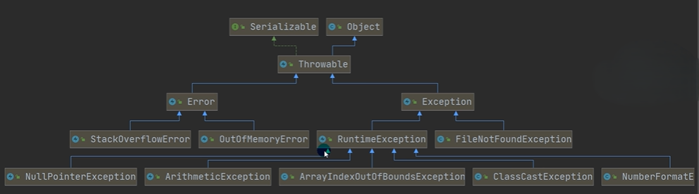

> `Throwable`是所有异常类的一个根类，这里的异常有很多，图中只是列举了几个常见的异常
>
> 图中绿色的虚线表示类实现了接口，蓝色的实线表示继承了父类

***

### 常见的运行时异常

我们需要掌握几个常见的运行时异常：

- 空指针异常：`NullPointerException`

  当应用程序试图在需要对象的地方使用`null`时，抛出该异常（某个对象还没创建，就去使用了，就会抛出空指针异常）

  ```java
  public class NullPointerException {
      public static void main(String[] args) {
          String name = null;
          System.out.print(name.length());   // 会抛出空指针异常
      }
  }
  ```

- 数学运算异常：`ArithmeticException`

  当出现异常运算条件时，就抛出此异常。如，一个整数”除以零“时，就会抛出该异常

- 数组下标越界异常：`ArrayIndexOutOfBoundsException`

  用非法索引访问数组时抛出的异常，如索引为负或大于等于数组大小，则该索引为非法索引

- 类型转换异常：`ClassCastException`

  当试图将对象强制转换为不是实例的子类时，抛出该异常

  ```java
  public class ClassCastException {
      public static void main(String[] args) {
          A b = new B();   // 向上转型，合理的
          B b2 = (B)b;     // 向下转型，合理的
          //B类和C类都是A的子类，但这两个类没有任何关系，不能将B类的对象转为C类的对象，会抛出类型转换异常
          C c2 = (C)b;     
      }
  }
  
  class A {}
  class B extends A {}
  class C extends A {}
  ```

- 数字格式不正确异常：`NumberFormatException`

  当应用程序试图将字符串转换成一种数值类型，但该字符串不能转换为适当格式，抛出该异常（这个异常机制可以确保输入是满足条件数字）

  ```java
  public class NumberFormatException {
      public static void main(String[] args) {
          String name = "123";
          String name2 = "这个是字符串";
          
          // 将String类型转化为Int类型
          int num = Integer.parseInt(name);   // 正确的，不会抛出异常
          int num2 = Integer.parseInt(name2);   // 不正确，会抛出数字格式不正确异常
      }
  }
  ```

***

### 编译异常

编译异常是指在编译期间，就必须处理的异常，否则代码不能通过编译（编译异常一般是发生在网络、文件和数据库操作的时候出现）

常见的编译异常有：

- `SQLException`：操作数据库时，查询表可能发生异常
- `IOException`：操作文件时，发生的异常
- `FileNotFoundException`：当操作一个不存在的文件时，发生异常
- `ClassNotFoundException`：加载类，而该类不存在时，异常
- `EOFException`：操作文件，到文件末尾，发生异常
- `IllegalArguementException`：参数异常

***

### 异常处理机制

异常处理就是当异常发生时，对异常的处理方式

发生异常时，在`Java`中有两种异常处理方式：`try-catch-finally`和`throws`

#### `try-catch-finally`

程序员在代码中捕获发生的异常，自行处理

`try-catch-finally`的异常处理机制：

```java
try {
    可能有异常的代码;
} catch(Exception e) {
    // 捕获到异常
    // 1. 当异常发生时，系统将异常封装成Exception对象e，传递给catch
    // 2. 得到异常对象后，程序员在这里自己处理异常
    // 如果没有发生异常，catch代码块内容不执行
} finally {
    // 不管try代码块是否有异常发生，始终要执行finally内容
    // 所有，通常将释放资源的代码，放到finally代码块中
}
```

如果没有`finally`，语法是可以正常通过的

可以在程序中存在多个`try...catch`异常处理代码块

注意事项：

- 如果异常发生了，则异常发生后的代码就不会执行了（同在`try`中的代码块），直接进入到`catch`代码块中

- 如果异常没有发生，则顺序执行`try`代码块，不会进入到`catch`代码块中

- 如果希望不管是否发生异常，都执行某段代码（如关闭连接、释放资源等），则使用`finally{}`代码块

- 可以有多个`catch`语句，捕获不同的异常（进行不同的业务处理），但是要求父类异常在后，子类异常在前（否则报错，因为会使后面的异常处理没有意义，永远不会进入到后面的异常处理语句），比如（`Exception`在后，`NullPointerException`在前），如果发生异常，只会匹配一个`catch`

  ```java
  public class TryCatchDetail {
      public static void main(String[] args) {
          try {
              Person person = new Person();
              person = null;
              System.out.println(person.getName());  // 会抛出NullPointerException
              int n1 = 10;
              int n2 = 0;
              int res = n1 / n2;  // 会抛出ArithmeticException异常
          } catch (NullPointerException e) {
              System.out.println("空指针异常=" + e.getMessage());
          } catch (ArithmeticException e) {
              System.out.println("算数异常=" + e.getMessage());
          } catch (Exception e) {
              System.out.println(e.getMessage());
          }
      }
  }
  
  class Person {
      private String name = "jlc";
      public String getName() {
          return name;
      }
  }
  ```

- 可以使用`try-finally`配合使用，这种用法相当于没有捕获异常，因此程序遇到异常后会执行完`finally`代码块的内容后，程序直接奔溃掉（应用场景：执行一段代码，不管是否发生异常，都必须执行某个业务逻辑，这个业务逻辑的代码放在`finally`代码块中）

- 对于`catch`代码块中的`return`是不会立即返回，但是`return`的语句会执行，再执行完`finally`代码块中的内容后，进行`return`内容的返回

  ```java
  public static int method() {
      int i = 1;
      try {
          i++;
          String[] names = new String[3];
          names[1].equals("jlc");  // 空指针报错
      } catch (ArrayIndexOutOfBoundsException e) {
          return 2;
      } catch (NullPointerException e) {
          return ++i;   // 保存临时变量temp = 3;
      } finally {
          ++i;  // i = 4;
          System.out.print;n("i=", i);  // 4
      }
  }
  
  mothod();   // i=4  3  最终返回的是临时变量   但是在最后i是为4的
  ```

##### 最佳实践

如果用户输入的不是一个整数，就反复提示输入，直到输入一个整数为止：

```java
public class TryCatchExercise {
    public static void main(String[] args) {
        // 思路：
        // 1. 创建Scanner对象
        // 2. 使用无限循环，去接收一个输入
        // 3. 将输入的值，转成一个int
        // 4. 如果转换时，抛出异常，说明输入的内容不是一个可以转成int的内容
        // 5. 如果没有抛出异常，则break循环
        Scanner scanner = new Scanner(System.in);
        int num = 0;
        String inputStr = "";
        
        while (true) {
            System.out.println("输入一个整数");
            inputStr = scanner.next();
            try {
                num = Integer.parseInt(inputStr);  // 可能会抛出异常
                // 没有抛出异常就退出循环
                break;
            } catch (NumberFormatException e) {
                System.out.println("输入的不是一个整数");
            }
        }
        System.out.println("输入的值是：", num);
    }
}
```

#### `throws`

`throws`异常处理：如果一个方法（中的语句执行时）可能生成某种异常，但是并不能确定如何处理这种异常，则此方法应显示地声明抛出异常，表明该方法将不对这些异常进行处理，而由该方法的调用者负责处理（方法的调用者拿到异常后，可以继续抛出，也可以对异常进行处理）

将发生的异常抛出，交给调用者（方法）来处理，最顶级的处理者就是`JVM`

`throws`的异常处理机制：对于某个方法中发生了异常，我们可以将异常向上抛出去，由上一级通过`try-catch-finally`的方式进行异常处理，或者上一级再往上抛异常，最顶级的处理者就是`JVM`

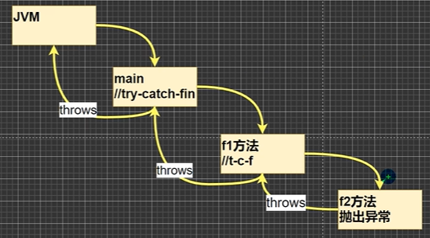

如果异常被抛到了`JVM`处，那么`JVM`处理这个异常是非常简单暴力的：直接输出异常信息，并退出程序运行

在程序中，默认都是使用`throws`机制处理异常的，出现了异常，会由`JVM`简单暴力的进行处理

在方法声明中用`throws`语句可以声明抛出异常的列表（即可以抛出多个异常），`throws`后面的异常类型可以是方法中产生的异常类型，也可以是它的父类

```java
public class Throws {
    public static void main(String[] args) {
        
    }
}

public void f1() throws FileNotFoundException {
    // 这里的异常是一个FileNotFoundException编译异常
    // 我们可以使用try-catch来进行解决，也可以通过抛出异常进行解决：throws FileNotFoundException
    // 抛出异常，让调用f1方法的调用者（可能是另外一个方法）处理异常
    FileInputStream fis = new FileInputStream("d//aa.txt");
}
```

> `throws`关键字后面也可以是异常列表，从而抛出多个异常，如：
>
> `throws FileNotFoundException, NullPointerException`
>
> 如果觉得写`throws FileNotFoundException`太麻烦，我们可以直接写其异常的父类`throws Exception`

注意事项：

- 对于编译异常，程序中必须处理（要么抛出要么处理）
- 对于运行时异常，程序中如果没有处理，默认的方式是`throws`的方式进行抛出，最后由`JVM`进行处理
- 子类重写父类的方法时，对抛出异常的规定：子类重写的方法，所抛出的异常类型要么和父类抛出的异常一致，要么为父类抛出的异常类型的子类型
- 在`throws`过程中，如果有方法`try-catch`，就相当于处理异常，就可以不必`throws`

***

### 自定义异常

当程序中出现了某些”错误“，但该错误信息并没有在`Throwable`子类中描述处理，这个时候可以自己设计异常类，用于描述错误信息

自定义异常的步骤：

1. 定义类：自定义异常类名（程序员自己写）继承`Exception`或`RuntimeException`
2. 如果继承`Exception`，属于编译异常
3. 如果继承`RuntimeException`，属于运行时异常

当我们接收龄时，要求范围在18-120之间，否则抛出一个自定义异常

```java
public class CustomException {
    public static void main(String[] args) {
        int age = 80;
        // 要求年龄范围在18-120之间，否则抛出一个自定义异常
        if(!(age >= 18 && age <= 120)) {
            // 通过构造器设置异常信息
            throw new AgeException("年龄需要在18-120之间");  // throw后面跟的是具体的异常对象
        }
        System.out.println("年龄范围正确");
    }
}

// 自定义一个异常
class AgeException extends RuntimeException {
    // 构造器
    public AgeException(String message) {
        super(message);
    }
}
```

一般来说，我们自定义异常是继承`RuntimeException`，即把自定义异常做成运行时异常，因为可以使用默认的抛出异常处理机制，会比较方便

`throw`和`throws`的区别：

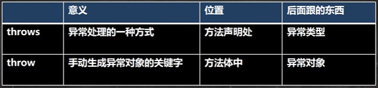

`throw`不仅可以跟自定义的异常对象，也可以跟系统提供的异常类实例出的对象：

`throw new ArrayIndexOutOfBoundsException("参数个数不对")`   通过构造器重写了异常消息


## 常用类

常用类是比较重要的，在面试的时候也是问的比较多的

***

### 包装类

针对八种基本的数据类型，定义了相应的引用类型，这些基本数据的引用类型叫做包装类

这些基本的数据类型，有了类的特点，就可以调用类中的方法

| 基本数据类型 |   包装类    |
| :----------: | :---------: |
|  `boolean`   |  `Boolean`  |
|    `char`    | `Character` |
|    `byte`    |   `Byte`    |
|   `short`    |   `Short`   |
|    `int`     |  `Integer`  |
|    `long`    |   `Long`    |
|   `float`    |   `Float`   |
|   `double`   |  `Double`   |

其中，前面两个包装类的父类是`Object`类型；后面六个包装类的父类是`Number`，`Numer`在继承`Object`基类

#### 包装类和基本数据类型的转换

- 在`jdk5`之前的手动装箱和拆箱方式，装箱：基本数据类型转换为包装类型，反之拆箱为包装类型转换为基本数据类型
- `jdk5`以后（含`jdk5`）的自动装箱和拆箱方式，自动装箱的底层调用的是`valueOf`方法，如：`Interger.valueOf()`

```java
public class Wrapper {
    public static void main(String[] args) {
        // 演示int <---> Integer 的装箱和拆箱
        // jdk5之前是手动装箱和拆箱
        int n1 = 100;
        // 手动装箱 int ---> Integer
        Integer integer1 = new Integer(n1);//或者使用 Integer integer1=Integer.valueOf(n1);
        // 手动拆箱 int <--- Integer
        int n = integer1.intValue();
        
        // 在jdk5以后（包括5），就可以自动装箱和自动拆箱
        int n2 = 200;
        // 自动装箱 int ---> Integer
        Integer integer2 = n2;   // 底层调用的是Integer.valueOf方法
        // 自动拆箱 int <--- Integer
        int n = integer2;   // 底层还是调用integer2.intValue()方法
    }
}
```

> 上述代码以`int`来举例，其他的包装类的装箱和拆箱方式类似

经典面试题：

```java
// 下面输出的内容是什么：
Object obj1 = ture ? new Integer(1) : new Double(2.0);
System.out.println(obj1);   // 1.0
// ture ? new Integer(1) : new Double(2.0)这一块是一个整体，其精度最高的是Double，因此会提升优先级
// 即三元运算符是一个整体
```

`Integer`类的经典面试题：

```java
// 下面代码输出什么
public void method() {
    Integer i = new Integer(1);
    Integer j = new Integer(1);
    System.out.println(i == j);   // false  两个不同的对象，只要是new，出来的就是不同对象
    
    // 主要是看范围，如果传入的值为-128到127之间，是直接返回的，没有创建对象
    Integer m = 1;   // 底层是Integer.valueOf(1);  我们需要看源码
    Integer n = 1;   // 底层是Integer.valueOf(1);
    System.out.println(m == n);   // true
    
    Integer x = 128;
    Integer y = 128;
    System.out.println(x == y);   // false  创建了对象，所有不相等
    
    Integer a = 127;
    Integer b = new Integer(127);  
    System.out.println(a == b);   // false  b是对象
    
    // 只要有基本数据类型的，就只要判断值是否相等
    Integer c = 127;
    int d = 127;
    System.out.println(c == d);   // true  
    Integer h = 128;
    int j = 128;
    System.out.println(h == j);   // true  
}
```

对于`Integer.valueOf()`的源码：

```java
public static Integer valueOf(int i) {
    // 如果传入的i在以下的范围内，就直接从数组返回（这个数组是在类加载的时候就创建好了的，类似于将缓存中的值直接给你），没有真正的创建对象，这个范围是-128 到 127，如果不在这个范围内，就new一个对象
    if (i >= IntegerCache.low && i <= IntegerCache.high)
        return IntegerCache.cache[i + (-IntegerCache.low)];
    return new Integer(i);
}
```

#### 包装类与`String`类型的相互转换

演示案例以`Integer`包装类和`String`类转换为例：

```java
public class WrapperVSString {
    public static void main(String[] args) {
        // 包装类 ---> String类型
        Integer i = 100;  // 自动装箱
        // 方式一：
        String str1 = i + "";   // 这种情况对原先的i的数据类型没有影响
        // 方式二：
        String str2 = i.toString();
        // 方式三：
       	String str3 = String.valueOf(i);
        
        // 包装类 <--- String类型
        String str = "123";
        // 方式一
        Integer i2 = Integer.parseInt(str);   // 自动装箱
        // 方式二：通过包装类中的构造器方法
        Integer i3 = new Integer(str);
    }
}
```

#### 包装类的常用方法

`Integer`包装类的常用方法：

- `Integer.MIN_VALUE`：返回最小值
- `Integer.MAX_VALUE`：返回最大值

`Character`包装类的常用方法：

- `Character.isDigit()`：判断是不是数字
- `Character.isLetter()`：判断是不是字母
- `Character.isUpperCase()`：判断是不是大写字母
- `Character.isLowerCase()`：判断是不是小写字母
- `Character.isWhitespace()`：判断是不是空格
- `Character.toUpperCase()`：转成大写
- `Character.toLowerCase()`：转成小写

***

### `String`类

`String`对象是用于保存字符串的，也就是一组字符序列

字符串常量对象是用双引号括起来的，如：`"你好"`

```java
String name = "jlc";
// name为字符串变量
// "jlc"为字符串常量，是一个具体的值
```

字符串的字符是使用`Unicode`字符编码，一个字符（不区分字母还是汉字）都是占两个字节

`String`类常见的构造器：（字符串类有很多的构造器）

- `String s1 = new String();`
- `String s2 = new String(String original);`
- `String s3 = new String(char[] a);`
- `String s4 = new String(char[] a, int startIndex, int count);`
- `String s5 = new String(byte[] b);`

`String`类的继承关系：

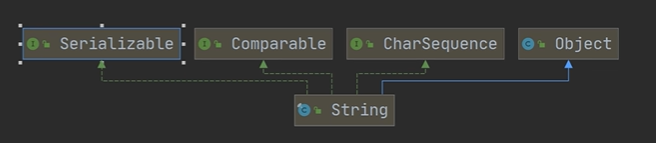

> `String`类继承于`Object`基类，同时实现了三个接口：
>
> - `Serializable`：实现了这个接口，表示对象可以串行化，意味着`String`对象可以在网络中传输
> - `Comparable`：实现了这个接口，说明了`String`对象可以进行比较
> - `CharSequence`：字符序列接口

`String`类是`finaly`类，即不能被其他类继承

`String`类中有属性：`private final char value[];`  用于存放字符串内容，`value`是一个`final`类型，一旦被赋值了，就不可以进行改变（是指地址不可修改，指向了一个空间后，就不可以修改指向另一个空间）（同一个空间中的字符串内容是可以进行修改的）

`String`对象的两种创建方式：两种创建对象方式的机制是不一样的

- 直接赋值：`String s = "jlc";`

  创建机制：先从常量池查看是否有`"jlc"`s数据空间，如果有，直接指向；如果没有则重新创建，然后指向。`s`最终指向的是常量池的空间地址

- 调用构造器：`String s = new String("jlc");`

  先在堆中创建空间，里面维护了`value`属性，指向常量池的`"jlc"`空间。如果常量池没有`"jlc"`，重新创建，如果有，直接通过`value`指向，最终指向的是堆中的空间地址

具体内存图：

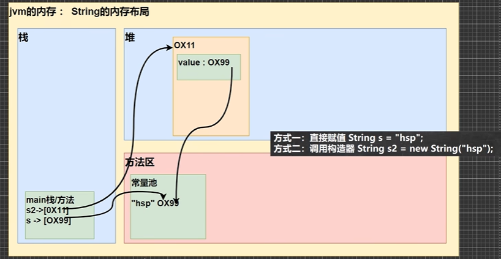

```java
String a = "abc";
String b = "abc";
System.out.println(a.equals(b));   // true   比较字符内容是否一样
System.out.println(a == b);     // true   指向的地址是一样的，指向的是同一个对象

String a = new String("abc");
String b = new String("abc");
System.out.println(a.equals(b));   // true   比较字符内容是否一样
System.out.println(a == b);     // false   指向的地址是不一样，指向堆中的不同对象

String a = "abc";
String b = new String("abc");
System.out.println(a.equals(b));   // true   比较字符内容是否一样
System.out.println(a == b); // false  指向的地址是不一样，指向堆中的不同对象，一个指向的常量池中的对象
System.out.println(a == b.intern());  // true  b.intern()返回的是常量池中的地址
System.out.println(b == b.intern());  // false  b是指向堆的，b.intern()返回的是常量池中的地址
// 知识点：当调用intern方法时，如果池已经包含一个等于此String对象的字符串（用equals(Object)方法确定），则返回常量池中的字符串。否则，将此String对象添加到常量池中，并返回此String对象的引用
// 总结：b.intern()方法最终返回的是常量池的地址（对象）
```

```java
Person p1 = new Person();
p1.name = "jlc";
Person p2 = new Person();
p2.name = "jlc";

System.out.println(p1.name.equals(p2.name));   // True  字符串内容一样
System.out.println(p1.name == p2.name);   // True  p1.name 和 p2.name 都是指向常量池中的"jlc"
System.out.println(p1.name == "jlc");   // True  "jlc"的地址就是池中的具体值的地址 p1.name也指向池中的具体值的地址
```

#### 对象特性

- `String`是一个`final`类，代表不可变的字符序列
- 字符串是不可变的，一个字符串对象一旦被分配，其内容是不可变的

经典面试题：

```java
String s1 = "hello";
s1 = "haha";
```

创建了两个对象（字符串常量对象），先指向了`"hello"`，后指向了`"haha"`

内存分布图：

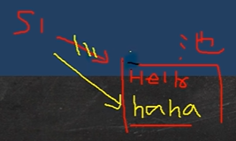

```java
String a = "hello" + "abc";
// 底层编译器会进行优化（判断创建的常量池对象，是否有引用指向），优化后等价于：String a = "helloabc";
// 所以创建了一个字符串常量对象
```

```java
String a = "hello";
String b = "abc";
// 1. 先创建一个 StringBuilder  sb = StringBuilder()
// 2. 执行 sb.append("hello");  sb.append("abc");
// 3. 执行 String c = sb.toString();  将字符串返回给c
// 最后其实是c指向堆中的对象（String）value[] --> 指向池中的"helloabc"
String c = a + b;
```

> 底层是`StringBuilder sb = new StringBuilder();`   `sb.append(a);`  `sb.append(b);`
>
> `sb`是在堆中，并且`append`是在原来字符串的基础上进行追加的
>
> 一个创建了三个对象，内存分布图：
>
> 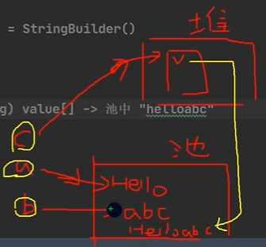

重要规则：

- `String c1 = "ab" + "cd";`  常量相加，看的是池
- `String c1 = a + b;`  变量相加，是在堆中

```java
public class Test1 {
    String str = new String("jlc");
    final char[] ch = {'j', 'a', 'v', 'a'};
    public void change(String str, char ch[]) {
        str = "java";
        ch[0] = 'h';
    }
}

public static void main(String[] args) {
    Test1 ex = new Test1();
    ex.change(ex.str, ex.ch);
    System.out.print(ex.str + "and");   // jlcand
    System.out.println(ex.ch);   // hava
}
```

内存分析：

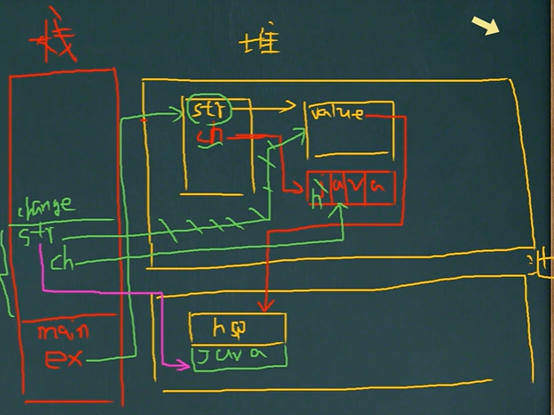

> - 堆中有一个对象为`str`，字符串对象指向堆中的一个`value`空间，这个地址指向池中的具体数据
> - 字符串数组，是放在堆中的，`ch`属性指向堆中的空间
> - 生成的`ex`对象指向堆中的空间
> - 在调用方法的时候，会在栈中开辟新栈`change`，将实参`ex.str`赋值给了形参`str`；将实参`ex.ch`赋值给了形参`ch`，刚开始传递过来时，`str`也指向原先的地址空间
> - `str = "java";`执行后，断掉原先的指向，重新指向到常量池中的`java`地址中
> - `ch`一开始也是指向`ex.ch`指向的地址空间（堆中的数组）
> - `ch[0] = 'h';`执行后，将第一个元素进行修改（修改字符数组的某个元素是合理的）
> - 当方法执行完后，`change`栈就销毁了，就回到了主栈
> - `ex.str`没有发生任何的变化，其值还是`jlc`；但是`ex.ch`的属性值第一个被修改了

#### 常用方法

`String`类的方法是非常多大，我们需要掌握常用方法：

- `equals`：判断内容是否相等（区分大小写）

  ```java
  String str1 = "hello";
  String str2 = "Hello";
  System.out.println(str1.equals(str2));   // false
  ```

- `equalsIgnoreCase`：判断内容是否相等（不区分大小写）

- `length`：获取字符串长度（获取字符的个数）

  ```java
  String str = "Hello";
  System.out.println(str.length());  // 5
  ```

- `indexOf`：获取某个字符在字符串中第一次出现的索引，索引从0开始，如果找不到，返回-1

  ```java
  String str = "jlc@sdfds@efs";
  int index = str.indexOf('@');
  System.out.println(index);   // 3
  // 该方法除了是单个字符，还可以是字符串
  System.out.println(str.indexOf("lc"));   // 1
  ```

- `lastIndexOf`：获取某个字符在字符串中最后一次出现的索引，索引从0开始，如果找不到，返回-1

- `substring`：截取指定范围的子串

  ```java
  String name = "hello,jlc";
  System.out.println(name.substring(6));   // jlc  从索引为6的位置开始截取，到最后的字符
  System.out.println(name.substring(0, 5));   // hello  截取指定开始索引和结束索引的字符（开始索引包括，结束索引不包括）
  ```

- `trim`：去掉前后空格

- `charAt`：获取某索引处的字符，注意不能使用`Str[index]`这个方式（不能将字符串当数组使用）`cahrAt(0)`表示获取字符串的第一个字符

- `toUpperCase`：将字符串全部转换成大写

- `toLowerCase`：将字符串全部转换成小写

- `concat`：拼接字符串（拼接字符串也可以使用加号来替代）

  ```java
  String str = "jlc";
  str = str.concat("年龄25");
  System.out.println(str);   // jlc年龄25
  ```

- `replace`：替换字符串中的字符

  ```java
  String str = "jlc年龄25";
  // 将字符串中所有的jlc字符串替换为jinLinC字符串
  System.out.println(str.replace("jlc", "jinLinC"));   // jinLinC年龄25
  // str.replace() 返回的是执行完替换过的结果，本身的str字符串是没有任何影响的（即str字符串不改变）
  ```

- `split`：通过指定的字符来分割字符串，对于某些分割字符，我们需要使用转义字符

  ```java
  String poem = "abc ABC def DEF";
  String[] split = poem.split(" ");   // 以空格进行分割字符串，返回的是一个数组
  for(int i = 0; i < split.length; i++) {
      System.out.println(split[i]);
  }
  
  // 分割时，有特殊字符，需要加入转义字符
  String load = "D:\\aaa\\bbb";
  String[] load1 = poem.split("\\\\");  // 根据\\进行分割，要使用到转义字符两个斜杠表示一个斜杠
  ```

- `compareTo`：比较两个字符串的大小（该方法继承于接口`Comparable`）

  ```java
  String a = "jchn";
  String b = "jack";
  // 先比较长度，如果长度一样（长度不一样返回长度相减后的值），在比较第一个字符，依次类推
  System.out.println(a.compareTo(b));  // 2  'c' - 'a' = 2  正数表示前面的字符大，反之，后面大
  // 如果比较的两个字符串完全相等，则返回0
  ```

- `toCharArry`：将字符串转化为字符数组

  ```java
  String str = "hello";
  char[] ch = str.toCharArry();
  for(int i = 0; i < ch; i++) {
      System.out.println(ch[i]);
  }
  ```

- `format`：格式字符串

  ```java
  String str = String.format("我的姓名是%s 年龄是%d 成绩是%.2f", name, age, score);
  ```

  > 其中`%d`等称为占位符，用后续的变量进行填充
  >
  > - `%s`表示后面由字符串进行替换
  > - `%d`表示后面由整数进行替换
  > - `%.2f`表示使用小数进行替换，替换后保留小数点后两位（进行了四舍五入的操作）
  > - `%c`表示使用`char`字符类型进行替换

#### `StringBuffer`类

`String`类是保存字符串常量的，每次更新都需要重新开辟空间，效率较低，因此`java`设计者还提供了`StringBuilder`和`StringBuffer`来增强`String`的功能，提高了效率

`java.lang.StringBuffer`表示可变的字符序列，可以对字符串内容进行增删，其许多方法与`String`类中的方法相同，但`StringBuffer`是可变长度的，简而言之，`StringBuffer`是一个容器

`StringBuffer`类的继承关系：

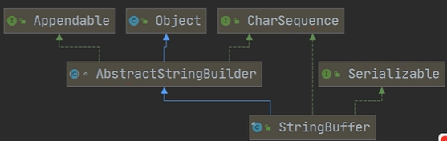

> `StringBuffer`的直接父类是`AbstractStringBuilder`，在父类`AbstractStringBuilder`中，有属性`char[] value`，该`value`数组来存放字符串内容，但是这个数组不是`final`类型，该数组存放在堆中，而不是像字符串的`value`存放在常量池中
>
> 同时`StringBuffer`实现了`Serializable`，即`StringBuffer`的对象可以串行化（对象可以网络传输和保存到文件）
>
> `StringBuffer`类是一个`final`类，不能被继承

`String`类与`StringBuffer`类的区别：

- `String`保存的是字符串常量，里面的值不能更改，每次`String`类的更新实际上就是更改地址，效率低（值放在常量池中）
- `StringBuffer`保存的是字符串变量，里面的值可以更改，每次`StringBuffer`的更新可以更新内容，一般不会更新地址，即创建新对象（只有当原先的地址空间不够了，会统一的扩充一次，将原先的内容拷贝过来），效率高（值放在堆中）

##### 构造器

- `StringBuffer()`：构造一个其中不带字符的字符串缓冲区，其初始容量为16个字符，用于存放字符内容
- `StringBuffer(CharSequence seq)`：构造一个字符串缓冲区，它包含与指定的`CharSequence`相同的字符
- `StringBuffer(int capacity)`：构造一个不带字符，但具有指定初始容量的字符串缓冲区，即对`char[]`的的大小进行指定
- `StringBuffer(String str)`：构造一个字符串缓冲区，并将内容初始化为指定的字符串内容，容量为当前字符串的长度再加上16个字符

##### `String`和`StringBuffer`的互相转换

在开发中，我们经常将`String`和`StringBuffer`进行转换

- `String`转`StringBuffer`

  ```java
  String s = "hello";
  // 方式一
  StringBuffer b1 = new StringBuffer(s);  // 返回的b1是StringBuffer对象，s还是String对象
  // 方式二  先开辟空间，再进行内容的追加
  StringBuffer b2 = new StringBuffer();
  b2.append(s);
  ```

- `StringBuffer`转`String`

  ```java
  // 方式一
  String s1 = b1.toString();
  // 方式二
  String s2 = new String(b1);
  ```

##### 常用方法

`StringBuffer`类的常用方法有：

- `append`：增

  ```java
  StringBuffer s = new StringBuffer("hello");
  System.out.println(s.append('.'));   // hello.   结果返回的还是StringBuffer类型
  ```

- `delect(start, end)`：删，删除索引大于等于`start`，小于`end`处的字符

- `replace(start, end, string)`：将`start`到`end`间的内容用`string`替换掉，不含`end`

- `indexOf`：查找子串在字符第一次出现的索引，如果找不到返回-1

- `insert`：插入，在指定的位置直接插入字符串

  ```java
  StringBuffer s = new StringBuffer("hello");
  s.insert(2, "abc");    // 在索引为2的位置插入abc字符串，原来索引为2的内容往后移动
  System.out.println(s);   // heabcllo
  ```

- `length`：获取长度

经典案例：

```java
String str = null;
StringBuffer sb = new StringBuffer();
sb.append(str);   // 根据源码，底层调用的是AbstractStringBuffer的appendNull方法，将null转换为null字符串
System.out.println(sb.length());   // 4
System.out.println(sb);   // null

StringBuffer sb1 = new StringBuffer(str);  // 查看底层源码，该构造器 super(str.length() + 16)
// 因此这里会出现空指针异常
```

格式化输出小案例：

```java
// 商品的价格，要求输出的形式为：23,123,456.59  要求价格的小数点前面每三位用逗号隔开，在输出

// 思路分析：
// 2. 将String转成StringBuffer，使用StringBuffer的insert方法插入逗号
// 3. 使用相关方法进行字符串的处理
String price = "23123456.59";
StringBuffer sb = new StringBuffer(price);
// 找到小数点的索引，然后在该位置的前三位插入逗号即可
for(int i = sb.lastIndexOf(".") - 3; i > 0; i -= 3) {
    sb = sb.insert(i, ",");   // 插入逗号
}
System.out.println(sb);   // 23,123,456.59
```

#### `StringBuilder`类

`StringBuilder`类是一个可变的字符序列，此类提供一个与`StringBuffer`兼容的`API`（大多数的方法是一样的，可以参考`StringBuffer`类），但不保证同步（`StringBuilder`不是线程安全的）。该类被设计用作`StringBuffer`的一个简易替换，用在字符串缓冲区被单个线程使用的时候。如果可能，单线程的时候建议优先采用该类，因为在大多数实现中，它比`StringBuffer`要快

`StringBuilder`上的主要操作是`append`和`insert`方法，可以重载这些方法，以接收任意类型的数据

继承关系：

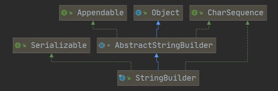

> `StringBuilder`类是`final`类，不能被继承
>
> `StringBuilder`对象的字符序列仍然存放在其父类`AbstractStringBuilder`的`char[] value;`中，因此，字符序列是存放在堆中的
>
> `StringBuilder`的方法，没有做互斥的处理，即没有`synchronized`关键字，因此，只推荐在单线程的情况下使用

#### 三大类的比较

- `StringBuilder`和`StringBuffer`类非常相似，均代表可变字符序列，而且方法也一样

- `String`：不可变字符序列，效率低，但是复用率高（可以有很多对象指向常量池中的同一个常量）

- `StringBuffer`：可变字符序列，效率较高（增删），线程安全（有`synchronized`关键字，当一个线程在操作的时候，其他线程就不能操作了）

- `StringBuilder`：可变字符序列，效率最高，线程不安全

- `String`使用的注意事项说明：

  ```java
  String s = "a";   // 创建了一个字符串
  s += "b";   // 实际上原来的"a"字符串对象已经丢弃了，现在又产生了一个字符串"ab"，如果多次执行这些改变字符串内容的操作，会导致大量副本字符串对象存留在内存中，降低效率。如果这样的操作放到循环中，会极大影响程序的性能，因此，如果我们对String做大量修改，不要使用String类型
  ```

  结论：如果我们对`String`做大量修改，不要使用`String`类型，应该使用`StringBuffer`类

#### 三大类的使用原则

三大类的使用原则非常重要，一定要记下来

- 如果字符串存在大量的修改操作，一般使用`StringBuilder`或`StringBuffer`类
- 如果字符串存在大量的修改操作，并且在单线程的情况，使用`StringBuilder`类
- 如果字符串存在大量的修改操作，并且在多线程的情况，使用`StringBuffer`类
- 如果我们的字符串很少修改，被多个对象引用，使用`String`类，如配置信息等

#### 字符串练习题

- 将字符串中指定部分进行翻转：如将`abcdef`中的`bcde`翻转为`aedcbf`

  ```java
  public class StringHomeWork {
      public static void main(String[] args) {
          String str = "abcdef";
          try {
              str = reverse(str, 1, 4);
          } catch (Exception e) {
              System.out.println(e.getMessage());
          }
      }
      
      public static String reverse(String str, int start, int end) {
          // 对输入的参数做一个验证，思路：写出正确的情况，然后取反
          if(!(str != null && start >= 0 && and > start && end < str.length())) {
              throw new RuntimeException("参数不正确");
          }
          // 思路：先将String转成char[]，因为char[]的元素是可以交换的
          char[] chars = str.toCharArray();
          char temp = ' ';
          for(int i = start, j = end; i < j; i++, j--) {
              temp = chars[i];
              chars[i] = chars[j];
              chars[j] = temp;
          }
          // 使用chars重新构建一个字符串返回
          return new String(chars);
      }
  }
  ```

***

### `Math`类

`Math`类包含用于执行基本数学运算的方法，如初等指数、对数、平方根和三角函数，这些方法在`Math`类中一般都是静态`static`方法，常用的方法有：

- `abs`：取绝对值

  ```java
  int abs = Math.abs(-9);
  System.out.println(abs);   // 9
  ```

- `pow`：求幂

  ```java
  int pow = Math.pow(2, 4);  // 2的4次方
  System.out.println(abs);   // 16
  ```

- `ceil`：向上取整（返回大于等于该参数的最小整数）

  ```java
  double ceil = Math.ceil(3.9);
  System.out.println(ceil);   // 4.0
  ```

- `floor`：向下取整（返回小于等于该参数的最大整数）

  ```java
  double floor = Math.floor(4.001);
  System.out.println(floor);   // 4.0
  ```

- `round`：四舍五入

  ```java
  long round = Math.round(-5.001);
  System.out.println(round);   // -5
  ```

- `sqrt`：开方（根号2），如果被开方的数是负数，则结果返回`NaN`

- `random`：取随机数（返回的是0到1之间的随机小数，0可以取到，1取不到）

  ```java
  // 编写一个[a, b]之间的随机整数
  System.out.println((int)(a + Math.random() * (b - a + 1)));
  ```

- `max`：求两个数的最大值

  ```java
  System.out.println(Math.max(1, 9));  // 9
  ```

- `min`：求两个数的最小值

***

### `Arrays`类

`Arrays`类里面包含了一系列的静态方法，用于管理或操作数组（比如排序和搜索）

常见的方法有：

- `toString`：返回数组的字符串形式（用中括号`[]`包裹）将数组中的内容拼接到一个字符串中

  ```java
  Integer[] integers = {1, 20, 90};
  // 之前的输出方式是通过for循环进行输出，现在可以使用Arrays类中的toString方法，以字符串的方式进行输出
  System.out.println(Arrays.toString(integers));  // [1, 20, 90]
  ```

  > `toString`底层的方法也是进行一个`for`循环，只是在前后都追加一个中括号

- `sort`：排序（自然排序和定制排序）排序可以使用冒泡排序，也可以使用`Arrays`提供的排序方法（这样更加简单）

  ```java
  Integer arr[] = {1, -1, 7, 0, 89};
  // 因为数组是引用类型，所有通过sort排序后，会直接影响到实参arr
  
  // 自然排序
  Arrays.sort(arr);   // 默认是从小到大进行排序的
  
  // 定制排序
  // 可以重载sort，可以通过传入一个接口Comparator实现定制排序（比较器，是从大到小排序还是从小到大排序）
  // 调用定制排序时，第一个参数是排序的数组；第二个参数是实现了Comparator接口的匿名内部类，要求实现compare()方法，这里体现了接口编程的方式
  Arrays.sort(arr, new Comparator() {  // 使用了匿名内部类的概念
      @Override
      public int compare(Object o1, Object o2) {
          // 将传入的参数进行向下转型
          Integer i1 = (Integer) o1;
          Integer i2 = (Integer) o2;
          // i2 - i1 实现了从大到小的排序；  如果改为i1 - i2就是默认排序，即从小到大的排序
          return i2 - i1;
      }
  });
  // 体现了接口编码+动态绑定机制+匿名内部类的综合使用
  ```

  > 在`binarySort`方法底层，会通过匿名内部类的`compare`方法来决定排序的顺序
  >
  > ```java
  > while (left < right) {
  >     int mid = (left + right) >>> 1;
  >     if (c.compare(pivot, a[mid]) < 0)
  >         right = mid;     // 小于0，从小到大排序
  >     else
  >         left = mid + 1;  // 大于0，从大到小排序
  > }
  > assert left == right;
  > ```
  
- `binarySearch`：通过二分搜索法进行查找，要求必须是排序好的

  ```java
  Integer[] arr = {1, 2, 90, 123, 300};   // 已经排序好的数组
  // 查找数组中是否有2这个元素值，返回的是对应元素的索引
  int index = Arrays.binarySearch(arr, 2);   
  // 如果查找的元素不存在，则返回-(low + 1)应该存在的位置加1，前面再加一个负号
  // 总之，如果返回的是负值，就表示没有找到
  ```

- `copyOf`：数组元素的复制

  ```java
  // 从数组中arr拷贝arr.length个元素到新数组newArr中
  Integer[] newArr = Arrays.copyOf(arr, arr.length);
  // 这个拷贝的数组长度是可以进行变化的
  // arr.length - 1，就是少拷贝一个元素到新数组中，将原数组的最后一个不进行拷贝
  // arr.length + 1，多拷贝一个元素到新数组中，但是原数组又没有多余的元素了，就给新数组加null
  // 如果拷贝的长度小于0，就会抛出异常
  ```

- `fill`：数组元素的填充

  ```java
  Integer[] num = new Integer[]{9, 3, 2};
  // 用99去填充num数组中的所有数，即用99将数组中的元素值全部进行替换
  Arrays.fill(num, 99);   // 填充后数组的元素值全部变成了99   {99, 99, 99}
  ```

- `equals`：比较两个数组元素内容是否完全一致

  ```java
  Integer[] arr1 = {1, 2, 90, 123, 300};  
  Integer[] arr2 = {1, 2, 90, 123, 300};  
  boolean equals = Arrays.equals(arr1, arr2);   // true
  ```

- `asList`：将一组值，转换成`list`

  ```java
  // 将(2, 3, 4)数据转成一个List集合
  List asList = Arrays.asList(2, 3, 4);
  // asList的编译类型是List(接口) 运行类型是java.util.Arrays#ArrayList(Arrays类中的静态内部类)
  ```

***

### `System`类

`System`类常见的方法：

- `exit`：退出当前程序

  ```java
  System.out.println("ok1");
  System.exit(0);  // 退出程序  0表示正常退出
  System.out.println("ok2");  // 不会执行
  ```

- `arraycopy`：复制数组元素，使用`Arrays.copyOf`完成复制数组的底层就是`System.arraycopy()`

  ```java
  int[] src = {1, 2, 3};
  int[] dest = new int[3];  // dest数组当前为 {0, 0, 0}
  System.arraycopy(src, 0, dest, 0, 3);  // {1, 2, 3}
  // 其中src表示源数组（待拷贝的数组，提供数据），0表示从源数组中的哪个索引位置开始拷贝
  // dest表示目标数组（数组拷贝到哪个数组中），0表示拷贝到目标数组的哪个索引（哪个索引开始拷贝），3表示从源数组拷贝多少个数据到目标数组（一般写成src.length）
  
  System.arraycopy(src, 0, dest, 1, 2);  // {0， 1, 2}
  ```

- `currentTimeMillens`：返回当前时间距离`1970-1-1`的毫秒数

  ```java
  System.out.println(System.currentTimeMillens());
  ```

- `gc`：运行垃圾回收机制

***

### 大数据类

#### `BigInteger`类和`BigDecimal`类

`BigInteger`和`BigDecimal`两个类通常用于大数据的处理方案，应用场景：

- `BigInteger`适合保存比较大的整型

  当我们编程中，需要处理很大的整数，这个时候可能`long`就不够用了，我们可以使用`BigInteger`类来处理

  ```java
  BigInteger bigInteger = new BigInteger("2322432645467845654654646535654656");
  System.out.println(bigInteger);  // 2322432645467845654654646535654656
  BigInteger bigInteger2 = new BigInteger("23");
  // 在对BigInteger进行加减乘除的时候，需要使用对应的方法，不能使用传统的+-*/
  // 加add()
  System.out.println(bigInteger.add(bigInteger2));
  // 减subtract()
  System.out.println(bigInteger.subtract(bigInteger2));
  // 乘multiply()
  System.out.println(bigInteger.multiply(bigInteger2));
  // 除divide()  这里的除是指整除
  System.out.println(bigInteger.divide(bigInteger2));
  ```

- `BigDecimal`适合保存精度更高的浮点型（小数）

  在编程中，对于小数，如果位数特别大，`double`往往不够用，系统会进行精度的缩减，如果我们不希望精度的缩减，我们可以使用`BigDecimal`类保存精度更高的小数

  ```java
  BigDecimal bigDecimal = new BigDecimal("232243.2645467845654654646535654656");
  ```

  > 其加减乘除的运算和`BigInteger`类似，但是使用除法时，可能会出现除不尽的问题（会出现无限循环，从而抛出异常）如果我们不想让其抛出异常，我们只需要给定精度即可
  >
  > ```java
  > // 如果有无限循环的小数，指定了BigDecimal.ROUND_CEILING精度，就会保留到分子的精度，不会再抛异常
  > System.out.println(bigDecimal.divide(bigDecimal2, BigDecimal.ROUND_CEILING));
  > ```

***

### 日期类

在编程过程中一般会涉及到日期，`Java`中有三种日期类，分别称为第一代、第二代和第三代

#### 第一代日期类`Date`

第一代日期类`Date`是最早出现的日期类，可以精确到毫秒，代表特定的瞬间

与`Date`类配套使用的有`SimpleDateFormat`：用于格式和解析日期的具体类，允许进行格式化（日期-->文本）、解析（文件-->日期）和规范化

`Date`类的继承关系：


第一代日期类`Date`目前有些方法已经过时了，使用的时候需要注意

在`IDEA`代码编译器的类图中，是可以展示类的属性，展示的属性不单单局限于我们声明的具体属性，对于`getXxx`和`setXxx`方法中的`xxx`内容，查看属性时，也会被放到类图中的属性中，当作该类的属性

##### 基本使用

使用之前需要引入时间相关的包：`import java.util.Date;`

```java
import java.util.Date;

public class Date01 {
    public static void main(String[] args) throws ParseException {
        // 获取当前的系统时间
		Date d1 = new Date();   // Thu Mar 04 17:19:30 CST 2025
        
        // 我们需要对日期的格式进行转换，可以指定我们需要的时间形式，注意，这里使用的字母是规定好的
        SimpleDateFormat sdf = new SimpleDateFormat("yyyy年MM月dd日 hh:mm:ss E");
        String format = sdf.format(d1);   // 2025年03月04日 05:19:30 星期二
        
        // 通过指定的毫秒数来获取时间
        Date d2 = new Date(9234567);  // Thu Jan 01 10:33:54 CST 1970
        
        // 将一个格式化的字符串转换成对应的Date
        String s = "2025年03月04日 05:19:30 星期二";
        // 这里需要抛出异常，防止报错，这里使用的sdf格式需要和给定的字符串格式一样，否会抛出转换异常
        Date parse = sdf.parse(s);  // Thu Mar 04 17:19:30 CST 2025
    }
}
```

> 格式化时间的内容的特定字母常用的有：
>
> `y`：年；`M`：月；`w`：年中的周数；`W`：月份中的周数；`D`：年中的天数；`d`：月份中的天数；`F`：月份中的星期；`E`：星期中的天数；`a`：`am/pm`标记；`H`：一天中的小时数（0-23）；`k`：一天中的小时数（1-24）；`K`：`am/pm`中的小时数（0-11）；`h`：`am/pm`中的小时数（0-12）；`m`：小时中的分钟数；`s`：分钟中的秒数；`S`：毫秒数；

#### 第二代日期类`Calendar`

第二代日期类`Calendar`类（日历），`Calendar`类是一个抽象类，它为特定瞬间与一组如`YEAR`、`MONTH`、`DAY_OF_MONTH`和`HOUR`等日历字段之间的转换提供了一些方法，并为操作日历字段（例如获得下星期的日期）提供了一些方法

`Calendar`类的继承关系：


`Calendar`类是一个抽象类，其构造器是私有的，我们要获取`Calendar`类的实例，需要使用该类提供的`getInstance()`方法

##### 基本使用

使用之前需要引入时间相关的包：`import java.util.Calendar;`

```java
import java.util.Calendar;

public class Calendar01 {
    public static void main(String[] args) {
        // 获取一个容日历类的对象，不能使用new方法，因为构造器是私有的
        Calendar c = Calendar.getInstance();  // c输出的内容，将时间信息藏在了相应的字段中
        // 获取日历对象的某个日历字段
        c.get(Calendar.YEAR);   // 获取当前时间的年
        c.get(Calendar.MONTH) + 1;   // 获取当前时间的月，注意要加一，因为是按照0开始编号的
        c.get(Calendar.DAY_OF_MONTH);  // 获取当前时间的日
        // 如果要通过24小时的进制来获取时间，使用HOUR_OF_DAY
        c.get(Calendar.HOUR);  // 获取当前时间的小时
        c.get(Calendar.MINUTE);  // 获取当前时间的分钟
        c.get(Calendar.SECOND);  // 获取当前时间的秒
        // Calendar类没有提供对应的格式化的类，需要自己进行拼接组合，可以更加灵活化
        System.out.println(c.get(Calendar.YEAR)+"年" + (c.get(Calendar.MONTH) + 1)+"月");
    }
}
```

#### 第三代日期类

对于第一代日期类，在`jdk1.0`就有了，但是它的大多数方法已经在`jdk1.1`时引入了`Calender`类之后就被弃用了，然而，`Calender`也存在一些问题：

- 可变性问题：像日期和时间这样的类应该是不可变的，但是`Calender`类型是可变的
- 偏移性：`Date`中的年份是从1900年开始的，而月份都是从0月开始的
- 格式化：格式化只对`Date`有用，`Calendar`不能使用格式化
- 此外，第一代和第二代时间类的线程都不是安全的，不能处理闰秒等（每隔两天，多出1秒）

针对于上述的情况，`Java`设计者在`jdk8.0`之后，引入了三个日期类：

- `LocalDate`：日期类，返回年月日
- `LocalTime`：时间类，返回时分秒
- `LocalDateTime`：日期时间类。返回年月日和时分秒，用这个即可

第三代日期的格式日期类`DateTimeFormatter`，类似于第一代日期类中的格式日期类`SimpleDateFormat`

```java
DateTimeFormatter dtf = DateTimeFormatter.ofPattern(格式);
String str = dtf.format(日期对象);
```

时间戳`Instant`：类似于`Date`，提供了一系列和`Date`类转换的方式：

- `Instant`--->`Date`：`Date date = Date.from(instant);`
- `Date`--->`Instant`：`Instant instant = date.toInstant();`

```java
// 通过静态方法now()  获取表示当前时间戳的对象
Instant instant = Instant.now();   // 2021-03-04T10:37:19.564Z
// 通过from可以把Instant对象转成Date对象
Date date = Date.from(instant);   
// 通过Date的toInstant() 又可以将Date对象重新转换成Instant对象
Instant instant = date.toInstant();
```

##### 基本使用

```java
import java.util.Calendar;

public class DateTime {
    public static void main(String[] args) {
        // 第三代日期
        // 使用now返回当前日期时间的对象
        LocalDateTime ldt = LocalDateTime.new();   // 2025-04-18T18:56:12.082
        ldt.getYear();  // 获取年
        ldt.getMonthValue();  // 获取月。返回的是数字，如3
        ldt.getMonth();   // 获取月，返回的是英文的月份，如MARCH
        ldt.getDayOfMonth();  // 获取日
        ldt.getHour();   // 获取时
        ldt.getMinute();    // 获取分
        ldt.getSecond();   // 获取秒
        
        // 使用DateTimeFormatter对象来进行格式化
        DateTimeFormatter dtf = DateTimeFormatter.ofPattern("yyyy年MM月dd日 HH时mm分ss秒");
        String str = dtf.format(ldt);   // 2025年04月18日 18时56分12秒
    }
}
```

第三代日期类还有许多的方法：（其他方法查看`API`手册）

- 提供了`plus`和`minus`方法，可以对当前时间进行加或减

  ```java
  LocalDateTime ldt = LocalDateTime.new();  // 获取当前时刻的年月日时分秒
  // 900天之后的年月日时分秒
  LocalDateTime localDateTime = ldt.plusDays(900);   // plusDays表示加天，也可以加年等
  // 300分钟前的年月日时分秒
  LocalDateTime localDateTime2 = ldt.minusMinutes(300);
  ```


## 集合

之前，我们保存多个数据使用的是数组，使用数组进行数据的保存存在明显的不足性

- 数组的长度在开始时必须指定，而且一旦指定，后续就不能修改了（灵活性较差）
- 数组保存的必须是同一类型的元素
- 使用数组进行增加/删除元素的代码实现比较麻烦

因此，引出了集合（多种数据存放在一起的数据结构）的概念来解决数组在保存数据时存在的缺陷：

- 集合可以动态保存任意多个对象，使用比较方便
- 集合提供了一系列方便操作对象的方法，如：`add`、`remove`、`set`、`get`等
- 使用集合进行添加和删除元素实现方式比较简洁

我们需要理解集合的底层机制和了解集合的源代码

***

### 集合的框架体系图

集合主要分为两组，单列集合和双列集合

- 单列集合：`Collection`接口有两个重要的子接口：`List`和`Set`，它们在集合中放的是单个单个的元素

  ```java
  ArrayList arrayList = new ArrayList();
  arrayList.add("jlc");
  arrayList.add("jack");
  ```

  继承体系图：

  

  > `Collection`接口继承了`Iterable`接口，其下面有两个重要的子接口：`List`和`Set`
  >
  > `Set`接口下面常用的子类主要为`TreeSet`类和`HashSet`类
  >
  > `List`接口下面常用的子类为：`Vector`类、`ArrayList`类和`LinkedList`类

- 双列集合：`Map`接口实现的子类都是双列集合，存放的是键值对类型的数据

  ```java
  HashMap hashMap = new HashMap();
  hashMap.put("No1", "北京");   // 以键值对的形式存放
  hashMap.put("No2", "上海");
  ```

  继承体系图：

  

***

### `Collection`接口

`Collection`接口继承了`Iterable`接口：

`public interface Collection<E> extends Iterable<E>`

#### 接口特点

`Collection`接口实现类的特点：

- `collection`实现子类可以存放多个元素，每个元素可以是`Object`
- 有些`collection`的实现类，可以存放重复的元素，有些不可以
- 有些`collection`的实现类，有的的有序的`(List)`，有的不是有序的`(Set)`（存放进去的元素和取出的元素顺序并不是完全一样的）
- `collection`接口没有直接的实现子类，是通过它的子接口`Set`和`List`来实现的

#### 常用方法

`collection`接口的常用方法：以`ArrayList`来演示下面的方法：`List list = new ArrayList();`

- `add`：添加单个元素

  ```java
  // 可以传入任何的Object对象
  list.add("jlc");
  list.add(25);   // 本质为 list.add(new Integer(10))
  list.add(true);
  System.out.println(list);   // [jlc, 25, true]
  ```

- `addAll`：添加多个元素

  ```java
  // 可以直接传入集合进行元素的添加
  ArrayList list2 = new ArrayList();
  list2.add("tom");
  lsit2.add(18);
  System.out.println(list.addAll(list2));  // [jlc, 25, true, tom, 18]
  ```

- `remove`：删除指定元素（可以通过索引进行删除，也可以通过具体内容进行删除）

  ```java
  // 根据索引进行删除，返回的是一个布尔类型，说明删除是否成功了
  list.remove(0);   // 删除第一个元素
  System.out.println(list);   // [25, true]
  
  // 指定删除某个元素，返回的是一个对象，即被删除的这个对象
  list.remove(25);  // 删除内容为25的这个元素
  System.out.println(list);   // [true]
  ```

- `removeAll`：删除多个元素

  ```java
  // 可以直接传入集合进行元素的删除
  System.out.println(list.removeAll(list2));  // [jlc, 25, true]
  ```

- `contains`：查找元素是否存在

  ```java
  // 查找元素是否存在，返回的是一个布尔值，说明查找的元素是否存在
  System.out.println(list.contains("jlc"));   // true
  ```

- `containsAll`：查找多个元素是否都存在

  ```java
  // 可以直接传入集合判断该集合中的所有元素是否存在
  System.out.println(list.containsAll(list2));   // true
  ```

- `size`：获取元素个数

  ```java
  System.out.println(list.size());   // 3
  ```

- `isEmpty`：判断是否为空

  ```java
  System.out.println(list.sEmpty());   // false
  ```

- `clear`：清空，将集合中的元素全部清除：`list.clear();`

这些`Collection`方法，后续的`List`和`Set`子接口都可以使用

#### 遍历

`collection`接口有两种常用的遍历元素方式

##### 使用`Iterator`迭代器

`Iterator`是`Iterable`中迭代对象的方法，也就是说实现了`collection`接口的子接口，都可以使用`Iterator`迭代器进行集合元素的迭代遍历

- `Iterator`对象称为迭代器，主要用于遍历`Collection`集合中的元素
- 所有实现了`Collection`接口的集合类都有一个`iterator()`方法，用于返回一个实现了`iterator`接口的对象，即可以返回一个迭代器
- `iterator`仅用于遍历集合，`Iterator`本身并不存放对象

迭代器的执行原理：

通过`Iterator iterator = coll.iterator();`（`coll`是一个集合）得到一个集合的迭代器，每次调用`iterator.next()`方法，就会将指针往下移动一次，并且将数据取出来，移动的时候还需要判断是否还有下一个元素，通过`hasNext()`方式进行判断，如果下面还有元素则返回`true`


迭代器基本使用语法：

```java
while(iterator.hasNext()) {
    // 使用next()方法 1.指针下移 2.将下移以后集合位置上的元素返回
    System.out.println(iterator.next());
}
```

> 在调用`iterator.next()`方法之前必须要先调用`iterator.hasNext()`进行检测，如果不调用且下一条记录无效，直接使用`iterator.next()`会抛出`NoSuchElementException`异常

使用案例：

```java
Collection col new ArrayList();
col.add("jlc");
col.add(25);
col.add(true);

// 遍历col集合
// 1.先得到col对应的迭代器
Iterator iterator = coll.iterator();
// 2.使用while循环遍历集合
while(iterator.hasNext()) {
    // 使用next()方法 1.指针下移 2.将下移以后集合位置上的元素返回
    // 返回下一个元素，类型是Object
    Object obj = iterator.next();
    System.out.println(obj);
}
// 当退出while循环后，这时iterator迭代器指向的是最后的元素，如果希望再次遍历，需要重置迭代器（即将最后的指针重新指向到最开始）
iterator = coll.iterator();  // 重置迭代器指针到最开始
```

> 可以使用快捷键`itit`，回车，快速的得到迭代器`while`循环的代码片段

##### `for`循环增强

`for`循环增强是遍历集合的第二种方法，增强`for`循环可以代替`iterator`迭代器，增强`for`是简化版的`iterator`，底层还是迭代器。只能用于遍历集合和数组

基本语法：

```java
for(元素类型 元素名: 集合名或数组名) {
    访问元素
}
```

使用案例：

```java
Collection col new ArrayList();
col.add("jlc");
col.add(25);
col.add(true);

// 使用for循环增强来遍历col集合
for(Object obj: col) {
    System.out.println(obj);
}

// 增强for也可以直接在数组中使用
int[] nums = {1, 8, 12, 23};
for(int i: nums) {
    System.out.println(i);
}
```

> 可以使用快捷键`I`，回车，得到增强`for`的代码片段

***

### `List`接口

`List`接口是`Collection`接口的子接口

#### 接口特点

- `List`集合类中元素有序（即添加顺序和取出顺序一致）、且可重复

  ```java
  List list = new ArrayList();
  list.add("jlc");
  list.add(25);   // 本质为 list.add(new Integer(10))
  list.add(true);
  list.add("jlc");  // 可重复
  System.out.println(list);   // [jlc, 25, true, jlc]  取出的顺序和传入的顺序一致
  ```

- `List`集合中的每个元素都有其对应的顺序索引，即支持索引

- `List`容器中的元素都对应一个整数型的序号（索引）记载其在容器中的位置，可以根据序号存取容器中的元素

  ```java
  // 索引是从0开始的
  System.out.println(list.get(2));   // true
  ```

- `List`接口常用的实现子类有：`ArrayList`、`LinkedList`和`Vector`

#### 常用方法

`List`集合里添加了一些根据索引来操作集合元素的方法

```java
List list = new ArrayList();
list.add("jlc");
list.add("tom");
```

- `void add(int index, Object ele)`：在`index`位置插入`ele`元素

  ```java
  // 在索引为1的位置插入一个对象
  list.add(1, "frank");  // 如果不加索引，默认是加到最后的，这和Collection的add方法一致
  System.out.println(list);  // [jlc, frank, tom]
  ```

- `boolean addAll(int index, Collection eles)`：从`index`位置开始将`eles`集合中的所有元素加进来

  ```java
  List list2 = new ArrayList();
  list2.add("jlc2");
  list2.add("tom2");
  list.addAll(1, list2);
  System.out.println(list);  // [jlc, jlc2, tom2, tom]
  ```

- `Object get(int index)`：获取指定`index`索引位置的元素

  ```java
  System.out.println(list.get(0));   // jlc
  ```

- `int indexOf(Object obj)`：返回`obj`内容在集合中首次出现的位置

  ```java
  System.out.println(list.indexOf("jlc"));   // 0
  ```

- `int lastIndexOf(Object obj)`：返回`obj`内容在集合中最后一次出现的位置

- `Object remove(int index)`：移除指定`index`索引位置的元素，并返回此元素

  ```java
  list.remove(0);    // 移除集合中的第一个元素
  ```

- `Object set(int index, Object ele)`：替换指定位置索引`index`的元素为`ele`

  ```java
  list.set(1, "JLC");  // 将索引位置为1的地方，将内容替换为JLC
  System.out.println(list);  // [jlc, JLC]
  ```

- `List subList(int fromIndex, int toIndex)`：返回从`fromIndex`到`toIndex`位置的子集合，`toIndex`索引的元素是取不到的

  ```java
  list.add("jlc");
  List resList = list.subList(1, 2);
  System.out.println(resList);  // [tom]
  ```

#### 遍历

`List`有三种遍历方式：

```java
List list = new ArrayList(); // 这里的ArrayList可以换成Vector和LinkedList，遍历一样
list.add("jlc");
list.add("tom");
```

- 方式一：使用`iterator`迭代器

  ```java
  // 1.先得到col集合对应的迭代器
  Iterator iterator = list.iterator();
  // 2.使用while循环遍历集合
  while(iterator.hasNext()) {
      // 使用next()方法 1.指针下移 2.将下移以后集合位置上的元素返回
      // 返回下一个元素，类型是Object
      Object obj = iterator.next();
      System.out.println(obj);
  }
  ```

- 方式二：使用增强`for`

  ```java
  for(Object obj: list) {
      System.out.println(obj);
  }
  ```

- 方式三：使用普通`for`

  ```java
  for(int i = 0; i < list.size(); i++) {
      Object obj = list.get(i);
      System.out.println(obj);
  }
  ```

#### 对集合进行排序

对集合进冒泡排序，我们一般编写一个静态方法

```java
public static void sort(List list) {
    int listSize = list.size();
    for(int i = 0; i < listSize - 1; i++) {
        for(int j = 0; j < listSize - 1 - i; j++) {
            // 取出对象Book
            Book book1 = (Book) list.get(j);
            Book book2 = (Book) list.get(j + 1);
            // 根据对象中的价格进行排序
            if(book1.getPrice() > book2.getPrice()) {
                list.set(j, book2);
                list.set(j + 1, book1);
            }
        }
    }
}
```

#### `ArrayList`类

`ArrayList`类实现了`List`接口

- `ArrayList`类集合，可以存放所有的元素，甚至可以存放`null`；并且可以存放多个一样的元素

  ```java
  ArrayList arrayList = new ArrayList(); 
  arrayList.add("jlc");
  arrayList.add(null);
  arrayList.add(null);
  System.out.println(arrayList);   // [jlc, null, null]
  ```

- `ArrayList`类是由数组来实现数据存储的

- `ArrayList`类基本等同于`Vector`，除了`ArrayList`类是线程不安全的（但执行效率高），在多线程下，不建议使用`ArrayList`类

##### 底层源码

`ArrayList`类的底操作机制和源码是非常重要的，以下是几个重要的结论：

- `ArrayList`中维护了一个`Object`类型的数组`elementData`，用于存放实际的数据，数组的类型是`Object[]`，因此可以存放所有类型的数据

  `transient Object[] elementData;`    `transient `表示属性不会被序列化

- 当创建`ArrayList`对象时，如果使用的是无参构造器`ArrayList()`，则初始`elementData`的容量为0，第一次添加时，则扩容为10，其元素的内容都存放`null`，如果需要再次扩容，则扩容为1.5倍，以此类推

  ```java
  // 小案例来debug源码的执行过程
  ArrayList list = new ArrayList();  // 使用无参构造器创建ArrayList对象
  for(int i = 1; i <=10; i++) {
      list.add(i);
  }
  for(int i = 11; i <=15; i++) {
      list.add(i);
  }
  list.add(100);
  list.add(200);
  list.add(null);
  ```

  

  

  集合空间扩容过程：

  

  集合的扩容每次都会去检测，但不是每次都扩容，只有容量不足时，才会进行扩容

  

  > 先将数组的大小赋值给`oldCapacity`，第一次为0，则`oldCapacity`为0
  >
  > `oldCapacity + (oldCapacity >> 1)`表示原先数组加上原先数组的一半（向右移动一位），即扩容1.5倍，在第一次是没有使用1.5倍的扩容机制，因为`newCapacity`的值也是0，那么集合的容量就使用我们最小的容量10
  >
  > 如果新的容量比最大值还要大，我们使用`hugeCapacity()`方法进行处理
  >
  > 使用`Arrays.copyOf()`方式进行扩容，可以保障原先的数据不丢失，后面在是扩容的空间，使用`null`进行填充

  `IDEA`代码编辑器在默认情况下，`Debug`显示的数据是简化后的，如果我们需要看到完整的数据，我们需要进行设置修改

  

  取消勾选：`Enable alternative...`选项

- 如果使用的是指定大小的构造器`ArrayList(int)`，则初始`elementData`容量为指定大小，如果需要扩容，则直接扩容为1.5倍，以此类推

#### `Vector`类

定义：

```java
public class Vector<E> extends AbstractList<E>
    implements List<E>, RandomAccess, Cloneable, java.io.Serializable
```

- `Vector`底层也是一个对象数组：`protected Objectp[] elementData;`
- `Vector`是线程同步的，即线程安全，`Vector`类的操作方法带有`synchronized`

#### `LinkedList`类

`LinkedList`类底层实现了双向链表和双端队列的特点，可以添加任意元素（元素可以重复），包括`null`

`LinkedList`类的线程不安全，没有实现同步

##### 基本概念

`LinkedList`底层维护了一个双向链表，维护了两个属性`first`和`last`，分别指向首节点和尾节点

每个节点（`Node`对象），里面维护了`prev`、`next`、`item`三个属性，其中通过`prev`指向前一个，通过`next`指向后一个节点，最终实现双向链表


`LinkedList`类的元素的添加和删除，不是通过数组完成的，只是将该对象的前面节点的`next`属性指向该对象的后面节点；该对象后面节点的`prev`属性指向该对象前面的节点，即可实现该对象的删除，相对来说效率较高（不涉及到数组的扩容）

模拟一个简单的双向链表：

```java
public class LinkedList01 {
    public static void main(String[] args) {
        // 拟一个简单的双向链表
        // 创建三个节点，此时的三个节点孤零零的，没有任何关系
        Node jlc = new Node("jlc");
        Node tom = new Node("tom");
        Node jac = new Node("jac");
        // 连接三个节点，形成双向链表
        // 前向指向
        jlc.next = tom;
        tom.next = jac;
        // 反向指向
        jac.pre = tom;
        tom.pre = jlc;
        
        Node first = jlc;  // 让first引用指向jack，就是双向链表的头节点
        Node last = jac;   // 让last引用指向jac，就是双向链表的尾节点
        
        // 从头到尾进行遍历输出
        while(true) {
            if(first == null) {
                break;
            }
            // 输出信息
            System.out.println(first);
            first = first.next;   // 指向下一个节点
        }
        // 后续如果需要进行重新遍历，需要让first重新指向第一个节点：first = jlc;
        
        // 从尾到头进行遍历输出
        while(true) {
            if(last == null) {
                break;
            }
            // 输出信息
            System.out.println(last);
            last = last.next;   // 指向下一个节点
        }
        // 后续如果需要进行重新遍历，需要让last重新指向最后一个节点：last = jac;
        
        // 链表添加对象/数据
        // 要求在tom和jac之间插入一个对象smith
        Node smith = new Node("smith");
        smith.next = jac;
        smith.pre = tom;
        tom.next = smith;
        jac.pre = smith;
    }
}

// 定义一个Node类，该类的对象表示双向链表的一个节点
class Node {
    public Object item;   // 真正存放数据的地方
    public Node next;  // 指向后一个节点
    public Node pre;   // 指向前一个节点
    public Node(Object name) {
        this.item = name;
    }
    public String toString() {
        return "Node name=" + item;
    }
}
```

##### 底层源码

`LinkedList`类的增删改查案例和底层源码分析：

###### 增加节点

```java
public class LinkedListCRUD {
    public static void main(String[] args) {
        LinkedList linkedList = new LinkedList();
        linkedList.add(1);
        linkedList.add(2);
        System.out.println(linkedList);   // [1, 2] 
    }
}
```

源码解读：

```java
/*  源码解读
    1. LinkedList linkedList = new LinkedList();
    进入无参构造器 public LinkedList() {}
    2. 这时linkedList的属性 first = null  last = null
    3. 执行
    public boolean add(E e) {
        linkLast(e);
        return true;
    }
*/
```

4. 将新的节点，加入到双向链表的最后：


> 一开始`first`和`last`都指向`null`
>
> 这个时候节点`l`指向的也是空
>
> 之后创建新的节点，将`add`添加的内容放入
>
> 因此，第一个节点，`first`、`last`和`newNode`都指向这个节点，这个节点的`next`和`pre`为`null`，只有一个节点，前面没有指向，后面也没有指向

对于`linkedList.add(2);`

> `new Node<>(l, e, null)`：将`l`赋值给`pre`，也就是说第二个节点（新增的节点）的`pre`属性指向第一个节点
>
> `last = newNode`：将`last`的指向，从原先的第一个节点指向了现在这个新增的节点
>
> `l.next = newNode`：将第一个节点的`next`属性指向第二个节点
>
> 
>
> 这个时候，可以看出`first`还是指向第一个节点，而`last`指向了最后一个元素
>
> `size++`：表示节点的数量加一，`size`表示目前节点的数量
>
> `modCount++`：表示修改了多少次

###### 删除节点

```java
public class LinkedListCRUD {
    public static void main(String[] args) {
        LinkedList linkedList = new LinkedList();
        linkedList.add(1);
        linkedList.add(2);
        linkedList.add(3);
        // 删除节点
        linkedList.remove();  // 表示删除第一个节点，本质上调用removeFirst()
        // remove(int index)表示删除指定索引位置的节点
        System.out.println(linkedList);   // [2, 3] 
    }
}
```

源码解读：

1. 执行：

   ```java
   public E remove() {
       return removeFirst();  // 本质上调用removeFirst()
   }
   ```

2. 执行`removeFirst()`方法：

   ```java
   public E removeFirst() {
       final Node<E> f = first;
       if(f == null) {
           throw new NoSuchElementException();
       }
       return unlinkFirst(f);
   }
   ```

3. 执行`unlinkFirst(f);`方法进行双向链表中第一个节点元素的删除：

   

   > `final E element = f.item;`表示将第一个节点的内容拿出来赋值给`element`，这个是作为删除函数的返回值，其实不是关键
   >
   > `final Node<E> next = f.next;`表示将`next`指向下一个节点
   >
   > `f.item = null;`和`f.next = null;`将第一个节点的内容和`next`属性指向`null`
   >
   > `first = next;`将`first`指向第二个元素，同时`next.prev = null;`将第二个节点的`pre`属性指向`null`，即于原先的第一个节点断开，这时第一个节点没有任何的链接的，就成为一个垃圾了，最后就会被垃圾回收机制给回收掉

###### 修改节点

```java
public class LinkedListCRUD {
    public static void main(String[] args) {
        LinkedList linkedList = new LinkedList();
        linkedList.add(1);
        linkedList.add(2);
        linkedList.add(3);
        // 修改节点
        linkedList.set(1, 10);   // 将索引为1的节点的内容，修改为10
        System.out.println(linkedList);   // [1, 10, 3] 
    }
}
```

###### 查找节点

```java
public class LinkedListCRUD {
    public static void main(String[] args) {
        LinkedList linkedList = new LinkedList();
        linkedList.add(1);
        linkedList.add(2);
        linkedList.add(3);
        // 查找节点
        System.out.println(linkedList.get(1));   // 查找索引为1的节点的内容   2
    }
}
```

##### 遍历 

`LinkedList`类是实现的`List`接口，遍历方式与`List`类似，可以使用迭代器和增强`for`循环，因为`LinkedList`类可以拿到具体的索引，因此也可以使用普通的`for`循环进行遍历

#### 各种有序集合的使用选择

`Vector`类和`ArrayList`类进行比较：


- 在开发中，需要线程同步安全时，考虑使用`Vector`

`ArrayList`类和`LinkedList`类的比较：


- 如果我们改查的操作多，推荐选择`ArrayList`
- 如果我们增删的操作多，推荐使用`LinkedList`
- 一般来说，在程序中，大多数都是使用查询，因此使用`ArrayList`类为主
- 在项目中也可以将这两者穿插的使用，更加灵活
- 两者都是线程不安全的，在单线程中推荐使用

***

### `Set`接口 

`Set`接口的基本介绍

- 无序（添加和取出的顺序不一致），没有索引
- 不允许重复元素，所以做多包含一个`null`
- `JDK`中实现`Set`接口的常用类有：`HashSet`和`TreeSet`

常用方法：和`List`接口一样，`Set`接口也是`Collection`的子接口，因此，常用方法和`Collection`接口一样

```java
public class SetMethod {
    public static void main(String[] args) {
        // Set接口的实现类的对象（Set接口对象）
        Set set = new HashSet();
        set.add("join");
        set.add("lucy");
        set.add("join");  // 重复
        set.add(null);
        set.add(null);   // 再次添加null
        
        // 对指定的元素进行删除  set.remove(null);
        
        // 输出的结果是无序的（即添加的顺序和取出的顺序不一致）（但是取出的顺序是固定的，每一次取出的内容顺序是一样的），且不能存放重复的对象，同时可以添加一个null，重复的元素只会输出一次
        System.out.println(set);    // [null, john, lucy, jack]
    }
}
```

遍历方式：和`Collection`接口一样，因为`Set`接口是`Collection`接口的子接口，因此可以使用迭代器进行遍历，同时还可以使用增强`for`进行循环，但是不能使用索引的方式来获取元素，因此不能使用普通的`for`循环

```java
// 使用迭代器进行遍历
Iterator iterator = set.iterator();
while(iterator.hasNext()) {
    Object obj = iterator.next();
    System.out.println(obj);
}

// 使用增强for循环
for(Object o: set) {
    System.out.print(o);
}
```

#### `HashSet`类

##### 基本说明

- `HashSet`类实现了`Set`接口

- `HashSet`的底层其实是`HashMap`，`HashMap`的底层是数组+链表+红黑树

  ```java
  // 源码解读
  public HashSet() {
      map = new HashMap<>();
  }
  ```

  模拟一个简单的数据+链表结构（这样的方式可以使数据存储高效，如果链表的长度大于8个，且数组表的大小大于64，这时就会将其结构变成红黑树，树的效率更高）：

  ```java
  // 一个数组中，其元素中存放的是节点Node，Node可以指向下一个Node，形成一个链表结构
  public class HashSetStructure {
      public static void main(String[] args) {
          // 模拟一个HashSet的底层（实际上就是HashMap的底层结构）
          // 创建一个数组，数组的类型是Node[]，有些地方直接将Node[]数组称为表
          Node[] table = new Node[16];   // table的大小为16
          // 创建节点
          Node john = new Node("john", null);  // 下一个节点为空
          // 将节点放到索引为2的数组表位置
          table[2] = john;
          // 再创建一个节点，并挂载到john节点后面，形成了链表的结构
          Node jack = new Node("jack", null);
          john.next = jack;
          // 继续创建一个节点
          Node rose = new Node("Rose", null);
          jack.next = rose;   // 将rose节点挂载到jack节点后面
      }
  }
  
  // 节点类，存储数据，可以指向下一个节点，从而形成链表
  class Node {
      Object item;   // 存储数据
      Node next;   // 指向下一个节点
      
      public Node(Object item, Node next) {
          this.item = item;
      }
  }
  ```

- `HashSet`可以存放`null`值，但是只能有一个`null`，即元素不能重复（元素/对象不能重复）

  ```java
  // 元素/对象不能重复
  public class HashSetMethod {
      public static void main(String[] args) {
  		Set set = new HashSet();
          // lucy字符串指向的是同一个常量池中的常量
          set.add("lucy");   // 返回的是true 表示添加成功
          set.add("lucy");   // 不能添加重复的元素，返回的是false，表示添加失败
          // new 的对象，虽然name属性相同，但是两个对象不是同一个对象
          set.add(new Dog("tom"));  // 返回true，表示添加成功
          set.add(new Dog("tom"));  // 返回true，表示添加成功
          // 经典面试题，需要看源码具体分析
          set.add(new String("jlc"));  // true
          set.add(new String("jlc"));  // false 加入失败
      }
  }
  
  class Dog {
      private String name;
      public Dog(String name) {
          this.name = name;
      }
      @Override
      public String toString() {
          return "Dog{" + "name='" + name + '\'' + '}';
      }
  }
  ```

- `HashSet`不能保证元素是有序的（即不保证存放元素的顺序和取出的顺序一致），取决于`hash`后，再确定索引的结果

##### 扩容机制

`HashSet`底层的扩容机制，其结论如下：

- `HashSet`的底层是`HashMap`，第一次添加时，`table`数组扩容到16，临界值（`threshold`）是16*加载因子（`loadFactor`）为0.75 = 12，临界值作为缓冲空间，防止大量数据进入导致的阻塞
- 如果`table`数组使用到了临界值12，就会扩容到`16*2 = 32`，新的临界值就是`32*0.75=24`，依次类推  
- 添加一个元素时，先得到这个元素`hash`值（哈希值通过特定的方式进行运算，其值实际上就是数字），之后会将哈希值转换成索引值（决定元素具体存放到哪个索引的位置）
- 在具体存放的时候，会找到存储表`table`，看这个索引位置是否已经存放元素，如果没有，直接加入；如果有，会调用`equals`（程序员自己定义的，不能理解为单单的字符串内容比较，字符串中的`equals`方法也是`String`类进行重写的）进行比较，如果相同，就放弃添加，如果不相同，就添加到最后
- 在`jdk8`中，如果一条链表的元素个数大于等于`TREEIFY_THRESHOLD`（默认值是8），并且`table`的大小大于等于`MIN_TREEIFY_CAPACITY`（默认为64），就会进行树化（红黑树）

源码解读：

```java
// 运行代码
HashSet hashSet = new HashSet();
hashSet.add("java");
hashSet.add("php");
hashSet.add("java");
System.out.println(hashSet);
```

1. 调用底层的构造器：

   ```java
   public HashSet() {
       map = new HashMap<>();
   }
   ```

2. 调用添加`add`方法：

   ```java
   public boolean add(E e) {  // 这里的e就是添加的内容，如"java"
       // 添加之后，如果返回null，表示添加成功了
       return map.put(e, PRESENT)==null;  // PRESENT是hashSet中的静态对象，没有什么意义，占位
   }
   ```

3. 执行`put`方法：会执行`hash(key)`的计算，得到`key`对应的哈希值，这个哈希值不完全等价于`hashCode`，进行了按位异或，再进行了无符号的右移16位的操作

   ```java
   public V put(K key, V value) {  // key: "java"  value: Object@550  value是PRESENT
       return putVal(hash(key), key, value, false, true);
   }
   ```

   > `key`的值是变化的，但是`value`的值是不变的（静态的）

   `hash(key)`的计算，每添加一个元素节点，都会进行哈希值的计算：

   ```java
   static final int hash(Object key) {
       int h;
       // 如果key为null，则返回0，如果不为null，通过按位异或和无符号右移16位，返回对应的哈希值
       return (key == null) ? 0 : (h = key.hashCode()) ^ (h >> 16);
   }
   ```

4. 执行`putVal()`方法：添加内容的核心方法：

   ```java
   final V putVal(int hash, K key, V value, boolean onlyIfAbsent, boolean evict) {
       Node<K,V>[] tab; Node<K,V> p; int n, i;   // 定义了辅助变量
       // 下面的table是hsahMap的属性，类型是Node[]数组，存放Node节点的数组
       // 一开始初始化的时候，table是为空的，或者其长度为0
       if ((tab = table) == null || (n = tab.length) == 0) 
           // 执行tab = resize()，执行后的tab变成了16个空间大小，但是其内容为null
           n = (tab = resize()).length; 
       
       // 每一次的节点添加，都会经过判断
       // 根据key,(n - 1) & hash]计算其哈希值，得到应该放到table表的哪个索引位置
       // 并把这个位置的对象，赋值给p，判断p是否为空
       // 如果p为空，表示还没有添加任何东西，就创建一个Node(key="java", value=PRESENT)，放到该位置
       if ((p = tab[i = (n - 1) & hash]) == null)  
           // 同时将hash哈希值存入，用于后续判断传入的值与该值是否相等
           tab[i] = newNode(hash, key, value, null);  
   	// 如果当前索引位置不为空（是链表或红黑树）
       else {
           Node<K,V> e; K k;  // 定义辅助变量
           // 有三种情况的条件判断
           // 情况一：判断当前索引位置对应链表的第一个节点的 hash 值是否和新结点的 hash 值相同
           // 并且满足下面两个条件之一：
           // 1. 准备加入的 key 和 p 指向的Node节点的 key 是同一个对象
           // 2. 不是同一个对象，但是内容相同（equals()相同）（这里的equals()方法，是由程序员来确定的，不能简单的理解为比较字符串的内容）
           // 这时就不能进行元素节点的加入
           if (p.hash == hash &&((k = p.key) == key || (key != null && key.equals(k))))
               // 将当前索引位置的结点赋值给 e
               e = p;
           // 情况二：判断当前索引位置是否是红黑树，如果是红黑树，就通过下面的方式进行比较（红黑树方式）
           else if (p instanceof TreeNode)
               e = ((TreeNode<K,V>)p).putTreeVal(this, tab, hash, key, value);
           
           // 情况三：当前索引位置是链表，使用for循环在链表比较过程中，有一个节点元素于当前添加的元素一样，就立即退出循环，不执行该元素节点的加入，如果执行完整个循环，都没有发现一样的，就会在链表的后面进行添加该新节点
           else {
               for (int binCount = 0; ; ++binCount) {
                   // 比较到最后了，加入元素节点后，退出
                   // 比较的是当前节点的下一个，当前节点和新元素的比较之前比较过了
                   if ((e = p.next) == null) {  
                       p.next = newNode(hans, key, value, null);
                       // 把元素添加到链表后，立即进行判断，该链表是否已经达到8个节点，如果达到8个节点，就调用treeifyBin()方法，对当前链表进行树化（转成红黑树）
                       if (binCount >= TREEIFY_THRESHOLD -1)
                           treeifyBin(tab, hash);  // 注意：在进行树化时还会进行表长度的判断，如果表的长度小于64，那么是不会进行树化的，而是考虑将表进行扩容来进行这个问题的解决
                       break;
                   }
                   // 比较的过程中，发现一样的，立即退出
                   if (e.hans == hash && ((k = e.key) == key || (key != null && key.equals(k))))
                       break;
                   p = e;
               }
           }
           // 用 e 是否为空来判断是否存在重复结点
           if (e != null) { // existing mapping for key
               V oldValue = e.value;
               // 判断是否更新 value
               // 这里 value 始终是一个 object 对象，用来占位，所以不需要更新
               if (!onlyIfAbsent || oldValue == null)
                   e.value = value;
               // 一个空方法，供 HashMap 的子类实现
               afterNodeAccess(e);
               // 返回旧的 value
               return oldValue;   // 返回旧值，表示添加失败的，原先的表中有这个值了
           }
       }
       ++modCount;  // 记录修改次数
       // 判断现在size值是否超过12，如果超过12就进行扩容
       // size就是我们每加入一个节点Node(k, v, h, next)，不管是加在第一个位置还是链的最后一个位置（横向加和纵向加），size都会加一
       if (++size > threshold)
           resize();
       afterNodeInsertion(evict);  // hashMap留给子类去实现的，对于hashMap来说，这个方式是空方法
       return null;  // 返回空表示添加成功了
   }
   ```

5. `table`数组扩容机制，执行`resize()`方法：

   ```java
   final Node<K,V>[] resize() {
       // 定义辅助变量
       Node<K,V>[] oldTab = table;   // 将初始化的table交给oldTab
       // 旧数组长度 0
       int oldCap = (oldTab == null) ? 0 : oldTab.length;
       // 旧临界值
       int oldThr = threshold;
       // 新的数组长度和临界值
       int newCap, newThr = 0;
       // 第 n 此扩容，n > 1
       if (oldCap > 0) {
           // 判断旧数组长度是否大于最大值
           if (oldCap >= MAXIMUM_CAPACITY) {
               threshold = Integer.MAX_VALUE;
               return oldTab;
           }
           // 新数组长度扩大两倍
       	// 并判断新数组长度是否 < 最大值，同时旧数组长度是否 >= 初始长度（16）
           else if ((newCap = oldCap << 1) < MAXIMUM_CAPACITY &&
                    oldCap >= DEFAULT_INITIAL_CAPACITY)
               // 新数组长度临界值扩大两倍
               newThr = oldThr << 1; // double threshold
       }
   	// 判断旧数组长度临界值是否 > 0
       else if (oldThr > 0) // initial capacity was placed in threshold
           // 新数组长度为旧数组长度临界值
           // oldCap 为 0，因为如果 > 0 就走第一个条件了
           newCap = oldThr;
       // 第一次扩容，执行的代码块
       else {   // zero initial threshold signifies using defaults
           // 新的数组长度默认为 16（默认table数组表的开辟空间为16个长度）
           newCap = DEFAULT_INITIAL_CAPACITY;
           // static final int DEFAULT_INITIAL_CAPACITY = 1 << 4; //16 位左移4位1*2*2*2*2
           // 新的临界值默认为 12，节点数组使用12个就开始扩容了  DEFAULT_LOAD_FACTOR为0.75
           // 防止大量数据进入导致阻塞
           newThr = (int)(DEFAULT_LOAD_FACTOR * DEFAULT_INITIAL_CAPACITY);
       }
       // 判断是否新临界值为 0
       if (newThr == 0) {
           // 将新数组大小的 0.75 倍赋值给 ft
           // 初始化 HashMap 时就指定了 loadFactor 为默认临界因子（0.75）
           float ft = (float)newCap * loadFactor;
           // 如果新的数组大小 < 最大长度，并且 ft < 最大长度，新的数组长度临界值就为 ft
           // 否则为整数的最大值
           newThr = (newCap < MAXIMUM_CAPACITY && ft < (float)MAXIMUM_CAPACITY ?
                     (int)ft : Integer.MAX_VALUE);
       }
       // 改变为新的临界值
       threshold = newThr;
       @SuppressWarnings({"rawtypes","unchecked"})
   	// 定义新的数组，并设置了容量大小为16
       Node<K,V>[] newTab = (Node<K,V>[])new Node[newCap];
       // 改变数组
       table = newTab;   // rable数组表有了空间，但是其内容都是null
       // 判断旧数组是否为空
       if (oldTab != null) {
           // 按照新的数组长度创建新的数组
           // 并遍历旧数组，将旧数组上的结点一个一个移动到新数组上
           for (int j = 0; j < oldCap; ++j) {
               Node<K,V> e; // 定义辅助变量
               // 判断当前索引位置是否为空
               if ((e = oldTab[j]) != null) {
                   // 设置旧数组该索引处为空
                   oldTab[j] = null;
                   // 判断是否有下一个结点
                   if (e.next == null)
                       // 没有下一个结点就直接将该结点移动到新数组上
                       // 注意：索引是由数组长度和 hash 值共同决定的
                       // 此时计算索引用的是新数组的长度，结果可能会与旧数组的索引不同
                       newTab[e.hash & (newCap - 1)] = e;
                   // 判断该索引位置是不是一个红黑树
                   else if (e instanceof TreeNode)
                       // 移动树上的结点
                       ((TreeNode<K,V>)e).split(this, newTab, j, oldCap);
                   // 该索引位置是一个链表
                   else { // preserve order
                       // 定义 lowHead，lowTail，表示低位链表的头结点和尾节点
                       Node<K,V> loHead = null, loTail = null;
                       // 定义 hightHead，hightTail，表示高位链表的头结点和尾节点
                       // 低位链表和高位链表里的位，表示的是数组索引位
                       // 由于数组长度的增加，新数组的索引位置可能不变，也可能变大
                       // 如果不变，就用低位链表；如果变大，就用高位链表
                       Node<K,V> hiHead = null, hiTail = null;
                       Node<K,V> next; // 定义下一个结点
                       do {
                           // 获取下一个结点
                           next = e.next;
                           // 计算新新数组的索引位是否不变
                           if ((e.hash & oldCap) == 0) {
                               // 判断当前结点是否是头结点
                               // 因为最开始定义 loTail 为 null
                               // 而如果添加了一个结点后，loTail 就会指新的结点，不为 null
                               if (loTail == null)
                                   // 将当前结点赋值给头结点
                                   loHead = e;
                           	// 当前结点不是头结点
                               else
                                   // 将当前结点添加到最后
                                   loTail.next = e;
                               // 尾节点指向最后的新结点
                               loTail = e;
                           }
                           // 新数组的索引位变大，使用高位链表
                           else {
                               // 和上面的低位链表一样的操作
                               if (hiTail == null)
                                   hiHead = e;
                               else
                                   hiTail.next = e;
                               hiTail = e;
                           }
                       // 继续下一个结点
                       } while ((e = next) != null);
                       // 判断低位链表是否为非空链表
                       if (loTail != null) {
                           loTail.next = null;
                           // 移动到新数组上的索引不变
                           newTab[j] = loHead;
                       }
                       // 判断高位链表是否为非空链表
                       if (hiTail != null) {
                           hiTail.next = null;
                           // 移动到新数组上的索引变大，相差一个旧数组的长度
                           newTab[j + oldCap] = hiHead;
                       }
                   }
               }
           }
       }
       // 返回新的数组
       return newTab;
   }
   ```

##### 练习案例

定义一个`Employee`类，该类包含`private`成员属性`name`、`age`，要求：创建3个`Employee`放入`HashSet`中；当`name`和`age`的值相同时，认为是相同的员工，不能添加到`HashSet`集合中

```java
public class HashSetExercise {
    public static void main(String[] args) {
        HashSet hashSet = new HashSet();
        hashSet.add(new Employee("jlc", 25));
        hashSet.add(new Employee("tom", 20));
        hashSet.add(new Employee("jack", 30));
        // 此时加入了三个元素节点到hashSet集合中
        hashSet.add(new Employee("tom", 20));  // 添加不进去，name和age与原来的集合中有相同的
    }
}

class Employee {
    private string name;
    private int age;
    
    public Employee(String name, int age) {
        this.name = name;
        this.age = age;
    }
    
    public String getName() {
        return name;
    }
    public void setName(String name) {
        this.name = name;
    }
    
    public String getAge() {
        return age;
    }
    public void setAge(int age) {
        this.age = age;
    }
    @Override
    public String toString() {
        return "Employee{" + "name='" + name + '\'' + ", age=" + age + '}';
    }
    
    // 重写equals方法，如果name和age值相同，则返回相同的哈希值
    @Override
    public boolean equals(Object o) {
        if (this == o) return true;
        if (o == null || getClass() != o.getClass()) return false;
        Employee employee = (Employee) o;
        return age == employee.age && Object.equals(name, employee.name);
    }
    // 重写hashCode方法
    @Override
    public int hashCode() {
        return Object.hash(name, age);
    }
}
```

使用快捷键`alt+insert`，选择`equals() and hashCode()`，使用`jdk7`以上的模板，自定义选择哪些值相同来表示哈希值相同，如下所示：


判断下面代码输出什么：`Person`类按照`id`和`name`重写了`hashCode`和`equals`方法

```java
HashSet set = new HashSet();
Person p1 = new Person(1001, "AA");
Person p1 = new Person(1002, "BB");
set.add(p1);
set.add(p2);
p1.name = "CC";
 // 删除不成功，通过当前的p1，其id为1001，name为CC，计算出来的哈希值与(1001, "AA")的哈希值一定不同，其哈希值的对应的表索引没有内容，就会删除失败
set.remove(p1); 
System.out.print(set);   // 输出的还是之前的两个对象  Person{1002,BB} Person{1001,CC}
set.add(new Person(1001, "CC"));  // 可以加入
System.out.print(set);   // 输出三个对象   Person{1002,BB} Person{1001,CC} Person{1001,CC}
set.add(new Person(1001, "AA"));  // 也可以加入成功，加在链后面
System.out.print(set);   // 输出四个对象
Person{1002,BB} Person{1001,CC} Person{1001,CC}  Person{1001,AA}
```


##### `LinkedHashSet`类

`LinkedHashSet`是`HashSet`的子类，其底层是一个`LinkedHashMap`（`LinkedHashMap`是`HashMap`的子类），底层维护了一个数组+双向链表（`HashSet`类维护的是数组+单向的链表），与`HashSet`类最大的区别就是使用了双向链表

`LinkedHashSet`根据元素的`hashCode`值来决定元素的存储位置，同时使用双向链表维护元素的次序，这使得元素看起来是以插入的顺序保存的（取出来的数据和添加的数据，顺序是一样的）

`LinkedHashSet`不允许添加重复元素


> - 双向链表有头（`head`指向链表第一个节点的引用）和尾（`tail`指向链表最后一个节点的引用）
> - 每一个节点都有`pre`或者`brfore`和`next`或者`after`属性，指向当前节点的前一个节点和后一个节点，进而组成一个双向链表
> - 双向链表前面有一个节点，后面也有一个节点，后面的节点执行第二个添加的元素，第二个元素的前面节点指向第一个元素，会在具体的`before`和`after`中体现，构成双向链表，添加时也会进行比较，如果相同，就加入不进来
> - 双向链表有头节点和尾节点，在遍历元素的时候，是按照头到尾的顺序进行遍历的（能够保证获取元素的时候是有序的，即插入顺序和遍历顺序一致）

在第一次添加的时候，直接将数组`table`扩容到16，存放的节点类型是`LinkedHashMao$Entry`（即数组是`HashMap$Node[]`，存放的元素\数据是`LinkedHahsMap$Entry`类型，继承关系是在内部类中完成的）

###### 练习案例

有一个`Car`类，属性有`name`和`price`，如果`name`和`price`一样，则认为是相同的元素，就不能进行添加

```java
public class LinkedHashSetExercise {
    public static void main(String[] args) {
        LinkedHashSet linkedHashSet = new LinkedHashSet();
        linkedHashSet.add(new Car("宝马", 300000));
        linkedHashSet.add(new Car("大众", 100000));
        linkedHashSet.add(new Car("奥迪", 350000));
        // 上述三个对象都是可以加入到LinkedHashSet集合中的
        System.out.println(linkedHashSet);   // 输出的顺序和输入的顺序一致
        
        linkedHashSet.add(new Car("奥迪", 350000));  // 加入不了
    }
}

class Car {
    private string name;
    private double price;
    
    public Employee(String name, double price) {
        this.name = name;
        this.price = price;
    }
    
    public String getName() {
        return name;
    }
    public void setName(String name) {
        this.name = name;
    }
    
    public Double getPrice() {
        return price;
    }
    public void setPrice(double price) {
        this.price = price;
    }
    @Override
    public String toString() {
        return "Car{" + "name='" + name + '\'' + ", price=" + price + '}';
    }
    
    // 重写equals方法，如果name和price值相同，则返回相同的哈希值
    @Override
    public boolean equals(Object o) {
        if (this == o) return true;
        if (o == null || getClass() != o.getClass()) return false;
        Car car = (Car) o;
        return price == car.price && Object.equals(name, car.name);
    }
    // 重写hashCode方法
    @Override
    public int hashCode() {
        return Object.hash(name, price);
    }
}
```

#### `TreeSet`类

当我们使用无参构造器（默认的构造器）创建`TreeSet`时，输出仍然是无序的

```java
TreeSet treeSet = new TreeSet();
// 添加数据
treeSet.add("jack");
treeSet.add("jlc");
treeSet.add("mark");
System.out.println(treeSet);  // 在没有做处理的时候，输出也是无序的（与输入的顺序不一致）
```

如果我们希望对于添加的元素，按照字符串大小来排序，可以使用`TreeSet`提供的一个构造器，可以传入一个比较器（匿名内部类），并指定排序规则（在构造器存放数据的时候，会根据排序规则进行数据的存放，后续数据遍历输出时，就是有序的）：

```java
TreeSet treeSet = new TreeSet(new Comparator() {
    @Override
    public int compare(Object o1, Object o2) {
        // 进行字符串的大小比较
        // 字符串从小到大排序（先比较第一个，如果一样再比较第二个，以此类推）  
        return ((String) o1).compareTo((String) o2);  // o2写在前面则从大到小进行排序
    }
});
// 添加数据
treeSet.add("jack");
treeSet.add("jlc");
treeSet.add("mark");
System.out.println(treeSet);  // [jack， jlc, mark]
```

> 源码解读：
>
> 1. 构造器将传入的比较器对象，赋给了`TreeSet`的底层`TreeMap`的属性`this.comparator`
>
>    ```java
>    public TreeMap(Comparator<? super K> comparator) {
>        this.comparator = comparator;
>    }
>    ```
>
> 2. 在调用`treeSet.add("jack");`时，在底层会执行到下面的语句：
>
>    ```java
>    public boolean add(E e) {
>        return m.put(e, PRESENT) == null;
>    }
>    ```
>
>    ```java
>    if (cpr != null) {
>        do {
>            parent = t;
>            cmp = cpr.compare(key, t.key);  // cpr就是我们的匿名内部类，会动态绑定到我们的匿名内部类（对象）中的compare方法
>            if (cmp < 0)
>                t = t.left;
>            else if (cmp > 0)
>                t = t.right;
>            else  // 如果相等，即返回0，即这个Key就没有加入
>                return t.setValue(value);
>        } while (t != null);
>    }
>    ```

我们也可以按照字符串的长度大小进行排序：（这个时候，长度相等的元素是加入不进去的）

```java
TreeSet treeSet = new TreeSet(new Comparator() {
    @Override
    public int compare(Object o1, Object o2) {
        // 进行字符串的大小比较
        // 根据字符串的长度大小进行排序   从小到大进行排序
        return ((String) o1).length() - ((String) o2).length();
    }
});
treeSet.add("jack");   // 可以加入
treeSet.add("jlc");    // 可以加入
treeSet.add("mark");   // 不能加入  长度相等在比较的过程中，在判断的时候返回了0，不会加入
```

```java
// 判断下面代码会不会抛出异常
public class Homework {
    public static void main(String[] args) {
        TreeSet treeSet = new TreeSet;
        // 从底层源码进行分析
        // add方法，因为TreeSet()构造器没有传入Comparator接口的匿名内部类
        // 所以在底层 Comparator<? super K> k = (Comparable<? super K>) key; 会把传入的Person对象转成Comparator类型，如果key这个类型实现了Comparable接口，才能转换成功，否则抛出异常
        tessSet.add(new Person());   // 抛出ClassCastException异常
    }
}
class Person {}
```

解决上述问题，我们只需要实现`Comparable`接口即可：

```java
class Person implements Comparable {
    @Override
    public int compareTo(Object o) {
        return 0;  // 所有对象的返回值都是0   因此treeSet集合中只能加一个该对象的元素
    }
}
```

#### 常见面试题

分析`HashSet`和`TreeSet`分别任何实现去重：

- `HashSet`的去重机制：`hashCode() + equals()`，底层通过存入对象，进行运算得到一个`hash`值，通过`hash`值得到对应的索引，如果发现`table`表该索引所在的位置没有数据，就直接存放，如果有数据，就进行`equals`遍历比较（`equals`由程序员定义），如果比较后，不同，就加入，否则不加入
- `TreeSet`的去重机制：如果你传入了一个`Comparator`匿名对象，就使用实现的`compare`方法进行去重，如果方法返回0，就认为是相同的元素/数据，就不进行添加；如果没有传入一个`Comparator`匿名对象，则以你添加对象的`Compareable`接口的`compareTo`方式进行去重

***

### `Map`接口

`Map`接口存放的是双列的形式（键值对的形式，`k`为具体输入的不同对象，`v`也是为具体存放的内容），对于`Set`接口，从表面上看只是存放值的形式，但是从底层上看，存放的也是键值对的形式，`k`具体输入的不同的对象内容，而`v`为系统提供的`PRESENT`常量来替代的

#### 接口特点

`Map`接口在实际的开发中非常的实用

`Map`接口的常用实现类：`HashMap`、`Hashtable`和`Properties`

`jdk8`的`Map`接口实现类的特点

- `Map`和`Collection`并列存在，用于保存具有映射关系的数据`Key-Value`

  ```java
  Map map = new HashMap();
  map.put("no1", "jlc");   // k-v键值对的形式存放
  ```

- `Map`中的`key`和`value`可以为任何的引用类型的数据（本质上都是`Object`类型），会封装到`HashMap$Node`对象中

- `Map`中的`key`不允许重复，原因和`HashSet`一样，如果`key`的值一样，会使用后面代码的`value`将前面的进行替换（新的替换旧的）

- `Map`中的`value`可以重复（`key`不同，`value`是可以重复的）

- `Map`中的`key`可以为`null`，`value`也可以为`null`，注意`key`为`null`的情况只能有一个，`value`为`null`的情况可以重复

- 常用的`String`类作为`Map`的`key`

- `key`和`value`之间存在单向一对一的关系，即通过指定的`key`总能找到对应的`value`

  ```java
  Map map = new HashMap();
  map.put("no1", "jlc");   // k-v键值对的形式存放
  System.out.println(map.get("no1"));   // 通过key去找具体的value   jlc
  ```

- `Map`存放数据的`key-value`示意图如下：

  

  一对`k-v`是放在一个`Node`中的（`Node`除了有`k`和`v`属性，还有`hash`属性和`next`属性（指向下一个节点）），又因为`Node`实现了`Entry`接口，即一对`k-v`就是一个`Entry`（`key`是存放在`Set`集合中的，`value`是存放在`Collection`接口实现的子类中的），但是真正的`key`和`value`是存放在`HashMap$Node`数据类型中的（`HashMap$Node`最后存放在`table`表中），而`Set`集合和`Collection`接口实现的子类只是指向了`HashMap$Node`数据类型，本质使用两个集合进行指向是为了方便遍历

  总之，`k-v`最后在表中的存放方式为：`HashMap$Node node = newNode(hash, key, value, null);`，但是为了方便程序员进行遍历，还会创建`EntrySet`集合（`EntrySet`提供了非常重要的方法`getKey()`和`getValue()`），该集合存放的元素类型是`Entry`，而一个`Entry`对象就有`k, v`（`EntrySet<Entry<K, V>>`），在`EntrySet`中，定义的类型是`Map.Entry`，但实际上存放的还是`HashMap$Node`（`HashMap$Node`实现了`Map.Entry`接口），除此之外，还提供了`keySet()`方法，直接将`Key`封装到一个`Set`的集合中，即单独的取出`Key`对象，也可以通过`values()`方法，将`Value`封装到一个`Collection`的集合中，即单独取出`Value`对象

  ```java
  // EntrySet提供了非常重要的方法getKey()和getValue()
  Map map = new HashMap();
  map.put("no1", "jlc");   // k-v键值对的形式存放
  
  Set set = map.entrySet();
  for(Object obj: set) {
      Map.Entry entry = (Map.Entry) obj;
      System.out.println(entry.getKey() + "-" + entry.getValue());  // no1-jlc 
  }
  
  // 单独取出Key和Value
  Set key = map.keySet();
  Collection value = map.values();
  ```

#### 常用方法

`Map`接口的常用方法：以`HashMap`来演示下面的方法：

```java
Map map = new HashMap();
map.put("no1", "jlc"); 
map.put("no2", "tom"); 
```

- `put`：添加

- `remove`：根据键删除映射关系

  ```java
  // 通过key删除
  map.remove("no1");
  ```

- `get`：根据键获取值

  ```java
  Object val = map.get("no1");
  ```

- `size`：获取元素个数（多少个键值对）

  ```java
  map.size();  // 2
  ```

- `isEmpty`：判断个数是否为0（判断是否为空）：`map.isEmpty();`

- `clear`：清除：`map.clear();`

- `containsKey`：查找键是否存在，返回的是布尔类型的数据

  ```java
  map.containsKey("no1");   // true
  ```

#### 遍历

对于`Map`集合：

```java
Map map = new HashMap();
map.put("no1", "jlc"); 
map.put("no2", "tom");
```

`Map`接口实现的类有六种遍历方式，由简单到复杂依次为：

- 先取出所有的`Key`，再通过`Key`取出对应的`Value`（最后遍历完可以看到`key`和`value`）

  ```java
  Set keyset = map.keySet();  // 取出所有key
  // 方式一：使用增强for
  for(Object key: keyset) {
      System.out.println(key + "-" + map.get(key));  // no1-jlc  no2-tom
  }
  // 方式二：使用迭代器
  Interator iterator = keyset.iterator();
  while(iterator.hashNext()) {
      Object key = iterator.next();
      System.out.println(key + "-" + map.get(key));  // no1-jlc  no2-tom
  }
  ```

- 直接将所有的`values`取出（最后遍历完只能看到`value`）

  ```java
  // Collection values = map.values();  // 取出所有的value
  // 此时就可以使用所有的Collection的遍历方法
  // 方式三：使用增强for
  for(Object value: values) {
      System.out.println(value);  // jlc  tom
  }
  // 方式四：使用迭代器
  Interator iterator = values.iterator();
  while(iterator.hashNext()) {
      Object value = iterator.next();
      System.out.println(value);  // jlc  tom
  }
  ```

- 通过`EntrySet`来获取`key`和`value（最后遍历完可以看到`key`和`value`）`

  ```java
  Set entrySet = map.entrySet();   // 通过entrySet()取出来的对象，就是entry，就是Node的接口
  // 方式五：使用增强for
  for(Object entry: entrySet) {
      // 将entry转成Map.Entry
      Map.Entry m = (Map.Entry) entry;
      System.out.println(m.getKey() + "-" + m.getValue());  // no1-jlc  no2-tom
  }
  // 方式六：使用迭代器
  Interator iterator = entrySet.iterator();
  while(iterator.hashNext()) {
      Object entry = iterator.next();
      Map.Entry m = (Map.Entry) entry;
      System.out.println(m.getKey() + "-" + m.getValue());  // no1-jlc  no2-tom
  }
  ```

#### `HashMap`类

`HashMap`类是`Map`接口使用频率最高的实现类，以`key-val`对的方式来存储数据（`HashMap$Node`数据类型）

注意事项：

- `key`不能重复，但是`value`可以重复，允许使用`null`键和`null`值
- 如果添加相同的`key`，则会覆盖原来的`key-val`，等于修改（`key`不会替换，`val`会替换）
- 与`HsahSet`一样，`HashMap`不会保证映射的顺序，因为底层是以`hash`表的方式来存储的（`jdk8`的底层是数组+链表+红黑树）
- `HashMap`没有实现同步，因此线程是不安全的，方法上没有做同步互斥的（没有`synchronized`）

##### 底层机制


`HashMap`的扩容机制和`HashSet`完全一样，因为`HashSet`底层就是使用`HashMap`，具体的扩容机制为：

- `HashMap`底层维护了`Node`类型的数组`table`，默认为`null`，在创建对象时，将加载因子（`loadFactor`）初始化为0.75
- 当添加`key-val`时，通过`key`的哈希值得到在`table`的索引，然后判断该索引处是否有元素，如果没有元素则直接添加；如果该索引处有元素，继续判断该元素的`key`是否和准备加入的`key`相等，如果相等，则直接替换`val`，如果不相等，需要判断是树结构还是链表结构，做出相应的处理。如果添加时发现容量不够，则需要扩容
- `HashMap`，第一次添加时，`table`数组扩容到16，临界值（`threshold`）是16*加载因子（`loadFactor`）为0.75 = 12，临界值作为缓冲空间，防止大量数据进入导致的阻塞
- 如果`table`数组使用到了临界值12，就会扩容到`16*2 = 32`，新的临界值就是`32*0.75=24`，依次类推（按照原来的2倍进行扩容） 
- 在`jdk8`中，如果一条链表的元素个数大于等于`TREEIFY_THRESHOLD`（默认值是8），并且`table`的大小大于等于`MIN_TREEIFY_CAPACITY`（默认为64），就会进行树化（红黑树）
- 一条链表的元素个数大于等于`TREEIFY_THRESHOLD`（默认值是8），不会立刻进行树化，会先判断`table`的大小大于等于`MIN_TREEIFY_CAPACITY`（默认为64），如果大于64，会进行树化，如果小于64，会进行一次扩容，依次类推
- 剪枝：如果对于红黑树，在后续进行删除，随着不断的删除，树枝节点越来越少，就会将树重新转换成链表

源码解读：

```java
// 运行代码
HashMap hashMap = new HashMap();
hashMap.put("java", 10);
hashMap.put("php", 20);
hashMap.put("java", 20);  // 会进行替换
```

1. 调用底层的构造器：`new HashMap<>()`

   初始化加载因子`loadfactor = 0.75`

   将数组的内容全部置为空：`HashMap$Node[] table = null`

2. 执行`put`方法：会执行`hash(key)`的计算，得到`key`对应的哈希值，这个哈希值不完全等价于`hashCode`，进行了按位异或，再进行了无符号的右移16位的操作

   ```java
   public V put(K key, V value) {  // key = "java"  value = 10
       // hash(key)通过特定的算法计算出哈希对应的哈希值
       return putVal(hash(key), key, value, false, true);
   }
   ```

   `hash(key)`的计算，每添加一个元素节点，都会进行哈希值的计算：

   ```java
   static final int hash(Object key) {
       int h;
       // 如果key为null，则返回0，如果不为null，通过按位异或和无符号右移16位，返回对应的哈希值
       return (key == null) ? 0 : (h = key.hashCode()) ^ (h >> 16);
   }
   ```

3. 执行`putVal()`方法：添加内容的核心方法：

   ```java
   final V putVal(int hash, K key, V value, boolean onlyIfAbsent, boolean evict) {
       Node<K,V>[] tab; Node<K,V> p; int n, i;   // 定义了辅助变量
       // 下面的table是hsahMap的属性，类型是Node[]数组，存放Node节点的数组
       // 一开始初始化的时候，table是为空的，或者其长度为0
       if ((tab = table) == null || (n = tab.length) == 0) 
           // 执行tab = resize()，执行后的tab变成了16个空间大小，但是其内容为null
           n = (tab = resize()).length; 
       
       // 每一次的节点添加，都会经过判断
       // 根据key,(n - 1) & hash]计算其哈希值，得到应该放到table表的哪个索引位置
       // 并把这个位置的对象，赋值给p，判断p是否为空
       // 如果p为空，表示还没有添加任何东西，就创建一个Node(key="java", value=10)，放到该位置
       if ((p = tab[i = (n - 1) & hash]) == null)  
           // 同时将hash哈希值存入，用于后续判断传入的值与该值是否相等
           tab[i] = newNode(hash, key, value, null);  
   	// 如果当前索引位置不为空（是链表或红黑树）
       else {
           Node<K,V> e; K k;  // 定义辅助变量
           // 有三种情况的条件判断
           // 情况一：判断当前索引位置对应链表的第一个节点的 hash 值是否和新结点的 hash 值相同
           // 并且满足下面两个条件之一：
           // 1. 准备加入的 key 和 p 指向的Node节点的 key 是同一个对象
           // 2. 不是同一个对象，但是内容相同（equals()相同）（这里的equals()方法，是由程序员来确定的，不能简单的理解为比较字符串的内容）
           // 这时就不能进行元素节点的加入
           if (p.hash == hash &&((k = p.key) == key || (key != null && key.equals(k))))
               // 将当前索引位置的结点赋值给 e
               e = p;
           // 情况二：判断当前索引位置是否是红黑树，如果是红黑树，就通过下面的方式进行比较（红黑树方式）
           else if (p instanceof TreeNode)
               e = ((TreeNode<K,V>)p).putTreeVal(this, tab, hash, key, value);
           
           // 情况三：当前索引位置是链表，使用for循环在链表比较过程中，有一个节点元素于当前添加的元素一样，就立即退出循环，不执行该元素节点的加入，如果执行完整个循环，都没有发现一样的，就会在链表的后面进行添加该新节点
           else {
               for (int binCount = 0; ; ++binCount) {
                   // 比较到最后了，加入元素节点后，退出
                   // 比较的是当前节点的下一个，当前节点和新元素的比较之前比较过了
                   if ((e = p.next) == null) {  
                       p.next = newNode(hans, key, value, null);
                       // 把元素添加到链表后，立即进行判断，该链表是否已经达到8个节点，如果达到8个节点，就调用treeifyBin()方法，对当前链表进行树化（转成红黑树）
                       if (binCount >= TREEIFY_THRESHOLD -1)
                           treeifyBin(tab, hash);  // 注意：在进行树化时还会进行表长度的判断，如果表的长度小于64，那么是不会进行树化的，而是考虑将表进行扩容来进行这个问题的解决
                       break;
                   }
                   // 比较的过程中，发现一样的，立即退出
                   if (e.hans == hash && ((k = e.key) == key || (key != null && key.equals(k))))
                       break;
                   p = e;
               }
           }
           // 用 e 是否为空来判断是否存在重复结点
           if (e != null) { // existing mapping for key
               V oldValue = e.value;
               // 判断是否更新 value
               // 这里 value 始终是一个 object 对象，用来占位，所以不需要更新
               if (!onlyIfAbsent || oldValue == null)
                   e.value = value;  // 替换key对应的value
               // 一个空方法，供 HashMap 的子类实现
               afterNodeAccess(e);
               // 返回旧的 value
               return oldValue;   // 返回旧值，表示添加失败的，原先的表中有这个值了
           }
       }
       ++modCount;  // 记录修改次数
       // 判断现在size值是否超过12，如果超过12就进行扩容
       // size就是我们每加入一个节点Node(k, v, h, next)，不管是加在第一个位置还是链的最后一个位置（横向加和纵向加），size都会加一
       if (++size > threshold)
           resize();
       afterNodeInsertion(evict);  // hashMap留给子类去实现的，对于hashMap来说，这个方式是空方法
       return null;  // 返回空表示添加成功了
   }
   ```

4. `table`数组扩容机制，执行`resize()`方法：

   ```java
   final Node<K,V>[] resize() {
       // 定义辅助变量
       Node<K,V>[] oldTab = table;   // 将初始化的table交给oldTab
       // 旧数组长度 0
       int oldCap = (oldTab == null) ? 0 : oldTab.length;
       // 旧临界值
       int oldThr = threshold;
       // 新的数组长度和临界值
       int newCap, newThr = 0;
       // 第 n 此扩容，n > 1
       if (oldCap > 0) {
           // 判断旧数组长度是否大于最大值
           if (oldCap >= MAXIMUM_CAPACITY) {
               threshold = Integer.MAX_VALUE;
               return oldTab;
           }
           // 新数组长度扩大两倍
       	// 并判断新数组长度是否 < 最大值，同时旧数组长度是否 >= 初始长度（16）
           else if ((newCap = oldCap << 1) < MAXIMUM_CAPACITY &&
                    oldCap >= DEFAULT_INITIAL_CAPACITY)
               // 新数组长度临界值扩大两倍
               newThr = oldThr << 1; // double threshold
       }
   	// 判断旧数组长度临界值是否 > 0
       else if (oldThr > 0) // initial capacity was placed in threshold
           // 新数组长度为旧数组长度临界值
           // oldCap 为 0，因为如果 > 0 就走第一个条件了
           newCap = oldThr;
       
       // 第一次扩容，执行的代码块
       else {   // zero initial threshold signifies using defaults
           // 新的数组长度默认为 16（默认table数组表的开辟空间为16个长度）
           newCap = DEFAULT_INITIAL_CAPACITY;
           // static final int DEFAULT_INITIAL_CAPACITY = 1 << 4; //16 位左移4位1*2*2*2*2
           // 新的临界值默认为 12，节点数组使用12个就开始扩容了  DEFAULT_LOAD_FACTOR为0.75
           // 防止大量数据进入导致阻塞
           newThr = (int)(DEFAULT_LOAD_FACTOR * DEFAULT_INITIAL_CAPACITY);
       }
       // 判断是否新临界值为 0
       if (newThr == 0) {
           // 将新数组大小的 0.75 倍赋值给 ft
           // 初始化 HashMap 时就指定了 loadFactor 为默认临界因子（0.75）
           float ft = (float)newCap * loadFactor;
           // 如果新的数组大小 < 最大长度，并且 ft < 最大长度，新的数组长度临界值就为 ft
           // 否则为整数的最大值
           newThr = (newCap < MAXIMUM_CAPACITY && ft < (float)MAXIMUM_CAPACITY ?
                     (int)ft : Integer.MAX_VALUE);
       }
       // 改变为新的临界值
       threshold = newThr;
       @SuppressWarnings({"rawtypes","unchecked"})
   	// 定义新的数组，并设置了容量大小为16
       Node<K,V>[] newTab = (Node<K,V>[])new Node[newCap];
       // 改变数组
       table = newTab;   // rable数组表有了空间，但是其内容都是null
       // 判断旧数组是否为空
       if (oldTab != null) {
           // 按照新的数组长度创建新的数组
           // 并遍历旧数组，将旧数组上的结点一个一个移动到新数组上
           for (int j = 0; j < oldCap; ++j) {
               Node<K,V> e; // 定义辅助变量
               // 判断当前索引位置是否为空
               if ((e = oldTab[j]) != null) {
                   // 设置旧数组该索引处为空
                   oldTab[j] = null;
                   // 判断是否有下一个结点
                   if (e.next == null)
                       // 没有下一个结点就直接将该结点移动到新数组上
                       // 注意：索引是由数组长度和 hash 值共同决定的
                       // 此时计算索引用的是新数组的长度，结果可能会与旧数组的索引不同
                       newTab[e.hash & (newCap - 1)] = e;
                   // 判断该索引位置是不是一个红黑树
                   else if (e instanceof TreeNode)
                       // 移动树上的结点
                       ((TreeNode<K,V>)e).split(this, newTab, j, oldCap);
                   // 该索引位置是一个链表
                   else { // preserve order
                       // 定义 lowHead，lowTail，表示低位链表的头结点和尾节点
                       Node<K,V> loHead = null, loTail = null;
                       // 定义 hightHead，hightTail，表示高位链表的头结点和尾节点
                       // 低位链表和高位链表里的位，表示的是数组索引位
                       // 由于数组长度的增加，新数组的索引位置可能不变，也可能变大
                       // 如果不变，就用低位链表；如果变大，就用高位链表
                       Node<K,V> hiHead = null, hiTail = null;
                       Node<K,V> next; // 定义下一个结点
                       do {
                           // 获取下一个结点
                           next = e.next;
                           // 计算新新数组的索引位是否不变
                           if ((e.hash & oldCap) == 0) {
                               // 判断当前结点是否是头结点
                               // 因为最开始定义 loTail 为 null
                               // 而如果添加了一个结点后，loTail 就会指新的结点，不为 null
                               if (loTail == null)
                                   // 将当前结点赋值给头结点
                                   loHead = e;
                           	// 当前结点不是头结点
                               else
                                   // 将当前结点添加到最后
                                   loTail.next = e;
                               // 尾节点指向最后的新结点
                               loTail = e;
                           }
                           // 新数组的索引位变大，使用高位链表
                           else {
                               // 和上面的低位链表一样的操作
                               if (hiTail == null)
                                   hiHead = e;
                               else
                                   hiTail.next = e;
                               hiTail = e;
                           }
                       // 继续下一个结点
                       } while ((e = next) != null);
                       // 判断低位链表是否为非空链表
                       if (loTail != null) {
                           loTail.next = null;
                           // 移动到新数组上的索引不变
                           newTab[j] = loHead;
                       }
                       // 判断高位链表是否为非空链表
                       if (hiTail != null) {
                           hiTail.next = null;
                           // 移动到新数组上的索引变大，相差一个旧数组的长度
                           newTab[j + oldCap] = hiHead;
                       }
                   }
               }
           }
       }
       // 返回新的数组
       return newTab;
   }
   ```

#### `Hashtable`类

`Hashtable`类是实现`Map`接口的子类，存放的元素是键值对，即`k-v`，但是`Hashtable`的键和值都不能为`null`（否则会抛出`NullPointerException`异常），`Hashtable`使用方式基本上和`HashMap`一样，只是`Hashtable`是线程安全的

```java
Hashtable table = new Hashtable();
table.put("no1", "jlc");
table.put("no2", "tom");
table.put(null, "mark");  // 报错
table.put("no3", null);   // 报错
```

##### 底层机制

`Hashtable`类底层有数组`Hashtable$Entry[]`，初始化大小为11，加载因子为0.75，因此其临界值为8（`11*0.75`），如果表中的`size`大于临界值8个，就会进行扩容，扩容到23（没有按照2倍进行扩容，有着自己的扩容机制：乘以2再加一（`(oldCapacity << 1) + 1`）），其临界值变成17（`23*0.75`），具体代码如下：


##### `Properties`类

`Properties`类继承了`Hashtable`类，并实现了`Map`接口，也是使用键值对的形式来保存数据，其使用与`Hashtable`类似，也是不能使用`null`

```java
Properties properties = new Properties();
properties.put("no1", "jlc");
properties.put("no2", "tom");
properties.put(null, "mark");  // 报错
properties.put("no3", null);   // 报错
properties.put("no2", "tom1"); // 如果有相同的key，其value会被替换
```

常用方法：

- `put`：增加

- `get`：通过`key`获取对应的值

  可以使用另外的一种查找方法：`getProperty()`，也是通过`key`进行查找

- `remove`：通过`key`删除对应的内容

`Properties`类还可以用于从`xxx.properties`文件中，加载数据到`Properties`类对象，并进行读取和修改

#### `TreeMap`类

`TreeMap`类是实现了`Map`接口的子类

当我们使用无参构造器（默认的构造器）创建`TreeMap`时，输出仍然是无序的

```java
TreeMap treeMap = new TreeMap();
// 添加数据
treeMap.put("jack", "杰克");
treeMap.put("mark"， "马克");
treeMap.put("tom"， "汤姆");
System.out.println(treeMap);  // 在没有做处理的时候，输出也是无序的（与输入的顺序不一致）
```

如果我们希望对于添加的元素，按照字符串大小来排序，可以使用`TreeMap`提供的一个构造器，可以传入一个比较器（匿名内部类），并指定排序规则（在构造器存放数据的时候，会根据排序规则进行数据的存放，后续数据遍历输出时，就是有序的）：

```java
TreeMap treeMap = new TreeMap(new Comparator() {
    @Override
    public int compare(Object o1, Object o2) {
        // 对传入的key字符串，进行大小比较排序
        // 字符串从小到大排序（先比较第一个，如果一样再比较第二个，以此类推）  
        return ((String) o1).compareTo((String) o2);  // o2写在前面则从大到小进行排序
    }
});
// 添加数据
treeMap.put("jack", "杰克");
treeMap.put("mark"， "马克");
treeMap.put("tom"， "汤姆");
System.out.println(treeMap);  // 输出结果根据key字符串的大小进行了排序
// {jack=杰克, mark=马克, tom=汤姆}
```

我们也可以按照字符串的长度大小进行排序：（这个时候，长度相等的元素是加入不进去的）

```java
TreeMap treeMap = new TreeMap(new Comparator() {
    @Override
    public int compare(Object o1, Object o2) {
        // 进行字符串的大小比较
        // 根据字符串的长度大小进行排序   从小到大进行排序
        return ((String) o1).length() - ((String) o2).length();
    }
});
// 添加数据
treeMap.put("jack", "杰克");
treeMap.put("mark"， "马克");  // key字符串长度与jack相等，因此不能被添加
treeMap.put("tom"， "汤姆");
```

#### 子类集合比对

##### `HashMap`与`Hashtable`的对比


***

### 集合选择规则

在开发中，选择什么集合实现类，主要取决于业务操作特点，然后根据集合实现类特征进行选择：

1. 先判断存储的类型（一组对象（单列）或一组键值对（双列））

   - 一组对象：使用`Collection`接口的某一个实现子类

     - 允许重复：使用`List`

       增删多：使用`LinkedList`类（底层维护了一个双向链表）

       改查多：使用`ArrayList`类（底层维护`Object`类型的可变数组）

     - 不允许重复：使用`Set`

       无序：使用`HashSet`类（底层是`HashMap`，维护了一个哈希表，即数组+链表+红黑树）

       排序：使用`TreeSet`类（通过匿名内部类重写构造器）

       插入和取出顺序一致：使用`LinkedHashSet`（底层是`LinkedHashMap`，维护了数组+双向链表）

   - 一组键值对：使用`Map`接口的某一个实现子类

     - 键无序：使用`HashMap`类（底层维护了哈希表，`jdk7`：数组+链表；`jdk8`：数组+链表+红黑树）
     - 键排序：使用`TreeMap`类（通过匿名内部类重写构造器）
     - 键插入和取出顺序一致：使用`LinkedHashMap`（底层是`HashMap`）
     - 读取文件：使用`Properties`类

***

### `Collections`工具类

`Collections`是一个操作`Set`、`List`和`Map`等集合的工具类

`Collections`中提供了一系列静态的方法对集合元素进行排序、查询和修改等操作

#### 排序操作

创建`ArrayList`集合，用于测试：

```java
List list = new ArrayList();
list.add("tom");
list.add("smith");
lsit.add("king");
list.add("milan");
System.out.print(list);   // 原先的排序顺序 [tom, smith, king, milan]
```

- `reverse(List)`：反转`List`中的元素顺序

  ```java
  Collections.reverse(list);
  System.out.print(list);  // 与输入的顺序相反的排序输出 [milan, king, smith, tom]
  ```

- `shuffle(List)`：对`List`集合元素进行随机排序：`Collections.shuffle(list);`

- `sort(List)`：根据元素的自然顺序（字符串大小）对指定`List`集合元素按升序排序

  ```java
  Collections.sort(list);
  System.out.print(list);  // [king, milan, smith, tom]
  ```

- `sort(List, Comparator)`：根据指定的`Comparator`产生的顺序对`List`集合元素进行排序

  ```java
  // 按照字符串的长度大小进行排序
  Collections.sort(list, new Comparator() {
      @Override
      public int compare(Object o1, Object o2) {
          // 进行字符串的大小比较
          // 根据字符串的长度大小进行排序   从小到大进行排序
          return ((String) o1).length() - ((String) o2).length();
      }
  });
  System.out.print(list);  // [tom, king, milan, smith]
  ```

- `swap(List, int, int)`：将指定`List`集合中的`i`处元素和`j`处元素进行交换

  ```java
  Collections.swap(list, 0, 1);  // 第一个位置和第二个位置进行交换
  System.out.print(list);   // [smith, tom, king, milan]
  ```

#### 查找和替换操作

创建`ArrayList`集合，用于测试：

```java
List list = new ArrayList();
list.add("tom");
list.add("smith");
lsit.add("king");
list.add("milan");
System.out.print(list);   // 原先的排序顺序 [tom, smith, king, milan]
```

- `Object max(Collection)`：根据元素的自然顺序，返回给定集合中的最大元素（即自然排序中的最大值，最后一个位置的元素）（`min`同理）

  ```java
  System.out.print(Collections.max(list));  // tom
  ```

- `Object max(Collection, Comparator)`：根据`Comparator`指定的顺序，返回给定集合中的最大元素（`min`同理）

  ```java
  // 返回长度最大的元素
  Object maxObject = Collections.max(list, new Comparator() {
      @Override
      public int compare(Object o1, Object o2) {
          // 进行字符串的大小比较
          // 根据字符串的长度大小进行排序   从小到大进行排序
          return ((String) o1).length() - ((String) o2).length();
      }
  });
  System.out.print(maxObject);  // smith
  ```

- `int frequency(Collection, Object)`：返回指定集合中指定元素的出现次数

  ```java
  // 查看tom元素出现的次数
  System.out.print(Collections.frequency(list, "tom"));  // 1
  ```

- `void copy(List dest, List src)`：将`src`集合中的内容复制到`dest`集合中

  ```java
  List dest = new ArrayList();
  // 为了完成拷贝，我们需要先给dest赋值，大小为list.size()，赋值可以赋空值
  for(int i = 0; i < list.size(); i++) {
      dest.add("");
  }  // 不加会抛异常
  Collections.copy(dest, list);
  ```

- `boolean replaceAll(List list, Object oldVal, Object newVal)`：使用新值替换`List`对象中的所有旧值

  ```java
  // 将集合中的tom替换为Tom
  Collections.replaceAll(list, "tom", "Tom");
  ```


## 泛型

泛型在实际的开发中，使用的比较普遍，同时，在`Java`源码中，也大量的用到了泛型

### 泛型的引入

泛型的引入和优点：

编写程序，在`ArrayList`集合中，添加三个`Dog`对象，`Dog`对象包含`name`和`age`，并输出`name`和`age`（要求使用`getXxx()`方法）：

```java
public class Generic01 {
    public static void main(Sting[] args) {
        // 使用传统的方式来实现
        ArrayList arrayList = new ArrayList();
        arrayList.add(new Dog("wangcai", 10));
        arrayList.add(new Dog("xiaohei", 8));
       
        
        // 使用传统的方式解决该问题是没有任何问题的，但是假如程序员不小心添加了一只猫进去，其集合也是不会抛出异常的
        arrayList.add(new Cat("xiaomao", 8)); // 代码不会出现异常提示，但是遍历输出的时候会抛出异常（即代码存在隐患，但是编译器发现不了）
        
         // 遍历输出
        for(Object o: arrayList) {
            // 向下转型
            Dog dog = (Dog) o;
            System.out.println(dog.getName() + "-" + dog.getAge());
        }
    }
}

class Dog {
    private String name;
    private int age;
    public Dog(String name, int age) {
        this.name = name;
        this.age = age;
    }
    
    public String getName() {
        return name;
    }
    public void setName(String name) {
        this.name = name;
    }
    
    public int getAge() {
        return age;
    }
    public void setAge(int age) {
        this.age = age;
    }
}

class Cat {
    private String name;
    private int age;
    public Dog(String name, int age) {
        this.name = name;
        this.age = age;
    }
    
    public String getName() {
        return name;
    }
    public void setName(String name) {
        this.name = name;
    }
    
    public int getAge() {
        return age;
    }
    public void setAge(int age) {
        this.age = age;
    }
}
```

> 使用传统方法的问题：
>
> - 不能对加入到集合`ArrayList`中的数据类型进行约束（不安全）
> - 遍历的时候，需要进行类型转换，如果集合中数据量较大，对效率有影响

使用泛型来解决上述问题：

```java
public class Generic01 {
    public static void main(Sting[] args) {
        // 使用泛型的方式来实现
        // ArrayList<Dog>表示存放到ArrayList集合中的元素只能是Dog类型（更多细节后面阐述）
        // 如果编译器发现添加的类型，不满足要求，就会报错
        ArrayList<Dog> arrayList = new ArrayList<Dog>();
        arrayList.add(new Dog("wangcai", 10));
        arrayList.add(new Dog("xiaohei", 8));
        arrayList.add(new Cat("xiaomao", 8)); // 编译器给出报错提示，说明Cat类型不能放到该集合中
        
        // 遍历输出
        // 使用泛型进行遍历，可以直接取出Dog类型，而不是Object类型
        for(Dog dog: arrayList) {
            System.out.println(dog.getName() + "-" + dog.getAge());
        }
    }
}
```

> 使用泛型的好处：
>
> - 编译时，检查添加元素的类型，提高了安全性
> - 减少了类型转换的次数，提高了效率

***

### 泛型介绍

泛型可以理解为广泛的类型（表示数据类型的一种类型），可以指定将具体的数据类型（`Integer`、`String`、`Dog`等）赋给泛型，在系统提供的`ArrayList`类中，`public class ArrayList<E> {}`这个`<E>`就是一个泛型（这个字母一般是使用`E`或者`T`来表示），在使用时将具体的数据类型传递给它，后续在使用中的时候，`E`就使用`Dog`来替换

- 泛型又称为参数化类型，是`jdk5.0`出现的新特性，解决数据类型的安全问题

- 在类声明或实例化时只要指定好需要的具体类型即可

  如：`ArrayList<Dog> arrayList = new ArrayList<Dog>();`

- `Java`泛型可以保证如果程序在编译时没有发出警告，运行时就不会产生`ClassCastException`异常。同时，使用泛型可以使代码更加简洁和健壮

- 泛型的作用：可以在类声明时通过一个标识表示类中某个属性的类型，或者是某个方法的返回值的类型，或者是参数类型

  ```java
  public class Generic02 {
      public static void main(String[] args) {
          Person<String> p = new Person<String>("jlc");   
          // 如果传入的不是String类型的数据，就会报错
          /* 这样这个Person类就等价于
              class Person {
                  String name;
                  public Person(String name) {
                      this.name = name;
                  }
                  public String f() {
                      return name;
                  }
              }
          */
      }
  }
  
  // 在类声明时通过一个标识表示类中某个属性的类型
  class Person<E> {
      E name;  // 泛型E表示属性name的数据类型，该数据类型是在定义Person对象的时候指定的（即在编译期间就确定了E是什么类型）
      
      // E可以使用在某个方法的参数类型
      public Person(E name) {
          this.name = name;
      }
      
      // E可以使用在某个方法的返回类型
      public E f() {
          return name;
      }
  }
  ```

  > 注意：`E`具体的数据类型在定义`Person`对象的时候指定，即在编译期间，就确定`E`是什么类型

基本语法：

- 接口使用泛型：`interface 接口名<T> {}`
- 类使用泛型：`class 类名<K, V> {}`，对于`HashMap`类就是这种形式

> 说明：
>
> - 其中，`T`、`K`、`V`不代表值，而是表示类型（创建具体对象的时候进行指定的）只能是引用类型，不能是其他的数据类型，否则会报错
>
>   ```java
>   List<Integer> lsit = new ArrayList<Integer>();  // Integer是引用数据类型，正确
>   List<int> lsit2 = new ArrayList<int>();  // int是基本数据类型，不正确
>   ```
>
>   不同的类其泛型的数量不同，有一个泛型的，也有需要传入两个泛型的
>
> - 任意字母都可以，常用`T`表示，是`Type`的缩写

泛型的实例化：一般是在创建具体对象的时候进行指定泛型的具体类型的，如：

```java
// 情况一：在创建具体对象的时候指定具体的类型
List<String> strList = new ArrayList<String>();
// 情况二：取出对象/集合的时候，也可以指定具体的类型
Iterator<Customer> iterator = customers.iterator();
```

注意事项：

- 在给泛型指定具体类型后，可以传入该类型或者其子类型

  ```java
  public class Generic03 {
      public static void main(String[] args) {
          Pig<A> aPig = new Pig<A>(new A());  // E指定了A类型，构造器传入了new A()
          // 如果没有继承关系
          Pig<A> aPig = new Pig<A>(new B());  // 会报错，构造器希望传入的是A类型
          // 但是如果B类继承了A类，就不会报错，构造器可以传入该类型或者其子类型
          Pig<A> aPig = new Pig<A>(new B());   // 不报错
      }
  }
  
  class A {}
  class B extends A {}
  
  class Pig<E> {
      E e;
      public Pig(E e) {
          this.e = e;
      }
  }
  ```

- 对于泛型的形式，在实际的开发中，我们往往进行简写：

  ```java
  // 完整的形式
  List<String> strList = new ArrayList<String>();
  // 简写的形式
  List<String> strList = new ArrayList<>();  // 编译器会进行类型的推断
  ```

  如果我们如下的方式进行简写：`List list = new ArrayList();`，系统默认给它的泛型是`<E>`，其中`E`就是`Object`类型，等价于：`List<Object> list = new ArrayList<>();`（你觉得没有使用泛型，但是系统实际上使用了泛型，只是使用的是`Object`）

具体的应用实例：

```java
public class Generic03 {
    public static void main(String[] args) {
        // 使用泛型的方式给HashMap放入3个学生对象  K -> String  V -> Student
        HashMap<String, Student> hm = new HashMap<String, Student>();
        /*
        	底层HashMap的声明为：
        	public class HashMap<K, V> {}
        */
        // 放入3个学生对象，要按照泛型指定的类型进行存放
        hm.put("one", new Student("tom", 28));
        hm.put("two", new Student("jlc", 25));
        hm.put("three", new Student("jack", 28));
        // 循环遍历
        // 先得到Entry对象，这里的K和V是直接通过HashMap声明的泛型继承下来的
        Set<Map.Entry<String, Student>> entries = hm.entrySet();
        Iterator<Map.Entry<String, Student>> iterator = entries.iterator();
        while(iterator.hasNext()) {
            Map.Entry<String, Student> next = iterator.next();
            System.out.println(next.getKey() + "-" + next.getValue());
        }
}

class Student {
    private String name;
    private int age;
    public Person(String name, int age) {
        this.name = name;
        this.age = age;
    }
    
    public String getName() {
        return name;
    }
    public void setName(String name) {
        this.name = name;
    }
    
    public int getAge() {
        return age;
    }
    public void setAge(int age) {
        this.age = age;
    }   
}
```

### 自定义泛型

自定义泛型，就是我们自己写类或者接口，然后为其定义泛型

#### 自定义泛型类

基本语法：

```java
class 类名<T, R...> {  // ... 表示可以有多个泛型
    成员;
}
```

使用细节：

- 普通成员（属性和方法）可以使用泛型

- 使用泛型的数组，不能初始化：`T[] t = new T[8];`，不正确，泛型的数组不能进行初始化

  因为类型没有确定下来，是不能知道开辟多大空间的

- 静态成员中不能使用类的泛型（静态成员和对象是没有关系的，是和类相关的，在类加载的时候，对象一般是没有创建的，而泛型是在对象创建的时候进行指定的），因此，如果静态成员使用了泛型，`JVM`就无法完成初始化

- 泛型类的类型，是在创建对象时确定的（因为创建对象时，需要指定确定类型）

- 如果在创建对象时，没有指定类型，默认是`Object`

自定义一个泛型类：

```java
public class Generic04 {
    public static void main(String[] args) {
        // 此时将Double类型指定给T；将String类型指定给R；将Integer类型指定给M
        Tiger<Double, String, Integer> g = new Tiger<>("john");
        g.setT(10.9); // T为Double类型，传入的也是double类型，编译通过
        g.setT("yy"); // 错误，T为Double类型，传入的是String类型，类型不对
        System.out.println(g);  // Tiger{name='john', r=null, m=null, t=10.9}
        
        Tiger g2 = new Tiger("john"); // 泛型T R M 默认都是Object类型
        g2.setT("yy");  // 正确，此时T是Object类型，传入的是String类型，是Object的子类型
        System.out.println(g2);  // Tiger{name='john', r=null, m=yy, t=null}
    }
}

// Tiger类后面有泛型，所以我们把Tiger称为自定义泛型类
// T, R, M是泛型的标识符，一般是单个的大写字母，且泛型的标识符可以有多个
class Tiger<T, R, M> {
    String name;
    // 普通成员可以使用泛型
    R r;
    M m;
    T t;
    // 构造器
    public Tiger(String name) {
        this.name = name;
    }
    // 构造器使用泛型
    public Tiger(String name, R r, M m, T t) {
        this.name = name;
        this.r = r;
        this.m = m;
        this.t = t;
    }
    // 方法可以使用泛型（1. 传递的参数使用泛型）（2. 返回的类型使用泛型）
    public void setT(T t) {
        this.t = t;
    }
    public T getT() {
        return t;
    }
    public void setR(R r) {
        this.r = r;
    }
    public R getR() {
        return r;
    }
    public void setM(M m) {
        this.m = m;
    }
    public M getM() {
        return m;
    }
}
```

#### 自定义泛型接口

基本语法：

```java
interface 接口名<T, R...> {
    
}
```

注意事项：

- 接口中，静态成员也不能使用泛型（这个和泛型类规定一样）在接口中，所有的成员都是静态成员
- 泛型接口的类型，在继承接口或实现接口时确定
- 如果没有指定类型，默认为`Object`

```java
// 自定义泛型接口
interface IUsb<U, R> {
    // 普通方法中，可以使用接口泛型
    R get(U u);
    void hi(R r);
    void run(R r1, R r2, U u1, U u2);
    // 在jdk8中，可以在接口中，使用默认方法，也是可以使用泛型的
    default R method(U u) {
        return null;
    }
}

// 在继承接口时，指定泛型接口的类型
interface IA extends IUsb<String, Double> {}
// 当我们去实现IA接口时，因为IA在继承IUsb接口时，指定了U为String，R为Double，因此在实现IUsb接口方法时，使用String替换U，使用Double替换R
class AA implements IA {
    @Override
    public Double get(String s) {
        return null;
    }
    @Override
    public void hi(Double aDouble) {}
    @Override
    public void run(Double r1, Double r2, String u1, String u2) {}
}

// 在类实现接口时，直接指定泛型接口的类型
// 给U指定Integer，给R指定Float，所以当我们在实现IUsb方法时，会使用Integer替换U，Float替换R
class BB implements IUsb<Integer, Float> {
    @Override
    public Float get(Integer integer) {
        return null;
    }
    @Override
    public void hi(Float aFloat) {}
    @Override
    public void run(Float r1, Float r2, Integer u1, Integer u2) {}
}
```

#### 自定义泛型方法

基本语法：

```java
修饰符<T, R...> 返回类型 方法名(参数列表) {}
```

注意事项：

- 泛型方法，可以定义在普通类中，也可以定义在泛型类中
- 当泛型方法被调用使用，类型会确定
- `public void eat(E e) {}`，修饰符后没有`<T, R...>`，所以`eat`方法不是泛型方法，而是使用了类声明的泛型
- 泛型方法可以使用类声明的泛型，也可以使用自己声明的泛型

```java
public class Generic05 {
    public static void main(String[] args) {
		// 当泛型方法被调用使用，类型会确定（只不过是系统进行自动的判断）
        Car car = new Car();
        car.fly("宝马", 100);  // 当调用方法时，传入参数，编译器就会确定类型
    }
}

// 泛型方法，可以定义在普通类中
class Car {
    // 普通方法
    public void run() {}
    // 泛型方法  <T, R>是泛型，提供给fly使用
    public<T, R> void fly(T t, R r) {}
}

// 泛型方法，可以定义在泛型类中
class Fish<T, R> {
    // 普通方法
    public void run() {}
    // 泛型方法  泛型<U, M>一般要和泛型类中的泛型字母区分开来
    public<U, M> void fly(U u, M m) {}
}
```

***

### 泛型的继承和通配符

泛型不具备继承性，下面的语句是错误的：

```java
List<Object> list = new ArrayList<String>();  // 泛型不具备继承性
```

通配符：

- `<?>`：表示支持任意泛型类型
- `<? extends A>`：支持`A`类以及`A`类的子类，规定了泛型的上限
- `<? super A>`：支持`A`类以及`A`类的父类，不限于直接父类，规定了泛型的下限

```java
public class Generic06 {
    public static void main(String[] args) {
		List<Object> list1 = new ArrayList<>();
        List<String> list2 = new ArrayList<>();
        List<AA> list3 = new ArrayList<>();
        List<BB> list4 = new ArrayList<>();
        List<CC> list5 = new ArrayList<>();
        
        // 如果是List<?> c，可以接受任意的泛型类型
        printCollection1(list1);  // 可以
        printCollection1(list2);  // 可以
        printCollection1(list3);  // 可以
        printCollection1(list4);  // 可以
        printCollection1(list5);  // 可以
        
        // List<? extends AA>表示上限，只能接受AA以及AA的子类
        printCollection1(list1);  // 报错
        printCollection1(list2);  // 报错
        printCollection1(list3);  // 可以
        printCollection1(list4);  // 可以
        printCollection1(list5);  // 可以
        
        // List<? super AA>表示下限，可以接受AA以及AA的父类
        printCollection1(list1);  // 可以
        printCollection1(list2);  // 报错
        printCollection1(list3);  // 可以
        printCollection1(list4);  // 报错
        printCollection1(list5);  // 报错
    }
    
    // List<?>表示任意的泛型类型都可以接受
    public static void printCollection1(List<?> c) {
        for(Object object: c) {
            System.out.println(object);
        }
    }
    
    // List<? extends AA>表示上限，可以接受AA以及AA的子类
    public static void printCollection2(List<? extends AA> c) {
        for(Object object: c) {
            System.out.println(object);
        }
    }
    
    // List<? super AA>表示下限，可以接受AA以及AA的父类
    public static void printCollection3(List<? extends AA> c) {
        for(Object object: c) {
            System.out.println(object);
        }
    }
}

class AA {}
class BB extends AA {}
class CC extends BB {}
```

***

### `JUnit`

一个类有很多功能代码需要测试，为了测试，就需要写入到`main`方法中，但是如果有多个功能代码测试，就需要进行来回的注销，切换就很麻烦，因此如果有一个程序直接运行的方法，就会方便很多，并可以给出相关信息，这就有了`JUnit`

`JUnit`是一个`Java`语言的单元测试框架，多数`Java`的开发环境都已经集成了`JUnit`作为单元测试的工具

对于一个方法我们如果想要其直接运行测试，而不是写到`main`方法中，我们使用`Java`语言的单元测试框架：

```java
public class JUnitTest {
    public static void main(String[] args) {
        
    }
    
    @Test
    public void m1() {
        System.out.println("m1方法被调用");
    }
}
```

> 在想要测试的方法之前加入`@Test`，之后输入`alt+enter`，选择加入`Add 'JUnit5.4' to classpath`，系统就会快速的引入相关的包和一些类文件
>
> 加入后，代码左侧出现了绿色的小箭头，点击绿色的小箭头，运行这个方法即可得到这个方法运行的结果


## 事件处理机制

`Java`的事件处理机制采用的是“委派事件模型”（即事件发生的地方和事件处理的地方位置时不一样的，是委派出去处理的），当事件发生时，产生事件的对象，会把此“信息”（这里的信息实际上就是`java.awt.event`事件类库里某个类所创建的对象，称之为事件的对象）传递给“事件的监听者”处理


- 事件源：事件源是一个产生事件的对象，比如按钮，窗口等

- 事件：事件就是承载事件源状态改变时的对象，比如当键盘事件、鼠标事件、窗口事件等待，会生成一个事件对象，该对象保存着当前事件的很多信息，如`KeyEvent`对象有含有 被按下的`Code`值。`java.awt.event`包和`javax.swing.event`包中定义了各种事件类型

  常见的事件类型：

  |      事件类       |                            描述                            |
  | :---------------: | :--------------------------------------------------------: |
  |   `ActionEvent`   |    通常在按下按钮，或双击一个列表项或选中某个菜单时发生    |
  | `AdjustmentEvent` |                   当操作一个滚动条时发生                   |
  | `ComponentEvent`  |            当一个组件隐藏，移动，改变大小时发生            |
  | `ContainerEvent`  |            当一个组件从容器中加入或者删除时发生            |
  |   `FocusEvent`    |               当一个组件获得或失去焦点时发生               |
  |    `ItemEvent`    | 当一个复选框或列表项被选中时，当一个选择框或选择菜单被选中 |
  |    `KryEvent`     |               当从键盘按键被按下，松开时发生               |
  |   `MouseEvent`    |            当鼠标被拖动，移动，点击，按下时发生            |
  |    `TextEvent`    |            当文本区和文本域的文本发生改变时发生            |
  |   `WindowEvent`   |       当一个窗口激活，关闭，失效，恢复，最小化时发生       |

- 事件监听接口：
  1. 当事件源产生一个事件，可以传送给事件监听者处理
  2. 事件监听者实际上就是一个类，该类实现了某个事件监听器接口，如`MyPanle`就是一个类，它实现了`KeyListener`接口，可以作为一个事件监听者，对接受到的事件进行处理
  3. 事件监听器接口有多种，不同的事件监听器接口可以监听不同的事件，一个类可以实现多个监听接口
  4. 这些接口在`java.awt.event`包和`javax.swing.event`包中定义


## 线程

线程相关的概念：

- 程序（`program`）：是为了完成特定任务，用某种语言编写的一组指令的集合（程序就是我们写的代码）

- 进程是指运行中的程序，当我们使用`QQ`时，就启动了一个进程，操作系统会为该进行分配内容空间，如果我们又打开了浏览器，则又启动了一个进程，操作系统将为其分配一个新的内存空间

  进程是程序的一次执行过程，或是正在运行的一个程序，是动态的过程：有它自身的产生、存在和消亡的过程

- 线程：线程是由进程创建的，是进程的一个实体，一个进程可以拥有多个线程，如迅雷进程可以下载多个文件，这里的多个文件下载任务就是多个线程

  - 单线程：同一个时刻，只允许执行一个线程
  - 多线程：同一个时刻，可以执行多个线程

- 并发：同一个时刻，多个任务交替执行，造成一种貌似同时的错觉，简单来说，单核`cpu`实现的多任务就是并发

- 并行：同一个时刻，多个任务同时执行，多核`cpu`可以实现并行

  如果任务太多的情况下，并发和并行可以同时出现

```java
// 查看当前电脑中的cpu个数/核心数
public class CpuNum {
    public static void main(String[] args) {
        Runtime runtime = Runtime.getRuntime();
        int cupNums = runtime.availableProcessors();
    }
}
```

***

### 基本使用

线程的继承关系图：


***

### 创建线程

创建线程的两种方式：

- 继承`Thread`类，重写`run`方法

  ```java
  public class Thread01 {
      public static void main(String[] args) throws InterruptedException {
          // 创建一个Cat对象，当作线程使用
          Cat cat = new Cat();
          // cat.run();  // 相当于调用普通方法，没有开辟新的子线程，还是串行化的执行
          cat.start();  // 启动子线程 Thread-0
          // 当main线程启动一个子线程Thread-0，主线程不会阻塞，会继续执行（主线程和子线程交替执行）
          // 主线程和子线程交替执行：如果是多个cpu的情况是并行执行，如果是单个cpu的情况是并发执行
          System.out.println("主线程继续执行" + Thread.currentThread().getName()); // Thread.currentThread().getName()表示返回当前执行线程的名字，这里是主线程名字（main）
          for(int i = 0; i < 10; i++) {
              System.out.println("主线程 i=" + i);
              // 主线程休眠1秒钟
              Thread.sleep(1000);
          }
      }
  }
  
  // 当一个类继承了Thread类，该类就可以当做线程使用
  // 我们需要重写run方法，写上自己的业务代码
  // Thread类中的run方法，是实现了Runnable接口的run方法
  class Cat extends Thread {
      int times = 0;
      @Override
      public void run() {  // 线程的业务需求：每隔一秒中输出一句话：我是一只猫，超过80次则退出
          while(true) {
              System.out.println("我是一只猫" + (++times) + "线程名" + Thread.currentThread().getName());  // 这里开启的子线程是Thread-0
              // 让该线程休眠一秒钟
              try {
                  Thread.sleep(1000);
              } catch (InterruptedException e) {
                  e.printStackTrace();
              }
              if (times == 80) {
                  break;  // 退出循环，这时线程也就结束了
              }
          }
      }
  }
  ```

  

  当我们运行程序的时候，就相当于启动了这个进程，当运行到了主方法`main`时，就开启了主线程（线程名为`main`），后续执行到`cat.start();`时，开启了一个子线程（线程名为`Thread-0`）（只要是线程就可以开辟新的子线程），主线程和子线程交替执行，当两个线程都执行完后，进程也就退出了（不是主线程结束了，进程就结束了，而是所有线程都结束了，进程才会结束）

  对于`cat.start();`语句，如果调用的是`cat.run();`那么就不会开辟新的子线程，在`Cat`中的执行线程依然是`main`线程，`run`方法就是一个普通的方法，只有等到`run`方法里面的内容执行完后，才会继续执行`main`方法中的后续内容（也就是说不会和之前一样进行交替的执行了，相当于是串行化的执行）

  `start()`的底层源码解读：

  1. ```java
     public synchronized void start() {
         start0();
     }
     ```

  2. `start0()`是本地方法，是`JVM`调用，底层是`c/c++`实现，真正实现多线程的效果是`start0()`，而不是`run()`方法

     

- 实现`Runnable`接口，重写`run`方法

  `Java`是单继承的，在某些情况下一个类可能已经继承了某个父类，这时就不能在用继承`Thread`类的方法来创建线程显然就不可以了，因此`Java`设计者提供了另外的创建线程的方式，即通过实现`Runnable`接口来创建线程

  编写程序，该程序每隔一秒，在控制台输出一次，当输出10次后，自动退出，使用实现`Runnable`接口的方式实现

  ```java
  public class Thread01 {
      public static void main(String[] args) throws InterruptedException {
  		Cat cat = new Cat();
          // Runnable接口中没有start()开辟新线程的方法，不能使用cat.start()
          // 需要创建Thread对象，把cat对象（实现了Runnable接口的对象），放入Thread中
          // 这里底层使用了一个设计模式（代理模式）
          Thread thread = new Thread(dog);
          thread.start();
      }
  }
  
  // 通过实现Runnable接口开发线程
  class Cat implements Runnable {
      int times = 0;
      @Override
      public void run() {  // 线程的业务需求：每隔一秒中输出一句话：我是一只猫，超过80次则退出
          while(true) {
              System.out.println("我是一只猫" + (++times) + "线程名" + Thread.currentThread().getName());  // 这里开启的子线程是Thread-0
              // 让该线程休眠一秒钟
              try {
                  Thread.sleep(1000);
              } catch (InterruptedException e) {
                  e.printStackTrace();
              }
              if (times == 10) {
                  break;  // 退出循环，这时线程也就结束了
              }
          }
      }
  }
  ```

  使用代码来模拟线程代理：
  
  ```java
  // 代码实现的线程代理类，模拟了一个极简的Thread类
  class ThreadProxy implements Runnable {
      private Runnable target = null;  // 属性，类型是Runnable
      @Override
      public void run() {
          if(target != null) {
              target.run();
          }
      }
      // 构造器，接收一个实现了Runnable接口的对象
      public ThreadProxy(Runnable target) {
          this.target = target;
      }
      
      public void start() {
          start0();
      }
      // start0方法是真正实现多线程的方法
      public void start0() {
          run();
      }
  }
  ```

继承`Thread`和实现`Runnable`的区别：

- 从`Java`的设计来看，通过继承`Thread`或者实现`Runnable`接口来创建线程本质上没有区别，从`jdk`帮助文档看出`Thread`类本身就实现了`Runnable`接口，都是实现了`start()`方法中的`start0()`方法

- 实现`Runnable`接口方式更加适合多个线程共享一个资源的情况，并且避免了单继承的限制（因此，没有特殊的要求，推荐使用实现`Runnable`接口方式来创建线程）

  ```java
  T1 t1 = new T1();  // T1实现了Runnable接口
  // 可以通过一个资源创建多个线程
  Thread thread1 = new Thread(t1);
  Thread thread2 = new Thread(t1);
  thread1.start();
  thread2.start();
  ```

***

### 多线程执行

编写一个程序，在`main`线程中启动两个线程，一个线程每隔1秒输出`hello,world`，输出10次，退出；另一个线程每隔1秒输出`hi`，输出5次退出：

```java
public class Thread01 {
    public static void main(String[] args) throws InterruptedException {
		T1 t1 = new T1();
        T2 t2 = new T2();
        Thread thread1 = new Thread(t1);
        Thread thread2 = new Thread(t2);
        thread1.start();  // 启动第一个线程
        thread2.start();  // 启动第二个线程
    }
}

class T1 implements Runnable {
    int count = 0;
    @Override
    public void run() {
        while(true) {
            System.out.println("hello,world" + (++count));
            // 让该线程休眠一秒钟
            try {
                Thread.sleep(1000);
            } catch (InterruptedException e) {
                e.printStackTrace();
            }
            if (times == 10) {
                break;  // 退出循环，这时线程也就结束了
            }
        }
    }
}

class T2 implements Runnable {
    int count = 0;
    @Override
    public void run() {
        while(true) {
            System.out.println("hi" + (++count));
            // 让该线程休眠一秒钟
            try {
                Thread.sleep(1000);
            } catch (InterruptedException e) {
                e.printStackTrace();
            }
            if (times == 5) {
                break;  // 退出循环，这时线程也就结束了
            }
        }
    }
}
```

多线程售票问题出现的超卖现象：

```java
public class Thread02 {
    public static void main(String[] args) {
        SellTicket01 sellTicket01 = new SellTicket01();
        SellTicket02 sellTicket02 = new SellTicket02();
        SellTicket03 sellTicket03 = new SellTicket03();
        
        // 这时会出现一个超卖的现象，售票结束的时候，剩余的票数可能为负的（-1，或者-2）
        sellTicket01.start();  // 启动第一个线程
        sellTicket02.start();  // 启动第二个线程
        sellTicket03.start();  // 启动第三个线程
    }
}

// SellTicket01为例，SellTicket02，SellTicket03类似
class SellTicket01 ectends Thread {
    private static int ticketNum = 100;  // 让多个线程共享ticketNum
    @Override
    public void run() {
        while(true) {
            if(ticketNum <= 0) {
                System.out.println("售票结束");
                break;
            }
            // 让该线程休眠50毫秒
            try {
                Thread.sleep(50);
            } catch (InterruptedException e) {
                e.printStackTrace();
            }
            System.out.println("窗口" + Thread.currentThread().getName() + "售出一张票" + "剩余票数=" + (--ticketNum));
        }
    }
}
```

***

### 线程终止

线程的终止通常有两种方式：

- 当线程完成任务后，会自动退出

- 还可以通过使用变量来控制`run`方法退出的方式停止线程，即通知方式

  启动一个线程`t`，要求在`main`线程中去停止线程`t`：

  ```java
  public class Thread02 {
      public static void main(String[] args) {
          T t = new T();
          t.start();  // 该线程一旦运行了，就不会终止
      }
  }
  
  class T ectends Thread {
      @Override
      public void run() {
          while(true) {
              // 让该线程休眠50毫秒
              try {
                  Thread.sleep(50);
              } catch (InterruptedException e) {
                  e.printStackTrace();
              }
              System.out.println("T 运行中");
          }
      }
  }
  ```

  我们希望可以控制线程的终止，我们可以设置一个控制变量：

  ```java
  public class Thread02 {
      public static void main(String[] args) {
          T t = new T();
          t.start();  // 该线程一旦运行了，就不会终止
          
          // 使用通知方式，让t退出run方法，从而终止t线程
          // 让主线程休眠10秒，再通知t线程退出
          Thread.sleep(10 * 1000);  // 主线程main休眠，子线程是在运行的
          t.setLoop(false);
      }
  }
  
  class T ectends Thread {
      private boolean loop = true;
      @Override
      public void run() {
          while(loop) {
              // 让该线程休眠50毫秒
              try {
                  Thread.sleep(50);
              } catch (InterruptedException e) {
                  e.printStackTrace();
              }
              System.out.println("T 运行中");
          }
      }
      // 控制线程的退出
      public void setLoop(boolean loop) {
          this.loop = loop;
      }
  }
  ```

### 线程的常用方法

- `setName`：设置线程的名称，使之与参数`name`相同

  ```java
  T t = new T();
  t.setName("测试线程");
  ```

- `getName`：返回该线程的名称

  ```java
  T t = new T();
  t.getName();  // 返沪线程的名称
  
  // 返回当前运行的线程名称
  Thread.currentThread().getName()  // 返回的是设置的名称，如果没有设置名称，返回的是默认名称
  ```

- `start`：使该线程开始执行；`Java`虚拟机底层调用该线程的`start0`方法

  `start`方法底层会创建新的线程，调用`run`，`run`就是一个简单的方法调用，不会启动新的线程

- `run`：调用线程对象`run`方法

- `setPriority`：更改线程的优先级

  ```java
  T t = new T();
  t.setPriority(Thread.MAX_PRIORITY);  // 设置优先级为最高
  ```

  线程的优先级范围有三种：

  - `MAX_PRIORITY`：10  （优先级最高）
  - `MIN_PRIORITY`：1    （优先级最低）
  - `NORM_PRIORITY`：5  （正常的优先级，默认情况）

- `getPriority`：获取线程的优先级，返回的是优先级对应的数值

- `sleep`：在指定的毫秒数内让当前正在执行的线程休眠（暂停执行）（线程的静态方法）

  ```java
  try {
      Thread.sleep(5000);
  } catch (InterruptedException e) {
      // 当线程执行到一个interrupt方法时，就会catch一个异常，可以加入自己的业务代码
      System.out.println(Thread.currentThread.getName() + "被中断了");
      // InterruptedException是捕获一个中断异常
  }
  ```

- `interrupt`：中断线程（中断线程不是停止线程）一般用于中断正在休眠的线程

  ```java
  t.interrupt();  // 一般是用于中断正在休眠的子线程，让子线程恢复执行
  ```

- `yield`：线程的礼让，让出`cpu`，让其他线程执行，但礼让的时间不确定，所以也不一定礼让成功

  对于并发的程序，如果`cpu`觉得来回切换可以完成任务（可以兼顾多个线程），那么这个礼让就不一定成功；`cpu`在资源紧张的时候，其成功的概率会更高

- `join`：线程的插队，插队的线程一旦插队成功，则肯定先执行完插入线程的所有任务

  

  `main`线程创建一个子线程，每隔一秒输出`hello`，输出20次，主线程每隔一秒输出`hi`，输出20次，两个线程同时执行，当主线程输出五次后，就让子线程运行完毕，主线程再继续执行

  ```java
  public class Thread01 {
      public static void main(String[] args) throws InterruptedException {
  		T t = new T();
          t.start();  // 子线程开始执行
          
          // 主线程执行的内容
          for(int i = 0; i <= 20; i++) {
              Thread.sleep(1000);
              System.out.println("hi");
              if(i == 5) {
                  // Thread.yoeld();  // 礼让，不一定成功
                  t.join();  // 线程的插队：让t子线程执行完毕后，主线程再继续执行
              }
          }
      }
  }
  
  class T ectends Thread {
      @Override
      public void run() {
          for(int i = 1; i <= 20; i++) {
              // 让该线程休眠1秒
              try {
                  Thread.sleep(1000);
              } catch (InterruptedException e) {
                  e.printStackTrace();
              }
              System.out.println("hello");
          }
      }
  }
  ```

- 守护线程

  用户线程：也叫工作线程，当线程的任务执行完成或通知方式结束

  守护线程：一般是为工作线程服务的，当所有的用户线程结束，守护线程自动结束（即使它是无限循环的）

  常见的守护线程：垃圾回收机制

  将一个线程设置为守护线程：

  ```java
  public class Thread02 {
      public static void main(String[] args) throws InterruptedException {
  		DaemonThread daemonThread = new DaemonThread();
          // 如果我们希望main主线程结束后，子线程自动结束，只需要将子线程设置为守护线程即可
          daemonThread.setDaemon(true);  // 注意要先设置再启动线程
          daemonThread.start();  // 子线程开启
          
          // 主线程开始
          for(int i = 1; i < 10; i++) {
              System.out.println("hi");
              Thread.sleep(1000);
          }
      }
  }
  
  // 创建一个类，后续用于守护进程
  class DaemonThread ectends Thread {
      @Override
      public void run() {
          while(true) {
              // 让该线程休眠1秒
              try {
                  Thread.sleep(1000);
              } catch (InterruptedException e) {
                  e.printStackTrace();
              }
              System.out.println("hello");
          }
      }
  }
  ```

***

### 线程的生命周期

线程的状态查看方式：`getState()`，用于查看线程的当前状态

在`JDK`中使用`Thread.State`枚举表示了线程的几种状态，线程可以处于以下的状态之一：

|      状态       |                            描述                            |
| :-------------: | :--------------------------------------------------------: |
|      `NEW`      |                  尚未启动的线程处于此状态                  |
|   `RUNNABLE`    |            在`Java`虚拟机中执行的线程处于此状态            |
|    `BLOCKED`    |            被阻塞等待监视器锁定的线程处于此状态            |
|    `WAITING`    |       正在等待另一个线程执行特定动作的线程处于此状态       |
| `TIMED_WAITING` | 正在等待另一个线程执行动作达到指定等待时间的线程处于此状态 |
|  `TERMINATED`   |                   已退出的线程处于此状态                   |

有些地方会将`RUNNABLE`状态进行细化，分为`Ready`状态和`Running`状态，分别为就绪状态和运行状态


***

### 线程的同步机制

线程的同步机制：

- 在多线程编辑中，一些敏感数据不允许被多个线程同时访问，此时就使用同步访问技术，保证数据在任何同一时刻，最多有一个线程访问，以保证数据的完整性
- 可以理解为线程同步，即当有一个线程在对内存进行操作时，其他线程都不可以对这个内存地址进行操作，直到该线程完成操作时，其他线程才能对该内存地址进行操作

实现同步的具体方法：`Synchronized`

1. 同步代码块

   ```java
   synchronized(对象) {  // 得到对象的锁，才能操作同步代码
       // 需要被同步的代码
   }
   ```

2. `Synchronized`放在方法声明中，表示整个方法为同步方法

   ```java
   public synchronized void m(String name) {
       // 需要被同步的代码
   }
   ```

对于售票问题出现的超卖问题，我们可以使用线程的同步机制进行解决（在方法上进行加锁）：

```java
public class Thread02 {
    public static void main(String[] args) {
        SellTicket01 sellTicket01 = new SellTicket01();
        SellTicket02 sellTicket02 = new SellTicket02();
        SellTicket03 sellTicket03 = new SellTicket03();
        
        // 这时会出现一个超卖的现象，售票结束的时候，剩余的票数可能为负的（-1，或者-2）
        sellTicket01.start();  // 启动第一个线程
        sellTicket02.start();  // 启动第二个线程
        sellTicket03.start();  // 启动第三个线程
    }
}

// SellTicket01为例，SellTicket02，SellTicket03类似
class SellTicket01 ectends Thread {
    private static int ticketNum = 100;  // 让多个线程共享ticketNum
    private boolean loop = true;
    // 使用同步方法，即在同一个时刻，只能有一个线程来执行sell方法
    public synchronized void sell() {
        if(ticketNum <= 0) {
            System.out.println("售票结束");
            loop = false;
            return;
        }
        // 让该线程休眠50毫秒
        try {
            Thread.sleep(50);
        } catch (InterruptedException e) {
            e.printStackTrace();
        }
        System.out.println("窗口" + Thread.currentThread().getName() + "售出一张票" + "剩余票数=" + (--ticketNum));
    }
    
    @Override
    public void run() { 
        while(loop) {
            sell();  // sell()方法是一个同步方法
        }
    }
}
```


> 对于三个线程想要同步的执行我们的代码块方法，线程之间会争夺这把锁（这把锁是放在对象上的），如果`t1`这个线程拿到了这把锁，就会进行运行这个方法，执行完方法后，会将锁放回进去。然后三个线程又去争夺这把锁（主要看这个锁是公平锁还是非公平锁），从而解决了超卖的现象

***

### 锁的概念

#### 互斥锁

- 在`Java`语言中，引入了对象互斥锁的概念，来保证共享数据操作的完整性

- 每个对象都对应于一个可以称为"互斥锁"的标记（一个数字来表示），这个标记用来保证在任意时刻，只能有一个线程访问该对象

- 关键字`synchronized`来与对象的互斥锁联系，当某个对象用`synchronized`修饰时，表明该对象在任意时刻只能由一个线程访问

- 同步的局限性：导致程序的执行效率降低

- 同步方法（非静态的）的锁可以是`this`，也可以是其他对象（要求是同一个对象）

  同步方法如果没有使用`static`修饰，默认锁对象为`this`

  对于售票问题：

  ```java
  class SellTicket01 ectends Thread {
      private static int ticketNum = 100;  // 让多个线程共享ticketNum
      private boolean loop = true;
      // 使用同步方法，即在同一个时刻，只能有一个线程来执行sell方法
      // public synchronized void sell() {} 就是一个同步方法
      // 这时的锁在this对象上
      public synchronized void sell() {
          if(ticketNum <= 0) {
              System.out.println("售票结束");
              loop = false;
              return;
          }
          // 让该线程休眠50毫秒
          try {
              Thread.sleep(50);
          } catch (InterruptedException e) {
              e.printStackTrace();
          }
          System.out.println("窗口" + Thread.currentThread().getName() + "售出一张票" + "剩余票数=" + (--ticketNum));
      }
      
      @Override
      public void run() { 
          while(loop) {
              sell();  // sell()方法是一个同步方法
          }
      }
  }
  ```

  我们可以在具体的代码块上进行加锁：

  ```java
  public void sell() {
      synchronized (this) {   // 这个时候，互斥锁还是加在this对象上的
          if(ticketNum <= 0) {
              System.out.println("售票结束");
              loop = false;
              return;
          }
          // 让该线程休眠50毫秒
          try {
              Thread.sleep(50);
          } catch (InterruptedException e) {
              e.printStackTrace();
          }
          System.out.println("窗口" + Thread.currentThread().getName() + "售出一张票" + "剩余票数=" + (--ticketNum));
      }
  }
  
  // 同步方法（非静态的）的锁可以是this，也可以是其他对象（要求是同一个对象）
  Object object = new Object();
  public void sell() {
      // 可以是其他对象（要求是同一个对象），但是synchronized (new Object()) {} 是不同的对象 
      synchronized (object) {   
          if(ticketNum <= 0) {
              System.out.println("售票结束");
              loop = false;
              return;
          }
          // 让该线程休眠50毫秒
          try {
              Thread.sleep(50);
          } catch (InterruptedException e) {
              e.printStackTrace();
          }
          System.out.println("窗口" + Thread.currentThread().getName() + "售出一张票" + "剩余票数=" + (--ticketNum));
      }
  }
  ```

- 同步方法（静态的）的锁为当前类本身

  如果方法使用`static`修饰，默认锁对象为`当前类.class`

  ```java
  public synchronized static void m1() {}  
  // public synchronized static void m1() {} 的锁是加在当前类上的，即SellTicket01.class
  ```

  ```java
  public static void m1() {
      synchronized (SellTicket01.class) {  // 锁是加在当前类上的，写this会报错
          ,,,
      }
  }
  ```

注意事项：

- 推荐使用同步代码块或同步方法，因为同步的代码越少，相对来说效率越高
- 要求多个线程的锁对象必须为同一个对象

#### 线程的死锁

基本概念：多个线程都占用了对方的锁资源，但不肯相让（双方都没有机会去释放资源，也没有机会去获取资源），导致了死锁，在编程中一定要避免死锁的发生

模拟线程的死锁：

```java
public class DeadLock {
    public static void main(String[] args) {
        // 模拟死锁
        DeadLockDemo A = new DeadLockDemo(true);
        DeadLockDemo B = new DeadLockDemo(false);
        A.start();
        B.start();
    }
}

class DeadLockDemo extends Thread {
    static Object o1 = new Object();  // 保证多线程共享一个对象，这里使用static
    static Object o2 = new Object();
    boolean flag;
    // 构造器
    public DeadLockDemo(boolean flag) {
        this.flag = flag;
    }
    
    @Override
    public void run() {
        // 如果flag为true，线程A就会先得到o1对象锁，然后尝试去获取o2对象锁
        // 如果线程A得不到o2对象锁，就会阻塞
        // 如果flag为false，线程B就会先得到o2对象锁，然后尝试去获取o1对象锁
        // 如果线程B得不到o1对象锁，就会阻塞
        // 当两个线程都阻塞，就会出现死锁，我要的资源在对方手里
        if (flag) {
            synchronized(o1) {  // 对象互斥锁，下面就是同步代码
                System.out.println(Thread.currentThread().getName() + "进入1");
                synchronized(o2) {
                    System.out.println(Thread.currentThread().getName() + "进入2");
                }
            }
        } else {
            synchronized(o2) {
                System.out.println(Thread.currentThread().getName() + "进入3");
                synchronized(o1) {
                    System.out.println(Thread.currentThread().getName() + "进入4");
                }
            }
        }
    }
}
```

#### 释放锁

下面的几个操作会释放锁：

- 当前线程的同步方法、同步代码块执行结束
- 当前线程在同步代码块、同步方法中遇到`break`、`return`
- 当前线程在同步代码块、同步方法中出现了未处理的`Error`或者`Exception`，导致异常结束
- 当前线程在同步代码块、同步方法中执行了线程对象的`wait()`方法，当前线程暂停，并释放锁

但是要注意，下面的方式不会释放锁：

- 线程执行同步代码块或同步方法时，程序调用`Thread.sleep()`或者`Thread.yield()`方法暂停当前线程的执行

- 线程执行同步代码块时，其他线程调用了该线程的`suspend()`方法，将线程挂起

  注意：`suspend()`和`resume()`方法目前都不太推荐使用了（已经过时了）


## `IO`流

### 文件

文件的概念：是用于保存数据的地方，如经常使用的`word`文档，`txt`文档等。文件既可以保存一张图片，也可以保存视频，声音等

#### 文件流

文件在程序中是以流的形式来操作的


流：数据在数据源（文件）和程序（内存）之间经历的路径

输入流：数据从数据源（文件）到程序（内存）的路径

输出流：数据从程序（内存）到数据源（文件）的路径

输入流和输出流是针对内存而言的，到内存的为输入流，出内存的为输出流

#### 常用的文件操作

`File`文件类的继承关系：


##### 创建文件

创建文件对象相关的构造器方法：

- `new File(String filePath)`：根据路径构建一个`File`对象
- `new File(File parent, String child)`：根据父目录文件+子路径构建一个`File`对象
- `new File(String parent, String child)`：根据父目录+子路径构建一个`File`对象

创建文件代码实现：

```java
public class FileAdd {
    public static void main(String[] args) {
        
    }
    // 方式一：通过new File(String pathname)构造器创建文件
    public void create01() {
        String filePath = "d:\\news.txt";    // 路径的分隔符使用/也是可以的
        File file = new File(filePath);  // 实例化文件对象  这里只是在内存中创建一个文件对象
        try {
            // 调用createNewFile()方法创建文件，输出信息流，在磁盘中写入文件
            file.createNewFile();  
            System.out.println("文件创建成功");
        } catch (IOException e) {
            e.printStackTrace();
        }
    }
    // 方式二：通过new File(File parent, String child)构造器创建文件
    public void create02() {
        File parentFile = new File("d:\\");
        String fileName = "news.txt";
        File file = new File(parentFile, fileName);  // 实例化文件对象
        try {
            file.createNewFile();  // 调用createNewFile()方法创建文件
            System.out.println("文件创建成功");
        } catch (IOException e) {
            e.printStackTrace();
        }
    }
    // 方式三：通过new File(String parent, String child)构造器创建文件
    public void create03() {
        String parentPath = "d:\\";
        String filePath = "news.txt";
        File file = new File(parentPath, filePath);  // 实例化文件对象
        try {
            file.createNewFile();  // 调用createNewFile()方法创建文件
            System.out.println("文件创建成功");
        } catch (IOException e) {
            e.printStackTrace();
        }
    }
}
```

##### 获取文件相关信息

首先需要实例化出具体的文件对象：`File file = new File("d:\\news.txt");`

- `getName`：获取文件的名字：`file.getName()`
- `getAbsolutePath`：获取文件的绝对路径
- `getParent`：获取文件的父级目录
- `length`：获取文件的大小（多少个字节）
-  `exists`：判断是否存在这个文件
- `isFile`：判断是不是一个文件
- `isDirectory`：判断是不是一个目录

##### 目录的操作

- `mkdir`：创建一级目录

- `mkdirs`：创建多级目录

  ```java
  // 判断d:\\demo\\a\\b目录是否存在，如果存在就提示已经存在，否则就创建
  public void mkdirTest() {
      String dirPath = "d:\\demo\\a\\b";
      File file = new File(dirPath);
      if(file.exists()) {
          System.out.println("目录已经存在");
      } else {
          if(file.mkdirs()) {
              System.out.println("创建成功");
          } else {
              System.out.println("创建失败");
          } 
      }
  }
  ```

##### 删除文件或目录

- `delete`：删除空目录或文件（在`Java`编程中，目录也被当做文件处理）

  目录的删除前通常要判断一下目录或者文件是否存在

  ```java
  // 判断d:\\new.txt文件是否存在，如果存在就删除
  public void del() {
      String filePath = "d:\\new.tex";
      File file = new File(filePath);
      if(file.exists()) {
          if(file.delete()) {
              System.out.println("删除成功");
          } else {
              System.out.println("删除失败");
          }  
      } else {
          System.out.println("该文件不存在");
      }
  }
  ```

***

### `IO`流

`I/O`是`Input/Output`的缩写，`I/O`技术是非常实用的技术，用于处理数据传输，如读/写文件，网络通讯等

在`Java`程序中，对于数据的输入/输出操作以流(`stream`)的方式进行，`java.io`包下提供了各种流类和接口，用于获取不同种类的数据，并通过方法输入或输出数据

- 输入`input`：读取外部数据（磁盘、光盘等存储设备的数据）到程序（内存）中
- 输出`output`：将程序（内存）数据输出到磁盘、光盘等存储设备中

流是用于传输文件的一个中间媒介，流的分类：

- 按操作数据单位不同分：字节流（8`bit`）（一般用于操作二进制文件，操作二进制文件时可以保证文件是无损操作），字符流（按字符）（一般用于操作文本文件，字符流的效率更高一点）
- 按数据流的流向不同分：输入流，输出流
- 按流的角色的不同分：节点流，处理流/包装流


> 字节流分为：字节输入流和字节输出流，对应的顶级父类为`InputStream`和`OutputStream`
>
> 字符流分为：字符输入流和字符输出流，对应的顶级父类为`Reader`和`Writer`
>
> 上述的这些类都是抽象基类，不能直接进行实例化，要去实例化对应的子类对象
>
> `Java`的`IO`流共涉及40多个类，都是从上述4个抽象基类派生的，由这个四个类派生出来的子类名称都是以其父类名作为子类名后缀

#### 字节流

##### `InputStream`

`InputStream`字节输入流作为抽象的基类，其常用的子类如下：

- `InputStream`：字节输入流常用的子类
- `FileInputStream`：字节文件输入流
- `BufferedInputStream`：缓冲字节输入流
- `ObjectInputStream`：对象字节输入流

继承关系如下所示：


###### `FileInputStream`

`FileInputStream`是字节文件输入流（将文件输入到程序（内存）中），其常见的构造方法有：

- `FileInputStream(File file)`：通过打开一个到实际文件的连接来创建一个`FileInputStream`，该文件通过文件系统中的`File`对象`file`指定
- `FileInputStream(FileDescriptor fdObj)`：通过使用文件描述符`fdObj`创建一个`FileInputStream`，该文件描述符表示到文件系统中某个实际文件的现有连接
- `FileInputStream(String name)`：通过打开一个到实际文件的连接来创建一个`FileInputStream`，该文件通过文件系统中的路径`name`指定

`FileInputStream`类常用的方法：

- `available()`：返回下一次对输入流调用的方法可以不受阻塞地从此输入流读取（或跳过）的估计剩余字节数
- `close()`：关闭此文件输入流并释放与此流有关的所有系统资源
- `finalize()`：确保不再引用文件输入流时调用其`close`方法
- `getChannel()`：返回与此文件输入流有关的唯一`FileChannel`对象
- `getFD()`：返回表示到文件系统中实际文件的连接的`FileDescriptor`对象，该文件系统正被此`FileInputStream`使用
- `read()`：从此输入流中读取一个数据字节，如果达到文件的尾部，则返回-1（单个字节的读取，效率比较低）
- `read(byte[] b)`：从此输入流中将最多`b.length`个字节的数据读入一个`byte`数组中（效率相对较高）
- `read(byte[] b. int off, int len)`：从此输入流中将最多`len`个字节的数据读入一个`byte`数组中
- `skip(long n)` ：从输入流中跳过并丢弃`n`个字节的数据

```java
// 读取文件，将文件的内容输出到控制台中
public void readFile01() {
    String filePath = "d:\\new.txt";
    int readData = 0;
    FileInputStream fileInputStream = null;
    try {
        // 创建FileInputStream对象，用于读取文件
        fileInputStream = new FileInputStream(filePath);
        // 如果返回-1，表示文件读取完毕
        while((readData = fileInputStream.read()) != -1) {
            // readData是int，我们在输出的时候要转换成char类型
            // 这种方式是字节流，适合读取二进制文件，读取英文显示正常，但读汉字有乱码（用字符流读取）
            // 同时单个字节的读取方式效率比较低
            System.out.print((char)readData);
        }
    } catch (IOExcetion e) {
        e.printStackTrace();
    } finally {
        // 文件读取完毕后，我们要关闭连接，防止资源浪费
        try {
            fileInputStream.close();
        } catch (IOExcetion e) {
            e.printStackTrace();
        }
    }
}
```

使用单个字节的方式进行读取，效率低，通过`read(byte[] b)`读取方式进行优化：

```java
// 读取文件，将文件的内容输出到控制台中
public void readFile02() {
    String filePath = "d:\\new.txt";
    // 定义字节数组，一次读取8个字节
    byte[] buf = new byte[8];
    int readLen = 0;
    FileInputStream fileInputStream = null;
    try {
        // 创建FileInputStream对象，用于读取文件
        fileInputStream = new FileInputStream(filePath);
        // 如果读取正常，返回的是实际读取的字节数（最多是我们声明的8个，如果不够可以小于8个）
        // 如果返回-1，表示文件读取完毕
        while((readLen = fileInputStream.read(buf)) != -1) {
            System.out.print(new String(buf, 0, readLen));  // 构建字符串显示
        }
    } catch (IOExcetion e) {   // IO异常可以用于处理更多的异常
        e.printStackTrace();
    } finally {
        // 文件读取完毕后，我们要关闭连接，防止资源浪费
        try {
            fileInputStream.close();
        } catch (IOExcetion e) {
            e.printStackTrace();
        }
    }
}
```

***

##### `OutputStream`

`OutputStream`字节输出流作为抽象的基类，其类继承结构如下：


###### `FileOutputStream`

`FileOutputStream`字节输出流，其父类是`OutputStream`，其常见的构造方法有：

- `FileOutputStream(File file)`：创建一个向指定`File`对象表示的文件中写入数据的文件输出流
- `FileOutputStream(File file, boolean append)`：创建一个向指定`File`对象表示的文件中写入数据的文件输出流，如果`append`设置为`true`，就会将新传入的字节流数据追加到文件的末尾，该值默认为`false`，就是将新的内容进行覆盖
- `FileOutputStream(FileDescriptor fdObj)`：创建一个向具有指定名称的文件中写入数据的输出文件流
- `FileOutputStream(String name, boolean append)`：创建一个向具有指定名称的文件中写入数据的输出文件流，如果`append`设置为`true`，就会将新传入的字节流数据追加到文件的末尾，该值默认为`false`，就是将新的内容进行覆盖

`FileOutputStream`类常用的方法：

- `close()`：关闭此文件输出流并释放与此流有关的所有系统资源
- `finalize()`：清理到文件的连接，确保不再引用文件输出流时调用其`close`方法
- `getChannel()`：返回与此文件输出流有关的唯一`FileChannel`对象
- `getFD()`：返回与此流有关的文件描述符
- `write(int b)`：将指定字节写入文件输出流
- `write(byte[] b)`：将`b.length`个字节从指定`byte`数组中写入此文件的输出流中
- `write(byte[] b. int off, int len)`：将指定`byte`数组中从偏移量`off`开始的`len`个字节写入此文件输出流

```java
// 使用字节输出流在new.txt文件中写入 hello,world，如果文件不存在，先创建文件
public void writeFile() {
    String filePath = "d:\\new.txt";
    // 创建文件输出流对象
    FileOutputStream fileOutputStream = null;
    try {
        // 得到FileOutputStream对象
        fileOutputStream = new FileOutputStream(filePath);
        // 写入一个字节的方式
        // fileOutputStream.write('h');  
        // 写入字符串，推荐使用，效率更高
        String str = "hello,world";
        // str.getBytes()方法可以将字符串转化成字节数组
        fileOutputStream.write(str.getBytes());  
        // 使用write(byte[] b. int off, int len)方式进行字符串的写入，指定开始位置和长度
        fileOutputStream.write(str.getBytes(), 0, str.length());  
    } catch (IOExcetion e) {
        e.printStackTrace();
    } finally {
        // 文件写入完毕后，我们要关闭连接，防止资源浪费
        try {
            fileOutputStream.close();
        } catch (IOExcetion e) {
            e.printStackTrace();
        }
    }
}
```

> 使用`new FileOutputStream(filePath)`的方式创建字节输出流的方式每次传入字节数据，都是将新的内容将之前的内容进行覆盖，如果我们不想要将之前的内容进行覆盖，我们可以使用以下的方法进行修改：`new FileOutputStream(filePath, true)`

##### 综合小案例

通过字节输入流和字节输出流完成文件的拷贝

```java
// 思路分析：
// 创建文件的输入流，将文件读入到程序
// 创建文件的输出流，将读取到的文件数据，写入到指定的文件
// 在完成程序时，应该是读取部分数据，就写入到指定文件，这里使用了循环操作
public class FileCopy {
    public static void main(String[] args) {
        // 要读取文件的路径
        String srcFilePath = "d:\\sun.jpg";
        // 目标文件的路径（要拷贝到哪个地方）
        String destFilePath = "c:\\sun.jpg";
        FileInputStream fileInputStream = null;
        FileOutputStream fileOutputStream = null;
        try {
            fileInputStream = new FileInputStream(srcFilePath);
            fileOutputStream = new FileOutputStream(destFilePath);
            // 定义一个字节数据，提高数据的读取效率
            byte[] buf = new byte[1024];
            int readLen = 0;
            while((readLen = fileInputStream.read(buf)) != -1) {
                // 读取到文件后，写入到新的文件中，即边读边写
                fileOutputStream.write(buf, 0, readLen);  // 一定要readLen指定，因为读最后可能会不够数组的长度，导致写入操作出现问题
            }
            System.out.println("拷贝成功");
        } catch (IOExcetion e) {
            e.printStackTrace();
        } finally {
            // 关闭输入流和输出流，防止资源浪费
            try {
                if(fileInputStream != null) {
                    fileInputStream.close();
                }
                if(fileOutputStream != null) {
                    fileOutputStream.close();
                }
            } catch (IOExcetion e) {
                e.printStackTrace();
            }
        }
    }
}
```

#### 字符流

字符流，就是按照字符来操作`IO`，常见的输入字符流和输出字符流有：`FileReader`和`FileWriter`

##### `FileReader`

`FileReader`类是字符输入流，其继承关系图为：


`FileReader`的相关方法：

- 常见的构造器方法：`new FileReader(File/String)`
- `read`：每次读取单个字符（对于汉字，一个字符按三个字节进行读取），返回该字符，如果到文件末尾则返回-1，该方式的效率较高
- `read(char[])`：批量读取多个字符到数组，返回读取到的字符串，如果到文件末尾则返回-1

相关的字符串方法：

- `new String(char[])`：将`char[]`转换成`String`
- `new String(char[], off, len)`：将`char[]`的指定部分转换成`String`

读取文件代码实例：

```java
// 读取文件，将文件的内容输出到控制台中
public void readFile01() {
    String filePath = "d:\\new.txt";
    int data = 0;
    FileReader fileReader = null;
    try {
        // 创建FileReader对象，用于读取文件
        fileReader = new FileReader(filePath);
        // 如果返回-1，表示文件读取完毕
        // 一个一个的读取，效率比较低
        while((data = fileReader.read()) != -1) {
            System.out.print((char)data);
        }
    } catch (IOExcetion e) {
        e.printStackTrace();
    } finally {
        // 文件读取完毕后，我们要关闭连接，防止资源浪费
        try {
            if(fileReader != null) {
                fileReader.close();
            }
        } catch (IOExcetion e) {
            e.printStackTrace();
        }
    }
}

// 使用字符数组来读取文件
public void readFile02() {
    String filePath = "d:\\new.txt";
    int readLen = 0;
    char[] buf = new char[8];   // 设置一次性读取8个长度的字符数组
    FileReader fileReader = null;
    try {
        // 创建FileReader对象，用于读取文件
        fileReader = new FileReader(filePath);
        // 如果返回-1，表示文件读取完毕
        // 循环读取，使用read(buf)，返回的是实际读取到的字符数
        while((readLen = fileReader.read(buf)) != -1) {
            System.out.print(new String(buf, 0, readLen));
        }
    } catch (IOExcetion e) {
        e.printStackTrace();
    } finally {
        // 文件读取完毕后，我们要关闭连接，防止资源浪费
        try {
            if(fileReader != null) {
                fileReader.close();
            }
        } catch (IOExcetion e) {
            e.printStackTrace();
        }
    }
}
```

##### `FileWriter`

`FileWriter`类是字符输出流，其类的常用方法：

- `new FileWriter(File/String)`：覆盖模式，相当于流的指针在首端
- `new FileWriter(File/String, true)`：追加方式，相当于流的指针在尾端
- `write(int)`：写入单个字符
- `write(char[])`：写入指定的数组
- `write(char[], off, len)`：写入指定数组的指定部分
- `write(string)`：写入整个字符串
- `write(string, off, len)`：写入字符串的指定部分

相关`API`：`toCharArry`：将`String`转换成`char[]`

注意：`FileWriter`使用后，必须关闭`close`或者刷新`flush`，否则写入不到指定的文件（只有关闭或者刷新了，才能将内存中的内容写入到指定的文件中）

使用案例：将一段中文写入到一个文件中：

```java
// 使用字符输出流在new.txt文件中写入一句中文，如果文件不存在，先创建文件
public void writeFile() {
    String filePath = "d:\\new.txt";
    // 创建文件输出流对象
    FileWriter fileWriter = null;
    try {
        // 得到FileWriter对象
        fileWriter = new FileWriter(filePath);
        // 写入一个字符的方式
        // fileWriter.write('H');  
        // 写入指定的字符数组，推荐使用，效率更高
        char[] chars = {'a', 'b', 'c'};
        fileWriter.write(chars);  
        // 写入数组，可以指定字符串的写入区域
        fileOutputStream.write("这个是一段中文内容".toCharArray(), 0, 3);  
        // 直接写入整个字符串
        fileOutputStream.write("这个是一段中文内容"); 
        // 写入字符串的某一个部分
        fileOutputStream.write("这个是一段中文内容", 0, 2); 
    } catch (IOExcetion e) {
        e.printStackTrace();
    } finally {
        // 必须关闭close或者刷新flush，才能将真正的数据写入到具体的文件中（不然只是创建了文件，没有将具体的内容写入，这点是非常关键的）
        try {
            // 关闭文件，等价于flush()+关闭操作
            fileWriter.close();  // 使用fileWriter.flush();也是可以将文件写入生效的
        } catch (IOExcetion e) {
            e.printStackTrace();
        }
    }
}
```

#### 节点流和处理流

节点流可以从一个特定的数据源读写数据（文件、数组、管道和字符串等），如`FileReader`、`FileWriter`（对文件进行读和写的）（节点流是比较底层的流，和数据源有直接的对接关系，这种流比较直接，但是功能性不是很强大）

处理流（也叫包装流，对节点流进行包装）是“连接”在已存在流（节点流或处理流）之上，为程序提供更强大的读写功能，而且也更加的灵活，如`BufferedReader`、`BufferedWriter`

```java
// BufferedReader底层源码
public class BufferedReader extends Reader {
    private Reader in;   // BufferedReader类中，有属性Reader属性，即可以封装一个节点流，该节点流可以是任意的，只要是Reader的子类即可，即如果将FileReader放到Reader属性中，我们就可以对文件进行操作，这样就无形的增强了性能
}

// 构造器
BufferedReader(Reader);  // 可以将Reader的子类放进去
```


节点流和处理流的区别和联系：

- 节点流是底层流/低级流，直接跟数据源相接
- 处理流包装节点流，既可以消除不同节点流的实现差异，也可以提供更方便的方法来完成输入输出
- 处理流（也叫包装流）对节点流进行包装，使用了修饰器设计模式，不会直接与数据源相连

处理流的功能主要体现在以下的两个方面：

- 性能的提高：主要以增加缓冲的方式来提高输入输出的效率
- 操作的便捷：处理流可能提供了一系列便捷的方法来一次输入输出大批量的数据，使用更加灵活方便

##### `BufferedReader`

`BufferedReader`处理流类的继承结构如下所示：


`BufferedReader`属于字符流，是按照字符来读取数据的，关闭处理流时，只需要关闭外层流即可（关闭外层的会自动把内层的也关闭了）

```java
// 使用BufferedReader读取文本文件，并显示在控制台
public class BufferedReader_ {
    public static void main(String[] args) throws Exception {
        String filePath = "d:\\new.txt";
        // 创建BufferedReader对象
        BufferedReader bufferedReader = new BufferedReader(new FileReader(filePath));
        // 读取数据
        String line;  // 按行读取，效率高
        // 当返回null时，表示文件读取完毕
        while((line = bufferedReader.readLine()) != null) {
            System.out.println(line);
        }
        
        // 关闭流，这里只需要关闭BufferedReader，因为底层会自动去关闭FileReader节点流（从底层看，关闭的是我们传递进去的节点流对象的close）
        bufferedReader.close();
    }
}
```

##### `BufferedWriter`

```java
// 使用BufferedWriter向文件中写入数据
public class BufferedWriter_ {
    public static void main(String[] args) throws Exception {
        String filePath = "d:\\new.txt";
        // 创建BufferedWriter对象  new FileWriter(filePath, true)表示追加数据模式
        BufferedWriter bufferedWriter = new BufferedWriter(new FileWriter(filePath));
        // 写入数据
        bufferedWriter.write("这是一段数据");
        bufferedWriter.newLine();  // 插入一个和系统相关的换行符
        bufferedWriter.write("这第二段段数据");
        
        // 关闭流，这里只需要关闭BufferedWriter，因为底层会自动去关闭FileWriter节点流（从底层看，关闭的是我们传递进去的节点流对象的close）
        bufferedWriter.close();
    }
}
```

##### `Buffered`文件拷贝

```java
// 使用Buffered进行文件的拷贝
public class BufferedCopy {
    public static void main(String[] args) throws Exception {
        String srcFilePath = "d:\\new.txt";
        String destFilePath = "c:\\new.txt";
        
        // 创建BufferedReader和BufferedWriter对象 
        BufferedReader br = null;
        BufferedWriter bw = null;
        br = new BufferedReader(new FileReader(srcFilePath));
        bw = new BufferedWriter(new FileWriter(destFilePath));
        
        // 读取数据
        String line;  // 按行读取，效率高
        // 当返回null时，表示文件读取完毕
        // readLine()是读取一行的内容，但是没有读取到换行符
        while((line = br.readLine()) != null) {
            // 每读取一行，就写入数据
            bw.write(line);
            bw.newLine();  // 插入一个换行符
        }
        
        // 关闭流，关闭外层的处理流即可
        if(br != null) {
            br.close();
        }
        if(bw != null) {
            bw.close();
        }  
    }
}
```

> `BufferedReader`和`BufferedWriter`是按照字符操作，不要去操作二进制文件，可能会造成文件损坏
>
> 常见的二进制文件有：声音、视频、`doc`和`pdf`等等

##### `BufferedInputStream`

`BufferedInputStream`是字节流，在创建`BufferedInputStream`时，会创建一个内部缓冲区数组，可以将`InputStream`的实现子类赋给`BufferedInputStream`

`BufferedInputStream`类的继承关系图：`InputStream`是之前介绍的抽象类


##### `BufferedOutputStream`

`BufferedOutputStream`是字节流，实现缓冲的输出流，可以将多个字节写入底层输出流中，而不必对每次字节写入调用底层系统，可以将`OutPutStream`的实现子类赋给`BufferedOutputStream`

`BufferedOutputStream`类的继承关系图：


##### 拷贝二进制文件

```java
// 通过BufferedInputStream和BufferedOutputStream来实现二进制文件的拷贝
public class BufferedCopy02 {
    public static void main(String[] args) throws Exception {
        String srcFilePath = "d:\\new.jpg";
        String destFilePath = "c:\\new.jpg";
        
        // 创建BufferedInputStream和BufferedOutputStream对象
        BufferedInputStream bis = null;
        BufferedOutputStream bos = null;
        bis = new BufferedInputStream(new FileInputStream(srcFilePath));
        bos = new BufferedOutputStream(new FileOutputStream(destFilePath));
        
        // 读取数据
        byte[] buff = new byte[1024];   // 通过数组，提高效率
        int readLen = 0;
        // 当返回读取的长度为-1时，表示文件读取完毕
        // readLine()是读取一行的内容，但是没有读取到换行符
        while((readLen = bis.read()) != -1) {
            // 写入数据
            bos.write(buff, 0, readLine);
        }
        
        // 关闭流，关闭外层的处理流即可
        if(bis != null) {
            bis.close();
        }
        if(bos != null) {
            bos.close();
        }  
    }
}
```

> 字节流不仅可以操作二进制文件，同时也可以操作文本文件

##### 对象流

对象流又叫对象处理流，常用的对象流有：`ObjectInputStream`和`ObjectOutputStream`

在开发中，我们希望在保存数据的时候，希望将其数据类型也同时进行保存（之前保存的仅仅是这个值，没有保存类型），如保存`int 100`，从文件读取后也能恢复为`int 100`（保存的是值和其数据类型），对于上述的要求，就是将基本数据类型或者对象进行序列化（将数据类型和其值进行保存）和反序列化操作（将数据类型和其值恢复回来）

序列化和反序列化

- 序列化就是在保存数据时，保存数据的值和数据类型

- 反序列化就是在恢复数据时，恢复数据的值和数据类型

- 需要让某个对象支持序列化机制，则必须让其类是可以序列化的，为了让某个类是可以序列化的，该类必须实现两个接口之一：推荐选择第一个

  - `Serializable`：这是一个标记接口，只有声明形式，里面没有任何方法

    ```java
    // Serializable底层源码
    public interface Serializable {
    }
    ```

  - `Externalizable`：该接口有方法需要实现，一般不推荐使用

对于对象处理流中：`ObjectOutputStream`类提供了序列化功能；`ObjectInputStream`类提供了反序列化功能（但是两个的本质都还是一个处理流，在构造器函数中可以接受`InputStream`或者`OutputStream`的子类，还遵守修饰器模式）

对象处理流使用的注意事项：

- 读写顺序要一致，如果顺序不正确，会抛出异常

- 要求事项序列化或反序列化对象，需要实现`Serializable`接口

- 序列化中的类中建议添加`SerialVersionUID`，为了提高版本的兼容性

  ```java
  class Dog implements Serializable {
      private String name;
      private int age;
      // SerialVersionUID为序列化的版本号，可以提高版本的兼容性
      // 如果类的属性只有name和age，后续又加入了一个属性，如果有序列化的版本号时，系统就会认为该修改是一个版本的修改，而不认为其是一个新的类
      private static final long SerialVersionUID = 1L;
      
      public Dog(String name, int age) {
          this.name = name;
          this.age = age;
      }
  }
  ```

- 序列化对象时，默认将里面所有属性都进行序列化，但除了`static`或`transient`修饰的成员（系统不会进行序列化，在序列化保存信息的时候，不会对上述两种修饰符的属性进行保存，反序列化时读取的值为`null`）

- 序列化对象时，要求里面属性的类型也需要实现序列化接口

  ```java
  class Dog implements Serializable {
      private String name;  // 这里的属性是String类型，系统已经实现了Serializable序列化接口
      private int age;
      // 序列化对象时，要求里面属性的类型也需要实现序列化接口，否则会报错
      private Master master = new Master();
      
      public Dog(String name, int age) {
          this.name = name;
          this.age = age;
      }
  }
  
  // 让Master类也实现序列化接口
  class Master implements Serializable {}
  ```

- 序列化具备可继承性，也就是如果某类已经实现了序列化，则它的所有子类也已经默认实现了序列化

###### `ObjectOutputStream`

我们一般使用`ObjectOutputStream`对象处理流完成数据的序列化

```java
// 将基本数据类型和一个Dog对象(name, age)，保存到data.dat文件中
public class ObjectOutputStream_ {
    public static void main(String[] args) throws Exception {
        // 序列化后，保存的文件格式，不是纯文本，而是按照它的格式来保存
        String filePath = "d:\\data.dat";
        ObjectOutputStream oos = new ObjectOutputStream(new FileOutputStream(filePath));
        // 序列化数据到 d:\\data.dat文件中  如果只使用write()方式进行保存，只能保存数据，不能保存类型
        // 对于具体类型的数据，我们要使用相应的方式进行序列化保存
        // int基本数据类型会在底层进行自动装箱为Intege类（Integer类实现了Serializable接口）
        oos.writeInt(100);   
        // boolean基本数据类型在底层进行自动装箱为Boolean类（Boolean类实现了Serializable接口）
        oos.writeBoolean(true);
        // char基本数据类型在底层进行自动装箱为Character类（Character类实现了Serializable接口）
        oos.writeChar('a');
        // double基本数据类型在底层进行自动装箱为Double类（Double类实现了Serializable接口）
        oos.writeDouble(9.5);
        // String类型可以直接使用writeUTF()方式进行序列化操作
        oos.writeUTF("这是一个字符串");
        // 将dog对象进行序列化保存   Dog需要实现Serializable接口才可以进行序列化保存
        oos.writeObject(new Dog("小黑", 8));
        
        // 关闭流，关闭外层流即可，底层会自动关闭FileOutputStream流
        oos.close();
        System.out.println("数据保存完毕，以序列化的形式保存");
    }
}

// 如果需要序列化某个类的对象，需要实现Serializable接口
class Dog implements Serializable {
    private String name;
    private int age;
    
    public Dog(String name, int age) {
        this.name = name;
        this.age = age;
    }
}
```

> 通过序列化进行数据的保存，可以将数据的值和类型一同进行保存
>
> 序列化保存的时候，数据是按照数据序列化的顺序进行保存的

###### `ObjectInputStream`

我们可以使用`ObjectInputStream`类通过反序化的方式，读取`data.dat`数据并进行反序列化恢复数据

```java
public class ObjectInputStream_ {
    public static void main(String[] args) throws Exception {
        // 指定要反序列化的文件
		String filePath = "d:\\data.dat";
        
        ObjectInputStream ois = new ObjectInputStream(new FileInputStream(filePath));
        
        // 读取（反序列化）的顺序要和保存的数据（序列化）的数据顺序一致，否则会出现异常
        System.out.println(ois.readInt());
        System.out.println(ois.readBoolean());
        System.out.println(ois.readChar());
        System.out.println(ois.readDouble());
        System.out.println(ois.readUTF());
        Object dog = ois.readObject();  // 这里的dog编译类型是Object，运行类型是Dog
        System.out.println(dog);
        
        // 如果我们希望调用Dog的方法，需要向下转型，同时需要将Dog类的定义，放在可以引用的位置，一般是同文件下（序列化文件和反序列化文件在同一个包下），或者将Dog类做成公用的，单独放在一个文件中，使用的时候去引入即可（可以用于序列化文件和反序列化文件在不同的包下）
        Dog dog2 = (Dog)dog; 
        dog2.cry();   // 不会报错
        
        // 关闭流，关闭外层流即可，底层会自动关闭FileInputStream流
        ois.close();
        System.out.println("数据读取完毕，以反序列化的形式读取");
    }
}

// 在反序列化时，要将具体的类写回来，否则会出现无效的类型异常
class Dog implements Serializable {
    private String name;
    private int age;
    
    public Dog(String name, int age) {
        this.name = name;
        this.age = age;
    }
    
    @Override
    public String toString() {  // 重写toString方法，用于反序列化展示
        return "Dog{" + "name='" + name + '\'' + "age='" + age + '}';
    }
    
    public void cry() {
        ...
    }
}
```

> 读取（反序列化）的顺序要和保存的数据（序列化）的数据顺序一致

#### 标准输入输出流

- `System.in`：标准输入，类型：`InputStream`，默认设备：键盘

  ```java
  // System.in 的编译类型是InputStream；运行类型是BufferedInputStream（按照包装流的方式进行输入）
  System.out.println(System.in.getClass());  // 查看运行类型
  ```

  具体使用：

  ```java
  Scanner scanner = new Scanner(System.in);
  String next = scanner.next();   // 获取键盘的输入
  ```

- `System.out`：标准输出，类型：`PrintStream`，默认设备：显示器

  ```java
  // System.out 的编译类型是PrintStream；运行类型也是PrintStream
  System.out.println(System.out.getClass());  // 查看运行类型
  ```

  具体使用：

  ```java
  System.out.println("hello");   // 将输出显示在显示器上
  ```

#### 转换流

我们有时会遇到文件乱码的问题，在默认情况下通过字符流读取的文件（包含中文的）应该是`UTF-8`字符集的文件，如果不是`UTF-8`编码的文件，就很有可能出现乱码问题（中文的部分显示乱码），如`gbk`编码，出现了乱码问题的根本是没有指定文件读取的编码方式，但是往往字节流是可以指定编码方式的，而字符流不支持指定编码方式，因此，需要使用转换流，将字节流转换成字符流

转换流就是将一种字节流转换成字符流，常见的有两种方式的转换流：

- `InputStreamReader`，对应着是`Reader`的子类，最重要的构造器方法为：`InputStreamReader(InputStream, Charset)`可以传入字节流的子类（`Charset`表示指定具体的编码）（可以将`InputStream`字节流通过指定的编码转换成（包装成）字符流`Reader`）

- `OutputStreamWriter`，对应着是`Writer`的子类，最重要的构造器方法为：`OutputStreamWriter(OutputStream, Charset)`，可以将`OutputStream`字节流通过指定的编码转换成（包装成）字符流`Writer`

注意事项：

- 当处理纯文本数据时，如果使用字符流效率更高，并且可以有效的解决中文问题，所以建议将字节流转换成字符流
- 可以在使用时指定编码格式，如：`utf-8`、`gbk`、`gb312`、`ISO8859-1`等

```java
// 使用InputStreamReader转换流解决中文乱码问题，将字节流转化成字符流，并指定编码方式
public class InputStreamReader_ {
    public static void main(String[] args) throws Exception {
        String filePath = "d:\\new.txt";
        // 将字节流FileInputStream转换成了字符流InputStreamReader，并指定gbk的编码方式
        InputStreamReader isr = new InputStreamReader(new FileInputStream(filePath), "gbk");
        // 将InputStreamReader传入BufferedReader
        BufferedReader br = new BufferedReader(isr);
        // 读取内容
        String s = br.readLine();
        System.out.println(s);
        
        // 关闭流，关闭外层流即可
        br.close();
    }
}
```

> 大多数情况下会进行简写：
>
> `BufferedReader br = new BufferedReader(new InputStreamReader(new FileInputStream(filePath), "gbk"));`

```java
// 将字节流FileOutputStream转换成字符流OutputStreamWriter，对文件进行写入，编码方式为gbk
public class OutputStreamReader_ {
    public static void main(String[] args) throws Exception {
        String filePath = "d:\\new.txt";
        OutputStreamWriter  osw = new OutputStreamWriter(new FileOutputStream(filePath), "gbk");
        osw.write("hi,写入内容");
        
        // 关闭流，关闭外层流即可
        osw.close();
    }
}
```

#### 打印流

打印流只有输出流，没有输入流，可以将我们指定的信息打印到指定的区域（不仅可以打印到显示上，也可以打印到指定的文件中）

常见的打印流有两种，`PrintStream`和`PrintWriter`，分别对应字节打印流和字符打印流

```java
// 演示PrintStream字节打印流的常用方法
public class PrintStream_ {
    public static void main(String[] args) {
        PrintStream out = System.out;
        // 在默认的情况下，PrintStream 输出数据的位置是标准输出，即显示器
        out.print("hello");
        // 因为print底层使用的是write，所以我们可以直接调用write进行打印输出  out.write("hello");
        
        // 关闭流
        out.close();
        
        // 我们可以去修改打印流输出的位置，将输出放到指定的文件中
        System.setOut(new PrintStream("d:\\new.txt"));
        System.out.println("hello");   // 这句话就会打印到文件中
    }
}
```

```java
// 演示PrintWriter字符打印流的常用方法
public class PrintWriter {
    public static void main(String[] args) {
        // PrintWriter printWriter = new PrintWriter(System.out); // 默认输出，打印到显示器
        // 指定打印输出流输出的位置，将输出打印到指定的文件中
        PrintWriter printWriter = new PrintWriter(new FileWriter("d:\\new.txt"));
        printWriter.print("hi，这是一段文本");  
        // 关闭流
        printWriter.close();   // 关闭或者刷新了，才能将数据真正的写入
    }
}
```

***

### 配置文件

在开发中，我们一般会将重要的内容放到配置文件中，在程序运行的过程中去读取配置文件的内容

如一个数据库的配置文件`mysql.properties`：

```properties
ip=192.168.0.96
user=root
pwd=admin
```

使用传统的方式进行读写，对于大量数据和文件的修改不是很方便，只读一个配置项内容也不是很方便，传统方式会进行循环遍历的读取内容

通常使用`Properties`类进行配置文件的读取是比较方便的

#### `Properties`类

`Properties`类是`Hashtable`类下面的子类，专门用于读写配置文件的集合类，要求配置文件的格式为：`键=值`

（键值对不需要有空格，值不需要用引号括起来，默认类型是`String`）

`Properties`类的常用方法：

- `load`：加载配置文件的键值对到`Properties`对象中
- `list`：将数据显示到指定设备
- `getProperty(key)`：根据键获取值
- `setProperty(key, value)`：设置键值对到`Properties`对象
- `store`：将`Properties`中的键值对存储到配置文件，在`IDEA`中，保存信息到配置文件，如果含有中文，会存储为`unicode`码

##### 读取配置文件

```java
// 使用Properties类来读取mysql.properties文件的配置项
public class Properties01 {
    public static void main(String[] args) throws IOException {
        // 创建Properties对象
        Properties properties = new Properties();
        // 加载配置文件，以字符流的方式进行读取
        properties.load(new FileReader("src\\mysql.properties"));
        // 把全部的键值对显示在控制台，做一个标准的输出
        properties.list(System.out);
        
        // 根据key来获取对应的值
        String user = properties.getProperty("user");   // 获取用户名
        System.out.println(user);
    }
}
```

##### 修改/新建配置文件

```java
// 使用Properties类来创建新的配置文件
public class Properties02 {
    public static void main(String[] args) throws IOException {
        // 创建Properties对象
        Properties properties = new Properties();
        // 设置键值对到Properties对象中  setProperty()设置键值对，如果key存在则修改值，不存在就创建
        properties.setProperty("charset", "utf8");
        properties.setProperty("user", "名称");   // 中文保存时，保存的是unicode码值
        properties.setProperty("pwd", "123456");
        // 将键值对存储到配置文件中，不存在则新建这个文件
        // null表示不添加注释，如果添加了字符串注释，会将注释写在配置文件的最上面
        properties.store(new FileOutputStream("src\\mysql2.properties"), null);
    }
}
```


## 反射

反射机制是后续框架的灵魂，可以通过外部配置文件，在不修改源码情况下，只修改配置文件中的内容，来控制程序，也符合设计模式的`ocp`原则（开闭原则：不修改源码，来扩容功能）

```java
package com.test;

public class Cat {
    private String name = "招财猫";
    public void hi() {
        System.out.println("hi" + name);
    }
}
```

```properties
# re.properties配置文件的内容为
classfullpath=com.test.Cat
method=hi
```

```java
// 使用反射机制根据配置项内容来加载类，并调用配置项中的类方法
// 使用Properties类，读写配置文件
Properties properties = new Properties();
properties.load(new FileInputStream("src\\re.properties"));  // 加载配置文件夹
// 读取配置项内容
String classfullpath = properties.get("classfullpath").toString();
String methodName = properties.get("method").toString();

// 加载类，返回Class类型的对象
Class cls = Class.forName(classfullpath);
// 通过cls得到加载的类com.test.Cat的对象实例
Object o = cls.newInstance();  // o的运行类型是com.test.Cat
// 通过cls得到加载类com.test.Cat的methodName（hi）的方法对象（即在反射中，可以把方法视为对象）
Method method1 = cls.getMethod(methodName);
// 通过method1对象调用方法，即通过方法对象来实现调用方法
method1.invoke(o);   // 在反射机制中  方法.invoke(对象)
```

> 后续我们改变具体对象的方法时，我们只需要在配置文件中进行修改即可，不需要修改源码，这就是反射机制的厉害之处

***

### 基本概念

反射机制允许程序在执行期间借助于`Reflection API`取到任何类的内部信息（如成员变量，构造器，成员方法等），并能操作对象的属性及方法。反射在设计模式和框架底层都会用到

加载完类之后，在堆中就产生了一个`Class`类型的对象（一个类只有一个`Class`对象），这个对象包含了类的完整结构信息。通过这个对象得到类的结构，这个`Class`对象就像一面镜子，透过这个镜子可以看到类的结构，所以，形象的称之为反射

如通过`Person`类实例化的对象`p`，那么这个`p`的类型就是`Person`类；同理`Class`类实例化出的`cls`对象，其类型是`Class`类

`Java`反射机制原理示意图：


`Java`反射机制可以完成：

- 在运行时判断任意一个对象所属的类
- 在运行时构建任意一个类的对象
- 在运行时得到任意一个类所具有的成员变量和方法
- 在运行时调用任意一个对象的成员变量和方法
- 生成动态代理

反射相关的主要类：这些类在`java.lang.reflection`中

```java
package com.test;

public class Cat {
    private String name = "招财猫";
    public int age = 3;
    
    public Cat() {}   // 无参构造器
    public Cat(String name) {
        this.name = name;
    }
    
    public void hi() {
        System.out.println("hi" + name);
    }
}
```

- `java.lang.Class`：代表一个类，`Class`对象表示某个类加载后在堆中的对象

  ```java
  Object o = cls.newInstance();  // o的运行类型是com.test.Cat
  ```

- `java.lang.reflect.Method`：代表类的方法，`Method`对象表示某个类的方法

  ```java
  Method method1 = cls.getMethod(methodName);
  // 通过method1对象调用方法，即通过方法对象来实现调用方法
  method1.invoke(o);   // 在反射机制中  方法.invoke(对象)
  ```

- `java.lang.reflect.Field`：代表类的成员变量，`Field`对象表示某个类的成员变量

  ```java
  Field ageField = cls.getField("age");  // getField()方法不能获得私有的属性，可以获得公有的
  System.out.println(ageField.get(o));   // 3  反射的形式：成员变量对象.get(对象)
  ```

- `java.lang.reflect.Constructor`：代表类的构造方法，`Constructor`对象表示构造器

  ```java
   // getConstructor()获取构造器，()中可以指定构造器参数类型，没有东西返回无参构造器
  Constructor constructor = cls.getConstructor();
  System.out.println(constructor);   // public com.test.Cat()
  
  // 传入的String.class是String类的Class对象
  Constructor constructor2 = cls.getConstructor(String.class);  
  System.out.println(constructor2);   // public com.test.Cat(java.lang.String)
  ```

反射的优缺点：

- 优点：可以动态的创建和使用对象（也就是框架底层核心），使用灵活，没有反射机制，框架技术就失去了底层支持

- 缺点：使用反射基本是解释执行，对执行的速度有影响

  可以使用反射调用优化中的关闭访问检查方法：`Method`和`Field`、`Constructor`对象都有`setAccessible(boolean)`方法，这个方法的作用是启动和禁用访问安全检查的开关，参数`true`表示反射的对象在使用时取消访问检查，提高反射的效率，如：`ageField.setAccessible(true)`；参数值为`false`则表示反射的对象执行访问检查

  该方法有提高速度，但是也不会提高太多

***

### `Class`类

`Class`类的基本介绍：

- `Class`也是类，因此也继承`Object`类

  

- `Class`类对象不是`new`出来的，而是系统创建的（`Class`类对象是通过类加载器生成的，具体是通过`ClassLoader`中的`loadClass()`方法完成类加载的，从而生成某个类对应的`Class`对象）

  ```java
  // 底层源码
  public Class<?> loadClass(String name) throws ClassNotFoundException {
      return loadClass(name, false);
  }
  ```

  > `ClassLoader`类，仍然是通过`ClassLoader`类加载具体类的`Class`对象

- 对于某个类的`Class`类对象，在内存中只有一份，因为类只加载一次

  ```java
  // 加载相同的类
  Class cls1 = Class.forName("com.test.Cat");
  Class cls2 = Class.forName("com.test.Cat");
  // cls1和cls2的哈希Code值是一样的，说明两者是同一个对象
  ```

- 每个类的实例都会记得自己是由哪个`Class`实例所生成的

- 通过`Class`对象可以完整的得到一个类的完整结构，通过一系列方法`API`去实现，`Class`类常用的方法有：

  

  演示`Class`类的常用方法：

  ```java
  package com.test;
  
  // 定义一个类
  public class Car {
      public String brand = "宝马";
      public int price = 500000;
      public String color = "白色";
      
      @Override
      public String toString() {
          return "Car{" + "brand='" + brand + '\'' + ", price=" + price + ", color" + '\'' + '}';
      }
  }
  ```

  ```java
  // 演示Class类的常用方法
  public class Class01 {
      public static void main(String[] args) throws Exception {
          String classAllPath = "com.test.Car";
          // 获取到Car类对应的Class对象
          Class<?> cls = Class.forName(classAllPath);  // <?>表示不确定的Java类型
          // 输出cls，显示cls对象，是哪个类的Class对象
          System.out.println(cls);  // class com.test.Car
          // 输出运行类型
          System.out.println(cls.getClass());  // class java.lang.Class
          // 得到包名
          System.out.println(cls.getPackage.getName());  // com.test  当前类在哪个包下
          // 得到全类名
          System.out.println(cls.getName);  // com.test.Car
          // 通过cls创建对象实例
          Object car = cls.newInstance();  // 也可以写为 Car car = (Car)cls.newInstance();
          System.out.println(car);  // 会直接调用car.toString()方法
          // 通过反射获取属性brand
          Field brand = cls.getField("brand");  // 获取对象中的私有属性会报错
          System.out.println(brand.get(car));  // 宝马
          // 通过反射给属性赋值
          brand.set(car, "奔驰");
          System.out.println(brand.get(car));  // 奔驰
          // 获取所有的属性（字段）
          Field[] fields = cls.getFields();
          for(Field f: fields) {
              System.out.println(f.getName());  // brand price color
          }
      }
  }
  ```

- `Class`对象是存放在堆中的

- 类的字节码二进制数据，是放在方法区的，有的地方称为类的元数据（包括方法代码，变量名，方法名和访问权限等）

#### 哪些类型有`Class`对象

在`Java`中，如下的类型有`Class`对象：

- 外部类，成员内部类，静态内部类，局部内部类，匿名内部类

  ```java
  Class<String> cls = String.class;  // class java.lang.String
  ```

- `interface`接口

  ```java
  Class<Serializable> cls = Serializable.class;   // interface java.io.Serializable
  ```

- 数组

  ```java
  Class<Integer[]> cls1 = Integer[].class;  // class [Ljava.lang.Integer
  Class<float[][]> cls1 = float[][].class;  // class [[F
  ```

- `enum`枚举

  ```java
  Class<Thread.State> cls = Thread.State.class;  // class java.lang.Thread$State
  ```

- `annotation`注解

  ```java
  Class<Deprecated> cls = Deprecated.class;   // interface java.lang.Deprecated
  ```

- 基本数据类型

  ```java
  Class<Long> cls = Long.class;  // long
  ```

- `void`

  ```java
  Class<Void> cls = void.class;  // void
  ```

#### 获取`Class`类对象

在程序运行的不同阶段，我们可以根据不同的方式来获取`Class`对象

获取`Class`类对象有以下几种常用的方式：

1. 已知一个类的全类名，且该类在类路径下，可以通过`Class`类的静态方法`forName()`获取，可能抛出`ClassNotFoundException`，该方法使用在代码编译阶段

   应用场景：多用于配置文件，读取类全路径，加载类（在底层框架中使用的比较多）

   ```java
   // Class.forName()
   String classAllPath = "com.test.Car";   // 通过读取配置文件
   class<?> cls = Class.forName(classAllPath);
   System.out.println(cls);   // class com.test.Car
   ```

2. 若已知具体的类，通过类的`class`获取，该方式最为安全可靠，程序性能最好，该方法使用在加载阶段

   应用场景：多用于参数传递，比如通过反射得到对应构造器对象

   ```java
   // 具体的类名.class
   Class cls = Car.class;
   System.out.println(cls);  // class com.test.Car
   ```

3. 已知某个类的实例（具体的对象已经存在了），调用该实例的`getClass()`方法获取`Class`对象（即查看对象的运行类型，即这个对象关联的`Class`类对象），该方法一般用于运行阶段

   应用场景：通过创建好的对象，获取`Class`对象

   ```java
   Car car = new Car();
   Class cls = car.getClass();
   System.out.println(cls);   // class com.test.Car
   ```

4. 通过类加载器（有四种类加载器）来获取到类的`Class`对象

   ```java
   Car car = new Car();
   // 先得到类加载器
   ClassLoader classLoader = car.getClass().getClassLoader();
   // 通过类加载器得到Class对象
   String classAllPath = "com.test.Car";
   Class<?> cls = classLoader.loadClass(classAllPath);
   System.out.println(cls);  // class com.test.Car
   ```

对于基本数据类型，可以通过`Class cls = 基本数据类型.class`的方式，获取到其对应的`Class`对象

```java
Class<Integer> integerClass = int.class;
Class<Boolean> booleanClass = boolean.class;
System.out.println(integerClass);   // int
```

对于基本数据类型对应的包装类，可以通过`Class cls = 包装类.TYPE`得到对应的`Class`类对象

```java
Class<Integer> type = Integer.TYPE;
System.out.println(type);   // int
```

***

### 类加载

反射机制是`Java`实现动态语言的关键，也就是通过反射实现类动态加载

- 静态加载：编译时加载相关的类，不管运行的时候是不是要使用到这个类，如果没有则报错，依赖性太强（传统的通过类实例化对象是静态加载，需要在代码中编写对应的类，才能在编译的过程中进行加载）
- 动态加载：运行时加载需要的类，如果运行时不用该类，即使不存在该类，也不报错，降低了依赖性（通过反射进行动态加载，没有编写对应的类不会报错，只有当动态的加载该类时，运行到当前代码时，发现这个类没有，才会报错）

动态加载可以理解为一种延迟的加载，而静态加载，可以理解为一种在编译的时候进行加载，在运行时的时候就已经提前加载进去了

类加载时机：

- 当创建对象（`new`）时（静态加载）
- 当子类被加载时（静态加载）
- 调用类中的静态成员时（静态加载）
- 通过反射（动态加载）

类加载流程图：


> 类加载的三个阶段的具体解释：面试中很可能被问到
>
> - 加载过程：生成`ClassLoader`进行类加载（将类的`class`文件读入内存，并为之创建一个`java.lang.Class`对象，此过程由类加载器完成）
>
> - 加载完后进行一个连接的过程：（将类的二进制数据合并到`JRE`（可运行环境）中）
>
>   - 验证过程主要涉及到对文件进行安全的验证，如文件格式是否正确，元数据是否正确，字节码是否正确等
>
>   - 准备阶段是对我们的静态变量、分配内存（在方法区进行内存分配）进行默认的初始化
>
>   - 解析阶段是指虚拟机将常量池中的符号引用替换为直接引用
>
> - 初始化（指定初始化）阶段（`JVM`负责对类进行初始化，这里主要是指静态成员）：在初始化中会真正的执行在类中去定义的`Java`代码（如：静态代码块、静态变量的赋值等，初始化在代码中写的内容）
> - 前两个阶段，是由`JVM`机去控制的，程序员是无法控制的，第三个阶段的初始化，是程序员可以去控制的（真正在类中定义的内容）
>
> 当类加载完成后，内存中就会产生两个重要的部分：在方法区中，会将类的字节码文件以二进制的形式保存起来（源数据，类中真正定义的方法，访问权限和变量的描述信息等）；同时，还会在堆区生成字节码对应的数据结构，即类的`Class`对象（数据结构，是数据的访问入口），两个部分之间还有一个引用，这里就体现出了反射机制

#### 加载阶段

`JVM`在该阶段的主要目的是将字节码从不同的数据源（可能是`class`文件、也可能是`jar`包，甚至网络）转化为二进制字节流加载到内存中（将某个类的字节码二进制数据/元数据加载到方法区），并生成一个代表该类的`java.lang.Class`对象，该对象是以字节码二进制数据为标准的

#### 验证阶段

验证阶段目的是为了确保`Class`文件的字节流中包含的信息符合当前虚拟机的要求，并且不会危害虚拟机的自身安全，包括文件格式验证（是否以魔数`oxcafebabe`开头、元数据验证、字节码验证和符号引用验证）

可以考虑使用`-Xverify:none`参数来关闭大部分的类验证措施，缩短虚拟机类加载的时间

#### 准备阶段

`JVM`会在该阶段对静态变量，分配内存进行默认初始化（对应数据类型的默认初始值，如0、null、false等）。这些变量所使用的内存都将在方法区中进行分配

```java
class A {
    public int n1 = 10;   // n1是实例属性，不是静态变量，因此在准备阶段，是不会分配内存
    public static int n2 = 20;   // n2是静态变量，分配内存  n2在准备阶段被默认初始化为0
    // n3 是static final，是常量，与静态变量有区别，一旦赋值就不会改变，因此在准备阶段就被赋值为30
    public static final int n3 = 30;
}
```

#### 解析阶段

解析阶段是虚拟机将常量池内的符号引用替换为直接引用（真正的内存地址引用）的过程

#### 初始化阶段

到了初始化阶段，才是真正开始执行类中定义的`Java`程序代码，此阶段是执行`<client>()`方法的过程，`<client>()`方法是由编译器按语句在源文件中出现的顺序，依次自动收集类中所有静态变量的赋值动作和静态代码块中的语句，并进行合并

```java
// 类加载的初始化阶段演示
public class ClassLoad {
    public static void main(String[] args) {
        // 执行过程：
        // 1.加载B类，并生成B的class对象
        // 2.准备阶段 num=0
        // 3.初始化阶段：通过clinit()方法，依次自动收集类中所有静态变量的赋值动作和静态代码块中的语句
        /*
        	client() {
        		System.out.println("B的静态代码块被执行");
        		num = 300;
        		num = 100;
        	}
        	收集完后，并合并，将重复的语句进行合并，合并完的内容为：
        	client() {
        		System.out.println("B的静态代码块被执行");
        		num = 100;  // 合并完之后，最后num变成了100
        	}
        */
        System.out.println(B.num);  // 100  调用静态方法，构造器是不会执行的（但是直接使用类的静态属性，也会导致类的加载）
    }
}

class B {
    static {
        System.out.println("B的静态代码块被执行");
        num = 300;
    }
    static int num = 100;
    public B() {
        System.out.println("B()构造器被执行");
    }
}
```

虚拟机会保证一个类的`<client>()`方法在多线程环境中被正确的加锁、同步，如果多个线程同时去初始化一个类，那么只会有一个线程去执行这个类的`<client>()`方法，其他线程都需要阻塞等待，直到活动线程执行`<client>()`方法完毕

***

### 通过反射获取类的结构信息

一旦我们获取到某个类的`Class`对象，我们就可以通过相应的`API`，拿到这个类的所有结构信息，常用`API`有（详细具体的方法查看`java.lang.Class`类）：

```java
public void api() {
    Class<?> personCls = Class.forName("com.test.Person");
    // 测试方法
    ...
}

class A {
    public String hobby;
    public void hi() {}
    public A() {}
}

interface IA {}
interface IB {}

@Deprecated
class Person extends A implements IA, IB {
    // 属性
    public String name;
    protected int age;
    String job;
    private double sal;
    // 方法
    public void m1(String name) {}
    protected void m2() {}
    void m3() {}
    private void m4() {}
    // 构造器
    public Person() {}
    public Person(String name) {}
    private Person(String name, int age) {}
}
```

- `getName`：获取全名类

  ```java
  System.out.println(personCls.getName());   // com.test.Person
  ```

- `getSimpleName`：获取简单类名

  ```java
  System.out.println(personCls.getSimpleName());  // Person
  ```

- `getFields`：获取所有`public`修饰的属性，包含本类以及父类的

  ```java
  Field[] fields = personCls.getFields();
  for(Field field: fields) {
      System.out.println(field.getName());  // name hobby
  }
  ```

- `getDeclaredFields`：获取本类中所有属性（不包含父类的）

  ```java
  Field[] declaredFields = personCls.getDeclaredFields();
  for(Field declaredField: declaredFields) {
      System.out.println(declaredField.getName());  // name age job sal
  }
  ```

- `getMethods`：获取所有`public`修饰的方法，包含本类以及父类的（还有`Object`基类的公有方法）

  ```java
  Method[] methods = personCls.getMethods();
  for(Method method: methods) {
      System.out.println(method.getName());  // m1 hi ...(Object基类的公有方法)
  }
  ```

- `getDeclaredMethods`：获取本类中所有方法（不包含父类的）

  ```java
  Method[] declaredMethods = personCls.getDeclaredMethods();
  for(Method declaredMethod: declaredMethods) {
      System.out.println(declaredMethod.getName());  // m1 m2 m3 m4
  }
  ```

- `getConstructors`：获取本类所有`public`修饰的构造器

  ```java
  Constructor<?>[] constructors = personCls.getConstructors();
  for(Constructor<?> constructor: constructors) {
      // 这里只是输出构造名称，不显示形参
      System.out.println(constructor.getName());  // com.test.Person com.test.Person
  }
  ```

- `getDeclaredConstructors`：获取本类中所有构造器

  ```java
  Constructor<?>[] declaredConstructors = personCls.getDeclaredConstructors();
  for(Constructor<?> declaredConstructor: declaredConstructors) {
      // 这里只是输出构造名称，不显示形参
      System.out.println(declaredConstructor.getName()); 
      // com.test.Person com.test.Person com.test.Person
  }
  ```

- `getPackage`：以`Package`形式返回包信息

  ```java
  System.out.println(personCls.getPackage());   // com.test
  ```

- `getSuperClass`：以`Class`形式返回父类信息

  ```java
  Class<?> superClass = personCls.getSuperClass();
  System.out.println(superClass);  // com.test.A
  ```

- `getInterfaces`：以`Class[]`形式返回接口信息

  ```java
  Class<?>[] interfaces = personCls.getInterfaces();
  for(Class<?> interface: interfaces) {
      System.out.println(interface); // com.test.IA  com.test.IB
  }
  ```

- `getAnnotations`：以`Annotation[]`形式返回注解信息

  ```java
  Annotation[] annotations = personCls.getAnnotations();
  for(Annotation annotation: annotations) {
      System.out.println(annotation); // @java.lang.Deprecated()
  }
  ```

关于字段类的常用`API`：（具体详见`java.lang.reflect.Field`）

- `getModifiers`：以`int`形式返回修饰符

  默认修饰符是0，`public`修饰符是1，`private`是2，`protected`是4，`static`是8，`final`是16

  如果属性是用`public static`进行修饰的，返回的值是两者相加，也就是9

  ```java
  Field[] declaredFields = personCls.getDeclaredFields();
  for(Field declaredField: declaredFields) {
      System.out.println(declaredField.getName() + ":" + declaredFields.getModifiers()); 
      // name:1 age:4 job:0 sal:2
  }
  ```

- `getType`：以`Class`形式返回类型

  ```java
  Field[] declaredFields = personCls.getDeclaredFields();
  for(Field declaredField: declaredFields) {
      System.out.println(declaredField.getName() + ":" + declaredFields.getType());  
      // name:class java.lang.String age:int job:class java.lang.String sal:double
  }
  ```

- `getName`：返回属性名

  ```java
  Field[] declaredFields = personCls.getDeclaredFields();
  for(Field declaredField: declaredFields) {
      System.out.println(declaredField.getName());  // name age job sal
  }
  ```

关于方法类的常用`API`：（具体详见`java.lang.reflect.Mrthod`）

- `getModifiers`：以`int`形式返回修饰符

  默认修饰符是0，`public`修饰符是1，`private`是2，`protected`是4，`static`是8，`final`是16

  如果方法是用`public static`进行修饰的，返回的值是两者相加，也就是9

  ```java
  Method[] declaredMethods = personCls.getDeclaredMethods();
  for(Method declaredMethod: declaredMethods) {
      System.out.println(declaredMethod.getName() +":"+ declaredMethod.getModifiers());     // m1:1 m2:4 m3:2 m4:0
  }
  ```

- `getRerurnType`：以`Class`形式获取返回类型

  ```java
  Method[] declaredMethods = personCls.getDeclaredMethods();
  for(Method declaredMethod: declaredMethods) {
      System.out.println(declaredMethod.getName() +":"+ declaredMethod.getRerurnType());     // m1:void m2:void m3:void m4:void
  }
  ```

- `getName`：返回方法名

  ```java
  Method[] declaredMethods = personCls.getDeclaredMethods();
  for(Method declaredMethod: declaredMethods) {
      System.out.println(declaredMethod.getName());  // m1 m2 m3 m4
  }
  ```

- `getParameterTypes`：以`Class[]`返回参数类型数组

  ```java
  Method[] declaredMethods = personCls.getDeclaredMethods();
  for(Method declaredMethod: declaredMethods) {
      System.out.println(declaredMethod.getName());  // m1 m2 m3 m4
      // 输出当前方法的形参数组情况
      Class<?>[] parameterTypes = declaredMethod.getParameterTypes();
      for(Class<?> parameterType: parameterTypes) {
          System.out.println(parameterType);  // class java.lang.String (m1方法中的形参)
      }
  }
  ```

关于构造器类的常用`API`：（具体详见`java.lang.reflect.Constructor`）

- `getModifiers`：以`int`形式返回修饰符

  默认修饰符是0，`public`修饰符是1，`private`是2，`protected`是4，`static`是8，`final`是16

  如果方法是用`public static`进行修饰的，返回的值是两者相加，也就是9

- `getName`：返回构造器名（全类名）

- `getParameterTypes`：以`Class[]`返回参数（形参）类型数组

***

### 通过反射创建对象

通过反射创建对象有两种方式：

- 调用类中的`public`修饰的无参构造器
- 调用类中的指定构造器

其中两种通过反射创建对象的方式会涉及到以下的一些方法：

- `Class`类相关方法：
  - `newInstance`：调用类中的无参构造器（该无参构造器要求是`public`的），获取对应类的对象
  - `getConstructor(Class...clazz)`：根据参数列表，获取对应的`public`构造器对象
  - `getDecalaredConstructor(Class...clazz)`：根据参数列表，获取对应构造器（所有的构造器对象都可以获取，根据参数列表获取即可）对象
- `Constructor`类相关方法：
  - `setAccessible`：暴破（使用反射可以访问`private`的构造器或其他的私有方法和属性）
  - `newInstance(Object...obj)`：调用构造器

示例演示：

```java
public class ReflecCreateInstance {
    public static void main(String[] args) throws Exception {
        // 获取到User类的Class对象
        Class<?> userClass = Class.forName("com.test.reflection.User");
        // 通过public的无参构造器创建实例
        Object o = userClass.newInstance();
        System.out.println(o);   // User {age=25, name=jlc}
        // 通过public的有参构造器创建实例
        Constructor<?> constructor = userClass.getConstructor(String.class);
        /*
        	constructor对象就是
        	public User(String name) {  // public有参构造器
                this.name = name;
            }
        */
        Object o2 = constructor.newInstance("JLC");
        System.out.println(o2);   // User {age=25, name=JLC}
        // 通过private的有参构造器创建实例
        Constructor<?> constructor2 = userClass.getDecalaredConstructor(int.class, String.class);
        constructor2.setAccessible(true);
        // 这时会出现一个非法的访问异常，因为构造器是私有的，我们需要在前面加上暴破的声明
        Object o3 = constructor2.newInstance(18, "JLC");  
        System.out.println(o3);   // User {age=18, name=JLC}
    }
}

class User {
    private int age = 25;
    private String name = "jlc";
    // 构造器
    public User() {}
    public User(String name) {
        this.name = name;
    }
    private User(int age, String name) {
        this.age = age;
        this.name = name;
    }
    
    public String toString() {
        return "User {age=" + age + ", name=" + name + "}";
    }
}
```

***

### 通过反射访问类中的属性

- 通过反射访问类中的属性（公有的）

  1. 根据属性名获取`Field`对象：`Field f = class对象.getField("属性名);`

  2. 访问属性

     - 获取属性值：`f.get(o)`
     - 设置（修改）属性值：`f.set(o, 值);`

     如果是静态属性，则`set`和`get`中的参数`o`，可以写为`null`

- 通过反射访问类中的属性（私有的）

  1. 根据属性名获取`Field`对象：`Field f = class对象.(属性名);`

  2. 暴破：`f.setAccessible(true);`   其中`f`是`Field`（使用了暴破。私有的成员也可以访问到）

  3. 访问成员

     - 获取属性值：`f.get(o)`
     - 设置（修改）属性：`f.set(o, 值);` 

     如果是静态属性，则`set`和`get`中的参数`o`，可以写为`null`

案例演示：

```java
public class ReflecCreateProperty {
    public static void main(String[] args) throws Exception {
		// 得到Student类对应的Class对象
        Class<?> stuClass = Class.forName("com.test.reflection.Student");
        // 创建对象
        Object o = stuClass.newInstance();  // o的运行类型就是Student
        
        // 使用反射得到age属性(公有的)象
        Field age = stuClass.getField("age");
        age.set(o, 88);  // 通过反射来操作属性（设置属性值）
        System.out.println(o);   // Student {age=88, name=null}
        System.out.println(age.get(o));   // 88  直接返回age属性的值
        
        // 使用反射得到name属性(私有的)象
        Field name = stuClass.getDeclaredField("name");
        name.setAccessible(true);  // 暴破操作
        name.set(o, "jlc");  // 设置属性值  name是静态方法，可以简写为 name.set(null, "jlc");
        System.out.println(o);   // Student {age=88, name=jlc}
    }
}

class Student {
    public int age = 25;
    private static String name = "jlc";
    public Student() {}

    public String toString() {
        return "Student {age=" + age + ", name=" + name + "}";
    }
}
```

***

### 通过反射访问类中的方法

通过反射访问类中的方法

1. 根据方法名和参数列表获取`Method`方法对象：

   - 私有方法的获取：`Method m = class对象.getDeclaredMethod(方法名, XX.class);`

   - 公有方法的获取：`Method m = class对象.getMethod(方法名, XX.class);`

     私有方法的获取是获取所有的方法，当然也可以获取公有的方法；但是公有方法的获取不能获取私有方法

2. 获取对象：`Object o = class对象.newInstance();`

   在反射中，如果方法有返回值，统一返回`Object`类型（编译类型），但运行类型还是对应函数的返回值类型

3. 暴破（访问私有的方法需要进行暴破）：`m.setAccessible(true);`

4. 访问：`Object returnValue = m.invoke(o, 实参列表);`

   注意：如果是静态方法，则`invoke`的参数`o`，可以写为`null`

案例演示：

```java
public class ReflecCreateMethod {
    public static void main(String[] args) throws Exception {
		// 得到Student类对应的Class对象
        Class<?> bossClass = Class.forName("com.test.reflection.Boss");
        // 创建对象
        Object o = bossClass.newInstance();
        
        // 调用public的hi方法
        Method hi = bossClass.getMethod("hi", String.class);
        hi.invoke(o, "jlc");   // jlc
        
        // 调用private的say方法
        Method say = bossClass.getDeclaredMethod("say", int.class, String.class, char.class);
        say.setAccessible(true);
        System.out.println(say.invoke(o, 25, "jlc", '男'));   // 25 jlc 男
        // say方法是静态方法，还可以简化的调用 say.invoke(null, 25, "jlc", '男');
    }
}

class Boss {
    public int age;
    private static String name;
    public Boss() {}
	// 静态方法
    private static String say(int n, String s, char c) {
        return n + " " + s + " " + c;
    }
    // 普通公有方法
    public void hi(String s) {
        System.out.println(s);
    }
}
```


## 设计模式

设计模式是在大量的实践中总结和理论化之后的代码结构、编程风格、以及解决问题的思考方式。设计模式就像经典的棋谱，不同的棋局，我们使用不同的棋谱，免去我们自己再思考和摸索

***

### 单例模式

单例（单个实例）设计模式，就是采取一定的方法保证在整个的软件系统中，对某个类只能存在一个对象实例，并且该类只提供一个取得其对象实例的方法（在软件运行的时候，我们要保证某一个类只能有一个实例化对象）

单例模式有两种方式：饿汉式和懒汉式

- 两者最主要的区别在于创建对象的时机不同，饿汉式是在类加载就创建了对象实例，而懒汉式是在使用时才创建对象
- 饿汉式不存在线程安全问题，而懒汉式存在线程安全问题
- 饿汉式存在浪费资源的可能，因为如果程序员一个对象实例都没有使用，那么饿汉式创建的对象就浪费了

#### 饿汉式

饿汉式的单例模式，只要类一加载，就会在其内部创建对象（饿汉式方式可能创建了对象但是没有使用）

饿汉式单例设计模式具体步骤如下：

1. 构造器私有化，防止在类的外部直接通过`new`方法实例化对象
2. 类的内部创建对象（该对象是静态的）
3. 向外暴露一个静态的公共方法，`getInstance()`

```java
package com.jlctest.single;

public class SingleTon {
    public static void main(String[] args) {
        // 通过公共的静态方法可以获取对象（且只能是一个）
        GirlFriend instance = GirlFriend.getInstance();
        // GirlFriend.getInstance()重复执行，还是返回在类中创建的那个对象
    }
}

// 有一个类，GirlFriend   使用饿汉式的单例设计模式  软件运行过程中只能实例化一个对象
class GirlFriend {
    private String name;
    
    // 2.在类的内部创建对象，设置为静态属性，我们后续的静态方法可以访问到
    // 同时静态的方法，只会在类创建的时候初始化一次，后续不会重复初始化
    private static GirlFriend gf = new GirlFriend("小红");
    
    // 1.将构造器私有化
    private GirlFriend(String name) {
        this.name = name;
    }
    
    // 3.提供一个公共的static方法，返回gf对象
    public static GirlFriend getInstance() {
        return gf;
    }
}
```

#### 懒汉式

与饿汉式的单例模式不同，懒汉式的单例模式，只有在调用暴露的静态公共方法时，才会在类的内部创建实例（防止了饿汉式的情况：可能出现创建了对象但是没有使用），在后面再次调用时，会返回上次创建的对象（因为是静态属性），从而保证单例

懒汉式单例设计模式具体步骤如下：

1. 构造器私有化，防止在类的外部直接通过`new`方法实例化对象
2. 类的内部创建对象（该对象是静态的）
3. 向外暴露一个静态的公共方法，`getInstance()`

```java
package com.jlctest.single;

public class SingleTon {
    public static void main(String[] args) {
        // 通过公共的静态方法可以获取对象（且只能是一个）
        GirlFriend instance = GirlFriend.getInstance();
        // GirlFriend.getInstance()重复执行，还是返回在类中创建的那个对象
    }
}

// 有一个类，GirlFriend   使用懒汉式的单例设计模式  软件运行过程中只能实例化一个对象
class GirlFriend {
    private String name;
    
    // 2.在类的内部创建对象，设置为静态属性，我们后续的静态方法可以访问到
    // 同时静态的方法，只会在类创建的时候初始化一次，后续不会重复初始化
    private static GirlFriend gf;
    
    // 1.将构造器私有化
    private GirlFriend(String name) {
        this.name = name;
    }
    
    // 3.提供一个公共的static方法，返回gf对象
    public static GirlFriend getInstance() {
        // 如果对象还没有创建，就创建一个对象
        if(gf == null) {
            gf = new GirlFriend("小红");
        }
        return gf;
    }
}
```

***

### 模板模式

#### 抽象模板模式

抽象类体现的就是一种模板模式的设计，抽象类作为多个子类的通用模板，子类在抽象类的基础上进行扩展、改造，但是子类总体上会保留抽象类的行为方式

模板设计模式能解决的问题：

- 当功能内部一部分实现是确定的，一部分实现是不确定的。这时可以把不确定的部分暴露出去，让子类去实现
- 编写一个抽象父类，父类提供了多个子类的通用方法，并把一个或多个方法留给其子类实现，这就是一种模板模式

设计一个抽象类（`Template`），完成如下功能：

1. 编写方法`calculateTime()`，用于计算某段代码的消耗时间
2. 编写抽象方法`job()`
3. 编写一个子类`Sub`，继承抽象类`Template`，并实现`job()`方法
4. 编写一个测试类，看看是否好用

```java
package com.jlctest.abstract;

// 抽象父类
abstract class Template {
    public abstract void job();  // 抽象方法
    
    // 统计耗时时间，具体的实现方法，调用了job()抽象方法
    public void calculateTime() {
        // 统计当前时间距离 1970-1-1 0:0:0的时间差，单位为ms
        long start = System.currentTimeMillis();
        job();   // 体现了动态绑定机制
        long end = System.currentTimeMillis();
        System.out.println("耗时：" + (end - start));
    }
}
```

子类去继承父类，实现父类中的抽象方法：

```java
package com.jlctest.abstract;

public class AA extends Template {
    // 实现了父类中的抽象方法
    @Override
    public void job() {
        long num = 0;
        for(long i = 1; i <= 800000; i++) {
            num += i;
        }
    }
}
```

在测试文件中执行：

```java
package com.jlctest.abstract;

public class Test {
    public static void main(String[] args) {
        AA a = new AA();
        a.calculateTime();
    }
}
```

***

### 修饰器设计模式

```java
public class Test {
    public static void main(String[] args) {
        BufferedReader_ bufferedReader_ = new BufferedReader_(new FileReader_());
        bufferedReader_.readFile();   // 调用原始的方法
        bufferedReader_.readFiles(2); // 调用文件读取扩展的方法
        
        BufferedReader_ bufferedReader_2 = new BufferedReader_(new StringReader_());
        bufferedReader_.readString();   // 调用原始的方法
        bufferedReader_2.readStrings(3);  // 调用字符串读取的扩展方法
    }
}

// 定义一个Reader_抽象类
public abstract class Reader_ {
    public void readFile() {};    // 设计可以读取文件，让子类去实现
    public void readString() {};  // 设计可以读取字符串，让子类去实现
}

// 定义一个文件读取类（认为是一个节点流，和具体的数据源相关），继承Reader_类
public class FileReader_ extends Reader_ {
    public void readFile() {
        System.out.println("对文件进行读取");
    }
}

// 定义一个字符串读取类（认为是一个节点流，和具体的数据源相关），继承Reader_类
public class StringReader_ extends Reader_ {
    public void readString() {
        System.out.println("对字符串进行读取");
    }
}

// 定义一个处理流（包装流）
public class BufferedReader_ extends Reader_ {
    private Reader_ reader_;  // 属性是Reader_类型
    // 构造器，可以接收Reader_的子类对象
    public BufferedReader_(Reader_ reader_) {
        this.reader_ = reader_;
    }
    // 调用其Reader_子类本身的方法
    public void readFile() {
        reader_.readFile();
    }
    public void readString() {
        reader_.readString();
    }
    // 让方法更加灵活，多次读取文件，在BufferedReader_类中扩展了readFile方法
    public void readFiles(int num) {
        for(int i = 0; i < num; i++) {
            reader_.readFile();
        }
    }
    // 让方法更加灵活，多次字符串，在BufferedReader_类中扩展了readString方法
    public void readStrings(int num) {
        for(int i = 0; i < num; i++) {
            reader_.readString();
        }
    }
}
```


## 数据库相关

对于对数据库的操作，我们可以通过命令行终端（`Dos`）、可视化数据库软件进行操作，同时我们也可以通过`Java`进行对数据库的操作

### 通过`Java`操作`Mysql`

要求：    目的是为了体会通过`Java`发生`SQL`操作数据库、表

1. 创建一个商品表（`goods`），选用适当的数据类型
2. 添加1条数据
3. 删除`goods`表

```java
public class JavaMysql {
    public static void main(String[] args) throws Exception {
        // 加载类，得到mysql连接
        Class.forName("com.mysql.jdbc.Driver");
        Connection connection = DriverManager.getConnection("jdbc:mysql://localhost:3306/mysql_db01");
        // 编写sql语句  执行一条注释一条
        // String sql = "create table goods (id int, name varchar(32), price double)";
        // String sql = "insert into goods values(1, "西瓜", 10)";
        String sql = "drop table goods";
        // 得到statement对象，把sql语句发送给mysql执行
        Statement statement = connection.createStatement();
        statement.executeUpdate(sql);
        // 关闭连接
        statement.close();
        connection.close();
    }
}
```

***

### `JDBC`

`JDBC`为访问不同的数据库提供了统一的接口，为使用者屏蔽了细节问题。`Java`程序员使用`JDBC`，可以连接任何提供了`JDBC`驱动程序的数据库系统，从而完成对数据库的各种操作

`JDBC`的基本原理图


> 这里的接口就是`JDBC`，是一组规范，用于数据库操作的接口`API`,`JAVA`程序员只需要面向这套接口编程即可，不同的数据库厂商，需要针对这套接口，提供不同的实现
>
> 相关的类和接口在`java.sql`和`javax.sql`包中

`JDBC`程序编写的步骤：

1. 注册驱动--加载`Driver`类
2. 获取连接--得到`Connection`（客户端（`Java`程序）到数据库的连接）
3. 执行增删改查--发送`SQL`命令让`mysql`执行
4. 释放资源--关闭相关的连接

```java
// 一个简单的JDBC程序
public class Jdbc01 {
    public static void main(String[] args) {
        // 前置工作：在项目下创建一个文件夹，如libs，将mysql.jar拷贝到目录下，点击右键，选择add as library，加入到文件中
        // 1. 注册驱动
        Driver driver = new Driver();  // 创建driver对象
        // 2. 得到连接
        // jdbc:mysql:// 表示协议，是系统规定好的，通过jdbc的方式连接mysql
        // localhost表示主机，也可以是IP地址  3306表示mysql监听的端口  
        // my_mysql表示连接到mysql的哪个数据库
        String url = "jdbc:mysql://localhost:3306/my_mysql";
        // 将用户名和密码放入到Properties对象中
        Properties properties = new Properties();
        // user和password是规定好的，后面的值根据实际的情况写入
        properties.setProperty("user", "root");  // 指定用户名为root
        properties.setProperty("password", "abc");  // 指定用户名为abc
        // 得到连接
        Connection connect = driver.connect(url, properties);
        // 3. 执行sql语句
        String sql = "insert into stu value(1, 'jlc', '男', '25')";
        // statement用于执行静态的SQL语句并返回其生成的结果对象
        Statement statement = connect.createStatement();
        int rows = statement.executeUpdate(sql);  // 如果是dml语句，返回的是受到影响的行数
        System.out.println(rows > 0 ? "成功" : "失败");
        // 4. 关闭连接资源
        statement.close();
        connect.close();
    }
}
```

#### 连接数据库的方式

`Java`程序获取数据库连接的五种方式：

1. 先`new`一个`Driver`驱动对象，再通过`driver.connect`方法将`url`和用户信息传入，进行连接

   ```java
   Driver driver = new com.mysql.jdbc.Driver();  // 创建driver对象
   String url = "jdbc:mysql://localhost:3306/my_mysql";
   Properties properties = new Properties();
   properties.setProperty("user", "root");
   properties.setProperty("password", "abc");
   Connection connect = driver.connect(url, properties);
   ```

   该方式直接`new`了一个`driver`对象，这里的`Driver`是第三方的，且是一个静态加载，灵活性不够强，依赖性比较高

2. 通过反射机制，进行动态的加载，可以将信息放入到配置文件中，更加灵活，减少依赖性，更利于项目的控制

   ```java
   Class<?> aClass = Class.forName("com.mysql.jdbc.Driver");
   Driver driver = (Driver)aClass.newInstance();
   String url = "jdbc:mysql://localhost:3306/my_mysql";
   Properties properties = new Properties();
   properties.setProperty("user", "root");
   properties.setProperty("password", "abc");
   Connection connect = driver.connect(url, properties);
   ```

3. 使用`DriverManager`（用于管理一组`JDBC`驱动程序的基本服务）来替换`Driver`进行统一管理

   ```java
   Class<?> aClass = Class.forName("com.mysql.jdbc.Driver");
   Driver driver = (Driver)aClass.newInstance();
   String url = "jdbc:mysql://localhost:3306/my_mysql";
   String user = "root";
   String password = "abc";
   // 注册Driver驱动
   DriverManager.registerDriver(driver);
   Connection connection = DriverManager.getConnection(url, user, password);
   ```

4. 使用`Class.forName`自动完成注册驱动，简化代码

   ```java
   Class.forName("com.mysql.jdbc.Driver");  // 在加载Driver类时，底层的静态代码块自动完成注册
   String url = "jdbc:mysql://localhost:3306/my_mysql";
   String user = "root";
   String password = "abc";
   Connection connection = DriverManager.getConnection(url, user, password);
   ```

   `mysql`驱动在5.1.6以后就无需使用`Class.forName("com.mysql.jdbc.Driver"); `，也可以完成连接

   从`jdk1.5`以后使用了`jdbc4`，不再需要显示调用`Class.forName()`注册驱动而是自动调用驱动`jar`包下`META-INF\services\java.sql.Driver`文本中的类名称去注册

   但是还是建议写上`Class.forName("com.mysql.jdbc.Driver");`，因为更加明确

5. 在方式4的基础上，使用配置文件，连接数据库更加灵活（在开发的时候使用的最多）

   ```java
   // 通过Properties对象获取配置文件的信息
   Properties properties = new Properties();
   properties.load(new FileInputStream("src\\jdbc.properties"));
   String user = properties.getProperty("user");
   String password = properties.getProperty("password");
   String url = properties.getProperty("url");
   String driver = properties.getProperty("driver");
   
   Class.forName(driver);
   Connection connection = DriverManager.getConnection(url, user, password);
   ```

   ```properties
   # jdbc.properties 配置文件
   user=root
   password=abc
   url=jdbc:mysql://localhost:3306/my_mysql
   driver=com.mysql.jdbc.Driver
   ```

#### `ResultSet`

`ResultSet`表示数据库结果集的数据表，通常通过执行查询数据库的语句生成

`ResultSet`对象保持一个光标指向其当前的数据行。最初，光标位于第一行之前，`next`方法将光标移动到下一行，并且由于在`ResultSet`对象中没有更多行时返回`false`，因此可以在`while`循环中使用循环来遍历结果集

使用演示：

```java
public class ResultSet01 {
    public static void main(String[] args) throws Exception {
        Properties properties = new Properties();
        properties.load(new FileInputStream("src\\jdbc.properties"));
        String user = properties.getProperty("user");
        String password = properties.getProperty("password");
        String url = properties.getProperty("url");
        String driver = properties.getProperty("driver");
		// 注册驱动
        Class.forName(driver);
        // 得到连接
        Connection connection = DriverManager.getConnection(url, user, password);
        // 得到Statement
        Statement statement = connection.createStatement();
        // 组织SQL语句
        String sql = "select id, name, sex, age from stu";
        // 执行给定的SQL语句，该语句返回单个的ResultSet对象
        ResultSet resultSet = statement.executeQuery(sql);
        // 使用while循环取出数据
        while(resultSet.next()) {  // 让光标向后移动，如果没有更多行，则返回false
            int id = resultSet.getInt(1);   // 获取该行的第一列
            // 也可以通过对应的列名获取 int id = resultSet.getInt("id");  
            String name = resultSet.getString(2);  // 获取该行的第二列
            String sex = resultSet.getString(3);
            int age = resultSet.getInt(4);
            System.out.println(id + "\t" + name + "\t" + sex + "\t" + age);
        }
        // 关闭连接
        resultSet.close();
        statement.close();
        connection.close();
    }
}
```

底层数据存储位置示意图：


#### 执行`SQL`语句

在连接建立后，需要对数据库进行访问，执行`SQL`语句，可以通过以下的方式：

- `Statement`：`Statement`是一个接口，其对象用于执行静态的`SQL`语句，并返回其生成的结果的对象

  存在`SQL`注入的问题，在实际的开发中使用的很少

  `Statement`对象执行`SQL`语句，存在`SQL`注入的风险（`SQL`注入是利用某些系统没有对用户输入的数据进行充分的检查，而在用户输入数据中注入非法的`SQL`语句段或命令，恶意攻击数据库）

  ```sql
  # 非法的SQL语句
  SELECT * FROM admin WHERE NAME = '1' OR' AND pwd = 'OR '1'='1'
  # 这时就会将用户信息查询出来，但是显然是非法的，通过OR，只要一个条件成立，就将用户信息数据返回
  ```

  要防范`SQL`注入的问题，只需要使用`PreparedStatement`（从`Statement`拓展而来）取代`Statement`即可

- `PreparedStatement`：是`Statement`接口的子接口，可以使用`Statement`的方法，同时特有的预处理方式，可以有效的解决`SQL`注入风险的问题

  

  预处理方式，`PreparedStatement`执行的`SQL`语句中的参数用`(?)`来表示

  ```java
  String sql = "SELECT COUNT(*) FROM admin WHERE username = ? AND PASSWORD = ?";
  ```

  调用`PreparedStatement`对象的`setXxx()`方法来设置这些参数。`setXxx()`方法有两个参数，第一个参数是要设置`SQL`语句中的参数索引（从1开始），第二个参数是设置的`SQL`语句中的参数值

  预处理的好处：

  1. 不再使用+来拼接`sql`语句，减少语法错误
  2. 有效的解决了`sql`注入问题
  3. 大大减少了编译次数，效率提高

  调用`executeQuery()`，返回`ResultSet`对象：

  ```java
  // 组织sql语句   语句中的?就相当于占位符
  String sql = "SELECT name, pwd FROM admin WHERE name = ? AND pwd = ?";
  PreparedStatement preparedStatement = connection.preparedStatement(sql);
  // 给sql语句中的?赋值
  preparedStatement.setString(1, "root");
  preparedStatement.setString(2, "abc");
  // 执行select语句使用executeQuery方法
  // 这里执行的时候，不能在写sql了，因为原先的sql已经被重置过了
  ResultSet resultSet = preparedStatement.executeQuery();  
  ```

  调用`executeUpdate()`，执行更新，包括增、删、修改：

  ```java
  // 添加记录
  String sql = "insert into admin values(?, ?)";
  PreparedStatement preparedStatement = connection.preparedStatement(sql);
  preparedStatement.setString(1, "jlc");
  preparedStatement.setString(2, "123");
  int rows = preparedStatement.executeUpdate();  // 如果是dml语句，返回的是受到影响的行数
  System.out.println(rows > 0 ? "成功" : "失败");
  
  // 修改记录
  String sql = "update admin set pwd = ? where name = ?";
  PreparedStatement preparedStatement = connection.preparedStatement(sql);
  preparedStatement.setString(1, "789");
  preparedStatement.setString(2, "jlc");
  int rows = preparedStatement.executeUpdate();  // 如果是dml语句，返回的是受到影响的行数
  System.out.println(rows > 0 ? "成功" : "失败");
  
  // 删除记录
  String sql = "delete from admin where name = ?";
  PreparedStatement preparedStatement = connection.preparedStatement(sql);
  preparedStatement.setString(1, "jlc");
  int rows = preparedStatement.executeUpdate();  // 如果是dml语句，返回的是受到影响的行数
  System.out.println(rows > 0 ? "成功" : "失败");
  ```

- `CallableStatement`：主要用于存储过程

#### `JDBC`常用`API`小结


***

### 封装`JDBCUtils`类

在`JDBC`操作中，获取连接和释放资源是经常被使用到的，因此，我们可以将其封装成`JDBC`连接的工具类`JDBCUtils`


封装代码实现：

```java
package com.test.jdbc.utils;

public class JDBCUtils {
    // 定义相关的属性（4个），因为只需要一份，我们使用静态的即可
    private static String user;  // 用户名
    private static String password;  // 密码
    private static String url;  // url
    private static String driver;  // 驱动名
    // 在static代码块中初始化
    static {
        try {
            Properties properties = new Properties();
            properties.load(new FileInputStream("src\\mysql.properties"));
            // 获取相关的属性值
            user =  properties.getProperty("user");
            password =  properties.getProperty("password");
            url =  properties.getProperty("url");
            driver =  properties.getProperty("driver");
        } catch (IOException e) {
            // 在实际开发中，我们可以这样处理，将编译异常转换成运行异常进行抛出
            // 调用者可以选择捕获该异常，或者选择默认处理该异常，比较方便
            throw new RuntimeException(e);
        }
    }
    // 连接数据库，返回Connection
    public static Connection getConnection() {
        try {
            return DriverManager.getConnection(url, user, password);
        } catch (SQLException e) {
            throw new RuntimeException(e);
        }
    }
    // 关闭相关资源
    /*
    	1. ResultSet 结果集
    	2. Statement 或者 PreparedStatement
    	3. Connection
    	4. 如果需要关闭资源，就传入对象，否则传入null
    */
    public static void close(ResultSet set, Statement statement, Connection connection){
        try {
            if(set != null) {
                set.close();
            }
            if(statement != null) {
                statement.close();
            }
            if(connection != null) {
                connection.close();
            }
        } catch (SQLException e) {
            throw new RuntimeException(e);
        }
    }
}
```

封装代码的使用：

```java
public class JDBCUtils_Use {
    public void testDML {  // insert, update, delete
        // 得到连接
        Connect connection = null;
        // 组织sql语句
        String sql = "insert into admin values(?, ?)";
        PreparedStatement preparedStatement = null;
        try {
            connection = JDBCUtils.getConnection();
			preparedStatement = connection.preparedStatement(sql);
            preparedStatement.setString(1, "jlc");
            preparedStatement.setString(2, "123");
            int rows = preparedStatement.executeUpdate();
        } catch (SQLException e) {
            e.printStackTrace();
        } finally {
            // 关闭资源
            JDBCUtils.close(null, preparedStatement, connection);
        }
    }
    
    public void testSelect() {
        // 得到连接
        Connect connection = null;
        // 组织sql语句
        String sql = "select * from admin";
        PreparedStatement preparedStatement = null;
        ResultSet set = null;
        try {
            connection = JDBCUtils.getConnection();
			preparedStatement = connection.preparedStatement(sql);
            set = preparedStatement.executeQuery();
            while(set.next()) {
                String user = set.getString("user");
                String pwd = set.getString("pwd");
                System.out.println(user + "\t" + pwd);
            }
        } catch (SQLException e) {
            e.printStackTrace();
        } finally {
            // 关闭资源
            JDBCUtils.close(set, preparedStatement, connection);
        }
    }
}
```

***

### 事务

基本介绍：

- `JDBC`程序中当一个`Connection`对象创建时，默认情况下是自动提交事务的，即每次执行一个`SQL`语句时，如果执行成功，就会向数据库自动提交，而不能回滚
- `JDBC`程序中为了让多个`SQL`语句作为一个整体执行，需要使用事务
- 调用`Connection`的`setAutoCommit(false)`可以取消自动提交事务
- 在所有的`SQL`语句都成功执行后，调用`Connection`的`commit()`方法进行提交
- 在其中某个操作失败或出现异常时，调用`Connection`的`rollback()`方法回滚事务

使用事务来解决经典的转账问题：

```java
public class Transaction_ {
    public void Transaction() {
        // 得到连接
        Connect connection = null;
        // 组织sql语句
        String sql1 = "update account set balance = balance - 100 where id = 1";
        String sql2 = "update account set balance = balance + 100 where id = 2";
        PreparedStatement preparedStatement = null;
        ResultSet set = null;
        try {
            connection = JDBCUtils.getConnection();
            // 将connection设置为不自动提交
            connection.setAutoCommit(false);  // 开启事务
			preparedStatement = connection.preparedStatement(sql1);
            preparedStatement.executeUpdate();  // 执行第一条sql语句
            preparedStatement = connection.preparedStatement(sql2);
            preparedStatement.executeUpdate();  // 执行第二条sql语句
            // 提交事务
            connection.commit();
        } catch (SQLException e) {
            System.out.println("执行发生了异常，撤销执行的sql");
            try {
                // 出现异常，我们进行回滚，即撤销执行之前运行的sql语句
            	connection.rollback();  // 回滚到事务开启的时候
            } catch (SQLException throwables) {
                throwables.printStackTrace();
            }
            e.printStackTrace();
        } finally {
            // 关闭资源
            JDBCUtils.close(null, preparedStatement, connection);
        }
    }
}
```

***

### 批处理

基本介绍：

- 当需要成批插入或者更新记录时，可以采用`Java`的批量更新机制，允许多条语句一次性提交给数据库批量处理，比单独提交处理更有效率
- `JDBC`的批量处理语句包括：
  - `addBatch()`：添加需要批量处理的`SQL`语句或参数
  - `executeBatch()`：执行批量处理语句
  - `clearBatch()`：清空批处理包的语句（对于数据量特别大的情况，需要运送一批，清空后再运输）
- `JDBC`连接`mysql`时，如果要使用批处理功能，请在`url`中加参数`?rewritBatchedStatements=true`
- 批处理往往和`PreparedStatement`一起搭配使用，既可以减少编译次数，又减少运行次数，效率大大提高

演示案例：向`admin`表中使用批处理的方式添加5000条数据

```properties
# jdbc.properties 配置文件  要使用批处理的方式，要加上?rewritBatchedStatements=true
user=root
password=abc
url=jdbc:mysql://localhost:3306/my_mysql?rewritBatchedStatements=true
driver=com.mysql.jdbc.Driver
```

```java
public class Batch_ {
    public void Batch() throws Exception {
        Connect connection = JDBCUtils.getConnection();
        String sql = "insert into admin values(?, ?)";
        PreparedStatement preparedStatement = connection.preparedStatement(sql);
        for(int i = 0; i < 5000; i++) {
            preparedStatement.setString(1, "jlc" + i);
            preparedStatement.setString(2, "666");
            // 将sql语句加入到批处理包中
            preparedStatement.addBatch();
           	// 当有1000条记录时，批量执行
            if((i + 1) % 1000 == 0) {
                preparedStatement.executeBatch();
                // 清空处理包语句
                preparedStatement.clearBatch();
            }
        }
        // 关闭连接
        JDBCUtils.close(null, preparedStatement, connection);
    }
}
```

`addBatch()`的源码解析：

```java
public void addBatch() throws SQLException {
    synchronized(this,checkClosed().getConnectionMutex()) {\
        // 第一次创建ArrayList了的对象数组elementData（Object[]）来存放预处理的sql语句
        // elementData数组的默认大小是10，当其满后，就按照1.5倍进行扩容
        // 当添加到指定数量的值后，就executeBatch
        // 批量处理会减小我们发送sql语句的网络开销，且减少编译次数，因此效率比较高
        if (this.batchedArgs == null) {
            this.batchedArgs = new ArrayList();
        }
        for (int i = 0; i < this.parameterValues.length; ++i) {
            this.checkAllParametersSet(this.parameterValues[i], this.parameterStreams[i], i);
        }
        this.batchedArgs.add(new PrepardStatement.BatchParams(this.parameterValues, this.parameterStreams))
    }
}
```

***

### 数据库连接池

使用传统方式进行获取连接的问题分析：

- 对于传统的方式来获取连接，使用的是`JDBC`中的`DriverManager`来获取，每次向数据库建立连接的时候都要将`Connection`加载到内存中，再验证`IP`地址、用户名和密码（耗时0.05s~1s时间）。需要数据库连接的时候，就向数据库要求一个，频繁的进行数据库连接操作将占用很多的系统资源，容易造成服务器奔溃
- 每一次数据量的连接，使用完后都得断开，如果程序出现异常而未能关闭，将导致数据库的内存泄漏，最终将导致重启数据库
- 传统获取连接的方式，不能控制创建的连接数量，如果连接过多，可能会导致内存泄漏，导致`mysql`奔溃

解决传统开发中的数据库连接问题，可以采用数据库连接池技术

数据库连接池的基本介绍：

1. 预先在缓冲池中放入一定数量的连接，当需要建立数据连接时，只需从“缓冲池”中取出一个，使用完毕之后再放回去
2. 数据库连接池负责分配、管理和释放数据库连接，它允许应用程序重复使用一个现有的数据库连接，而不是重新建立一个
3. 当应用程序向连接池请求的连接数量超过最大连接数量时，这些请求将被加入到等待队列中

数据库连接池示意图：


数据库连接池的种类：

- `JDBC`的数据库连接池使用`javax.sql.DataSource`来表示，`DataSource`只是一个接口，该接口通常由第三方提供实现
- `C3P0`数据库连接池，速度相对较慢，稳定性不错（用的比较多）
- `DBCP`数据库连接池，速度相对`C3P0`较快，但不稳定
- `Proxool`数据库连接池，有监控连接池状态的功能，稳定性较`C3P0`差一点
- `BoneCP`数据库连接池，速度快
- `Druid`（德鲁伊）是阿里提供的数据库连接池，集`DBCP`、`C3P0`、`Proxool`优点于一身的数据库连接池（用的最多）

#### `C3P0`

使用`C3P0`时，我们先要加载`C3P0`对应的`jar`包，将包引入到我们的项目中

`C3P0`的使用演示：

方式一：相关参数`user`、`url`、`password`等，在程序中指定

```java
public class C3P0_ {
    public void testC3P0_01() {
        // 1. 创建一个数据源对象
        ComboPooledDataSource comboPooledDataSource = new ComboPooledDataSource();
        // 2. 通过mysql.properties 获取相关的配置信息
        // 通过Properties对象获取配置文件的信息
        Properties properties = new Properties();
        properties.load(new FileInputStream("src\\mysql.properties"));
        String user = properties.getProperty("user");
        String password = properties.getProperty("password");
        String url = properties.getProperty("url");
        String driver = properties.getProperty("driver");
        // 给数据源设置相关的参数  连接的管理是由comboPooledDataSource来管理的
        comboPooledDataSource.setDriverClass(driver);
        comboPooledDataSource.setJdbcUrl(url);
        comboPooledDataSource.setUser(user);
        comboPooledDataSource.setPassword(password);
        // 设置初始化的连接数，程序运行时，连接池中会存放设置数量的已经与数据库连接好的连接
        comboPooledDataSource.setInitialPoolSize(10);
        // 设置连接池的最大连接数，如果最大连接数的连接都被使用了，那么后续的连接请求会进入到等待队列中
        comboPooledDataSource.setMaxPoolSize(50);
        // 测试连接池的效率，对mysql连接500000次操作
        long start = System.currentTimeMillis();
        for(int i = 0; i < 500000; i++) {
            // 获取连接  对应方法是从DataSource接口实现的
            Connect connection = comboPooledDataSource.getConnection();
            // 3. 关闭连接
            connection.close();
        }
        long end = System.currentTimeMillis();
        System.out.println("耗时" + (end - start));
    }
}
```

```properties
# mysql.properties 配置文件
user=root
password=abc
url=jdbc:mysql://localhost:3306/my_mysql
driver=com.mysql.jdbc.Driver
```

方式二：使用配置文件模板来完成（推荐使用），将`C3P0`提供的`c3p0.config.xml`配置文件模板（该文件指定了连接数据库和连接池的相关参数）拷贝到`src`目录下，`c3p0.config.xml`配置文件模板的基本内容如下：

```xml
<c3p0-config>
    <!--使用默认的配置读取数据库连接池对象 -->
    <default-config name="hello">
        <!--  连接参数 -->
        <property name="driverClass">com.mysql.jdbc.Driver</property>
        <property name="jdbcUrl">jdbc:mysql://localhost:3306/my_mysql?useServerPrepStmts=true</property>
        <property name="user">root</property>
        <property name="password">abc</property>

        <!-- 连接池参数 -->
        <!--每次增长的连接数-->
        <property name="acquireIncrement">5</property>
        <!--初始化申请的连接数量-->
        <property name="initialPoolSize">10</property>
        <!--最小的连接数量  如果在一定时间内几乎没有程序进行连接，那么就会关闭连接数到最小的数量-->
        <property name="minPoolSize">5</property>
        <!--最大的连接数量-->
        <property name="maxPoolSize">50</property>
        
        <!--可连接的最多的命令对象数-->
        <property name="maxStatements">5</property>
        <!--每个连接对象可连接的最多的命令对象数-->
        <property name="maxStatementsPerConnection">2</property>
    </default-config>
</c3p0-config>	
```

```java
public class C3P0_ {
    public void testC3P0_02() {
        // 1. 创建一个数据源对象，读取c3p0.config.xml配置文件，其name为hello的配置信息
        ComboPooledDataSource comboPooledDataSource = new ComboPooledDataSource("hello");
        // 测试连接池的效率，对mysql连接500000次操作
        long start = System.currentTimeMillis();
        for(int i = 0; i < 500000; i++) {
            // 2. 获取连接  对应方法是从DataSource接口实现的
            Connect connection = comboPooledDataSource.getConnection();
            // 3. 关闭连接
            connection.close();
        }
        long end = System.currentTimeMillis();
        System.out.println("耗时" + (end - start));
    }
}
```

#### `Druid`

使用`Druid`数据库连接池，也是遵守连接池的基本原理的，该方式的连接池获取连接和关闭连接的效率是最高的

演示`Druid`连接池的使用：使用`Druid`时，我们先要加载`Druid`对应的`jar`包，将包引入到我们的项目中，同时加入`Druid`连接池的配置文件（拷贝到`src`目录即可，名称可以自定义，这里命名为`druid.properties`），该配置文件内容如下：

```properties
#key=value
driverClassName=com.mysql.jdbc.Driver
#URL连接数据库的URL
url=jdbc:mysql://localhost:3306/my_mysql?rewriteBatchedStatements=true
username=root
password=abc
#初始化物理连接的个数
initialSize=10
#最小连接池数量
minIdle=5
#最大连接池数量
maxActive=50
#获取连接时最大等待时间（在等待队列中最长等待的时间，如果超过这个时间，就放弃这次连接）
maxWait=5000
```

```java
public class Druid_ {
    public void testDruid() throws Exception {
        // 创建Properties对象，读取配置文件
        Properties properties = new Properties();
        properties.load(new FileInputStream("src\\druid.properties"));
        // 创建一个指定参数的数据库连接池
        DataSource dataSource = DruidDataSourceFactory.createDataSource(properties);
        
        // 测试连接池的效率，对mysql连接500000次操作
        long start = System.currentTimeMillis();
        for(int i = 0; i < 500000; i++) {
            // 获取连接
       		Connection connection = dataSource.getConnection();
            // 关闭连接
            connection.close();
        }
        long end = System.currentTimeMillis();
        System.out.println("耗时" + (end - start));
    }
}
```

##### `Druid`工具类

我们一般也要将`Druid`进行封装（将获取连接和关闭连接作为方法封装起来），变成一个工具类

```java
public class JDBCUtilsByDruid {
    private static DataSource ds;
    // 在静态代码块中完成初始化(只在加载类的时候，会初始化一次)
    static {
        Properties properties = new Properties();
        try {
            properties.load(new FileInputStream("src\\druid.properties"));
            ds = DruidDataSourceFactory.createDataSource(properties);
        } catch (Exception e) {
            e.printStackTrace();
        }
    }
    // 编写getConnection方法
    public static Connection getConnection() throws SQLException {
        return ds.getConnection();
    }
    // 关闭连接，在数据库连接池中，close不是断掉与数据库的连接，而是把使用的Connection对象放回连接池中
    /*
    	1. ResultSet 结果集
    	2. Statement 或者 PreparedStatement
    	3. Connection
    	4. 如果需要关闭资源，就传入对象，否则传入null
    */
    public static void close(ResultSet set, Statement statement, Connection connection){
        try {
            if(set != null) {
                set.close();
            }
            if(statement != null) {
                statement.close();
            }
            if(connection != null) {
                connection.close();
            }
        } catch (SQLException e) {
            throw new RuntimeException(e);
        }
    }
}
```

封装工具类的测试：

```java
public class Druid_ {
    public void testDruid() throws Exception {
        // 测试连接池的效率，对mysql连接500000次操作
        long start = System.currentTimeMillis();
        for(int i = 0; i < 500000; i++) {
            // 获取连接
       		Connection connection = JDBCUtilsByDruid.getConnection();
            // 关闭连接
            JDBCUtilsByDruid.close();
        }
        long end = System.currentTimeMillis(null, null, connection);
        System.out.println("耗时" + (end - start));
    }
}
```

***

### `ApDBUtils`

`ApDBUtils`的基本引出和具体实现示意图：


> 最后将数据保存到了`ArrayList<Actor>`实例化出的集合中，后续断掉连接与数据库的连接，数据还是存在的（`ArrayList`和`connection`没有任何关联），还是可以进行复用
>

基本介绍：

- `commons-dbutils`是`Apache`组织提供的一个开源`JDBC`工具类库，它是针对`JDBC`的封装，使用`dbutils`能极大的简化`jdbc`编码的工作量

`DBUtils`类：

- `QueryRunner`类：封装了`SQL`的执行，是线程安全的，可以实现增删改查，批处理

- `ResultSetHandler`接口：用于处理`java.sql.ResultSet`，将数据按照要求转为另一种形式，常用的有：

  


#### 基本使用

案例演示：使用`DBUtils`+数据连接池（德鲁伊）方式，完成对表`actor`的增删改查：

使用`DBUtils`前需要引入相关的`jar`包，在加入到本项目中

##### 多行查询

```java
public class DBUtils_USE {
    // 查询，返回的结果是多行的情况
    public void testQueryMany() throws SQLException {
        // 通过封装的德鲁伊方法，得到连接
        Connection connection = JDBCUtilsByDruid.getConnection();
        // 创建一个QueryRunner
        QueryRunner queryRunner = new QueryRunner();
        // 执行相关方法，返回ArrayList结果集
        // query方法就是执行sql语句，得到resultset结果集，将其封装到ArrayList集合中，再返回
        // connection：连接；sql：执行的sql语句；
        // new BeanListHandler<>(Actor.class)：将结果集取出Actor对象，封装到ArrayList中，底层使用了反射机制，去获取Actor类的属性，然后再进行封装
        // 最后的1，是传递给sql语句中的?赋值，可以有多个值，因为是可变参数
        String sql = "select * from actor where id >= ?";
        List<Actor> list = queryRunner.query(connection, sql, new BeanListHandler<>(Actor.class), 1);
        // 输出集合的信息
        for(Actor actor: list) {
            System.out.print(actor);
        }
        // 释放资源  底层得到的resultset和PreparedStatment，会在query中关闭
        JDBCUtilsByDruid.close(null, null, connection);
    }
}
```

> `sql`语句也可以查询部分列
>
> `select id, name from actor where id >= ?`
>
> 那么，返回的结果对于没有指定查询的字段返回的内容是`null`

##### 单行查询

```java
public class DBUtils_USE {
    // 查询，返回的结果是单行的情况
    public void testQuerySingle() throws SQLException {
        // 通过封装的德鲁伊方法，得到连接
        Connection connection = JDBCUtilsByDruid.getConnection();
        // 创建一个QueryRunner
        QueryRunner queryRunner = new QueryRunner();
        // 执行相关方法，返回单个对象
        // 因为返回的是单行记录，即单个对象，使用的Hander是BeanHandler
        String sql = "select * from actor where id = ?";
        Actor actor = queryRunner.query(connection, sql, new BeanHandler<>(Actor.class), 1);
        // 输出信息
        System.out.print(actor);
        // 释放资源  底层得到的resultset和PreparedStatment，会在query中关闭
        JDBCUtilsByDruid.close(null, null, connection);
    }
}
```

> 如果查询的结果不存在，返回的内容是`null`

如果要查询的结果是单行单列的情况，返回的就是一个`Object`对象的形式

```java
public class DBUtils_USE {
    // 查询，返回的结果是单行的情况
    public void testQueryScalar() throws SQLException {
        // 通过封装的德鲁伊方法，得到连接
        Connection connection = JDBCUtilsByDruid.getConnection();
        // 创建一个QueryRunner
        QueryRunner queryRunner = new QueryRunner();
        // 执行相关方法，返回单个对象
        // 因为返回的是单行记录，即单个对象，使用的Hander是BeanHandler
        String sql = "select name from actor where id = ?";
        Object obj = queryRunner.query(connection, sql, new ScalarHandler(), 1);
        // 输出信息
        System.out.print(obj);
        // 释放资源  底层得到的resultset和PreparedStatment，会在query中关闭
        JDBCUtilsByDruid.close(null, null, connection);
    }
}
```

> 如果查询的结果不存在，返回的内容是`null`

##### 增删改操作

```java
public class DBUtils_USE {
    // dml操作
    public void testDML() throws SQLException {
        // 通过封装的德鲁伊方法，得到连接
        Connection connection = JDBCUtilsByDruid.getConnection();
        // 创建一个QueryRunner
        QueryRunner queryRunner = new QueryRunner();
        // 组织sql语句，完成update、insert和delete
        // 返回的affectedRow是受影响的行数，1表示sql语句执行成功，0表示执行失败
        
        // 增
        String sql = "insert into actor values(null, ?, ?)";
        int affectedRow = queryRunner.update(connection, sql, "jlc", "男"); 
        
        // 删
        String sql = "delete from actor where id = ?";
        int affectedRow = queryRunner.update(connection, sql, 1); 
        
        // 改
        String sql = "update actor set name = ? where id = ?";
        int affectedRow = queryRunner.update(connection, sql, "jlc", 1); 
        
        
        System.out.print(affectedRow > 0 ? "执行成功" : "执行失败");
        // 释放资源  底层得到的resultset和PreparedStatment，会在query中关闭
        JDBCUtilsByDruid.close(null, null, connection);
    }
}
```

***

### `BasicDao`

`apache-dbutils`+`Druid`简化了`JDBC`的开发，但是还有不足：

- `SQL`语句固定（如，所查的表固定），不能通过参数传入，通用性不好，需要进行改进，使执行更方便
- 对于`select`操作，如果有返回值，返回值类型不能固定，需要使用泛型
- 将来的表很多，业务需求复杂，不可能只靠一个`Java`类完成

在实际的开发中，一般需要使用`BasicDao`进行优化，体现了各司其职的思想


> 在实际开发中，一张数据表对应一个`DAO`，该`DAO`完成对这张表的增删改查操作，对应共有的操作，我们将其放到`BasicDao`中，简化代码，提高了代码的维护性和可读性，同时每一张数据表与`Java`中的某一个类有映射关系

基本说明：

1. `DAO`：`data access object`数据访问对象
2. 这样的通用类，称为`BasicDao`，是专门和数据库交互的，即完成对数据库（表）的`crud`操作
3. 在`BasicDao`基础上，实现一张表对应一个`Dao`，更好的完成功能，如`Customer`表--`Customer.java`类（`javabean`）--`CustomerDao.java`

设计实例：演示一套`Actor`的流程，其他数据表类似

- `com.test.dao_.utils`：相关工具类

  ```java
  package com.test.dao_.utils;
  
  public class JDBCUtilsByDruid {
      private static DataSource ds;
      // 在静态代码块中完成初始化(只在加载类的时候，会初始化一次)
      static {
          Properties properties = new Properties();
          try {
              properties.load(new FileInputStream("src\\druid.properties"));
              ds = DruidDataSourceFactory.createDataSource(properties);
          } catch (Exception e) {
              e.printStackTrace();
          }
      }
      // 编写getConnection方法
      public static Connection getConnection() throws SQLException {
          return ds.getConnection();
      }
      // 关闭连接，在数据库连接池中，close不是断掉与数据库的连接，而是把使用的Connection对象放回连接池中
      /*
      	1. ResultSet 结果集
      	2. Statement 或者 PreparedStatement
      	3. Connection
      	4. 如果需要关闭资源，就传入对象，否则传入null
      */
      public static void close(ResultSet set, Statement statement, Connection connection){
          try {
              if(set != null) {
                  set.close();
              }
              if(statement != null) {
                  statement.close();
              }
              if(connection != null) {
                  connection.close();
              }
          } catch (SQLException e) {
              throw new RuntimeException(e);
          }
      }
  }

- `com.test.dao_.domain`：`Javabean`具体对应数据表的`Java`类

  ```java
  package com.test.dao_.domain;
  import java.util.Date;
  
  public class Actor {
      private Integer id;
      private String name;
      private String sex;
      private Date borndate;
      private String phone;
      // 一定要给一个无参构造器，用于反射
      public Actor() {}
      public Actor(Integer id, String name, String sex, Date borndate, String phone) {
          this.id = id;
          this.name = name;
          this.sex = sex;
          this.borndate = borndate;
          this.phone = phone;
      }
      fuction getName() {
          return name;
      }
      ...
  }
  ```

- `com.test.dao_.dao`：存放`XxxDAO`和`BasicDAO`

  先开发`BasicDAO`（是其他`DAO`的一个父类）

  ```java
  package com.test.dao_.dao;
  import org.apache.commons.dbutils.QueryRunner;
  
  public class BasicDAO<T> {  // 通过泛型指定类型
      private QueryRunner qr = new QueryRunner();
      // 开发通用的dml方法，针对任意的表
      public int update(String sql, Object... parameters) { // parameters是可变参数
          Connection connection = null;
          try {
              // 获取连接
              connection = JDBCUtilsByDruid.getConnection();
              // sql语句
              int update = qr.update(connection, sql, parameters);
          } catch (SQLException e) {
              throw new RuntimeException(e);
          } finally {
              // 关闭连接
              JDBCUtilsByDruid.close(null, null, connection);
          }
      }
      // 开发返回多行的查询结果，针对任意表
      // sql是SQL语句，可以有?  clazz传入一个Class对象，比如Actor.class
      // parameters传入?的具体的值，可以传入多个，是一个可变参数
      // 最后返回根据Actor.class对应的ArrayList集合
      public List<T> queryMulti(String sql, Class<T> clazz, Object... parameters) {
          Connection connection = null;
          try {
              // 获取连接
              connection = JDBCUtilsByDruid.getConnection();
              // sql语句
              return qr.query(connection, sql, new BeanListHandler<T>(clazz), parameters);
          } catch (SQLException e) {
              throw new RuntimeException(e);
          } finally {
              // 关闭连接
              JDBCUtilsByDruid.close(null, null, connection);
          }
      }
      // 开发查询单行的结果，针对任意表
      public T querySingle(String sql, Class<T> clazz, Object... parameters) {
          Connection connection = null;
          try {
              // 获取连接
              connection = JDBCUtilsByDruid.getConnection();
              // sql语句
              return qr.query(connection, sql, new BeanHandler<T>(clazz), parameters);
          } catch (SQLException e) {
              throw new RuntimeException(e);
          } finally {
              // 关闭连接
              JDBCUtilsByDruid.close(null, null, connection);
          }
      }
      // 查询单行单列的方法，即返回单值的方法
      public Object queryScalar(String sql, Object... parameters) {
          Connection connection = null;
          try {
              // 获取连接
              connection = JDBCUtilsByDruid.getConnection();
              // sql语句
              return qr.query(connection, sql, new ScalarHandler(), parameters);
          } catch (SQLException e) {
              throw new RuntimeException(e);
          } finally {
              // 关闭连接
              JDBCUtilsByDruid.close(null, null, connection);
          }
      }
  }
  ```

  开发`ActorDAO`：继承`BasicDAO`

  ```java
  package com.test.dao_.dao;
  import com.test.dao_.domain.Actor;
  
  public class ActorDAO extends BasicDAO<Actor> {
      // 有BasicDAO所有的方法
      // 还可以根据需求，写特有的方法
  }
  ```

- `com.test.dao_.test`：存放测试类

  ```java
  package com.test.dao_.test;
  
  public class TestDAO {
      // 测试ActorDAO 对 actor 表的crud操作
      public void testActorDAO() {
          ActorDAO actorDAO = new ActorDAO();
          // 查询多行
          List<Actor> actors = actorDAO.queryMulti("select * from actor where id >= ?", Actor.class, 1);
          for (Actor actor: actors) {
              System.out.println(actor);
          }
          // 查询单行
          Actor actor = actorDAO.querySingle("select * from actor where id = ?", Actor.class, 1);
          System.out.println(actor);
          // 查询单行单列
          Object o actorDAO.querySingle("select name from actor where id = ?", 1);
          System.out.println(o);
          // dml操作
          String sql = "update actor set name = ? where id = ?";
          int update = actorDAO.update(connection, sql, "jlc", 1); 
          System.out.print(affectedRow > 0 ? "执行成功" : "执行失败");
      }
  }
  ```

  

## 正则表达式

案例引入：提取一段字符串中的所有数字：

```java
content = "...";  // 一段字符串文本
// 1. 创建一个Pattern对象，模式对象，理解为是一个正则表达式对象
String regstr = "\\d\\d\\d\\d";   // \\d表示一个任意的数字
Pattern pattern = Pattern.compile(regStr);
// 2. 创建一个匹配器对象
Matcher matcher = pattern.matcher(content);
// 开始循环匹配
while(matcher.find()) {
    // 匹配内容，文本放到matcher.group(0)中
    System.out.println("找到:" + matcher.group(0));
}
```

***

### 基本介绍

正则表达式（`regular expression`，简写为`RegExp`）是对字符串执行模式匹配的技术（就是用某种模式去匹配字符串的一个公式），很多的编程语言都支持使用正则表达式

使用正则表达式是处理文本的利器，使用正则表达式可以大幅度提高我们的开发效率

***

### 底层实现

对于引入案例的说明：

1. 定义正则表达式的规则（本质上也是一个字符串），如`String regstr = "\\d\\d\\d\\d"`

2. 创建模式对象（即正则表达式对象），如：`Pattern pattern = Pattern.compile(regstr);`

3. 创建匹配器对象，如：`Matcher matcher = pattern.matcher(content);`

   匹配器对象，按照正则表达式的规则去匹配对应的字符串`content`

4. 进行循环匹配

   ```java
   while(matcher.find()) {
       // 匹配内容，文本放到matcher.group(0)中
       System.out.println("找到:" + matcher.group(0));
   }
   ```

   > - `matcher.find()`完成的任务（底层的分析）：
   >   1. 根据指定的规则，定位满足规则的子字符串（比如2000，在要匹配的字符串开头）
   >   2. 找到后，将子字符串的开始索引记录到`matcher`对象的属性`int[] groups;`中，其数组的初始默认值都为`-1`，`groups[0] = 0`（记录的0表示符合匹配的开始位置下标索引），把该子字符串的结束的索引+1的值记录到`groups[1] = 4`，同时记录`oldLast`的值为子字符串的结束的索引+1的值，即下次执行`find`时，就从`oldLast`的值4开始进行匹配（总而言之，`groups[0]`记录着符合匹配条件的子字符串在原字符串中开始位置的索引，`groups[1]`记录着结束位置的索引加一）
   > - `matcher.group(0)`完成的任务（底层的分析）：
   >   1. 根据`groups[0]`和`groups[1]`记录的位置，从`content`开始截取子字符串（不包括）`groups[1]`），并返回

分组：在正则表达式字符串中存在小括号就表示分组，第一个小括号包裹的内容称为第一组，第二个小括号包裹的内容称为第二组，以此类推：`String regStr = "(\\d\\d)(\\d\\d)"`

对于分组的底层分析：

> - `matcher.find()`完成的任务（底层的分析）：
>
>   1. 根据指定的规则，定位满足规则的子字符串（比如2000，在要匹配的字符串开头）
>   2. 找到后，将子字符串的开始索引记录到`matcher`对象的属性`int[] groups;`中，其数组的初始默认值都为`-1`，`groups[0] = 0`（记录的0表示符合匹配的开始位置下标索引），把该子字符串的结束的索引+1的值记录到`groups[1] = 4`
>      1. 记录第一组分组匹配到的字符串`groups[2] = 0`（第一组分组子字符串开始的索引位置）和`groups[3] = 2`（第二组分组子字符串结束的索引位置加一）
>      2. 记录第二组分组匹配到的字符串`groups[4] = 2`（第一组分组子字符串开始的索引位置）和`groups[5] = 4`（第二组分组子字符串结束的索引位置加一）
>      3. 如果有更多的分组，则以此类推
>   3. 同时记录`oldLast`的值为子字符串的结束的索引+1的值，即下次执行`find`时，就从`oldLast`的值4开始进行匹配（总而言之，`groups[0]`记录着符合匹配条件的子字符串在原字符串中开始位置的索引，`groups[1]`记录着结束位置的索引加一）
>
> - `matcher.group(*)`完成的任务（底层的分析）：
>
>   1. `matcher.group(0)`根据`groups[0]`和`groups[1]`记录的位置，从`content`开始截取子字符串（不包括）`groups[1]`），并返回（即匹配到的子字符串）
>
>   2. `matcher.group(1)`根据`groups[2]`和`groups[3]`记录的位置，从`content`开始截取子字符串（不包括）`groups[3]`），并返回（即匹配到的子字符串的第一组字串）
>
>   3. `matcher.group(2)`根据`groups[4]`和`groups[5]`记录的位置，从`content`开始截取子字符串（不包括）`groups[5]`），并返回（即匹配到的子字符串的第二组字串）
>
>      注意：分组数取值不能越界`matcher.group(3)`会报错

***

### 元字符

正则表达式的语法通过元字符组成，元字符从功能上大致分为：限定符、选择匹配符、分组组合和反向引用符、特殊字符、字符匹配符和定位符

#### 特殊字符

元字符的转义号`\\`（在我们使用正则表达式去检索某些特殊字符的时候，需要用到转义负号，否则是检索不到结果的，甚至出现报错）

需要使用到转义符号的字符有：`. * + () $ / \ ? [] ^ {}`

特殊说明：在`Java`语言中，转义号为`\\`，在其他的语言中，转义号为`\`

#### 字符匹配符

常见的字符匹配符有：

| 符号  |                         描述                         |      示例      |                          解释                           |
| :---: | :--------------------------------------------------: | :------------: | :-----------------------------------------------------: |
| `[]`  |                  可接收的字符串列表                  |    `[efgh]`    |           `e`、`f`、`g`、`h`中的任意一个字符            |
| `[^]` |                  不接收的字符串列表                  |    `[^abc]`    | 除了`a`、`b`、`c`之外的任意一个字符，包括数字和特殊符号 |
|  `-`  |                        连字符                        |    `[A-Z]`     |                    任意单个大写字母                     |
|  `.`  |               匹配除`\n`以外的任意字符               |     `a..b`     |   以`a`开头，`b`结尾，中间包括两个任意字符，且长度为4   |
| `\\d` |           匹配单个数字字符，相当于`[0-9]`            | `\\d{3}(\\d)?` |               包含三个或四个数字的字符串                |
| `\\D` |         匹配单个非数字字符串，相当于`[^0-9]`         |  `\\D(\\d)*`   |       以单个非数字字符开头，后接任意个数字字符串        |
| `\\w` |  匹配单个数字、大小写字母字符，相当于`[0-9a-zA-Z]`   | `\\d{3}\\w{4}` |       以三个数字字符开头的长度为7的数字字母字符串       |
| `\\W` | 匹配单个非数字、大小写字母字符，相当于`[^0-9a-zA-Z]` |  `\\W+\\d{2}`  | 以至少一个非数字字母字符开头，两个数字字符结尾的字符串  |
| `\\s` |          匹配任何空白字符（空格，制表符等）          |     `\\S`      |                   匹配任何非空白字符                    |

> 对于之前演示案例的`\\d\\d\\d`，我们可以简写为`\\d{3}`
>
> `?`表示前面的内容有可能有，也有可能没有
>
> `+`表示一到多，至少是有一个（紧跟在字符匹配符，说明前面匹配符的类型至少有一个）

`Java`正则表达式是默认区分字母大小写的，但是可以经过如下的设置，来实现不区分大小写：

- `(?i)abc`：表示匹配的`abc`都不区分大小写

- `a(?i)bc`：表示 `bc`不区分大小写

- `a((?i)b)c`：表示只有`b`不区分大小写

- 或者在全局进行设置，使正则表达式匹配都不区分大小写：

  ```java
  Pattern pat = Pattern,compile(regEx, Pattern.CASE_INSENSITIVE);
  ```

#### 选择匹配符

在匹配某个字符串的时候是选择性的，即既可以匹配这个，又可以匹配那个，这时就需要使用选择匹配符

选择匹配符的符号为`|`，匹配该符号之前或之后的表达式

`ab|cd`：表示匹配`ab`或者`cd`

#### 限定符

限定符用于指定其前面的字符和组合项连续出现多少次

- `*`：指定字符重复0次或`n`次（无要求）

  `(abc)*`：仅包含任意个`abc`的字符串，如：`abc`、`abcabc`

- `+`：指定字符重复1次或`n`次（至少出现一次）

  `m+(abc)*`：以至少一个`m`开头，后面接任意个`abc`的字符串

- `?`：指定字符重复0次或1次（最多出现一次）

  `m+abc?`：以至少一个`m`开头，后面接`ab`或者`abc`字符串

  如果希望`abc`同时受到`?`的影响，修改为`m+(abc)?`

- `{n}`：只能输入`n`个字符

  `[abcd]{3}`：由`abcd`中字母组成的任意长度为3的字符串

- `{n,}`：指定至少`n`个匹配

  `[abcd]{3,}`：由`abcd`中字母组成的任意长度不小于3的字符串

- `{n,m}`：指定至少`n`个但不多于`m`个匹配

  `[abcd]{3,5}`：由`abcd`中字母组成的任意长度不小于3，且不大于5的字符串

`Java`匹配是贪婪匹配，即尽可能匹配多的（优先匹配长度多的，如`aaaa`，最后会匹配`aaaa`，而不是`aaa`）

#### 定位符

定位符用于规定要匹配的字符串出现的位置，比如在字符串的开始还是结束的位置，使用的比较多

常用的定位符有：

- `^`：指定起始的字符

  如：`^[0-9]+[a-z]*`：表示以至少一个数字开头，后面接任意个小写字母的字符串

- `$`：指定结束的字符

  如：`^[0-9]\\-[a-z]+$`：表示以一个数字开头后面接连字符`-`，并以至少一个小写字母结尾的字符串

- `\\b`：匹配目标字符串的边界，字符串的边界指的是被匹配的字符串的最后，也可以是空格的子字符串的最后

  `han\\b`：  `jjhan`字符串以`han`结尾，可以匹配到

- `\B`：匹配目标字符串的非边界，开始的位置是一个非边界

  `han\\B`：  `hanjj`字符串以`han`开始，可以匹配到

***

### 分组组合

分组：使用圆括号组成一个比较复杂的匹配模式，一个圆括号可以看作是一个分组

正则表达式中的分组有捕获分组和非捕获分组

捕获：把正则表达式中子表达式/分组匹配的内容，保存到内存中以数字编号或者显示命名的组里，方便后续引用，从左向右，以分组的左括号为标志，第一个出现的分组组号为1，第二个为2，以此类推。组0表示整个正则式

#### 捕获分组

- `(pattern)`：非命名捕获，捕获匹配的子字符串。编号为零的第一个捕获是由整个正则表达式模式匹配的文本，其他捕获结果则根据左括号的顺序从1开始自动编号

  ```java
  content = "gdsghjaksgs2003 safdf 3424";  // 一段字符串文本
  String regstr = "(\\d\\d)(\\d\\d)";
  Pattern pattern = Pattern.compile(regStr);
  Matcher matcher = pattern.matcher(content);
  while(matcher.find()) {
      System.out.println(matcher.group(0)); // 2003 3424
      System.out.println(matcher.group(1)); // 20 34   获取第一个分组的内容
      System.out.println(matcher.group(2)); // 03 24   获取第二个分组的内容
  }
  ```

- `(?<name>pattern)`：命名捕获，将匹配的子字符串捕获到一个组名称或编号名称中。用于`name`的字符串不能包含任何标点符号，并且不能以数字开头，可以使用单引号替代尖括号，如`(?'name'pattern)`，获取组内容的时候，可以使用编号，也可以使用设置的命名进行获取

  ```java
  content = "gdsghjaksgs2003 safdf 3424";  // 一段字符串文本
  String regstr = "(?<g1>\\d\\d)(?<g2>\\d\\d)";
  Pattern pattern = Pattern.compile(regStr);
  Matcher matcher = pattern.matcher(content);
  while(matcher.find()) {
      System.out.println(matcher.group(0)); // 2003 3424
      System.out.println(matcher.group(1)); // 20 34   获取第一个分组的内容
      // 或者使用命名进行分组内容的获取
      System.out.println(matcher.group("g1")); // 20 34   获取第一个分组的内容
      
      System.out.println(matcher.group(2)); // 03 24   获取第二个分组的内容
      // 或者使用命名进行分组内容的获取
      System.out.println(matcher.group("g2")); // 03 24   获取第二个分组的内容
  }
  ```

#### 非捕获分组

非捕获分组，是不会存储供后续使用的匹配（即`group(1)`等不能使用），只是为了简写

- `(?:pattern)`：匹配`pattern`但不捕获该匹配的子表达式，即它是一个非捕获匹配，不存储供后续使用的匹配。这对于用`or`字符`(|)`组合模式部件的情况很有用（是一个简写）。如：`industr(?:y|ies)`是比`industry|industries`更经济的表达式（将共有的部分抽离出来）
- `(?=pattern)`：一个非捕获匹配，例如：`Windows(?=95|98|NT|2000)`用于匹配`Windows2000`中的`Windows`（或者95，98，`NT`中的`Windows`），但不匹配`Windows3.1`中的`Windows`
- `(?!pattern)`：该表达式匹配不处于`pattern` 的字符串的起始点和搜索，例如：`Windows(?!95|98|NT|2000)`用于匹配`Windows3.1`中的`Windows`，但不匹配`Windows2000`中的`Windows`

***

### 反向引用

反向引用：圆括号的内容被捕获后，可以在这个括号后被使用，从而写出一个比较实用的匹配模式，这种引用既可以是在正则表达式内部，也可以是在正则表达式外部，内部反向引用用`\\`分组号，外部反向引用用`$`分组号

反向引用的案例：

- 匹配两个连续的相同数字：`(\\d)\\1`   反向引用一次
- 匹配连续五个相同的数字：`(\\d)\\1{4}`
- 匹配个位与千位相同的，十位与百位相同的数：`(\\d)(\\d)\\2\\1`

***

### 非贪婪匹配

在`Java`中使用正则表达式，默认的情况是使用贪婪匹配，即即尽可能匹配多的（优先匹配长度多的，如`aaaa`，最后会匹配`aaaa`，而不是`aaa`）

如果我们要使用非贪婪匹配（匹配模式搜索到的是尽可能短的字符串），我们需要在此字符串的限定符后面加`?`即可

```java
content = "gdsghjaksgs2003";  // 一段字符串文本
String regstr = "\\d+";  // 默认是贪婪匹配
Pattern pattern = Pattern.compile(regStr);
Matcher matcher = pattern.matcher(content);
while(matcher.find()) {
    System.out.print(matcher.group(0)); // 2003
}

String regstr = "\\d+?";  // 使用非贪婪匹配
Pattern pattern = Pattern.compile(regStr);
Matcher matcher = pattern.matcher(content);
while(matcher.find()) {
    System.out.print(matcher.group(0)); // 2 0 0 3
}
```

***

### 应用实例积累

- 匹配汉字：`String regStr = "^[\u0391-\uffe5]$"`

  ```java
  content = "正则表达式";
  String regstr = "^[\u0391-\uffe5]$";
  Pattern pattern = Pattern.compile(regStr);
  Matcher matcher = pattern.matcher(content);
  if(matcher.find()) {
      System.out.print("满足格式");
  } else {
      System.out.print("不满足格式");
  }
  ```

- 匹配邮政编码（1到9开头的六位数）：`String regStr = "^[1-9]\\d{5}$"`

- 匹配`QQ`号码（1到9开头的一个5位到10位数）：`String regStr = "^[1-9]\\d{4,9}$"`

- 匹配手机号码（以13，14，15，18开头的11位数）：`String regStr = "^1[3|4|5|8]\\d{9}$"`

- 匹配`URL`：

  ```java
  /*
  	思路：
  	1. 先确定url的开始部分，是以http:// 或者https:// 开头
  	2. 域名部分的组成可以是英文字母、数字、下划线和.组成
  */
  String regStr = "^((http|https)://)([\\w-]+\\.)+[\\w-]+(\\/[\\w-?=&/%.#]*)?$";
  // 注意：[.?]表示匹配的就是.和?本身
  ```

***

### 正则表达式的常用类

`java.util.regex`包主要包括`Pattern`类、`Matcher`类和`PatternSyntaxException`类

#### `Pattern`类

`Pattern`类实例化的对象是一个正则表达式对象，`Pattern`类没有公共的构造方法，要创建一个`Pattern`对象，调用其公共的静态方法，它返回一个`Pattern`对象。该方法接受一个正则表达式作为它的第一个参数，如：`Pattern pattern = Pattern.compile(regStr);`

整体输入的匹配验证：

```java
String content = "helloword abc";
String regStr = "hello";
boolean matches = Pattern.matches(regStr, content);
System.out.println(matches); // 整体不匹配，返回false   只会返回匹配成功了还是失败了
```

#### `Matcher`类

`Matcher`类实例化的对象是对输入字符串进行解释和匹配的引擎，`Matcher`类也没有公共构造方法，需要调用`Pattern`对象的`matcher`方法来获得一个`Matcher`对象


```java
// 整体匹配
String content = "helloword abc";
String regStr = "hello";
Pattern pattern = Pattern.compile(regStr);
Matcher matcher = pattern.matcher(content);
System.out.println(matcher.matches()); // 整体不匹配，返回false 只会返回匹配成功了还是失败了

// 替换 如果content中有jlc，就替换成`JLC`
String content = "hello jlc word abc";
String regStr = "jlc";
Pattern pattern = Pattern.compile(regStr);
Matcher matcher = pattern.matcher(content);
String newContent = matcher.replaceAll("JLC"); // 不会改变原先的字符串
```

#### `PatternSyntaxException`类

`PatternSyntaxException`类是一个非强制异常类，它表示一个正则表达式模式中的语法错误

***

### `String`类中使用正则表达式

`String`类本身就支持使用正则表达式语句进行匹配、替换和分割，使用会更加方便

替换功能：

```java
String content = "JDK1.3heJDK1.4";
// 使用正则表达式方式，将JDK1.3和JDK1.4替换为JDK
content = content.replaceAll("JDK1\\.3|JDK\\.4", "JDK");
```

判断功能：

```java
// 验证一个手机号，必须以134 或 137开头的
if (content.matches("1(38|39)\\d{8}")) {
    system.out.println("匹配成功");
}
```

分割功能：

```java
String content = "hello#abc-jlc12new~def";
// 按照# 或者 - 或者 ~ 或者 数字来进行字符串的分割
String[] split = content.split("#|-|~|\\d+");
```

