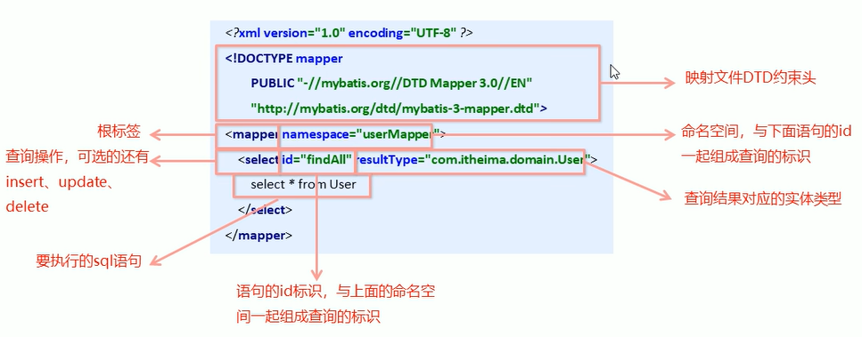
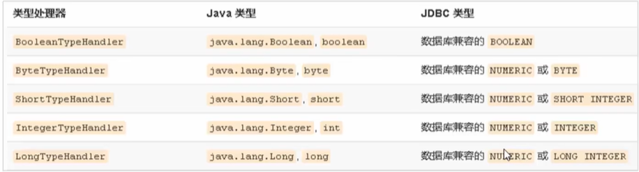
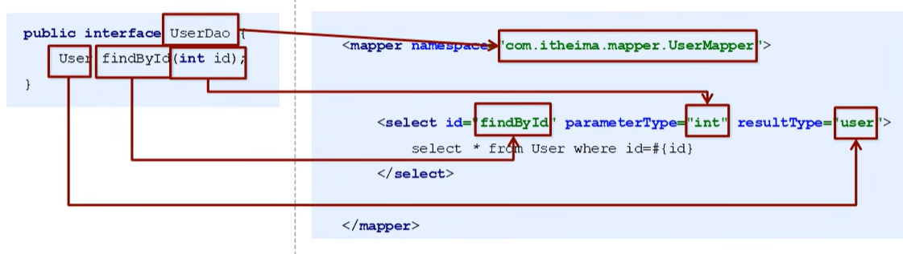

# `MyBatis`

## 框架引出

原始`JDBC`开发存在的问题：

1. 资源浪费：数据库频繁创建、连接和释放导致系统资源浪费，影响性能
2. 硬编码维护难：`SQL`语句直接嵌入`Java`代码中，难以维护；若`SQL`需变动，必须修改`Java`代码
3. 手动映射繁琐：
   - 查询时需手动将结果集数据封装到实体对象
   - 插入时需手动将实体数据绑定到`SQL`占位符

解决方案：

1. 连接池管理：通过初始化连接资源复用数据库连接，减少资源消耗
2. `SQL`解耦：将`SQL`语句抽取到`XML`配置文件中，实现代码与`SQL`分离
3. 自动映射：利用反射、内省等技术，自动完成实体属性与数据库字段的映射


## 基本概念

- `MyBatis `是一个优秀的基于` Java` 的**持久层框架**，它内部封装了` JDBC`，使开发者**只需要关注 `SQL `语句本身**，而不需要花费精力去处理加载驱动、创建连接、创建 `statement` 等繁杂的过程
- `MyBatis` 通过` XML` 或注解的方式将要执行的各种 `statement` 配置起来，并通过 `Java` 对象和`statement `中` SQL `的动态参数进行映射生成最终执行的 `SQL` 语句
- `MyBatis` 框架执行 `SQL` 并将结果映射为` Java `对象并返回。**采用 `ORM` 思想解决了实体和数据库映射的问题**，对 `JDBC` 进行了封装，**屏蔽了` JDBC API` 底层访问细节**，使我们不用与` JDBC API` 打交道，就可以完成对数据库的持久化操作


## 快速入门

`MyBatis `的基本开发步骤：

1. 在`pom.xml`中添加`MyBatis `的坐标

   ```xml
   <dependencies>
   	<!--引入mysql的驱动-->
       <dependency>
           <groupId>mysql</groupId>
           <artifactId>mysql-connector-java</artifactId>
           <version>5.1.32</version>
       </dependency>
       <!--引入MyBatis框架-->
       <dependency>
           <groupId>org.myBatis</groupId>
           <artifactId>myBatis</artifactId>
           <version>3.4.6</version>
       </dependency>
   </dependencies>
   ```

2. 创建`user`数据表，表的字段有`id`、`username`和`password`

3. 编写`User`实体类

   在`src/main/java`文件夹下创建：

   ```java
   package com.jlc.domain;
   
   public class User {
       private int id;
       private String username;
       private String password;
       
       public int getId() { return id; }
       public void setId(int id) { this.id = id; }
       
       public String getUsername() { return username; }
       public void setUsername(String username) { this.username = username; }
       
       public String getPassword() { return password; }
       public void setPassword(String password) { this.password = password; }
   }
   ```

4. 编写映射文件`UserMapper.xml`（内部主要写的是`SQL`语句）

   在`src/main/resources`文件夹中创建包：`com.jlc.mapper`，在包中创建映射文件`UserMapper.xml`

   ```xml
   <?xml version="1.0" encoding="UTF-8"?>
   <!DOCTYPE mapper PUBLIC "-//mybatis.org//DTD Mapper 3.0//EN" "http://mybatis.org/dtd/mybatis-3-mapper.dtd">
   
   <!--具体的配置-->
   <mapper namespace="userMapper">   <!--设置具体的命名空间-->
       <select id="findAll" resultType="com.jlc.domain.User">  <!--resultType表示结果集返回的位置-->
       	select * from user
       </select>
   </mapper>
   ```

5. 编写核心文件`SqlMapConfig.xml`（配置`MyBatis `框架的核心配置）

   在`src/main/resources`文件夹中创建核心文件`SqlMapConfig.xml`

   ```xml
   <?xml version="1.0" encoding="UTF-8"?>
   <!DOCTYPE configuration PUBLIC "-//mybatis.org//DTD Config 3.0//EN" "http://mybatis.org/dtd/mybatis-3-config.dtd">
   
   <configuration>
   	<!--配置当前数据源的环境-->
       <environments default="development">   <!--default表示使用具体的数据库环境-->
           <!--可以配置很多的数据库环境-->
           <environment id="development">
               <transactionManager type="JDBC"></transactionManager>
               <dataSource type="POOLED">
               	<property name="driver" value="com.mysql.jdbc.Driver"/>
                   <property name="url" value="jdbc:mysql://localhost:3306/test/"/>
                   <property name="username" value="root"/>
                   <property name="password" value="admin"/>
               </dataSource>
           </environment>
       </environments>
       
       <!--加载映射文件-->
       <mappers>
           <mapper resource="com/jlc/mapper/UserMapper.xml"></mapper>
       </mappers>
   </configuration>
   ```

6. 编写测试类，在`src/test/java`中进行创建

   ```java
   package com.jlc.test;
   
   import org.junit.Test;
   import org.apache.ibatis.io.Resources;
   import org.apache.ibatis.session.SqlSessionFactoryBuilder;
   
   public class MyBatisTest {
       @Test
       public void test1() throws IOException {
           // 加载核心配置文件  
           InputStream resourceAsStream = Resources.getResourceAsStream("SqlMapConfig.xml");  
           // 获得 sqlSession 工厂对象（会话工厂对象）  
           SqlSessionFactory sqlSessionFactory = new SqlSessionFactoryBuilder().build(resourceAsStream);  
           // 获得 sqlSession 对象  （通过工厂对象获得会话对象）
           SqlSession sqlSession = sqlSessionFactory.openSession();  
           // 执行 SQL 语句    参数：namespace+id
           List<User> userList = sqlSession.selectList("userMapper.findAll");  
           // 打印结果  
           System.out.println(userList);  
           // 释放资源  
           sqlSession.close();  
       }
   }
   ```


## 映射文件



> - `DTD`的约束头添加了后，后续配置时就有标签的提示

***

### 动态`sql`

在对于复杂业务逻辑时，我们需要`sql`是动态变化的

#### 动态`sql`的常用标签

##### `<if>`标签

我们根据实体类的不同取值，使用不同的`SQL`语句来进行查询，如在`id`如果不为空时可以根据`id`进行查询，如果`username`不同时为空，还要加入用户名作为查询条件，这种情况在我们的多条件组合查询中经常看到

使用演示：使用代理开发的方式进行`Dao`层内容的编写：

- 在`Dao`层编写`UserMapper`接口

  ```java
  package com.jlc.mapper;
  
  import com.jlc.domain.User;
  import java.util.List;
  
  public interface UserMapper {
      public List<User> findByCondition(User user);
  }
  ```

- 在映射文件`UserMapper.xml`文件中进行配置：

  ```xml
  <?xml version="1.0" encoding="UTF-8"?>
  <!DOCTYPE mapper PUBLIC "-//mybatis.org//DTD Mapper 3.0//EN" "http://mybatis.org/dtd/mybatis-3-mapper.dtd">
  
  <!--具体的配置-->
  <mapper namespace="com.jlc.mapper.UserMapper">   
      <!--根据动态条件查询-->
      <select id="findByCondition" parameterType="com.jlc.domain.User" resultType="com.jlc.domain.User">  
      	select * from user
          <where>    <!--如果三个条件都不满足，那么where标签也失效，相对于查询全部-->
              <if test="id!=0">
                  and id=#{id}
              </if>
              <if test="username!=null">
                  and username=#{username}
              </if>
              <if test="password!=null">
                  and password=#{password}
              </if>
          </where>
      </select>
  </mapper>
  ```

- 创建测试代码：

  ```java
  package com.jlc.test;
  
  import org.junit.Test;
  import com.jlc.domain.User;
  import java.io.InputStream;
  import java.util.List;
  
  public class MapperTest throws IOException {
      @Test
      public void test() {
          // 加载核心配置文件  
          InputStream resourceAsStream = Resources.getResourceAsStream("SqlMapConfig.xml"); 
          // 获得 sqlSession 工厂对象（会话工厂对象）  
          SqlSessionFactory sqlSessionFactory = new SqlSessionFactoryBuilder().build(resourceAsStream);  
          // 获得 sqlSession 对象  （通过工厂对象获得会话对象）
          SqlSession sqlSession = sqlSessionFactory.openSession(); 
  
          UserMapper mapper = sqlSession.getMapper(UserMapper.class);
  	
          // 模拟条件user
          User condition = new User();
          condition.setId(1);
          condition.setUsername("jlc");
          condition.setPassword("123");   // 少一个条件，也可以查询到对应的数据
          
          List<User> userList = mapper.findByCondition(condition);
          System.out.println(userList);
      }
  }
  ```

##### `<foreach>`标签

使用演示：使用代理开发的方式进行`Dao`层内容的编写：

- 在`Dao`层编写`UserMapper`接口

  ```java
  package com.jlc.mapper;
  
  import com.jlc.domain.User;
  import java.util.List;
  
  public interface UserMapper {
      public List<User> findByIds(List<Integer> ids);
  }
  ```

- 在映射文件`UserMapper.xml`文件中进行配置：

  ```xml
  <?xml version="1.0" encoding="UTF-8"?>
  <!DOCTYPE mapper PUBLIC "-//mybatis.org//DTD Mapper 3.0//EN" "http://mybatis.org/dtd/mybatis-3-mapper.dtd">
  
  <!--具体的配置-->
  <mapper namespace="com.jlc.mapper.UserMapper">   
      <!--根据动态条件查询-->
      <select id="findByIds" parameterType="list" resultType="com.jlc.domain.User">  
      	select * from user
          <where>
              <foreach collection="list" open="id in(" close=")" item="id" separator=",">
              	#{id}
              </foreach>
          </where>
      </select>
  </mapper>
  ```

  > 传统情况下根据多`id`查询的`sql`语句为`select * from user where id in(1,2,3)`
  >
  > - `collection`：表示传递过来数据的类型，可以是集合`lsit`，也可以是数组`array`
  > - `open`：  表示查询开始的前缀
  > - `close`：表示查询结束的后缀
  > - `item`：用于接收传入集合或数组中的每一项，命名随意，但是使用时要对应`#{id}`
  > - `separator`：指定分割符

- 创建测试代码：

  ```java
  package com.jlc.test;
  
  import org.junit.Test;
  import com.jlc.domain.User;
  import java.io.InputStream;
  import java.util.List;
  
  public class MapperTest throws IOException {
      @Test
      public void test() {
          // 加载核心配置文件  
          InputStream resourceAsStream = Resources.getResourceAsStream("SqlMapConfig.xml"); 
          // 获得 sqlSession 工厂对象（会话工厂对象）  
          SqlSessionFactory sqlSessionFactory = new SqlSessionFactoryBuilder().build(resourceAsStream);  
          // 获得 sqlSession 对象  （通过工厂对象获得会话对象）
          SqlSession sqlSession = sqlSessionFactory.openSession(); 
  
          UserMapper mapper = sqlSession.getMapper(UserMapper.class);
  	
          // 模拟ids数据
          List<Integer> ids = new ArrayList<Integer>();
          ids.add(1);
          ids.add(2);
          
          List<User> userList = mapper.findByIds(ids);
          System.out.println(userList);
      }
  }
  ```

***

### `sql`片段的抽取

`SQL`中可以将重复的`sql`提取出来，使用时用`include`引用即可，最终达到`sql`复用的目的

```xml
<!--抽取sql片段简化编写-->
<sql id="selectUser" select * from User></sql>
<select id="findById" parameterType="int" resultType="com.jlc.domain.User">  
    <include refid="selectUser"></include> where id=#{id}
</select>
```


## 增删改查操作

在映射文件中进行`SQL`语句的增删改查操作：

```xml
<?xml version="1.0" encoding="UTF-8"?>
<!DOCTYPE mapper PUBLIC "-//mybatis.org//DTD Mapper 3.0//EN" "http://mybatis.org/dtd/mybatis-3-mapper.dtd">

<!--具体的配置-->
<mapper namespace="userMapper">   <!--设置具体的命名空间-->
	<!--插入数据-->
    <insert id="save" parameterType="com.jlc.domain.User">
    	insert into user values(#{id}, #{username}, #{password})
    </insert>
    
    <!--删除数据，根据id进行删除数据-->
    <delete id="save" parameterType="java.lang.Integer">
    	delete from user where id=#{id}
    </delete>
    
    <!--修改数据-->
    <update id="update" parameterType="com.jlc.domain.User">
    	update user set username=#{username}, password=#{password} where id=#{id}
    </update>
    
    <!--查询操作-->
    <select id="findAll" resultType="com.jlc.domain.User">  
    	select * from user
    </select>
</mapper>
```

> - 插入操作的注意问题：
>   - 插入语句使用`insert`标签
>   - 在映射文件中使用`parameterType`属性指定要插入的数据类型
>   - `Sql`语句中使用`#{实体属性名}`方式引用实体中的属性值
> - 删除操作的注意问题：
>   - 删除语句使用`delete`标签
>   - `Sql`语句中使用`#{任意字符串}`方式引用传递的单个参数
> - 修改操作的注意问题：
>   - 修改语句使用`update`标签

相应的测试代码：

```java
package com.jlc.test;

import org.junit.Test;
import org.apache.ibatis.io.Resources;
import org.apache.ibatis.session.SqlSessionFactoryBuilder;

public class MyBatisTest {
    @Test
    public void testAdd() throws IOException {
        // 模拟user对象
        User user = new User();
        user.setUsername("tom");
        user.setPassword("adc");
        
        // 加载核心配置文件  
        InputStream resourceAsStream = Resources.getResourceAsStream("SqlMapConfig.xml");  
        // 获得 sqlSession 工厂对象（会话工厂对象）  
        SqlSessionFactory sqlSessionFactory = new SqlSessionFactoryBuilder().build(resourceAsStream);  
        // 获得 sqlSession 对象  （通过工厂对象获得会话对象）
        SqlSession sqlSession = sqlSessionFactory.openSession(); 
     
        // 执行 SQL 语句    参数：namespace+id
        // 插入操作
        sqlSession.insert("userMapper.save", user);
        sqlSession.commit();  // 提交事务
        
        // 释放资源  
        sqlSession.close();  
    }
    
    @Test
    public void testDel() throws IOException {    
        // 加载核心配置文件  
        InputStream resourceAsStream = Resources.getResourceAsStream("SqlMapConfig.xml");  
        // 获得 sqlSession 工厂对象（会话工厂对象）  
        SqlSessionFactory sqlSessionFactory = new SqlSessionFactoryBuilder().build(resourceAsStream);  
        // 获得 sqlSession 对象  （通过工厂对象获得会话对象）
        SqlSession sqlSession = sqlSessionFactory.openSession(); 
     
        // 执行 SQL 语句    参数：namespace+id
        // 删除操作
        sqlSession.delete("userMapper.delete", 3);
        sqlSession.commit();  // 提交事务
        
        // 释放资源  
        sqlSession.close();  
    }
    
    @Test
    public void testUpdate() throws IOException {
        // 模拟user对象
        User user = new User();
        user.setId(3);
        user.setUsername("tom");
        user.setPassword("123");
        
        // 加载核心配置文件  
        InputStream resourceAsStream = Resources.getResourceAsStream("SqlMapConfig.xml");  
        // 获得 sqlSession 工厂对象（会话工厂对象）  
        SqlSessionFactory sqlSessionFactory = new SqlSessionFactoryBuilder().build(resourceAsStream);  
        // 获得 sqlSession 对象  （通过工厂对象获得会话对象）
        SqlSession sqlSession = sqlSessionFactory.openSession(); 
     
        // 执行 SQL 语句    参数：namespace+id
        // 修改操作
        sqlSession.update("userMapper.uodate", user);
        sqlSession.commit();  // 提交事务
        
        // 释放资源  
        sqlSession.close();  
    }
    
    @Test
    public void testFind() throws IOException {
        // 加载核心配置文件  
        InputStream resourceAsStream = Resources.getResourceAsStream("SqlMapConfig.xml");  
        // 获得 sqlSession 工厂对象（会话工厂对象）  
        SqlSessionFactory sqlSessionFactory = new SqlSessionFactoryBuilder().build(resourceAsStream);  
        // 获得 sqlSession 对象  （通过工厂对象获得会话对象）
        SqlSession sqlSession = sqlSessionFactory.openSession(); 
     
        // 执行 SQL 语句    参数：namespace+id
        // 查询操作
        List<User> userList = sqlSession.selectList("userMapper.findAll");  
        System.out.println(userList);  
        
        // 释放资源  
        sqlSession.close();  
    }
}
```

> `MyBatis`默认事务是不提交的，这和原始的`JDBC`事务是不同的，因此，`MyBatis`要执行更新操作，需要提交事务`sqlSession.commit();`
>
> - 插入操作的注意问题：
>   - 插入操作使用的`API`是`sqlSession.insert("命名空间.id", 实体对象);`
>
> - 删除操作的注意问题：
>   - 删除操作使用的`API`是`sqlSession.delete("命名空间.id", Object);`
> - 修改操作的注意问题：
>   - 修改操作使用的`API`是`sqlSession.update("命名空间.id", 实体对象);`


## 核心配置文件

编写核心文件`SqlMapConfig.xml`用于`MyBatis `框架的核心配置

设置核心配置文件首先需要引入约束：

```xml
<?xml version="1.0" encoding="UTF-8"?>
<!DOCTYPE configuration PUBLIC "-//mybatis.org//DTD Config 3.0//EN" "http://mybatis.org/dtd/mybatis-3-config.dtd">
```

`MyBatis `核心配置文件的配置内容需要使用`<configuration>`根标签进行包裹：

```xml
<configuration>
	...
</configuration>
```

> 根标签包含如下的子标签：
>
> - `environments`：配置数据源环境信息，支持多环境的配置（即可以包括多个`<environment>`标签）
>
>   - `environment`：环境变量
>     - `transactionManager`：事务管理器，其`type`属性具体的取值有两个：
>       - `JDBC`：这个配置就是直接使用了`JDBC`的提交和回滚设置，它依赖于从数据源得到的连接来管理事务事务作用域。
>       - `MANAGED`：（该值使用的不多）这个配置几乎没有做什么，它从来不提交或回滚一个连接，而让容器来管理事务的整个生命周期（比如`JEE`应用服务器的上下文）。默认情况下它会关闭连接，然而一些容器并不希望这样，因此需要将`closeConnection`属性设置成`false`来阻止它默认的关闭行为
>     - `dataSource`：数据源配置，其`type`属性具体的取值有三个：
>       - `UNPOOLED`：这个数据源的实现只是每次被请求时打开和关闭连接
>       - `POOLED`：这种数据源的实现利用“池”的概念（连接池）将`JDBC`连接对象组织起来
>       - `JNDI`：这个数据源的实现是为了能在如`EJB`或应用服务器这类容器中使用，容器可以集中或在外部配置数据源，然后放置一个`JNDI`上下文的引用
>
>   ```xml
>   <!--配置当前数据源的环境-->
>   <environments default="development">   <!--default表示默认的环境名称，是内部某个id-->
>       <!--可以配置很多的数据库环境-->
>       <environment id="development">  <!--id指定当前环境的名称-->
>           <transactionManager type="JDBC" />   <!--指定事务类型是JDBC-->
>           <dataSource type="POOLED">    <!--指定当前数据源类型是连接池-->
>               <!--数据源配置的基本参数-->
>               <property name="driver" value="com.mysql.jdbc.Driver"/>
>               <property name="url" value="jdbc:mysql://localhost:3306/test"/>
>               <property name="username" value="root"/>
>               <property name="password" value="admin"/>
>           </dataSource>
>       </environment>
>   </environments>
>   ```
>
> - `properties`：配置属性
>
>   在实际开发中，通常将数据源的配置信息单独抽取成一个`properties`文件，该标签可以加载额外的`properties`文件
>
>   ```xml
>   <!--加载外部的.properties文件-->
>   <properties resource="jdbc.properties"></properties>
>   
>   <environments default="development">
>       <environment id="development">
>           <transactionManager type="JDBC" />
>           <dataSource type="POOLED">
>               <property name="driver" value="${jdbc.driver}"/>
>               <property name="url" value="${jdbc.url}"/>
>               <property name="username" value="${jdbc.username}"/>
>               <property name="password" value="${jdbc.password}"/>
>           </dataSource>
>       </environment>
>   </environments>
>   ```
>
>   编写数据库的配置文件：
>
>   ```properties
>   jdbc.driver=com.mysql.jdbc.Driver
>   jdbc.url=jdbc:mysql://localhost:3306/test
>   jdbc.username=root
>   jdbc.password=admin
>
> - `setting`：设置参数
>
> - `typeAliases`：设置类型别名，为`Java`类型设置一个短的名字
>
>   配置`typeAliases`，为`com.jlc.domain.User`定义别名为`user`
>
>   ```xml
>   <typeAliases>
>       <typeAlias type="com.jlc.domain.User" alias="user"></typeAlias>
>   </typeAliases>
>   ```
>
>   对于自定义别名的配置，`MyBatis`框架已经为我们配置好了一些常用的类型别名：
>
>   |   别名    | 数据类型  |
>   | :-------: | :-------: |
>   | `string`  | `String`  |
>   |  `long`   |  `Long`   |
>   |   `int`   | `Integer` |
>   | `double`  | `Double`  |
>   | `boolean` | `Boolean` |
>
> - `typeHandlers`：类型处理器
>
> - `objectFactory`：对象工厂
>
> - `plugins`：插件
>
> - `databaseldProvider`：数据库厂商标识
>
> - `mappers`：配置映射器，加载映射文件，加载方式有如下几种：
>
>   - 使用相对于类路径来对的资源引用（常用方式）
>
>     例如：`<mapper resource="org/mybatis/builder/AuthorMapper.xml"/>`
>
>   - 使用完全限定资源定位符（`URL`）
>
>     例如：`<mapper url="file:///var/mappers/AuthorMapper.xml"/>`
>
>   - 使用映射器接口实现类的完全限定类名
>
>     例如：`<mapper class="org.mybatis.builder.AuthorMapper"/>`
>
>   - 将包内的映射器接口实现全部注册为映射器
>
>     例如：`<package name="org.mybatis.builder"/>`
>
>   ```xml
>   <!--加载映射文件-->
>   <mappers>
>       <mapper resource="com/jlc/mapper/UserMapper.xml"></mapper>
>   </mappers>
>   ```
>
> 对于`<configuration>`根标签的子标签的使用，必须要严格按照顺序进行使用，否则会报错，其顺序由前到后依次为：`properties`、`setting`、`typeAliases`、`typeHandlers`、`objectFactory`、`plugins`、`environments`、`databaseldProvider`、`mappers`

***

### 其他配置标签

#### `<typeHandlers>`

`<typeHandlers>`标签主要是用于类型重叠器的定义，无论是`MyBatis`在预处理语句（`PreparedStatement`）中设置一个参数时，还是从结果集中取出一个值时，都会用类型处理器将获取的值以合适的方式转换成`Java`类型，下表描述了一些默认的类型处理器：



我们也可以重写类型处理器或创建自己的类型处理器来处理不支持的或非标准的类型。具体做法为：实现`org.apache.ibatis.type.TypeHandler`接口，或继承一个便利的类`org.apache.ibatis.type.BaseTypeHandler`，然后可以选择性的将它映射到一个`JDBC`类型

需求：一个`Java`中的`Date`数据类型，我希望将其存储到数据库的时候存成一个1970年至今的毫秒数，取出来时又转换为`Java`的`Date`类型，即`Java`的`Date`与数据库的`varchar`毫秒值进行转换

开发步骤：

1. 定义转换类继承类`BaseTypeHandler<T>`    泛型`T`就是我们要转换的`Java`类型

2. 覆盖4个未实现的方法，其中`setNonNullParameter`为`Java`程序设置数据到数据库的回调方法（将`Java`类型的数据转换为数据库需要的类型数据），`getNullableResult`为查询时`mysql`的字符串类型转换成`Java`的`Type`类型的回调方法（`MyBatis`执行时，会自动的帮助我们执行这些回调方法）

   ```java
   package com.jlc.handler;
   
   import org.apache.ibatis.type.BaseTypeHandler;
   import java.util.Date;
   
   public class DateTypeHandler extends BaseTypeHandler<Date> {
       // 将Java类型转换成数据库需要的类型
       public void setNonNullParameter(PreparedStatement preparedStatement, int i, Date date, JdbcType jdbcType) {
           long time = date.getTime();  // 获取时间的毫秒值
           preparedStatement.setLong(i, time);   // 设置参数 i表示当前的参数位置
       }
       
       // 将数据库中的类型转换成Java类型  MyBatis底层会随机进行调用
       // String参数表示要转换的字段名称；ResultSet表示查询出的结果集
       public Date getNullableResult(ResultSet resultSet, String s) throws SQLException {
           // 获得结果集中需要的数据（long）转换成Date类型进行返回
           long aLong = resultSet.getLong(s);
           Date date = new Date(aLong);
           return date;
       }
       // 将数据库中的类型转换成Java类型  MyBatis底层会随机进行调用
       // int参数表示字段的位置；ResultSet表示查询出的结果集
       public Date getNullableResult(ResultSet resultSet, int i) throws SQLException {
           long aLong = resultSet.getLong(i);
           Date date = new Date(aLong);
           return date;
       }
       // 将数据库中的类型转换成Java类型  MyBatis底层会随机进行调用
       public Date getNullableResult(CallableStatement callableStatement, int i) throws SQLException {
           long aLong = callableStatement.getLong(i);
           Date date = new Date(aLong);
           return date;
       }
   }
   ```

3. 在`MyBatis`核心配置文件中进行注册

   ```xml
   <!--注册类型处理器-->
   <typeHandlers>
       <typeHandler handler="com.jlc.handler.DateTypeHandler"></typeHandler>
   </typeHandlers>
   ```

#### `<plugins>`

`MyBatis`可以使用第三方的插件来对功能进行拓展，分页助手`PageHelper`是将分页的复杂操作进行封装，使用简单的方式即可获得分页的相关数据

开发步骤：

1. 导入通用`PageHelper`的坐标
2. 在`MyBatis`核心配置文件中配置`PageHelper`插件
3. 测试分页数据获取


## 相应的`API`

### `SqlSession`工厂构造器相关`API`

#### `SqlSessionFactoryBuilder`

通过加载`mybatis`的核心配置文件的输入流形式构建一个`SqlSessionFactory`对象（`Session`工厂对象）

```java
String resource = "org/mybatis/builder/mybatis-config.xml";  // 这个地址是相对于类加载路径的
InputStream inputStream = Resources.getResourceAsStream(resource);
SqlSessionFactoryBuilder builder = new SqlSessionFactoryBuilder();
SqlSessionFactory factory = builder.build(inputStream);
```

> 其中，`Resources`是一个工具类，这个类在`org.apache.ibatis.io`包中。`Resources`类帮助我们从类路径下、文件系统或一个`Web URL`中加载资源文件

***

### `SqlSession`工厂对象相关`API`

`SqlSessionFactory`工厂对象有多个方法创建`SqlSesson`实例，常用的有如下两个：

- `openSession`：会默认开启一个事务，但事务不会自动提交，也就意味着需要手动提交该事务，更新操作数据才会持久化到数据库中

- `openSession(boolean autoCommit)`：参数为是否自动提交，如果设置为`true`，那么不需要手动提交事务

  `openSession(true)`：设置为自动提交事务

***

### `SqlSession`会话对象相关`API`

`SqlSession`实例在`MyBatis`中是非常强大的一个类，涉及到所有的执行语句、提交或回滚事务和获取映射器实例的方法：

- 执行语句的方法有：

  ```java
  <T> T selectOne(String statement, Object parameter)    // 查询一个
  <E> List<E> selectList(String statement, Object parameter)  // 查询所有
  int insert(String statement, Object parameter)   // 插入
  int update(String statement, Object parameter)   // 修改
  int delete(String statement, Object parameter)   // 删除
  ```

- 操作事务的方法有：

  ```java
  void commit()
  void rollback()    
  ```

  

## `MyBatis`的`Dao`层实现

之前的内容使用的`MyBatis`，都是以单元测试的方式实现的，但是后续的项目开发中，`MyBatis`代码一般要写到对应的`Dao`层中

### 传统开发方式

在`Dao`层编写`UserMapper`接口

```java
package com.jlc.dao;

import com.jlc.domain.User;
import java.util.List;

public interface UserMapper {
    List<User> findAll() throws IOException;
}
```

编写一个接口的类实现：

```java
package com.jlc.dao.impl;

import com.jlc.domain.User;
import com.jlc.dao.UserMapper;

public class UserMapperImpl implements UserMapper {
    public List<User> findAll() throws IOException {
        // 加载核心配置文件  
        InputStream resourceAsStream = Resources.getResourceAsStream("SqlMapConfig.xml"); 
        // 获得 sqlSession 工厂对象（会话工厂对象）  
        SqlSessionFactory sqlSessionFactory = new SqlSessionFactoryBuilder().build(resourceAsStream);  
        // 获得 sqlSession 对象  （通过工厂对象获得会话对象）
        SqlSession sqlSession = sqlSessionFactory.openSession(); 
     
        // 执行 SQL 语句    参数：namespace+id
        // 查询操作
        List<User> userList = sqlSession.selectList("userMapper.findAll");  
        return userList;
    }
}
```

编写对应业务层的内容：以单元测试的方法调用`MyBatis`的`Dao`层实现

```java
package com.jlc.service;

import com.jlc.domain.User;
import java.util.List;

public class ServiceDemo throws IOException {
    // 创建dao层对象，当前dao层的实现是手动编写的
    UserMapper userMapper = new UserMapperImpl();
    List<User> all = userMapper.findAll();
    System.out.println(all);
}
```

通过传统的方式实现`MyBatis`的`Dao`层实现是比较繁琐的

***

### 代理开发方式

`Mybatis `的代理开发方式实现`DAO`层的开发是企业中的主流方法。通过` Mapper` 接口开发，程序员只需编写 `Mapper `接口（相当于` Dao `接口），`Mybatis` 框架会根据接口定义创建动态代理对象，代理对象的方法体与` Dao` 接口实现类方法一致

`Mapper`接口开发规范：

1. `Mapper.xml` 映射文件中的 `namespace` 必须与 `Mapper` 接口的全限定名相同

   映射文件中的`namespace`为`UserMapper`， `Mapper` 接口的全限定名中的接口名也要为`UserMapper`

2. `Mapper` 接口的方法名必须与 `Mapper.xml `中定义的每个 `statement` 的 `id` 相同

   接口中具体的方法名和映射文件中的操作`id`要一致

3. `Mapper` 接口方法的输入参数类型必须与 `Mapper.xml` 中定义的每个 `SQL` 的 `parameterType` 类型相同

4. `Mapper` 接口方法的输出参数类型必须与 `Mapper.xml` 中定义的每个 `SQL` 的 `resultType` 类型相同



基本实现：

在`Dao`层编写`UserMapper`接口

```java
package com.jlc.dao;

import com.jlc.domain.User;
import java.util.List;

public interface UserMapper {
    List<User> findAll();
}
```

在映射文件`UserMapper.xml`文件中进行配置：

```xml
<?xml version="1.0" encoding="UTF-8"?>
<!DOCTYPE mapper PUBLIC "-//mybatis.org//DTD Mapper 3.0//EN" "http://mybatis.org/dtd/mybatis-3-mapper.dtd">

<!--具体的配置-->
<mapper namespace="com.jlc.dao.UserMapper">   
    <!--查询操作-->
    <select id="findAll" resultType="com.jlc.domain.User">  
    	select * from user
    </select>
</mapper>
```

在服务层进行调用：

```java
package com.jlc.service;

import com.jlc.domain.User;
import java.io.InputStream;
import java.util.List;

public class ServiceDemo throws IOException {
    // 加载核心配置文件  
    InputStream resourceAsStream = Resources.getResourceAsStream("SqlMapConfig.xml"); 
    // 获得 sqlSession 工厂对象（会话工厂对象）  
    SqlSessionFactory sqlSessionFactory = new SqlSessionFactoryBuilder().build(resourceAsStream);  
    // 获得 sqlSession 对象  （通过工厂对象获得会话对象）
    SqlSession sqlSession = sqlSessionFactory.openSession(); 

    // 通过代理自动配置
    UserMapper mapper = sqlSession.getMapper(UserMapper.class);
    List<User> all = mapper.findAll();
    System.out.println(all);
}
```

使用代理开发的方式，我们就不用进行接口的类实现，`MyBatis`会自动的帮助我们进行动态的代理实现
