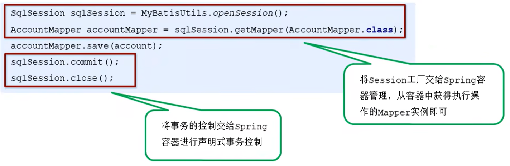

# `SSM`框架整合

## 基本概念

`SSM`框架整合主要涉及的是`Spring`和`MyBatis`进行整合，`Spring`和`SpringMVC`都是`Spring`生态系统的框架，他们之间的整合是无缝整合，但是`MyBatis`是一个第三方的框架，我们需要额外的进行`MyBatis`和`Spring`之间的整合。

对应`SSM`框架整合的方式，我们可以使用原始的整合方式（每个框架各自负责每个层的功能：`MyBatis`框架负责`Dao`层数据持久层的功能；`Spring`框架相当于粘合剂，使用容器产生三层的`Ben`；`SpringMVC`负责`Web`层的实现，客户请求时，封装数据，并将实体进行传递，最终指派视图进行信息的展示），但是原始的整合方式存在一些弊端（契合度不太好）


## 原始的整合方式

整合步骤：

1. 数据库和数据表的准备

   在数据库`ssm`中创建一个`account`数据表：

   ```sql
   create database ssm;
   
   create table account {
   	id int primary key auto_increment,
   	name varchar(100),
   	money double(7, 2)
   }
   ```

2. 创建`Maven`工程，该工程的大致文件结构为：

   ```java
   src
   ├── main
   │   └── java
   │       ├── com.jlc
   │       │   ├── controller       // Web层文件夹    
   │       │   │   ├── AccountController              
   │       │   ├── domain           // 实体定义文件夹    
   │       │   │   ├── Account              
   │       │   ├── mapper           // 方法映射文件夹    
   │       │   │   ├── AccountMapper              
   │       │   ├── service           // 业务层  
   │       │   │   ├── AccountService   
   │       │   │   ├── impl
   │       │   │   │   ├── AccountServiceImpl    
   │   └── resources
   │       ├── com.jlc.mapper    // mybatis配置文件夹，存放具体的映射文件
   │       │   │   ├── AccountMapper.xml   // AccountMapper方法的映射配置文件
   │       ├── applicationContext.xml  // Spring配置文件
   │       ├── spring-mvc.xml  // SpringMVC配置文件
   │       ├── jdbc.properties  // 数据库信息配置文件
   │       ├── log4j.properties  // 日志信息相关配置文件
   │       ├── sqlMapConfig.xml  // MyBatis核心配置文件
   │   └── webapp               // 传统Web资源
   │       ├── WEB-INF
   │       │   ├── web.xml
   │       │   ├── pages
   │       │   │   ├── accountList.jsp   // 查询页面 
   │       ├── index.jsp
   │       ├── save.jsp    // 添加页面
   ├── test
   │   └── java
   │   └── resources
   jlc_ssm.imi
   pom.xml
   ```

3. 在`pom.xml`文件中导入具体配置的坐标

   ```xml
   <dependencies>
       <!--spring相关-->
       <dependency>
           <groupId>org.springframework</groupId>
           <artifactId>spring-context</artifactId>   <!--上下文-->
           <version>5.0.5RELEASE</version>
       </dependency>
       <dependency>
           <groupId>org.aspectj</groupId>
           <artifactId>aspectjweaver</artifactId>   <!--aop织入-->
           <version>1.8.7</version>
       </dependency>
       <dependency>
           <groupId>org.springframework</groupId>
           <artifactId>spring-jdbc</artifactId>    <!--jdbc模板-->
           <version>5.0.5RELEASE</version>
       </dependency>
       <dependency>
           <groupId>org.springframework</groupId>
           <artifactId>spring-tx</artifactId>      <!--事务相关-->
           <version>5.0.5RELEASE</version>
       </dependency>
       <dependency>
           <groupId>org.springframework</groupId>
           <artifactId>spring-test</artifactId>      <!--测试相关-->
           <version>5.0.5RELEASE</version>
       </dependency>
       <dependency>
           <groupId>org.springframework</groupId>
           <artifactId>spring-webmvc</artifactId>   <!--SpringMVC相关-->
           <version>5.0.5RELEASE</version>
       </dependency>
       
       <!--servlet和jsp相关-->
       <dependency>
           <groupId>javax.servlet</groupId>
           <artifactId>servlet-api</artifactId>
           <version>2.5</version>
       </dependency>
       <dependency>
           <groupId>javax.servlet.jsp</groupId>
           <artifactId>jsp-api</artifactId>
           <version>2.0</version>
       </dependency>
       
       <!--mybatis相关-->
       <dependency>
           <groupId>org.mybatis</groupId>
           <artifactId>mybatis</artifactId>
           <version>3.4.5</version>
       </dependency>
       <dependency>
           <groupId>org.mybatis</groupId>
           <artifactId>mybatis-spring</artifactId>
           <version>1.3.1</version>
       </dependency>
       <dependency>
           <groupId>mysql</groupId>
           <artifactId>mysql-connector-java</artifactId>   <!--真正整合时使用-->
           <version>5.1.6</version>
       </dependency>
       <dependency>
           <groupId>c3p0</groupId>
           <artifactId>c3p0</artifactId>
           <version>0.9.1.2</version>
       </dependency>
       
       <!--junit相关-->
       <dependency>
       	<groupId>junit</groupId>
           <artifactId>junit</artifactId>
           <version>4.12</version>
       </dependency>
       <dependency>
       	<groupId>jst1</groupId>
           <artifactId>jst1</artifactId>
           <version>1.2</version>
       </dependency>
   </dependencies>
   ```

4. 在`src/main/java/com/jlc/domain`中编写具体的实体类

   ```java
   package com.jlc.domain;
   
   public class Account {
       private Integer id;
       private String name;
       private Double money;
       
       public Integer getId() {
           return id;
       }
       public void setId(Integer id) {
           this.id = id;
       }
       
       public String getName() {
           return name;
       }
       public void setName(String name) {
           this.name = name;
       }
       
       public Double getMoney() {
           return money;
       }
       public void setMoney() {
           this.money = money;
       }
   }
   ```

5. 在`src/main/java/com/jlc/mapper`中编写具体的实体类的接口（`mapper`又可以理解为`Dao`层）

   ```java
   package com.jlc.mapper;
   
   import com.jlc.domain.Account;
   import java.util.List;
   
   public interface AccountMapper {
       // 保存账户数据
       public void save(Account account);
       // 查询账户数据
       public List<Account> findAll();
   }
   ```

6. 编写`Service`接口（业务层接口）

   ```java
   package com.jlc.service;
   
   import com.jlc.domain.Account;
   import java.util.List;
   
   public interface AccountService {
       public void save(Account account); // 保存账户数据
       public List<Account> findAll();    // 查询账户数据
   }
   ```

7. 编写`Service`接口的实现类

   ```java
   package com.jlc.service.impl;
   
   import com.jlc.domain.Account;
   import com.jlc.service.AccountService;
   import java.util.List;
   
   @Service("accountService")
   public class AccountServiceImpl implements AccountService {
       @Override
       public void save(Account account) {
           try {
               InputStream resourceAsStream = Resources.getResourceAsStream("sqlMapConfig.xml");
               SqlSessionFactory sqlSessionFactory = new SqlSessionFactoryBuilder().build(resourceAsStream);
               SqlSession sqlSession = sqlSessionFactory.openSession();
               AccountMapper accountMapper = sqlSession.getMapper(AccountMapper.class);
               accountMapper.save(account);
               sqlSession.commit();
               sqlSession.close();
           } catch (IOException e) {
               e.printStackTrace();
           }
       }
   	
       @Override
       public List<Account> findAll() {
           try {
               InputStream resourceAsStream = Resources.getResourceAsStream("sqlMapConfig.xml");
               SqlSessionFactory sqlSessionFactory = new SqlSessionFactoryBuilder().build(resourceAsStream);
               SqlSession sqlSession = sqlSessionFactory.openSession();
               AccountMapper accountMapper = sqlSession.getMapper(AccountMapper.class);
               List<Account> accountList = mapper.findAll();
               sqlSession.close();
               return accountList;
           } catch (IOException e) {
               e.printStackTrace();
           }
       }
   }
   ```

8. 编写`Controller`（编写`Web`层）

   ```java
   package com.jlc.controller;
   
   import com.jlc.domain.Account;
   import org.springframework.stereotype.Controller;
   import org.springframework.web.bind.annotation.RequestMapping;
   import org.springframework.web.bind.annotation.ResponseBody;
   import org.springframework.web.servlet.ModelAndView;
   
   @Controller
   @RequestMapping("/account")
   public class AccountController {
       @Autowired
       private AccountService accountService;
   	
       // 保存
       @RequestMapping("/save")
       @ResponseBody    // 表示字符串直接展示
       public String save(Account account) {
           accountService.save(account);
           return "save success";
       }
   
       // 查询
       @RequestMapping("/findAll")
       public ModelAndView findAll() {
           List<Account> accountList = accountService.findAll();
           ModelAndView modelAndView = new ModelAndView();
           modelAndView.setViewName("accountList");
           modelAndView.addObject("accountList", accountList);
           return modelAndView;
       }
   }
   ```

9. 编写相应的页面

   添加的表单页面`save.jsp`

   ```jsp
   <%@ page contentType="text/html;charset=UTF-8" language="java" %>
   <html>
   <head>
       <title>Title</title>
   </head>
       
   <body>
       <h1>添加账户信息表单</h1>
       <form name="accountForm" action="${pageContext.request.contextPath}/account/save" method="post">
           账户名称<input type="text" name="name"><br/>
           账户金额<input type="text" name="money"><br/>
           <input type="submit" value="提交"><br/>
       </form>
   </body>
   </html>
   ```

   列表展示页面`accountList.jsp`

   ```jsp
   <%@ page contentType="text/html;charset=UTF-8" language="java" %>
   <html>
   <head>
       <title>Title</title>
   </head>
   
   <body>
       <h1>展示账户数据列表</h1>
   	<table border="1">
           <tr>
               <th>账户id</th>
               <th>账户名称</th>
               <th>账户金额</th>
           </tr>
           <c:forEach items="${accountList}" var="account">
               <tr>
                   <td>${account.id}</td>
                   <td>${account.name}</td>
                   <td>${account.money}</td>
               </tr>
           </c:forEach>
       </table>
   </body>
   ```

10. 编写相应的配置文件

    - `Spring`配置文件：`applicationContext.xml`

      ```xml
      <?xml version="1.0" encoding="UTF-8"?>
      <beans xmlns="http://www.springframework.org/schema/beans"
      xmlns:xsi="http://www.w3.org/2001/XMLSchema-instance"
      xmlns:aop="http://www.springframework.org/schema/aop"
      xmlns:tx="http://www.springframework.org/schema/tx"
      xmlns:context="http://www.springframework.org/schema/context"
      xsi:schemaLocation="http://www.springframework.org/schema/beans
      http://www.springframework.org/schema/beans/spring-beans.xsd
      http://www.springframework.org/schema/tx
      http://www.springframework.org/schema/tx/spring-tx.xsd
      http://www.springframework.org/schema/aop
      http://www.springframework.org/schema/aop/spring-aop.xsd
      http://www.springframework.org/schema/context
      http://www.springframework.org/schema/context/spring-context.xsd">
          
      	<!-- 组件扫描 扫描service和mapper -->
          <context:component-scan base-package="com.jlc">
          	<!--排除对controller的扫描-->
              <context:exclude-filter type="annotation" expression="org.springframework.stereotype.Controller">
          </context:component-scan>  
      </beans>
      ```

    - `SpringMVC`配置文件：`spring-mvc.xml`

      ```xml
      <?xml version="1.0" encoding="UTF-8"?>
      <beans xmlns="http://www.springframework.org/schema/beans"
      xmlns:xsi="http://www.w3.org/2001/XMLSchema-instance"
      xmlns:mvc="http://www.springframework.org/schema/mvc"
      xmlns:context="http://www.springframework.org/schema/context"
      xsi:schemaLocation="http://www.springframework.org/schema/beans
      http://www.springframework.org/schema/beans/spring-beans.xsd
      http://www.springframework.org/schema/mvc
      http://www.springframework.org/schema/mvc/spring-mvc.xsd
      http://www.springframework.org/schema/context
      http://www.springframework.org/schema/context/spring-context.xsd">
          
      	<!-- Controller的组件扫描 -->
          <context:component-scan base-package="com.jlc.controller"/>
          
          <!--配置mvc的注解驱动-->
          <mvc:annotation-driven/>
          
          <!--配置内部资源视图解析器-->
          <bean id="resourceViewResolver" class="org.springframework.web.servlet.view.InternalResourceViewResolver">
              <property name="prefix" value="/WEB-INF/pages/"></property>  <!--配置前缀-->
              <property name="suffix" value=".jsp"></property>    <!--配置后缀-->
          </bean>
          
          <!--开发静态资源的访问权限-->
          <mvc:default-servlet-handler></mvc:default-servlet-handler>
      </beans>
      ```

    - `MyBatis`映射文件：`AccountMapper.xml`

      ```xml
      <?xml version="1.0" encoding="UTF-8"?>
      <!DOCTYPE mapper PUBLIC "-//mybatis.org//DTD Mapper 3.0//EN" "http://mybatis.org/dtd/mybatis-3-mapper.dtd">
      
      <mapper namespace="com.jlc.mapper.AccountMapper">
          <insert id="save" parameterType="account">
          	insert into account values(#{id},#{name},#{money})
          </insert>
          <select id="findAll" resultType="account">
          	select * from account
          </select>
      </mapper>
      ```

    - `MyBatis`核心文件：`sqlMapConfig.xml`

      ```xml
      <?xml version="1.0" encoding="UTF-8"?>
      <!DOCTYPE configuration PUBLIC "-//mybatis.org//DTD Config 3.0//EN" "http://mybatis.org/dtd/mybatis-3-config.dtd">
      
      <configuration>
          <!--加载jdbc.properties文件-->
          <properties resource="jdbc.properties"></properties>
          
      	<!--定义别名-->
          <typeAliases>
              <!--方式一，一个一个的配置别名-->
              <typeAlias type="com.jlc.domain.Account" alias="account"></typeAlias>
              <!--方式二，通过扫包的方式进行别名的配置，包下所有的实体都使用实体类作为别名-->
              <package name="com.jlc.domain"></package>
          </typeAliases>
          
          <!--配置环境-->
          <environments default="development">
              <environment id="development">
                  <transactionManager type="JDBC" />
                  <dataSource type="POOLED">
                      <property name="driver" value="${jdbc.driver}"/>
                      <property name="url" value="${jdbc.url}"/>
                      <property name="username" value="${jdbc.username}"/>
                      <property name="password" value="${jdbc.password}"/>
                  </dataSource>
              </environment>
          </environments>
          
          <!--加载映射-->
          <mappers>
          	<!--方式一：一个一个进行加载-->
              <mapper resource="com/jlc/mapper/AccountMapper.xml"></mapper>
              <!--方式二，通过扫包的方式进行别名的配置，可以进行统一的加载-->
              <package name="com.jlc.mapper"></package>
          </mappers>
      </configuration>
      ```

    - 数据库连接信息文件：`jdbc.properties`

      ```properties
      jdbc.driver=com.mysql.jdbc.Driver
      jdbc.url=jdbc:mysql://localhost:3306/ssm
      jdbc.username=root
      jdbc.password=root

    - `Web.xml`文件：`web.xml`

      ```xml
      <?xml version="1.0" encoding="UTF-8"?>
      <web-app version="2.5" 
          xmlns:xsi="http://www.w3.org/2001/XMLSchema-instance"
          xmlns="http://java.sun.com/xml/ns/javaee" 
          xsi:schemaLocation="http://java.sun.com/xml/ns/javaee 
              http://java.sun.com/xml/ns/javaee/web-app_2_5.xsd" id="WebApp_ID">
          
          <!--配置Spring监听器-->
          <context-param>
              <param-name>contextConfigLocation</param-name>
              <param-value>classpath:applicationContext.xml</param-value>
          </context-param>
          <listener>
              <listener-class>org.springframework.web.context.ContextLoaderListener</listener-class>
          </listener>
          
      	<!--配置SpringMVC的前端控制器-->
          <servlet>
              <servlet-name>DispatcherServlet</servlet-name>
              <servlet-class>org.springframework.web.servlet.DispatcherServlet</servlet-class>
              <init-param>   <!--声明初始化参数-->
                  <param-name>contextConfigLocation</param-name>
                  <param-value>classpath:spring-mvc.xml</param-value>
              </init-param>
              <!--服务器启动的时候，就创建对象，如果不配置，则为第一次访问的时候加载对象-->
              <load-on-startup>1</load-on-startup>   
          </servlet>
          
          <!--配置映射地址-->
          <servlet-mapping>
              <servlet-name>DispatcherServlet</servlet-name>
              <url-pattern>/</url-pattern>  <!--每次在请求时，都要经过这个部分-->
          </servlet-mapping>
          
          <!--配置乱码过滤器-->
          <filter>
              <filter-name>CharacterEncodingFilter</filter-name>
              <filter-class>org.springframework.web.filter.CharacterEncodingFilter</filter-class>
              <!--指定具体的编码方式-->
              <init-param>
               <param-name>encoding</param-name>
               <param-value>UTF-8</param-value>
              </init-param>
          </filter>
          <filter-mapping>
              <filter-name>CharacterEncodingFilter</filter-name>
              <url-pattern>/*</url-pattern>  <!--对所有的资源都进行编码设置-->
          </filter-mapping>
      </web-app>
      ```

    - 日志文件：`log4j.properties`

      ```properties
      #将等级为DEBUG的日志信息输出到console和file这两个目的地，console和file的定义在下面的代码
      log4j.rootLogger=DEBUG,console,file
      
      #控制台输出的相关设置
      log4j.appender.console = org.apache.log4j.ConsoleAppender
      log4j.appender.console.Target = System.out
      log4j.appender.console.Threshold=DEBUG
      log4j.appender.console.layout = org.apache.log4j.PatternLayout
      log4j.appender.console.layout.ConversionPattern=[%c]-%m%n
      
      #文件输出的相关设置
      log4j.appender.file = org.apache.log4j.RollingFileAppender
      log4j.appender.file.File=./log/kuang.log
      log4j.appender.file.MaxFileSize=10mb
      log4j.appender.file.Threshold=DEBUG
      log4j.appender.file.layout=org.apache.log4j.PatternLayout
      log4j.appender.file.layout.ConversionPattern=[%p][%d{yy-MM-dd}][%c]%m%n
      
      #日志输出级别
      log4j.logger.org.mybatis=DEBUG
      log4j.logger.java.sql=DEBUG
      log4j.logger.java.sql.Statement=DEBUG
      log4j.logger.java.sql.ResultSet=DEBUG
      log4j.logger.java.sql.PreparedStatement=DEBUG
      ```

11. 测试数据的添加操作和查询操作

    - 添加操作

      运行程序，在浏览器地址栏输入：`localhost:8080/save.jsp`

      在出现的表单中输入具体的信息，再提交表单数据

      成功提交，页面显式：`save success`，同时数据库中新增了一条数据

    - 查询操作

      运行程序，在浏览器地址栏输入：`localhost:8080/account/findAll`

      出现表格信息

      

## `MyBatis`整合`Spring`实现

对于上述的原始方式整合`SSM`框架，在业务层代码中存在一些弊端，常见的弊端有：

- 每次加载业务方法时都会加载一次`sqlMapConfig.xml`配置文件，也都会创建一次工厂，最终执行完毕，都会进行一次事务提交，我们可以根据`Spring`的方式进行依赖的注入

业务层编写`Service`接口实现类代码如下：

```java
package com.jlc.service.impl;

import com.jlc.domain.Account;
import com.jlc.service.AccountService;
import java.util.List;

@Service("accountService")
public class AccountServiceImpl implements AccountService {
    @Override
    public void save(Account account) {
        try {
            InputStream resourceAsStream = Resources.getResourceAsStream("sqlMapConfig.xml");
            SqlSessionFactory sqlSessionFactory = new SqlSessionFactoryBuilder().build(resourceAsStream);
            SqlSession sqlSession = sqlSessionFactory.openSession();
            AccountMapper accountMapper = sqlSession.getMapper(AccountMapper.class);
            accountMapper.save(account);
            sqlSession.commit();
            sqlSession.close();
        } catch (IOException e) {
            e.printStackTrace();
        }
    }
	
    @Override
    public List<Account> findAll() {
        try {
            InputStream resourceAsStream = Resources.getResourceAsStream("sqlMapConfig.xml");
            SqlSessionFactory sqlSessionFactory = new SqlSessionFactoryBuilder().build(resourceAsStream);
            SqlSession sqlSession = sqlSessionFactory.openSession();
            AccountMapper accountMapper = sqlSession.getMapper(AccountMapper.class);
            List<Account> accountList = mapper.findAll();
            sqlSession.close();
            return accountList;
        } catch (IOException e) {
            e.printStackTrace();
        }
    }
}
```

整合思路：



- 将`SqlSessionFactory`配置到`Spring`容器中（将`SqlSessionFactory`工厂的创建权交给`Spring`）

- 配置事务控制（将事务控制权交给`Spring`容器进行声明式事务控制）

  将部分配置在`sqlMapConfig.xml`配置文件中的部分信息转移到`Spring`的配置文件中，修改后的`Spring`配置文件和`sqlMapConfig.xml`文件如下：

  `Spring`配置文件：`applicationContext.xml`

  ```xml
  <?xml version="1.0" encoding="UTF-8"?>
  <beans xmlns="http://www.springframework.org/schema/beans"
  xmlns:xsi="http://www.w3.org/2001/XMLSchema-instance"
  xmlns:aop="http://www.springframework.org/schema/aop"
  xmlns:tx="http://www.springframework.org/schema/tx"
  xmlns:context="http://www.springframework.org/schema/context"
  xsi:schemaLocation="http://www.springframework.org/schema/beans
  http://www.springframework.org/schema/beans/spring-beans.xsd
  http://www.springframework.org/schema/tx
  http://www.springframework.org/schema/tx/spring-tx.xsd
  http://www.springframework.org/schema/aop
  http://www.springframework.org/schema/aop/spring-aop.xsd
  http://www.springframework.org/schema/context
  http://www.springframework.org/schema/context/spring-context.xsd">
      
  	<!-- 组件扫描 扫描service和mapper -->
      <context:component-scan base-package="com.jlc">
      	<!--排除对controller的扫描-->
          <context:exclude-filter type="annotation" expression="org.springframework.stereotype.Controller">
      </context:component-scan>
      
      <!--加载jdbc.properties-->
      <context:property-placeholder location="classpath:jdbc.properties"/>
      <!--配置数据源-->
      <bean id="dataSource" class="com.mchange.v2.c3p0.ComboPooledDataSource">
          <property name="driverClass" value="${jdbc.driver}"/>
          <property name="jdbcUrl" value="${jdbc.url}"/>
          <property name="user" value="${jdbc.username}"/>
          <property name="password" value="${jdbc.password}"/>
      </bean>
          
      <!--配置MyBatis的SqlSessionFactory-->  <!--mybatis-spring包中提供了工厂实现类-->
      <bean id="sqlSessionFactory" class="org.mybatis.spring.SqlSessionFactoryBean">
          <!--加载数据源信息和MyBatis配置信息-->
          <property name="dataSource" ref="dataSource"/>
          <property name="configLocation" value="classpath:sqlMapConfig.xml"/>
      </bean>
          
      <!--扫描mapper所在的包，为mapper创建实现类，等价于Mybatis配置中的加载映射-->
      <bean class="org.mybatis.spring.mapper.MapperScannerConfigurer">
          <property name="basePackage" value="com.jlc.mapper"></property>
      </bean>
          
      <!--声明式事务控制-->
      <!--配置平台事务管理器，适用于jdbc模板-->
      <bean id="transactionManager" class="org.springframework.jdbc.datasource.DataSourceTransactionManager">
          <property name="dataSource" ref="dataSource"/>
      </bean>
      <!--配置事务的增强-->
      <tx:advice id="txAdvice" transaction-manager="transactionManager">
          <!--设置事务的属性信息-->
          <tx:attributes>
              <tx:method name="*" />
          </tx:attributes>
      </tx:advice>
      <!--配置事务控制的织入-->
      <aop:config>
          <aop:advisor advice-ref="txAdvice" pointcut="execution(* com.jlc.service.impl.*.*(..))"></aop:advisor>    <!--任意方法都进行事务控制-->
      </aop:config>
  </beans>
  ```

  `MyBatis`核心文件：`sqlMapConfig.xml`

  ```xml
  <?xml version="1.0" encoding="UTF-8"?>
  <!DOCTYPE configuration PUBLIC "-//mybatis.org//DTD Config 3.0//EN" "http://mybatis.org/dtd/mybatis-3-config.dtd">
  
  <configuration>    
  	<!--定义别名-->
      <typeAliases>
          <!--方式一，一个一个的配置别名-->
          <typeAlias type="com.jlc.domain.Account" alias="account"></typeAlias>
          <!--方式二，通过扫包的方式进行别名的配置，包下所有的实体都使用实体类作为别名-->
          <package name="com.jlc.domain"></package>
      </typeAliases>
  </configuration>
  ```

修改业务层的逻辑代码：

```java
package com.jlc.service.impl;

import com.jlc.domain.Account;
import com.jlc.service.AccountService;
import java.util.List;

@Service("accountService")
public class AccountServiceImpl implements AccountService {
    @Autowired
    private AccountMapper accountMapper;
    
    @Override
    public void save(Account account) {
        accountMapper.save(account);
    }
	
    @Override
    public List<Account> findAll() {
        return accountMapper.findAll();
    }
}
```

