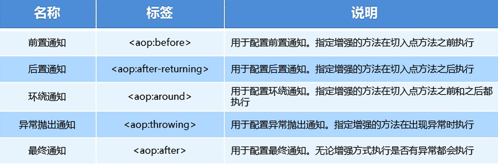
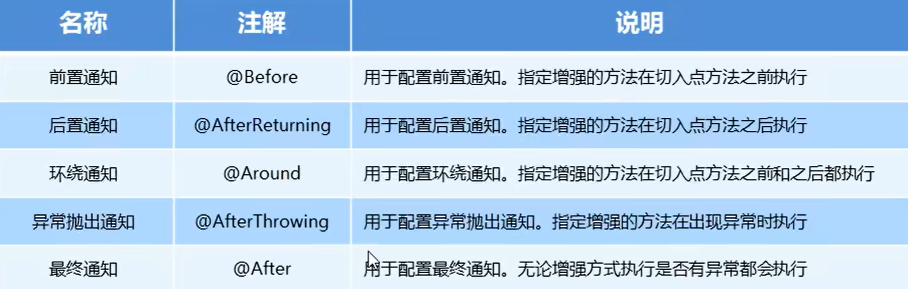
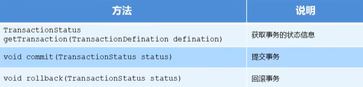

# `Spring`

## 基本概念

`Spring`框架是为了解决软件开发的复杂性而创建的。`Spring`使用的是基本的`JavaBean`来完成以前只可能由`EJB`完成的事情。然而，`Spring`的用途不仅仅限于服务器端的开发。从简单性、可测试性和松耦合性角度而言，绝大部分`Java`应用都可以从`Spring`中受益。

`Spring`是分层的`Java SE/EE`应用`full-stack`（各层都有解决方案）轻量级开源框架，以`IoC`反转控制和`AOP`面向切面编程为内核

`Spring`提供了展现层`SpringMVC`（`Web`层）和持久层`Spring JDBCTemplate`以及业务层事务管理等众多的企业级应用技术，还能整合开源世界中众多著名的第三方框架和类库，逐渐成为使用最多的`Java EE`企业应用开源框架

`Spring`的优势：

- 方便解耦，简化开发

  通过`Spring`提供的`IoC`容器，可以将对象间的依赖关系交由`Spring`进行控制，避免硬编码造成的过度耦合，用户也不必再为单例模式类，属性文件解析等底层的需求编写代码，可以更专注于上层任务

- `AOP`编程的支持

  通过`Spring`的`AOP`功能，方便进行面向切面编程，许多不容易用传统`OOP`实现的功能可以通过`AOP`实现
  
- 声明式事务的支持

  可以将我们从单调烦闷的事务管理代码（提交事务，回滚等）中解脱出来，通过声明方式灵活的进行事务管理，提高开发效率和质量

- 方便程序的测试

  可以用非容器依赖的编程方式进行几乎所有的测试工作，测试不再是昂贵的操作，而是随手可做的事情

- 方便集成各种优秀的框架

  `Spring`对各种优秀的框架（`Struts`、`Hibemate`、`Hessian`、`Quartz`等框架）有很好的支持

- 降低`Java EE API`的使用难度

  `Spring`对`Java EE API`（如`JDBC`、`JavaMail`、远程调用等）进行了薄薄的封装层（模板），使这些`API`的使用难度大为降低

- `Spring`的源代码设计巧妙，处处体现了`Java`设计模式的灵活运用，其源代码是`Java`技术学习的最好典范

`Spring`的体系结构


> - 最顶部的两层是数据访问层和`Web`应用层，其实现要借助中间层的工具
> - 中间层包括`AOP`和切面等编程技术
> - `Core Container`：核心容器，主要涉及的是`IoC`的知识点，有主要的四个部分：产生对象的容器、核心、上下文和`Spring`的表达式语言
> - `Test`表示整体的框架都可以进行测试


## 开发步骤

`Spring`框架的基本开发步骤为：

1. 导入`Spring`开发的基本包坐标

   依赖坐标是一种标识符，用来指明我们需要使用的库或框架的版本信息。在`Maven`构建工具中，通过添加依赖坐标来告诉构建工具需要下载并引入哪些库文件

   在具体模块的`pom.xml`文件中导入基本的包坐标

   ```xml
   <dependency>
       <groupId>org.springframework</groupId>
       <artifactId>spring-context</artifactId>
       <version>5.3.9</version>
   </dependency>
   ```

2. 编写`Dao`接口和实现类（创建`Bean`）

   在`src/main/java`文件夹中创建接口

   ```java
   package com.jlc.dao;
   
   public interface UserDao {
       public void save();
   }
   ```

   为这个接口创建对应的实现：

   ```java
   package com.jlc.dao.impl;
   
   import com.jlc.dao.UserDao;
   
   public class UserDaoImpl implements UserDao {
       // 实现接口的save方法
       public void save() {
           System.out.println("save running");
       }
   }
   ```

3. 创建`Spring`核心配置文件（一般叫做`applicationContext.xml`）

4. 在`Spring`配置文件中配置`UserDaolmpl`

   将全包名配置到配置文件的内部，通过`id`去标识这个全限定名（后续可以通过这个`id`标识去获取这个全限定名）

   在`src/main/resources`文件夹中创建`Spring`配置文件`applicationContext.xml`

   ```xml
   <?xml version="1.0" encoding="UTF-8"?>
   <beans xmlns="http://www.springframework.org/schema/beans"
   xmlns:xsi="http://www.w3.org/2001/XMLSchema-instance"
   xmlns:context="http://www.springframework.org/schema/context"
   xsi:schemaLocation="http://www.springframework.org/schema/beans
   http://www.springframework.org/schema/beans/spring-beans.xsd
   http://www.springframework.org/schema/context
   http://www.springframework.org/schema/context/spring-context.xsd">
       
   	<!-- bean定义和其他配置 -->
       <bean id="userDao" class="com.jlc.dao.impl.UserDaoImpl"></bean>
       
   </beans>
   ```

   > `id`标识配置具体的标识；`class`表示配置具体的全限定名

5. 引入`Spring`框架（框架的作用是读取这个`xml`配置文件），使用`Spring`的`API`获取`Bean`实例（获取全包名，通过反射创建`Bean`对象，默认情况下反射是通过无参构造去创建对象的）

   ```java
   package com.jlc.demo;
   
   public class UserDaoDemo {
       public static void main(String[] args) {
           // 获得容器中，由Spring进行创建的userDao
           ApplicationContext app = new ClassPathXmlApplicationContext(configLocation:"applicationContext.xml");
           UserDao userDao = (UserDao) app.getBean(s:"userDao");  // 通过标识去获取具体的对象
           userDao.save();  // 调用save()方法
       }
   }
   ```


`Spring`框架的作用就是读取`XML`配置文件的，从而获得我们的全包名；

上述的过程完成了解耦，代码可以不进行修改，我们只需要修改其配置文件（在开发阶段和运行阶段是保持不变的），就可以实现相应的功能


## 配置文件

### `Bean`标签

`Bean`标签用于配置对象交由`Spring`来创建

默认情况下它调用的是类中的无参构造器，如果没有无参构造器则不能创建成功

基本属性：

- `id`：`Bean`实例在`Spring`容器中的唯一标识，是不允许重复的

- `class`：`Bean`的全限定名称

- `scope`：`Bean`标签的范围配置，指对象的作用范围，取值如下：

  |     取值范围     |                             描述                             |
  | :--------------: | :----------------------------------------------------------: |
  |   `singleton`    | 默认值，单例的（容器中存在的对象只有一个，即每次在`getBean`实例出对象时，指向的是同一个对象） |
  |   `prototype`    | 多例的（从容器中获取对象有多个对象，即每次在`getBean`时，都会获取新的对象） |
  |    `request`     | `WEB`项目中，`Spring`创建一个`Bean`的对象，将对象存入到`request`域中 |
  |    `session`     | `WEB`项目中，`Spring`创建一个`Bean`的对象，将对象存入到`session`域中 |
  | `global session` | `WEB`项目中，应用在`Portlet`环境，如果没有`Portlet`环境，那么`global session`相当于`session` |

  > - 当`scope`的取值为`singleton`时，`Bean`的实例化个数是一个，其`Bean`的实例化时机为当`Spring`核心文件被加载时（`ApplicationContext app = new ClassPathXmlApplicationContext(configLocation:"applicationContext.xml");`），实例化配置的`Bean`实例；`Bean`的生命周期：
  >   - 对象创建：当应用加载，创建容器时，对象就被创建了
  >   - 对象运行：只要容器在，对象一直活着
  >   - 对象销毁：当应用卸载时，销毁容器时，对象就被销毁了
  > - 当`scope`的取值为`prototype`时，`Bean`的实例化个数有多个，其`Bean`的实例化时机为当调用`getBean()`方法时实例化`Bean`；`Bean`的生命周期：
  >   - 对象创建：当使用对象时，创建新的对象实例
  >   - 对象运行：只要对象在使用中，就一直活着
  >   - 对象销毁：当对象长时间不用时，就会被`Java`的垃圾回收器回收

- `init-method="具体方法"`：对象的初始化方法，即在初始化的时候执行指定的方法（这个指定的方法在对象声明存在）

- `destroy-method="具体方法"`：对象的销毁方法，即在对象销毁时执行指定的方法（这个指定的方法在对象声明存在）

  销毁对象：`app.close();`

#### `Bean`实例化的三种方式

`Bean`实例化的方式默认是找其对象的无参构造器方法进行实例化（是重点），但是我们也可以通过配置，让其不找无参构造，使用工厂静态方法实例化和工厂实例方法实例化

工厂静态方法实例化

首先需要创建一个静态工厂：

```java
package com.jlc.factory;

public class StaticFactory {
    // 编写一个静态方法，返回对象实例
    public static UserDao getUserDao() {
        return new UserDaoImpl();
    }
}
```

在`Spring`配置文件中声明使用工厂静态方法进行实例化

```xml
<?xml version="1.0" encoding="UTF-8"?>
<beans xmlns="http://www.springframework.org/schema/beans"
xmlns:xsi="http://www.w3.org/2001/XMLSchema-instance"
xmlns:context="http://www.springframework.org/schema/context"
xsi:schemaLocation="http://www.springframework.org/schema/beans
http://www.springframework.org/schema/beans/spring-beans.xsd
http://www.springframework.org/schema/context
http://www.springframework.org/schema/context/spring-context.xsd">
    
    <bean id="userDao" class="com.jlc.factory.StaticFactory" factory-method="getUserDao"></bean>
    
</beans>
```

> 找全限定名`class="com.jlc.factory.StaticFactory"`内部指定的工厂方法`getUserDao`返回对应的对象（该方法是静态方法，可以不通过类.的方式进行调用）

工厂实例方法实例化

与工厂静态方法实例化类似，但是不是通过静态方法返回对象

```java
package com.jlc.factory;

public class DynamicFactory {
    // 编写一个方法，返回对象实例
    public UserDao getUserDao() {
        return new UserDaoImpl();
    }
}
```

在`Spring`配置文件中声明使用工厂实例方法进行实例化

```xml
<?xml version="1.0" encoding="UTF-8"?>
<beans xmlns="http://www.springframework.org/schema/beans"
xmlns:xsi="http://www.w3.org/2001/XMLSchema-instance"
xmlns:context="http://www.springframework.org/schema/context"
xsi:schemaLocation="http://www.springframework.org/schema/beans
http://www.springframework.org/schema/beans/spring-beans.xsd
http://www.springframework.org/schema/context
http://www.springframework.org/schema/context/spring-context.xsd">
    
    <bean id="factory" class="com.jlc.factory.DynamicFactory"></bean>
    <bean id="userDao" factory-bean="factory" factory-method="getUserDao">
    
</beans>
```

> 由于不是静态方法，首先需要通过`Spring`产生工厂对象，再调用工厂内部的实例化方法

#### 依赖注入

之前的工作，只是让`Spring`帮助我们实例化出`Dao`层的对象，在实际开发中，业务成和`Web`层也是有对应代码的

创建业务层的代码：在`src/main/java`文件夹中创建：

```java
package com.jlc.service;

// 声明业务层的接口
public interface UserService {
    public void save();
}
```

为接口创建一个实现：

```java
package com.jlc.service.impl;

import com.jlc.service.UserService;

public class UserServiceImpl implements UserService {
    public void save() {
        // 调用Dao中的save方法
        ApplicationContext app = new ClassPathXmlApplicationContext(configLocation:"applicationContext.xml");
        UserDao userDao = (UserDao) app.getBean(s:"userDao");  // 通过标识去获取具体的对象
        userDao.save();  // 调用save()方法
    }
}
```

将`UserServiceImpl`也配置到`Spring`容器中：

```xml
<?xml version="1.0" encoding="UTF-8"?>
<beans xmlns="http://www.springframework.org/schema/beans"
xmlns:xsi="http://www.w3.org/2001/XMLSchema-instance"
xmlns:context="http://www.springframework.org/schema/context"
xsi:schemaLocation="http://www.springframework.org/schema/beans
http://www.springframework.org/schema/beans/spring-beans.xsd
http://www.springframework.org/schema/context
http://www.springframework.org/schema/context/spring-context.xsd">
    
	<!-- bean定义和其他配置 -->
    <bean id="userDao" class="com.jlc.dao.impl.UserDaoImpl"></bean>
    <bean id="userService" class="com.jlc.service.impl.UserServiceImpl"></bean>
</beans>
```

编写一个测试文件：

```java
package com.jlc.demo;

public class UserController {
    public static void main(String[] args) {
        ApplicationContext app = new ClassPathXmlApplicationContext(configLocation:"applicationContext.xml");
        UserService userService = (UserService) app.getBean(s:"userService");
        userService.save();  // 调用save()方法
    }
}
```

目前`UserService`实例和`UserDao`实例都存在于`Spring`容器中，但最终程序直接使用的可能是`UserService`，所以可以在`Spring`容器中，上述做法是在`Spring`容器外将`Dao`组装到`Service`内部完成后续的操作

我们可以在`Spring`容器中，将`UserDao`设置到`UserService`内部，这个过程就是依赖注入


依赖注入是`Spring`框架核心`IOC`的具体实现，在编写程序时，通过控制反转，把对象的创建交给了`Spring`，但是代码中不可能出现没有依赖的情况。`IOC`解耦只是降低他们的依赖关系，但不会消除。

通过依赖注入，业务层和持久层的依赖关系，在使用`Spring`之后，就让`Spring`来配置和维护了，简而言之，就是让框架把持久层对象传入业务从鞥，而不用我们自己去获取

依赖注入有两种方式：

- `set`方法：为某个属性设置值（即注入值）

  ```java
  // 在UserServiceImpl中通过set方法进行依赖注入
  package com.jlc.service.impl;
  
  import com.jlc.service.UserService;
  
  public class UserServiceImpl implements UserService {
      private UserDao userDao;   // 用于接收容器中的userDao
      public void setUserDao(UserDao userDao) {
          this.userDao = userDao;
      }
      
      public void save() {
          userDao.save();  // 调用save()方法
      }
  }
  ```

  在`Spring`配置文件中声明依赖注入

  ```xml
  <?xml version="1.0" encoding="UTF-8"?>
  <beans xmlns="http://www.springframework.org/schema/beans"
  xmlns:xsi="http://www.w3.org/2001/XMLSchema-instance"
  xmlns:context="http://www.springframework.org/schema/context"
  xsi:schemaLocation="http://www.springframework.org/schema/beans
  http://www.springframework.org/schema/beans/spring-beans.xsd
  http://www.springframework.org/schema/context
  http://www.springframework.org/schema/context/spring-context.xsd">
      
  	<!-- bean定义和其他配置 -->
      <bean id="userDao" class="com.jlc.dao.impl.UserDaoImpl"></bean>
      <bean id="userService" class="com.jlc.service.impl.UserServiceImpl">
          <property name="userDao" ref="userDao"></property>
      </bean>
  </beans>
  ```

  > `<property name="userDao" ref="userDao"></property>`中的`name`是`set`方法后面的部分，大写字母变成小写；`ref`表示将具体的唯一标识进行注入（对象的引用用`ref`）

  `set`方法进行依赖注入，有一个简化的方式，即`P`命名空间注入，主要的区别体现在配置文件中（使用属性的方式代替具体的子标签）：

  ```xml
  <?xml version="1.0" encoding="UTF-8"?>
  <beans xmlns="http://www.springframework.org/schema/beans"
  xmlns:xsi="http://www.w3.org/2001/XMLSchema-instance"
  xmlns:context="http://www.springframework.org/schema/context"
  xsi:schemaLocation="http://www.springframework.org/schema/beans
  http://www.springframework.org/schema/beans/spring-beans.xsd
  http://www.springframework.org/schema/context
  http://www.springframework.org/schema/context/spring-context.xsd"
  xmlns:p="http://www.springframework.org/schema/p">
      
  	<!-- bean定义和其他配置 -->
      <bean id="userDao" class="com.jlc.dao.impl.UserDaoImpl"></bean>
      <bean id="userService" class="com.jlc.service.impl.UserServiceImpl" p:userDao-ref="userDao"></bean>
  </beans>
  ```

- 构造方法：通过有参构造，将数据注入到其他对象的内部

  ```java
  // 在UserServiceImpl中通过构造方法进行依赖注入
  package com.jlc.service.impl;
  
  import com.jlc.service.UserService;
  
  public class UserServiceImpl implements UserService {
      private UserDao userDao;   // 用于接收容器中的userDao
      public UserServiceImpl(UserDao userDao) {   // 有参构造
          this.userDao = userDao;
      }
      
      // 使用的有参构造，会覆盖无参构造，我们要重新声明
      public UserServiceImpl() {}
      
      public void save() {
          userDao.save();  // 调用save()方法
      }
  }
  ```

  在`Spring`配置文件中声明依赖注入

  ```xml
  <?xml version="1.0" encoding="UTF-8"?>
  <beans xmlns="http://www.springframework.org/schema/beans"
  xmlns:xsi="http://www.w3.org/2001/XMLSchema-instance"
  xmlns:context="http://www.springframework.org/schema/context"
  xsi:schemaLocation="http://www.springframework.org/schema/beans
  http://www.springframework.org/schema/beans/spring-beans.xsd
  http://www.springframework.org/schema/context
  http://www.springframework.org/schema/context/spring-context.xsd">
      
  	<!-- bean定义和其他配置 -->
      <bean id="userDao" class="com.jlc.dao.impl.UserDaoImpl"></bean>
      <bean id="userService" class="com.jlc.service.impl.UserServiceImpl">
          <constructor-srg name="userDao" ref="userDao"></constructor-srg>
      </bean>
  </beans>
  ```

  > `<constructor-srg name="userDao" ref="userDao"></constructor-srg>`中的`name`是`UserServiceImpl`内部对应的私有属性名；`ref`表示将具体的唯一标识进行注入（对象的引用用`ref`）

##### 依赖注入的数据类型

对于注入的引用`Bean`，除了对象的引用类型可以注入，普通的数据类型、集合等都可以在容器中进行注入

注入数据的三种数据类型：既可以通过`set`方法，也可以通过构造函数的方法，这里只演示`set`方法

- 普通数据类型

  ```java
  // 在UserServiceImpl中通过set方法进行普通数据类型的依赖注入
  package com.jlc.service.impl;
  
  import com.jlc.service.UserService;
  
  public class UserServiceImpl implements UserService {
      private String userName;   // 用于接收容器中的注入的username
      private int age;   // 用于接收容器中的注入的age
      public void setUserName(String userName) {
          this.userName = userName;
      }
      public void setAge(int age) {
          this.age = age;
      }
      
      public void save() {
          System.out.println(userName, age);   // zhangsan, 25
      }
  }
  ```

  在`Spring`配置文件中声明依赖注入

  ```xml
  <?xml version="1.0" encoding="UTF-8"?>
  <beans xmlns="http://www.springframework.org/schema/beans"
  xmlns:xsi="http://www.w3.org/2001/XMLSchema-instance"
  xmlns:context="http://www.springframework.org/schema/context"
  xsi:schemaLocation="http://www.springframework.org/schema/beans
  http://www.springframework.org/schema/beans/spring-beans.xsd
  http://www.springframework.org/schema/context
  http://www.springframework.org/schema/context/spring-context.xsd">
      
  	<!-- bean定义和其他配置 -->
      <bean id="userDao" class="com.jlc.dao.impl.UserDaoImpl"></bean>
      <bean id="userService" class="com.jlc.service.impl.UserServiceImpl">
          <property name="userName" value="zhangsan"></property>
          <property name="age" value="25"></property>
      </bean>
  </beans>
  ```

  > 普通属性值进行依赖注入使用`value`

- 引用数据类型：之前对象引用的注入（对象引用进行依赖注入使用`ref`）

- 集合数据类型

  ```java
  // 在UserServiceImpl中通过set方法进行集合数据类型的依赖注入
  package com.jlc.service.impl;
  
  import com.jlc.service.UserService;
  
  public class UserServiceImpl implements UserService {
      private List<String> strList;
      private Map<String, User> userMap;   // User是一个对象
      private Properties properties;
      
      public void setStrList(List<String> strList) {
          this.strList = strList;
      }
      public void setUserMap(Map<String, User> userMap) {
          this.userMap = userMap;
      }
      public void setProperties(Properties properties) {
          this.properties = properties;
      }
      
      public void save() {
          System.out.println(strList);   // [aa, bb, cc]
          System.out.println(userMap);   // {u1=User{name='jack', addr='hangzhou'}, u2=User{name='mary', addr='shanghai'}}
          System.out.println(properties);   // {p2=PPP, p1=ppp}
      }
  }
  ```

  在`Spring`配置文件中声明依赖注入

  ```xml
  <?xml version="1.0" encoding="UTF-8"?>
  <beans xmlns="http://www.springframework.org/schema/beans"
  xmlns:xsi="http://www.w3.org/2001/XMLSchema-instance"
  xmlns:context="http://www.springframework.org/schema/context"
  xsi:schemaLocation="http://www.springframework.org/schema/beans
  http://www.springframework.org/schema/beans/spring-beans.xsd
  http://www.springframework.org/schema/context
  http://www.springframework.org/schema/context/spring-context.xsd">
      
  	<!-- bean定义和其他配置 -->
      <bean id="userDao" class="com.jlc.dao.impl.UserDaoImpl"></bean>
      <bean id="userService" class="com.jlc.service.impl.UserServiceImpl">
          <property name="strList">
              <List>
                  <value>aa</value>
                  <value>bb</value>
                  <value>cc</value>
              </List>
          </property>
          <property name="userMap" value="25">
              <Map>
                  <entry key="u1" value-ref="user1"></entry>
                  <entry key="u2" value-ref="user2"></entry>
              </Map>
          </property>
          <property name="properties">
              <props>
                  <prop key='p1'>ppp</prop>
                  <prop key='p2'>PPP</prop>
              </props>
          </property>
      </bean>
      
      <bean id="user1" class=com.jlc.domain.User>
          <property name="name" value="jack"></property>
          <property name="addr" value="hangzhou"></property>
      </bean>
      <bean id="user2" class=com.jlc.domain.User>
          <property name="name" value="mary"></property>
          <property name="addr" value="shanghai"></property>
      </bean>
  </beans>
  ```

  > 集合属性值使用内部的具体对应子标签进行依赖的注入，子标签具体注入的值如果是基本数据类型，使用`<value>`标签进行包裹，如果是对象引用类型，使用`<ref>`标签进行包裹

***

### `import `标签

`import `标签用于引入其他配置文件

在实际开发中，`Spring`的配置文件内容一般非常多，不方便后期的维护，所以我们通常将配置文件中的部分配置拆分到其他配置文件中，而在`Spring`主配置文件中通过`import`标签进行加载开发

```xml
<import resource="applicationContext-xxx.xml"/>
```

> 引入之后，加载主配置文件，其引用的分配置文件也会被一起进行加载


## 相关`API`

```java
// Spring相关的API
ApplicationContext app = new ClassPathXmlApplicationContext(configLocation:"applicationContext.xml");
UserService userService = (UserService) app.getBean(s:"userService");
userService.save();  // 调用save()方法
```

> `ApplicationContext`的继承体系：`ApplicationContext`是一个接口，代表应用上下文，可以通过其实例获得`Spring`容器中的`Bean`对象，`ClassPathXmlApplicationContext`是该接口对应的接口实现，使用多态的方式接收，`ApplicationContext`接口的所有实现类有：
>
> - `ClassPathXmlApplicationContext`：从类的根路径（`resources`文件夹）下加载配置文件
>
>   ```java
>   new ClassPathXmlApplicationContext(configLocation:"applicationContext.xml");
>   ```
>
> - `FileSystemXmlApplicationContext`：从磁盘路径上加载配置文件，配置文件可以在磁盘的任意位置
>
>   ```java
>   new FileSystemXmlApplicationContext(configLocation:"D:\\src\\mian\\resources\\applicationContext.xml");
>   ```
>
> - `AnnotationConfigApplicationContext`：使用注解配置容器对象时，需要使用此类来创建`Spring`容器，从而读取注解

### `getBean()`

`getBean()`的参数有两种方式：

- `getBean("id")`

  如：`UserService userService = (UserService) app.getBean(s:"userService");`

  当参数的数据类型是字符串时，表示根据配置文件中`Bean`的`id`从容器中获得`Bean`实例，返回的是`Object`，需要进行强转

- `getBean(class)`

  如：`UserService userService = app.getBean(UserService.class);`

  当参数的数据类型是`Class`类型时，表示根据类型从容器中匹配`Bean`实例，但是当容器中相同类型的`Bean`有多个时（即`id`不同，`class`的内容相同），则此方法会报错。


## 配置数据源

数据源就是`Java`中的连接池，使用连接池去充当数据源

数据源可以提高程序性能，需要事先实例化数据源，从而初始化部分连接资源；当我们要使用连接资源时从数据源中获取；当使用完毕后，将连接资源归还给数据源

常见的数据源（连接池）有：`DBCP`、`C3P0`、`BoneCP`和`Druid`

***

### 传统方式配置数据源

数据源的开发步骤：

1. 导入数据源的坐标和数据库的驱动坐标

   在具体模块的`pom.xml`文件中导入基本的包坐标

   ```xml
   <dependency>
       <dependency>
           <groupId>mysql</groupId>
           <artifactId>mysql-connector-java</artifactId>
           <version>5.1.32</version>
       </dependency>
       <dependency>
           <groupId>c3p0</groupId>
           <artifactId>c3p0</artifactId>
           <version>0.9.1.2</version>
       </dependency>
       <dependency>
       	<groupId>com.alibaba</groupId>
           <artifactId>druid</artifactId>
           <version>1.1.10</version>
       </dependency>
   </dependency>
   ```

2. 创建数据源对象

3. 设置数据源的基本连接数据信息（驱动，数据库地址，用户名和密码）

4. 使用数据源获取连接资源和归还连接资源

```java
package com.jlc.test;

import com.mchange.v2.c3p0.ComboPooledDataSource;

public class DataSourceTest {
    // c3p0数据源的使用
    public void test1() throws Exception {
        // 创建数据源对象
        ComboPooledDataSource dataSource = new ComboPooledDataSource();
        // 设置基本的连接参数
        dataSource.setDriverClass("com.mysql.jdbc.Driver");
        dataSource.setJdbcUrl("jdbc:mysql://localhost:3306/test");
        dataSource.setUser("root");
        dataSource.setPassword("admin");
        // 获取资源
        Connection connection = dataSource.getConnection();
        ...
        // 关闭连接，归还连接资源
        connection.close();
    }
    
    // Druid数据源的使用
    public void test2() throws Exception {
        // 创建数据源对象
        DruidDataSource dataSource = new DruidDataSource();
        // 设置基本的连接参数
        dataSource.setDriverClassName("com.mysql.jdbc.Driver");
        dataSource.setUrl("jdbc:mysql://localhost:3306/test");
        dataSource.setUsername("root");
        dataSource.setPassword("admin");
        // 获取资源
        DruidPooledConnection connection = dataSource.getConnection();
        ...
        // 关闭连接，归还连接资源
        connection.close();
    }
}
```

通常，在实际开发中，要对基本的连接参数信息进行抽取，使字符串设置与数据源进行解耦合，将信息配置在`properties`配置文件中（以键值对的形式存放），在`resources`文件夹中新建：`jdbc.properties`

```properties
jdbc.driver=com.mysql.jdbc.Driver
jdbc.url=jdbc:mysql://localhost:3306/test
jdbc.username=root
jdbc.password=admin
```

修改上述的使用数据源的文件，使其读取外部的数据库配置信息文件

```java
package com.jlc.test;

import com.mchange.v2.c3p0.ComboPooledDataSource;
import java.util.ResourceBundle;

public class DataSourceTest {
    // c3p0数据源的使用（通过加载数据库信息配置文件）
    public void test1() throws Exception {
        // 读取数据库配置文件
        ResourceBundle rb = ResourceBundle.getBundle("jdbc");  // 传入的是相对resources文件夹下的文件地址，而且其名称也不需要扩展名，读取的默认是.properties文件
        // 设置读取的配置文件
        String driver = rb.getString("jdbc.driver");
        String url = rb.getString("jdbc.url");
        String username = rb.getString("jdbc.username");
        String password = rb.getString("jdbc.password");
        // 创建数据源对象
        ComboPooledDataSource dataSource = new ComboPooledDataSource();
        // 设置基本的连接参数
        dataSource.setDriverClass(driver);
        dataSource.setJdbcUrl(url);
        dataSource.setUser(username);
        dataSource.setPassword(password);
        // 获取资源
        Connection connection = dataSource.getConnection();
        ...
        // 关闭连接，归还连接资源
        connection.close();
    }
}
```

***

### 通过`Spring`配置文件配置数据源

对于数据源的第三方包，也可以通过`Spring`配置文件进行配置，即将`DataSource`的创建权交给`Spring`容器去完成

基本步骤：

1. 导入数据源的坐标和数据库的驱动坐标，之前的基础上导入`spring-context`

   在具体模块的`pom.xml`文件中导入基本的包坐标

   ```xml
   <dependency>
       <dependency>
           <groupId>mysql</groupId>
           <artifactId>mysql-connector-java</artifactId>
           <version>5.1.32</version>
       </dependency>
       <dependency>
           <groupId>c3p0</groupId>
           <artifactId>c3p0</artifactId>
           <version>0.9.1.2</version>
       </dependency>
       <dependency>
       	<groupId>com.alibaba</groupId>
           <artifactId>druid</artifactId>
           <version>1.1.10</version>
       </dependency>
       <dependency>
           <groupId>org.springframework</groupId>
           <artifactId>spring-context</artifactId>
           <version>5.3.9</version>
       </dependency>
   </dependency>
   ```

2. 创建`Spring`配置文件，在`resources`文件夹下创建`Spring`配置文件`applicationContext.xml`

   ```xml
   <?xml version="1.0" encoding="UTF-8"?>
   <beans xmlns="http://www.springframework.org/schema/beans"
   xmlns:xsi="http://www.w3.org/2001/XMLSchema-instance"
   xmlns:context="http://www.springframework.org/schema/context"
   xsi:schemaLocation="http://www.springframework.org/schema/beans
   http://www.springframework.org/schema/beans/spring-beans.xsd
   http://www.springframework.org/schema/context
   http://www.springframework.org/schema/context/spring-context.xsd">
       
   	<!-- bean定义和其他配置 -->
       <bean id="dataSource" class="com.mchange.v2.c3p0.ComboPooledDataSource">
           <property name="driverClass" value="com.mysql.jdbc.Driver"></property>
           <property name="jdbcUrl" value="jdbc:mysql://localhost:3306/test"></property>
           <property name="user" value="root"></property>
           <property name="password" value="admin"></property>
       </bean>
       
   </beans>
   ```

3. 测试数据源

   ```java
   package com.jlc.test;
   
   import org.springframework.context.ApplicationContext;
   
   public class DataSourceTest {
       // Spring容器产生数据源对象
       public void test1() throws Exception {
           // 创建数据源对象
           ApplicationContext app = new ClassPathXmlApplicationContext(configLocation:"applicationContext.xml");
           DataSource dataSource = app.getBean(DataSource.class);
           // 获取资源
           Connection connection = dataSource.getConnection();
           ...
           // 关闭连接，归还连接资源
           connection.close();
       }
   }
   ```


#### 抽取`jdbc`配置文件

`applicationContext.xml`通常是要加载`jdbc.properties`配置文件获取数据库的连接信息

首先，需要引入`context`命名空间和约束路径：

- 命名空间：`xmlns:context="http://www.springframework.org/schema/context"`

- 约束路径：`http://www.springframework.org/schema/context`

  ​				   `http://www.springframework.org/schema/context/spring-context.xsd`

```xml
<?xml version="1.0" encoding="UTF-8"?>
<beans xmlns="http://www.springframework.org/schema/beans"
xmlns:xsi="http://www.w3.org/2001/XMLSchema-instance"
xmlns:context="http://www.springframework.org/schema/context"
xsi:schemaLocation="http://www.springframework.org/schema/beans
http://www.springframework.org/schema/beans/spring-beans.xsd
http://www.springframework.org/schema/context
http://www.springframework.org/schema/context/spring-context.xsd">
    
    <!-- 加载外部的properties配置文件 -->
    <context:property-placeholder location="classpath:jdbc.properties"/>
	<!-- bean定义和其他配置 -->
    <bean id="dataSource" class="com.mchange.v2.c3p0.ComboPooledDataSource">
        <property name="driverClass" value="${jdbc.driver}"></property>
        <property name="jdbcUrl" value="${jdbc.url}"></property>
        <property name="user" value="${jdbc.username}"></property>
        <property name="password" value="${jdbc.password}"></property>
    </bean>
    
</beans>
```


## 注解开发

`Spring`是轻代码而重配置的框架，配置比较繁重，影响开发效率，所以注解开发是一种趋势，注解替代`xml`配置文件可以简化配置，提高开发效率

不使用注解的开发方式：

1. 编写`Dao`接口和实现类（创建`Bean`）

   在`src/main/java`文件夹中创建接口

   ```java
   package com.jlc.dao;
   
   public interface UserDao {
       public void save();
   }
   ```

   为这个接口创建对应的实现：

   ```java
   package com.jlc.dao.impl;
   
   import com.jlc.dao.UserDao;
   
   public class UserDaoImpl implements UserDao {
       // 实现接口的save方法
       public void save() {
           System.out.println("save running");
       }
   }
   ```

2. 创建业务层（`Service`）的代码：在`src/main/java`文件夹中创建：

   ```java
   package com.jlc.service;
   
   // 声明业务层的接口
   public interface UserService {
       public void save();
   }
   ```

   为接口创建一个实现：

   ```java
   package com.jlc.service.impl;
   
   import com.jlc.service.UserService;
   
   public class UserServiceImpl implements UserService {
       private UserDao userDao;
       public void setUserDao(UserDao userDao) {
           this.userDao = userDao;
       }
       public void save() {
           userDao.save();  // 调用userDao的save()方法
       }
   }
   ```

3. 创建`Spring`核心配置文件并配置

   在`src/main/resources`文件夹中创建`Spring`配置文件`applicationContext.xml`

   ```xml
   <?xml version="1.0" encoding="UTF-8"?>
   <beans xmlns="http://www.springframework.org/schema/beans"
   xmlns:xsi="http://www.w3.org/2001/XMLSchema-instance"
   xmlns:context="http://www.springframework.org/schema/context"
   xsi:schemaLocation="http://www.springframework.org/schema/beans
   http://www.springframework.org/schema/beans/spring-beans.xsd
   http://www.springframework.org/schema/context
   http://www.springframework.org/schema/context/spring-context.xsd">
       
   	<!-- bean定义和其他配置 -->
       <bean id="userDao" class="com.jlc.dao.impl.UserDaoImpl"></bean>
       <bean id="userService" class="com.jlc.service.impl.UserServiceImpl">
           <constructor-srg name="userDao" ref="userDao"></constructor-srg>
       </bean>
   </beans>
   ```

4. 创建一个虚拟的`Web`层进行测试，在`src/main/java`文件夹中创建：

   ```java
   package com.jlc.web;
   
   import org.springframework.context.ApplicationContext;
   
   public class UserController {
       public static void main(String[] args) {
           ApplicationContext app = new ClassPathXmlApplicationContext(configLocation:"applicationContext.xml");
           UserService userService = app.getBean(UserService.class); 
           userService.save();
       }
   }
   ```

***

### `Spring`原始注解

`Spring`原始注解主要是替代`<Bean>`标签的配置，其相关的原始注解有：


> `@Controller`、`@Service`和`@Repository`注解的功能和`@Component`注解是一样的，只是前面三个具有语义化的功能，在具体的层上实例化`Bean`

使用原始注解的方式进行优化：

1. 编写`Dao`接口和实现类（创建`Bean`）

   在`src/main/java`文件夹中创建接口

   ```java
   package com.jlc.dao;
   
   public interface UserDao {
       public void save();
   }
   ```

   为这个接口创建对应的实现：

   ```java
   package com.jlc.dao.impl;
   
   import com.jlc.dao.UserDao;
   
   @Component("userDao")  // 可以使用@Repository("userDao")  语义更加明确
   public class UserDaoImpl implements UserDao {
       // 实现接口的save方法
       public void save() {
           System.out.println("save running");
       }
   }
   ```

   > 使用`@Component`来替换`<bean id="userDao" class="com.jlc.dao.impl.UserDaoImpl"></bean>`

2. 创建业务层（`Service`）的代码：在`src/main/java`文件夹中创建：

   ```java
   package com.jlc.service;
   
   // 声明业务层的接口
   public interface UserService {
       public void save();
   }
   ```

   为接口创建一个实现：

   ```java
   package com.jlc.service.impl;
   
   import com.jlc.service.UserService;
   
   @Component("userService")   // 可以使用@Service("userService")  语义更加明确
   @Scope("prototype")   // Scope注解，prototype用于产生多个bean，singleton用于产生一个bean
   public class UserServiceImpl implements UserService {
       @Autowired    // 表示自动注入
       @Qualifier("userDao")   // 依赖注入，按照id的值从容器中进行匹配的，此处的@Qualifier必须结合@Autowired一起进行使用
       private UserDao userDao;
       
       public void save() {
           userDao.save();  // 调用userDao的save()方法
       }
       
       @PostConstruct  // 声明下面的方法是对象的初始化方法
       public void init() {   // 对象的初始化方法
           system.out.println("init"); 
       }
       
       @PreDestory  // 声明下面的方法是对象销毁前执行的方法
       public void destory() {   // 对象的销毁前执行的方法
           system.out.println("destory"); 
       }
   }
   ```

   > - 使用`@Component`来替换`<bean id="userService" class="com.jlc.service.impl.UserServiceImpl"></bean>`
   >
   > - 使用`@Autowired`和`@Qualifier()`来代替`<constructor-srg name="userDao" ref="userDao"></constructor-srg>`进行依赖注入
   >
   > - 使用`xml`配置的方式`setUserDao()`方法是必须要有的，但是使用注解的方法，`setUserDao()`可以删除
   >
   >   ```java
   >   // 该方法可以删除
   >   public void setUserDao(UserDao userDao) {
   >       this.userDao = userDao;
   >   }
   >   ```
   >
   > - 对于`@Qualifier("userDao")`，也可以不写，那么`@Autowired`会按照数据类型从`Spring`容器中根据类型的查找进行自动的匹配（找一个`userDao`类的`Bean`进行注入，如果容器中有多个`userDao`类，那就必须加上`@Qualifier("userDao")`注解）
   >
   > - 我们可以使用`@Resource(name="userDao")`来代替`@Autowired+@Qualifier("userDao")`进行依赖的注入
   >
   > 之前的依赖注入是注入对象引用类型，然而依赖注入也可以注入基本数据类型和集合数据类型：
   >
   > ```java
   > package com.jlc.service.impl;
   > 
   > import com.jlc.service.UserService;
   > 
   > @Component("userService")   // 可以使用@Service("userService")  语义更加明确
   > public class UserServiceImpl implements UserService {
   >     @Value("${jdbc.driver}")   // 基本数据类型的依赖注入
   >     private String driver;
   >     
   >     public void save() {
   >         // 前提是配置文件需要加载数据库文件
   >         system.out.println(driver);   // com.mysql.jdbc.Driver  
   >     }
   > }
   > ```

3. 这事`Spring`配置文件`applicationContext.xml`中的`<bean>`内容可以进行删除，同时要告知`Spring`使用了注解的方式

   ```xml
   <?xml version="1.0" encoding="UTF-8"?>
   <beans xmlns="http://www.springframework.org/schema/beans"
   xmlns:xsi="http://www.w3.org/2001/XMLSchema-instance"
   xmlns:context="http://www.springframework.org/schema/context"
   xsi:schemaLocation="http://www.springframework.org/schema/beans
   http://www.springframework.org/schema/beans/spring-beans.xsd
   http://www.springframework.org/schema/context
   http://www.springframework.org/schema/context/spring-context.xsd">
   
       <!--配置组件扫描-->
       <context:component-scan base-package="com.jlc"></context:component-scan>
   </beans>
   ```

   > 使用注解进行开发时，需要在`Spring`配置文件中配置组件扫描，作用是指定哪个包及其子包下的`Bean`需要进行扫描以识别使用注解配置的类、字段和方法。
   >
   > `com.jlc`下的所有`Bean`都会被扫描，包括其子包下的所有`Bean`

4. 创建一个虚拟的`Web`层进行测试，在`src/main/java`文件夹中创建：

   ```java
   package com.jlc.web;
   
   import org.springframework.context.ApplicationContext;
   
   public class UserController {
       public static void main(String[] args) {
           ApplicationContext app = new ClassPathXmlApplicationContext(configLocation:"applicationContext.xml");
           UserService userService = app.getBean(UserService.class); 
           userService.save();
       }
   }
   ```

***

### `Spring`新注解

在`Spring`的`xml`配置文件中，原始注解只能替代`<bean>`标签的内容（对于自定义的`<bean>`，可以使用原始注解进行简化，对于非自定义的，引入官方的包，我们不可能在源码上加上原始注解），然而，还有一些标签是没有办法使用原始注解进行替换的（如`<context:property-placeholder>`），因此，就引入了新注解

`Spring`新注解有：


`Spring`新注解的使用，一般是创建一个`config`文件夹，在其内部创建一个`SpringConfiguration`文件，作为配置的主文件，其他配置文件的内容在主文件中引入即可，那么，子配置文件也会被加载

```java
package com.jlc.config;

import org.springframework.context.annotation.Configuration;

@Configuration   // 标志该类是Spring的核心配置类
@ComponentScan("com.jlc")   // 组件扫描注解的使用
@Import({DataSourceConfiguration.class})  // 加载子配置文件，加载多个，在{}中用逗号分隔即可
public class SpringConfiguration {

}
```

对于数据库的配置，我们可以将具体的配置放到`DataSourceConfiguration`文件中

```java
package com.jlc.config;

@PropertySource("classpath:jdbc.properties")   // 加载.properties配置文件中的配置
public class DataSourceConfiguration {   // 数据源相关的配置
    @Value("${jdbc.driver}")
    private String driver;
    @Value("${jdbc.url}")
    private String url;
    @Value("${jdbc.username}")
    private String username;
    @Value("${jdbc.password}")
    private String password;
    @Bean("dataSource")  // Spring会将当前方法的返回值以指定名称存储到Spring容器中
    public DataSource getDataSource() throws Expection {
        ComboPooledDataSource dataSource = new ComboPooledDataSource();
        dataSource.setDriverClass(driver);
        dataSource.setJdbcUrl(url);
        dataSource.setUser(username);
        dataSource.setPassword(password);
        return dataSource;
    }
}
```

基于上述使用新注解优化配置后，`applicationContext.xml`中配置内容都可以删除（文件也可以删除）

```xml
<?xml version="1.0" encoding="UTF-8"?>
<beans xmlns="http://www.springframework.org/schema/beans"
xmlns:xsi="http://www.w3.org/2001/XMLSchema-instance"
xmlns:context="http://www.springframework.org/schema/context"
xsi:schemaLocation="http://www.springframework.org/schema/beans
http://www.springframework.org/schema/beans/spring-beans.xsd
http://www.springframework.org/schema/context
http://www.springframework.org/schema/context/spring-context.xsd">

</beans>
```

后续在使用时，进行如下的改写：

```java
package com.jlc.web;

import org.springframework.context.annotation.AnnotationConfigApplicationContext;
import com.jlc.config.SpringConfiguration;

public class UserController {
    public static void main(String[] args) {
        ApplicationContext app = new AnnotationConfigApplicationContext(SpringConfiguration.class);
        UserService userService = app.getBean(UserService.class); 
        userService.save();
    }
}
```


## 整合`Junit`

原始的`Junit`测试出现的问题：在测试类中，每个测试方法都需要添加两行代码：

```java
ApplicationContext ac = new ClassPathXmlApplicationContext("bean.xml");
IAccountService as = ac.getBean("accountService", IAccountService.class);
```

> 上述两行代码的作用是获取容器，如果不写的话，会提示空指针异常

因此，每次使用`Junit`进行单元测试，都需要加上述两行代码，是比较麻烦的，需要进行整合`Junit`：

- 让`SpringJunit`负责创建`Spring`容器，但是需要将配置文件的名称告知
- 将需要进行测试的`Bean`直接在测试类中进行注入

`Spring`集成`Junit`的步骤：

1. 导入`Spring`集成`Junit`的坐标

   在具体模块的`pom.xml`文件中导入基本的包坐标

   ```xml
   <dependency>
       <groupId>org.springframework</groupId>
       <artifactId>spring-context</artifactId>
       <version>5.0.5.RELEASE</version>
   </dependency>
   <dependency>
   	<groupId>junit</groupId>
       <artifactId>junit</artifactId>
       <version>4.12</version>
       <scpoe>test</scpoe>
   </dependency>
   <!--导入Spring集成Junit的坐标-->
   <dependency>
   	<groupId>org.springframework</groupId>
       <artifactId>spring-test</artifactId>
       <version>5.0.5.RELEASE</version>
   </dependency>
   ```

2. 使用`@Runwith`注解替换原来的运行器（先找`Spring`，再找`Junit`）

3. 使用`@ContextConfiguration`指定配置文件或配置类

4. 使用`@Autowired`注入需要测试的对象

5. 创建测试方法进行测试

   ```java
   package com.jlc.test;
   
   import org.springframework.test.context.junit4.SpringJUnit4ClassRunner;
   import org.junit.runner.RunWith;
   import org.springframework.test.ContextConfiguration;
   import com.jlc.service.UserService;
   import org.springframework.beans.factory.annotation.Autowired;
   
   @Runwith(SpringJUnit4ClassRunner.class)
   //@ContextConfiguration("classpath:applicationContext.xml")  // 加载配置文件
   @ContextConfiguration(classes = {SpringConfiguration.class})   // 加载全注解的方式
   public class SpringJunitTest {  // 搭建测试环境，后续测试都可以在这里进行测试
       @Autowired
       private UserService userService;
       
       @Test
       public void test1() {
           userService.save();
       }
   }
   ```

   后续函数方法的测试都可以注入到这个文件中，从而进行相应的功能测试


## `Web`环境的集成

在`Spring`实际的开发中，有三层基本架构环境：`dao`层、`Service`层和`Web`层

***

### 环境的基本搭建

在一个具体的项目模块中，其具体的代码文件结构如下所示：


对于`Web`层，我们需要通过`Spring`与`Web`环境进行集成，因此，在`Web`层中，要使用相应的`Web`层组件，使用这些组件，我们首先需要进行坐标的添加，在`pom.xml`文件中添加：

```xml
<dependency>
    <groupId>org.springframework</groupId>
    <artifactId>spring-context</artifactId>
    <version>5.0.5.RELEASE</version>
</dependency>
<dependency>
	<groupId>javax.servlet</groupId>
    <artifactId>javax.servlet-api</artifactId>
    <version>3.0.1</version>
    <scpoe>provided</scpoe>
</dependency>
<dependency>
	<groupId>javax.servlet.jsp</groupId>
    <artifactId>javax.servlet.jsp-api</artifactId>
    <version>5.2.1</version>
    <scpoe>provided</scpoe>
</dependency>
```

使用原始注解的方式进行优化：

1. 编写`Dao`接口和实现类（创建`Bean`）

   在`src/main/java`文件夹中创建接口

   ```java
   package com.jlc.dao;
   
   public interface UserDao {
       public void save();
   }
   ```

   为这个接口创建对应的实现：

   ```java
   package com.jlc.dao.impl;
   
   import com.jlc.dao.UserDao;
   
   @Repository("userDao")
   public class UserDaoImpl implements UserDao {
       // 实现接口的save方法
       public void save() {
           System.out.println("save running");
       }
   }
   ```

2. 创建业务层（`Service`）的代码：在`src/main/java`文件夹中创建：

   ```java
   package com.jlc.service;
   
   // 声明业务层的接口
   public interface UserService {
       public void save();
   }
   ```

   为接口创建一个实现：

   ```java
   package com.jlc.service.impl;
   
   import com.jlc.service.UserService;
   
   @Service("userService")
   public class UserServiceImpl implements UserService {
       @Autowired    // 表示自动注入
       @Qualifier("userDao")   // 依赖注入，按照id的值从容器中进行匹配的，此处的@Qualifier必须结合@Autowired一起进行使用
       private UserDao userDao;
       
       public void save() {
           userDao.save();  // 调用userDao的save()方法
       }
   }
   ```

3. 这事`Spring`配置文件`applicationContext.xml`中的`<bean>`内容可以进行删除，同时要告知`Spring`使用了注解的方式

   ```xml
   <?xml version="1.0" encoding="UTF-8"?>
   <beans xmlns="http://www.springframework.org/schema/beans"
   xmlns:xsi="http://www.w3.org/2001/XMLSchema-instance"
   xmlns:context="http://www.springframework.org/schema/context"
   xsi:schemaLocation="http://www.springframework.org/schema/beans
   http://www.springframework.org/schema/beans/spring-beans.xsd
   http://www.springframework.org/schema/context
   http://www.springframework.org/schema/context/spring-context.xsd">
   
       <!--配置组件扫描-->
       <context:component-scan base-package="com.jlc"></context:component-scan>
   </beans>
   ```

4. 在`src/main/java`中添加一个`Web`层：

   ```java
   package com.jlc.web;
   
   import javax.servlet.http.HttpServlet;
   
   public class UserServlet extends HttpServlet {  // 继承HttpServlet类
       protected void doGet(HttpServletRequest req, HttpServletResponse resp) throws Exception {
           ApplicationContext app = new ClassPathXmlApplicationContext("applicationContext.xml");
           UserService userService = app.getBean(UserService.class);  
           userDao.save();  // 调用save()方法
       }
   }
   ```

   在`web.xml`配置文件中进行配置：

   ```xml
   <?xml version="1.0" encoding="UTF-8"?>
   <web-app version="3.0" 
       xmlns="http://java.sun.com/xml/ns/javaee" 
       xmlns:xsi="http://www.w3.org/2001/XMLSchema-instance"
       xsi:schemaLocation="http://java.sun.com/xml/ns/j2ee 
           http://java.sun.com/xml/ns/j2ee/web-app_2_4.xsd">
       
       <servlet>
           <servlet-name>UserServlet</servlet-name>
           <servlet-class>com.jlc.web.UserServlet</servlet-class>
       </servlet>
       <!--进行映射配置-->
       <servlet-mapping>
           <servlet-name>UserServlet</servlet-name>
           <url-pattern>/userServlet</url-pattern>
       </servlet-mapping>
   </web-app>
   ```

5. 配置完`Web`层后，我们的工程要在`Web`环境下进行测试，需要通过`http`的协议去访问

   将模块发布到`Tomcat8`-->`Edit Configuratios...`-->`Deployment`-->`+`-->`Artifacts`-->`模块文件名_mvc:war exploded`-->`OK`

   配置完后，点击右上角的启动按钮，之后再浏览器中输入`localhost:8080/userServlet`，回车，就可以在控制台看到输出的`save running`

   这一个过程就实现了`Web`层调用`Service`层，`Service`层调`Dao`层

***

### `ApplicationContext`应用上下文获取方式

在`Web`层的具体代码中：

```java
package com.jlc.web;

import javax.servlet.http.HttpServlet;

public class UserServlet extends HttpServlet {  // 继承HttpServlet类
    protected void doGet(HttpServletRequest req, HttpServletResponse resp) throws Exception {
        ApplicationContext app = new ClassPathXmlApplicationContext("applicationContext.xml");
        UserService userService = app.getBean(UserService.class);  
        userDao.save();  // 调用save()方法
    }
}
```

应用上下文对象是通过`new ClassPathXmlApplicationContext(Spring配置文件)`的方式获取的，但是每次从容器中获得`Bean`时都要编写`new ClassPathXmlApplicationContext(Spring配置文件)`，这样的缺点是配置文件要被加载多次，应用上下文对象会被创建多次，会影响性能

在`Web`项目中，可以使用`ServletContextListener`监听`Web`应用的启动，我们可以在`Web`应用启动时，就加载`Spring`配置文件，创建应用上下文对象`ApplicationContext`，在将其存储到最大的域中（`ServletContext`域中），这样就可以在`Web`层的任意位置都可以域中获得应用上下文`ApplicationContext`对象了

#### 自定义监听器

在`src/main/java`中创建`listener`包，用于加载应用上下文

```java
package com.jlc.listener;

import javax.servlet.ServletContextEvent;
import javax.servlet.ServletContextListener;

public class ContextLoaderListener implements ServletContextListener {
    // 上下文初始化的方法
    public void contextInitialized(ServletContextEvent servletContextEvent) {
        ServletContext servletContext = ServletContextEvent.getServletContextEvent();
        // 读取web.xml中的全局参数，使访问的配置文件可以解耦合
        String contextConfigLocation = servletContext.getInitParameter("contextConfigLocation");
        ApplicationContext app = new ClassPathXmlApplicationContext(contextConfigLocation);
        // 将创建的Spring的应用上下文对象存储到ServletContext域中
        servletContext.setAttribute("app", app);
    }
}
```

创建工具，传入上下文对象，返回`app`对象，在`listener`包下创建：

```java
package com.jlc.listener;

import org.springframework.context.ApplicationContext;
import javax.servlet.ServletContext;

public class WebApplicationContextUtils {
    public static ApplicationContext getWebApplicationContext(ServletContext servletContext) {
        return (ApplicationContext) servletContext.setAttribute("app");
    }
}
```

在`web.xml`配置文件中进行监听器的配置：

```xml
<?xml version="1.0" encoding="UTF-8"?>
<web-app version="3.0" 
    xmlns="http://java.sun.com/xml/ns/javaee" 
    xmlns:xsi="http://www.w3.org/2001/XMLSchema-instance"
    xsi:schemaLocation="http://java.sun.com/xml/ns/j2ee 
        http://java.sun.com/xml/ns/j2ee/web-app_2_4.xsd">
    <!--全局初始化参数-->
    <context-param>
        <param-name>contextConfigLocation</param-name>
        <param-value>applicationContext.xml</param-value>
    </context-param>
    <servlet>
        <servlet-name>UserServlet</servlet-name>
        <servlet-class>com.jlc.web.UserServlet</servlet-class>
    </servlet>
    <servlet-mapping>
        <servlet-name>UserServlet</servlet-name>
        <url-pattern>/userServlet</url-pattern>
    </servlet-mapping>
    <!--监听器的配置-->
    <listener>
        <listener-class>com.jlc.listener.ContextLoaderListener</listener-class>
    </listener>
</web-app>
```

在`Web`层中使用的修改：

```java
package com.jlc.web;

import javax.servlet.http.HttpServlet;
import com.jlc.listener.WebApplicationContextUtils;

public class UserServlet extends HttpServlet {  // 继承HttpServlet类
    protected void doGet(HttpServletRequest req, HttpServletResponse resp) throws Exception {
        ServletContext servletContext = this.getServletContext();
        ApplicationContext app = WebApplicationContextUtils.getWebApplicationContext(servletContext);
        UserService userService = app.getBean(UserService.class);  
        userDao.save();  // 调用save()方法
    }
}
```

#### `Spring`系统提供的监听器

对于自定义监听器的实现代码，`Spring`系统提供了系统的封装，`Spring`提供了一个监听器`ContextLoaderListener`就是对上述自定义监听器的封装，该监听器内部加载`Spring`配置文件，创建应用上下文对象，并存储到`ServletContext`域中，并提供了一个客户端工具`WebApplicationContextUtils`供使用者获得应用上下文对象

有了`Spring`系统提供的监听器，我们只需完成两件事：

1. 在`web.xml`中配置`ContextLoaderListener`监听器

   首先，在`pom.xml`配置文件中导入`spring-web`坐标

   ```xml
   <dependency>
   	<groupId>org.springframework</groupId>
       <artifactId>spring-web</artifactId>
       <version>5.0.5.RELEASE</version>
   </dependency>
   ```

   在`web.xml`配置系统提供的监听器：

   ```xml
   <?xml version="1.0" encoding="UTF-8"?>
   <web-app version="3.0" 
       xmlns="http://java.sun.com/xml/ns/javaee" 
       xmlns:xsi="http://www.w3.org/2001/XMLSchema-instance"
       xsi:schemaLocation="http://java.sun.com/xml/ns/j2ee 
           http://java.sun.com/xml/ns/j2ee/web-app_2_4.xsd">
       <!--全局初始化参数-->
       <context-param>
           <param-name>contextConfigLocation</param-name>
           <param-value>classpath:applicationContext.xml</param-value>
       </context-param>
       <servlet>
           <servlet-name>UserServlet</servlet-name>
           <servlet-class>com.jlc.web.UserServlet</servlet-class>
       </servlet>
       <servlet-mapping>
           <servlet-name>UserServlet</servlet-name>
           <url-pattern>/userServlet</url-pattern>
       </servlet-mapping>
       <!--系统监听器的配置-->
       <listener>
           <listener-class>org.springframework.web.context.ContextLoaderListener</listener-class>
       </listener>
   </web-app>
   ```

2. 使用`WebApplicationContextUtils`获取应用上下文对象`ApplicationContext`

   ```java
   package com.jlc.web;
   
   import javax.servlet.http.HttpServlet;
   import com.jlc.listener.WebApplicationContextUtils;
   
   public class UserServlet extends HttpServlet {  // 继承HttpServlet类
       protected void doGet(HttpServletRequest req, HttpServletResponse resp) throws Exception {
           ServletContext servletContext = this.getServletContext();
           WebApplicationContext app = WebApplicationContextUtils.getWebApplicationContext(servletContext);
           UserService userService = app.getBean(UserService.class);  
           userDao.save();  // 调用save()方法
       }
   }
   ```


## `JdbcTemplate`

`JdbcTemplate`是`spring`框架中提供的一个对象，是对原始繁琐的`Jdbc API`对象的简单封装。`spring`框架为我们提供了很多的操作模板类。例如：操作关系型数据的`JdbcTemplate`和`HibernateTemplate`，操作`nosql`数据库的`RedisTemplate`，操作消息队列的J`msTemplate`等等

`JdbcTemplate`的开发步骤：

1. 在`pom.xml`文件中导入`spring-jdbc`和`spring-tx`（事务相关）坐标

   ```xml
   <dependency>
       <groupId>org.springframework</groupId>
       <artifactId>spring-jdbc</artifactId>
       <version>5.0.5.RELEASE</version>
   </dependency>
   <dependency>
       <groupId>org.springframework</groupId>
       <artifactId>spring-tx</artifactId>
       <version>5.0.5.RELEASE</version>
   </dependency>
   ```

2. 创建数据库表和实体

   创建数据库和数据表，简单创建`account`数据表，其中有字段`name`和`money`

   在项目中创建一个实体，及`Account`对象，在`src/main/java`文件夹中创建：

   ```java
   package com.jlc.domain;
   
   public class Account {
       private String name;
       private double money;
       public String getName() {
           return name;
       }
       public void setName(String name) {
           this.name = name;
       }
       public double getMoney() {
           return monsy;
       }
       public void setMoney(double money) {
           this.money = money;
       }
       public String toString() {
           return "Account{" + "name='" + name + '\'' + ", money=" + money + '}';
       }
   }
   ```

3. 创建`JdbcTemplate`对象（传统的方式进行创建）

   ```java
   package com.jlc.test;
   
   import org.junit.Test;
   import org.springframework.jdbc.core.JdbcTemplate;
   
   public class JdbcTemplateTest throws Exception {
       @Test
       // 测试JdbcTemplate的开发步骤
       public void test() {
           // 创建数据源对象
           ComboPooledDataSource dataSource = new ComboPooledDataSource();
           dataSource.setDriverClass("com.mysql.jdbc.Driver");
           dataSource,setJdbcUrl("jdbc:mysql://localhost:3306/test");
           dataSource.setuser("root");
           dataSource.setPassword("admin");
           // 创建JdbcTemplate对象
           JdbcTemplate jdbcTemplate = new JdbcTemplate();
           // 设置数据源对象
           jdbcTemplate.setDataSource(dataSource);
           // 执行数据库操作
           int row = jdbcTemplate.update("insert into account value(?,?)", "jlc", 1000);
       }
   }
   ```

   通过`Spring`进行创建`JdbcTemplate`对象，我们将`DataSource`和`JdbcTemplate`的创建权交给`Spring`，在`Spring`容器内部将数据源`DataSource`注入到`JdbcTemplate`模板对象中，`Spring`配置文件`applicationContext.xml`的内容为：

   ```xml
   <?xml version="1.0" encoding="UTF-8"?>
   <beans xmlns="http://www.springframework.org/schema/beans"
   xmlns:xsi="http://www.w3.org/2001/XMLSchema-instance"
   xmlns:context="http://www.springframework.org/schema/context"
   xsi:schemaLocation="http://www.springframework.org/schema/beans
   http://www.springframework.org/schema/beans/spring-beans.xsd
   http://www.springframework.org/schema/context
   http://www.springframework.org/schema/context/spring-context.xsd">
       
       <!--加载jdbc.properties数据库信息配置文件-->
       <context:property-placeholder location="classpath:jdbc.properties"/>
   	<!-- 数据源DataSource-->
       <bean id="dataSource" class="com.mchange.v2.c3p0.ComboPooledDataSource">
           <property name="driverClass" value="${jdbc.driver}"></property>
           <property name="jdbcUrl" value="${jdbc.url}"></property>
           <property name="user" value="${jdbc.username}"></property>
           <property name="password" value="${jdbc.password}"></property>
       </bean>
       <!--JdbcTemplate-->
       <bean id="jdbcTemplate" class="org.springframework.jdbc.core.JdbcTemplate">
           <property name="dataSource" ref="dataSource"></property>
       </bean>
       
   </beans>
   ```

   将数据库连接的配置信息抽取到`resources/jdbc.properties`文件中：

   ```properties
   jdbc.driver=com.mysql.jdbc.Driver
   jdbc.url=jdbc:mysql://localhost:3306/test
   jdbc.username=root
   jdbc.password=admin
   ```

   对应的使用文件修改为：

   ```java
   package com.jlc.test;
   
   rt org.junit.Test;
   
   public class JdbcTemplateTest throws Exception {
       @Test
       // 测试Spring去产生JdbcTemplate模板对象
       public void test() {
           ApplicationContext app = new ClassPathXmlApplicationContext(configLocation:"applicationContext.xml");
           JdbcTemplate jdbcTemplate = app.getBean(JdbcTemplate.class);
           // 执行数据库操作
           int row = jdbcTemplate.update("insert into account value(?,?)", "jlc", 1000);
       }
   }
   ```

4. 执行数据库操作

   `JdbcTemplate`模板的常用数据库操作：

   - 添加操作：`jdbcTemplate.update("insert into account value(?,?)", "jlc", 1000);`

   - 修改操作：`jdbcTemplate.update("update account set money=? where name=?", 2000, "jlc");`

   - 删除操作：`jdbcTemplate.update("delete from account where name=?", "jlc");`

   - 查询操作

     - 查询全部

       ```java
       List<Account> accountList = jdbcTemplate.query("select * from account", new BeanPropertyRowMapper<Account>(Account.class));
       ```

     - 查询单个

       ```java
       List<Account> accountList = jdbcTemplate.queryForObject("select * from account where name=?", new BeanPropertyRowMapper<Account>(Account.class), "jlc");
       ```

     - 聚合查询

       ```java
       Long count = jdbcTemplate.queryForObject("select count(*) from account", Long.class);
       ```

       

## `AOP`

`AOP`为`Aspect Oriented Programming`的首字母缩写，意思是面向切面编程，是通过预编译的方式和运行期动态代理（不修改源码的情况下，对目标方法进行相应的增强，完成了程序功能之间的松耦合）实现程序功能统一维护的一种技术（目标方法和功能增强方法结合到一起，这一部分被称为切面）

`AOP` 是 `OOP `（面向对象编程）的延续，是软件开发中的一个热点，也是`Spring`框架中的一个重要内容，是函数式编程的一种衍生范型。利用`AOP`可以对业务逻辑的各个部分进行隔离（解耦合），从而使业务逻辑各部分之间的耦合度降低，提高程序的可重用性，同时提高了开发的效率。

`AOP`的作用和优势：

- 作用：在程序运行期间，在不修改源码的情况下对方法进行功能的增强
- 优势：减少重复代码，提高开发效率，并且便于维护

`AOP`的相关术语有：

- `Target`：代理的目标对象

- `Proxy`：代理，一个类被`AOP`织入增强后，就产生了一个结果代理类

- `Joinpoint`：连接点，指的是那些被拦截到的点，在`spring`中，这些点指的是方法（可以被增强的方法，如10个目标对象的方法都可以被进行增强，那么这10个目标对象的方法都可以叫做连接点），因为`spring`只支持方法类型的连接点

- `Pointcut`：切入点，指的是我们要对哪些`Joinpoint`连接点进行拦截的定义（真正被增强的连接点）

  连接点的范围是大于切入点的

- `Advice`：通知/增强，指拦截到`Joinpoint`连接点之后要做的事情就是通知/增强（对目标方法进行增强的方法就是通知）

- `Aspect`：切面，是切入点和通知/增强的结合

- `Weaving`：织入，是指把增强应用到目标对象来创建新代理对象的过程，`Spring`采用动态代理织入，而`AspectJ`采用编译期织入和类装载期织入

`AOP`开发需要明确的事项：

1. 需要编写的内容
   - 编写核心业务代码（目标类的目标方法）
   - 编写切面类，切面类中有通知（增强功能方法）
   - 在配置文件中，配置织入关系，即将哪些通知与哪些连接点进行结合
2. `AOP`技术实现的内容
   - `Spring`框架监控切入点方法的执行，一旦监控到切入点方法被运行，使用代理机制，动态创建目标对象的代理对象，根据通知类别，在代理对象的对应位置，将通知对应的功能织入，完成完整代码逻辑的运行
3. `AOP`底层使用的代理方式
   - 在`Spring`中，框架会根据目标类是否实现了接口来决定采用哪种动态代理的方式

***

### 底层实现

实际上，`AOP`的底层实现是通过`Spring`提供的动态代理技术实现的。在运行期间，`Spring`通过动态代理技术动态的生成代理对象，代理对象方法执行时进行增强功能的介入，在去调用目标对象的方法，从而完成功能增强。

常用的动态代理技术有：`JDK`代理（基于接口的动态代理技术，对于没有接口的不适用）；`cglib`代理（基于父类的动态代理技术，于`JDK`代理进行互补）


> - `JDK`动态代理：对于目标对象的内部方法需要被增强，该目标对象必须有接口（目标接口有什么方法，目标对象就有什么方法），在运行期间，基于接口动态的生成一个代理对象，这就保证了代理对象和目标对象有相同的方法
>
>   底层实现：
>
>   先创建一个接口：
>
>   ```java
>   package com.jlc.proxy.jdk;
>   
>   public interface TargetInterface {
>       public void save();
>   }
>   ```
>
>   为这个接口给定一个实现：
>
>   ```java
>   package com.jlc.proxy.jdk;
>   
>   public class Target implements TargetInterface {
>       public void save() {
>           System.out.println("save running...");
>       }
>   }
>   ```
>
>   创建一个增强功能：
>
>   ```java
>   package com.jlc.proxy.jdk;
>   
>   public class Advice {
>       // 前置增强（在目标对象之前进行增强）
>       public void beforeReturning() {
>           System.out.println("前置增强...");
>       }
>       // 后置增强（在目标对象之后进行增强）
>       public void afterReturning() {
>           System.out.println("后置增强...");
>       }
>   }
>   ```
>
>   测试代码：
>
>   ```java
>   package com.jlc.proxy.jdk;
>   
>   public class ProxyTest {
>       public static void main(Stringp[] args) {
>           // 创建目标对象
>           final Target target = new Target();
>           // 增强对象
>           Advice advice = new Advice();
>           
>           // 返回值就是动态生成的代理对象
>           TargetInterface proxy = (TargetInterface) Proxy.newProxyInstance(
>           	target.getClass().getClassLoader(),   // 目标对象的类加载器
>               target.getClass().getInterfaces(),    // 目标对象相同的接口字节码数组
>               new InvocationHandler() {
>                   // 调用代理对象的任何方法  实质执行的都是invoke方法
>                   public Object invoke(Object proxy, Method method, Object[] args) throws Throwable {
>                       advice.beforeReturning();   // 前置增强
>                       Object invoke = method.invoke(target, args); // 反射执行目标方法 
>                       advice.afterReturning();   // 后置增强
>                       return invoke;
>                   }
>               }
>           );
>           
>           // 调用代理对象的方法
>           proxy.save();  // 前置增强...  save running...  后置增强...
>       }
>   }
>   ```
>
> - `cglib`代理：对目标对象进行增强，但是没有目标接口，`cglib`代理是为这个目标对象生成一个动态的子对象（代理对象，代理的对象的内部是调用原先的目标对象的），子对象的方法和父对象目标对象的方法一致，但是子对象的功能可以进行增强（其他功能代码的介入）
>
>   底层实现：
>
>   ```java
>   package com.jlc.proxy.cglib;
>     
>   public class Target {
>       public void save() {
>           System.out.println("save running...");
>       }
>   }
>   ```
>
>   创建一个增强功能：
>
>   ```java
>   package com.jlc.proxy.cglib;
>     
>   public class Advice {
>       // 前置增强（在目标对象之前进行增强）
>       public void beforeReturning() {
>           System.out.println("前置增强...");
>       }
>       // 后置增强（在目标对象之后进行增强）
>       public void afterReturning() {
>           System.out.println("后置增强...");
>       }
>   }
>   ```
>
>   测试代码：
>
>   ```java
>   package com.jlc.proxy.cglib;
>     
>   public class ProxyTest {
>       public static void main(Stringp[] args) {
>           // 创建目标对象
>           final Target target = new Target();
>           // 增强对象
>           Advice advice = new Advice();
>           // 基于cglib生成动态代理对象
>           // 1. 创建增强器
>           Enhancer enhancer = new Enhancer();
>           // 2. 设置父类
>           enhancer.setSuperclass(Target.class);
>           // 3. 设置回调
>           enhancer.setCallback(new MethodInterceptor() {
>               public Object intercept(Object proxy, Method method, Object[] args, MethodProxy methodProxy) throws Throwable {
>                   advice.beforeReturning();   // 前置增强
>                   Object invoke = method.invoke(target, args); // 反射执行目标方法 
>                   advice.afterReturning();   // 后置增强
>                   return invoke;
>               }
>           }); 
>           // 4. 创建代理对象
>           Target proxy = (Target) enhancer.create();
>           proxy.save();  // 前置增强...  save running...  后置增强...
>       }
>   }
>   ```

`Spring`的`AOP`实现底层就是对上面动态代理的代码进行了封装，封装后我们只需要对需要关注的部分进行代码编写，并通过配置的方式完成指定目标的方法增强

***

### 基于`XML`的`AOP`开发

基于`XML`的`AOP`开发的基本步骤：

1. 在`pom.xml`中导入`AOP`相关的坐标

   ```xml
   <dependencies>
       <dependency>
           <groupId>org.springframework</groupId>
           <artifactId>spring-context</artifactId>
           <version>5.0.5.RELEASE</version>
       </dependency>
       <dependency>
           <groupId>org.aspectj</groupId>
           <artifactId>aspectjweaver</artifactId>
           <version>1.8.4</version>
       </dependency>
   </dependencies>
   ```

2. 创建目标接口和目标类（内部有切点）

   先创建一个接口：

   ```java
   package com.jlc.aop;
   
   public interface TargetInterface {
       public void save();
   }
   ```

   为这个接口给定一个实现：

   ```java
   package com.jlc.aop;
   
   public class Target implements TargetInterface {
       public void save() {
           System.out.println("save running...");
       }
   }
   ```

3. 创建切面类（内部有增强方法）

   ```java
   package com.jlc.aop;
   
   public class MyAspect {
       // 前置增强（在目标对象之前进行增强）
       public void beforeReturning() {
           System.out.println("前置增强...");
       }
   }
   ```

4. 将目标类和切面类的对象创建权交给`spring`

5. 在`applicationContext.xml`中配置织入关系

   ```xml
   <?xml version="1.0" encoding="UTF-8"?>
   <beans xmlns="http://www.springframework.org/schema/beans"
   xmlns:xsi="http://www.w3.org/2001/XMLSchema-instance"
   xmlns:aop="http://www.springframework.org/schema/aop"
   xsi:schemaLocation="http://www.springframework.org/schema/beans
   http://www.springframework.org/schema/beans/spring-beans.xsd
   http://www.springframework.org/schema/aop
   http://www.springframework.org/schema/aop/spring-aop.xsd">
       
       <!--目标对象-->
       <bean id="target" class="com.jlc.aop.Target"></bean>
       <!--切面对象-->
       <bean id="myAspect" class="com.jlc.aop.MyAspect"></bean>
       
       <!--配置织入，告诉spring框架哪些方法（切点）需要进行哪些增强（前置，后置...）-->
       <aop:config>
       	<!--声明切面-->
           <aop:aspect ref="myAspect">
           	<!--切面：切点+通知-->
               <aop:before method="beforeReturning" pointcut="execution(public void com.jlc.aop.Target.save())"/>
           </aop:aspect>
       </aop:config>
   </beans>
   ```

6. 测试代码

   ```java
   package com.test;
   
   public class ProxyTest {
       public static void main(Stringp[] args) {
           ApplicationContext app = new ClassPathXmlApplicationContext(configLocation:"applicationContext.xml");
           TargetInterface target = (TargetInterface) app.getBean("target");
           target.save();  // 前置增强...  save running...
       }
   }
   ```

对于配置织入的具体说明：

- `<aop:config>`标签表示`AOP`的配置

- `<aop:aspect ref="myAspect">`：声明`myAspect`是一个切面，即`MyAspect`类是一个切面类

- 通知的配置语法：`<aop:通知类型 method="切面类中方法名" pointcut="切点表达式"></aop:通知类型>`

  `<aop:before>`标签表示前置增强的类型，`method`属性表示具体的增强方法，该增强方法必须要存在于声明的切面内部；`pointcut`属性声明了具体的切点表达式，可以通过表达式一次指定多个方法

#### 通知类型



具体增强方法的格式编写：

```java
package com.jlc.aop;

import org.aspectj.lang.ProceedingJoinPoint;

public class MyAspect {
    // 前置增强（在目标对象之前进行增强）
    public void beforeReturning() {
        System.out.println("前置增强...");
    }
    
    // 后置增强（在目标对象之后进行增强）
    public void afterReturning() {
        System.out.println("后置增强...");
    }
    
    // 环绕增强
    public Object around(ProceedingJoinPoint pjp) throws Throwable {
        System.out.println("环绕前增强...");
        Object proceed = pjp.proceed();  // 切点方法
        System.out.println("环绕后增强...");
        return proceed;
    }
    
    // 异常抛出增强，被增强方法有异常时执行
    public void afterThrowing() {
        System.out.println("异常抛出增强...");
    }
    
    // 最终增强，不管有没有抛出异常，最终增强的内容一定会执行
    public void after() {
        System.out.println("最终增强...");
    }
}
```

#### 切点表达式

切点表达式的基本语法：

```xml
execution([修饰符] 返回值类型 包名.类名.方法名(参数))
```

> - 修饰符使用`[]`包裹，表示可写可不写
> - 返回值类型、包名、类名、方法名可以使用星号`*`代表任意
> - 包名与类名之间一个点. 代表当前包下的类，两个点.. 表示当前包及其子包下的类
> - 参数列表可以使用两个点.. 表示任意个数，任意类型的参数列表

- `execution(public void com.jlc.aop.Target.method())`：只包括`com.jlc.aop`包下的`Target`类下的`method()`方法，并且这个方法没有参数和返回值，作为被增强的方法
- `execution(void com.jlc.aop.Target.*(..))`：`com.jlc.aop`包下的`Target`类下的任意方法，方法可以有任意的参数，只要这些方法没有返回值，都作为被增强的方法
- `execution(* com.jlc.aop.*.*(..))`：`com.jlc.aop`包下的任意类下的任意方法，方法可以有任意的参数和任意返回值，都作为被增强的方法（这个切点表达式是常用的）
- `execution(* com.jlc.aop.*.*(..))`：`com.jlc.aop`包及其子包下的任意类下的任意方法，方法可以有任意的参数和任意返回值，都作为被增强的方法

切点表达式的抽取：在大部分的通知方式，可能针对于相同的切点表达式，此外我们可以抽取切点表达式来简化我们的代码，同时利于后续的维护

```xml
<aop:config>
    <aop:aspect ref="myAspect">
        <!--抽取切点表达式-->
        <aop:pointcut id="myPointcut" expression="execution(* com.jlc.aop.*.*(..))"/>
        <!--使用切点表达式-->
        <aop:before method="before" pointcut-ref="myPointcut"></aop:before>
    </aop:aspect>
</aop:config>
```

***

### 基于注解的`AOP`开发

基本步骤：

1. 创建目标接口和目标类（内部有切点）将目标类的对象创建权交给`spring`

   先创建一个接口：

   ```java
   package com.jlc.anno;
   
   public interface TargetInterface {
       public void save();
   }
   ```

   为这个接口给定一个实现：

   ```java
   package com.jlc.anno;
   
   import org.springframework.stereotype.Component;
   
   @Component("target")
   public class Target implements TargetInterface {
       public void save() {
           System.out.println("save running...");
       }
   }
   ```

2. 创建切面类（内部有增强方法）将切面类的对象创建权交给`spring`，并在切面类中使用注解配置织入关系

   ```java
   package com.jlc.anno;
   
   import org.springframework.stereotype.Component;
   import org.aspectj.lang.annotation.Aspect;
   import org.aspectj.lang.annotation.Before;
   import org.aspectj.lang.annotation.AfterReturning;
   import org.aspectj.lang.annotation.Around;
   import org.aspectj.lang.annotation.AfterThrowing;
   import org.aspectj.lang.annotation.After;
   
   @Component("myAspect")
   @Aspect  // 标注MyAspect是一个切面类
   public class MyAspect {
       // 切点表达式的抽取
       @Pointcut("execution(* com.jlc.anno.*.*(..))")
       public void pointcut() {}
       
       // 前置增强（在目标对象之前进行增强）
       @Before("execution(* com.jlc.anno.*.*(..))")
       public void beforeReturning() {
           System.out.println("前置增强...");
       }
       
       // 后置增强（在目标对象之后进行增强）
       @AfterReturning("pointcut()")   // 使用切点表达式抽取的方式一
       public void afterReturning() {
           System.out.println("后置增强...");
       }
       
       // 环绕增强
       @Around("MyAspect.pointcut()")   // 使用切点表达式抽取的方式二
       public Object around(ProceedingJoinPoint pjp) throws Throwable {
           System.out.println("环绕前增强...");
           Object proceed = pjp.proceed();  // 切点方法
           System.out.println("环绕后增强...");
           return proceed;
       }
       
       // 异常抛出增强，被增强方法有异常时执行
       @AfterThrowing("execution(* com.jlc.anno.*.*(..))")
       public void afterThrowing() {
           System.out.println("异常抛出增强...");
       }
       
       // 最终增强，不管有没有抛出异常，最终增强的内容一定会执行
       @After("execution(* com.jlc.anno.*.*(..))")
       public void after() {
           System.out.println("最终增强...");
       }
   }
   ```

   > 注解通知的配置语法：`@通知注解("切点表达式")`
   >
   > 相应的注解通知类型：
   >
   > 

3. 在配置文件中开启组件扫描和`AOP`的自动代理

   ```xml
   <?xml version="1.0" encoding="UTF-8"?>
   <beans xmlns="http://www.springframework.org/schema/beans"
   xmlns:xsi="http://www.w3.org/2001/XMLSchema-instance"
   xmlns:context="http://www.springframework.org/schema/context"
   xmlns:aop="http://www.springframework.org/schema/aop"
   xsi:schemaLocation="http://www.springframework.org/schema/beans
   http://www.springframework.org/schema/beans/spring-beans.xsd
   http://www.springframework.org/schema/context
   http://www.springframework.org/schema/context/spring-context.xsd
   http://www.springframework.org/schema/aop
   http://www.springframework.org/schema/aop/spring-aop.xsd">
       
       <!--配置组件扫描-->
       <context:component-scan base-package="com.jlc.anno"/>
       <!--配置AOP的自动代理-->
       <aop:aspectj-autoproxy/>
       
   </beans>
   ```

   

## 事务控制

事务控制的方式有编程式（使用`Java`的`API`进行代码的编写）事务控制和声明式（以配置的方式进行）事务控制

***

### 编程式事务控制

#### 相关对象

- `PlatformTransactionManager`

  `PlatformTransactionManager`接口是`Spring`的事务管理器，它提供了我们常用的事务的操作方法

  
  
  `PlatformTransactionManager`是接口类型，不同的`Dao`层技术`Spring`系统提供了不同的实现类，如：`Dao`层的技术是`jdbc`或`mybatis`时，`Spring`提供的相应的类实现：`org.springframework.jdbc.datasource.DataSourceTransactionManger`

- `TransactionDefinition`

  `TransactionDefinition`是事务的定义信息对象，内部封装了控制事务的参数，里面的方法有：

  

  > 事务的隔离级别：设置隔离级别，可以解决事务并发产生的问题，如脏读、不可重复读和虚读
  >
  > - `ISOLATION_DEFAULT`
  > - `ISOLATION_READ_UNCOMMITTED`
  > - `ISOLATION_READ_COMMITTED`
  > - `ISOLATION_REPEATABLE_READ`
  > - `ISOLATION_SERIALIZABLE`
  >
  > 事务的传播行为：作用是解决业务行为在调用业务方法时，之间的事务统一性问题，如果对`A`和`B`两个方法都进行了事务控制，那么`A`方法在调用`B`方法时，可能会出现重复或统一的问题
  >
  > - `REQUIRED`：如果当前没有事务，就新建一个事务；如果已经存在一个事务，则加入到这个事务中。默认情况（对于`A`业务方法调用`B`业务方法，`B`业务方法看`A`业务方法当前有没有事务，如果没有事务，那么`B`业务方法就新建一个事务，如果`A`业务方法有事务，那么`B`业务方法就加入到`A`业务方法的事务中）
  > - `SUPPORTS`：支持当前事务，如果当前没有事务，则以非事务方式执行（没有事务）（对于`A`业务方法调用`B`业务方法，`B`业务方法看`A`业务方法当前有没有事务，如果没有事务，那么`B`就以非事务的方式运行，如果`A`业务方法有事务，那么`B`业务方法就支持当前的事务，即一起使用该事务）
  > - `MANDATORY`：使用当前的事务，如果当前没有事务，就抛出异常（对于`A`业务方法调用`B`业务方法，`B`业务方法看`A`业务方法当前有没有事务，如果没有事务，就抛出异常，如果`A`业务方法有事务，那么`B`业务方法就一起使用当前的事务）
  > - `REQUERS_NEW`：新建事务，如果当前存在事务，则挂起当前事务
  > - `NOT_SUPPORTED`：以非事务方式执行操作，如果当前存在事务，就把当前事务挂起
  > - `NEVER`：以非事务方式执行，如果当前存在事务，则抛出异常
  > - `NESTED`：如果当前存在事务，则在嵌套事务内执行；如果当前没有事务，则执行类似 `REQUIRED`的操作
  >
  > 超时时间：默认值是-1，没有超时限制，如果有，以秒为单位进行设置，如果过了超时时间方法还没执行完，就不再等待
  >
  > 是否只读：建议查询时设置为只读

- `TransactionStatus`

  `TransactionStatus`接口提供的是事务具体的运行状态，其方法有：

  

***

### 声明式事务控制

`Spring`的声明式事务控制就是采用声明的方式来处理事务，在配置文件中声明，用在`Spring`配置文件中声明式的处理事务来代替代码式的事务处理，`Spring`声明式事务控制底层就是`AOP`思想

声明式事务处理的作用：

- 事务管理不侵入开发的组件。具体来说，业务逻辑对象不会意识到正在事务管理之中，事实上也应该如此，因为事务管理是属于系统层面的服务，而不是业务逻辑的一部分。如果想要改变事务管理策略的话，也只需要在定义文件中重新配置即可。
- 在不需要事务管理的时候，只要在设定文件上修改一下，即可移去事务管理服务，无需改变代码进行重新编译，这样维护更方便

#### 基于`XML`的声明式事务控制

没有使用事务控制的基本过程：

1. 引入相关坐标（`spring-context`、`aspectjweaver`、`spring-jdbc`、`spring-tx`、`c3p0`、`mysql-connector-java`等）

2. 创建数据库数据表和一个实体对象

   简单创建`account`数据表，其中有字段`name`和`money`

   在项目中创建一个实体，及`Account`对象，在`src/main/java`文件夹中创建：

   ```java
   package com.jlc.domain;
   
   public class Account {
       private String name;
       private double money;
       public String getName() {
           return name;
       }
       public void setName(String name) {
           this.name = name;
       }
       public double getMoney() {
           return monsy;
       }
       public void setMoney(double money) {
           this.money = money;
       }
       public String toString() {
           return "Account{" + "name='" + name + '\'' + ", money=" + money + '}';
       }
   }
   ```

3. 创建具体的实现

   ```java
   package com.jlc.dao.impl;
   
   import com.jlc.dao.AccountDao;
   import org.springframework.jdbc.core.JdbcTemplate;
   
   public class AccountDaoImpl implements AccountDao {
       private JdbcTemplate jdbcTemplate;
       public void setJdbcTemplate(JdbcTemplate jdbcTemplate) {
           this.jdbcTemplate = jdbcTemplate;
       }
       public void out(String outMan, double money) {
           jdbcTemplate.update("update account set money=money-? where name=?", money, outMan);
       }
       public void in(String inMan, double money) {
           jdbcTemplate.update("update account set money=money+? where name=?", money, inMan);
       }
   }
   ```

   `dao`层的方法，在`service`层进行调用：

   ```java
   package com.jlc.service.impl;
   
   import com.jlc.dao.AccountDao;
   import com.jlc.service.AccountService;
   
   public class AccountServiceImpl implements AccountService {
       private AccountDao accountDao;
       public void setAccountDao(AccountDao accountDao) {
           this.accountDao = accountDao;
       }
       
       public void transfer(String outMan, String inMan, double money) {
           // 两个事务
           accountDao.out(outMan, money);
           // 如果这里出现报错，下面的事务就不会执行
           accountDao.in(inMan, money);
       }
   }
   ```

   `service`层的方法，会在业务`Web`（`controller`）层进行调用：

   ```java
   package com.jlc.controller;
   
   import com.jlc.service.AccountService;
   import org.springframework.context.ApplicationContext;
   import org.springframework.context.support.ClassPathXmlApplicationContext;
   
   public class AccountController {
       public static void main(String[] args) {
           ApplicationContext app = new ClassPathXmlApplicationContext(configLocation:"applicationContext.xml");
           AccountService accountService = app.getBean(AccountService.class);
           accountService.transfer("tom", "mark", 500);
       }
   }
   ```

在业务层`controller`进行事务的控制：配置完之后，就会进行事务的控制，出现异常就不会进行统一事务的提交

将开启事务和提交事务融合到具体的方法看成一个切面，将其增强的通知方法提取出去，使用`AOP`的思想作为增强进行织入，切点就是一个业务方法`transfer`；通知就是事务增强的功能；

在`applicationContext.xml`配置文件中进行配置

```xml
<?xml version="1.0" encoding="UTF-8"?>
<beans xmlns="http://www.springframework.org/schema/beans"
xmlns:xsi="http://www.w3.org/2001/XMLSchema-instance"
xmlns:tx="http://www.springframework.org/schema/tx"
xmlns:aop="http://www.springframework.org/schema/aop"
xsi:schemaLocation="http://www.springframework.org/schema/beans
http://www.springframework.org/schema/beans/spring-beans.xsd
http://www.springframework.org/schema/tx
http://www.springframework.org/schema/tx/spring-tx.xsd
http://www.springframework.org/schema/aop
http://www.springframework.org/schema/aop/spring-aop.xsd">
    
    <bean id="accountDao" class="com.jlc.dao.impl.AccountDaoImpl">
		<property name="jdbcTemplate" ref="jdbcTemplate">
    </bean>
    <!--目标对象，其内部的方法就是切点-->
    <bean id="accountService" class="com.jlc.service.impl.AccountServiceImpl">
        <property name="accountDao" ref="accountDao">
    </bean>
    <!--配置平台事务管理器，适用于jdbc模板-->
    <bean id="transactionManager" class="org.springframework.jdbc.datasource.DataSourceTransactionManager">
        <property name="dataSource" ref="dataSource"/>
    </bean>
    <!--通知：事务的增强-->
    <tx:advice id="txAdvice" transaction-manager="transactionManager">
        <!--设置事务的属性信息-->
        <tx:attributes>
            <tx:method name="transfer" isolation="DEFAULT", propagation="REQUIRED", timeout="-1", read-only="false"/>
        </tx:attributes>
    </tx:advice>
    <!--配置事务控制的织入-->
    <aop:config>
        <aop:advisor advice-ref="txAdvice" pointcut="execution(* com.jlc.service.impl.*.*(..))"></aop:advisor>
    </aop:config>
    
</beans>
```

> `xmlns:tx`是我们事务的命名空间，同时还要在`pom.xml`中引入``spring-tx``的坐标
>
> `<tx:attributes>`表示配置事务的属性：其中`tx:method`表示切点方法的事务参数的配置
>
> - `name`：切点方法名称，可以使用*表示所有的方法
> - `isolation`：事务的隔离级别，默认值为`DEFAULT`
> - `propagation`：事务的传播行为，默认值为`REQUIRED`
> - `timeout`：超时时间，默认值为`-1`
> - `read-only`：是否只读，默认值为`false`

#### 基于注解的声明式事务控制

创建具体的实现`dao`层

```java
package com.jlc.dao.impl;

import com.jlc.dao.AccountDao;
import org.springframework.jdbc.core.JdbcTemplate;

@Repository("accountDao")
public class AccountDaoImpl implements AccountDao {
    @Autowired
    private JdbcTemplate jdbcTemplate;
    
    public void out(String outMan, double money) {
        jdbcTemplate.update("update account set money=money-? where name=?", money, outMan);
    }
    public void in(String inMan, double money) {
        jdbcTemplate.update("update account set money=money+? where name=?", money, inMan);
    }
}
```

`dao`层的方法，在`service`层进行调用：

```java
package com.jlc.service.impl;

import com.jlc.dao.AccountDao;
import com.jlc.service.AccountService;

@Service("accountService")
public class AccountServiceImpl implements AccountService {
    @Autowired
    private AccountDao accountDao;
    
    @Transactional(isolation = Isolation.READ_COMMITTED, propagation = Propagation.REQUIRED)
    public void transfer(String outMan, String inMan, double money) {
        accountDao.out(outMan, money);
        accountDao.in(inMan, money);
    }
}
```

> 注解`@Transactional`在需要进行事务控制的类或者方法上进行修饰，注解可用的属性与`xml`配置方式一致
>
> 如：`@Transactional(isolation = Isolation.READ_COMMITTED, propagation = Propagation.REQUIRED)`可以在具体的方法上添加，表示该方式受到事务控制（优先级高），也可以在具体的类上添加，表示当前类中的所有方法，都使用该配置的事务进行事务控制

`service`层的方法，会在业务`Web`（`controller`）层进行调用：

```java
package com.jlc.controller;

import com.jlc.service.AccountService;
import org.springframework.context.ApplicationContext;
import org.springframework.context.support.ClassPathXmlApplicationContext;

public class AccountController {
    public static void main(String[] args) {
        ApplicationContext app = new ClassPathXmlApplicationContext(configLocation:"applicationContext.xml");
        AccountService accountService = app.getBean(AccountService.class);
        accountService.transfer("tom", "mark", 500);
    }
}
```

在`applicationContext.xml`配置文件中配置组件扫描，同时添加事务的注解驱动：

```xml
<!--配置组件扫描-->
<context:component-scan base-package="com.jlc"/>

<!--配置平台事务管理器，适用于jdbc模板-->
<bean id="transactionManager" class="org.springframework.jdbc.datasource.DataSourceTransactionManager">
    <property name="dataSource" ref="dataSource"/>
</bean>

<!--配置事务的注解驱动-->
<tx:annotation-driven transaction-manager="transactionManager"/>
```

