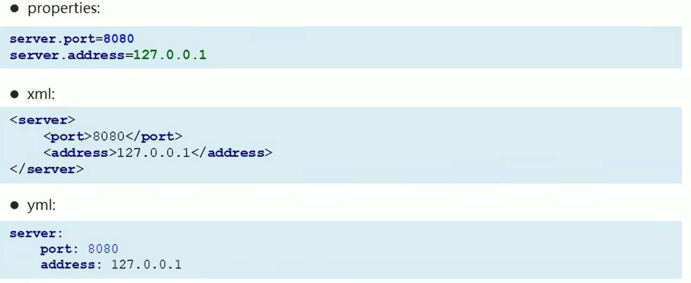

# `SpringBoot`

## 基本概念

2014年4月，`SpringBoot 1.0.0`发布，作为`Spring`的顶级项目之一

`SpringBoot`就是一种快速构建`Spring`项目的技术，在企业中应用广泛；在微服务的体系下，`SpringBoot`是一个不可或缺的技术

`SpringBoot`提供了一种快速使用`Spring`的方式，基于约定优于配置的思想（将`Spring`需要配置的内容配置好了），可以让开发人员不必在配置于逻辑业务之间进行思维的切换，集中精力投入到业务逻辑的代码编写，从而大大提高了开发的效率

`Spring`的缺点：

- 配置繁琐：虽然`Spring`的组件代码是轻量级的，但是它的配置确是重量级的。一开始，`Spring`用`XML`配置，而且是很多`XML`配置。`Spring2.5`引入了基于注解的组件扫描，消除了大量针对应用程序自身的显示`XML`配置。`Spring3.0`引入了基于`Java`的配置，是一种类型安全的可重构配置方式，代替了`XML`。但是，所有的这些配置都代表了开发时的损耗，导致在思考`Spring`特性配置和解决业务问题之间需要进行思维切换，挤占了编写应用程序逻辑的时间。总之，`Spring`实用，但它要求的回报也不少
- 依赖繁琐：项目的依赖管理是一件耗时耗力的事情，在环境搭建时，需要分析要导入哪些库的坐标，而且还需要分析导入与之有依赖关系的其他库坐标，一旦选错了依赖的版本，随之而来的不兼容问题就会严重阻碍项目的开发进度

`SpringBoot`的功能：

- 自动配置：`SpringBoot`的自动配置是一个运行时（更准确的说是一个应用程序启动时）的过程，考虑了众多因素，才决定`Spring`配置应该使用哪个，不该使用哪个，这个过程是`SpringBoot`自动完成的
- 起步依赖：起步依赖本质上是一个`Maven`项目对象模型（`Project Object Model`，`POM`），定义了对其他库的传递依赖，这些东西加在一起即支持某项功能，简单来说，起步依赖就是将具备某种功能的坐标打包到一起，并提供一些默认的功能（只需引入外面包裹的包即可）
- 辅助功能：提供了一些大型项目中常见的非功能性特性，如嵌入式服务器、安全、指标、健康监测和外部配置等

`SpringBoot`并不是对`Spring`进行功能上的增强，而是提供了一种快速使用`Spring`的方式


## 快速入门

快速的搭建`SpringBoot`的入门级工程，使用`SpringBoot`来构建`Spring`项目

需求：搭建`SpringBoot`工程，定义`HelloController.hello()`方法，返回`Hello SpringBoot`

***

### 传统方式构建`SpringBoot`工程

实现步骤：

1. 创建`Maven`项目

   打开`IDEA`，点击`File`-->`New`-->`Module`-->`Maven`-->`Next`

   在`GroupId`中输入：`com.jlc`；在`ArtifactId`中输入：`springboot-helloworld`；再点击`Next`

   在`Module name`中输入：`springboot-helloworld`；再点击`Finish`

2. 导入`SpringBoot`起步依赖

   ```xml
   <?xml version="1.0" encoding="UTF-8"?>
   <project xmlns="http://maven.apache.org/POM/4.0.0"
            xmlns:xsi="http://www.w3.org/2001/XMLSchema-instance"
            xsi:schemaLocation="http://maven.apache.org/POM/4.0.0 https://maven.apache.org/xsd/maven-4.0.0.xsd"> 
       <modelVersion>4.0.0</modelVersion>
       
       <groupId>com.jlc</groupId>
       <artifactId>springboot-helloworld</artifactId>
       <version>1.0.SNAPSHOT</version>
       
       <!--springboot工程需要继承的父工程-->
       <parent>
           <groupId>org.springframework.boot</groupId>
           <artifactId>spring-boot-starter-parent</artifactId>
           <version>2.1.8.RELEASE</version>
       </parent>
       
       <dependencies>
           <!--Web开发的起步依赖-->
           <dependency>
               <groupId>org.springframework.boot</groupId>
               <artifactId>spring-boot-starter-web</artifactId>
           </dependency>
       </dependencies> 
   </project>
   ```

3. 定义`Controller`

   在`src/main/java`中创建

   ```java
   package com.jlc.controller;
   
   import org.springframework.web.bind.annotation.RequestMapping;
   import org.springframework.web.bind.annotation.RestController;
   
   @RestController
   public class HelloController {
       @RequestMapping("/hello")
       public String hello() {
           return "Hello SpringBoot";
       }
   }
   ```

4. 编写引导类（引导类可以理解为`SpringBoot`项目的入口，其后缀一般都是`Application`结尾的）

   ```java
   package com.jlc;
   
   import org.springframework.boot.autoconfigure.SpringBootApplication;
   import org.springframework.boot.SpringApplication;
   
   @SpringBootApplication    // 编写引导类需要添加该注解
   public class HelloApplication {
       public static void main(String[] args) { // 后续运行SpringBoot项目直接运行main方法即可
           SpringApplication.run(HelloApplication.class, args);
       }
   }
   ```

5. 启动测试和访问

   在浏览器中输入：`localhost:8080/hello`进行访问，页面显示：`Hello SpringBoot`

小结：

- `SpringBoot`在创建项目时，使用`jar`的打包方式
- `SpringBoot`的引导类，是项目的入口，运行`main`方法就可以启动项目
- 使用`SpringBoot`和`Spring`构建项目，业务代码编写方式完全一样

***

### 使用`IDEA`快速构建`SpringBoot`工程

使用`IDEA`快速构建`SpringBoot`工程是需要进行网络连接的，在没有网络的情况下是不能构建的

定义`HelloController.hello()`方法，返回`Hello SpringBoot`

打开`IDEA`，点击`File`-->`New`-->`Module`-->`Spring Initializr`-->选择`SDK`（`JDK`）版本-->`Next`

在`Group`中输入：`com.jlc`；在`Artifact`中输入：`springboot-init`；在`Type`中选择`Maven Project`（表示选择的是`Maven`的项目）；在`Language`中选择`Java`；打包方式`Packaging`中选择：`jar`；`Java Version`中选择对应的版本，其他配置可以默认，最后点击`Next`

如果我们要做`Web`开发，我们选择`Web`，勾选相关的依赖：`Spring Web`-->`Next`

输入工程的名称，可以使用默认的-->`Finish`

通过`IDEA`快速构建`SpringBoot`工程，会从网络中下载相关的依赖，在`pom.xml`中会自动的引入相关的坐标

同时在`src/main/java/com/jlc/springbootinit`文件夹中，会自动创建相应的引导类（不需要我们进行手动的编写）：`SpringbootInitApplication`，其内容为：

```java
package com.jlc.springbootinit;

import org.springframework.boot.autoconfigure.SpringBootApplication;
import org.springframework.boot.SpringApplication;

@SpringBootApplication
public class SpringbootInitApplication {
    public static void main(String[] args) {
        SpringApplication.run(SpringbootInitApplication.class, args);
    }
}
```

我们只需要编写`Controller`文件即可：

```java
package com.jlc.springbootinit;

import org.springframework.web.bind.annotation.RequestMapping;
import org.springframework.web.bind.annotation.RestController;

@RestController
public class HelloController {
    @RequestMapping("/hello")
    public String hello() {
        return "Hello SpringBoot";
    }
}
```


## 起步依赖

`SpringBoot`起步依赖的原理分析：起步依赖可以简化`Maven`导入坐标的过程

`SpringBoot`有两个常见的起步依赖：（这两个起步依赖在使用`IDEA`快速构建`SpringBoot`工程是会自动配置）

1. `spring-boot-starter-parent`（`SpringBoot`工程要依赖的父工程）

   定义了各种技术的版本信息，组合了一套最优搭配的技术版本

   ```xml
   <parent>
       <groupId>org.springframework.boot</groupId>
       <artifactId>spring-boot-starter-parent</artifactId>
       <version>2.1.8.RELEASE</version>
       <relativePath/>
   </parent>
   ```

   我们可以跳转到依赖中，查看系统给我们定义了什么包（包含了一下技术的版本信息），同时定义了版本锁定，后续我们的子过程就会继承这些版本信息去使用，防止有些包的版本冲突

2. `spring-boot-starter-web`（包含了进行`Web`开发需要使用到的起步坐标）系统进行统一配置管理

   ```xml
   <dependency>
       <groupId>org.springframework.boot</groupId>
       <artifactId>spring-boot-starter-web</artifactId>
   </dependency>
   ```

   起步依赖具有依赖传递的特性，导入封装好的一个坐标，就可以使用该包内部封装的内容

在各种`starter`中，定义了完成该功能需要的坐标合集，其中大部分版本信息来自于父工程

我们的工程继承`parent`，引入`starter`后，通过依赖传递，就可以简单方便的获得需要的`jar`包，并不会存在版本冲突等问题


## 配置

`SpringBoot`是基于约定的，所以很多配置都有默认值，但如果想要使用自己的配置替换默认配置的话，可以使用`application.properties`或者`application.yml`（`application.yaml`）进行配置（配置文件名字是固定的）

`.properties`配置文件通过键值对的方式进行编写：（等号两边没有空格）

```properties
server.port=8080
```

`yml`编写配置文件的方式：（冒号和值之间是有空格的，如果不加空格，语法会报错）

```yaml
server:
  port: 8080
```

系统默认创建的配置文件是`application.properties`配置文件，在根目录`resources`文件夹下

我们可以在配置文件中修改系统定义的属性，如端口号`server.port`（默认值是8080）；也可以配置我们自定义的属性，如`name`属性，但是自定义的属性配置是不会被程序自动识别的，需要我们进行手动加载，从而读取配置

如果我们在`application.properties`、`application.yml`和`application.yaml`（这三个配置文件在同一级目录中都存在）配置文件中都配置了同样的内容，生效优先级从高到低依次是`.properties`、`.yml`和`.yaml`（当一个属性同时存在在这些配置文件中时，低优先级的属性将被忽略掉，不会进行识别配置）

***

### `YAML`

`YAML`是一种直观的能够被电脑直接识别的数据序列化格式（不是一个标记语言），并且容易被人类阅读，容易和脚本语言交互，可以支持`YAML`库的不同的编程语言程序导入。`YAML`文件是以数据为核心的，比传统的`xml`方式更加简洁

`YAML`文件的拓展名可以使用`.yml`或者`.yaml`

使用`YAML`文件进行内容的配置，和`xml`配置文件一样，能够体现具体的层级关系（但是写法上比`xml`文件简洁）



#### 基本语法

- 大小写敏感
- 数据值前面必须有空格，作为分隔符（否则该配置不会被识别）
- 使用缩进表示层级关系
- 缩进时不允许使用`Tab`键，只允许使用空格（各个系统`Tab`对应的空格数可能不同，导致层级混乱）
- 缩进的空格数目不重要，只要相同层级的元素左侧对齐即可
- `#`表示注释，从这个字符一直到行尾，都会被解析器忽略

#### 数据格式

`YAML`语法有三种可以使用的数据格式：

- 对象(`map`)：键值对的集合

  ```yaml
  person:
    name: jlc
  # 行内写法
  person: {name: jlc}
  ```

- 数组：一组按次序排列的值

  ```yaml
  address:
    - beijing
    - shanghai
  # 行内写法
  address: [beijing,shanghai]
  ```

- 纯量：单个的、不可再分的值

  ```yaml
  msg1: 'hello \n world'   # 单引号忽略转义字符  \n 会被原样的输出
  msg2: "hello \n world"   # 双引号识别转义字符  \n 被识别为换行  hello和world分两行输出
  ```


#### 参数引用

`YAML`文件中可以引用前面定义的参数，其引用方式为：

```yaml
name: lisi

person:
  name: ${name}   # 引用上边定义的name值
```

***

### 读取配置文件内容

给定一个配置文件：

```yaml
# 键值对
name: jlc

# 对象
person:
  name: xiaoming
  age: 25
  
# 数组
address:
  - beijing
  - shanghai
  
# 纯量
msg1: 'hello \n world'
```

`SpringBoot`为我们提供了三种读取配置文件的方式：

- `@Value`（通过注解方式进行配置文件内容的读取）

  ```java
  package com.jlc.springbootinit;
  
  import org.springframework.web.bind.annotation.RequestMapping;
  import org.springframework.web.bind.annotation.RestController;
  
  @RestController
  public class HelloController {
      // 读取配置文件内容
      // 键值对
      @Value("${name}")     // name要与配置文件中要读取内容的键一致
      private String name1;    // name的名称和配置文件中读取内容的键可以不同
      // 对象
      @Value("${person.name}")
      private String name2;
      // 数组
      @Value("${address[0]}")
      private String address;
      // 纯量
      @Value("${msg1}")
      private String msg1;
      
      @RequestMapping("/hello")
      public String hello() {
          System.out.println(name1);   // jlc
          System.out.println(name2);   // xiaoming
          System.out.println(address);   // beijing
          System.out.println(msg1);   // hello \n world
          return "Hello SpringBoot";
      }
  }
  ```

  使用`@Value`的方式获取配置文件的内容，还是比较繁琐的，不能一次性的获取所有配置信息（适合单个配置项内容的获取）

- `Environment`（通过注入环境对象，通过该对象的方法进行配置文件内容的读取）

  ```java
  package com.jlc.springbootinit;
  
  import org.springframework.web.bind.annotation.RequestMapping;
  import org.springframework.web.bind.annotation.RestController;
  import org.springframework.core.env.Environment;
  
  @RestController
  public class HelloController {
      // 读取配置文件内容
      @Autowired     // 在SpringBoot启动时，就会在Spring容器中初始化Environment环境对象
      private Environment env;
      
      @RequestMapping("/hello")
      public String hello() {
          System.out.println(env.getProperty("name"));   // jlc
          System.out.println(env.getProperty("person.name"));   // xiaoming
          System.out.println(env.getProperty("address[0]"));   // beijing
          System.out.println(env.getProperty("msg1"));   // hello \n world
          return "Hello SpringBoot";
      }
  }
  ```

  该方式只需注入一个对象，即可获取配置文件中的所有内容，更加简洁

- `@ConfigurationProperties`（通过注解，使配置文件的内容和对象进行一个绑定映射）

  定义一个`Person`类：

  ```java
  package com.jlc.springbootinit;
  
  import org.springframework.stereotype.Component;
  
  
  @Component    // 该注解表示下面的Person类可以被Spring识别，是一个Bean
  @ConfigurationProperties(prefix = "person")   // 会将配置文件中person中对应的属性值注入到当前类中，实现绑定映射
  public class Person {
      private String name;
      private int age;
      
      public String getName() { return name; }
      public void setName(String name) { this.name = name; }
      
      public int getAge() { return age; }
      public void setAge(int age) { this.age = age; }
  }
  ```

  测试配置文件的读取：

  ```java
  package com.jlc.springbootinit;
  
  import org.springframework.web.bind.annotation.RequestMapping;
  import org.springframework.web.bind.annotation.RestController;
  import org.springframework.core.env.Environment;
  
  @RestController
  public class HelloController {
      // 读取配置文件内容
      @Autowired
      private Person person;   // 实例化person对象，该对象与配置文件实现了映射绑定
      
      @RequestMapping("/hello")
      public String hello() {
          System.out.println(person);   // Person{name='xiaoming', age=25}
          return "Hello SpringBoot";
      }
  }
  ```

  使用``@ConfigurationProperties``注解如果出现：`Spring Boot Configuration Annotation Processor not fount in classpath`的警告，我们可以在`pom.xml`配置文件中加上：

  ```xml
  <dependency>
      <groupId>org.springframework.boot</groupId>
      <artifactId>spring-boot-configuration-processor</artifactId>
      <optional>true</optional>
  </dependency>
  ```

  加上上述配置，我们在配置文件中编写映射绑定的对象，会有属性的提示

***

### `profile`

在我们开发`SpringBoot`应用时，通常同一套程序会被安装到不同的环境下，如：开发、测试和生产等。其中数据库地址、服务器端口等配置往往是不同的，如果每次打包时，都要修改配置文件，那么是比较麻烦的。

`profile`功能就是来进行动态配置切换的

#### 配置方式

##### 多`profile`文件方式

一般使用`application-dev.properties`表示开发环境下的配置文件：

```properties
server.port=8081
```

使用`application-test.properties`表示测试环境下的配置文件：

```properties
server.port=8082
```

使用`application-pro.properties`表示生产环境下的配置文件：

```properties
server.port=8083
```

当我们没有去激活任意一个配置文件的配置，系统使用的是默认的端口8080

我们需要使用配置的方式去激活不同环境下的配置文件，在`application.properties`主配置文件中进行激活：

```properties
spring.profiles.active=dev    // 激活开发环境的配置文件
```

这时，运行程序，使用的端口就是在开发环境中配置的端口号8081

##### `yml`多文档方式

使用多`profile`文件方式进行配置的切换需要写不同的配置文件，使用`yml`多文档方式进行配置只需写一个配置文件，将不同环境的配置划分到不同的部分即可（使用`---`进行分割），创建`application.yml`配置文件

```yaml
---
server:
  port: 8081 
spring:
  profiles: dev
---
server:
  port: 8082
spring:
  profiles: test
---
server:
  port: 8083
spring:
  profiles: pro
  
---
spring:
  profiles:
    active: pro    # 激活具体的环境配置
```

#### 激活方式

##### 配置文件

`.properties`配置文件的激活方式为：`spring.profiles.active=dev`

`.yaml`配置文件的激活方式为：

```yaml
spring:
  profiles:
    active: pro    # 激活具体的环境配置
```

##### 虚拟机和命令行参数

但是通过配置文件的方式进行激活，在部署的时候，还是需要对配置文件进行修改，也是不方便的

我们可以通过虚拟机或者命令行参数来指定外部的参数

点击`IDEA`左上角的`SpringbootProfilesApplication`，选择`Edit Configurations...`

- `VM options`表示虚拟机参数，在虚拟机参数中指定：`-Dspring.profiles.active=test`（指定使用测试环境的配置）
- `Program arguments`表示命令行参数，在命令行参数中指定：`--spring.profiles.active=test`（指定使用测试环境的配置）

使用虚拟机或者命令行参数进行配置文件的生效，使用其一种方法即可

使用命令行参数，我们可以在命令行中启动`SpringBoot`程序运行的时候，指定具体的配置环境，而不需要配置文件的激活方式，在命令行输入：

```txt
java -jar .\springboot-profiles-0.0.1-SNAPSHOT.jar --spring.profiles.active=test
```

***

### 配置加载顺序

`SpringBoot`允许我们在项目的内部进行配置文件的编写，也允许我们将配置内容写到项目的外边进行配置（如命令行参数进行配置）

#### 内部配置的加载顺序

`Springboot`程序启动时，会依次从以下位置加载配置文件（优先级从高到低为）：

1. `file:./config/`：当前项目下的`/config`目录下
2. `file:./`：当前项目的根目录
3. `classpath:/config/`：`classpath`的`/config`目录
4. `classpath:/`：`classpath`的根目录（`resources`和`java`文件夹在打包后会在`classpath`根目录下）

高优先级配置的属性会覆盖低优先级配置的属性

```java
config
    ├──application.properties  // 优先级1
application.properties   // 优先级2
springboot-config
├──src
│   ├── main
│   │   └── java 
│   │   └── resources
│   │       ├── config  
│   │       │   ├── application.properties   // 优先级3
│   │       ├── application.properties  // 优先级4
├──pom.xml
```

虽然相同的配置可能被覆盖，但是不同优先级的配置文件都会被加载

方式1和方式2的配置文件在`SpringBoot`项目打包后，是不会打包到具体的`jar`包中的，运行`jar`包是不会识别上述两种配置的（如果需要识别，我们需要复制这个配置文件，放到与打包后的`springboot-profiles-0.0.1-SNAPSHOT.jar`文件的同级目录（或者在这个同级目录中创建一个`config`文件夹，在文件夹中放置配置文件），那么在运行的时候，就会自动的读取放入的配置文件的内容）

#### 外部配置的加载顺序

外部的配置和内部的配置之间形成了一种互补的关系：如当前的项目已经写完了，并且打包好了，但是我们发现有一个配置编写错了，这个时候，我们就可以通过外部的配置进行覆盖内部的某些配置

加载外部配置的方式有很多，详细可以查看官网，常用的外部配置加载方式有（按照加载优先级从高到低为）：

1. 通过命令行参数配置：通过命令行配置修改具体的端口

   ```java
   java -jar .\springboot-profiles-0.0.1-SNAPSHOT.jar --server.port=8082
   ```

   通过命令行配置可以一次性接着配置多个需要配置的内容，但是对于太多的配置内容，我们可以在外部写一个配置文件，通过命令行的方式指定这个配置文件的路径，从而读取文件中的配置信息

   简单编写一个配置文件：一般使用`application.properties`：

   ```properties
   server.port=8081
   ...
   ```

   通过命令行读取配置文件，并加载配置：

   ```java
   java -jar .\springboot-profiles-0.0.1-SNAPSHOT.jar --spring.config.location=d://application.properties
   ```

2. 内部配置文件读取的方式1在`SpringBoot`项目打包后，是不会打包到具体的`jar`包中的，运行`jar`包是不会识别配置的（如果需要识别，我们需要在打包后的`springboot-profiles-0.0.1-SNAPSHOT.jar`文件的同级目录中创建一个`config`文件夹，在文件夹中放置配置文件，那么在运行的时候，就会自动的读取放入的配置文件的内容）

3. 内部配置文件读取的方式2在`SpringBoot`项目打包后，是不会打包到具体的`jar`包中的，运行`jar`包是不会识别配置的（如果需要识别，我们需要复制这个配置文件，放到与打包后的`springboot-profiles-0.0.1-SNAPSHOT.jar`文件的同级目录，那么在运行的时候，就会自动的读取放入的配置文件的内容）


## 整合其他框架

`SpringBoot`提供了起步依赖，方便导入坐标，因此能够非常方便的去整合其他的第三方框架

#### 整合`Junit`

`SpringBoot`整合`Junit`来提供单元测试，基本步骤：

1. 搭建`SpringBoot`工程

2. 引入`starter-test`起步依赖（创建`SpringBoot`工程会自动的写入该起步依赖）

3. 编写测试类

   在`src/main/java`文件夹中编写相关的测试类：

   ```java
   package com.jlc.springboottest;
   
   import org.springframework.stereotype.Service;
   
   @Service
   public class UserService {
       public void add() {
           System.out.println("add...");
       }
   }
   ```

4. 编写测试方法

5. 添加测试相关的注解

   对于测试用例，我们在`src/test/java`文件中进行编写：

   ```java
   package com.jlc.test;
   
   import com.jlc.springboottest.SpringbootTestApplication;
   import org.junit.runner.RunWith;
   import org.springframework.boot.test.context.SpringBootTest;
   import org.springframework.test.context.junit4.SpringRunner;
   import com.jlc.springboottest.UserService;
   
   // UserService的测试类
   @RunWith(SpringRunner.class)
   @SpringBootTest(classes = SpringbootTestApplication.class)
   public class UserServiceTest {
       @Autowired
       private UserService userService;
       
       @Test
       public void testAdd() {
           userService.add();
       }
   }
   ```

   > 如果当前测试用例所在的包，是其引导类`src/main/java/com.jlc.springboottest.SpringbootTestApplication`所在的包`com.jlc.springboottest`的子包（或者包名相同），那么测试用例的代码可以修改为：
   >
   > ```java
   > package com.jlc.springboottest;
   > 
   > import org.junit.runner.RunWith;
   > import org.springframework.boot.test.context.SpringBootTest;
   > import org.springframework.test.context.junit4.SpringRunner;
   > import com.jlc.springboottest.UserService;
   > 
   > // UserService的测试类
   > @RunWith(SpringRunner.class)
   > @SpringBootTest
   > public class UserServiceTest {
   >     @Autowired
   >     private UserService userService;
   >     
   >     @Test
   >     public void testAdd() {
   >         userService.add();
   >     }
   > }
   > ```

#### 整合`Redis`

`SpringBoot`整合`Redis`的基本步骤：

1. 搭建`SpringBoot`工程

   要勾选`NoSQL`中的`Spring Data Redis (Access+Driver)`

2. 引入`redis`起步依赖（勾选`NoSQL`中的`Spring Data Redis (Access+Driver)`后会自动引入）

   具体的引入内容为：

   ```xml
   <dependency>
       <groupId>org.springframework.boot</groupId>
       <artifactId>spring-boot-starter-data-redis</artifactId>
   </dependency>
   ```

3. 配置`Redis`相关属性（只有本机的`Redis`才可以不进行配置（`Redis`的连接信息默认的就是本机的`Ip`））

   在实际的开发中，一定时需要外置的`Redis`，因此，我们需要进行相应的配置

   在配置文件`application.yml`文件中进行如下的配置：

   ```yaml
   spring:
     redis:
       host: 127.0.0.1   # redis的主机Ip，后续修改成对应的Ip即可
       port: 6379   # redis的端口号，后续修改成对应的即可
   ```

4. 注入`RedisTemplate`模板

5. 编写测试方法，测试

   在`src/test/java`中创建一个测试类：

   ```java
   package com.jlc.springbootredis;
   
   import org.junit.runner.RunWith;
   import org.springframework.boot.test.context.SpringBootTest;
   
   @RunWith(SpringRunner.class)
   @SpringBootTest
   public class SpringbootRedisApplicationTests {
       @Autowired
       private RedisTemplate redisTemplate;   // 注入RedisTemplate模板
       
       @Test
       public void testSet() {
           // 存入数据
           redisTemplate.boundValueOps("name").set("jlc");
       }
       
       @Test
       public void getSet() {
           // 获取数据
           Object name = redisTemplate.boundValueOps("name").get();
           System.out.println(name);
       }
   }
   ```

#### 整合`MyBatis`

`SpringBoot`整合`MyBatis`的基本步骤：

1. 搭建`SpringBoot`工程

   勾选对应的依赖：`SQL`中的`MyBatis Framework`和`MySQL Driver`

2. 引入`mybatis`起步依赖，添加`mysql`驱动（搭建`SpringBoot`工程勾选对应的依赖后就会自动创建）

   `mybatis`起步依赖的内容为：

   ```xml
   <dependency>
       <groupId>org.mybatis.spring.boot</groupId>
       <artifactId>mybatis-spring-boot-starter</artifactId>
       <version>2.1.0</version>
   </dependency>
   ```

   `mysql`的驱动也会自动的添加，其内容为：

   ```xml
   <dependency>
   	<groupId>mysql</groupId>
       <artifactId>mysql-connector-java</artifactId>
       <scope>runtime</scope>   <!--表示驱动在运行时生效，可以注释掉，使编译时也生效-->
   </dependency>
   ```

3. 定义表和实体类

   定义一张`User`数据表

   编写实体类：

   ```java
   package com.jlc.springbootmybatis.domain;
   
   public class User {
       private int id;
       private String username;
       private String password;
       
       public int getId() { return id; }
       public void setId(int id) { this.id = id; }
       
       public String getUsername() { return username; }
       public void setUsername(String username) { this.username = username; }
       
       public String getPassword() { return password; }
       public void setPassword(String password) { this.password = password; }
   }
   ```

4. 编写`DataSource`和`MyBatis`相关配置（使用注解开发就不需要配置`MyBatis`的相关配置）

   在配置文件`application.yml`文件中进行如下的配置：

   ```yaml
   # DataSource的配置
   spring:
     datasource:
       # ///表示省略了用户名，Ip和端口，因为是连接的本地的，myMysql表示数据库的名称，后面需要配置时区信息
       url: jdbc:mysql:///myMysql?serverTimezone=UTC    
       username: root
       password: root
       driver-class-name: com.mysql.cj.jdbc.Driver
   ```

5. 编写`dao`/`mapper`文件/纯注解开发

   - 使用`xml`方式进行开发

     编写`mapper`层内容（在`src/main/java`文件夹下）

     ```java
     package com.jlc.springbootmybatis.mapper;
     
     import com.jlc.springbootmybatis.domain.User;
     import org.apache.ibatis.annotations.Mapper;
     import org.springframework.sterotype.Repository;
     import java.util.List;
     
     @Mapper
     @Repository
     public interface UserXmlMapper {
         
         public List<User> findAll();
     }
     ```

     在`resources`中创建`mapper`文件夹，用于存放我们的映射文件，创建：`UserMapper.xml`

     ```xml
     <?xml version="1.0" encoding="UTF-8"?>
     <!DOCTYPE mapper PUBLIC "-//mybatis.org//DTD Mapper 3.0//EN" "http://mybatis.org/dtd/mybatis-3-mapper.dtd">
     
     <!--具体的配置-->
     <mapper namespace="com.jlc.springbootmybatis.mapper.UserXmlMapper">   
         <select id="findAll" resultType="user">
         	select * from user
         </select>
     </mapper>
     ```

     使用`xml`方式开发，需要在配置文件中加入`MyBatis`的相关配置

     ```yaml
     # MyBatis的配置
     mybatis:
       mapper-location: classpath: classpath:mapper/*Mapper.xml  # 指定映射文件路径
       type-aliases-package: com.jlc.springbootmybatis.domain.User  # 通过包扫描配置别名
       # config-Location:    # 指定mybatis的核心配置文件
     ```

   - 使用注解开发

     编写`mapper`层内容（在`src/main/java`文件夹下）

     ```java
     package com.jlc.springbootmybatis.mapper;
     
     import com.jlc.springbootmybatis.domain.User;
     import org.apache.ibatis.annotations.Mapper;
     import org.apache.ibatis.annotations.Select;
     import org.springframework.sterotype.Repository;
     import java.util.List;
     
     @Mapper
     @Repository
     public interface UserMapper {
         @Select("select * from user")
         public List<User> findAll();
     }
     ```

6. 测试

   注入对应的测试方法：

   ```java
   package com.jlc.springbootmybatis;
   
   import org.junit.runner.RunWith;
   import org.springframework.boot.test.context.SpringBootTest;
   import org.springframework.test.context.junit4.SpringRunner;
   import com.jlc.springbootmybatis.mapper.UserMapper;
   import com.jlc.springbootmybatis.domain.User;
   import java.util.List;
   
   // UserMapper的测试类
   @RunWith(SpringRunner.class)
   @SpringBootTest
   public class SpringbootMybatisApplicationTests {
       @Autowired
       private UserMapper userMapper;
       
       @Autowired
       private UserXmlMapper userXmlMapper;
       
       @Test
       public void testXmlFindAll() {
           List<User> list = userXmlMapper.findAll();
           System.out.println(list);
       }
       
       @Test
       public void testFindAll() {
           List<User> list = userMapper.findAll();
           System.out.println(list);
       }
   }
   ```

   

实现自动配置，不需要我们进行手动的编写相应的`xml`配置文件
