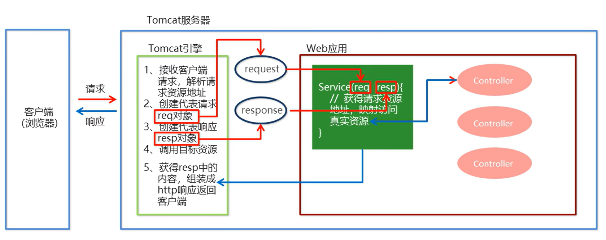
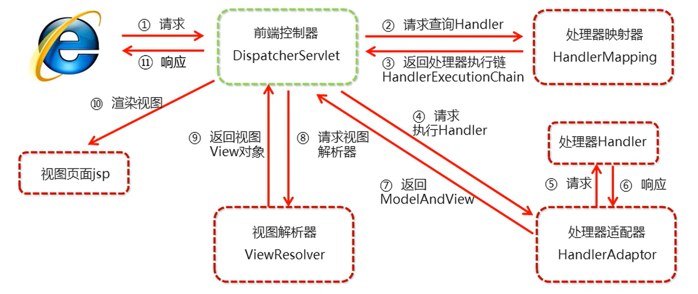
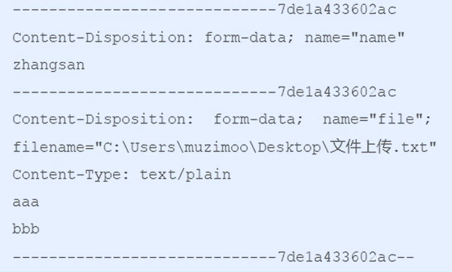
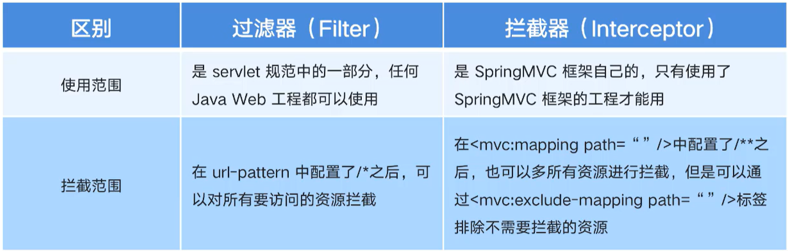
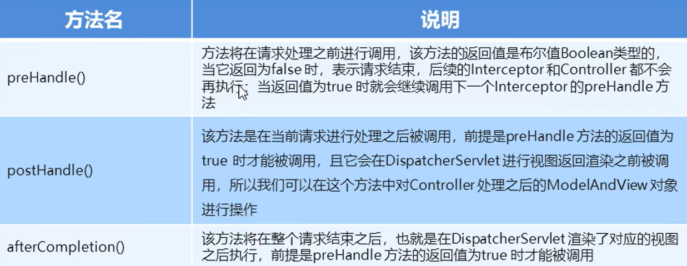
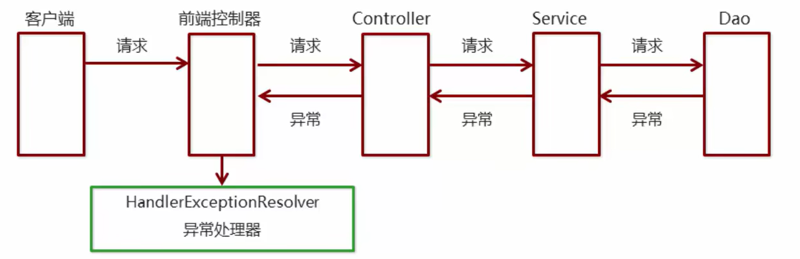

# `SpringMVC`

## 基本概念

`SpringMVC`是一种基于`Java`实现的`MVC`设计模型（`M`：模型，主要用于数据封装和业务逻辑处理；`V`：视图，主要用于数据的展示；`C`：控制器，主要用于分发指派工作）的请求驱动类型的轻量级`Web`框架，属于`SpringFrameWork`的后续产品，已经融合在`Spring Web Flow`中

`SpringMVC`已经成为目前最主流的`MVC`框架之一，并且随着`Spring3.0`的发布，全面超越`Struts2`，成为最优秀的`MVC`框架。它通过一套完善的注解机制，让一个简单的`Java`类成为处理请求的控制器，而无须实现任何接口。同时它还支持`RESTful`编程风格的请求

对于`Web`层，在实际开发中，会出现很多的`Servlet`，用于处理不同功能的`Web`实现。对于每一个`Servlet`，其执行的行为有很多都是一致的（重复的）（一般情况下`Servlet`其内部执行的动作为接收请求参数、封装实体、访问业务层、接收返回结果和指派页面等），对于一致的行为，我们需要对其进行功能的抽取，让一个组件去完成这些通用共有行为的操作（`Web`层相应的框架去完成），同时，具体`Web`层的组件去完成一些特有的行为操作

`SpringMVC`流程图：



`SpringMVC`的基本开发步骤：

1. 导入`SpringMVC`相关坐标
2. 配置`SpringMVC`核心控制器`DispathcerServlet`，每个请求都要通过共有行为的前端控制器
3. 编写`POJO`（即控制器`Controller`，内部负责调用业务层，指派视图等）和视图页面
4. 将`Controller`使用注解（`@Controller`）配置到`Spring`容器中（业务方法的映射地址）
5. 配置`spring-mvc.xml`文件（`SpringMVC`核心文件），主要配置组件扫描
6. 执行访问测试（客户端发起请求）


## 快速入门

需求：客户端发起请求，服务器端接收请求，执行逻辑并进行视图跳转

1. 在`pom.xml`中额外导入`SpringMVC`相关坐标

   ```xml
   <dependency>
       <groupId>org.springframework</groupId>
       <artifactId>spring-webmvc</artifactId>
       <version>5.0.5.RELEASE</version>
   </dependency>
   ```

2. 在`web.xml`额外配置`SpringMVC`的前端控制器

   ```xml
   <?xml version="1.0" encoding="UTF-8"?>
   <web-app version="3.0" 
       xmlns="http://java.sun.com/xml/ns/javaee" 
       xmlns:xsi="http://www.w3.org/2001/XMLSchema-instance"
       xsi:schemaLocation="http://java.sun.com/xml/ns/j2ee 
           http://java.sun.com/xml/ns/j2ee/web-app_2_4.xsd">
   	<!--配置SpringMVC的前端控制器-->
       <servlet>
           <servlet-name>DispatcherServlet</servlet-name>
           <servlet-class>org.springframework.web.servlet.DispatcherServlet</servlet-class>
           <load-on-startup>1</load-on-startup>   <!--服务器启动的时候，就创建对象，如果不配置，则为第一次访问的时候加载对象-->
       </servlet>
       <!--配置映射地址-->
       <servlet-mapping>
           <servlet-name>DispatcherServlet</servlet-name>
           <url-pattern>/</url-pattern>  <!--每次在请求时，都要经过这个部分-->
       </servlet-mapping>
   </web-app>
   ```

3. 编写`Controller`和视图页面

4. 将`Controller`使用注解（`@Controller`）配置到`Spring`容器中（业务方法的映射地址）

   在`com.jlc`中创建一个包`controller`（在使用`SpringMVC`时，`Web`层的包一般都是`controller`）

   在包中创建`UserController`

   ```java
   package com.jlc.controller;
   
   import org.springframework.stereotype.Controller;
   
   @Controller   // 放到Spring容器中
   public class UserController {
       @RequestMapping("/quick")  // 请求映射，访问/quick时，就会映射到save()方法
       public String save() {
           System.out.println("Controller save running");
           return "success.jsp";   // 跳转到具体的视图
       }
   }
   ```

   具体的视图在`webapp`文件夹中进行创建，如创建`success.jsp`

   ```jsp
   <%@page contentType="text/html;charset=UTF-8" language="java" %>
   <html>
   <head>
       <title>Title</title>
   </head>
   <body>
       <h1>Success!</h1>
   </body>
   </html>
   ```

5. 配置`spring-mvc.xml`文件（`SpringMVC`核心文件），主要配置组件扫描

   在`resources`文件夹中创建`spring-mvc.xml`配置文件

   ```xml
   <?xml version="1.0" encoding="UTF-8"?>
   <beans xmlns="http://www.springframework.org/schema/beans"
   xmlns:xsi="http://www.w3.org/2001/XMLSchema-instance"
   xmlns:context="http://www.springframework.org/schema/context"
   xsi:schemaLocation="http://www.springframework.org/schema/beans
   http://www.springframework.org/schema/beans/spring-beans.xsd
   http://www.springframework.org/schema/context
   http://www.springframework.org/schema/context/spring-context.xsd">
       
   	<!-- Controller的组件扫描 -->
       <context:component-scan base-package="com.jlc.controller"/>
       
   </beans>
   ```

   同时对`web.xml`额外配置`SpringMVC`的前端控制器进行修改，告知配置文件的位置

   ```xml
   <!--配置SpringMVC的前端控制器-->
       <servlet>
           <servlet-name>DispatcherServlet</servlet-name>
           <servlet-class>org.springframework.web.servlet.DispatcherServlet</servlet-class>
           <init-param>   <!--加载spring-mvc.xml配置文件-->
               <param-name>contextConfigLocation</param-name>
               <param-value>classpath:spring-mvc.xml</param-value>
           </init-param>
           <load-on-startup>1</load-on-startup>   
       </servlet>
   ```

6. 执行访问测试（客户端发起请求）

   在浏览器中输入`localhost:8080/quick`，回车，页面中会出现`Success!`

   同时，终端会打印`Controller save running`


## `XML`配置解析

`SpringMVC`的`XML`配置文件的解析，该配置文件除了可以配置组件扫描外，还可以配置其他的内容：

```xml
<?xml version="1.0" encoding="UTF-8"?>
<beans xmlns="http://www.springframework.org/schema/beans"
xmlns:xsi="http://www.w3.org/2001/XMLSchema-instance"
xmlns:context="http://www.springframework.org/schema/context"
xsi:schemaLocation="http://www.springframework.org/schema/beans
http://www.springframework.org/schema/beans/spring-beans.xsd
http://www.springframework.org/schema/context
http://www.springframework.org/schema/context/spring-context.xsd">
    
	<!-- Controller的组件扫描 -->
    <context:component-scan base-package="com.jlc.controller"/>
    
</beans>
```

> 注解的使用需要配置组件扫描，扫描指定的包
>
> `Spring`和`SpringMVC`要各自扫描各自层的包，`SpringMVC`主要扫描的是`Web`（`Controller`）层的包，其他层的包由`Spring`去进行扫描
>
> ```xml
>  <!--扫描方式也可以改写为-->
> <context:component-scan base-package="com.jlc">
>     <context:include-filter type="annotation" expression="org.springframework.stereotype.Controller">
> </context:component-scan>
> ```
>
> `context:include-filter`表示包括（只扫描）；`context:exclude-filter`表示排除（不扫描）

***

### 配置内部资源视图解析器

```xml
<?xml version="1.0" encoding="UTF-8"?>
<beans xmlns="http://www.springframework.org/schema/beans"
xmlns:xsi="http://www.w3.org/2001/XMLSchema-instance"
xmlns:context="http://www.springframework.org/schema/context"
xsi:schemaLocation="http://www.springframework.org/schema/beans
http://www.springframework.org/schema/beans/spring-beans.xsd
http://www.springframework.org/schema/context
http://www.springframework.org/schema/context/spring-context.xsd">
    
	<!-- 配置内部资源视图解析器，配置其前缀和后缀 -->
    <bean id="viewResolver" class="org.springframework.web.servlet.view.InternalResourceViewResolver">
        <property name="prefix" value="/jsp/"></property>
        <property name="suffix" value=".jsp"></property>
    </bean>
    
</beans>
```

> 配置完内部资源视图解析器后，我们进行视图跳转时，就可以不需要写前缀和后缀了，直接写视图的文件名
>
> ```java
> @Controller   // 放到Spring容器中
> @RequestMapping("/new")
> public class UserController {
>     @RequestMapping("/quick")  // 请求映射，访问/quick时，就会映射到save()方法
>     public String save() {
>         System.out.println("Controller save running");
>         return "success";
>     }
> }
> ```


## 组件解析

`SpringMVC`底层的组件是如何进行实现的，我们需要对组件进行解析

在`SpringMVC`框架的内部，很多功能都由对应的组件帮助我们去完成（组件间分工明确）

`SpringMVC`的执行流程图：



1. 用户发送请求至前端控制器`DispatcherServlet`（该前端控制器主要负责调度，进行相应的组件调用）
2. `DispatcherServlet`收到请求调用`HandlerMapping`处理器映射器（该组件用于找资源，解析资源，对请求进行解析，最终具体找哪个，返回处理器执行链，返回的是一串资源的地址，内部封装了具体资源执行的顺序）
3. 处理器映射器找到具体的处理器（可以根据`xml`配置、注解进行查找），生成处理器对象及处理器拦截器（如果有则生成）一并返回给`DispatcherServlet`
4. `DispatcherServlet`调用`HandlerAdapter`处理器适配器（前端控制器拿到返回的处理器执行链后，调用处理器适配器，让其处理调用哪些要被执行的资源）
5. `HandlerAdapter`经过适配器调用具体的处理器（`Controller`，也叫后端控制器，一般是我们自己写的资源封装的对象）
6. `Controller`执行完返回`ModelAndView`（模型和视图对象）
7. `HandlerAdapter`（处理器适配器）将`controller`执行结果`ModelAndView`返回给`DispatcherServlet`（前端控制器）
8. `DispatcherServlet`将`ModelAndView`传给`ViewReslover`视图解析器（从`ModelAndView`中将视图`View`对象解析出来）
9. `ViewReslover`解析后返回具体的`View`
10. `DispatcherServlet`根据`View`进行渲染视图（即将模型数据填充至视图中），`DispatcherServlet`响应用户


## 注解解析

对应`SpringMVC`中的注解进行解析

***

### `@RequestMapping`

`@RequestMapping`：请求映射到具体的某个方法上（虚拟地址映射）

作用：用于建立请求`URL`和处理器请求方法之间的对应关系（对请求的虚拟地址进行映射到具体的某个方法上）

使用位置：

- 在类上，请求`URL`的第一级访问目录，此处不写的话，就相当于应用的根目录

- 在方法上，请求`URL`的第二级访问目录，与类上的使用`@RequestMapping`标注的一级目录一起组成访问虚拟路径

  ```java
  @Controller   // 放到Spring容器中
  @RequestMapping("/new")
  public class UserController {
      @RequestMapping("/quick")  // 请求映射，访问/quick时，就会映射到save()方法
      public String save() {
          System.out.println("Controller save running");
          return "/success.jsp";   // 跳转到具体的视图，使用的是相对地址，加上/表示从Webapp文件夹下找具体的.jsp资源
      }
  }
  ```

  > 此时的访问地址为`http://loacalhost:8080/new/quick`

属性：`@RequestMapping`的具体属性参数有：

- `value`：用于指定请求的`URL`，它和`path`属性的作用是一样的

  如：`@RequestMapping(value="/quick")`，只写一个`value`属性，`value`可以省略

- `method`：用于指定请求的方式

  如：`@RequestMapping(value="/quick", method=RequestMethod.POST)`

  当前请求方式必须是`POST`的请求方式才能访问到

- `params`：用于指定限制请求参数的条件，它支持简单的表达式，要求参数请求的`key` 和`value`必须和配置的一样

  如：`params={"accountName"}`：表示请求参数必须有`accountName`

  `params={"money!100"}`：表示请求参数中`money`不能是100

***

### `@ResponseBody`

`@ResponseBody`注解用于告知`SpringMVC`框架，其方法返回的字符串不是用于页面视图的跳转，而是直接在`http`响应体中返回，用于回写数据使用

```java
@RequestMapping("/quick2")  // 请求映射，访问/quick2时，就会映射到save()方法
@ResponseBody // 告知SpringMVC框架，其方法返回的字符串不是跳转，而是直接在http响应体中返回
public String quickMethod() throws IOException {
    return "hello world";
}
```

***

### `@RequestBody`

`@RequestBody`表示将请求体的内容，直接封装到后面对应的集合中

```java
@RequestMapping("/quick")
@ResponseBody
public Void quickMethod(@RequestBody List<User> userList) throws IOException {
    System.out.println(userList);  // [User{username='jlc', age=25}, User{username='lisi', age=20}]
}
```

***

### `@RequestParam`

`@RequestParam`是一个绑定参数注解

当请求的参数名称与`Controller`的业务方法参数名称不一致时，就需要通过`@RequestParam`注解显示绑定与形参的关系：

```java
@RequestMapping("/quick")
@ResponseBody
public Void quickMethod(@RequestParam(value="name") String username) throws IOException {
    System.out.println(username);   // jlc
}
```

> 将请求的`name`参数，映射到对应的`username`参数，如果`@RequestParam()`只有一个参数时，`value`可以省略

在浏览器地址栏输入`http://localhost:8080/quick?name=jlc`

注解`@RequestParam`有如下的参数可以进行使用：

- `value`：与请求参数名称
- `required`：指定的请求是否必须包括参数，默认是`true`，提交时如果没有此参数则报错
- `defaultValue`：当没有指定请求参数时，则使用指定的默认值

```java
@RequestMapping("/quick")
@ResponseBody
public Void quickMethod(@RequestParam(value="name",required=false, defaultValue="jlc") String username) throws IOException {
    System.out.println(username);   // jlc
}
```

***

### `@PathVariavle`

使用`@PathVariavle`注解进行占位符的匹配获取工作

对应客户端浏览器输入的地址：`http://localhost:8080/quick/jlc`

获取`Restful`风格的参数：

```java
@RequestMapping("/quick/{name}")   // {name}是占位的，获取请求地址的对应内容
@ResponseBody
public Void quickMethod(@PathVariavle(value="name", required=true) String name) throws IOException {
    System.out.println(name);  // jlc
}
```

> `@PathVariavle(value="name", required=true)`中的`name`要和`@RequestMapping("/quick/{name}")`中的`name`一致

***

### `@RequestHeader`

`@RequestHeader`注解就可以获取请求头数据，该注解的属性有：

- `value`：请求头的名称
- `required`：是否必须携带此请求头

```java
@RequestMapping("/quick")
@ResponseBody
public Void quickMethod(@RequestHeader(value="User-Agent", required=false) String headerValue) throws IOException {
    System.out.println(headerValue);
}
```

> 请求头中的`User-Agent`表示当前客户端浏览器的信息

***

### `@CookieValue`

`@CookieValue`注解获取请求头中的`Cookie`的值（`session`的一种标识，其值一般是一个键值对`JSESSIONID=xxxxxx`），`@CookieValue`注解的属性如下：

- `value`：指定`cookie`的名称
- `required`：是否必须携带此`cookie`

```java
@RequestMapping("/quick")
@ResponseBody
public Void quickMethod(@CookieValue(value="JSESSIONID", required=false) String jsessionid) throws IOException {
    System.out.println(jsessionid);
}
```


## 数据响应

`SpringMVC`的数据响应方式可以分为：

- 页面跳转
  - 直接返回字符串，如`return "/success.jsp";`，跳转到`success.jsp`页面
  - 通过`ModelAndView`对象返回
- 回写数据
  - 直接返回字符串
  - 返回对象或集合

***

### 页面跳转

页面跳转有两种方式：直接返回字符串和通过`ModelAndView`对象返回

#### 直接返回字符串

页面跳转中直接返回字符串的方式：将返回的字符串与视图解析器的前后缀拼接后跳转

配置内部资源视图解析器

```xml
<?xml version="1.0" encoding="UTF-8"?>
<beans xmlns="http://www.springframework.org/schema/beans"
xmlns:xsi="http://www.w3.org/2001/XMLSchema-instance"
xmlns:context="http://www.springframework.org/schema/context"
xsi:schemaLocation="http://www.springframework.org/schema/beans
http://www.springframework.org/schema/beans/spring-beans.xsd
http://www.springframework.org/schema/context
http://www.springframework.org/schema/context/spring-context.xsd">
    
	<!-- 配置内部资源视图解析器，配置其前缀和后缀 -->
    <bean id="viewResolver" class="org.springframework.web.servlet.view.InternalResourceViewResolver">
        <property name="prefix" value="/jsp/"></property>
        <property name="suffix" value=".jsp"></property>
    </bean>
    
</beans>
```

配置完内部资源视图解析器后，我们进行视图跳转时，就可以不需要写前缀和后缀了，直接写视图的文件名

```java
@Controller   // 放到Spring容器中
public class UserController {
    @RequestMapping("/quick")  // 请求映射，访问/quick时，就会映射到save()方法
    public String save() {
        System.out.println("Controller save running");
        return "success";
    }
}
```

最终的转发地址：`/jsp/success.jsp`

返回带有前缀的字符串：

- 转发：`forward:/jsp/success.jsp`（`forward:`可以不写）
- 重定向：`redirect:/success.jsp`（重定向表示客户端再次访问请求，要想重定向，资源必须处于一个可以被访问的位置，即有访问权限）

#### 返回`ModelAndView`对象

`ModelAndView`对象中主要涉及两个方面：

- `Model`：模型，作用是封装数据
- `View`：视图，作用是展示数据

```java
import org.springframework.web.servlet.ModelAndView;

@Controller   // 放到Spring容器中
public class UserController {
    // 返回ModelAndView对象写法一
    @RequestMapping("/quick2")  // 请求映射，访问/quick2时，就会映射到save()方法
    public ModelAndView save() {
        ModelAndView modelAndView = new ModelAndView();
        // 设置模型数据，以键值对的形式存放，放到request域中
        modelAndView.addObject("username", "jlc");
        // 设置视图名称
        modelAndView.setViewName("success");
        return modelAndView;
    }
    // 返回ModelAndView对象写法二
    @RequestMapping("/quick2")  // 请求映射，访问/quick2时，就会映射到save()方法
    // SpringMVC对应的方法参数可以帮我们进行注入，在解析参数的时候，发现ModelAndView需要SpringMVC框架提供，那么SpringMVC就会为我们提供一个ModelAndView对象
    public ModelAndView save(ModelAndView modelAndView) {  
        // 设置模型数据，以键值对的形式存放，放到request域中
        modelAndView.addObject("username", "jlc");
        // 设置视图名称
        modelAndView.setViewName("success");
        return modelAndView;
    }
    // 返回ModelAndView对象写法三，只设置模型数据
    @RequestMapping("/quick2")  // 请求映射，访问/quick2时，就会映射到save()方法
    public String save(Model model) {
        // 设置模型数据，以键值对的形式存放，放到request域中
        model.addAttribute("username", "jlc");
        return "success";
    }
}
```

> 上述的方法本质上也可以使用原始的方式向域中进行数据的存储（原生的方式不常用，推荐用框架方式）：
>
> ```java
> @RequestMapping("/quick2")  // 请求映射，访问/quick2时，就会映射到save()方法
> public String save(HttpServletRequest request) {
>     request.setAttribute("username", "jlc");
>     return "success";
> }
> ```
>
> `ModelAndView`和`Model`是`SpringMVC`给我们封装好的对象，`HttpServletRequest`是原生的对象

在`success.jsp`文件中获取模型数据：

```jsp
<%@page contentType="text/html;charset=UTF-8" language="java" %>
<html>
<head>
    <title>Title</title>
</head>
<body>
    <h1>Success!${username}</h1>
</body>
</html>
```

在浏览器地址中输入：`localhost:8080/quick2`

网页中显示：`success!jlc`

***

### 回写数据

回写数据指的是客户端访问服务端，服务端将数据直接回写给客户端进行展示，回写数据的方式分为两种：直接返回字符串和返回对象或集合

#### 直接返回字符串

- 通过`SpringMVC`框架注入的`response`对象，使用`response.getWriter().print("hello world")`回写数据，此时不需要视图跳转，业务方法返回值为`void`

  ```java
  @RequestMapping("/quick2")  // 请求映射，访问/quick2时，就会映射到save()方法
  public Void quickMethod(HttpServletRequest request) throws IOException {
      response.getWriter().print("hello world");
  }
  ```

  在浏览器地址中输入`localhost:8080/quick2`，回车，在页面中显示`hello world`

- 将需要回写的字符串直接返回，但此时需要通过`@ResponseBody`注解告知`SpringMVC`框架，其方法返回的字符串不是跳转，而是直接在`http`响应体中返回

  ```java
  @RequestMapping("/quick2")  // 请求映射，访问/quick2时，就会映射到save()方法
  @ResponseBody // 告知SpringMVC框架，其方法返回的字符串不是跳转，而是直接在http响应体中返回
  public String quickMethod() throws IOException {
      return "hello world";
  }
  ```

在实际的开发中，往往不会直接进行字符串的返回，往往返回一些有用格式的内容（如`JSON`格式）我们一般采用对象转化工具进行转换

使用转换工具时，需要在`pom.xml`配置文件中进行导入相应包的坐标

```xml
<dependency>
    <groupId>com.fasterxml.jackson.core</groupId>
    <artifactId>jackson-core</artifactId>
    <version>2.9.0.RELEASE</version>
</dependency>
<dependency>
    <groupId>com.fasterxml.jackson.core</groupId>
    <artifactId>jackson-databind</artifactId>
    <version>2.9.0.RELEASE</version>
</dependency>
<dependency>
    <groupId>com.fasterxml.jackson.core</groupId>
    <artifactId>jackson-annotations</artifactId>
    <version>2.9.0.RELEASE</version>
</dependency>
```

使用转换工具，将对象转换成`json`字符串进行回写数据的返回

```java
@RequestMapping("/quick2")
@ResponseBody
public String quickMethod() throws IOException {
    User user = new User();
    user.setUsername("jlc");
    user.setAge(25);
    // 使用json的转换工具将对象转换成json格式字符串
    ObjectMapper objectMapper = new ObjectMapper();
    String json = objectMapper.writeValueAsString(user);
    return json;  // 以JSON格式进行返回
}
```

在浏览器地址中输入`localhost:8080/quick2`，回车，在页面中显示`{"username":"jlc","age":25}`

#### 返回对象或集合

对于上述的对象转`json`字符串的过程，`SpringMVC`框架做了封装，我们只需进行配置即可使用，就是返回对象或集合的方式

首先需要在`SpringMVC`配置文件`spring-mvc.xml`中进行配置：

```xml
<?xml version="1.0" encoding="UTF-8"?>
<beans xmlns="http://www.springframework.org/schema/beans"
xmlns:xsi="http://www.w3.org/2001/XMLSchema-instance"
xmlns:context="http://www.springframework.org/schema/context"
xsi:schemaLocation="http://www.springframework.org/schema/beans
http://www.springframework.org/schema/beans/spring-beans.xsd
http://www.springframework.org/schema/context
http://www.springframework.org/schema/context/spring-context.xsd">
    
	<!-- 配置处理器映射器，注入一个json转换器 -->
    <bean class="org.springframework.web.servlet.mvc.method.annotation.RequestMappingHandlerAdapter">
        <property name="messageConverters">
            <list>
            	<bean class="org.springframework.http.converter.json.MappingJackson2HttpMessageConverter" />
            </list>
        </property>
    </bean>
    
</beans>
```

将对象或集合直接转换成`json`字符串进行返回

```java
@RequestMapping("/quick2")
@ResponseBody
public User quickMethod() throws IOException {
    User user = new User();
    user.setUsername("jlc");
    user.setAge(25);
    return user;  // user对象会被知道的转换成JSON格式字符串进行返回
}
```

在浏览器地址中输入`localhost:8080/quick2`，回车，在页面中显示`{"username":"jlc","age":25}`

配置转换器的方式也是比较麻烦的，我们可以使用`mvc`的注解驱动代替上述配置：

即使用下面的内容配置来替代之前繁琐的处理器映射配置

```xml
<?xml version="1.0" encoding="UTF-8"?>
<beans xmlns="http://www.springframework.org/schema/beans"
xmlns:xsi="http://www.w3.org/2001/XMLSchema-instance"
xmlns:mvc="http://www.springframework.org/schema/mvc"
xmlns:context="http://www.springframework.org/schema/context"
xsi:schemaLocation="http://www.springframework.org/schema/beans
http://www.springframework.org/schema/beans/spring-beans.xsd
http://www.springframework.org/schema/mvc
http://www.springframework.org/schema/mvc/spring-mvc.xsd
http://www.springframework.org/schema/context
http://www.springframework.org/schema/context/spring-context.xsd">
    
	<!--mvc的注解驱动-->
	<mvc:annotation-driven/>
    
</beans>
```

> 在` SpringMVC` 的各个组件中，处理器映射器、处理器适配器、视图解析器称为 `SpringMVC` 的三大组件。
>
> 使用 `<mvc:annotation-driven>` 可以自动加载 `RequestMappingHandlerMapping`（处理映射器）和 `RequestMappingHandlerAdapter`（处理适配器），可用在 `Spring-xml.xml` 配置文件中使用 `<mvc:annotation-driven>` 替代注解处理器和适配器的配置。
>
> 同时使用 `<mvc:annotation-driven>` 默认底层就会集成 `jackson` 进行对象或集合的 `json` 格式字符串的转换


## 获取请求数据

客户端请求参数的格式是`name=value&name=value...`

服务器端要获得请求的参数，有时还需要进行数据的封装，`SpringMVC`可以接收如下类型的参数：基本类型参数、`POJO`类型参数、数组类型参数和集合类型参数

***

### 获取基本类型参数

`Controller`中的业务方法的参数名称要与请求参数的`name`一致，参数值会自动映射匹配封装。

对于浏览器中地址的参数输入：`http://localhost:8080/quick?username=jlc&age=25`

获取浏览器传入的基本类型参数：

```java
@RequestMapping("/quick")
@ResponseBody
public Void quickMethod(String username, int age) throws IOException {
    System.out.println(username);   // jlc
    System.out.println(age);   // 25
}
```

当请求的参数名称与`Controller`的业务方法参数名称不一致时，就需要通过`@RequestParam`注解显示绑定与形参的关系：

```java
@RequestMapping("/quick")
@ResponseBody
public Void quickMethod(@RequestParam("name") String username) throws IOException {
    System.out.println(username);   // jlc
}
```

> 将请求的`name`参数，映射到对应的`username`参数

在浏览器地址栏输入`http://localhost:8080/quick?name=jlc`

***

### 获取`POJO`类型参数

客户端发送的数据，到达服务端`Web`层，`SpringMVC`会自动的将参数封装到一个实体中，`Controller`中的业务方法的`POJO`参数的属性名与请求参数的`name`一致，参数值会自动映射匹配。

对于浏览器中地址的参数输入：`http://localhost:8080/quick?username=jlc&age=25`

对于一个`User`对象：

```java
package com.jlc.domain;

public class User {
    private String username;
    private int age;
    public String getUsername() { return username; }
    public void setUsername(String username) { this.username = username; }
    public int getAge() { return age; }
    public void setAge(int age) { this.age = age; }
    public String toString() {
        return "User{" + "username='" + username + '\'' + ", age=" + age + '}';
    }
}
```

获取`POJO`类型参数：`SpringMVC`会自动的将接收的参数封装到`user`对应的属性中，在方法内部使用即可

```java
@RequestMapping("/quick")
@ResponseBody
public Void quickMethod(User user) throws IOException {
    System.out.println(user);   // User{username='jlc', age=25}
}
```

***

### 获取数组类型参数

`Controller`中的业务方法数组名称与请求参数的`name`一致，参数值会自动的映射匹配。

对于浏览器中地址的参数输入：`http://localhost:8080/quick?strs=aaa&strs=bbb&strs=ccc`

获取数组类型参数：

```java
@RequestMapping("/quick")
@ResponseBody
public Void quickMethod(String[] strs) throws IOException {
    System.out.println(Arrays.asList(strs));  // [aaa, bbb, ccc]
}
```

***

### 获取集合类型参数

- 获取集合类型参数时，要将集合参数包装到一个`POJO`对象中才可以，这个对象中有我们要封装的集合

  创建提交数据页面：`form.jsp`

  ```jsp
  <%@page contentType="text/html;charset=UTF-8" language="java" %>
  <html>
  <head>
      <title>Title</title>
  </head>
  <body>
      <form action="${pageContext.request.contextPath}/quick" method="post">
      	<!--表明是第一个User对象的username和age-->
          <input type="text" name="userList[0].username"><br/>
          <input type="text" name="userList[0].age"><br/>
          <!--表明是第二个User对象的username和age-->
          <input type="text" name="userList[1].username"><br/>
          <input type="text" name="userList[1].age"><br/>
          <input type="submit" value="提交">
      </form>
  </body>
  </html>
  ```

  在浏览器地址栏中输入：`http://localhost:8080/form.jsp`

  在表单中输入具体用户的`username`和`age`，并进行提交

  > 但是，如果以当前的方式进行表单的提交，当提交的内容出现中文，获取的集合参数类型数据会出现乱码，我们可以设置一个过滤器来进行乱码的过滤，在`web.xml`进行配置：
  >
  > ```xml
  > <!--配置全局过滤的filter-->
  > <filter>
  >     <filter-name>CharacterEncodingFilter</filter-name>
  >     <filter-class>org.springframework.web.filter.CharacterEncodingFilter</filter-class>
  >     <!--指定具体的编码方式-->
  >     <init-param>
  >         <param-name>encoding</param-name>
  >         <param-value>UTF-8</param-value>
  >     </init-param>
  > </filter>
  > <filter-mapping>
  >     <filter-name>CharacterEncodingFilter</filter-name>
  >     <url-pattern>/*</url-pattern>  <!--对所有的资源都进行编码设置-->
  > </filter-mapping>
  > ```

  创建一个`POJO`对象：

  ```java
  package com.jlc.domain;
  
  public class VO {
      private List<User> userList;
      public List<User> getUserList() {
          return userList;
      }
      public void setUserList(List<User> userList) {
          this.userList = userList;
      }
      public String toString() {
          return "VO{" + "userList='" + userList + '}';
      }
  }
  ```

  获取集合类型参数：

  ```java
  @RequestMapping("/quick")
  @ResponseBody
  public Void quickMethod(VO vo) throws IOException {
      System.out.println(vo);  // VO{userList=[User{username='jlc', age=25}, User{username='lisi', age=20}]}
  }
  ```

- 但是，当使用`ajax`提交时，可以指定`contentType`为`json`形式，那么在方法参数位置使用`@RequestBody`可以直接接收集合数据而无需使用`POJO`进行包装

  创建提交数据页面：`ajax.jsp`，使用`ajax`首先需要引入`jquery.js`文件

  ```jsp
  <%@page contentType="text/html;charset=UTF-8" language="java" %>
  <html>
  <head>
      <title>Title</title>
  </head>
  <body>
      <script src="${pageContext.request.contextPath}/js/jquery-3.3.1.js"></script>
      <script>
      	var usserList = new Array();
          userList.push({username:"jlc", age=25});
          userList.push({username:"lisi", age=20});
          
          // 发送ajax请求
          $.ajax({
              type:"POST",
              url:"${pageContext.request.contextPath}/quick",
              data:JSON.stringify(userList),
              contentType:"application/json;charset=utf-8"
          })
      </script>
  </body>
  </html>
  ```

  > 为了可以正常的导入静态资源：`<script src="${pageContext.request.contextPath}/js/jquery-3.3.1.js"></script>`
  >
  > 需要在`spring-mvc.xml`配置文件中加入一句配置，从而开启静态资源的访问：
  >
  > ```xml
  > <mvc:resources mapping="/js/**" location="/js/"/>
  > ```
  >
  > 上述代码表示，在`SpringMVC`框架中，要开放对哪些资源（一般都是静态资源）的访问权限
  >
  > `mapping`：表示映射地址；`location`：表示哪个目录下的资源是对外开放的，`/`表示`webapp`文件夹
  >
  > 我们也可以将上述代码改写为：该方法也是在企业中经常用到的
  >
  > ```xml
  > <mvc:default-servlet-handler/>
  > ```
  >
  > 在访问资源时，`SpringMVC`找对应的匹配地址（如`quick`），如果找不到就交给原始的容器，让原始的容器去找静态资源，一般情况下原始的容器是可以访问静态资源的

  在浏览器地址栏中输入：`http://localhost:8080/ajax.jsp`

  在服务端直接进行获取集合类型参数：

  ```java
  @RequestMapping("/quick")
  @ResponseBody
  public Void quickMethod(@RequestBody List<User> userList) throws IOException {
      System.out.println(userList);  // [User{username='jlc', age=25}, User{username='lisi', age=20}]
  }
  ```

  > `@RequestBody`表示将请求体的内容，直接封装到后面对应的集合中

***

### 获取`Restful`风格的参数

#### `RESTful `风格

`RESTful `是一种软件架构风格和设计风格，而不是标准。它提供了一组设计原则和约束条件，主要用于客户端和服务器交互类的软件。基于` RESTful `风格设计的软件可以更简洁、更有层次，并且更易于实现缓存等机制。

`RESTful `风格的请求是使用`url+请求方式`表示一次请求目的，`HTTP`协议里面四个表示操作（请求方式）如下：

- `GET`：用于获取资源
- `POST`：用于新建资源
- `PUT`：用于更新资源
- `DELETE`：用于删除资源

如`/user/1 GET`：得到`id=1`的`user`

#### 获取`Restful`风格的参数

`url地址/user/1`中的1就是要获得的请求参数，在`SpringMVC`中可以使用占位符进行参数绑定，`url地址/user/1`可以写成`url地址/user/{id}`，占位符`{id}`对应的就是1的值。在业务方法中我们可以使用`@PathVariavle`注解进行占位符的匹配获取工作

对应客户端浏览器输入的地址：`http://localhost:8080/quick/jlc`

获取`Restful`风格的参数：

```java
@RequestMapping("/quick/{name}")   // {name}是占位的，获取请求地址的对应内容
@ResponseBody
public Void quickMethod(@PathVariavle(value="name", required=true) String name) throws IOException {
    System.out.println(name);  // jlc
}
```

> `@PathVariavle(value="name", required=true)`中的`name`要和`@RequestMapping("/quick/{name}")`中的`name`一致

***

### 自定义类型转换器

`SpringMVC`内部已经定义好了一些常用的类型转换器，如客户端提交的字符串转换成`int`类型的参数设置

但是，不是所有的数据类型都提供了转换器，没有提供的就需要我们自定义类型转换器，如日期类型的数据就需要自定义转换器

自定义类型转换器的开发步骤：

1. 定义转换器类实现`Converter`接口

   ```java
   package com.jlc.converter;
   
   import org.springframework.core.convert.converter.Converter;
   import java.util.Date;
   import java.text.SimpleDateFormat;
   
   // 定义日期类型的数据转换器
   public class DateConverter implements Converter<String, Date> {
       public Date convert(String dateStr) {
           // 将日期字符串转换成日期对象进行返回
           SimpleDateFormat format = new SimpleDateFormat("yyyy-MM-dd");  // 目标格式
           Date date = null;
           try {
               date = format.parse(dateStr);
           } catch (ParseException e) {
               e.printStackTrace();
           }
           return date;
       }
   }
   ```

2. 在配置文件`spring-mvc.xml`中声明自定义的转换器

   ```xml
   <!--声明转换器-->
   <bean id="conversionService" class="org.springframework.context.support.ConversionServiceFactoryBean">
       <property name="converters">
           <list>
               <!--声明自定义的日期转换器-->
               <bean class="com.jlc.converter.DateConverter"></bean>
           </list>
       </property>
   </bean>
   
   <!--自定义转换器的注册-->
   <mvc:annotation-driven conversion-service="conversionService"/>
   ```

3. 在`<annotation-driven>`中引用转换器

在浏览器地址栏中输入：`http://localhost:8080/quick?date=2025-05-21`（不使用自定义转换器会报错）

> 默认情况`http://localhost:8080/quick?date=2025/05/21`是不会报错的

```java
@RequestMapping("/quick")
@ResponseBody
public Void quickMethod(Date date) throws IOException {
    System.out.println(date);   // Wed May 21 00:00:00 CST 2025
}
```

***

### 获取`Servlet`相关`API`

`SpringMVC`支持使用原始`ServletAPI`对象作为控制器方法的参数进行注入，常用的对象如下：

- `HttpServletRequest`
- `HttpServletResponse`
- `HttpSession`

对于原始`ServletAPI`对象的获取，我们只需要在对应方法的位置注入形参即可

```java
@RequestMapping("/quick")
@ResponseBody
public Void quickMethod(HttpServletRequest request, HttpServletResponse response, HttpSession session) throws IOException {
    System.out.println(request);
    System.out.println(response);
    System.out.println(session);
}
```

> 重要思想：`quickMethod`方法是框架进行调用的，方法内部的参数是形参，谁调用方法，谁负责传递实际的参数，`SpringMVC`框架去调用这个方法，当需要这些参数时，就会进行传递

***

### 获取请求头的数据

对于`Http`数据，除了请求数据之外，还有请求头和请求行数据，在浏览器控制台中可以通过网络进行抓包，`Response Headers`表示响应头；`Request Headers`表示请求头

- 对于请求头的数据（键值对形式的数据），偶尔也会使用，通过`@RequestHeader`注解就可以获取请求头数据，该注解的属性有：

  - `value`：请求头的名称
  - `required`：是否必须携带此请求头

  ```java
  @RequestMapping("/quick")
  @ResponseBody
  public Void quickMethod(@RequestHeader(value="User-Agent", required=false) String headerValue) throws IOException {
      System.out.println(headerValue);
  }
  ```

  > 请求头中的`User-Agent`表示当前客户端浏览器的信息

- 通过`@CookieValue`注解获取请求头中的`Cookie`的值（`session`的一种标识，其值一般是一个键值对`JSESSIONID=xxxxxx`），`@CookieValue`注解的属性如下：

  - `value`：指定`cookie`的名称
  - `required`：是否必须携带此`cookie`

  ```java
  @RequestMapping("/quick")
  @ResponseBody
  public Void quickMethod(@CookieValue(value="JSESSIONID", required=false) String jsessionid) throws IOException {
      System.out.println(jsessionid);
  }
  ```

***

### 文件上传

文件上传客户端的三要素：

- 表单项`type="file"`
- 表单的提交方式是`post`
- 表单的`enctype`属性是多部分表单形式，及`enctype="multipart/form-data"`

```html
<form action="${pageContext.request.contextPath}/quick" method="post" enctype="multipart/form-data">
    名称：<input type="text" name="name"></br>
	文件：<input type="file" name="file"></br>
	<input type="submit" value="提交"></br>
</form>
```

> 文件上传的原理：
>
> - 当`form`表单修改为多部分表单时，`request.getParameter()`将失效
>
> - `enctype= "application/x-www-form-urlencoded" `时，`form`表单的正文内容格式是键值对的形式：`key=value&key=value&key=value`
>
> - 当`form`表单的`enctype`取值为`Multipart/form-data`时，请求正文内容就变成多部分形式：
>
>   
>
>   其中`aaa bbb`表示文件中的具体内容，服务端可以获得当前表单的所有数据，包括文件里面的数据

#### 单文件上传

单文件上传的步骤：

1. 在`pom.xml`配置文件中导入`fileupload`和`io`坐标

   ```xml
   <dependency>
       <groupId>commons-fileupload</groupId>
       <artifactId>commons-fileupload</artifactId>
       <version>1.2.2</version>
   </dependency>
   <dependency>
       <groupId>commons-io</groupId>
       <artifactId>commons-io</artifactId>
       <version>2.4</version>
   </dependency>
   ```

2. 在`spring-mvc.xml`配置文件中配置文件上传解析器

   ```xml
   <bean id="multipartResolver" class="org.springframework.web.multipart.commons.CommonsMultipartResolver">
       <!--上传文件总大小-->
       <property name="maxUploadSize" value="5242800"/>
       <!--上传单个文件的大小-->
       <property name="maxUploadSizePerFile" value="5242800"/>
       <!--上传文件的编码类型-->
       <property name="defaultEncoding" value="UTF-8"/>
   </bean>
   ```

3. 编写文件上传代码

   ```java
   @RequestMapping("/quick")
   @ResponseBody
   public void quickMethod(String name, MultipartFile file) throws IOException {
       //获得上传文件的名称
       String originalFilename = file.getOriginalFilename();
       //保存文件，以指定的名称，将文件存放到服务器的磁盘上
       file.transferTo(new File("C:\\upload\\" + originalFilename));
   }
   ```

   > `SpringMVC`会将文件封装成一个对象，及`MultipartFile file`其对象的名称要和表单中文件输入框的名称一致

#### 多文件上传

对表单项进行修改，使其可以上传多个文件：

```html
<form action="${pageContext.request.contextPath}/quick" method="post" enctype="multipart/form-data">
    名称：<input type="text" name="name"></br>
	文件1：<input type="file" name="file1"></br>
	文件2：<input type="file" name="file2"></br>
	<input type="submit" value="提交"></br>
</form>
```

编写文件上传代码

```java
@RequestMapping("/quick")
@ResponseBody
public void quickMethod(String name, MultipartFile file1, MultipartFile file2) throws IOException {
    //获得上传文件的名称
    String originalFilename1 = file1.getOriginalFilename();
    String originalFilename2 = file2.getOriginalFilename();
    //保存文件，以指定的名称，将文件存放到服务器的磁盘上
    file1.transferTo(new File("C:\\upload\\" + originalFilename1));
    file2.transferTo(new File("C:\\upload\\" + originalFilename2));
}
```

如果表单上传的文件`name`属性值都一样：

```html
<form action="${pageContext.request.contextPath}/quick" method="post" enctype="multipart/form-data">
    名称：<input type="text" name="name"></br>
	文件1：<input type="file" name="file"></br>
	文件2：<input type="file" name="file"></br>
	<input type="submit" value="提交"></br>
</form>
```

对应的文件上传代码要修改，使用数组的方式进行循环接收：

```java
@RequestMapping("/quick")
@ResponseBody
public void quickMethod(String name, MultipartFile[] file) throws IOException {
    for (MultipartFile multipartFile : file) {
        String originalFilename = multipartFile.getOriginalFilename();
        multipartFile.transferTo(new File("C:\\upload\\" + originalFilename));
    }
}
```


## 拦截器

`SpringMVC`中的拦截器（`interceptor`，对访问资源方法时做一些相应的干预）类似于`Servlet`开发中的过滤器`Filter`，用于处理器进行预处理和后处理，将拦截器按一定的顺序联结成一条链，这条链称为拦截器链，在访问被拦截的方法或字段时，拦截器链中的拦截器就会按其之前定义的顺序被调用。

拦截器也是`AOP`思想的具体实现

拦截器和过滤器的区别：



`SpringMVC`中的拦截器对应的方法：



***

### 自定义拦截器

自定义拦截器的步骤：

1. 创建拦截器类实现`Handlerlnterceptor`接口

   ```java
   package com.jlc.interceptor;
   
   import org.springframework.web.servlet.Handlerlnterceptor;
   
   public class MyInterceptor1 implements Handlerlnterceptor {
       @Override
       // 在目标方法执行之前执行的方法，如果该方法返回false，后续操作都会被拦截，即不会执行
       public boolean preHandle(HttpServletRequest request, HttpServletResponse response, Object handler) throws Exception {
           String param = request.getParameter("param");
           if("yes".equals(param)) {  // 如果获取的内容携带参数，放行
               return true;
           } else {   // 否则跳转到错误页面
               request.getRequestDispatcher("/error.jsp").forward(request, response);
               return false;
           }
       }
   
       @Override
       // 在目标方法执行之后，视图对象返回之前执行的方法，可以通过ModelAndView将模型和视图进行修改
       public void postHandle(HttpServletRequest request, HttpServletResponse response, Object handler, ModelAndView modelAndView) throws Exception {
           // 对模型数据的内容进行修改
           modelAndView.addObject("name", "JLC");   // 最后页面渲染的内容被改为了JLC
       }
   
       @Override
       // 在整个流程都执行完毕后执行的方法，用的比较少
       public void afterCompletion(HttpServletRequest request, HttpServletResponse response, Object handler, Exception ex) throws Exception {
           
       }
   }
   ```

2. 在`spring-mvc.xml`中配置拦截器

   ```xml
   <mvc:interceptors>
       <mvc:interceptor>
       	<!--对哪些资源执行拦截操作 /**表示对所有资源执行拦截操作-->
           <mvc:mapping path="/**"/>
           <bean class="com.jlc.interceptor.MyInterceptor1"/>
       </mvc:interceptor>
   </mvc:interceptors>
   ```

3. 测试拦截器的拦截效果

   对于具体的方法，我们进行拦截：

   ```java
   @Controller
   public class TargetController {
       @RequestMapping("/target")
       public ModelAndView show() {
           System.out.println("目标资源正在执行...");
           ModelAndView modelAndView = new ModelAndView();
           modelAndView.addObject("name", "jlc");
           modelAndView.setViewName("index");
           return modelAndView;
       }
   }
   ```

   > 如果拦截器的`preHandle`方法返回`false`，`show()`方法不会被执行，且`postHandle`和`afterCompletion`方法也不会执行
   >
   > 如果拦截器的`preHandle`方法返回`true`，`show()`、`postHandle`和`afterCompletion`方法都会执行
   >
   > 客户端浏览器输入`http://localhost:8080/target`，没有携带参数，拦截器会进行拦截，不会进行放行，页面会跳转到`error`页面；如果客户端浏览器输入`http://localhost:8080/target?param=yes`，拦截器不会进行拦截，方法正常访问，但是`param`的内容如果不为`yes`，也是会被拦截器拦截的

***

### 自定义拦截器链

1. 创建多个拦截器类，并且都实现`Handlerlnterceptor`接口

   第一个拦截器：

   ```java
   package com.jlc.interceptor;
   
   import org.springframework.web.servlet.Handlerlnterceptor;
   
   public class MyInterceptor1 implements Handlerlnterceptor {
       @Override
       // 在目标方法执行之前执行的方法，如果该方法返回false，后续操作都会被拦截，即不会执行
       public boolean preHandle(HttpServletRequest request, HttpServletResponse response, Object handler) throws Exception {
           String param = request.getParameter("param");
           if("yes".equals(param)) {  // 如果获取的内容携带参数，放行
               return true;
           } else {   // 否则跳转到错误页面
               request.getRequestDispatcher("/error.jsp").forward(request, response);
               return false;
           }
       }
   
       @Override
       // 在目标方法执行之后，视图对象返回之前执行的方法，可以通过ModelAndView将模型和视图进行修改
       public void postHandle(HttpServletRequest request, HttpServletResponse response, Object handler, ModelAndView modelAndView) throws Exception {
           // 对模型数据的内容进行修改
           modelAndView.addObject("name", "JLC");   // 最后页面渲染的内容被改为了JLC
       }
   
       @Override
       // 在整个流程都执行完毕后执行的方法，用的比较少
       public void afterCompletion(HttpServletRequest request, HttpServletResponse response, Object handler, Exception ex) throws Exception {
           System.out.println("afterCompletion");
       }
   }
   ```

   第二个拦截器：

   ```java
   package com.jlc.interceptor;
   
   import org.springframework.web.servlet.Handlerlnterceptor;
   
   public class MyInterceptor2 implements Handlerlnterceptor {
       @Override
       // 在目标方法执行之前执行的方法，如果该方法返回false，后续操作都会被拦截，即不会执行
       public boolean preHandle(HttpServletRequest request, HttpServletResponse response, Object handler) throws Exception {
           System.out.println("preHandle2");
           return true;
       }
   
       @Override
       // 在目标方法执行之后，视图对象返回之前执行的方法，可以通过ModelAndView将模型和视图进行修改
       public void postHandle(HttpServletRequest request, HttpServletResponse response, Object handler, ModelAndView modelAndView) throws Exception {
           System.out.println("postHandle2");
       }
   
       @Override
       // 在整个流程都执行完毕后执行的方法，用的比较少
       public void afterCompletion(HttpServletRequest request, HttpServletResponse response, Object handler, Exception ex) throws Exception {
           System.out.println("afterCompletion2");
       }
   }
   ```

2. 在`spring-mvc.xml`中配置拦截器链

   ```xml
   <mvc:interceptors>
       <mvc:interceptor>
           <!--配置拦截器链：拦截器1在前，拦截器2在后-->
       	<!--对哪些资源执行拦截操作 /**表示对所有资源执行拦截操作-->
           <mvc:mapping path="/**"/>
           <bean class="com.jlc.interceptor.MyInterceptor1"/>
       </mvc:interceptor>
       <mvc:interceptor>
       	<!--对哪些资源执行拦截操作 /**表示对所有资源执行拦截操作-->
           <mvc:mapping path="/**"/>
           <bean class="com.jlc.interceptor.MyInterceptor2"/>
       </mvc:interceptor>
   </mvc:interceptors>
   ```

3. 测试拦截器的拦截效果

   对于具体的方法，我们进行拦截：

   ```java
   @Controller
   public class TargetController {
       @RequestMapping("/target")
       public ModelAndView show() {
           System.out.println("目标资源正在执行...");
           ModelAndView modelAndView = new ModelAndView();
           modelAndView.addObject("name", "jlc");
           modelAndView.setViewName("index");
           return modelAndView;
       }
   }
   ```

   > 对于拦截器链的执行顺序，先后顺序如下：拦截器1的`preHandle`方法，拦截器2的`preHandle`方法，`show()`方法，拦截器2的`postHandle`方法，拦截器1的`postHandle`方法，拦截器2的`afterCompletion`方法，拦截器1的`afterCompletion`方法

***

### 用户登录权限控制

案例：用户登录权限控制，如果用户没有登录，则不能进行相关的操作，需要跳转到登录页面

具体拦截器的配置：

```java
package com.jlc.interceptor;

import com.jlc.domain.User;
import org.springframework.web.servlet.Handlerlnterceptor;
import javax.servlet.http.HttpServletRequest;
import javax.servlet.http.HttpServletResponse;
import javax.servlet.http.HttpSession;

public class PrivilegeInterceptor implements Handlerlnterceptor {
    @Override
    // 只需重写preHandle方法即可
    public boolean preHandle(HttpServletRequest request, HttpServletResponse response, Object handler) throws Exception {
        // 判断用户是否登录，本质就是判断session中有没有user
        HttpSession session = request.getSession();
        User user = (User) session.getAttribute("user");
        if(user == null) {
            // 没有登录，进行拦截，跳转到登录页面
            response.sendRedirect(request.getContextPath()+"/login.jsp");
            return false;
        }
        return true;
    }
}
```

> `session`是存储于服务器端的特殊对象，服务器会为每一个游览器(客户端)创建一个唯一的`session`

在`spring-mvc.xml`中配置拦截器链，同时要放行登录方法的资源

```xml
<mvc:interceptors>
    <mvc:interceptor>
    	<!--对哪些资源执行拦截操作 /**表示对所有资源执行拦截操作-->
        <mvc:mapping path="/**"/>
        <!--配置哪些资源排除拦截操作，放行登录方法资源-->
        <mvc:exclude-mapping path="user/login"/>
        <bean class="com.jlc.interceptor.PrivilegeInterceptor"/>
    </mvc:interceptor>
</mvc:interceptors>
```


## 异常处理机制

系统中异常包括预期异常和运行时异常，前者通过捕获异常从而获取异常信息，后者主要通过规范代码开发、测试等手段减少运行时异常的发生

系统的`Dao`、`Service`、`Controller`出现异常通过`throws Exception`依次向上抛出，最后由`SpringMVC`前端控制器交由异常处理器进行异常处理，基本流程图如下：



***

### 异常处理方式

`SpringMVC`异常处理方式有两种：

- 使用`SpringMVC`提供的简单的映射异常处理器`SimpleMappingExceptionResolver`

  对于某个异常，跳转到对应的错误页面，是一种异常和要跳转页面的映射关系

  `SpringMVC`已经定义好了该类型转换器，在使用时可以根据项目情况进行相应异常与视图的映射配置

  ```xml
  <bean class="org.springframework.web.servlet.handlez.SimpleMappingExceptionResolver">
      <property name="defaultErrorView" value="error"/>   <!--默认异常的错误视图-->
      <property name="exceptionMappings">
          <map>
              <entry key="com.itheima.exception.MyException" value="error1">
              <entry key="java.lang.ClassCastException" value="error2"/>
          </map>
      </property>
  </bean>
  ```

  > `<entry key="com.itheima.exception.MyException" value="error1">`中`key`表示具体的异常类型，`value`表示配置对应的错误视图
  >
  > 对于自定义的异常的建立：
  >
  > ```java
  > public void show() throws MyException {
  >     System.out.println("自定义异常...");
  >     throw new MyException();
  > }
  > ```

- 实现`Spring`的异常处理接口`HandlerExceptionResolver`自定义自己的异常处理器

  自定义异常处理步骤：

  1. 创建异常处理器类实现`HandlerExceptionResolver`接口

     ```java
     package com.jlc.resolver;
     
     import org.springframework.web.servlet.HandlerExceptionResolver;
     import org.springframework.web.servlet.ModelAndView;
     import javax.servlet.http.HttpServletRequest;
     import javax.servlet.http.HttpServletResponse;
     
     public class MyExceptionResolver implements HandlerExceptionResolver {
         @Override
         /*
         	参数Exception表示异常对象
         	返回值ModelAndVie表示跳转到错误视图的信息
         */
         public ModelAndView resolveException(HttpServletRequest request, HttpServletResponse response, Object handler, Exception exception) {
            ModelAndView modelAndView = new ModelAndView();
            // 判断异常类型
            if (exception instanceof MyException) {
                modelAndView.addObject("info", "自定义异常");
            } else if(exception instanceof ClassCastException) {
                modelAndView.addObject("info", "类型转换异常");
            }
            // 设置跳转的视图
            modelAndView.setViewName("error");
            return modelAndView;
     	}
     }
     ```

  2. 在`spring-mvc.xml`配置异常处理器

     ```xml
     <bean class="com.jlc.resolver.MyExceptionResolver"/>
     ```

  3. 编写异常页面`error.jsp`

     ```jsp
     <%@page contentType="text/html;charset=UTF-8" language="java" %>
     <html>
     <head>
         <title>Title</title>
     </head>
     <body>
         <h1>通用的错误提示页面</h1>
         <h1>${info}</h1>
     </body>
     </html>
     ```
