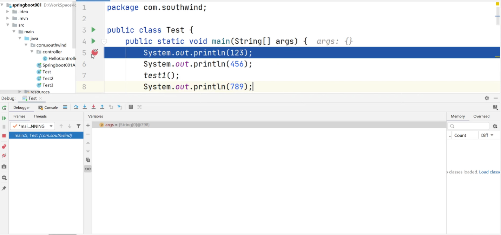

# `IDEA`断点调试

`IDEA`断点调试是在项目开发中必须要学会的操作

断点调试是程序员必须掌握的技能，它可以帮助我们查看`java`源代码的执行过程，提高我们的`java`编程水平

## 基本操作

在需要断点的代码左侧点击，打上红色的断点，使用`Debug`运行程序，程序就会运行到你打断点这一行停止

常见功能调试按钮的说明：

- `Show Execution Point`（快捷键：`Alt+F10`）：回到当前断点的界面（从其他界面返回，有时候我们通过查看函数进入到了其他界面，我们可以点击该按钮进行返回当前断点所在的界面）
- `Step Over`（快捷键：`F8`）：从当前断点处开始，逐行往下执行代码，点击一次执行一行，不会进入方法，直接执行完这个方法
- `Step Into`（快捷键：`F7`）：从当前断点处开始，逐行往下执行代码，如果遇到方法，就会进入到方法内（只能进入到我们自己写的方法中，不会进入到`Java`类中的方法，如果想要进入，可以进行设置），停在该方法体中的第一行
- `Force Step Into`（快捷键：`Alt+Shift+F7`）：相较于`Step Into`（快捷键：`F7`），可以进入到系统的方法中，不再局限于只能进入到自定义的方法中
- `Step Out`（快捷键：`Shift+F8`）：回退到我们当前断点所在方法被调用的位置（执行完当前方法并退出，返回到该方法被调用之后的位置）
- `resume program`（快捷键：`F9`）：恢复程序运行，但如果该断点下面代码还有断点，则停在下一个断点上
- `stop`（快捷键：`Ctrl+F2`）：结束断点调试