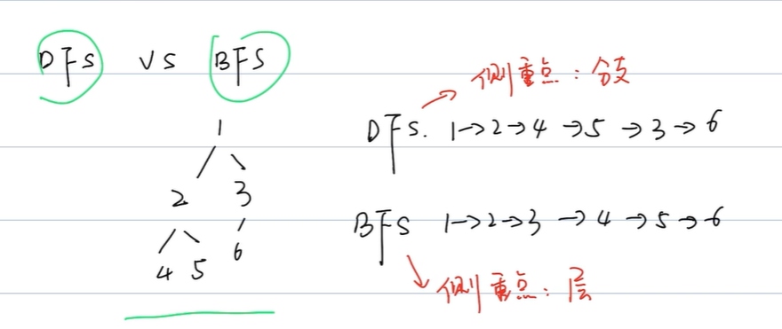

# 数据结构和算法

## 算法的复杂度

### 时间复杂度

时间复杂度指的是算法的执行效率，具体而言是算法的执行时间与算法的输入值之间的关系，时间复杂度使用大`O`表示法进行表示

在写代码的过程中，需要注重时间复杂度，使我们的代码变得更加高效

```python
def test(N):
    total = 0
    for i in range(N):
        total += i
    return total
```

> 对于上述的代码，我们要计算其时间复杂度，我们假设执行`total = 0`的时间为`a`；执行`total += i`的时间为`b`；执行`return total`的时间为`c`，那么执行上述程序的总时间为`a+N*b+c`
>
> 对于小的时间（常量的时间，固定的），我们在计算时间复杂度的时候可以进行忽略
>
> 时间复杂度也不会关心具体的系数，如`N*b`，其`b`是可以进行忽略的
>
> 因此上述代码的时间复杂度为`O(N)`；代码中对时间最大的影响是`for`循环

我们计算时间复杂度，一般观察代码中是否有`for`循环或者`while`循环，如果有，那么其时间复杂度一般是`O(N)`或者`O(logN)`等

#### 常见的时间复杂度

常见的时间复杂度有：

- `O(1)`：表示算法的执行时间和输入的值没有关系，不管输入的值有多大，算法的执行时间都不变

  ```python
  def O1(num):
      i = num
      j = num * 2
      return i + j
  ```

  > 没有`for`和`while`循环的代码，其时间复杂度一般都是`O(1)`

- `O(N)`：

  ```python
  def ON(num):
      total = 0
      for i in range(num):
          total += i
      return total
  ```

  > 循环的常量是0到`num`，执行的循环有`num`次，因此时间复杂度为`O(N)`

- `O(M+N)`

  ```python
  def OMN(num1, num2):
      total = 0
      for i in range(num1):
          total += i
      for j in range(num2):
          total += j
      return total
  ```

  > 并列循环的时间复杂度计算是加法运算
  >
  > 第一个`for`循环的时间复杂度为`O(M)`，第二个`for`循环的时间复杂度为`O(N)`
  >
  > 因此，总的时间复杂度为`O(M+N)`

- `O(logN)`（最典型的是二分查找法）

  ```python
  def OlogN(num):
      i = 1
      while (i<num):
          i = i * 2
      return i
  ```

  > 上述代码循环了`log2N`次，因此时间复杂度为`O(logN)`

- `O(NlogN)`（排序中出现的较多）

  ```python
  def ONLogN(num1, num2):
      total = 0
      j = 1
      for i in range(num1):
          while(j < num2):
              total += i + j
              j = j * 2
      return total
  ```

  > 对于嵌套循环的时间复杂度计算，是一个乘法运算，第一个循环的时间复杂度是`O(N)`，内部循环的时间复杂度是`O(logN)`，因此，总的时间复杂度是`O(NlogN)`

- `O(N^2)`

  ```python
  def ON2(num):
      total = 0
      for i in range(num):
          for j in range(num):
              total += i + j
      return total
  ```

  > 对于嵌套循环的时间复杂度计算，是一个乘法运算，第一个循环的时间复杂度是`O(N)`，内部循环的时间复杂度是`O(N)`，因此，总的时间复杂度是`O(N^2)`

#### 时间复杂度的效率对比

我们在编写代码的时候，需要力求我们写出的代码有最低的时间复杂度，常见时间复杂度的对比关系为：


***

### 空间复杂度

空间复杂度是算法存储空间与输入值之间的关系

代码中的变量也是要占据空间的

#### 常见的空间复杂度

- `O(1)`

  ```python
  def test(num):
      total = 0
      for i in range(num):
          total += i
      return total
  ```

  > 上述代码的空间复杂度是`O(1)`
  >
  > 声明一个变量`total`是会占据空间的（时间复杂度是常量级别的，只占一个`int`类型大小的空间），但是对于`for`循环是不占据空间的（只是运行，而不在内部存储数据）
  >
  > 如果变量等于某一个常量的情况下，其空间复杂度永远是`O(1)`
  >
  > 但是，特殊情况，对于递归，是一层层往下的，每一层的信息都会保留在递归栈中，因此，空间复杂度一般是`O(N)`

- `O(N)`

  ```python
  def test(nums):
      array = []
      for num in nums:
          array.append(num)
      return array
  ```

  > 数组中的一个元素占据的是一个`int`，四个字节，在`for`循环中，每循环一次，会在数组中插入一个元素，因此`array`占据的空间与输入值之间呈正比
  >
  > 因此，代码的空间复杂度为`O(N)`

常见的空间复杂度一般是`O(1)`和`O(N)`，还有其他用的较少的有`O(N^2)`、`O(logN)`、`O(NlogN)`

#### 空间复杂度的效率对比

对于空间复杂度的效率对比：`O(1)<O(N)<O(N^2)`

空间复杂度越小，表示算法越好

但是，对于时间和空间复杂度只能二选一的情况，有的时候是拿空间换时间，有的时候是拿时间换空间，在面试的时候，将时间复杂度最好的方法和空间复杂度最好的方法都讲清楚；在工作中，一般先考虑时间复杂度最优的方法


## 数组`Array`

数组作为一种重要的数据结构类型，在**连续的内存空间中**，存储一组**相同类型**的元素

数组的索引都是从0开始的（索引表示其元素在内存空间中相对于第一个元素的位置）

数组自带第一个元素存储的位置，如果存储的类型是整数`int`类型，占4个字节，如果第一个元素一开始的内存地址是100，那么第二个元素的内存地址就是104，依次类推

- 数组的访问：通过下标索引去访问数组中对应的元素：`a[1]`
- 数组的搜索：查找数组中的某一个元素，如查找数组中的某个元素的索引是什么，或者查找数组中有没有值为2的元素

***

### 数组操作的时间复杂度

- 访问操作的时间复杂度为`O(1)`

  如果要访问索引为2的元素，其具体的存储地址计算为（默认第一个元素的内存地址为100，且数组存放的是`int`类型的数据）100+2*4 = 108，因此，索引为2的元素，其内存地址为108，最后，直接去地址为108的地方去访问，读取元素的数据即可，因此，其时间复杂度为`O(1)`

- 搜索操作的时间复杂度为`O(N)`

  对于搜索操作，我们需要从头到尾遍历一遍该数组（最坏的情况要从头到尾进行一遍遍历）

- 插入操作的时间复杂度为`O(N)`

  数组是一个连续的内存空间，而且只知道其第一个元素的内存地址，对于插入操作，需要将后面的元素往后进行移动，对于最坏的情况（在第一个元素之前插入数据）我们需要将所有的元素都往后进行移动一位，因此插入操作的时间复杂度是`O(N)`

  插入操作，对于原先数组中，内存空间不足的情况下，我们需要开辟一块新的内存空间，将数据依次填充进去，因此时间复杂度也是`O(N)`

- 删除操作的时间复杂度为`O(N)`

  删除操作和插入操作的时间复杂度原理类似，数组中去除一个元素，后续需要将后面的元素在内存中的存储位置进行向前移动，最坏的情况下（删除第一个元素）我们需要将所有的元素都往前进行移动一位，因此删除操作的时间复杂度是`O(N)`

数组的特点：适合读取，不适合写（在读多写少的情况下适合使用数组）

***

### `Java`中数组的常用操作

#### 创建数组

在`Java`中，创建数据有四种方式：后面两种方法使用的较多

- `int[] a = {1,2,3};`

- `int[] b = new int[]{1,2,3};`

- `int[] c = new int[3];`    开辟三个占位符，默认值为0

- `ArrayList<Integer> arr = new ArrayList<>();`

  创建了一个数组列表，并指定了数组元素的对象类型，使用`ArrayList`创建数组，一开始可以不指定数组的长度，也不需要指定数组一开始有哪些元素，而且内置的方法比较多，但是需要导入`ArrayList`的包

#### 添加元素

对于创建数组的前三种方法进行添加元素是非常麻烦的，我们需要重新的新建一个数组，将原来3个长度的数组，变成4个长度的数组，最后在添加新的元素

但是使用`ArrayList`创建的数组，一开始是不需要指定数组长度的，可以使用内置方法`add()`进行数组元素的添加：`arr.add(4);`  默认插入到原数组的最后，其时间复杂度是`O(1)`（在内存空间充足的情况下），如果内存空间不足时，其添加操作的时间复杂度是`O(N)`

`arr.add(3, 88);`在索引为3的位置，插入元素88，这时的时间复杂度只有一种情况，为`O(N)`

#### 访问元素

在数组中访问元素是通过下标索引进行访问的

- 对于创建数组的前三种方法进行访问元素：`int x = c[1];`
- 对于使用`ArrayList`创建的数组进行访问元素：`int x = arr.get(1);`

访问元素的时间复杂度是`O(1)`

#### 更新元素

- 对于创建数组的前三种方法进行更新元素：`c[1]= 11;`
- 对于使用`ArrayList`创建的数组进行更新元素：`arr.set(1, 11);`

更新元素的时间复杂度是`O(1)`

#### 删除元素

对于创建数组的前三种方法进行删除元素是非常麻烦的，推荐使用`ArrayList`创建的数组进行删除元素的操作

`arr.remove(3);`  传入要删除元素的值；删除元素的时间复杂度是`O(N)`

#### 获取数组的长度

- 对于创建数组的前三种方法进行数组长度的获取：`int cSize = c.length;`
- 对于使用`ArrayList`创建的数组进行数组长度的获取：`int arrSize = arr.size();`

获取数组的长度的时间复杂度是`O(1)`  在创建一个数组时，其内部会维持一个`count`的变量，元素增加和删除时，这个变量会随之改变，获取长度时，会直接返回这个变量

#### 遍历数组

- 对于创建数组的前三种方法进行遍历数组：

  ```java
  for (int i = 0; i < c.length; i++) {
      int current = c[i];
      System.out.println(current);
  }
  ```

- 对于使用`ArrayList`创建的数组进行遍历数组：

  ```java
  for (int i = 0; i < arr.size(); i++) {
      int current = arr.get(i);
      System.out.println(current);
  }
  ```

遍历数组的时间复杂度是`O(N)`

#### 查找元素

- 对于创建数组的前三种方法进行查找元素：

  ```java
  for (int i = 0; i < c.length; i++) {
      if (c[i] == 3) {
          System.out.println("true");
      }
  }
  ```

- 对于使用`ArrayList`创建的数组进行查找元素：

  ```java
  boolean is8 = arr.contains(3);
  System.out.println(is8);
  ```

查找数组中元素的时间复杂度是`O(N)`

#### 数组排序

- 对于创建数组的前三种方法进行数组排序：`Arrays.sort(c);`    从小到大进行排序

- 对于使用`ArrayList`创建的数组进行访问元素：`Collections.sort(arr);`   从小到大进行排序

  从大到小进行排序：`Collections.sort(arr, Collections.reverseOrder());`

数组排序的时间复杂度是`O(NlogN)`

***

### 经典力扣题

#### 最大连续1的个数（485）

给定一个二进制数组 `nums` ， 计算其中最大连续 `1` 的个数。

输入：`nums = [1,1,0,1,1,1]`
输出：3
解释：开头的两位和最后的三位都是连续 1 ，所以最大连续 1 的个数是 3

```java
class Solution {
    public int findMaxConsecutiveOnes(int[] nums) {
        int count = 0;
        int maxCount = 0;
        for (int i = 0; i < nums.length; i++) {
            if (nums[i] == 1) {
                count++;
            } else {
                maxCount = maxCount > count ? maxCount : count;
                count = 0;
            }
        }
        maxCount = maxCount > count ? maxCount : count;
        return maxCount;
    }
}
```

#### 移动零（283）

给定一个数组 `nums`，编写一个函数将所有 `0` 移动到数组的末尾，同时保持非零元素的相对顺序。请注意 ，必须在不复制数组的情况下原地对数组进行操作。

输入: `nums = [0,1,0,3,12] `   输出: `[1,3,12,0,0]`

```java
class Solution {
    public void moveZeroes(int[] nums) {
        int index = 0;
        int size = nums.length;
        for (int i = 0; i < size; i++) {
            if (nums[i] != 0) {
                nums[index] = nums[i];
                index = index + 1;
            }
        }
        for (int i = index; i < size; i++) {
            nums[i] = 0;
        }
    }
}
```

> 这里使用的双指针的思想：`i`是一个指针，`index`也是一个指针


## 链表`Linked List`

相对于数组只能在完整且连续的内存空间中存储数据，链表可以在任意的内存地址中存储数据

在链表中，不仅仅有元素数据，还有`next`指针（用于指向下一个元素，最后一个元素的`next`指针指向了`null`节点）将元素串起来了，形成了链的结构

链表有两种形式：单端链表（只能从前一个元素指向后一个元素，做算法题一般都只涉及到单端链表）和双端链表（不仅有`next`指针，用于指向后一个元素，还有前指针，用于指向前一个元素）

***

### 链表操作的时间复杂度

- 访问操作的时间复杂度为`O(N)`

  对于链表的访问操作，最坏的情况需要遍历整个链表（一步步通过当前元素的`next`指针进行查找下一个元素，直到找到符合条件的元素为止）

- 搜索操作的时间复杂度为`O(N)`

  对于搜索操作，我们需要从头到尾遍历一遍该链表（最坏的情况要从头到尾进行一遍遍历）

- 插入操作的时间复杂度为`O(1)`

  在链表中进行元素的插入，消耗的时间复杂度是非常低的，直接在任意的内存中存储元素的数据，然后根据该元素要存储的位置，断开前后节点的`next`指针，连接到新增元素节点的前后即可，因此，链表的插入操作这个过程的时间复杂度为`O(1)`，但是找到要插入位置的索引，需要循环一次该链表

- 删除操作的时间复杂度为`O(1)`

  链表的删除操作与插入操作同理，如果要删除元素，只需断开其前后的指针即可，避开这个要删除的元素，重新连接起来即可，因此对于删除这个操作，其时间复杂度为`O(1)`，但是找到要删除位置的索引，需要循环一次该链表

数组的特点：适合写，不适合读取（在写多读少的情况下适合使用链表）

在刷力扣时，如果要使用链表，对于链表的数据结构，力扣都会给出（`value`（指向当前节点元素的值）和`next`（指向下一个节点））

***

### `Java`中链表的常用操作

#### 创建链表

```java
LinkedList<Integer> list = new LinkedList<>();
```

#### 添加元素

- 在链表的尾部依次进行插入元素：`list.add(1);`   其时间复杂度为`O(1)`
- 在链表的指定位置插入元素：`list.add(2, 99);` 在索引为2的位置插入元素，其值为99，我们要找到索引为2的位置，因此需要循环一次链表，因此时间复杂度为`O(N)`

#### 搜索元素

```java
int index = list.indexOf(99);    // 搜索值为99的元素的索引
```

搜索链表元素，需要从到到尾对链表进行遍历，因此时间复杂度为`O(N)`

#### 更新元素

```java
list.set(2, 88);    // 在索引为2的位置，将元素的值更改为88
```

更新链表元素，需要从到到尾对链表进行遍历，因此时间复杂度为`O(N)`

#### 删除元素

```java
list.remove(2);     // 将链表中，索引为2的元素删除
```

删除链表元素，需要从到到尾对链表进行遍历，因此时间复杂度为`O(N)`

#### 获取链表的长度

```java
int length = list.size();
```

获取链表的长度的时间复杂度为`O(1)`，在初始化链表的时候，有一个变量，当我们在添加元素的时候，就会加一，在删除元素的时候，就会减一，当我们要获取链表长度时，就会将这个值返回，因此，获取链表的长度的时间复杂度为`O(1)`

***

### 经典力扣题

#### 移除链表元素（203）

给你一个链表的头节点 `head` 和一个整数 `val` ，请你删除链表中所有满足 `Node.val == val` 的节点，并返回 新的头节点 

输入：`head = [1,2,6,3,4,5,6], val = 6`
输出：`[1,2,3,4,5]`

```java
/**
 * Definition for singly-linked list.
 * public class ListNode {
 *     int val;    // 当前节点的值是多少
 *     ListNode next;   // 当前节点的下一个节点是哪个节点
 *     ListNode() {}
 *     ListNode(int val) { this.val = val; }
 *     ListNode(int val, ListNode next) { this.val = val; this.next = next; }
 * }
 */
class Solution {
    public ListNode removeElements(ListNode head, int val) {
        ListNode dummy = new ListNode(0);
        dummy.next = head;   // head表示第一个元素所在的位置，后面的元素可以通过next指针进行查找
        ListNode prev = dummy;

        while (head != null) {
            if (head.val == val) {
                // 删除节点，将节点的前一个节点的next指向该节点的后一个节点
                prev.next = head.next;
            } else {
                prev = head;
            }
            head = head.next;   // 移动到下一个节点
        }
        return dummy.next;
    }
}
```

> 如果`head`移动后，前面的节点元素就相当于被删除了，链表就是从`head`开始往下进行的，因此我们需要引入一个临时的节点`dummy`，将临时的节点放在最开始的节点前面，其临时节点的`next`指针指向第一个节点
>
> 对于删除链表中的元素节点，我们就需要将该元素节点的前面节点的`next`指针指向要删除元素的后一个节点，为了定义当前节点的前一个节点，我们需要引入一个`prev`节点，每次在`head`节点移动的时候，我们将其值赋值给`prev`节点（用于记录`head`移动之前的节点）

#### 反转链表（206）

给你单链表的头节点 `head` ，请你反转链表，并返回反转后的链表

输入：`head = [1,2,3,4,5]`
输出：`[5,4,3,2,1]`

```java
/**
 * Definition for singly-linked list.
 * public class ListNode {
 *     int val;
 *     ListNode next;
 *     ListNode() {}
 *     ListNode(int val) { this.val = val; }
 *     ListNode(int val, ListNode next) { this.val = val; this.next = next; }
 * }
 */
class Solution {
    public ListNode reverseList(ListNode head) {
        ListNode dummy = new ListNode(0);
        dummy.next = head;   
        ListNode dnext = new ListNode(0);   
        ListNode hnext = new ListNode(0);   
        
        while(head != null && head.next != null) {
            dnext = dummy.next;    // dummy的next节点
            hnext = head.next;     // head的next节点
            // 交换操作
            dummy.next = hnext;
            head.next = hnext.next;
            hnext.next = dnext;
        }
        return dummy.next;
    }
}
```


## 队列`Queue`

队列可以理解成排队，先到先得

队列相当于管道，只有一端可以入队（放数据进入管道），另一端作为出队（数据只能从这里出去），队列的特点是先入先出，在队列中有两种分类：

- 单端队列：只有一个口可以进，一个口可以出
- 双端队列：两个口都可以进，两个口都可以出

在刷题的时候，双端队列使用的不多，重点掌握单端队列即可

***

### 队列操作的时间复杂度

- 访问操作的时间复杂度为`O(N)`

  通过某个下标去找到具体的元素，由于队列是按照先进入的顺序排列的，要查找某个元素时，需要遍历整个队列，因此时间复杂度为`O(N)`

- 搜索操作的时间复杂度为`O(N)`

  搜索队列也是需要进行从头到尾进行查找的，因此时间复杂度也为`O(N)`

- 插入操作的时间复杂度为`O(1)`

  由于队列是先进先出，在插入元素的过程中，只能在队列的最后一个元素的末尾进行插入，因此时间复杂度为`O(1)`

- 删除操作的时间复杂度为`O(1)`

  对于删除队列的元素，只能删除最先进来的元素，因此时间复杂度为`O(1)`

***

### `Java`中队列的常用操作

#### 创建队列

```java
Queue<Integer> queue = new LinkedList<>();
```

> `Queue`作为队列的接口，使用链表`LinkedList`作为队列的数据结构，使队列有了链表的特性，删除添加比较快，查询比较慢

#### 添加元素

```java
queue.add(1);     // 在队列最后添加一个元素  添加元素的时间复杂度为O(1)
```

#### 获取即将要出队的元素

```java
int temp1 = queue.peek();   // 获取队列中最早进入的元素   其过程时间复杂度为O(1)
```

#### 删除即将出队的元素

```java
int temp2 = queue.poll();    // 将队列中最早进入的元素删除，并将删除的值进行返回
```

#### 判断队列是否为空

```java
System.out.println(queue.isEmpty());    // 时间复杂度为O(1)
```

#### 队列的长度

```java
System.out.println(queue.size());     // 时间复杂度为O(1)
```

#### 遍历队列

```java
while (!queue.isEmpty()) {
    int temp = queue.poll();    // 一般是边删除边遍历
    System.out.println(temp);
}
```

> 遍历队列的时间复杂度是`O(N)`

***

### 经典力扣题

#### 最近的请求次数（933）

写一个 `RecentCounter` 类来计算特定时间范围内最近的请求。

请你实现 `RecentCounter` 类：

- `RecentCounter()` 初始化计数器，请求数为 0 。
- `int ping(int t)` 在时间 `t` 添加一个新请求，其中 `t` 表示以毫秒为单位的某个时间，并返回过去 `3000` 毫秒内发生的所有请求数（包括新请求）。确切地说，返回在 `[t-3000, t]` 内发生的请求数。

保证 每次对 `ping` 的调用都使用比之前更大的 `t` 值。

输入：
`["RecentCounter", "ping", "ping", "ping", "ping"]`
`[[], [1], [100], [3001], [3002]]`
输出：
`[null, 1, 2, 3, 3]`

解释：

- `RecentCounter recentCounter = new RecentCounter();`
- `recentCounter.ping(1);     // requests = [1]，`范围是 [-2999,1]，返回 1
- `recentCounter.ping(100);   // requests = [1, 100]，`范围是 [-2900,100]，返回 2
- `recentCounter.ping(3001);  // requests = [1, 100, 3001]，`范围是 [1,3001]，返回 3
- `recentCounter.ping(3002);  // requests = [1, 100, 3001, 3002]，`范围是 [2,3002]，返回 3

```java
class RecentCounter {
    private Queue<Integer> queue;
    
    public RecentCounter() {
        queue = new LinkedList<>();
    }
    
    public int ping(int t) {
        queue.add(t);
        while (queue.size() > 0 && t - queue.peek() > 3000) {
            queue.poll();
        }
        return queue.size();
    }
}

/**
 * Your RecentCounter object will be instantiated and called as such:
 * RecentCounter obj = new RecentCounter();
 * int param_1 = obj.ping(t);
 */
```


## 栈`stack`

对于队列，是先进先出的，然而，对于栈，是先进后出的

栈只有一个口进行，一个口出，因此后面进来的需要先出去

在计算机中的应用有，浏览器的回退功能，就使用到了栈的思想

***

### 栈操作的时间复杂度

- 访问操作的时间复杂度为`O(1)`

  对于栈中元素的访问，仅仅只是访问栈中栈顶的元素（最后进去的元素），因此访问操作的时间复杂度为`O(1)`

- 搜索操作的时间复杂度为`O(N)`

  对于搜索操作，我们是不知道具体的元素在哪个具体的位置的，因此我们需要遍历整个栈去搜索元素，因此，搜索操作的时间复杂度为`O(N)`

- 插入操作的时间复杂度为`O(1)`

  由于栈的特殊性，只能在栈的尾端进行元素的插入，因此时间复杂度为`O(1)`

- 删除操作的时间复杂度为`O(1)`

  对于栈的删除操作，只能删除栈顶的元素，因此时间复杂度是`O(1)`

***

### `Java`中栈的常用操作

#### 创建栈

```java
Stack<Integer> stack = new Stack<>();
```

> 通过`Stack`来声明一个栈，`Integer`表示栈中元素的类型

#### 添加元素

```java
stack.push(1);    // 由于栈的特性，每次都需要在尾部进行元素的添加，时间复杂度为O(1)
```

#### 获取栈顶元素

```java
stack.peek();     // 获取栈顶元素，即最后一个进来的元素，时间复杂度为O(1)
```

#### 删除栈顶元素

```java
int temp = stack.pop();   // 删除栈顶的元素，并将元素最为返回值返回，时间复杂度为O(1)
```

#### 获取栈的大小

```java
stack.size();     // 时间复杂度为O(1)
```

#### 判断栈是否为空

```java
stack.isEmpty();    // 时间复杂度为O(1)
```

#### 栈的遍历

```java
while (!stack.isEmpty()) {
    int num = stack.pop();    // 边删除边遍历
    System.out.println(num);
}
```

> 栈的遍历时间复杂度为`O(N)`

***

### 经典力扣题

#### 有效括号（20）

给定一个只包括 `'('`，`')'`，`'{'`，`'}'`，`'['`，`']'` 的字符串 `s` ，判断字符串是否有效。

有效字符串需满足：

1. 左括号必须用相同类型的右括号闭合。
2. 左括号必须以正确的顺序闭合。
3. 每个右括号都有一个对应的相同类型的左括号。

示例：

输入：`s = "()[]{}"`

输出：`true`

示例：

输入：`s = "(]"`

输出：`false`

```java
class Solution {
    public boolean isValid(String s) {
        Stack<Character> stack = new Stack<>();
        if (s.length() == 0) return true;
        for(char c : s.toCharArray()) {
            if (c == '(' || c == '{' || c == '[') {
                stack.push(c);
            } else {
                if (stack.isEmpty()) return false;
                char temp = stack.pop();
                if (c == ')') {
                    if (temp != '(') return false;
                } else if (c == '}') {
                    if (temp != '{') return false;
                } else if (c == ']') {
                    if (temp != '[') return false;
                } else {
                    return false;
                }
            }
        }
        return stack.isEmpty();
    }
}
```

> 使用栈的思想，对字符串进行遍历，将遍历到的左括号依次放到栈中（只要是左边的括号，都放到栈中），如果遍历到右括号，我们就将栈中最后进入的左括号取出来，与遍历到的右括号进行匹配，如果匹配成功，对字符串的循环遍历就继续
>
> 如果对字符串的循环遍历完整后，同时，栈中也没有多余的左括号了，就说明当前的字符串是一个有效的括号
>
> 如果最后栈中还有一个左括号不能和字符串中的右括号进行匹配；或者字符串中的右括号没有左括号进行匹配，说明该字符串不是一个有效括号的字符串

#### 下一个更大元素（496）

`nums1` 中数字 `x` 的 下一个更大元素 是指 `x` 在 `nums2` 中对应位置 右侧 的 第一个 比 `x` 大的元素。

给你两个 没有重复元素 的数组 `nums1` 和 `nums2` ，下标从 0 开始计数，其中`nums1` 是 `nums2` 的子集。

对于每个 `0 <= i < nums1.length` ，找出满足 `nums1[i] == nums2[j]` 的下标 `j` ，并且在 `nums2` 确定 `nums2[j]` 的 下一个更大元素 。如果不存在下一个更大元素，那么本次查询的答案是 `-1` 。

返回一个长度为 `nums1.length` 的数组 `ans` 作为答案，满足 `ans[i]` 是如上所述的 下一个更大元素 。

示例：

输入：`nums1 = [4,1,2], nums2 = [1,3,4,2]`.
输出：`[-1,3,-1]`
解释：`nums1` 中每个值的下一个更大元素如下所述：

- 4 ，用加粗斜体标识，`nums2 = [1,3,4,2]`。不存在下一个更大元素，所以答案是 -1 。
- 1 ，用加粗斜体标识，`nums2 = [1,3,4,2]`。下一个更大元素是 3 。
- 2 ，用加粗斜体标识，`nums2 = [1,3,4,2]`。不存在下一个更大元素，所以答案是 -1 。

```java
class Solution {
    public int[] nextGreaterElement(int[] nums1, int[] nums2) {
        ArrayList<Integer> res = new ArrayList<>();
        Stack<Integer> stack = new Stack<>();
        for (int num : nums2) {
            stack.add(num);
        }
        for (int num : nums1) {
            Stack<Integer> temp = new Stack<>();
            boolean isFound = false;
            int max = -1;
            int top;
            while (stack.size() != 0 && !isFound) {
                top = stack.pop();
                if (top > num) max = top;
                else if (top == num) isFound = true;
                temp.add(top);
            }
            res.add(max);
            // 将temp栈的内容放回到stack栈中
            while (temp.size() != 0) {
                stack.add(temp.pop());
            }
        }
        // 返回类型是int[]，因此我们要进行转换
        int[] result = new int[res.size()];
        for (int i = 0; i < res.size(); i++) {
            result[i] = res.get(i);
        }
        return result;
    }
}
```

> 使用两个栈的方式进行该问题的解决
>
> 通过栈数据结构后入先出的概念，将原数组`nums2`中的元素都放到一个栈`stack`中
>
> 对于子数组，我们通过循环遍历的方式，取元素，通过对`stack`栈的边删边取的方式，存入到另一个栈`temp`中，`top`变量用于存储从`stack`栈中取出的元素，并存到`temp`栈中，用于和要子数组遍历出的元素进行对比：
>
> - `top>num`：表示是当前循环取出的值有更大的值，后将`top`赋值给`max`（`max`默认是-1）
> - `top=num`：已经找到与循环遍历出相等的值，后续可以不再进行判断了
> - `top<num`：不需要进行任何操作
>
> 最后，当子数组中的一个元素判断完后，需要将`temp`栈中的内容返回到`stack`栈中，后续循环使用
>
> 上述算法的时间复杂度为`O(MN)`（`M`为`nums1`的长度，`N`为`nums2`的长度）；空间复杂度为`O(N)`


## 哈希表（`Hash Table`）

哈希表也叫散列表，有`key: value`键值对的概念，如学号和名字组成的键值对，我们可以通过`key`去得到具体的`value`

数组在一定意义上属于一种哈希表，哈希表的`key`可以转化为索引，数组的元素对于这个`key`存储的`value`值

每种编程语言中都会写好一种哈希表，在`Java`中 的哈希表是`HashMap`，当我们存储一对`key: value`时，会将其中的`key`取出来，通过一个哈希函数，找到一个内存地址，最后将`key`和对应的`value`放到对应的内存地址上，后续对于我们使用`key`去查找时，只需通过哈希函数，就可以找到对应的内存地址

但是上述的过程会有一个哈希碰撞的问题，即两个不同的`key`通过同一个哈希函数得到相同的内存地址

对于出现哈希碰撞的问题，我们可以通过链表的方式进行解决，通过`next`指针指向后加入的元素

***

### 哈希表操作的时间复杂度

- 在哈希表中，访问操作是不存在的

- 搜索操作的时间复杂度为`O(1)`

  对`key`进行搜索，通过`key`值的哈希函数，定位到具体的内存地址，最后读取其`value`值，就是我们要访问的值，其时间复杂度为`O(1)`

  但是如果是在哈希碰撞的情况下，其时间复杂度为`O(k)`，其中`k`为碰撞元素的个数

- 插入操作的时间复杂度为`O(1)`

  对于插入操作，直接通过哈希函数计算`key`的内存地址，之后再将`value`存入，即完成元素的插入，因此时间复杂度为`O(1)`

- 删除操作的时间复杂度为`O(1)`

  对于删除操作，直接通过哈希函数计算`key`的内存地址，之后再将`value`删除，即完成元素的删除，因此时间复杂度为`O(1)`

***

### `Java`中哈希表的常用操作

#### 创建哈希表

```java
// 方式一：通过数组来创建哈希表
String[] hashTable = new String[4];  // 将数组的索引当作添加元素的key，数组的值当作value
// 方式二：通过系统自带的函数来创建哈希表
HashMap<Integer, String> map = new HashMap<>();
```

#### 添加元素

```java
// 创建元素方式一添加元素
hashTable[1] = "aaa";
hashTable[2] = "bbb";
// 创建元素方式二添加元素
map.put(1, "aaa");
map.put(2, "bbb");
```

#### 更新元素

```java
// 创建元素方式一更新元素
hashTable[1] = "ccc";
// 创建元素方式二更新元素
map.put(1, "ccc");
```

#### 删除元素

```java
// 创建元素方式一删除元素
hashTable[1] = "";
// 创建元素方式二删除元素
map.remove(1);
```

#### 获取元素

通过`key`来获取元素

```java
// 创建元素方式一获取元素
String temp = hashTable[1];
// 创建元素方式二删除元素
map.get(1);
```

#### 检查`key`是否存在

```java
// 只有方式二能检查key是否存在
map.containsKey(3);
```

#### 获取长度

```java
map.size();
```

#### 是否还有元素

```java
map.isEmpty();
```

#### 根据索引遍历元素

```java
// 遍历键
for (String key : map.keySet()) {
    System.out.println("Key: " + key);
}

// 遍历值
for (Integer value : map.values()) {
    System.out.println("Value: " + value);
}
```

***

### 经典力扣题

#### 存在重复元素（217）

给你一个整数数组 `nums` 。如果任一值在数组中出现 至少两次 ，返回 `true` ；如果数组中每个元素互不相同，返回 `false` 

示例：

输入：`nums = [1,2,3,1]`

输出：`true`

解释：元素 1 在下标 0 和 3 出现。

示例：

输入：`nums = [1,2,3,4]`

输出：`false`

解释：所有元素都不同。

```java
class Solution {
    public boolean containsDuplicate(int[] nums) {
        if (nums.length == 0) return false;
        HashMap<Integer, Integer> map = new HashMap<>();

        for (int num : nums) {
            if (!map.containsKey(num)) {
                map.put(num, 1);
            } else {
                return true;
            }
        }
        return false;
    }
}
```

> 哈希表的其中一个常用功能是用来统计某个元素在数据集中出现的次数
>
> 本题中，创建的哈希表，其中`key`存储数组元素，`value`存储元素出现的次数

#### 找不同（389）

给定两个字符串 `s` 和 `t` ，它们只包含小写字母。

字符串 `t` 由字符串 `s` 随机重排，然后在随机位置添加一个字母。

请找出在 `t` 中被添加的字母。

示例 1：

输入：`s = "abcd", t = "abcde"`
输出：`"e"`
解释：`'e' `是那个被添加的字母。

示例 2：

输入：`s = "", t = "y"`
输出：`"y"`

```java
class Solution {
    public char findTheDifference(String s, String t) {
        int[] hashTable = new int[26];   // 整数类型，初始化值都为0
        char[] sCharArray = s.toCharArray();
        char[] tCharArray = t.toCharArray();

        if (s.length() == 0) {
            return t.charAt(0);
        }

        for (char i : sCharArray) {
            int temp = i - 97;
            hashTable[temp] = hashTable[temp] - 1;
        }

        for (char j : tCharArray) {
            int temp = j - 97;
            hashTable[temp] = hashTable[temp] + 1;
        }

        for (int k = 0; k < hashTable.length; k++) {
            if (hashTable[k] == 1) {
                char res = (char) (k + 97);
                return res;
            }
        }
        return '0';
    }
}
```

> 使用了`ASCII`码的方式，作为索引往数组中添加内容；通过原字符串出现则减一，后续字符串出现则加一的方式，那么最后在数组中值为1的索引，就是最后要返回的字符

***

#### 两数之和(hot)

给定一个整数数组 `nums` 和一个整数目标值 `target`，请你在该数组中找出 和为目标值 *`target`* 的那 两个 整数，并返回它们的数组下标。你可以假设每种输入只会对应一个答案，并且你不能使用两次相同的元素。你可以按任意顺序返回答案。

示例 1：

```java
输入：nums = [2,7,11,15], target = 9
输出：[0,1]
解释：因为 nums[0] + nums[1] == 9 ，返回 [0, 1] 。
```

示例 2：

```java
输入：nums = [3,2,4], target = 6
输出：[1,2]
```

```java
// 方式一：使用暴力枚举的方法进行该问题的解决   时间复杂度为O(N^2)  空间复杂度为O(1)
class Solution {
    public int[] twoSum(int[] nums, int target) {
        int[] res = new int[2];
        for (int i = 0; i < nums.length; i++) {
            for (int j = i + 1; j < nums.length; j++) {
                if (nums[i] + nums[j] == target) {
                    res[0] = i;
                    res[1] = j;
                }
            }
        }
        return res;
    }
}

// 使用哈希表的方式进行该问题的求解     时间复杂度为O(N)  空间复杂度为O(N)
class Solution {
    public int[] twoSum(int[] nums, int target) {
        Map<Integer, Integer> hashtable = new HashMap<Integer, Integer>();
        // 往哈希表中插入内容，将数组中的值作为哈希表的键，将数组的索引作为哈希表的值
        for (int i = 0; i < nums.length; i++) {
            hashtable.put(nums[i], i);  
        }
        for (int i = 0; i < nums.length; i++) {
            // 确保存在符合条件的值，且不能重复使用两次相同的元素
            if (hashtable.containsKey(target - nums[i]) && hashtable.get(target - nums[i]) != i) {
                // 返回匹配的结果，hashtable.get()返回哈希表中对应键的值
                return new int[]{ hashtable.get(target - nums[i]), i };  
            }
        }
        return new int[0];   // 表示没有找到匹配的结果
    }
}
```

***

#### 字母异位词分组（hot）

给你一个字符串数组，请你将 字母异位词 组合在一起。可以按任意顺序返回结果列表。

示例:

输入: `strs = ["eat", "tea", "tan", "ate", "nat", "bat"]`

输出: `[["bat"],["nat","tan"],["ate","eat","tea"]]`

解释：

- 在 `strs` 中没有字符串可以通过重新排列来形成 `"bat"`。
- 字符串 `"nat"` 和 `"tan"` 是字母异位词，因为它们可以重新排列以形成彼此。
- 字符串 `"ate"` ，`"eat"` 和 `"tea"` 是字母异位词，因为它们可以重新排列以形成彼此。

```java
class Solution {
    public List<List<String>> groupAnagrams(String[] strs) {
        // 定义一个哈希集合，其键为排序好的字符串
        Map<String, List<String>> map = new HashMap<String, List<String>>();

        for (String str : strs) {
            char[] array = str.toCharArray();   // 将字符串转化为一个字符数组
            Arrays.sort(array);   // 对字符串数组进行排序，从小到大
            String key = new String(array);  // 将排序好的字符数组转换回字符串，最为哈希集合的键
            List<String> list = map.getOrDefault(key, new ArrayList<String>());
            list.add(str);
            map.put(key, list);  // 根据键添加元素
        }
        return new ArrayList<List<String>>(map.values());   // 将集合的值返回
    }
}
```

> 核心思路：由于互为字母异位词的两个字符串包含的字母相同，因此对两个字符串分别进行排序之后得到的字符串一定是相同的，故可以将排序之后的字符串作为哈希表的键
>
> `getOrDefault`是`Java`中`Map`接口的一个非常有用的方法，它允许你在获取键对应的值时提供一个默认值，当键不存在于`Map`中时返回这个默认值


## 集合（`Set`）

集合数据结构的特点是无序（元素不是按照某个顺序进行排序的，也不是反映元素插入的顺序）、不重复的（集合中所有的元素都是独一无二的，不论插入多个一样的元素，在集合中只会表现出一个）

集合数据结构的作用：

- 检查某一个元素是否存在
- 使用集合检查是否有重复的元素

`HashSet`集合，我们要将一个元素加入到一个`HashSet`集合中去，其过程为：

先获取元素，再使用哈希函数，得到具体的哈希值（哈希集合实质上背后是一张哈希表），我们要将哈希值放到哈希表中对应的位置，如果对应位置上没有元素，我们直接进行存放；如果对应位置上已经存在其他元素了，我们需要进行对比，对比我们的元素和哈希表上的元素是否相等，如果相等，说明这两个元素重复，我们可以不做任何操作；如果不相等，表明产生了哈希冲突，可以通过链表的方法进行解决，将原位置的元素，通过`next`指针指向新要存放的元素

***

### 集合操作的时间复杂度

- 在集合中，访问操作是不存在的

- 搜索操作的时间复杂度为`O(1)`

  对元素进行搜索，通过元素值的哈希函数，定位到具体的哈希表中的位置，最后读取其`value`值，就是我们要访问的值，其时间复杂度为`O(1)`

  但是如果是在哈希碰撞的情况下，其时间复杂度为`O(k)`，其中`k`为碰撞元素的个数

- 插入操作的时间复杂度为`O(1)`

  对于插入操作，直接通过哈希函数计算元素在哈希表中的位置，之后再将`value`存入，即完成元素的插入，因此时间复杂度为`O(1)`

  但是如果是在哈希碰撞的情况下，其时间复杂度为`O(k)`，其中`k`为碰撞元素的个数

- 删除操作的时间复杂度为`O(1)`

  对于删除操作，直接通过哈希函数计算在哈希表中的位置，之后再将`value`删除，即完成元素的删除，因此时间复杂度为`O(1)`

  但是如果是在哈希碰撞的情况下，其时间复杂度为`O(k)`，其中`k`为碰撞元素的个数

***

### `Java`中集合的常用操作

#### 创建集合

```java
HashSet<Integer> set = new HashSet<>();
```

#### 添加元素

```java
set.add(1);
```

#### 搜索元素

```java
set.contains(2);   // 搜索值为2的元素是否在集合中
```

#### 删除元素

```java
set.remove(2);    // 将值为2的元素从集合中删除
```

#### 获取集合长度

```java
set.size();   // 时间复杂度为O(1)
```

***

### 经典力扣题

#### 存在重复元素（217）

给你一个整数数组 `nums` 。如果任一值在数组中出现 至少两次 ，返回 `true` ；如果数组中每个元素互不相同，返回 `false` 

示例：

输入：`nums = [1,2,3,1]`

输出：`true`

解释：元素 1 在下标 0 和 3 出现。

示例：

输入：`nums = [1,2,3,4]`

输出：`false`

解释：所有元素都不同。

通过集合的方式进行解决：对于重复的元素，是不能加入到集合中的，我们只需要比较数据前后的长度就可以进行是否有重复元素的判断

```java
class Solution {
    public boolean containsDuplicate(int[] nums) {
        if (nums.length == 0) return false;
        HashSet<Integer> set = new HashSet<>();

        for (int num : nums) {
            set.add(num);
        }

        if (set.size() == nums.length) return false;
        else return true;
    }
}
```

#### 设计哈希集合（705）

不使用任何内建的哈希表库设计一个哈希集合（`HashSet`）。

实现 `MyHashSet` 类：

- `void add(key)` 向哈希集合中插入值 `key` 。
- `bool contains(key)` 返回哈希集合中是否存在这个值 `key` 。
- `void remove(key)` 将给定值 `key` 从哈希集合中删除。如果哈希集合中没有这个值，什么也不做。

示例：

```java
// 输入：
["MyHashSet", "add", "add", "contains", "contains", "add", "contains", "remove", "contains"]
[[], [1], [2], [1], [3], [2], [2], [2], [2]]
// 输出：
[null, null, null, true, false, null, true, null, false]

// 解释：
MyHashSet myHashSet = new MyHashSet();
myHashSet.add(1);      // set = [1]
myHashSet.add(2);      // set = [1, 2]
myHashSet.contains(1); // 返回 True
myHashSet.contains(3); // 返回 False，（未找到）
myHashSet.add(2);      // set = [1, 2]
myHashSet.contains(2); // 返回 True
myHashSet.remove(2);   // set = [1]
myHashSet.contains(2); // 返回 False，（已移除）
```

提示：

- `0 <= key <= 10^6`
- 最多调用 `10^4` 次 `add`、`remove` 和 `contains`

```java
class MyHashSet {

    private boolean[] hashSet;

    public MyHashSet() {
        hashSet = new boolean[1000001];
    }
    
    public void add(int key) {
        hashSet[key] = true;
    }
    
    public void remove(int key) {
        hashSet[key] = false;
    }
    
    public boolean contains(int key) {
        return hashSet[key];
    }
}
```

> 其添加，删除和查找操作的时间复杂度都是`O(1)`；但是缺点是，数组的大小会很大，同时题目中要给定具体`key`的大小范围

***

#### 最长连续序列（hot）

给定一个未排序的整数数组 `nums` ，找出数字连续的最长序列（不要求序列元素在原数组中连续）的长度。请你设计并实现时间复杂度为 `O(n)` 的算法解决此问题。

示例 1：

```java
输入：nums = [100,4,200,1,3,2]
输出：4
解释：最长数字连续序列是 [1, 2, 3, 4]。它的长度为 4。
```

示例 2：

```java
输入：nums = [0,3,7,2,5,8,4,6,0,1]
输出：9
```

```java
public int longestConsecutive(int[] nums) {
    // 创建一个HashSet来存储所有数字，利用HashSet的O(1)查找特性
    Set<Integer> numSet = new HashSet();
    
    // 遍历输入数组，将所有数字添加到HashSet中，进行去重
    for (int num : nums) {
        numSet.add(num);
    }

    // 初始化结果变量，用于记录最长连续序列的长度
    int res = 0;

    // 遍历HashSet中的每个数字
    for (int num : numSet) {
        // 检查当前数字是否是某个连续序列的起点（即前一个数字不存在）
        if (!numSet.contains(num - 1)) {
            int currentNum = num;    // 当前检查的数字
            int currentStreak = 1;   // 当前连续序列长度，初始为1

            // 检查并延长连续序列：只要下一个连续数字存在就继续
            while (numSet.contains(currentNum + 1)) {
                currentNum++;        // 移动到下一个数字
                currentStreak++;     // 增加当前序列长度
            }

            // 更新全局最长序列长度
            res = Math.max(res, currentStreak);
        }
    }
    // 返回最长连续序列的长度
    return res;
}
```

> 核心思想：每个数都判断一次这个数是不是连续序列的开头那个数
>
> 利用了`HashSet`的快速查找特性，避免了排序带来的`O(n log n)`复杂度，实现了高效的`O(n)`解决方案


## 树（`Tree`）

树这种数据结构描述的是一种父子关系，对于不能确定父子关系的节点，这整个结构就不是树（节点封闭，有首尾连接的结构，不是树）

树数据结构中重要的概念：

- 节点：表示树中的每一个元素
- 根节点：对于树中，最上面的一个节点就是根节点，根节点只有子，没有父
- 叶子节点：对于没有孩子的节点，就是叶子节点
- 高度（从最底下开始计算，最底下的高度为0，往上依次加1，根节点的高度是最高的）、深度（从顶部往下计算的，最顶部的深度为0，往下依次加1，根节点的深度为0）和层（表示一层一层的，根节点作为第一层）


二叉树：对于每个节点，最多有两个孩子节点，这样的树被称为二叉树。常见的二叉树有：

- 普通二叉树：每个节点最多有两个孩子节点
- 满二叉树：除了叶子节点，每个节点都有左右两个孩子，同时所有的叶子节点都在同一层上
- 完全二叉树：从树的根节点，从上往下，从左到右依次填满节点形成的二叉树（最右边的可以不被填满）

如果一个二叉树是满二叉树，那么它一定是一个完全二叉树；反之不成立

二叉树的遍历：

- 前序遍历：根节点-->左子树-->右子树
- 中序遍历：左子树-->根节点-->右子树
- 后序遍历：左子树-->右子树-->根节点

前序、中序和后序都是指根节点所在的位置

对于下面的二叉树：


其前序、中序和后序遍历依次为：

- 前序：`A->B->D->E->C->F->G`   先访问根节点的左子树，再访问根节点的右子树（对于具体的子树也要根据前序遍历的方式）
- 中序：`D->B->E->A->F->C->G`   先访问左子树，再访问根节点，最后访问右子树
- 后续：`D->E->B->F->G->C->A`   先访问左子树，再访问右子树，最后访问根节点


## 堆（`Heep`）

堆数据类型是一种二叉树的结构，构成堆数据结构的条件：

- 完全二叉树
- 每个节点的值大于等于孩子节点（最大堆：堆顶元素是最大值）；每个节点的值小于等于孩子节点（最小堆：堆顶元素是最小值）

***

### 堆操作的时间复杂度

- 堆化的操作（将一组无序的数，先转化成完全二叉树（这一步的时间复杂度是`O(N)`），最后将这个完全的二叉树转成最大堆或者最小堆（这一步的时间复杂度也是`O(N)`）），其总的时间复杂度为`O(N)`

- 在堆中，访问操作是不存在的（在堆中是不通过某个索引去访问元素的，因此访问操作是不存在的）

- 搜索操作的时间复杂度为`O(1)`

  在堆中进行搜索操作，一般只是搜索其堆顶元素（这个时候的时间复杂度是`O(1)`）；如果要查找堆中的其他任意元素，这时的时间复杂度为`O(N)`

  但是如果是在哈希碰撞的情况下，其时间复杂度为`O(k)`，其中`k`为碰撞元素的个数

- 插入操作的时间复杂度为`O(logN)`

  对于最大堆和最小堆的元素插入，我们在叶子节点插入元素后，我们需要将插入的元素与其父节点进行比较，如果不满足最大堆和最小堆的条件，就要进行互换操作，以此类推，因此，其时间复杂度为`O(logN)`

- 删除操作的时间复杂度为`O(logN)`

  对于删除操作，一般是对堆顶元素进行删除，由于删除了根节点，我们要将二叉树的最后一个叶子节点移动上来，临时的充当一个根节点（这一个过程是为了保证完全二叉树的结构），之后，就需要将删除的根节点的左右两个孩子节点符合条件（最大活最小）的节点移动上去，充当根节点，下面的以此类推，同时要确保是完全二叉树的特征，左侧必须有子节点

***

### `Java`中堆的常用操作

#### 创建堆

```java
// 创建堆需要使用到Java中内置的一个方法，需要引入
import java.util.PriorityQueue;

// 使用内置方法进行堆的创建
// 创建最小堆
PriorityQueue<Integer> minheap = new PriorityQueue<>();
// 创建最大堆
PriorityQueue<Integer> maxheap = new PriorityQueue<>(Collections.reverseOrder());
```

#### 添加元素

```java
minheap.add(10);   // 添加值为10的节点元素
minheap.add(2);   
// 最后输出的形式是和数组类似的  [10, 2]
```

#### 获取堆顶元素

```java
minheap.peek();
```

#### 删除堆顶元素

```java
minheap.pull();    // 其返回值是删除的这个堆顶元素的值
```

#### 获取堆的大小

```java
minheap.siez();
```

#### 遍历元素

```java
// 采用边删除边遍历的方式
while (!minheap.isEmpty()) {
    System.out.println(minheap.poll());
}
```

***

### 经典力扣题

#### 数组中的第`k`个最大元素（215）

给定整数数组 `nums` 和整数 `k`，请返回数组中第 `**k**` 个最大的元素。

请注意，你需要找的是数组排序后的第 `k` 个最大的元素，而不是第 `k` 个不同的元素。

你必须设计并实现时间复杂度为 `O(n)` 的算法解决此问题。

示例:

输入: `[3,2,1,5,6,4], k = 2`
输出:`5`

```java
class Solution {
    public int findKthLargest(int[] nums, int k) {
        PriorityQueue<Integer> maxheap = new PriorityQueue<>(Collections.reverseOrder());
        int res = 0;
		
        // 构建最大堆
        for (int num : nums) {
            maxheap.add(num);
        }

        for (int i = 0; i < k; i++) {
            res = maxheap.poll();
        }
        return res;
    }
}
```

#### 前`K`个高频单词（692）

给定一个单词列表 `words` 和一个整数 `k` ，返回前 `k` 个出现次数最多的单词。

返回的答案应该按单词出现频率由高到低排序。如果不同的单词有相同出现频率， 按字典顺序 排序。

示例：

输入: `words = ["i", "love", "leetcode", "i", "love", "coding"], k = 2`
输出: `["i", "love"]`
解析: `"i"` 和` "love" `为出现次数最多的两个单词，均为2次。注意，按字母顺序` "i" `在` "love" `之前。

示例：

输入: `["the", "day", "is", "sunny", "the", "the", "the", "sunny", "is", "is"], k = 4`
输出: `["the", "is", "sunny", "day"]`
解析: `"the"`, `"is"`, `"sunny"` 和 `"day"` 是出现次数最多的四个单词，出现次数依次为 4, 3, 2 和 1 次。

```java
class Solution {
    public List<String> topKFrequent(String[] words, int k) {
        // 1. 统计单词频率
        Map<String, Integer> map = new HashMap<>();

        for (String word : words) {
            if (map.containsKey(word)) {
                map.put(word, map.get(word) + 1);
            } else {
                map.put(word, 1);
            }
        }

        // 2. 使用最大堆，按频率降序、当频率相等时按字母升序排序
        PriorityQueue<String> maxHeap = new PriorityQueue<>(
            (a, b) -> {  // a和b指具体的字符串，也就是哈希表中的key
                if (map.get(a).equals(map.get(b))) {
                    return a.compareTo(b); // 频率相同，按字母升序
                } else {
                    return map.get(b) - map.get(a); // 频率降序
                }
            }
        );

        // 3. 把所有单词加入堆
        maxHeap.addAll(map.keySet());

        // 4. 取出前k个单词
        List<String> res = new ArrayList<>();
        for (int i = 0; i < k; i++) {
            res.add(maxHeap.poll());
        }

        return res;
    }
}
```

> 采用最大堆+哈希表的方式来解决上述的问题，将哈希表中出现的每一个单词`key`，以及出现的次数`value`，存到最大堆中，在这个最大堆中，我们要自定义其对比规则，其规则为：谁的`value`大，谁大，当`value`一致时，谁的首字母小，谁排前面（大）


## 图（`Graph`）

在图的数据结构中，每个节点的关系可以认为是一个邻居的关系


将一个节点看成为顶点，那么与之相连的节点就是这个节点的邻居节点，对于两个节点之间连接的线，我们称为边

度`degree`：表示对应的节点有几条边（一条边表示一个度），上述图中的每个节点的度都为2

图数据结构可以分为：

- 无向图：边没有方向的图

- 有向图：边存在方向的图

  有向图的概念：

  - 入度：多少边指向该顶点
  - 出度：多少边从这个点为起点指向别的顶点

- 权重图：每个边上都有具体的权重（如距离等，权重图往往是用来求最短路径的）


## 字典树\前缀树（`Trie`）

字典树\前缀树（`Trie`）是一个较新的数据结构

我们在使用浏览器进行关键词搜索时，会涉及到自动匹配关键词搜索，我们输入一个前缀，会返回以这个前缀关键词开头的内容，对应编写一个自动匹配的程序，给了一些关键词和元素数组，可以通过这个关键词将以这个关键词相关的所有元素匹配取出，如果通过数组的方式进行，时间复杂度较高，因此，就有了前缀树（类似于树）的概念


***

对于前缀树的`root`节点，一般不存储任何内容，只是让它有对应的孩子节点，孩子节点将内容存入，对应要存储`goog`的字符串，孩子节点存储第一个字符，孙子节点存储第二个字符，以此类推，最后以一个结束符来结束，表示这个完整的单词是在数组中存在的，一般在结束的节点位置记录这个完整的字符串值，用于后续返回这整个值

再存储第二个字符串时，如存储`googl`，对于前面的四个字符之前已经存过了，就不需要重新进行存储，直到不存在元素节点，才会新加入孩子节点，最后加上结束标志符

对于后续，如果我们要搜索某一个前缀是否存储，使用前缀树是非常方便的，如果我们要找前缀为`a`的字符串，我们只需要查找`root`根节点的所有子节点即可，如果所有子节点的值没有`a`，那么就没有以`a`为前缀的字符串

前缀树数据结构的组成元素：

- `root`节点：`root = Trie()`
- 孩子节点 ：`HashMap<Character, Trie> children`
- 结束`Flag`：`boolean isEnd`
- 对应的值：`String val`

### 前缀树操作的时间复杂度

- 插入操作的时间复杂度为`O(k)`，其中`k`为字符串的长度

- 搜索操作的时间复杂度为`O(k)`，其中`k`为字符串的长度
- 前缀查找操作的时间复杂度为`O(k)`，其中`k`为字符串的长度

***

### 经典力扣题

#### 实现`Trie`（208）

`Trie`（发音类似` "try"`）或者说 前缀树 是一种树形数据结构，用于高效地存储和检索字符串数据集中的键。这一数据结构有相当多的应用情景，例如自动补全和拼写检查。

请你实现 `Trie` 类：

- `Trie()` 初始化前缀树对象。
- `void insert(String word)` 向前缀树中插入字符串 `word` 。
- `boolean search(String word)` 如果字符串 `word` 在前缀树中，返回 `true`（即，在检索之前已经插入）；否则，返回 `false` 。
- `boolean startsWith(String prefix)` 如果之前已经插入的字符串 `word` 的前缀之一为 `prefix` ，返回 `true` ；否则，返回 `false` 。

示例：

```java
输入
["Trie", "insert", "search", "search", "startsWith", "insert", "search"]
[[], ["apple"], ["apple"], ["app"], ["app"], ["app"], ["app"]]
输出
[null, null, true, false, true, null, true]

解释
Trie trie = new Trie();
trie.insert("apple");
trie.search("apple");   // 返回 True
trie.search("app");     // 返回 False
trie.startsWith("app"); // 返回 True
trie.insert("app");
trie.search("app");     // 返回 True
```

```java
class Trie {
    private Trie[] children;  // 孩子节点
    private boolean isEnd;   // 结束标志符

    public Trie() {
        children = new Trie[26];
        isEnd = false;  // 一开始结束标志符设置为false
    }
    // 插入单词
    public void insert(String word) {
        Trie node = this;
        for (int i = 0; i < word.length(); i++) {
            char ch = word.charAt(i);
            int index = ch - 'a';    
            // 不存在则创建新的分支
            if (node.children[index] == null) {
                node.children[index] = new Trie();
            }
            node = node.children[index];
        }
        node.isEnd = true;
    }
    
    public boolean search(String word) {
        Trie node = searchPrefix(word);
        return node != null && node.isEnd;
    }
    
    public boolean startsWith(String prefix) {
        return searchPrefix(prefix) != null;
    }

    private Trie searchPrefix(String prefix) {
        Trie node = this;
        for (int i = 0; i < prefix.length(); i++) {
            char ch = prefix.charAt(i);
            int index = ch - 'a';
            if (node.children[index] == null) {
                return null;
            }
            node = node.children[index];
        }
        return node;
    }
}
```

#### 词典中最长的单词（720）

给出一个字符串数组 `words` 组成的一本英语词典。返回能够通过 `words` 中其它单词逐步添加一个字母来构造得到的 `words` 中最长的单词。

若其中有多个可行的答案，则返回答案中字典序最小的单词。若无答案，则返回空字符串。

请注意，单词应该从左到右构建，每个额外的字符都添加到前一个单词的结尾。

示例 1：

```java
输入：words = ["w","wo","wor","worl", "world"]
输出："world"
解释： 单词"world"可由"w", "wo", "wor", 和 "worl"逐步添加一个字母组成。
```

示例 2：

```java
输入：words = ["a", "banana", "app", "appl", "ap", "apply", "apple"]
输出："apple"
解释："apply" 和 "apple" 都能由词典中的单词组成。但是 "apple" 的字典序小于 "apply" (e小于y)
```

```java
class Solution {
    public String longestWord(String[] words) {
        if (words == null || words.length == 0) return "";
        Trie trie = new Trie();   // 创建一个前缀树
        // 将字符串一个个插入前缀树，构成前缀树的数据结构
        for (String word : words) {
            trie.insert(word);
        }
        String longest = "";  // 存放结果字符串
        for (String word : words) {
            if (trie.search(word)) {
                if (word.length() > longest.length() || (word.length() == longest.length() && word.compareTo(longest) < 0)) {
                    longest = word;
                }
            }
        }
        return longest;
    }
}

class Trie {
    Trie[] children;
    boolean isEnd;

    public Trie() {
        children = new Trie[26];
        isEnd = false;
    }
    
    public void insert(String word) {
        Trie node = this;
        for (int i = 0; i < word.length(); i++) {
            char ch = word.charAt(i);
            int index = ch - 'a';
            if (node.children[index] == null) {
                node.children[index] = new Trie();
            }
            node = node.children[index];
        }
        node.isEnd = true;
    }
    
    public boolean search(String word) {
        Trie node = this;
        for (int i = 0; i < word.length(); i++) {
            char ch = word.charAt(i);
            int index = ch - 'a';
            if (node.children[index] == null || !node.children[index].isEnd) {
                return false;
            }
            node = node.children[index];
        }
        return node != null && node.isEnd;
    }
}
```


## 双指针算法

双指针算法就是通过两个指针来解决问题，常见的双指针有：

- 普通双指针：两个指针大多数情况下往同一个方向移动，有时候也有不同方向
- 对撞双指针：两个指针面对面移动，常用于查找有序数组中哪两个元素加起来等于某个具体值
- 快慢双指针：慢指针和快指针（如快指针每次移动两步，慢指针每次移动一步）一般用于判断是否为环形链表

***

### 经典力扣题

#### 盛最多的水（11）

给定一个长度为 `n` 的整数数组 `height` 。有 `n` 条垂线，第 `i` 条线的两个端点是 `(i, 0)` 和 `(i, height[i])` 

找出其中的两条线，使得它们与 `x` 轴共同构成的容器可以容纳最多的水。

返回容器可以储存的最大水量。

示例 1：


输入：`[1,8,6,2,5,4,8,3,7]`
输出：49 
解释：图中垂直线代表输入数组` [1,8,6,2,5,4,8,3,7]`。在此情况下，容器能够容纳水（表示为蓝色部分）的最大值为 49

```java
class Solution {
    public int maxArea(int[] height) {
        int i = 0;
        int j = height.length - 1;
        int maxRes = 0;
        int res = 0;
        while (i <= j) {
            int w = j - i;
            int h = Math.min(height[j], height[i]);
            res = w * h;
            maxRes = Math.max(maxRes, res);
            // 向内移动较短边的指针
            if (height[i] <= height[j]) {
                i++;
            } else {
                j--;
            }
        }
        return maxRes;
    }
}
```

> 算法的时间复杂度为`O(n)`；空间复杂度为`O(1)`

#### 环形链表（141）

给你一个链表的头节点 `head` ，判断链表中是否有环。

如果链表中有某个节点，可以通过连续跟踪 `next` 指针再次到达，则链表中存在环。 为了表示给定链表中的环，评测系统内部使用整数 `pos` 来表示链表尾连接到链表中的位置（索引从 0 开始）。注意：`pos` 不作为参数进行传递 。仅仅是为了标识链表的实际情况。

如果链表中存在环 ，则返回 `true` 。 否则，返回 `false` 。

示例：


输入：`head = [3,2,0,-4], pos = 1`
输出：`true`
解释：链表中有一个环，其尾部连接到第二个节点。

```java
/**
 * Definition for singly-linked list.
 * class ListNode {
 *     int val;
 *     ListNode next;
 *     ListNode(int x) {
 *         val = x;
 *         next = null;
 *     }
 * }
 */
public class Solution {
    public boolean hasCycle(ListNode head) {
        if (head == null) return false;
        ListNode slow = head;
        ListNode fast = head;

        while (fast != null && fast.next != null) { // 快指针要是达不到链表的末尾，慢指针也到不了
            slow = slow.next;
            fast = fast.next.next;
            if (slow == fast) return true;  // 如果相遇了，表示该链表是环形结构
        }

        return false;
    }
}
```

> 使用双指针算法中的快慢双指针来解决上述的问题，每一个快指针移动两步，慢指针移动一步，当快指针追上了慢指针，表明该链表存在环形结构

#### 救生艇（881）

给定数组 `people` 。`people[i]`表示第 `i` 个人的体重 ，船的数量不限，每艘船可以承载的最大重量为 `limit`。

每艘船最多可同时载两人，但条件是这些人的重量之和最多为 `limit`。

返回 承载所有人所需的最小船数 。

示例：

```java
输入：people = [1,2], limit = 3
输出：1
解释：1 艘船载 (1, 2)
```

示例：

```java
输入：people = [3,2,2,1], limit = 3
输出：3
解释：3 艘船分别载 (1, 2), (2) 和 (3)
```

示例：

```java
输入：people = [3,5,3,4], limit = 5
输出：4
解释：4 艘船分别载 (3), (3), (4), (5)
```

```java
class Solution {
    public int numRescueBoats(int[] people, int limit) {
        if (people == null || people.length == 0) return 0;
        // 将people数组进行从小到大进行排序
        Arrays.sort(people);
        int i = 0;
        int j = people.length - 1;
        int res = 0;
        while (i <= j) {
            if (people[i] + people[j] <= limit) {
                res++;
                i++;
                j--;
            } else {
                res++;
                j--;
            }
        }
        return res;
    }
}
```

> 使用双指针中的对撞双指针，找出两个数之和小于等于某个值的情况
>
> 使用对撞双指针的前提是该数组是有序的，一般是从小到大进行排序


## 二分查找算法

当我们想要查找数组中的某一个元素的值，我们通常情况下是遍历整个数组进行该元素的查找，这个时候的时间复杂度为`O(N)`；但是我们使用二分查找法进行查找的时候，先保证这个数组是有序的（一般从小到大进行排序），再从中间的值开始进行查找，如果这个数的值小于我们要查找的值，我们将指针再移动到后续元素的中间位置，依次类推，直到找到为止，其时间复杂度为`O(logN)`

使用二分查找法的前提是数组一定要有序

***

### 经典力扣题

一般如果题目要求使用 `O(log n)` 时间复杂度的算法，我们应该就要想到使用二分查找算法进行思考

#### 二分查找（704）

给定一个 `n` 个元素有序的（升序）整型数组 `nums` 和一个目标值 `target` ，写一个函数搜索 `nums` 中的 `target`，如果 `target` 存在返回下标，否则返回 `-1`。

你必须编写一个具有 `O(log n)` 时间复杂度的算法。
示例:

```java
输入: nums = [-1,0,3,5,9,12], target = 9
输出: 4
解释: 9 出现在 nums 中并且下标为 4
```

示例:

```java
输入: nums = [-1,0,3,5,9,12], target = 2
输出: -1
解释: 2 不存在 nums 中因此返回 -1
```

```java
class Solution {
    public int search(int[] nums, int target) {
        if (nums == null || nums.length == 0) return -1;
        int l = 0;
        int r = nums.length - 1;
        int mid = 0;
        
        while (l <= r) {
            mid = l + (r - l) / 2;
            if (nums[mid] == target) return mid;
            else if (nums[mid] < target) {
                l = mid + 1;
            } else {
                r = mid - 1;
            }
        }
        return -1;
    }
}
```

> 结合双指针的方式进行二分查找算法的实现

#### 搜索插入位置（35）

给定一个排序数组和一个目标值，在数组中找到目标值，并返回其索引。如果目标值不存在于数组中，返回它将会被按顺序插入的位置。

请必须使用时间复杂度为 `O(log n)` 的算法。

示例:

```java
输入: nums = [1,3,5,6], target = 5
输出: 2
```

示例:

```java
输入: nums = [1,3,5,6], target = 2
输出: 1
```

示例:

```java
输入: nums = [1,3,5,6], target = 7
输出: 4
```

```java
class Solution {
    public int searchInsert(int[] nums, int target) {
        if(nums == null || nums.length == 0) return -1;
        int l = 0;
        int r = nums.length - 1;
        int mid = 0;
        
        while (l < r) {
            mid = l + (r - l) / 2;
            if (nums[mid] == target) return mid;
            else if (nums[mid] < target) l = mid + 1;
            else r = mid;   // 与之前的二分查找有区别
        }
        if (nums[l] >= target) return l;
        else return l + 1;
    }
}
```

#### 寻找峰值（162）

峰值元素是指其值严格大于左右相邻值的元素。

给你一个整数数组 `nums`，找到峰值元素并返回其索引。数组可能包含多个峰值，在这种情况下，返回 任何一个峰值 所在位置即可。

你可以假设 `nums[-1] = nums[n] = -∞` 。

你必须实现时间复杂度为 `O(log n)` 的算法来解决此问题。

示例：

```java
输入：nums = [1,2,3,1]
输出：2
解释：3 是峰值元素，你的函数应该返回其索引 2。
```

示例：

```java
输入：nums = [1,2,1,3,5,6,4]
输出：1 或 5 
解释：你的函数可以返回索引 1，其峰值元素为 2；或者返回索引 5， 其峰值元素为 6。
```

```java
class Solution {
    public int findPeakElement(int[] nums) {
        if (nums == null || nums.length == 0) return -1;
        int l = 0;
        int r = nums.length - 1;
        int mid = 0;
        while (l < r) {
            mid = l + (r - l) / 2;
            if (nums[mid] > nums[mid + 1]) r = mid;  // 表示一定有峰值在当前索引值的左边
            else l = mid + 1;   // 表示一定有峰值在当前索引值的右边
        }
        return l;
    }
}
```

> 虽然这题的数组没有按照一定的顺序进行排列，但是我们还是可以使用二分查找的思想（因为只要找到任意的峰值即可）

#### 搜索二维矩阵（74）

给你一个满足下述两条属性的 `m x n` 整数矩阵：

- 每行中的整数从左到右按非严格递增顺序排列。
- 每行的第一个整数大于前一行的最后一个整数。

给你一个整数 `target` ，如果 `target` 在矩阵中，返回 `true` ；否则，返回 `false` 。

示例：


```
输入：matrix = [[1,3,5,7],[10,11,16,20],[23,30,34,60]], target = 3
输出：true
```

```java
class Solution {
    public boolean searchMatrix(int[][] matrix, int target) {
        if (matrix == null || matrix.length == 0) return false;
        int row = matrix.length;
        int col = matrix[0].length;
        int l = 0;
        int r = row * col - 1;
        int mid = 0;
        while (l <= r) {
            mid = l + (r - l) / 2;
            int ele = matrix[mid / col][mid % col];
            if (ele == target) return true;
            else if (ele > target) r = mid - 1;
            else l = mid + 1;
        }
        return false;
    }
}
```

> 本题的难点在于，如何将一个二维矩阵转化为一个一维矩阵，让后再进行一个二分查找
>
> 我们要将矩阵索引转换成一维索引时，按照如下的转换方式：`(x, y) --->  x*col+y` `col`表示具体的列


## 滑动窗口算法

滑动窗口算法是一个简化代码的技巧，目的是为了减少`while`循环

对于数组中定长的问题，我们一般采用滑动窗口的方式进行解决

***

### 经典力扣题

#### 长度最小的子数组（209）

给定一个含有 `n` 个正整数的数组和一个正整数 `target` **。**

找出该数组中满足其总和大于等于 `target` 的长度最小的 子数组 `[numsl, numsl+1, ..., numsr-1, numsr]` ，并返回其长度**。**如果不存在符合条件的子数组，返回 `0` 。

示例：

```java
输入：target = 7, nums = [2,3,1,2,4,3]
输出：2
解释：子数组 [4,3] 是该条件下的长度最小的子数组。
```

示例：

```java
输入：target = 4, nums = [1,4,4]
输出：1
```

示例：

```java
输入：target = 11, nums = [1,1,1,1,1,1,1,1]
输出：0
```

```java
class Solution {
    public int minSubArrayLen(int target, int[] nums) {
        if (nums == null || nums.length == 0) return 0;
        int res = nums.length + 1;  // 设定一个不会重复的值
        int total = 0;
        int i = 0;
        int j = 0;
        while (j < nums.length) {   // 先移动j指针，j达不到数组的尾端，那么i也达不到数组的尾端
            total = total + nums[j];
            j = j + 1;      // j往后移动
            while (total >= target) {  // 满足值的和大于目标值时，滑动窗口的长度减少1
                res = Math.min(res, j - i);   // 获取滑动窗口最小的长度值
                total = total - nums[i];
                i = i + 1;   // i指针也移动
            }
        }
        if (res == nums.length + 1) return 0;
        else return res;
    }
}
```

> 该问题不是定长的问题，但是也可以使用滑动窗口来进行解决，推荐使用滑动窗口
>
> 对于不满足条件的，我们需要向前将滑动窗口开大，直到满足条件为止；当满足条件后，我们为了找到最小步长的滑动窗口，我们需要将最先的数去掉，减小滑动窗口，找到最小窗口且满足条件的滑动窗口

#### 定长字串中元音的最大数值（1456）

给你字符串 `s` 和整数 `k` 。

请返回字符串 `s` 中长度为 `k` 的单个子字符串中可能包含的最大元音字母数。

英文中的 元音字母 为（`a`, `e`, `i`, `o`, `u`）。

示例：

```java
输入：s = "abciiidef", k = 3
输出：3
解释：子字符串 "iii" 包含 3 个元音字母。
```

示例：

```java
输入：s = "aeiou", k = 2
输出：2
解释：任意长度为 2 的子字符串都包含 2 个元音字母。
```

示例：

```java
输入：s = "leetcode", k = 3
输出：2
解释："lee"、"eet" 和 "ode" 都包含 2 个元音字母。
```

示例：

```java
输入：s = "rhythms", k = 4
输出：0
解释：字符串 s 中不含任何元音字母。
```

示例：

```java
输入：s = "tryhard", k = 4
输出：1
```

```java
class Solution {
    public int maxVowels(String s, int k) {
        if (s == null || s.length() == 0 || s.length() < k) return 0;
        HashSet<Character> set = new HashSet<>();
        set.add('a');
        set.add('e');
        set.add('i');
        set.add('o');
        set.add('u');
        int res = 0;
        int count = 0;
        char[] chars = s.toCharArray();
        // 统计第一个窗口中元音字符的个数
        for (int i = 0; i < k; i++) {
            if (set.contains(chars[i])) {
                count = count + 1;
            }
        }
        res = Math.max(res, count);
        // 滑动窗口，处理进来的值和出去的值
        for (int i = k; i < s.length(); i++) {
            // 移出去一个元音，count减一
            if (set.contains(chars[i - k])) count = count - 1;
            // 移进来一个元音，count加一
            if (set.contains(chars[i])) count = count + 1;
            res = Math.max(res, count);
        }
        return res;
    }
}
```

> 对于题目中出现定长的问题，我们首先需要考虑滑动窗口的方式是否能解决该问题
>
> 为了比较是否为元音字母，进行方便的比较，我们需要将所有的元音字母存储到一个集合中


## 递归算法

递归的定义是函数直接或间接的调用自己

```java
func() {
    func();
}
```

递归算法的四个要素：

- 接受的参数
- 返回值
- 终止的调教（如果递归没有终止条件，那么这个递归就会无限的循环下去）
- 递归拆解：如何递归下一层

```java
recursion (int n) {   // 参数
    if (n == 0) return 0;   // 终止条件
    m = recursion(n -1);   // 递归拆解
    return m;   // 返回的值
}
```

递归算法的时间复杂度为`O(2^N)`；空间复杂度为`O(N)`（递归算法中隐式的引用了一个递归栈，这个栈帮我们保存每一层递归的信息，在返回的时候可以得到这一层的信息，栈的复杂度就是递归的高度，即输入的参数`n`）

***

### 经典力扣题

#### 斐波那契数（509）

斐波那契数 （通常用 `F(n)` 表示）形成的序列称为 斐波那契数列 。该数列由 `0` 和 `1` 开始，后面的每一项数字都是前面两项数字的和。也就是：

```
F(0) = 0，F(1) = 1
F(n) = F(n - 1) + F(n - 2)，其中 n > 1
```

给定 `n` ，请计算 `F(n)` 。

示例：

```java
输入：n = 2
输出：1
解释：F(2) = F(1) + F(0) = 1 + 0 = 1
```

示例：

```java
输入：n = 3
输出：2
解释：F(3) = F(2) + F(1) = 1 + 1 = 2
```

```java
class Solution {
    public int fib(int n) {
        if (n < 2) {
            return n == 1 ? 1 : 0;
        }
        int res = fib(n - 1) + fib(n - 2);
        return res;
    }
}
```

#### 反转链表（206）

给你单链表的头节点 `head` ，请你反转链表，并返回反转后的链表

输入：`head = [1,2,3,4,5]`
输出：`[5,4,3,2,1]`

```java
/**
 * Definition for singly-linked list.
 * public class ListNode {
 *     int val;
 *     ListNode next;
 *     ListNode() {}
 *     ListNode(int val) { this.val = val; }
 *     ListNode(int val, ListNode next) { this.val = val; this.next = next; }
 * }
 */
class Solution {
    public ListNode reverseList(ListNode head) {
        if (head == null || head.next == null) return head;  // 递归的退出条件
        ListNode p = reverseList(head.next);  // 递归传入next指针，一直到最后一个元素
        // 递归往上返回值执行下面的操作
        head.next.next = head;
        head.next = null;
        return p;
    }
}
```

> 通过递归的算法进行反转链表的实现

#### 反转字符串（344）

编写一个函数，其作用是将输入的字符串反转过来。输入字符串以字符数组 `s` 的形式给出。

不要给另外的数组分配额外的空间，你必须原地修改输入数组、使用 `O(1)` 的额外空间解决这一问题。

示例：

```java
输入：s = ["h","e","l","l","o"]
输出：["o","l","l","e","h"]
```

示例：

```java
输入：s = ["H","a","n","n","a","h"]
输出：["h","a","n","n","a","H"]
```

当前问题传统的方式我们可以使用双指针的方法进行解决，但是我们也可以使用递归的算法进行求解，也是使用到了双指针，在递归返回的时候，进行一次双指针位置的交换

```java
class Solution {
    public void reverseString(char[] s) {
        if (s == null || s.length == 0) return;
        int left = 0;
        int right = s.length - 1;
        recursion(s, left, right);
    }

    public void recursion (char[] s, int left, int right) {
        if (left >= right) return;
        recursion(s, left + 1, right - 1);  // 双指针向中间移动
        // 递归往上返回时执行下面的交换操作
        char temp = s[left];
        s[left] = s[right];
        s[right] = temp;
    }
}
```


## 分治算法

分治法的主要思想为将一个大问题切割成一个个小问题，将小问题一个个进行解决，将小问题的解合并成大问题的解。其中也用到了递归（自己调用自己）

分治算法可以理解为是一个特殊的递归算法

***

### 经典力扣题

#### 多数元素（169）

给定一个大小为 `n` 的数组 `nums` ，返回其中的多数元素。多数元素是指在数组中出现次数 大于 `⌊ n/2 ⌋` 的元素。

你可以假设数组是非空的，并且给定的数组总是存在多数元素。

示例：

```java
输入：nums = [3,2,3]
输出：3
```

示例：

```java
输入：nums = [2,2,1,1,1,2,2]
输出：2
```

```java
class Solution {
    public int majorityElement(int[] nums) {
        return getMajority(nums, 0, nums.length - 1);
    }
    // 获取多数元素的方法
    public int getMajority (int[] nums, int left, int right) {
        if (left == right) return nums[left];  // 当拆分到只有一个数时，递归结束
        int mid = left + (right - left) / 2;
        int leftMajority = getMajority(nums, left, mid);
        int rightMajority = getMajority(nums, mid + 1, right);
        // 当左边的多数元素和右边的多数元素值相等，就随便返回一个即可
        if (leftMajority == rightMajority) return leftMajority;
        // 当左边的多数元素和右边的多数元素值不相等，我们要对其整个进行遍历，哪个数出现的次数多就是多数元素
        int leftCount = 0;
        int rightCount = 0;
        for (int i = left; i <= right; i++) {
            if (nums[i] == leftMajority) leftCount++;
            else if (nums[i] == rightMajority) rightCount++;
        }
        if (leftCount > rightCount) return leftMajority;
        else return rightMajority;
    }
}
```

> 对于多数元素，我们将原数组进行一分为二，那么至少有一边是有这个多数元素的

#### 最大子序和（53）

给你一个整数数组 `nums` ，请你找出一个具有最大和的连续子数组（子数组最少包含一个元素），返回其最大和。

子数组是数组中的一个连续部分。

示例：

```
输入：nums = [-2,1,-3,4,-1,2,1,-5,4]
输出：6
解释：连续子数组 [4,-1,2,1] 的和最大，为 6 。
```

示例：

```
输入：nums = [1]
输出：1
```

示例：

```
输入：nums = [5,4,-1,7,8]
输出：23
```

 ```java
 class Solution {
     public int maxSubArray(int[] nums) {
         return getMax(nums, 0, nums.length - 1);
     }
 
     public int getMax(int[] nums, int left, int right) {
         if (left == right) return nums[left];  // 递归的终止条件，分解到只有一个数为止
         int mid = left + (right - left) / 2;
         // 获取左边的最大值和右边的最大值
         int leftMax = getMax(nums, left, mid);
         int rightMax = getMax(nums, mid + 1, right);
         // 获取中间的最大值
         int crossMax = getCrossMax(nums, left, right);
         // 返回最大的值
         return Math.max(Math.max(leftMax, crossMax), rightMax);
     }
 
     public int getCrossMax(int[] nums, int left, int right) {
         int mid = left + (right - left) / 2;
         // 获取左边的最大值
         int leftSum = nums[mid];
         int leftMax = leftSum;
         for (int i = mid - 1; i >= left; i--) {
             leftSum = leftSum + nums[i];
             leftMax = Math.max(leftMax, leftSum);
         }
         // 获取右边的最大值
         int rightSum = nums[mid + 1];
         int rightMax = rightSum;
         for (int i = mid + 2; i <= right; i++) {
             rightSum = rightSum + nums[i];
             rightMax = Math.max(rightMax, rightSum);
         }
 
         return leftMax + rightMax;
     }
 }
 ```

> 使用分治法来解决该问题
>
> 对于将一个数组进行一分为二，最大子序列有三种情况，要么在左边，要么在右边，要么在中间部分（在分割线的两边）
>
> 中间线左边的和是指：以中间线左边第一个数开头的子序列和
>
> 中间线右边的和是指：以中间线右边第一个数开头的子序列和


## 回溯算法

回溯算法类似于枚举，将所有可能的结果枚举出来，再排除不符合条件的结果，最后只保留符合条件的结果

回溯算法也是一种递归，一层层向下递归，尝试搜索答案

回溯算法有两种情况：

- 找到答案：返回答案，再尝试别的可能
- 找不到答案：返回上一层递归，尝试别的路径

***

### 经典力扣题

#### 括号生成（22）

数字 `n` 代表生成括号的对数，请你设计一个函数，用于能够生成所有可能的并且有效的括号组合。

示例：

```java
输入：n = 3
输出：["((()))","(()())","(())()","()(())","()()()"]
```

示例：

```java
输入：n = 1
输出：["()"]
```

```java
class Solution {
    public List<String> generateParenthesis(int n) {
        List<String> result = new ArrayList<>();
        backtracking(n, result, 0, 0, "");
        return result;
    }

    public void backtracking(int n, List result, int left, int right, String str) {
        // 递归退出的条件
        // 失败的条件：向右的括号数大于向左的括号数，已经不符合条件了，当前路径没有必要往下走了
        if (right > left) {
            return;
        }
        // 成功的条件：已经找到了有效的括号
        if (left == right && left == n) {
            result.add(str);
            return;
        }

        // 还有左括号可以进行添加
        if (left < n) {
            backtracking(n, result, left + 1, right, str + "(");
        }
        // 还有右括号可以进行添加
        if (right < n) {
            backtracking(n, result, left, right + 1, str + ")");
        }
    }
}
```

> 可以通过回溯法来求解该题
>
> 我们可以进行循环遍历，当向右的括号数量大于向左的括号数量时，说明该排列不符合条件
>
> `left`和`right`表示左边括号的数量和右边括号的数量；`str`表示当前为止所能获取到的括号的样子

#### 子集（78）

给你一个整数数组 `nums` ，数组中的元素互不相同。返回该数组所有可能的子集（幂集）。

解集不能包含重复的子集。你可以按任意顺序返回解集。

示例：

```java
输入：nums = [1,2,3]
输出：[[],[1],[2],[1,2],[3],[1,3],[2,3],[1,2,3]]
```

示例：

```java
输入：nums = [0]
输出：[[],[0]]
```

该方法有三种解决方案：扩展法、回溯法和`DFS`

扩展法：一个一个数进行扩展，对原数据进行遍历，得到子集，后续遍历出来的元素往前面的所有子集中插入，得到新的子集

```java
class Solution {
    public List<List<Integer>> subsets(int[] nums) {
        List<List<Integer>> result = new ArrayList<>();
        result.add(new ArrayList<>());
        for (int num : nums) {
            List<List<Integer>> temp = new ArrayList<>();   // 临时变量来存储新的子集
            
            for (List<Integer> res : result) {
                List<Integer> r = new ArrayList<>(res);  // 新建一个变量，防止数组引用传递
                r.add(num);
                temp.add(r);
            }
            result.addAll(temp);
        }
        return result;
    }
}
```

回溯法：通过递归，去掉（剪枝）不满足条件的内容，从而不往下深层次的递归，去寻找其他的可能性

对于剪枝的条件：一旦找到的子集的长度等于当前子集的长度时，就往上返回

```java
class Solution {
    public List<List<Integer>> subsets(int[] nums) {
        List<List<Integer>> result = new ArrayList<>();
        result.add(new ArrayList<>());
        for (int i = 1; i <= nums.length; i++) {
            backtracking(nums, result, i, 0, new ArrayList<>());
        }
        return result;
    }

    public void backtracking(int[] nums, List<List<Integer>> result, int length, int index, List<Integer> subset) {
        // 编写递归终止的条件
        if (subset.size() == length) {
            result.add(new ArrayList<>(subset));
            return;
        }
        for (int i = index; i < nums.length; i++) {
            subset.add(nums[i]);  // 将数组中的值加到子集中去
            backtracking(nums, result, length, i + 1, subset);  // 对子集进行后一个元素的递归
            subset.remove(subset.size() - 1);
        }
    }
}
```


## 深度优先搜索算法

深度优先搜索算法（`DFS`）也使用到了递归的思想：从`root`节点开始，尽可能深的搜索每一个分支（把一个分支的结果搜索完，再去看下一个分支）

`DFS`在二叉树搜索和图搜索中应用的比较多，主要案例是走迷宫

一般情况下，回溯算法 = `DFS` + 剪枝（可能不会走到底，在某个节点位置停止了，后面的不走了）

***

### 经典力扣题

#### 二叉搜索树的范围和（938）

给定二叉搜索树的根结点 `root`，返回值位于范围 `[low, high]`之间的所有结点的值的和。


输入：`root = [10,5,15,3,7,null,18], low = 7, high = 15`
输出：`32`

通过递归的方式来解决该问题

```java
/**
 * Definition for a binary tree node.
 * public class TreeNode {
 *     int val;
 *     TreeNode left;
 *     TreeNode right;
 *     TreeNode() {}
 *     TreeNode(int val) { this.val = val; }
 *     TreeNode(int val, TreeNode left, TreeNode right) {
 *         this.val = val;
 *         this.left = left;
 *         this.right = right;
 *     }
 * }
 */
class Solution {
    public int rangeSumBST(TreeNode root, int low, int high) {
        if (root == null) return 0;
        int leftSum = rangeSumBST(root.left, low, high);
        int rightSum = rangeSumBST(root.right, low, high);
        int result = leftSum + rightSum;
        if (root.val >= low && root.val <= high) result = result + root.val;
        return result;
    }
}
```

#### 岛屿数量（200）

给你一个由 `'1'`（陆地）和 `'0'`（水）组成的的二维网格，请你计算网格中岛屿的数量。岛屿总是被水包围，并且每座岛屿只能由水平方向和/或竖直方向上相邻的陆地连接形成。此外，你可以假设该网格的四条边均被水包围。

示例 1：

```java
输入：grid = [
  ["1","1","1","1","0"],
  ["1","1","0","1","0"],
  ["1","1","0","0","0"],
  ["0","0","0","0","0"]
]
输出：1
```

示例 2：

```java
输入：grid = [
  ["1","1","0","0","0"],
  ["1","1","0","0","0"],
  ["0","0","1","0","0"],
  ["0","0","0","1","1"]
]
输出：3
```

思路：使用一个指针进行遍历，如果找到一个1，证明有一个岛屿，后续使用同化的方法，将这个1改为0，并且将其的上下左右的所有的1同同化为0（该过程中，如何找打与其相连的所有1，就使用到了`DFS`的方法，对上下左右进行递归，找了了1后，将1变成0，在对新找到的元素进行递归，直到再也找不到1为止，结束当前的递归），后续再移动一开始的指针，找下一块岛屿

```java
class Solution {
    public int numIslands(char[][] grid) {
        if (grid == null || grid.length == 0) return 0;
        int result = 0;   // 存储岛屿的数量
        int row = grid.length;
        int col = grid[0].length;
        for (int i = 0; i < row; i++) {
            for (int j = 0; j < col; j++) {
                if (grid[i][j] == '1') {
                    result = result + 1;
                    dfs(grid, i, j, row, col);// 将所有与1相连的元素的值都改为0，防止后续被遍历到
                }
            }
        }
        return result;
    }

    // x和y表示当前元素的x轴和y轴的具体对应值
    public void dfs(char[][] grid, int x, int y, int row, int col) {  
        // 递归的终止条件，对当前点的上下左右进行扫荡
        if (x < 0 || y < 0 || x >= row || y >=col || grid[x][y] == '0') return;
        // 同化：将值变为0
        grid[x][y] = '0';
        // 进行上下左右四个方向的递归
        dfs(grid, x + 1, y, row, col);
        dfs(grid, x - 1, y, row, col);
        dfs(grid, x, y + 1, row, col);
        dfs(grid, x, y - 1, row, col);
    }
}
```


## 广度优先搜索算法

广度优先搜索算法（`BFS`）主要应用是在二叉树搜索和图搜索，主要思想是层层递进，一层一层遍历（如树的结构，`BFS`是从上到下，从左到右的扫荡）



一般使用`BFS`，我们一般要与队列数据结构（先进先出）一起使用

***

### 经典力扣题

#### 二叉树的层序遍历（102）

给你二叉树的根节点 `root` ，返回其节点值的 层序遍历 。 （即逐层地，从左到右访问所有节点）

示例 1：


输入：`root = [3,9,20,null,null,15,7]`
输出：`[[3],[9,20],[15,7]]`

示例 2：

输入：`root = [1]`
输出：`[[1]]`

示例 3：

输入：`root = []`
输出：`[]`

```java
/**
 * Definition for a binary tree node.
 * public class TreeNode {
 *     int val;
 *     TreeNode left;
 *     TreeNode right;
 *     TreeNode() {}
 *     TreeNode(int val) { this.val = val; }
 *     TreeNode(int val, TreeNode left, TreeNode right) {
 *         this.val = val;
 *         this.left = left;
 *         this.right = right;
 *     }
 * }
 */
class Solution {
    public List<List<Integer>> levelOrder(TreeNode root) {
        List<List<Integer>> result = new ArrayList<>();
        if (root == null) return result;
        Queue<TreeNode> queue = new LinkedList<>();
        queue.add(root);
        // 当队列中有元素的时候执行
        while(queue.size() > 0) {   // 开启一个新的层级
            int size = queue.size();
            List<Integer> list = new ArrayList<>();  // 存储每一层中有多少元素
            while(size > 0) {   // 遍历当前层的所有元素
                TreeNode cur = queue.poll();   // 取出队列中的第一个数
                list.add(cur.val);
                // 将取出节点的子节点加入到队列中
                if (cur.left != null) {
                    queue.add(cur.left);
                }
                if (cur.right != null) {
                    queue.add(cur.right);
                }
                size--;
            }
            result.add(list);    // 复制的方法，避免引用传递
        }
        return result;
    }
}
```

> 对于层序的方式进行遍历，有一个层级的关系，一般就可以想到使用`BFS`的方式进行该问题的解决，使用`BFS`的方式进行从上到下，从左到右一层一层的扫荡

我们也可以使用`DFS`的方式来求解该问题，先一条路走到底，再找其他的路线：

```java
/**
 * Definition for a binary tree node.
 * public class TreeNode {
 *     int val;
 *     TreeNode left;
 *     TreeNode right;
 *     TreeNode() {}
 *     TreeNode(int val) { this.val = val; }
 *     TreeNode(int val, TreeNode left, TreeNode right) {
 *         this.val = val;
 *         this.left = left;
 *         this.right = right;
 *     }
 * }
 */
class Solution {
    public List<List<Integer>> levelOrder(TreeNode root) {
        List<List<Integer>> result = new ArrayList<>();
        if (root == null) return result;
        dfs(root, result, 0);
        return result;
    }

    public void dfs(TreeNode node, List<List<Integer>> result, int level) {
        if (node == null) return;   // 递归终止条件
        // 层级变多，数组元素也要变多
        if (level > result.size() - 1) result.add(new ArrayList<>());  
        result.get(level).add(node.val);
        // 如果有子节点，进行dfs递归
        if (node.left != null) {
            dfs(node.left, result, level + 1);
        }
        if (node.right != null) {
            dfs(node.right, result, level + 1);
        }
    }
}
```

#### 二叉树的层序遍历 II（107）

给你二叉树的根节点 `root` ，返回其节点值 自底向上的层序遍历 。 （即按从叶子节点所在层到根节点所在的层，逐层从左向右遍历）

示例 1：


输入：`root = [3,9,20,null,null,15,7]`
输出：`[[15,7],[9,20],[3]]`

示例 2：

输入：`root = [1]`
输出：`[[1]]`

示例 3：

输入：`root = []`
输出：`[]`

思路：我们可以在`BFS`中使用队列的方式对该问题进行求解

```java
/**
 * Definition for a binary tree node.
 * public class TreeNode {
 *     int val;
 *     TreeNode left;
 *     TreeNode right;
 *     TreeNode() {}
 *     TreeNode(int val) { this.val = val; }
 *     TreeNode(int val, TreeNode left, TreeNode right) {
 *         this.val = val;
 *         this.left = left;
 *         this.right = right;
 *     }
 * }
 */
class Solution {
    public List<List<Integer>> levelOrderBottom(TreeNode root) {
        List<List<Integer>> result = new ArrayList<>();
        if (root == null) return result;
        // 创建一个临时变量，是一个链表类型，先将所有的结果集存储到链表中，最后变成result返回
        Queue<TreeNode> queue = new LinkedList<>();
        queue.add(root);
        // 当队列中有元素的时候执行
        while(queue.size() > 0) {   // 开启一个新的层级
            int size = queue.size();
            List<Integer> list = new ArrayList<>();  // 存储每一层中有多少元素
            while(size > 0) {   // 遍历当前层的所有元素
                TreeNode cur = queue.poll();   // 取出队列中的第一个数
                list.add(cur.val);
                // 将取出节点的子节点加入到队列中
                if (cur.left != null) {
                    queue.add(cur.left);
                }
                if (cur.right != null) {
                    queue.add(cur.right);
                }
                size--;
            }
            result.add(0, list);    // 插入到头部，实现倒序
        }
        return result;
    }
}
```

> 上述的实现是数组的方式，但是，我们也可以使用链表（方便在第一个位置加入元素，时间复杂度比数组低，实现起来更好）

#### 二叉搜索树的范围和（938）

给定二叉搜索树的根结点 `root`，返回值位于范围 `[low, high]`之间的所有结点的值的和。


输入：`root = [10,5,15,3,7,null,18], low = 7, high = 15`
输出：`32`

通过`BFS`的方法来解决该问题，使用平铺直序扫荡的方式来获取节点数据（一开始取10，后面取5，15，最后取3，7，18），使用队列的方式来定位每层树中有哪些元素，将每层的树取出来，放到队列中，之后再从队列中取出，判断是否符合范围，符合范围就在结果中加上，同时将这个树的下一层节点加入到队列中（不管是否满足范围都要执行这一步）

```java
/**
 * Definition for a binary tree node.
 * public class TreeNode {
 *     int val;
 *     TreeNode left;
 *     TreeNode right;
 *     TreeNode() {}
 *     TreeNode(int val) { this.val = val; }
 *     TreeNode(int val, TreeNode left, TreeNode right) {
 *         this.val = val;
 *         this.left = left;
 *         this.right = right;
 *     }
 * }
 */
class Solution {
    public int rangeSumBST(TreeNode root, int low, int high) {
        int result = 0;
        TreeNode cur;
        Queue<TreeNode> queue = new LinkedList<>();
        queue.add(root);    // 将root节点加入
        while(queue.size() > 0) {
            int size = queue.size();    // 表示当前这一层有多少个元素
            while(size > 0) {    // 遍历当前层的所有元素
                cur = queue.poll();
                if (cur.val >= low && cur.val <= high) result = result + cur.val;
                // 将当前节点的左右子节点加入到队列中（如果存在的话）
                if (cur.left != null) queue.add(cur.left);
                if (cur.right != null) queue.add(cur.right);
                size --;
            }
        }
        return result;
    }
}
```

#### 岛屿数量（200）

给你一个由 `'1'`（陆地）和 `'0'`（水）组成的的二维网格，请你计算网格中岛屿的数量。岛屿总是被水包围，并且每座岛屿只能由水平方向和/或竖直方向上相邻的陆地连接形成。此外，你可以假设该网格的四条边均被水包围。

示例 1：

```java
输入：grid = [
  ["1","1","1","1","0"],
  ["1","1","0","1","0"],
  ["1","1","0","0","0"],
  ["0","0","0","0","0"]
]
输出：1
```

示例 2：

```java
输入：grid = [
  ["1","1","0","0","0"],
  ["1","1","0","0","0"],
  ["0","0","1","0","0"],
  ["0","0","0","1","1"]
]
输出：3
```

思路：使用一个指针指向二维数组中的第一个数，用这个指针遍历整个二维数组，一旦这个指针遍历到了1，岛屿的数量加一，同时我们就要将这个坐标放到一个队列中来，同时将这个元素值变为0，之后将这个坐标从队列中取出，对该坐标进行上下左右的扫荡，一旦扫荡到有值为1的元素，我们也将该坐标放到队列中，将元素值同化成0，一直扫荡到周围全部为0为止，之后将大指针进行往下移动

```java
class Solution {
    public int numIslands(char[][] grid) {
        if (grid == null || grid.length == 0) return 0;
        int result = 0;   // 存储岛屿的数量
        int row = grid.length;
        int col = grid[0].length;
        Queue<int[]> queue = new LinkedList<>();  // 存放每一次检测到1时的坐标系
        for (int i = 0; i < row; i++) {
            for (int j = 0; j < col; j++) {
                if (grid[i][j] == '1') {
                    result = result + 1;
                    queue.add(new int[]{i, j});
                    grid[i][j] = '0';    // 将其元素值改为0
                    while (queue.size() > 0) {
                        int cur[] = queue.poll();
                        int x = cur[0];
                        int y = cur[1];
                        // 检测上下左右的元素
                        if (x - 1 >= 0 && grid[x - 1][y] == '1') {
                            grid[x - 1][y] = '0';
                            queue.add(new int[]{x - 1, y});
                        }
                        if (y - 1 >= 0 && grid[x][y - 1] == '1') {
                            grid[x][y - 1] = '0';
                            queue.add(new int[]{x, y - 1});
                        }
                        if (x + 1 < row && grid[x + 1][y] == '1') {
                            grid[x + 1][y] = '0';
                            queue.add(new int[]{x + 1, y});
                        }
                        if (y + 1 < col && grid[x][y + 1] == '1') {
                            grid[x][y + 1] = '0';
                            queue.add(new int[]{x, y + 1});
                        }
                    }
                }
            }
        }
        return result;
    }
}
```


## 并查集算法

并查集算法（`Union Find`）

根节点（`root`）是树结构中最顶部的一个节点（一个树的结构只有一个根节点）

并查集算法（`Union Find`）有两个部分：

- `Union`：合并两个元素为同一个根节点   `Union(x, y)` 该方法有两个参数，将参数`x`和`y`合并成同一个根节点，根节点可以是`x`，也可以是`y`，具体需要进行指定
- `Find`：找到某个元素的根节点   `root = Find(x)`  找到`x`元素的根节点，返回的是根节点的值`root`

在编程中我们可以使用数组的方式进行根节点的实现，数组中存放的是某个节点对应的根节点，用索引表示具体的节点，在初始化时，每个节点都是一个独立的节点，那么每个节点对应的根节点就是其本身，如果两个节点之间存在联系，我们可以让这两个节点中的一个节点作为另一个节点的根节点；对于一个节点的根节点不是其本身的情况下，当我们要修改其根节点时，我们不能直接对其进行根节点的修改，我们需要对其节点的上一个节点进行根节点的修改，如果上一个节点还不是本身，就在依次往上找

根节点的`java`实现（模板，后续在这个模板上修改即可）

```java
class UnionFind {
    private int[] root = null;
    private int count = 0;
    // 并查集的构造函数
    public UnionFind() {
        int row = grid.length;
        int col = grid[0].length;
        count = row * col;
        root = new int[row * col];
        for (int i = 0; i < root.length; i++) {
            root[i] = i;   // 声明一开始每一个数的祖先都是它自己
        }
    }
    
    // 编写Find方法
    public int find(int x) {
        if (x == root[x]) {
            return root[x];
        }
    }
    
    // 编写Union方法
    public void Union(int x, int y) {   // 改变两个元素的祖先
        int rootX = find(x);  // 调用find函数，找到传入数据的根节点
        int rootY = find(y);  // 调用find函数，找到传入数据的根节点
        // 如果不是同一个祖先，我们要进行Union操作
        if (rootX != rootY) {
            root[rootX] = rootY;  // 将x的祖先的祖先值改为y的祖先
            count--;
        }
    }
}
```

并查集优化：并查集优化是在并查集的基础上增加了权重的概念，`Union`和`Find`方法，变成了`Quick Union`（防止树太高，避免层层查找，当要进行一次`Union`时，先比较哪个树高，哪个树高，哪个就是老大，把矮的树连接到高的树上，最后合并后的树高，就是较高的树高，保证了树的高度最低）和`Quick Find`，其模板为：

```java
class UnionFind {
    private int[] root = null;
    private int[] rank = null;
    private int count = 0;
    // 并查集的构造函数
    public UnionFind() {
        int row = grid.length;
        int col = grid[0].length;
        count = row * col;
        root = new int[row * col];
        rank = new int[row * col];
        for (int i = 0; i < root.length; i++) {
            root[i] = i;   // 声明一开始每一个数的祖先都是它自己
            rank[i] = 0;
        }
    }
    
    // 编写Find方法
    public int find(int x) {
        if (x == root[x]) {
            return root[x];
        }
        return root[x] = find(root[x]);  // 引入递归，减少重复查找
    }
    
    // 编写Union方法
    public void Union(int x, int y) {   // 改变两个元素的祖先
        int rootX = find(x);  // 调用find函数，找到传入数据的根节点
        int rootY = find(y);  // 调用find函数，找到传入数据的根节点
        // 如果不是同一个祖先，我们要进行Union操作
        if (rootX != rootY) {
            // 判断根节点的权重高度
            if (rank[rootX] > rank[rootY]) {
                root[rootY] = rootX;
            } else if (rank[rootX] < rank[rootY]) {
                root[rootX] = rootY;
            } else {
                root[rootY] = rootX;
                rank[rootX] += 1;   // x节点的权重加1
            }
        }
    }
}
```

***

### 经典力扣题

#### 岛屿数量（200）

给你一个由 `'1'`（陆地）和 `'0'`（水）组成的的二维网格，请你计算网格中岛屿的数量。岛屿总是被水包围，并且每座岛屿只能由水平方向和/或竖直方向上相邻的陆地连接形成。此外，你可以假设该网格的四条边均被水包围。

示例 1：

```java
输入：grid = [
  ["1","1","1","1","0"],
  ["1","1","0","1","0"],
  ["1","1","0","0","0"],
  ["0","0","0","0","0"]
]
输出：1
```

示例 2：

```java
输入：grid = [
  ["1","1","0","0","0"],
  ["1","1","0","0","0"],
  ["0","0","1","0","0"],
  ["0","0","0","1","1"]
]
输出：3
```

思路：使用并查集的方式来解决该问题时，我们需要先了解二维数组是如何转化为一维数组的，对于二维数组的索引，如下图所示：


使用并查集进行同化，我们需要将其两个元素的祖先改为一样的即可


```java
class Solution {
    public int numIslands(char[][] grid) {
        if (grid == null || grid.length == 0) return 0;
        int row = grid.length;
        int col = grid[0].length;
        int waters = 0;   // 水域的个数
        UnionFind uf = new UnionFind(grid);
        for (int i = 0; i < row; i++) {
            for (int j = 0; j < col; j++) {
                if (grid[i][j] == '0') waters++;
                else {   // 表示为陆地
                    // 列出陆地的四个坐标
                    int[][] directions = {{0, 1}, {0, -1}, {1, 0}, {-1, 0}};
                    for (int[] d : directions) {
                        int x = i + d[0];
                        int y = j + d[1];
                        if (x>=0 && x<row && y>=0 && y<col && grid[x][y]=='1') {
                            uf.Union(x * col + y, i * col + j);
                        } 
                    }
                }
            }
        }
        return uf.getCount() - waters;
    }
}

// 编写UnionFind并查集类（是一个模板，后续使用只需简单的修改即可）
class UnionFind {
    private int[] root;
    private int count = 0;
    // 构造函数，构造与网格类似的一维数组
    public UnionFind(char[][] grid) {
        int row = grid.length;
        int col = grid[0].length;
        count = row * col;
        root = new int[row * col];
        for (int i = 0; i < root.length; i++) {
            root[i] = i;   // 声明一开始每一个数的祖先都是它自己
        }
    }
    
    public int find(int x) {    // 返回传入内容的祖先是哪个元素
        if (x == root[x]) return x;
        else return root[x] = find(root[x]);   // 一直递归直到找到祖先为止
    }
    
    public void Union(int x, int y) {   // 改变两个元素的祖先
        int rootX = find(x);  // 调用find函数，找到传入数据的根节点
        int rootY = find(y);  // 调用find函数，找到传入数据的根节点
        // 如果不是同一个祖先，我们要进行Union操作
        if (rootX != rootY) {
            root[rootX] = rootY;  // 将x的祖先的祖先值改为y的祖先
            count--;
        }
    }
    
    public int getCount() {
        return count;
    }
}
```


## 贪心算法

贪心算法的核心思想是：每一步做出的都是当前看起来最好的选择，只是局部的最优选择，而不是整体的最优选择（每一步都要拿到最好的结果，将大问题分解成一个个小问题，对小问题进行求解，每一个小问题都做到最优解，最后合并，得到大问题的最优解）


## 动态规划

动态规划的三要素：初始状态（可能是一个数，也可能是多个数）、方程式（又叫状态转移方程式，根据方程式和以前得到的值，来计算获得当前状态的值）和终止状态（通常来说就一个数）

初始状态到终止状态之间的所有值，就是中间状态，这些中间状态是通过方程式求得的

在计算动态规划的时候，我们要记录和存储中间状态的所有值，一般存储到数组中（一维或者二维数组）

求解动态规划问题，找到状态转移方程式是非常重要的，一定要找到，否则是做不出来的

动态规划的常见使用：

- 计数：求有多少种方式/方法，如机器人从左上角到右下角有多少个路径
- 求最值：求最大值/最小值，如机器人从左上角到右下角的路径的最大数字和
- 求存在性问题：是否存在某个可能，如是否存在机器人从左上角到右下角的路径

***

### 经典力扣题

#### 斐波那契数（509）

斐波那契数 （通常用 `F(n)` 表示）形成的序列称为 斐波那契数列 。该数列由 `0` 和 `1` 开始，后面的每一项数字都是前面两项数字的和。也就是：

`F(0) = 0，F(1) = 1`
`F(n) = F(n - 1) + F(n - 2)，其中 n > 1`

给定 `n` ，请计算 `F(n)` 。

示例：

输入：`n = 2`
输出：`1`
解释：`F(2) = F(1) + F(0) = 1 + 0 = 1`

通过动态规划的方式求解该题：

`F(0)`和`F(1)`是初始状态，`F(n) = F(n - 1) + F(n - 2)，其中 n > 1`是状态转移方程式，`F(n)`是终止状态，中间状态的值，可以使用一个数组进行保存

```java
class Solution {
    public int fib(int n) {
        if (n < 2) {
            if (n == 0) return 0;
            else return 1;
        }
        int[] dp = new int[n + 1];   // 数组用于存储中间状态的值
        // 初始状态
        dp[0] = 0;
        dp[1] = 1;
        // 通过方程式计算中间状态
        for (int i = 2; i < n + 1; i++) {
            dp[i] = dp[i - 1] + dp[i - 2];
        }
        return dp[n];
    }
}
```

#### 爬楼梯（hot）

假设你正在爬楼梯。需要 `n` 阶你才能到达楼顶。每次你可以爬 `1` 或 `2` 个台阶。你有多少种不同的方法可以爬到楼顶呢？

示例：

```
输入：n = 3
输出：3
解释：有三种方法可以爬到楼顶。
1. 1 阶 + 1 阶 + 1 阶
2. 1 阶 + 2 阶
3. 2 阶 + 1 阶
```

```java
class Solution {
    public int climbStairs(int n) {
        if (n < 2) return 1;
        int[] dp = new int[n + 1];   // 数组用于存储中间状态的值
        // 初始状态
        dp[0] = 1;
        dp[1] = 1;
        // 通过方程式计算中间状态
        for (int i = 2; i < n + 1; i++) {
            dp[i] = dp[i - 1] + dp[i - 2];
        }
        return dp[n];
    }
}
```

> 使用动态规划的方式，在起点的方式为1，n为1时有1种上楼梯的方式，n为2时有2种上楼梯的方式，n为3时有3种上楼梯的方式，因此找到规律：`F(n) = F(n - 1) + F(n - 2) `

#### 不同路径（62）

一个机器人位于一个 `m x n` 网格的左上角 （起始点在下图中标记为` “Start”` ）。机器人每次只能向下或者向右移动一步。机器人试图达到网格的右下角（在下图中标记为 `“Finish” `）。问总共有多少条不同的路径？

示例 1：


输入：`m = 3, n = 7`
输出：`28`

示例 2：

输入：`m = 3, n = 2`
输出：`3`
解释：
从左上角开始，总共有 3 条路径可以到达右下角。

1. 向右 -> 向下 -> 向下
2. 向下 -> 向下 -> 向右
3. 向下 -> 向右 -> 向下

```java
class Solution {
    public int uniquePaths(int m, int n) {
        int[][] dp = new int[m][n];
        dp[0][0] = 1;  // 到达起点的方式只有一种
        for (int i = 0; i < m; i++) {
            for(int j = 0; j < n; j++) {
                if (i - 1 >= 0 && i - 1 < m) {
                    dp[i][j] = dp[i][j] + dp[i - 1][j];  // 加入上方有效的数字
                }
                if (j - 1 >= 0 && j - 1 < n) {
                    dp[i][j] = dp[i][j] + dp[i][j - 1];  // 加入左边有效的数字
                }
            }
        }
        return dp[m - 1][n - 1];
    }
}
```

> 目标点的总路径数量，取决于从起点到达左边点和上面点的总路径和，因此方程式为：
>
> `F(i, j) = F(i-1, j) + F(i, j-1)`

***

#### 完全平方数（hot）

给你一个整数 `n` ，返回和为 `n` 的完全平方数的最少数量 。

完全平方数 是一个整数，其值等于另一个整数的平方；换句话说，其值等于一个整数自乘的积。例如，`1`、`4`、`9` 和 `16` 都是完全平方数，而 `3` 和 `11` 不是。

示例 1：

```java
输入：n = 12
输出：3 
解释：12 = 4 + 4 + 4
```

示例 2：

```java
输入：n = 13
输出：2
解释：13 = 4 + 9
```

```java
class Solution {
    public int numSquares(int n) {
        int[] dp = new int[n + 1];
        for (int i = 1; i <= n; i++) {
            int minn = Integer.MAX_VALUE;  // 开始设置一个足够大的数
            for (int j = 1; j * j <= i; j++) {
                minn = Math.min(minn, dp[i - j * j]);
            }
            dp[i] = minn + 1;
        }
        return dp[n];
    }
}
```

> 该动态规范问题的过程方程式为：
>
> `dp[i] = Math.min(dp[i], dp[i - j * j] + 1)`


## 技巧方法

#### 记忆化搜索

记忆化搜索的目的是减少重复的计算，降低时间复杂度，将计算过的东西的结果记录下来，存储在某个地方，当下一次再遇到，我们直接将这个值取出来用即可，而不需要进行重新计算

记忆化搜索在做递归的时候是非常有用的


## 常用语法

- 将字符串转化为一个字符数组：`char[] arrayChar = str.toCharArray();`
- 将字符数组转换成字符串：`String str = new String(arrayChar)`
- 对数值\字符串数组进行从小到大排序：`Arrays.sort(array);`

