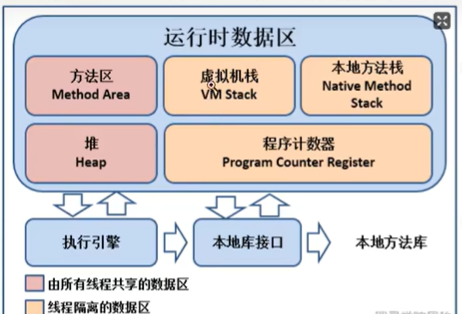
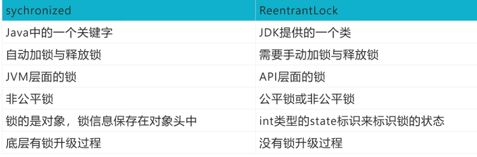

# 面试问题积累

## 基本概念

本文档用于在平常的项目学习/开发中遇到的概念性问题/开发性问题进行统一的积累，所谓见得多，才能走得远，深层次挖掘面试过程中的一些常见问题、开发过程中问题和一些高频的八股面试问题，为后续工作面试做准备，形成完善的问题积累库


## 简历篇

一份好的简历可以在整个申请面试以及面试的过程中起到非常重要的作用

个人介绍要放有用的信息，可以放技术博客，`Github`以及在校获奖经历

项目经历要突出且丰满

- 简历上的内容很大程度上决定了面试官提问的侧重点，技能的熟练度在很大程度上决定了面试官提问的深度（你在简历上写了的东西，就要做好被问的准备）
- 简历要尽可能的多写一点突出自己能力的内容，但是要精炼语言，不要过多废话
- 技术名词最好规范大小写，比如 `java->Java `，`spring boot -> Spring Boot `，细节也是重要的
- 中文和数字英文之间加上空格的话看起来会更舒服一点

如果有项目的话，技术面试第一步，面试官一般都是让你自己介绍一下你的项目。可以从几个点来考虑： 

1. 对项目整体设计的一个感受（面试官可能会让你画系统的架构图）
1. 在这个项目中你负责了什么、做了什么、担任了什么角色
1. 从这个项目中你学会了那些东西，使用到了那些技术，学会了那些新技术的使用
1. 你是如何协调项目组成员协同开发的或者在遇到某一个棘手的问题的时候你是如何解决的
1. 你在这个项目用了什么技术实现了什么功能比如：优化了数据库的设计减少了冗余字段、用 `redis  `做缓存提高了访问速度、使用消息队列削峰和降流、进行了服务拆分并集成了 `dubbo `和` nacos` 等。


技能介绍太杂，没有亮点。不需要全才，某个领域做得好就行了！


## 自我介绍篇

一个好的自我介绍应该包含这几点要素：

1. 用简单的话说清楚自己主要的技术栈于擅长的领域
2. 把重点放在自己在行的地方以及自己的优势之处
3. 重点突出自己的能力，比如自己的定位的 `bug `的能力特别厉害

一般建议的是准备好两份自 我介绍：一份对` hr `说的，主要讲能突出自己的经历，会的编程技术一语带过；另一份对技术面试官说的，主要讲自己会的技术细节和项目经验

> 面试官，您好！我叫***。读研期间我主要利用课外时间学习了 `Java` 以及 `Spring`、`MyBatis` 等框架 。在校期间参与过一个考试系统的开发，这个系统的主要用了 `Spring`、`MyBatis` 和 `shiro `这三 种框架。我在其中主要担任后端开发，主要负责了权限管理功能模块的搭建。另外，我在大学的时候参加过一次软件编程大赛，我和我的团队做的在线订餐系统成功获得了第二名的成绩。我还利用自己的业余时间写了一个简单的 `RPC` 框架，这个框架用到了 `Netty `进行网络通信， 目前我已经将 这个项目开源，在 `Github `上收获了 *k 的 `Star`! 
>
> 说到业余爱好的话，我比较喜欢通过博客整理分享自己所学知识，现在已经是多个博客平台的认证作者。 生活中我是一个比较积极乐观的人，一般 会通过运动打球的方式来放松。我一直都非常想加入贵公司，我觉得贵公司的文化和技术氛围我都 非常喜欢，期待能与你共事！


## 基础性问题

- 创建文件时，文件名一般是用英文的，为什么不使用中文呢？

  > 在创建文件名的时候，我们一般是将这个文件命名为与这个文件功能类似的英文名（当然可以包括字母，数字和下划线），不要使用中文，虽然使用中文在前端测试的时候是没有问题的，但是中文是宽字节，在不同的操作系统上可能会出现异常，当然，在英文命名的时候，也不建议使用大小写或者驼峰式的命名规范，直接都使用小写即可，如果是多个字符的情况，可以使用_或者-进行连接（根据单位开发规范而定）


## `Java`相关

- `JDK`、`JRE`和`JVM`之间的区别

  - `JDK`是`Java`标准开发包，它提供了编译、运行`Java`程序所需的各种工具和资源，包括`Java`编译器、`Java`运行时环境，以及常用的`Java`类库等
  - `JRE`是`Java`运行环境，用于运行`Java`的字节码文件。`JRE`中包括了`JVM`以及`JVM`工作所需要的类库，普通用户只需要安装`JRE`来运行`Java`程序，而程序开发者必须安装`JDK`来编译、调试程序
  - `JVM`是`Java`虚拟机，是`JRE`的一部分，是整个`Java`实现跨平台最核心的部分，负责运行字节码文件
  
  对于我们写的`Java`代码，想要运行，需要先编译成字节码，那就需要编译器，而`JDK`中就包含了编译器`javac`，编译之后的字节码，想要运行，就需要一个可以执行字节码的程序，这个程序就是`JVM`（`Java`虚拟机），专门用来执行`Java`字节码的。
  
  如果我们要开发`Java`程序，那就需要`JDK`，因为要编译`Java`源文件；如果我们只想要运行已经编译好的`Java`字节码文件，也就是`*.class`文件，那么就只需要`JRE`
  
  `JDK`中包含了`JRE`，`JRE`中包含了`JVM`
  
  另外，`JVM`在执行`Java`字节码时，需要把字节码解释为机器指令，而不同操作系统的机器指令有可能是不一样的，所以就导致不同操作系统上的`JVM`是不一样的，所以我们在安装`JDK`时需要选择操作系统
  
  另外，`JVM`是用来执行`Java`字节码的，所以凡是某个代码编译之后是`Java`字节码，都能在`JVM`上运行
  
- 什么是字节码？采用字节码的好处是什么？

  编译器（`Javac`）将`Java`源文件（`*.java`）编译成为字节码文件（`*.class`），可以做到一次编译到处运行，`windows`上编译好的`class`文件，可以直接在`linux`上运行，通过这种方式做到跨平台（字节码就相当于各个操作系统中`JVM`都认识的一门语言），不过`Java`的跨平台有一个前提条件，就是不同操作系统上安装的`JDK`或者`JRE`是不一样的，虽然字节码是通用的，但是需要把字节码解释成各种操作系统的机器码是需要不同解释器的，所以针对各个操作系统需要有各自的`JDK`或者`JRE`
  
  采用字节码的好处：一方面实现了跨平台，另外一方面也提高了代码执行的性能，编译器在编译源代码时可以做一些编译期间的优化，如锁消除、标量替换、方法内联等
  
- 浮点数在计算机中的存放形式

  > 浮点数=符号位+指数位+尾数位
  
- 字符类型的本质讨论

  1. 字符型数据存储到计算机中，需要将字符对应的码值（整数）找出来，如`'a'`字符：

     存储：`'a'`  --->  码值  --->   二进制    --->   存储

     读取：二进制   --->   97   --->   `'a'`   --->   显示

  2. 字符和码值的对应关系是通过字符编码决定的（是规定好的）常见的字符编码表有：

     - `ASCII`：一个字节表示，一共表示了128个字符，实际上一个字节可以表示256个字符，但是`ASCII`字符集只使用了128个字符，这个编码是为英文国家创建的，英文只有26个字母，加上一些符号，128个字符足够使用了
     - `Unicode`：`ASCII`表的一个扩展（`Unicode`码是兼容`ASCII`码的，同样的`'a'`都是用97来表示），固定大小的编码，使用两个字节来表示字符，字母和汉字统一都是占用两个字节，比较浪费空间
     - `utf-8`：大小可变的编码，可以使用1至6个字节来表示一个符号，根据不同的符号而变化字节长度，字母使用一个字节，汉字使用三个字节，在互联网中使用最广的一种`Unicode` 的实现形式
     - `gbk`：可以表示汉字，而且范围广，字母使用一个字节，汉字使用两个字节（编码的汉字种类较`utf-8`少，`utf-8`汉字是使用三个字节的，涉及到的汉字种类范围广）
     - `big5`：可以表示繁体中文

     不同的编码，对文件的大小是有影响的，有的编码汉字是用两个字节表示的，有的编码汉字是用三个字节表示的，会对保存的文件大小造成影响
  
- ```java
  int i = 1;
  i = i++;
  System.out.println(i);   // 结果显示1
  ```

  > 使用临时变量规则：`（1）temp = i; （2）i = i + 1; （3）i = temp`

  ```java
  int i = 1;
  i = ++i;
  System.out.println(i);   // 结果显示2
  ```

  > 使用临时变量规则：`（1）i = i + 1; （2）temp = i;（3）i = temp`
  >
  > 先自增，在赋值
  
- `hashCode()`与`equals()`之间的关系

  在`Java`中，每个对象都可以调用自己的`hashCode()`方法得到自己的哈希值（`hashCode`），相当于对象的指纹信息，通常来说世界上没有完全相同的两个指纹，但是在`Java`中做不到那么绝对，但是我们仍然可以利用`hashCode`来做一些提前的判断，如：

  - 如果两个对象的`hashCode`不相同，那么这两个对象肯定是不同的两个对象
  - 如果两个对象的`hashCode`相同，不代表这两个对象一定是同一个对象，也可能是两个对象
  - 如果两个对象相等，那么它们的`hashCode`就一定相同

  在`Java`的一些集合类的实现中，在比较两个对象是否相等，会根据上面的原则，会先调用对象的`hashCode()`方法得到`hashCode`进行比较，如果`hashCode`不相同，就可以直接认为这两个对象不相同，如果`hashCode`相同，那么就会进一步调用`equals()`方法进行比较。而`equals()`方法，就是用来最终确定两个对象是不是相等的。

  通常`equals()`方法的实现会比较重，逻辑比较多，而`hashCode()`主要就是得到一个哈希值，实际上就是一个数字，相对而言比较轻，所以在比较两个对象时，通常会先根据哈希值先比较一下

- `String`、`StringBuffer`、`StringBuilder`的区别

  - `String`是不可变的，如果尝试去修改，会新生成一个字符串对象，`StringBuffer`和`StringBuilder`是可变的
  - `StringBuffer`是线程安全的，`StringBuilder`是线程不安全的，所以在单线程环境下`StringBuilder`的效率更高

- 泛型中`extends`和`super`的区别

  对于一个类，其类中的方法，我们不确定传入什么类型的数据，我们就定义一个泛型`<E>`，对于具体的类型由用户使用的时候去进行指定，指定完具体的类型后，后续传入数据，必须是这个类型的数据，否则是编译不通过的，我们也可以在定义泛型的时候，去进行一些限制，可以使用`extends`和`super`进行限制

  - `<? extends T>`表示包括`T`在内的任何`T`的子类
  - `<? super T>`表示包括`T`在内的任何`T`的父类

- `==`和`equals`方法的区别

  - `==`：如果是基本数据类型，比较的是值，如果是引用类型，比较的是引用地址
  - `equals`：具体看各个类重写`equals`方法之后的比较逻辑，比如`String`类，虽然是引用类型，但是`String`类中重写了`equals`方法，方法内部比较的是字符串中的各个字符是否全部相等

- 深拷贝和浅拷贝之间的区别

  深拷贝和浅拷贝就是指对象的拷贝，一个对象中存在两种类型的属性，一种是基本数据类型，一种是实例对象的引用

  - 浅拷贝：只会拷贝基本数据类型的值，以及实例（属性）对象的引用地址，并不会复制一份引用地址所指向的对象，也就是浅拷贝出来的对象，内部的类属性指向的是同一个对象
  - 深拷贝：既会拷贝基本数据类型的值，也会针对实例对象的引用地址指向的对象进行复制，深拷贝出来的对象，内部的属性指向的不是同一个对象

- 重载和重写的区别

  - 重载：发生在同一个类中，方法名必须相同，参数类型不同、个数不同、顺序不同

    方法返回值和访问修饰符可以不同，不是重载，在编译时就会报错

  - 重写：发生在父子类中，方法名、参数列表必须相同，返回值范围小于等于父类，抛出的异常范围小于等于父类，访问修饰符范围大于等于父类；如果父类方法访问修饰符为`private`，则子类就不能重写该方法

- `List`和`Set`的区别

  - `List`：有序，按对象进入的顺序保存对象，可重复，允许多个`Null`元素对象，可以使用`Iterator`（迭代器）取出所有元素，在逐一遍历，还可以使用`get(int index)`获取指定下标的元素
  - `Set`：无序，不可重复，最多允许有一个`Null`元素对象，取元素时只能用`Iterator`接口取得所有元素，在逐一遍历各个元素

- `ArrayList`和`LinkedList`的区别

  1. 首先，它们的底层数据结构不同，`ArrayList`底层是基于数组实现的，`LinkedList`底层是基于链表实现的
  2. 由于底层的数据结构不同，它们所适用的场景也不同，`ArrayList`更适合随机查找，LinkedList更适合删除和添加，查询、添加、删除的时间复杂度不同
  3. `ArrayList`和`LinkedList`都实现了`List`接口，但是`LinkedList`还额外实现了`Deque`接口（双端队列的接口），所以`LinkedList`还可以当作队列来使用

- 谈谈`ConcurrentHashMap`的扩容机制

  - 对于`jdk`1.7及之前的版本
    1. `ConcurrentHashMap`是基于`Segment`分段实现的
    2. 每个`Segment`相对于一个小型的`HaspMap`
    3. 每个`Segment`内部会进行扩容，和`HashMap`的扩容逻辑类似
    4. 先生成新的数组，然后转移元素到新数组中
    5. 扩容的判断也是每个`Segment`内部单独判断的，判断是否超过阈值
  - 对于`jdk`1.8之后的版本
    1. `ConcurrentHashMap`不再基于`Segment`实现
    2. 当某个线程进行`put`时，如果发现`ConcurrentHashMap`正在进行扩容，那么该线程一起进行扩容
    3. 如果某个线程`put`时，发现没有正在扩容，则将`key-value`添加到`ConcurrentHashMap`中，然后判断是否超过阈值，超过了则进行扩容
    4. `ConcurrentHashMap`是支持多个线程同时扩容的
    5. 扩容之间也先生成一个新的数组
    6. 在转移元素时，先将原数组分组，将每组分给不同的线程来进行元素的转移，每个线程负责一组或多组的元素转移工作

- `Jdk1.7`到`Jdk1.8` `HashMap`底层发生了什么变化

  - 1.7中底层是数组+链表，1.8中底层是数组+链表+红黑树，加红黑树的目的是提高`HashMap`插入和查询的整体效率
  - 1.7中链表插入使用的是头插法，1.8中链表插入使用的是尾插法，因为1.8中插入`key`和`value`时需要判断链表元素个数（是否需要变成红黑树），所以需要遍历链表统计链表元素个数，所以正好就直接使用尾插法
  - 1.7中哈希算法比较复杂，存在各种右移与异或运算，1.8中进行了简化，因为复杂的哈希算法的目的就是提高散列性，来提供`HashMap`的整体效率，而1.8中新增了红黑树，所以可以适当简化哈希算法，节省`CPU`资源

- 简述一下`HashMap`的`Put`方法

  1. 根据`key`通过哈希算法和与运算得出数组下标
  2. 如果数组下标位置元素为空，则将`key`和`value`封装为`Entry`对象（`Jdk1.7`中是`Entry`对象，`Jdk1.8`中是`Node`对象）并放入该位置
  3. 如果数组下标位置元素不为空，则要分情况讨论
     - 如果是`Jdk1.7`，则先判断是否需要扩容，如果要扩容就进行扩容，如果不用扩容就生成`Entry`对象，并使用头插法添加到当前位置的链表中
     - 如果是`Jdk1.8`，则会先判断当前位置上的`Node`类型，看是红黑树`Node`，还是链表`Node`
       - 如果是红黑树`Node`，则将`key`和`value`封装为一个红黑树节点并添加到红黑树中去，在这个过程中会判断红黑树中是否存在当前`key`，如果存在则更新`value`
       - 如果此位置上的`Node`对象是链表节点，则将`key`和`value`封装为一个链表`Node`并通过尾插法插入到链表的最后位置去，因为是尾插法，所以需要遍历链表，在遍历链表的过程中会判断是否存在当前`key`，如果存在则更新`value`，当遍历完链表后，将新链表`Node`插入到链表中，插入到链表后，会看当前链表的节点个数，如果大于等于8，那么会将该链表转成红黑树
       - 将`key`和`value`封装为`Node`插入到链表或红黑树中后，再判断是否需要进行扩容，如果需要扩容就扩容，如果不需要就结束`PUT`方法

- `HashMap`的扩容机制原理

  扩容主要针对的数组扩容，链表是不需要进行扩容的

  - `Jdk1.7`版本
    1. 先生成新数组（大小通常为原数组的两倍）
    2. 遍历老数组中的每个位置上的链表上的每个元素
    3. 取每个元素的`key`，并基于新数组长度，计算出每个元素再新数组中的下标
    4. 将元素添加到新数组中去
    5. 所以元素转移完之后，将新数组赋值给`HashMap`对象的`table`属性
  - `Jdk1.8`版本
    1. 先生成新数组（大小通常为原数组的两倍）
    2. 遍历老数组中的每个位置上的链表或红黑树
    3. 如果是链表，则直接将链表中的每个元素重新计算下标，并添加到新数组中去
    4. 如果是红黑树，则先遍历红黑树，先计算出红黑树中每个元素对应在新数组中的下标位置
       - 统计每个下标位置的元素个数
       - 如果该位置下的元素个数超过了8个，则生成一个新的红黑树，并将根节点添加到新数组的对应位置
       - 如果该位置下的元素个数没有超过8个，那么则生成一个链表，并将链表的头节点添加到新数组的对应位置
    5. 所有元素转移完了之后，将新数组赋值给`HashMap`对象的`table`属性

- `CopyOnWriteArrayList`的底层原理是怎么样的

  相较于`ArrayList`的线程不安全（多个线程同时使用`ArrayList`对象，可能就会出现线程不安全的问题），`CopyOnWriteArrayList`的线程时安全的

  1. 首先`CopyOnWriteArrayList`内部也是用过数组来实现的，在向`CopyOnWriteArrayList`添加元素时，会复制一个新的数组，写操作在新数组上进行，读操作在原数组上进行
  2. 并且，写操作会加锁（涉及到锁的竞争），防止出现并发写入导致丢失数据的问题
  3. 写操作结束后会把原数组指向新数组
  4. `CopyOnWriteArrayList`允许在写操作时来读取数据，大大提高了读的性能，因此适合读多写少的应用场景，但是`CopyOnWriteArrayList`会比较占内存（每一次写操作都要复制一个新的数组），同时可能读到的数据不是实时最新的数据，所以不适合实时性要求很高的场景

- `Java`中的异常体系是怎么样的？

  - `Java`中的所有异常都来自顶级父类`Throwable`
  - `Throwable`下有两个子类`Exception`和`Error`
    - `Error`表示非常严重的错误，比如`java.lang.StackOverFlowError`和`java.lang.OutOfMemoryError`，通常这些错误出现时，仅仅想靠程序自己是解决不了的，可能是虚拟机、磁盘、操作系统层面出现了问题，所有通常也不建议在代码中去捕获这些`Error`，因为捕获的意义不大，因为程序可能已经根本运行不了了
    - `Exception`表示异常，表示程序出现`Exception`时，是可以靠程序自己来解决的，比如`NullPointerException`（空指针异常）等，我们可以捕获这些异常来做特殊处理，`Exception`的子类通常又可以分为`RuntimeException`和非`RuntimeException`
      - `RuntimeException`表示运行时异常（这些异常在编译时是发现不了的，但是在运行时就会将异常抛出，如除0异常），表示这个异常是在代码运行过程中抛出的，这些异常是非检查异常，程序中可以选择捕获处理，也可以不处理。这些异常一般是由程序逻辑错误引起的，程序应该从逻辑角度尽可能避免这类异常的发生，如`NullPointerException`（空指针异常）、`IndexOutOfBoundsException`（下标越界异常）等
      - 非`RuntimeException`表示非运行时异常（编译器就会给出异常），也就是我们常说的检查异常，是必须进行处理的异常（如抛出异常操作），如果不处理，程序就不能检查异常通过。如`IOException`、`SQLException`等以及用户自定义的`Exception`异常

- 在`Java`的异常处理机制中，什么时候应该抛出异常，什么时候捕获异常？

  异常相当于一种提示，如果我们抛出异常，就相当于告诉上层方法，我抛了一个异常，我处理不了这个异常，而对于上层方法来说，它也需要决定自己能不能处理这个异常，是否也需要交给它的上层。

  所以我们在写一个方法时，我们需要考虑的就是，本方法能否合理的处理该异常，如果处理不了就继续向上抛出异常，包括本方法在调用另一个方法时，发现出现了异常，如果这个异常应该自己来处理，那就捕获该异常并进行处理

  总之，能够处理就捕获异常，不能处理就抛出异常

- `Java`中有哪些类加载器

  `JDK`自带有三个类加载器：`BootstrapClassLoader`、`ExtClassLoader`、`AppClassLoader`

  - `BootstrapClassLoader`：是`ExtClassLoader`的父类加载器，默认负责加载`%JAVA_HOME%lib`下的`jar`包和`class`文件
  - `ExtClassLoader`：是`AppClassLoader`的父类加载器，负责加载`%JAVA_HOME%/lib/ext`文件夹下的`jar`包和`class`类
  - `AppClassLoader`：是自定义类加载器的父类，负责加载`classpath`（某个应用）下的类文件

  三个类加载器所管理的目录是不一样的

- 说说类加载器双亲委派模型

  `JVM`在加载一个类时，会调用`AppClassLoader`的`loadClass`方法来加载这个类，不过在这个方法中，会先使用`ExtClassLoader`的`loadClass`方法来加载类，同样`ExtClassLoader`的`loadClass`方法中会先使用`BootstrapClassLoader`来加载类，如果`BootstrapClassLoader`加载到了就直接成功，如果`BootstrapClassLoader`没有加载到，那么`ExtClassLoader`就会自己尝试加载该类，如果没有加载到，那么则会由`AppClassLoader`来加载这个类

  所以，双亲委派是针对于`AppClassLoader`类加载器，`JVM`在加载类时，会委派给`Ext`和`Bootstrap`进行加载，如果没有加载到才由自己进行加载

- `JVM`中哪些是线程共享区？

  堆区（存储由类产生的各个对象）和方法区（存储类的信息）是所有线程共享的，栈、本地方法栈、程序计数器是每个线程独有的

  

- 项目中如何排查`JVM`问题？

  - 对于还在正常运行的系统：
    1. 可以使用`jmap`来查看`JVM`中各个区域的使用情况
    2. 可以通过`jstack`来查看线程的运行情况，比如哪些线程阻塞、是否出现了死锁
    3. 可以通过`jstat`命令来查看垃圾回收的情况，特别是`fullgc`，如果发现`fullgc`比较频繁，那么就得进行调优了
    4. 通过各个命令的结果，或者`jvisualvm`等工具来进行分析
    5. 首先，初步猜测频繁发送`fullgc`的原因，如果频繁发生`fullgc`，但是又一直出现内存溢出，那么表示`fullgc`实际上是回收了很多对象了，所有这些对象最好能在`younggc`过程中就直接回收掉，避免这些对象进入到老年代，对于这种情况，就要考虑这些存活时间不长的对象是不是比较大，导致年轻代放不下，直接进入到了老年代，尝试加大年轻代的大小，如果改完后，`fullgc`减小，则证明修改有效
    6. 同时，还可以找到占用`CPU`最多的线程，定位到具体的方法，优化这个方法的执行，看是否能避免某些对象的创建，从而节省内存
  - 对于已经发生了`OOM`的系统：
    1. 一般生产系统中都会设置当系统发生了`OOM`时，生成当时的`dump`文件
    2. 我们可以利用`jsisualvm`等工具来分析`dump`文件
    3. 根据`dump`文件找到异常的实例对象，和异常的线程（占用`CPU`高的），定位到具体的代码
    4. 然后再进行详细的分析和测试

  总之，调优不是一蹴而就的，需要分析、推理、实践、总结、再分析，最终定位到具体的问题

- 一个对象从加载到`JVM`，再到被`GC`清除，都经历了什么过程？

  1. 首先把字节码文件内容加载到方法区
  2. 再根据类信息在堆区创建对象
  3. 对象首先会分配在堆区中年轻代的`Eden`区，经过一次`Minor GC`后，对象如果存活，就会进入`Suvivor`区。在后续的每次`Minor GC`中，如果对象一直存活，就会在`Suvivor`区来回拷贝，每移动一次，对象就会进入老年代
  4. 当年龄超过15之后，对象依然存活，对象就会进入老年代
  5. 如果经过`Full GC`，被标记为垃圾对象，那么就会被`GC`线程清理掉

- 怎么确定一个对象到底是不是垃圾？

  - 引用计数算法：这种方式是给堆内存当中的每个对象记录一个引用个数。引用个数为0的就认为是垃圾。这是早期`JDK`中使用的方式，引用计数无法解决循环引用的问题
  - 可达性算法：这种方式是在内存中，从根对象向下一直找引用，找到的对象就不是垃圾，没有找到的对象就是垃圾
  
- `JVM`有哪些垃圾回收算法？

  - 标记清除算法：

    1. 标记阶段：把垃圾内存对象标记出来
    2. 清除阶段：直接将垃圾内存对象回收

    这种算法是比较简单的，但是有个很严重的问题，就是会产生大量的内存碎片

  - 复制算法：为了解决标记清除算法的内存碎片问题，就产生了复制算法，将内存（`JVM`中的内存堆区）分为大小相等的两半，每次只使用其中一半。垃圾回收时，将当前这一块的存活对象（活跃的对象，不应该被清理的）全部拷贝到另一半，然后当前这一半内存就可以直接清除。这种算法没有内存碎片，但是它的问题就在于浪费空间。而且，它的效率跟存活对象的个数有关

  - 标记压缩算法：为了解决复制算法的缺陷，提出了标记压缩算法，这种算法在标记阶段跟标记清除算法是一样的，但是在完成标记之后，不是直接清理垃圾内存，而是将存活对象往一端移动，然后将边界以外的所有内存直接清除

- 什么是`STW`？

  `STW`：`Stop-The-World`，是在垃圾回收算法执行过程中，需要将`JVM`内存冻结的一种状态，`JAVA`的所有线程都是停止执行的`-GC`线程除外，`native`方法可以执行，但是，不能与`JVM`交互。`GC`各种算法优化的重点，就是减少`STW`，同时这也是`JVM`调优的重点

- 常用的`JVM`启动参数有哪些？

  在绝大部分业务场景下，常用的`JVM`配置参数有如下几个：

  - 设置堆空间：`-Xmx4g`（设置堆空间的最大值是4个`g`）  `-Xms4g`（设置堆空间的最小值是4个`g`）
  - 指定垃圾回收`GC`算法/垃圾回收器：`-XX:+UseG1GC -XX:MaxGCPauseMillis=50`（指定`G1`的垃圾回收器，`+`表示开启操作，设置最大垃圾回收站点的时间设置为50毫秒）
  - 指定`GC`线程的并行数：`-XX:ParallelGCThreads=4`
  - 打印`GC`日志：`-XX:+PrintGCDetails -XX:+PrintGCDateStamps`（打印日志详细信息和日志的时间戳）
  - 指定`GC`日志存入指定的日志文件：`-Xloggc:gc.log`
  - 指定`Meta`区（源空间）的最大值：`-XX:MaxMetaspaceSize=2g`
  - 设置单个线程栈的大小：`-Xss1m`
  - 指定堆内存溢出时自动进行`Dump`（如果`JVM`发生了内存溢出`OOM`，需要将当时的内存信息放入到一个`Dump`文件中，方便后续分析，默认情况下，在`jdk1.8`版本中是不开启的，需要我们进行手动开启）
    - 手动开启：`-XX:+HeapDumpOnOutOfMemoryError`
    - 指定存放的位置：`-XX:HeapDumpPath=/usr/local/`

- `Tomcat`中为什么要使用自定义类加载器？

  一个`Tomcat`中可以部署多个应用，而每个应用中都存在很多类，并且各个应用中的类是独立的，全类名是可以相同的，比如一个订单系统中可能存在`com.jlc.User`类，一个库存系统中可能也存在`com.jlc.User`类，一个`Tomcat`，不管内部部署了多少个应用，`Tomcat`启动之后就是一个`Java`进程，也就是一个`JVM`，所以如果`Tomcat`中只存在一个类加载器，比如默认的`AppClassLoader`，那么就只能加载一个`com.jlc.User`类，这是有问题的，而在`Tomcat`中，会为部署的每一个应用都生成一个类加载器实例，名字叫做`WebAppClassLoader`，这样`Tomcat`中每个应用就可以使用自己的类加载器去加载自己的类，从而达到应用之间的类隔离，不出现冲突。另外`Tomcat`还利用自定义加载器实现了热加载功能。

## 多线程和锁机制

- 说说对线程安全的理解

  线程安全指的是，我们写的某段代码，在多个线程同时执行这段代码时，不会产生混乱，依然能够得到正常的结果，比如`i++`，`i`初始化为0，那么两个线程来同时执行这行代码，如果代码是线程安全的，那么最终的结果应该就是一个线程的结果为1，一个线程的结果为2，如果出现了两个线程的结果都为1，则表示这段代码是线程不安全的

  所以线程安全，主要指的是一段代码在多个线程同时执行的情况下，能否得到正确的结果
  
- 对守护线程的理解

  线程分为用户线程和守护线程，用户线程就是普通线程，守护线程就是`JVM`的后台线程，比如垃圾回收线程就是一个守护线程，守护线程会在其他普通线程都停止运行之后自动关闭。我们可以通过设置`thread.setDaemon(true)`来把一个线程设置为守护线程

- `Java`中有哪几种方式来创建线程执行任务

  - 继承`Thread`类，去重写其`run`方法

    ```java
    public class testThread extends Thread {
        public static void main(String[] args) {
            testThread thread = new testThread();
            thread.start();   // 启动一个线程，执行run方法中的任务
        }
        
        @Override
        public void run() {
            System.out.println("hello");
        }
    }
    ```

    > 重写的是`run()`方法，而不是`start()`方法，但是占用了继承的名额，因为`Java`中的类是单继承的，使用`Thread`类，其本质上也是实现了`Runnable`接口的

  - 实现`Runnable`接口

    ```java
    public class testThread implements Runnable {
        public static void main(String[] args) {
            Thread thread = new Thread(new testThread());
            thread.start();   // 启动一个线程，执行run方法中的任务
        }
        
        public void run() {
            System.out.println("hello");
        }
    }
    ```

    > 实现`Runnable`接口，实现`run()`方法，使用依赖要用到`Thread`，这种方式更常用

    另外，进一步可以通过匿名内部类的方式，去生成一个`runnable`的对象

    ```java
    public class testThread {
        public static void main(String[] args) {
            Thread thread = new Thread(new Runnable() {
                public void run() {
                    System.out.println("hello");
                }
            });
            thread.start();   // 启动一个线程，执行run方法中的任务
        }
    }
    ```

    同时，又因为`Runnable`接口是一个函数式的接口（`Java8`中的新特性，即一个接口中只有一个方法），对于函数式接口，我们可以使用`lambda`表达式去启动一个线程，并执行任务

    ```java
    public class testThread {
        public static void main(String[] args) {
            Thread thread = new Thread(() -> System.out.println("hello"));
            thread.start();   // 启动一个线程，执行run方法中的任务
        }
    }
    ```

  - 实现`Callable`接口

    实现`Callable`接口相较于`Runnable`接口，在开启一个线程，并执行的基础上，使用实现`Callable`接口的方式，还可以拿到执行任务的结果

    ```java
    public class testThread implements Callable<String> {
        public static void main(String[] args) throws Exception {
            // 本质上FutureTask也是一个Runnable
            FutureTask<String> futureTask = new FutureTask<>(new testThread());
            Thread thread = new Thread(futureTask);
            thread.start();   // 启动一个线程，执行call方法中的任务
            // 获取执行完任务后的结果
            String result = futureTask.get();
            System.out.println(result);
        }
        
        public void call() {
            return "hello";
        }
    }
    ```

    > 实现`Callable`接口，实现`call()`方法，使用`Thread+FutureTask`配合，支持拿到异步执行任务的结果

  - 利用线程池来创建线程

    ```java
    public class testThread implements Runnable {
        public static void main(String[] args) throws Exception {
            ExecutorService executorService = Executors.newFixedThreadPool(10);
            executorService.execute(new testThread());  // 线程池帮助开启一个线程，执行
        }
        
        public void run() {
            System.out.println("hello");
        }
    }
    ```

    > 实现`Callable`接口或者`Runnable`接口都可以，由`ExecutorService`来创建线程

  不管上面四种方式怎么进行修改，其底层都是实现了`Runnable`的接口

- 为什么不建议使用`Executors`来创建线程池

  当我们使用``Executors``创建线程池（`FixedThreadPool`）时，对应的底层构造方法为：

  ```java
  public static ExecutorService newFixedThreadPool(int nThreads) {
      return new ThreadPoolExecutor(nThreads, nThreads, 0L, TimeUnit.MILLISECONDS, new LinkedBlockingQueue<Runnable>());
  }
  ```

  发现创建的队列为`LinkedBlockingQueue`，是一个无界阻塞队列，如果使用该线程池执行任务，如果任务过多就会不断的添加到队列中，任务越多占用的内存就越多，最终可能耗尽内存，导致`OOM`

  同样，当我们使用`Executors`创建`SingleThreadExecutor`时，创建的队列也是`LinkedBlockingQueue`

  总结：使用`Executors`来创建线程池除了会造成`OOM`之外，我们使用`Executors`来创建线程池也不能自定义线程的名字，不利于排查问题，所以建议直接使用`ThreadPoolExecutor`来定义线程池，可以灵活控制

- 线程池有哪几种状态？每种状态分别表示什么意思？

  - `RUNNING`：表示线程池正常运行，即能接受新任务，也会正常处理队列中的任务
  - `SHUTDOWN`：当调用线程池的`shutdown()`方法时，线程池就进入`SHUTDOWN`状态，表示线程池处于正在关闭状态，此状态下线程池不会接受新任务，但是会继续把队列中的任务处理完
  - `STOP`：当调用线程池的`shutdownnow()`方法时，线程池就进入`STOP`状态，表示线程池处于正在停止状态，此状态下线程池既不会接受新任务了，也不会处理队列中的任务，并且正在运行的线程也会被中断
  - `TIDYING`：线程池中没有线程运行后，线程池的状态就会自动变为`TIDYING`，并会调用`terminated()`，该方法是空方法，留给程序员进行拓展
  - `TERMINATED`：`terminated()`方法执行完后，线程池状态就会变为`TERMINATED`

- `ThreadLocal`有哪些应用场景？底层是如何实现的？

  `ThreadLocal`是`Java`中提供的线程本地存储机制，可以利用该机制将数据缓存在某个线程内部，该线程可以在任意时刻、任意方法中获取缓存的数据

  `ThreadLocal`底层是通过`ThreadLocalMap`来实现的，每个`Thread`对象（注意不是`ThreadLocal`对象）中都存储在一个`ThreadLocalMap`中，`Map`的`key`为`ThreadLocal`对象，`Map`的`value`为需要缓存的值

  `ThreadLocal`经典的应用场景就是连接管理（一个线程持有一个连接，该连接对象可以在不同的方法之间进行传递，线程之间不共享同一个连接）

  但是在连接池中使用`ThreadLocal`会造成内存泄漏（有数据占用了这个内存，但是数据没有被使用，其他数据也不能在该内存地址中写入数据），因为当`ThreadLocal`对象使用完之后，应该要把设置的`key`、`value`，也就是`Entry`对象进行回收，但是线程池中的线程不会回收，而线程对象是通过强引用指向`ThreadLocalMap`，`ThreadLocalMap`也是通过强引用指向`Entry`对象，线程不被回收，`Entry`对象也就不会被回收，从而出现内存泄漏，通常的解决方法是，在使用了`ThreadLocal`对象之后，手动调用`ThreadLocal`的`remove`方法，手动删除`Entry`对象

- `Sychronized`和`ReentrantLock`有哪些不同点？

  

- `ReentrantLock`分为公平锁和非公平锁，那底层分别是如何实现的？

  不管是公平锁还是非公平锁，它们的底层实现都会使用`AQS`来进行排队，它们的区别在于线程在使用`lock()`方法加锁时：

  1. 如果是公平锁，会先检查`AQS`队列中是否存在线程在排队，如果有线程在排队，则当前线程也进行排队
  2. 如果是非公平锁，则不会去检查是否有线程在排队，而是直接竞争锁（当没有竞争到，再进行排队）

  不管是公平锁还是非公平锁，一旦没有竞争到锁，都会进行排队，当锁释放时，都是唤醒排在最前面的线程，所以非公平锁只是体现在了加锁阶段，而没有体现在线程被唤醒阶段，`ReentrantLock`是可重入锁，不管是公平锁还是非公平锁都是可以重入的（同一个线程中，可以重复的加入锁）

- `Sychronized`的偏向锁、轻量级锁和重量级锁/`Sychronized`的锁升级过程是怎么样的？

  - 偏向锁：在锁对象的对象头中记录一下当前获取到该锁的线程`ID`，该线程下次如果又来获取该锁就可以直接获取到了，也就是支持锁重入
  - 轻量级锁：由偏向锁升级而来，当一个线程获取到锁后，此时这把锁就是偏向锁，此时如果有第二个线程来竞争锁，偏向锁就会升级为轻量级锁，之所以叫轻量级锁，是为了和重量级锁区分开来，轻量级锁底层是通过自旋来实现的，并不会阻塞线程
  - 如果自旋次数过多仍然没有获取到锁，则会升级为重量级锁（我们尽可能保证我们的锁不要成为重量级锁），重量级锁会导致线程阻塞
  - 自旋锁：自旋锁就是线程在获取锁的过程中，不会去阻塞线程，也就无所谓唤醒线程，阻塞和唤醒这两个步骤都是需要操作系统去进行的，比较耗费时间，自旋锁是通过`CAS`获取预期的一个标记，如果没有获取到，则继续循环获取，如果获取到了（标记为0，表示这把锁目前没有被使用），则表示获取到了锁，这个过程线程一直在运行中，相对而言没有使用太多的操作系统资源，比较轻量

- 谈谈对`AQS`的理解，`AQS`如何实现可重入锁？

  1. `AQS`是一个`Java`线程同步的框架，是`JDK`中很多锁工具的核心实现框架
  2. 在`AQS`中，维护了一个信号量`state`和一个线程组成的双向链表队列，其中，这个线程队列，就是用来给线程排队的，而`state`就像是一个红绿灯，用来控制线程排队或者放行的。在不同的场景下，有不同的意义
  3. 在可重入锁这个场景下，`state`就用来表示加锁的次数，0表示无锁，每加一次锁，`state`就加1，释放锁`state`就减1
  
- `ThreadLocal`的底层原理

  1. `ThreadLocal`是`Java`中所提供的线程本地存储机制，可以利用该机制将数据缓存在某个线程内部，该线程可以在任意时刻，任意方法中获取缓存的数据
  2. `ThreadLocal`底层是通过`ThreadLocalMap`来实现的，每个`Thread`对象（注意不是`ThreadLocal`对象）都存在一个`ThreadLocalMap`，`Map`的`key`为`ThreadLocal`对象，`Map`的`value`为需要缓存的值
  3. 如果在线程池中使用`ThreadLocal`会造成内存泄漏，因为当`ThreadLocal`对象使用完之后，应该要把设置的`key`，`value`，也就是`Entry`对象进行回收，但线程池中的线程不会回收，而线程对象是通过强引用指向`ThreadLocalMap`，`ThreadLocalMap`也是通过强引用指向`Entry`对象，线程不被回收，`Entry`对象也就不会回收，从而出现内存泄漏，解决方法是，在使用了`ThreadLocal`对象之后，手动调用`ThreadLocal`的`remove`方法，手动清除`Entry`对象
  4. `ThreadLocal`经典的应用场景就是连接管理（一个线程持有一个连接，该连接对象可以在不同的方法之间进行传递，线程之间不共享同一个连接）
  
  基本使用：
  
  ```java
  public class User {
      private ThreadLocal<String> name;
      
      public void setName() {
          name.set("jlc");
      }
      
      public void getName() {
          String s = this.name.get();  // 将存在本地线程中的内容取出
          name.remove();  // 手动调用remove方法进行删除，防止内存泄漏
      }
  }
  ```
  
- 并发、并行、串行之间的区别

  - 串行：一个任务执行完，才能执行下一个任务
  - 并行（`Parallelism`）：两个任务同时执行
  - 并发（`Concurrency`）：两个任务整体看上去是同时执行，在底层，两个任务被拆成了很多份，然后一个一个执行，站在更高的角度来看两个任务是同时在执行的

- `Java`中如何避免死锁？

  造成死锁的几个原因：

  - 一个资源每次只能被一个线程使用
  - 一个线程在阻塞等待某个资源时，不释放已占有资源
  - 一个线程已经获得的资源，在未使用完之前，不能被强行剥夺
  - 若干个线程形成头尾相接的循环等待资源关系

  上述四个是造成死锁必要的四个条件，如果要避免死锁，只需要不满足其中一个条件即可，而其中前3个条件是作为锁要符合的条件，所以要避免死锁就需要打破第4个条件，不出现循环等待锁的关系

  在开发过程中：

  - 要注意加锁顺序，保证每个线程按同样的顺序进行加锁（都统一先加`A`锁，再加`B`锁）
  - 要注意加锁时限，可以针对锁设置一个超时时间（对于一直获取不到`B`锁的情况，如果超过了超时时间，该线程还是没有得到，就会将该线程原先占有的`A`锁释放掉）
  - 要注意死锁检查，这是一种预防机制，确保在第一时间发现死锁并进行解决
  
- 线程池的底层工作原理

  线程池内部是通过队列+线程实现的，当我们利用线程池执行任务时：

  1. 如果此时线程池中的线程数量小于`corePoolSize`（核心线程数），即使线程池中的线程都处于空闲状态，也要创建新的线程（达到核心线程数）来处理被添加的任务
  2. 如果此时线程池中的线程数量等于`corePoolSize`，线程池中线程处于忙碌的状态，但是缓冲队列`workQueue`未满，那么任务被放入缓冲队列
  3. 如果此时线程池中的线程数量大于等于`corePoolSize`，缓冲队列`workQueue`满了，并且线程池中的数量小于`maximumPoolSize`（最大线程数），会创建新的线程来处理被添加的任务
  4. 如果此时线程池中的线程数量大于`corePoolSize`，缓冲队列`workQueue`满了，并且线程池中的数量等于`maximumPoolSize`，那么通过`handler`所指定的策略（拒绝策略）来处理此任务
  5. 当线程池中线程数量大于`corePoolSize`时，如果某线程空闲时间超过`keepAliveTime`，线程将被终止。这样，线程池可以动态的调整池中的线程数

- 线程池为什么是先添加队列而不是先创建最大线程？

  线程池工作的流程：当线程池中的核心线程都在忙时，如果继续往线程池中添加任务，那么任务会先放入队列。

  队列满了之后，才会新开线程。这就相当于，一个公司本来有10个程序员，本来这10个程序员能正常的处理各种需求，但是随着公司的发展，需求在慢慢的增加，但是一开始这些需求只会增加在待开发列表中，然后这10个程序员加班加点的从待开发列表中获取需求并进行处理，但是某一天待开发列表满了，公司发现现有的10个程序员是真的处理不过来了，所以就开始招新程序员了

- `ReentrantLock`中的公平锁和非公平锁的底层实现

  首先，不管是公平锁还是非公平锁，它们的底层实现都会使用`AQS`来进行线程排队，它们的区别在于：线程在使用`lock()`方法加锁时，如果是公平锁，会先检查`AQS`队列中是否存在线程在排队，如果有线程在排队，则当前线程也进行排队，如果是非公平锁，则不会去检查是否有线程在排队，而是直接竞争锁。

  不管是公平锁还是非公平锁，一旦没有竞争到锁，都会进行排队，当锁释放时，都是唤醒排在最前面的线程，所以非公平锁只是体现在了线程加锁阶段，而没有体现在线程被唤醒阶段。

  另外，`ReentrantLock`是可重入锁，不管是公平锁还是非公平锁都是可重入的

- `ReentrantLock`中`tryLock()`和`lock()`方法的区别是什么？

  - `tryLock()`表示尝试加锁，可能加到，也可能加不到，该方法不会阻塞线程，如果加到锁则返回`true`，没有加到则返回`false`
  - `lock()`表示阻塞加锁，线程会阻塞直到加到锁，方法也没有返回值

- `CountDownLatch`和`Semaphore`的区别和底层原理

  - `CountDownLatch`表示计数器，可以给`CountDownLatch`设置一个数字，一个线程调用`CountDownLatch`的`await()`方法时，将会阻塞，其他线程可以调用`CountDownLatch`的`countDown()`方法来对`CountDownLatch`中的数字减一，当数字被减成0后，所有`await`的线程都将被唤醒（后续具体哪一个线程拿到锁是不一定的）

    对应的底层原理就是，调用`await()`方法的线程会利用`AQS`排队，一旦数字被减为0，则会将`AQS`中排队的线程依次唤醒

  - `Semaphore`表示信号量，可以设置许可的个数，表示同时允许最多多少个线程使用该信号量，通过`acquire()`来获取许可，如果没有许可可用（可申请）则线程阻塞，并通过`AQS`来排队，可以通过`release()`方法来释放许可，当某个线程释放了某个许可后，会从`AQS`中正在排队的第一个线程开始依次唤醒，直到没有空闲许可


## `SSM`相关

- 谈谈对`IOC`的理解

  `IOC`表示控制反转

  - 控制：控制对象的创建；控制对象内属性的赋值

  - 反转：反转表示一种对象控制权的转移

    如果我们不用`Spring`，那么我们就需要自己来做控制中的两件事，反过来，我们使用`Spring`，这两件事情就不需要我们做了，我们需要做的仅仅是定义类，以及定义哪些属性需要`Spring`来赋值

  - 总之，`IOC`表示控制反转，表示如果用`Spring`，那么`Spring`会负责来创建对象，以及给对象内的属性赋值，即使用`Spring`，那么对象的控制权会转交给`Spring`

- 单例`Bean`和单例模式的区别

  - 单例模式（设计模式的一种）表示`JVM`中某个类的对象只会存在唯一一个
  
  - 单例`Bean`并不表示`JVM`中只能存在唯一的某个类的`Bean`对象
  
    单例`Bean`指的是在向`Spring`容器中获取`Bean`时，通过相同的名字，可以拿到同样的对象（在这个范围内，单例`Bean`是符合单例模式的）
  
- `Spring`事务传播机制

  多个事务方法相互调用时，事务如何在这些方法间传播，方法`A`是一个事务的方法，方法`A`执行过程中调用了方法`B`，那么方法`B`有无事务以及方法`B`对事务的要求不同都会对方法`A`的事务具体执行造成影响，同时方法`A`的事务对方法`B`的事务执行也有影响，这种影响具体是什么就由两个方法所定义的事务传播类所决定

  - `REQUIRED`（`String`默认的事务传播类型）：如果当前没有事务，则自己新建一个事务；如果当前存在事务，则加入这个事务
  - `SUPPORTS`：当前存在事务，则加入当前事务；如果当前没有事务，就以非事务方法执行
  - `MANDATORY`：当前存在事务，则加入当前事务；如果当前事务不存在，则抛出异常
  - `REQUIRES_NEW`：创建一个新事务，如果存在当前事务，则挂起该事务
  - `NOT_SUPPORTED`：以非事务方式执行；如果当前存在事务，则挂起当前事务
  - `NEVER`：不使用事务，如果当前事务存在，则抛出异常
  - `NESTED`：如果当前事务存在，则在嵌套事务中执行；否则与`REQUIRED`的操作一样（开启一个事务）

- `Spring`事务什么时候会失效？

  `Spring`事务的原理是`AOP`，进行了切面增强，那么失效的根本原因就是`AOP`不起作用了，常见的情况有如下几种：

  - 发生自调用，类里面使用`this`调用本类的方法（`this`通常省略），此时这个`this`对象不是代理类，而是`UserService`对象本身。其解决方法很简单，让那个`this`变成`UserService`代理类即可
  - 方法不是`public`的：`@Transactional`只能用于`public`的方法上，否则事务不会失效，如果要用在非`public`方法上，可以开启`AspecU`代理模式
  - 数据库不支持事务
  - 没有被`spring`管理
  - 异常被吃掉，事务不会回滚（或者抛出的异常没有被定义，默认为`RuntimeException`）

- `Spring`中的`Bean`是线程安全的吗？

  `Spring`本身并没有针对`Bean`做线程安全的处理，所以：

  - 如果`Bean`是无状态的，那么`Bean`则是线程安全的
  - 如果`Bean`是有状态的，那么`Bean`则不是线程安全的

  对于无状态和有状态的解释：对于`Bean`中的某些方法，去操作`Bean`中的某一些属性，那这个`Bean`就是有状态的（属性会在不同的时候发生一些变化），两个线程同时访问同一个`Bean`中的同一个方法，同时都会修改当前`Bean`中的某一个属性，那么就会出现线程不安全的问题

  另外，`Bean`是不是线程安全，跟`Bean`的作用域没有关系，`Bean`的作用域只是表示`Bean`的生命周期范围，对于任何生命周期的`Bean`都是一个对象，这个对象是不是线程安全的，还是得看这个`Bean`对象本身（`Bean`中的各种方法和属性是否是线程安全的）

- `Spring`中的`Bean`创建的生命周期有哪些步骤

  `Spring`中一个`Bean`的创建大概分为以下的步骤：

  1. 推断构造方法（选择具体使用哪个构造方法）
  2. 实例化（通过选择的构造方法进行实例化）
  3. 填充属性，也就是依赖注入
  4. 处理`Aware`回调
  5. 初始化前，处理`@PostConstruct`注解（`Bean`中方法中是否有注解）
  6. 初始化，处理`InitializingBean`接口
  7. 初始化后，进行`AOP`

- `ApplicationContext`和`BeanFactory`有什么区别

  `BeanFactory`是`Spring`中非常核心的组件，表示`Bean`工厂，可以生成`Bean`，维护`Bean`；而`ApplicationContext`继承了`BeanFactory`，所以`ApplicationContext`拥有`BeanFactory`所有的特点，也是一个`Bean`工厂，但是`ApplicationContext`除了继承`BeanFactory`之外，还继承了如`EnvironmentCapable`、`MessageSource`等接口，从而`ApplicationContext`还有获取系统环境变量、国际化、事件发布等功能，这是`BeanFactory`所不具备的

- `Spring`中的事务是如何实现的

  1. `Spring`事务底层是基于数据库事务和`AOP`机制的
  2. 首先对于使用了`@Transaction`注解的`Bean`，`Spring`会创建一个代理对象作为`Bean`
  3. 当调用代理对象的方法时，会先判断该方法上是否加了`@Transaction`注解
  4. 如果加了，那么则利用事务管理器创建一个数据库连接
  5. 并且修改数据库连接的`autocommit`属性为`false`，禁止此连接的自动提交，这是实现`Spring`事务非常重要的一步
  6. 然后执行当前方法后，方法中会执行`sql`
  7. 执行完当前方法后，如果没有出现异常就直接提交事务
  8. 如果出现了异常，并且这个异常是需要回滚的就回滚事务，否则仍然提交事务
  9. `Spring`事务的隔离级别对应的就是数据库的隔离级别
  10. `Spring`事务的传播机制是`Spring`事务自己实现的，也是`Spring`事务中最复杂的
  11. `Spring`事务的传播机制是基于数据库连接来做的，一个数据库连接一个事务，如果传播机制配置为需要新开一个事务，那么实际上就是先建立一个数据连接，在此新数据库连接上执行`sql`

- `Spring`中什么时候`@Transaction`会失效

  因为`Spring`事务是基于代理来实现的，所以某个加了`@Transaction`的方法只有是被代理对象调用时，那么这个注解才会生效，所以如果是被代理对象来调用这个方法，那么`@Transaction`是不会失效的

  同时如果某个方法是`private`的，那么`@Transaction`也会失效，因为底层`cglib`是基于父子类来实现的，子类是不能重载父类的`private`方法的，所以无法很好的利用代理，也会导致`@Transaction`失效

- `Spring`容器启动流程是怎么样的

  1. 在创建`Spring`容器，也就是启动`Spring`时
  2. 首先会进行扫描，扫描得到所有的`BeanDefinition`对象，并存入一个`Map`中
  3. 然后筛选出非懒加载的单例`BeanDefinition`进行创建`Bean`，多例`Bean`不需要在启动过程中去进行创建，而是在每次获取`Bean`时利用`BeanDefinition`动态创建；
  4. 利用`BeanDefinition`创建`Bean`就是`Bean`的创建生命周期，这期间包括了：
     - 合并`BeanDefinition`
     - 推断构造方法
     - 实例化
     - 属性填充
     - 初始化前
     - 初始化后（`AOP`在此阶段发生）
  5. 单例`Bean`创建完成后，`Spring`会发布一个容器启动事件
  6. `Spring`启动完成
  7. 在源码中会更复杂，比如源码中会提供一些模板方法，让子类来实现；如源码中还涉及到一些`BeanFactoryPostProcessor`（如扫描）和`BeanPostProcessor`（如依赖注入）的注册；
  8. 在启动过程中还会处理`@Import`等注解

- `Spring`用到了哪些设计模式

  - 工厂模式：`BeanFactory`、`FactoryBean`、`ProxyFactory`
  - 原型模式：多例`Bean`
  - 单例模式：单例`Bean`
  - 构造器模式：`BeanDefinition`构造器、解析并构造`@AspectJ`注解的`Bean`中所定义的`Advisor`
  - 适配器模式：将`@EventListener`注解的方法适配成`ApplicationListener`
  - 访问者模式：属性访问器，用来访问和设置某个对象的某个属性
  - 装饰器模式：比单纯的`Bean`对象功能更加强大
  - 代理模式：`AOP`
  - 观察者模式：事件监听机制
  - 策略模式：`Spring`需要根据`BeanDefinition`来实例化`Bean`，但是具体可以选择不同的策略来进行实例化

- `SpringBoot`中常用注解及其底层实现

  1. `@SpringBootApplication`注解：这个注解标识了一个`SpringBoot`工程，它实际上是另外三个注解的组合，这三个注解是：
     - `@SpringBootConfiguration`：这个注解实际就是一个`@Configuration`，表示启动类也是一个配置类
     - `@EnableAutoConfiguration`：向Spring容器中导入了一个`Selector`，用来加载`ClassPath`下`SpringFactories`中所定义的自动配置类，将这些自动加载为配置`Bean`
     - `@ComponentScan`：标识扫描路径，因为默认是没有配置实际扫描路径，所以`SpringBoot`扫描的路径是启动类所在的当前目录
  2. `@Bean`注解：用来定义`Bean`，类似于`XML`中的`<bean>`标签，`Spring`在启动时，会对加了`@Bean`注解的方法进行解析，将方法的名字作为`beanName`，并通过执行方法得到`bean`对象
  3. `@Controller`、`@Service`、`@ResponseBody`、`@Autowired`都可以介绍

- `SpringBoot`是如何启动`Tomcat`的

  1. 首先，`SpringBoot`在启动时会先创建一个`Spring`容器
  2. 在创建`Spring`容器过程中，会利用`@ConditionalOnClass`技术来判断当前`classpath`中是否存在`Tomcat`依赖，如果存在则会生成一个启动`Tomcat`的`Bean`
  3. `Spring`容器创建完之后，就会获取启动`Tomcat`的`Bean`，并创建`Tomcat`对象，并绑定端口等，然后启动`Tomcat`

- `MyBatis`的优缺点

  优点

  1. 基于 `SQL` 语句编程，相当灵活，不会对应用程序或者数据库的现有设计造成任何影响。`SQL` 写在 `XML` 里，解除` SQL `与程序代码的耦合，便于统一管理；提供` XML` 标签，支持编写动态` SQL `语句，并可重用
  2. 与` JDBC `相比，减少了 50% 以上的代码量，消除了` JDBC `大量冗余的代码，不需要手动开关连接
  3. 很好的与各种数据库兼容（因为 `MyBatis` 使用 `JDBC `来连接数据库，所以只要` JDBC` 支持的数据库 `MyBatis `都支持）
  4. 能够与 `Spring` 很好的集成
  5. 提供映射标签，支持对象与数据库的 `ORM` 字段关系映射；提供对象关系映射标签，支持对象关系组件维护

  缺点：

  1. `SQL `语句的编写工作量较大，尤其当字段多、关联表多时，对开发人员编写 `SQL `语句的能力有一定要求
  2. `SQL` 语句依赖于数据库，导致数据库移植性差，不能随意更换数据库

- 在`MyBatis`中，`#{}`和`${}`的区别是什么？

  `#{}`是预编译处理、是占位符；`${}`是字符串替换、是拼接符

  `MyBatis`在处理`#{}`时，会将`sql`中的`#{}`替换为`?`号，调用`PreparedStatement`来赋值

  `MyBatis`在处理`${}`时，会将`sql`中的`${}`替换成变量的值，调用`Statement`来赋值

  使用`#{}`可以有效的防止`SQL`注入，提高系统安全性

- 索引的基本原理

  索引用来快速地寻找哪些具有特定值的记录（索引实际上就是一种数据结构）。如果没有索引，一般来说执行查询时会遍历整张表

  索引的原理：就是把无序的数据变成有序的查询

  1. 把创建了索引的列的内容进行排序
  2. 对排序结果生成倒排表
  3. 在倒排表内容上拼接上数据地址链
  4. 在查询的时候，先拿到倒排表内容，再取出数据地址链，从而拿到具体数据
