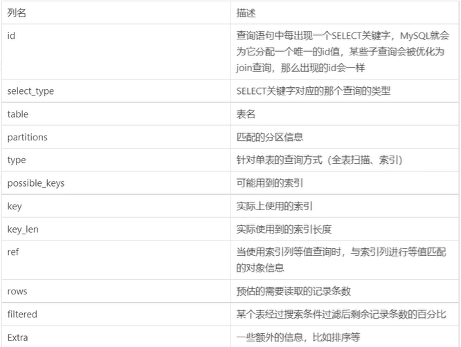
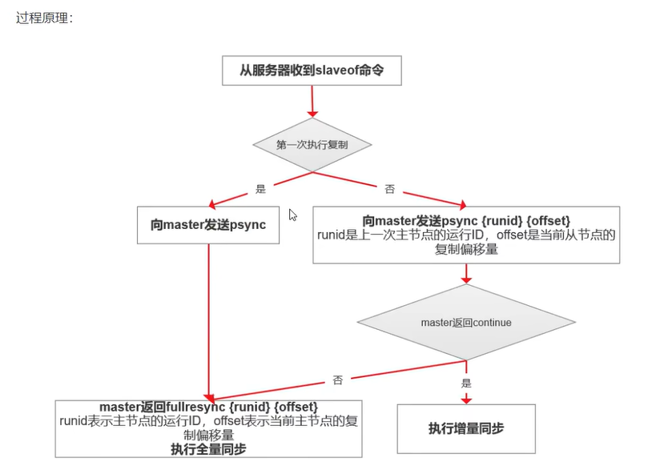
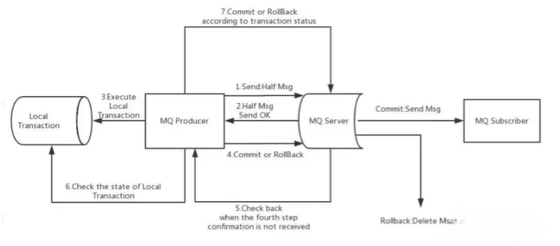
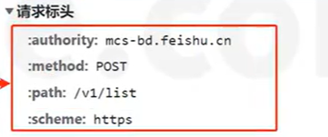
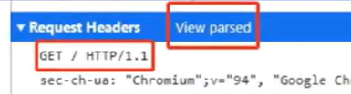
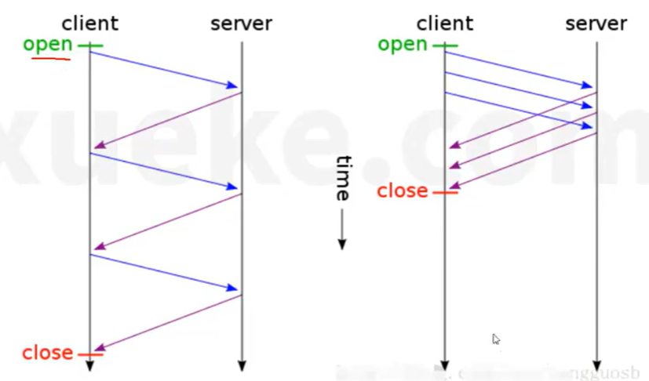
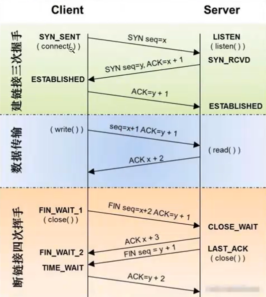

# 面试问题积累

## 基本概念

本文档用于在平常的项目学习/开发中遇到的概念性问题/开发性问题进行统一的积累，所谓见得多，才能走得远，深层次挖掘面试过程中的一些常见问题、开发过程中问题和一些高频的八股面试问题，为后续工作面试做准备，形成完善的问题积累库

- 准备一个面试，我们要对**简历上的技术细节**，进行全面的准备，一般，面试官问的内容80%都是你简历上的技术/项目细节，对简历中的内容，我们要做好深入的挖掘和思考，对项目中的技术和技术栈中的技术细节，着重的去准备知识点和八股文
- 对于八股文，我们要用自己的话术去整理和总结
- 要结合个人的经验是否与这个面试的岗位匹配
- 平时多多锻炼自己的语言表达能力
- 在复习八股文的时候，我们不要先去看答案，我们要当成这个问题就是面试官问你的问题，我们要怎么去回答，我们用自己整理的话术去回答，不会吞吞吐吐，这样就不会在真实面试中因为紧张导致脑子空白了
- 回答八股文问题的关键点：1. 回答出问题的本身；2. 结合真实的项目或者案例来回答；3. 可以做一些引导，引导到我们的项目中来


## 简历篇

一份好的简历可以在整个申请面试以及面试的过程中起到非常重要的作用

个人介绍要放有用的信息，可以放技术博客，`Github`以及在校获奖经历

项目经历要突出且丰满

- 简历上的内容很大程度上决定了面试官提问的侧重点，技能的熟练度在很大程度上决定了面试官提问的深度（你在简历上写了的东西，就要做好被问的准备）
- 简历要尽可能的多写一点突出自己能力的内容，但是要精炼语言，不要过多废话
- 技术名词最好规范大小写，比如 `java->Java `，`spring boot -> Spring Boot `，细节也是重要的
- 中文和数字英文之间加上空格的话看起来会更舒服一点

如果有项目的话，技术面试第一步，面试官一般都是让你自己介绍一下你的项目。可以从几个点来考虑： 

1. 对项目整体设计的一个感受（面试官可能会让你画系统的架构图）
1. 在这个项目中你负责了什么、做了什么、担任了什么角色
1. 从这个项目中你学会了那些东西，使用到了那些技术，学会了那些新技术的使用
1. 你是如何协调项目组成员协同开发的或者在遇到某一个棘手的问题的时候你是如何解决的
1. 你在这个项目用了什么技术实现了什么功能比如：优化了数据库的设计减少了冗余字段、用 `redis  `做缓存提高了访问速度、使用消息队列削峰和降流、进行了服务拆分并集成了 `dubbo `和` nacos` 等。

技能介绍太杂，没有亮点。不需要全才，某个领域做得好就行了！


## 自我介绍篇

一个好的自我介绍应该包含这几点要素：

1. 用简单的话说清楚自己主要的技术栈于擅长的领域
2. 把重点放在自己在行的地方以及自己的优势之处
3. 重点突出自己的能力，比如自己的定位的 `bug `的能力特别厉害

一般建议的是准备好两份自 我介绍：一份对` hr `说的，主要讲能突出自己的经历，会的编程技术一语带过；另一份对技术面试官说的，主要讲自己会的技术细节和项目经验

> 面试官，您好！我叫...，本科和研究生就读于...。读研期间我主要利用课外时间学习了 `Java` 以及 `Spring`、`MyBatis` 等框架 。我有一段为期9个月的前端实习经历，系统的参与了两个核心项目的开发，我在其中主要担任前端的开发，主要负责了可视化界面的搭建和展示，在实习中，我不断积累项目的开发经验和团队协助能力，养成了在日常的开发中不断的留痕的习惯。另外，我在大学的时候积极的参加了一些竞赛，如浙江省机器人竞赛和数学建模竞赛等，也取得了一些不错的成绩。同时，我还利用自己的业余时间编写了一些实用且有意义的开源项目，如前端脚手架、简易的博客项目等等， 目前我已经将这些项目开源，在`Github `和`Gitee`上都进行了展示。
>
> 说到业余爱好的话，我比较喜欢通过上传整理分享自己所学知识，也有自己搭建的个人笔记仓库主页。 生活中我是一个比较积极乐观的人，一般会通过运动打球的方式来放松。我一直都非常想加入贵公司，我觉得贵公司的文化和技术氛围我都非常喜欢，期待能与你共事！


## 基础性问题

- 创建文件时，文件名一般是用英文的，为什么不使用中文呢？

  > 在创建文件名的时候，我们一般是将这个文件命名为与这个文件功能类似的英文名（当然可以包括字母，数字和下划线），不要使用中文，虽然使用中文在前端测试的时候是没有问题的，但是中文是宽字节，在不同的操作系统上可能会出现异常，当然，在英文命名的时候，也不建议使用大小写或者驼峰式的命名规范，直接都使用小写即可，如果是多个字符的情况，可以使用_或者-进行连接（根据单位开发规范而定）


## `Java`相关

- `JDK`、`JRE`和`JVM`之间的区别

  - `JDK`是`Java`标准开发包，它提供了编译、运行`Java`程序所需的各种工具和资源，包括`Java`编译器、`Java`运行时环境，以及常用的`Java`类库等
  - `JRE`是`Java`运行环境，用于运行`Java`的字节码文件。`JRE`中包括了`JVM`以及`JVM`工作所需要的类库，普通用户只需要安装`JRE`来运行`Java`程序，而程序开发者必须安装`JDK`来编译、调试程序
  - `JVM`是`Java`虚拟机，是`JRE`的一部分，是整个`Java`实现跨平台最核心的部分，负责运行字节码文件
  
  对于我们写的`Java`代码，想要运行，需要先编译成字节码，那就需要编译器，而`JDK`中就包含了编译器`javac`，编译之后的字节码，想要运行，就需要一个可以执行字节码的程序，这个程序就是`JVM`（`Java`虚拟机），专门用来执行`Java`字节码的。
  
  如果我们要开发`Java`程序，那就需要`JDK`，因为要编译`Java`源文件；如果我们只想要运行已经编译好的`Java`字节码文件，也就是`*.class`文件，那么就只需要`JRE`
  
  `JDK`中包含了`JRE`，`JRE`中包含了`JVM`
  
  另外，`JVM`在执行`Java`字节码时，需要把字节码解释为机器指令，而不同操作系统的机器指令有可能是不一样的，所以就导致不同操作系统上的`JVM`是不一样的，所以我们在安装`JDK`时需要选择操作系统
  
  另外，`JVM`是用来执行`Java`字节码的，所以凡是某个代码编译之后是`Java`字节码，都能在`JVM`上运行
  
- 什么是字节码？采用字节码的好处是什么？

  编译器（`Javac`）将`Java`源文件（`*.java`）编译成为字节码文件（`*.class`），可以做到一次编译到处运行，`windows`上编译好的`class`文件，可以直接在`linux`上运行，通过这种方式做到跨平台（字节码就相当于各个操作系统中`JVM`都认识的一门语言），不过`Java`的跨平台有一个前提条件，就是不同操作系统上安装的`JDK`或者`JRE`是不一样的，虽然字节码是通用的，但是需要把字节码解释成各种操作系统的机器码是需要不同解释器的，所以针对各个操作系统需要有各自的`JDK`或者`JRE`
  
  采用字节码的好处：一方面实现了跨平台，另外一方面也提高了代码执行的性能，编译器在编译源代码时可以做一些编译期间的优化，如锁消除、标量替换、方法内联等
  
- 浮点数在计算机中的存放形式

  > 浮点数=符号位+指数位+尾数位
  
- 字符类型的本质讨论

  1. 字符型数据存储到计算机中，需要将字符对应的码值（整数）找出来，如`'a'`字符：

     存储：`'a'`  --->  码值  --->   二进制    --->   存储

     读取：二进制   --->   97   --->   `'a'`   --->   显示

  2. 字符和码值的对应关系是通过字符编码决定的（是规定好的）常见的字符编码表有：

     - `ASCII`：一个字节表示，一共表示了128个字符，实际上一个字节可以表示256个字符，但是`ASCII`字符集只使用了128个字符，这个编码是为英文国家创建的，英文只有26个字母，加上一些符号，128个字符足够使用了
     - `Unicode`：`ASCII`表的一个扩展（`Unicode`码是兼容`ASCII`码的，同样的`'a'`都是用97来表示），固定大小的编码，使用两个字节来表示字符，字母和汉字统一都是占用两个字节，比较浪费空间
     - `utf-8`：大小可变的编码，可以使用1至6个字节来表示一个符号，根据不同的符号而变化字节长度，字母使用一个字节，汉字使用三个字节，在互联网中使用最广的一种`Unicode` 的实现形式
     - `gbk`：可以表示汉字，而且范围广，字母使用一个字节，汉字使用两个字节（编码的汉字种类较`utf-8`少，`utf-8`汉字是使用三个字节的，涉及到的汉字种类范围广）
     - `big5`：可以表示繁体中文

     不同的编码，对文件的大小是有影响的，有的编码汉字是用两个字节表示的，有的编码汉字是用三个字节表示的，会对保存的文件大小造成影响
  
- ```java
  int i = 1;
  i = i++;
  System.out.println(i);   // 结果显示1
  ```

  > 使用临时变量规则：`（1）temp = i; （2）i = i + 1; （3）i = temp`

  ```java
  int i = 1;
  i = ++i;
  System.out.println(i);   // 结果显示2
  ```

  > 使用临时变量规则：`（1）i = i + 1; （2）temp = i;（3）i = temp`
  >
  > 先自增，在赋值
  
- `hashCode()`与`equals()`之间的关系

  在`Java`中，每个对象都可以调用自己的`hashCode()`方法得到自己的哈希值（`hashCode`），相当于对象的指纹信息，通常来说世界上没有完全相同的两个指纹，但是在`Java`中做不到那么绝对，但是我们仍然可以利用`hashCode`来做一些提前的判断，如：

  - 如果两个对象的`hashCode`不相同，那么这两个对象肯定是不同的两个对象
  - 如果两个对象的`hashCode`相同，不代表这两个对象一定是同一个对象，也可能是两个对象
  - 如果两个对象相等，那么它们的`hashCode`就一定相同

  在`Java`的一些集合类的实现中，在比较两个对象是否相等，会根据上面的原则，会先调用对象的`hashCode()`方法得到`hashCode`进行比较，如果`hashCode`不相同，就可以直接认为这两个对象不相同，如果`hashCode`相同，那么就会进一步调用`equals()`方法进行比较。而`equals()`方法，就是用来最终确定两个对象是不是相等的。

  通常`equals()`方法的实现会比较重，逻辑比较多，而`hashCode()`主要就是得到一个哈希值，实际上就是一个数字，相对而言比较轻，所以在比较两个对象时，通常会先根据哈希值先比较一下

- `String`、`StringBuffer`、`StringBuilder`的区别

  - `String`是不可变的，如果尝试去修改，会新生成一个字符串对象，`StringBuffer`和`StringBuilder`是可变的
  - `StringBuffer`是线程安全的，`StringBuilder`是线程不安全的，所以在单线程环境下`StringBuilder`的效率更高

- 泛型中`extends`和`super`的区别

  对于一个类，其类中的方法，我们不确定传入什么类型的数据，我们就定义一个泛型`<E>`，对于具体的类型由用户使用的时候去进行指定，指定完具体的类型后，后续传入数据，必须是这个类型的数据，否则是编译不通过的，我们也可以在定义泛型的时候，去进行一些限制，可以使用`extends`和`super`进行限制

  - `<? extends T>`表示包括`T`在内的任何`T`的子类
  - `<? super T>`表示包括`T`在内的任何`T`的父类

- `==`和`equals`方法的区别

  - `==`：如果是基本数据类型，比较的是值，如果是引用类型，比较的是引用地址
  - `equals`：具体看各个类重写`equals`方法之后的比较逻辑，比如`String`类，虽然是引用类型，但是`String`类中重写了`equals`方法，方法内部比较的是字符串中的各个字符是否全部相等

- 深拷贝和浅拷贝之间的区别

  深拷贝和浅拷贝就是指对象的拷贝，一个对象中存在两种类型的属性，一种是基本数据类型，一种是实例对象的引用

  - 浅拷贝：只会拷贝基本数据类型的值，以及实例（属性）对象的引用地址，并不会复制一份引用地址所指向的对象，也就是浅拷贝出来的对象，内部的类属性指向的是同一个对象
  - 深拷贝：既会拷贝基本数据类型的值，也会针对实例对象的引用地址指向的对象进行复制，深拷贝出来的对象，内部的属性指向的不是同一个对象

- 重载和重写的区别

  - 重载：发生在同一个类中，方法名必须相同，参数类型不同、个数不同、顺序不同

    方法返回值和访问修饰符可以不同，不是重载，在编译时就会报错

  - 重写：发生在父子类中，方法名、参数列表必须相同，返回值范围小于等于父类，抛出的异常范围小于等于父类，访问修饰符范围大于等于父类；如果父类方法访问修饰符为`private`，则子类就不能重写该方法

- `List`和`Set`的区别

  - `List`：有序，按对象进入的顺序保存对象，可重复，允许多个`Null`元素对象，可以使用`Iterator`（迭代器）取出所有元素，在逐一遍历，还可以使用`get(int index)`获取指定下标的元素
  - `Set`：无序，不可重复，最多允许有一个`Null`元素对象，取元素时只能用`Iterator`接口取得所有元素，在逐一遍历各个元素

- `ArrayList`和`LinkedList`的区别

  1. 首先，它们的底层数据结构不同，`ArrayList`底层是基于数组实现的，`LinkedList`底层是基于链表实现的
  2. 由于底层的数据结构不同，它们所适用的场景也不同，`ArrayList`更适合随机查找，LinkedList更适合删除和添加，查询、添加、删除的时间复杂度不同
  3. `ArrayList`和`LinkedList`都实现了`List`接口，但是`LinkedList`还额外实现了`Deque`接口（双端队列的接口），所以`LinkedList`还可以当作队列来使用

- 谈谈`ConcurrentHashMap`的扩容机制

  - 对于`jdk`1.7及之前的版本
    1. `ConcurrentHashMap`是基于`Segment`分段实现的
    2. 每个`Segment`相对于一个小型的`HaspMap`
    3. 每个`Segment`内部会进行扩容，和`HashMap`的扩容逻辑类似
    4. 先生成新的数组，然后转移元素到新数组中
    5. 扩容的判断也是每个`Segment`内部单独判断的，判断是否超过阈值
  - 对于`jdk`1.8之后的版本
    1. `ConcurrentHashMap`不再基于`Segment`实现
    2. 当某个线程进行`put`时，如果发现`ConcurrentHashMap`正在进行扩容，那么该线程一起进行扩容
    3. 如果某个线程`put`时，发现没有正在扩容，则将`key-value`添加到`ConcurrentHashMap`中，然后判断是否超过阈值，超过了则进行扩容
    4. `ConcurrentHashMap`是支持多个线程同时扩容的
    5. 扩容之间也先生成一个新的数组
    6. 在转移元素时，先将原数组分组，将每组分给不同的线程来进行元素的转移，每个线程负责一组或多组的元素转移工作

- `Jdk1.7`到`Jdk1.8` `HashMap`底层发生了什么变化

  - 1.7中底层是数组+链表，1.8中底层是数组+链表+红黑树，加红黑树的目的是提高`HashMap`插入和查询的整体效率
  - 1.7中链表插入使用的是头插法，1.8中链表插入使用的是尾插法，因为1.8中插入`key`和`value`时需要判断链表元素个数（是否需要变成红黑树），所以需要遍历链表统计链表元素个数，所以正好就直接使用尾插法
  - 1.7中哈希算法比较复杂，存在各种右移与异或运算，1.8中进行了简化，因为复杂的哈希算法的目的就是提高散列性，来提供`HashMap`的整体效率，而1.8中新增了红黑树，所以可以适当简化哈希算法，节省`CPU`资源

- 简述一下`HashMap`的`Put`方法

  1. 根据`key`通过哈希算法和与运算得出数组下标
  2. 如果数组下标位置元素为空，则将`key`和`value`封装为`Entry`对象（`Jdk1.7`中是`Entry`对象，`Jdk1.8`中是`Node`对象）并放入该位置
  3. 如果数组下标位置元素不为空，则要分情况讨论
     - 如果是`Jdk1.7`，则先判断是否需要扩容，如果要扩容就进行扩容，如果不用扩容就生成`Entry`对象，并使用头插法添加到当前位置的链表中
     - 如果是`Jdk1.8`，则会先判断当前位置上的`Node`类型，看是红黑树`Node`，还是链表`Node`
       - 如果是红黑树`Node`，则将`key`和`value`封装为一个红黑树节点并添加到红黑树中去，在这个过程中会判断红黑树中是否存在当前`key`，如果存在则更新`value`
       - 如果此位置上的`Node`对象是链表节点，则将`key`和`value`封装为一个链表`Node`并通过尾插法插入到链表的最后位置去，因为是尾插法，所以需要遍历链表，在遍历链表的过程中会判断是否存在当前`key`，如果存在则更新`value`，当遍历完链表后，将新链表`Node`插入到链表中，插入到链表后，会看当前链表的节点个数，如果大于等于8，那么会将该链表转成红黑树
       - 将`key`和`value`封装为`Node`插入到链表或红黑树中后，再判断是否需要进行扩容，如果需要扩容就扩容，如果不需要就结束`PUT`方法

- `HashMap`的扩容机制原理

  扩容主要针对的数组扩容，链表是不需要进行扩容的

  - `Jdk1.7`版本
    1. 先生成新数组（大小通常为原数组的两倍）
    2. 遍历老数组中的每个位置上的链表上的每个元素
    3. 取每个元素的`key`，并基于新数组长度，计算出每个元素再新数组中的下标
    4. 将元素添加到新数组中去
    5. 所以元素转移完之后，将新数组赋值给`HashMap`对象的`table`属性
  - `Jdk1.8`版本
    1. 先生成新数组（大小通常为原数组的两倍）
    2. 遍历老数组中的每个位置上的链表或红黑树
    3. 如果是链表，则直接将链表中的每个元素重新计算下标，并添加到新数组中去
    4. 如果是红黑树，则先遍历红黑树，先计算出红黑树中每个元素对应在新数组中的下标位置
       - 统计每个下标位置的元素个数
       - 如果该位置下的元素个数超过了8个，则生成一个新的红黑树，并将根节点添加到新数组的对应位置
       - 如果该位置下的元素个数没有超过8个，那么则生成一个链表，并将链表的头节点添加到新数组的对应位置
    5. 所有元素转移完了之后，将新数组赋值给`HashMap`对象的`table`属性

- `CopyOnWriteArrayList`的底层原理是怎么样的

  相较于`ArrayList`的线程不安全（多个线程同时使用`ArrayList`对象，可能就会出现线程不安全的问题），`CopyOnWriteArrayList`的线程时安全的

  1. 首先`CopyOnWriteArrayList`内部也是用过数组来实现的，在向`CopyOnWriteArrayList`添加元素时，会复制一个新的数组，写操作在新数组上进行，读操作在原数组上进行
  2. 并且，写操作会加锁（涉及到锁的竞争），防止出现并发写入导致丢失数据的问题
  3. 写操作结束后会把原数组指向新数组
  4. `CopyOnWriteArrayList`允许在写操作时来读取数据，大大提高了读的性能，因此适合读多写少的应用场景，但是`CopyOnWriteArrayList`会比较占内存（每一次写操作都要复制一个新的数组），同时可能读到的数据不是实时最新的数据，所以不适合实时性要求很高的场景

- `Java`中的异常体系是怎么样的？

  - `Java`中的所有异常都来自顶级父类`Throwable`
  - `Throwable`下有两个子类`Exception`和`Error`
    - `Error`表示非常严重的错误，比如`java.lang.StackOverFlowError`和`java.lang.OutOfMemoryError`，通常这些错误出现时，仅仅想靠程序自己是解决不了的，可能是虚拟机、磁盘、操作系统层面出现了问题，所有通常也不建议在代码中去捕获这些`Error`，因为捕获的意义不大，因为程序可能已经根本运行不了了
    - `Exception`表示异常，表示程序出现`Exception`时，是可以靠程序自己来解决的，比如`NullPointerException`（空指针异常）等，我们可以捕获这些异常来做特殊处理，`Exception`的子类通常又可以分为`RuntimeException`和非`RuntimeException`
      - `RuntimeException`表示运行时异常（这些异常在编译时是发现不了的，但是在运行时就会将异常抛出，如除0异常），表示这个异常是在代码运行过程中抛出的，这些异常是非检查异常，程序中可以选择捕获处理，也可以不处理。这些异常一般是由程序逻辑错误引起的，程序应该从逻辑角度尽可能避免这类异常的发生，如`NullPointerException`（空指针异常）、`IndexOutOfBoundsException`（下标越界异常）等
      - 非`RuntimeException`表示非运行时异常（编译器就会给出异常），也就是我们常说的检查异常，是必须进行处理的异常（如抛出异常操作），如果不处理，程序就不能检查异常通过。如`IOException`、`SQLException`等以及用户自定义的`Exception`异常

- 在`Java`的异常处理机制中，什么时候应该抛出异常，什么时候捕获异常？

  异常相当于一种提示，如果我们抛出异常，就相当于告诉上层方法，我抛了一个异常，我处理不了这个异常，而对于上层方法来说，它也需要决定自己能不能处理这个异常，是否也需要交给它的上层。

  所以我们在写一个方法时，我们需要考虑的就是，本方法能否合理的处理该异常，如果处理不了就继续向上抛出异常，包括本方法在调用另一个方法时，发现出现了异常，如果这个异常应该自己来处理，那就捕获该异常并进行处理

  总之，能够处理就捕获异常，不能处理就抛出异常

- `Java`中有哪些类加载器

  `JDK`自带有三个类加载器：`BootstrapClassLoader`、`ExtClassLoader`、`AppClassLoader`

  - `BootstrapClassLoader`：是`ExtClassLoader`的父类加载器，默认负责加载`%JAVA_HOME%lib`下的`jar`包和`class`文件
  - `ExtClassLoader`：是`AppClassLoader`的父类加载器，负责加载`%JAVA_HOME%/lib/ext`文件夹下的`jar`包和`class`类
  - `AppClassLoader`：是自定义类加载器的父类，负责加载`classpath`（某个应用）下的类文件

  三个类加载器所管理的目录是不一样的

- 说说类加载器双亲委派模型

  `JVM`在加载一个类时，会调用`AppClassLoader`的`loadClass`方法来加载这个类，不过在这个方法中，会先使用`ExtClassLoader`的`loadClass`方法来加载类，同样`ExtClassLoader`的`loadClass`方法中会先使用`BootstrapClassLoader`来加载类，如果`BootstrapClassLoader`加载到了就直接成功，如果`BootstrapClassLoader`没有加载到，那么`ExtClassLoader`就会自己尝试加载该类，如果没有加载到，那么则会由`AppClassLoader`来加载这个类

  所以，双亲委派是针对于`AppClassLoader`类加载器，`JVM`在加载类时，会委派给`Ext`和`Bootstrap`进行加载，如果没有加载到才由自己进行加载

- `JVM`中哪些是线程共享区？

  堆区（存储由类产生的各个对象）和方法区（存储类的信息）是所有线程共享的，栈、本地方法栈、程序计数器是每个线程独有的

  

- 项目中如何排查`JVM`问题？

  - 对于还在正常运行的系统：
    1. 可以使用`jmap`来查看`JVM`中各个区域的使用情况
    2. 可以通过`jstack`来查看线程的运行情况，比如哪些线程阻塞、是否出现了死锁
    3. 可以通过`jstat`命令来查看垃圾回收的情况，特别是`fullgc`，如果发现`fullgc`比较频繁，那么就得进行调优了
    4. 通过各个命令的结果，或者`jvisualvm`等工具来进行分析
    5. 首先，初步猜测频繁发送`fullgc`的原因，如果频繁发生`fullgc`，但是又一直出现内存溢出，那么表示`fullgc`实际上是回收了很多对象了，所有这些对象最好能在`younggc`过程中就直接回收掉，避免这些对象进入到老年代，对于这种情况，就要考虑这些存活时间不长的对象是不是比较大，导致年轻代放不下，直接进入到了老年代，尝试加大年轻代的大小，如果改完后，`fullgc`减小，则证明修改有效
    6. 同时，还可以找到占用`CPU`最多的线程，定位到具体的方法，优化这个方法的执行，看是否能避免某些对象的创建，从而节省内存
  - 对于已经发生了`OOM`的系统：
    1. 一般生产系统中都会设置当系统发生了`OOM`时，生成当时的`dump`文件
    2. 我们可以利用`jsisualvm`等工具来分析`dump`文件
    3. 根据`dump`文件找到异常的实例对象，和异常的线程（占用`CPU`高的），定位到具体的代码
    4. 然后再进行详细的分析和测试

  总之，调优不是一蹴而就的，需要分析、推理、实践、总结、再分析，最终定位到具体的问题

- 一个对象从加载到`JVM`，再到被`GC`清除，都经历了什么过程？

  1. 首先把字节码文件内容加载到方法区
  2. 再根据类信息在堆区创建对象
  3. 对象首先会分配在堆区中年轻代的`Eden`区，经过一次`Minor GC`后，对象如果存活，就会进入`Suvivor`区。在后续的每次`Minor GC`中，如果对象一直存活，就会在`Suvivor`区来回拷贝，每移动一次，对象就会进入老年代
  4. 当年龄超过15之后，对象依然存活，对象就会进入老年代
  5. 如果经过`Full GC`，被标记为垃圾对象，那么就会被`GC`线程清理掉

- 怎么确定一个对象到底是不是垃圾？

  - 引用计数算法：这种方式是给堆内存当中的每个对象记录一个引用个数。引用个数为0的就认为是垃圾。这是早期`JDK`中使用的方式，引用计数无法解决循环引用的问题
  - 可达性算法：这种方式是在内存中，从根对象向下一直找引用，找到的对象就不是垃圾，没有找到的对象就是垃圾
  
- `JVM`有哪些垃圾回收算法？

  - 标记清除算法：

    1. 标记阶段：把垃圾内存对象标记出来
    2. 清除阶段：直接将垃圾内存对象回收

    这种算法是比较简单的，但是有个很严重的问题，就是会产生大量的内存碎片

  - 复制算法：为了解决标记清除算法的内存碎片问题，就产生了复制算法，将内存（`JVM`中的内存堆区）分为大小相等的两半，每次只使用其中一半。垃圾回收时，将当前这一块的存活对象（活跃的对象，不应该被清理的）全部拷贝到另一半，然后当前这一半内存就可以直接清除。这种算法没有内存碎片，但是它的问题就在于浪费空间。而且，它的效率跟存活对象的个数有关

  - 标记压缩算法：为了解决复制算法的缺陷，提出了标记压缩算法，这种算法在标记阶段跟标记清除算法是一样的，但是在完成标记之后，不是直接清理垃圾内存，而是将存活对象往一端移动，然后将边界以外的所有内存直接清除

- 什么是`STW`？

  `STW`：`Stop-The-World`，是在垃圾回收算法执行过程中，需要将`JVM`内存冻结的一种状态，`JAVA`的所有线程都是停止执行的`-GC`线程除外，`native`方法可以执行，但是，不能与`JVM`交互。`GC`各种算法优化的重点，就是减少`STW`，同时这也是`JVM`调优的重点

- 常用的`JVM`启动参数有哪些？

  在绝大部分业务场景下，常用的`JVM`配置参数有如下几个：

  - 设置堆空间：`-Xmx4g`（设置堆空间的最大值是4个`g`）  `-Xms4g`（设置堆空间的最小值是4个`g`）
  - 指定垃圾回收`GC`算法/垃圾回收器：`-XX:+UseG1GC -XX:MaxGCPauseMillis=50`（指定`G1`的垃圾回收器，`+`表示开启操作，设置最大垃圾回收站点的时间设置为50毫秒）
  - 指定`GC`线程的并行数：`-XX:ParallelGCThreads=4`
  - 打印`GC`日志：`-XX:+PrintGCDetails -XX:+PrintGCDateStamps`（打印日志详细信息和日志的时间戳）
  - 指定`GC`日志存入指定的日志文件：`-Xloggc:gc.log`
  - 指定`Meta`区（源空间）的最大值：`-XX:MaxMetaspaceSize=2g`
  - 设置单个线程栈的大小：`-Xss1m`
  - 指定堆内存溢出时自动进行`Dump`（如果`JVM`发生了内存溢出`OOM`，需要将当时的内存信息放入到一个`Dump`文件中，方便后续分析，默认情况下，在`jdk1.8`版本中是不开启的，需要我们进行手动开启）
    - 手动开启：`-XX:+HeapDumpOnOutOfMemoryError`
    - 指定存放的位置：`-XX:HeapDumpPath=/usr/local/`

- `Tomcat`中为什么要使用自定义类加载器？

  一个`Tomcat`中可以部署多个应用，而每个应用中都存在很多类，并且各个应用中的类是独立的，全类名是可以相同的，比如一个订单系统中可能存在`com.jlc.User`类，一个库存系统中可能也存在`com.jlc.User`类，一个`Tomcat`，不管内部部署了多少个应用，`Tomcat`启动之后就是一个`Java`进程，也就是一个`JVM`，所以如果`Tomcat`中只存在一个类加载器，比如默认的`AppClassLoader`，那么就只能加载一个`com.jlc.User`类，这是有问题的，而在`Tomcat`中，会为部署的每一个应用都生成一个类加载器实例，名字叫做`WebAppClassLoader`，这样`Tomcat`中每个应用就可以使用自己的类加载器去加载自己的类，从而达到应用之间的类隔离，不出现冲突。另外`Tomcat`还利用自定义加载器实现了热加载功能。


## 多线程和锁机制

- 说说对线程安全的理解

  线程安全指的是，我们写的某段代码，在多个线程同时执行这段代码时，不会产生混乱，依然能够得到正常的结果，比如`i++`，`i`初始化为0，那么两个线程来同时执行这行代码，如果代码是线程安全的，那么最终的结果应该就是一个线程的结果为1，一个线程的结果为2，如果出现了两个线程的结果都为1，则表示这段代码是线程不安全的

  所以线程安全，主要指的是一段代码在多个线程同时执行的情况下，能否得到正确的结果
  
- 对守护线程的理解

  线程分为用户线程和守护线程，用户线程就是普通线程，守护线程就是`JVM`的后台线程，比如垃圾回收线程就是一个守护线程，守护线程会在其他普通线程都停止运行之后自动关闭。我们可以通过设置`thread.setDaemon(true)`来把一个线程设置为守护线程

- `Java`中有哪几种方式来创建线程执行任务

  - 继承`Thread`类，去重写其`run`方法

    ```java
    public class testThread extends Thread {
        public static void main(String[] args) {
            testThread thread = new testThread();
            thread.start();   // 启动一个线程，执行run方法中的任务
        }
        
        @Override
        public void run() {
            System.out.println("hello");
        }
    }
    ```

    > 重写的是`run()`方法，而不是`start()`方法，但是占用了继承的名额，因为`Java`中的类是单继承的，使用`Thread`类，其本质上也是实现了`Runnable`接口的

  - 实现`Runnable`接口

    ```java
    public class testThread implements Runnable {
        public static void main(String[] args) {
            Thread thread = new Thread(new testThread());
            thread.start();   // 启动一个线程，执行run方法中的任务
        }
        
        public void run() {
            System.out.println("hello");
        }
    }
    ```

    > 实现`Runnable`接口，实现`run()`方法，使用依赖要用到`Thread`，这种方式更常用

    另外，进一步可以通过匿名内部类的方式，去生成一个`runnable`的对象

    ```java
    public class testThread {
        public static void main(String[] args) {
            Thread thread = new Thread(new Runnable() {
                public void run() {
                    System.out.println("hello");
                }
            });
            thread.start();   // 启动一个线程，执行run方法中的任务
        }
    }
    ```

    同时，又因为`Runnable`接口是一个函数式的接口（`Java8`中的新特性，即一个接口中只有一个方法），对于函数式接口，我们可以使用`lambda`表达式去启动一个线程，并执行任务

    ```java
    public class testThread {
        public static void main(String[] args) {
            Thread thread = new Thread(() -> System.out.println("hello"));
            thread.start();   // 启动一个线程，执行run方法中的任务
        }
    }
    ```

  - 实现`Callable`接口

    实现`Callable`接口相较于`Runnable`接口，在开启一个线程，并执行的基础上，使用实现`Callable`接口的方式，还可以拿到执行任务的结果

    ```java
    public class testThread implements Callable<String> {
        public static void main(String[] args) throws Exception {
            // 本质上FutureTask也是一个Runnable
            FutureTask<String> futureTask = new FutureTask<>(new testThread());
            Thread thread = new Thread(futureTask);
            thread.start();   // 启动一个线程，执行call方法中的任务
            // 获取执行完任务后的结果
            String result = futureTask.get();
            System.out.println(result);
        }
        
        public void call() {
            return "hello";
        }
    }
    ```

    > 实现`Callable`接口，实现`call()`方法，使用`Thread+FutureTask`配合，支持拿到异步执行任务的结果

  - 利用线程池来创建线程

    ```java
    public class testThread implements Runnable {
        public static void main(String[] args) throws Exception {
            ExecutorService executorService = Executors.newFixedThreadPool(10);
            executorService.execute(new testThread());  // 线程池帮助开启一个线程，执行
        }
        
        public void run() {
            System.out.println("hello");
        }
    }
    ```

    > 实现`Callable`接口或者`Runnable`接口都可以，由`ExecutorService`来创建线程

  不管上面四种方式怎么进行修改，其底层都是实现了`Runnable`的接口

- 为什么不建议使用`Executors`来创建线程池

  当我们使用``Executors``创建线程池（`FixedThreadPool`）时，对应的底层构造方法为：

  ```java
  public static ExecutorService newFixedThreadPool(int nThreads) {
      return new ThreadPoolExecutor(nThreads, nThreads, 0L, TimeUnit.MILLISECONDS, new LinkedBlockingQueue<Runnable>());
  }
  ```

  发现创建的队列为`LinkedBlockingQueue`，是一个无界阻塞队列，如果使用该线程池执行任务，如果任务过多就会不断的添加到队列中，任务越多占用的内存就越多，最终可能耗尽内存，导致`OOM`

  同样，当我们使用`Executors`创建`SingleThreadExecutor`时，创建的队列也是`LinkedBlockingQueue`

  总结：使用`Executors`来创建线程池除了会造成`OOM`之外，我们使用`Executors`来创建线程池也不能自定义线程的名字，不利于排查问题，所以建议直接使用`ThreadPoolExecutor`来定义线程池，可以灵活控制

- 线程池有哪几种状态？每种状态分别表示什么意思？

  - `RUNNING`：表示线程池正常运行，即能接受新任务，也会正常处理队列中的任务
  - `SHUTDOWN`：当调用线程池的`shutdown()`方法时，线程池就进入`SHUTDOWN`状态，表示线程池处于正在关闭状态，此状态下线程池不会接受新任务，但是会继续把队列中的任务处理完
  - `STOP`：当调用线程池的`shutdownnow()`方法时，线程池就进入`STOP`状态，表示线程池处于正在停止状态，此状态下线程池既不会接受新任务了，也不会处理队列中的任务，并且正在运行的线程也会被中断
  - `TIDYING`：线程池中没有线程运行后，线程池的状态就会自动变为`TIDYING`，并会调用`terminated()`，该方法是空方法，留给程序员进行拓展
  - `TERMINATED`：`terminated()`方法执行完后，线程池状态就会变为`TERMINATED`

- `ThreadLocal`有哪些应用场景？底层是如何实现的？

  `ThreadLocal`是`Java`中提供的线程本地存储机制，可以利用该机制将数据缓存在某个线程内部，该线程可以在任意时刻、任意方法中获取缓存的数据

  `ThreadLocal`底层是通过`ThreadLocalMap`来实现的，每个`Thread`对象（注意不是`ThreadLocal`对象）中都存储在一个`ThreadLocalMap`中，`Map`的`key`为`ThreadLocal`对象，`Map`的`value`为需要缓存的值

  `ThreadLocal`经典的应用场景就是连接管理（一个线程持有一个连接，该连接对象可以在不同的方法之间进行传递，线程之间不共享同一个连接）

  但是在连接池中使用`ThreadLocal`会造成内存泄漏（有数据占用了这个内存，但是数据没有被使用，其他数据也不能在该内存地址中写入数据），因为当`ThreadLocal`对象使用完之后，应该要把设置的`key`、`value`，也就是`Entry`对象进行回收，但是线程池中的线程不会回收，而线程对象是通过强引用指向`ThreadLocalMap`，`ThreadLocalMap`也是通过强引用指向`Entry`对象，线程不被回收，`Entry`对象也就不会被回收，从而出现内存泄漏，通常的解决方法是，在使用了`ThreadLocal`对象之后，手动调用`ThreadLocal`的`remove`方法，手动删除`Entry`对象

- `Sychronized`和`ReentrantLock`有哪些不同点？

  

- `ReentrantLock`分为公平锁和非公平锁，那底层分别是如何实现的？

  不管是公平锁还是非公平锁，它们的底层实现都会使用`AQS`来进行排队，它们的区别在于线程在使用`lock()`方法加锁时：

  1. 如果是公平锁，会先检查`AQS`队列中是否存在线程在排队，如果有线程在排队，则当前线程也进行排队
  2. 如果是非公平锁，则不会去检查是否有线程在排队，而是直接竞争锁（当没有竞争到，再进行排队）

  不管是公平锁还是非公平锁，一旦没有竞争到锁，都会进行排队，当锁释放时，都是唤醒排在最前面的线程，所以非公平锁只是体现在了加锁阶段，而没有体现在线程被唤醒阶段，`ReentrantLock`是可重入锁，不管是公平锁还是非公平锁都是可以重入的（同一个线程中，可以重复的加入锁）

- `Sychronized`的偏向锁、轻量级锁和重量级锁/`Sychronized`的锁升级过程是怎么样的？

  - 偏向锁：在锁对象的对象头中记录一下当前获取到该锁的线程`ID`，该线程下次如果又来获取该锁就可以直接获取到了，也就是支持锁重入
  - 轻量级锁：由偏向锁升级而来，当一个线程获取到锁后，此时这把锁就是偏向锁，此时如果有第二个线程来竞争锁，偏向锁就会升级为轻量级锁，之所以叫轻量级锁，是为了和重量级锁区分开来，轻量级锁底层是通过自旋来实现的，并不会阻塞线程
  - 如果自旋次数过多仍然没有获取到锁，则会升级为重量级锁（我们尽可能保证我们的锁不要成为重量级锁），重量级锁会导致线程阻塞
  - 自旋锁：自旋锁就是线程在获取锁的过程中，不会去阻塞线程，也就无所谓唤醒线程，阻塞和唤醒这两个步骤都是需要操作系统去进行的，比较耗费时间，自旋锁是通过`CAS`获取预期的一个标记，如果没有获取到，则继续循环获取，如果获取到了（标记为0，表示这把锁目前没有被使用），则表示获取到了锁，这个过程线程一直在运行中，相对而言没有使用太多的操作系统资源，比较轻量

- 谈谈对`AQS`的理解，`AQS`如何实现可重入锁？

  1. `AQS`是一个`Java`线程同步的框架，是`JDK`中很多锁工具的核心实现框架
  2. 在`AQS`中，维护了一个信号量`state`和一个线程组成的双向链表队列，其中，这个线程队列，就是用来给线程排队的，而`state`就像是一个红绿灯，用来控制线程排队或者放行的。在不同的场景下，有不同的意义
  3. 在可重入锁这个场景下，`state`就用来表示加锁的次数，0表示无锁，每加一次锁，`state`就加1，释放锁`state`就减1
  
- `ThreadLocal`的底层原理

  1. `ThreadLocal`是`Java`中所提供的线程本地存储机制，可以利用该机制将数据缓存在某个线程内部，该线程可以在任意时刻，任意方法中获取缓存的数据
  2. `ThreadLocal`底层是通过`ThreadLocalMap`来实现的，每个`Thread`对象（注意不是`ThreadLocal`对象）都存在一个`ThreadLocalMap`，`Map`的`key`为`ThreadLocal`对象，`Map`的`value`为需要缓存的值
  3. 如果在线程池中使用`ThreadLocal`会造成内存泄漏，因为当`ThreadLocal`对象使用完之后，应该要把设置的`key`，`value`，也就是`Entry`对象进行回收，但线程池中的线程不会回收，而线程对象是通过强引用指向`ThreadLocalMap`，`ThreadLocalMap`也是通过强引用指向`Entry`对象，线程不被回收，`Entry`对象也就不会回收，从而出现内存泄漏，解决方法是，在使用了`ThreadLocal`对象之后，手动调用`ThreadLocal`的`remove`方法，手动清除`Entry`对象
  4. `ThreadLocal`经典的应用场景就是连接管理（一个线程持有一个连接，该连接对象可以在不同的方法之间进行传递，线程之间不共享同一个连接）
  
  基本使用：
  
  ```java
  public class User {
      private ThreadLocal<String> name;
      
      public void setName() {
          name.set("jlc");
      }
      
      public void getName() {
          String s = this.name.get();  // 将存在本地线程中的内容取出
          name.remove();  // 手动调用remove方法进行删除，防止内存泄漏
      }
  }
  ```
  
- 并发、并行、串行之间的区别

  - 串行：一个任务执行完，才能执行下一个任务
  - 并行（`Parallelism`）：两个任务同时执行
  - 并发（`Concurrency`）：两个任务整体看上去是同时执行，在底层，两个任务被拆成了很多份，然后一个一个执行，站在更高的角度来看两个任务是同时在执行的

- `Java`中如何避免死锁？

  造成死锁的几个原因：

  - 一个资源每次只能被一个线程使用
  - 一个线程在阻塞等待某个资源时，不释放已占有资源
  - 一个线程已经获得的资源，在未使用完之前，不能被强行剥夺
  - 若干个线程形成头尾相接的循环等待资源关系

  上述四个是造成死锁必要的四个条件，如果要避免死锁，只需要不满足其中一个条件即可，而其中前3个条件是作为锁要符合的条件，所以要避免死锁就需要打破第4个条件，不出现循环等待锁的关系

  在开发过程中：

  - 要注意加锁顺序，保证每个线程按同样的顺序进行加锁（都统一先加`A`锁，再加`B`锁）
  - 要注意加锁时限，可以针对锁设置一个超时时间（对于一直获取不到`B`锁的情况，如果超过了超时时间，该线程还是没有得到，就会将该线程原先占有的`A`锁释放掉）
  - 要注意死锁检查，这是一种预防机制，确保在第一时间发现死锁并进行解决
  
- 线程池的底层工作原理

  线程池内部是通过队列+线程实现的，当我们利用线程池执行任务时：

  1. 如果此时线程池中的线程数量小于`corePoolSize`（核心线程数），即使线程池中的线程都处于空闲状态，也要创建新的线程（达到核心线程数）来处理被添加的任务
  2. 如果此时线程池中的线程数量等于`corePoolSize`，线程池中线程处于忙碌的状态，但是缓冲队列`workQueue`未满，那么任务被放入缓冲队列
  3. 如果此时线程池中的线程数量大于等于`corePoolSize`，缓冲队列`workQueue`满了，并且线程池中的数量小于`maximumPoolSize`（最大线程数），会创建新的线程来处理被添加的任务
  4. 如果此时线程池中的线程数量大于`corePoolSize`，缓冲队列`workQueue`满了，并且线程池中的数量等于`maximumPoolSize`，那么通过`handler`所指定的策略（拒绝策略）来处理此任务
  5. 当线程池中线程数量大于`corePoolSize`时，如果某线程空闲时间超过`keepAliveTime`，线程将被终止。这样，线程池可以动态的调整池中的线程数

- 线程池为什么是先添加队列而不是先创建最大线程？

  线程池工作的流程：当线程池中的核心线程都在忙时，如果继续往线程池中添加任务，那么任务会先放入队列。

  队列满了之后，才会新开线程。这就相当于，一个公司本来有10个程序员，本来这10个程序员能正常的处理各种需求，但是随着公司的发展，需求在慢慢的增加，但是一开始这些需求只会增加在待开发列表中，然后这10个程序员加班加点的从待开发列表中获取需求并进行处理，但是某一天待开发列表满了，公司发现现有的10个程序员是真的处理不过来了，所以就开始招新程序员了

- `ReentrantLock`中的公平锁和非公平锁的底层实现

  首先，不管是公平锁还是非公平锁，它们的底层实现都会使用`AQS`来进行线程排队，它们的区别在于：线程在使用`lock()`方法加锁时，如果是公平锁，会先检查`AQS`队列中是否存在线程在排队，如果有线程在排队，则当前线程也进行排队，如果是非公平锁，则不会去检查是否有线程在排队，而是直接竞争锁。

  不管是公平锁还是非公平锁，一旦没有竞争到锁，都会进行排队，当锁释放时，都是唤醒排在最前面的线程，所以非公平锁只是体现在了线程加锁阶段，而没有体现在线程被唤醒阶段。

  另外，`ReentrantLock`是可重入锁，不管是公平锁还是非公平锁都是可重入的

- `ReentrantLock`中`tryLock()`和`lock()`方法的区别是什么？

  - `tryLock()`表示尝试加锁，可能加到，也可能加不到，该方法不会阻塞线程，如果加到锁则返回`true`，没有加到则返回`false`
  - `lock()`表示阻塞加锁，线程会阻塞直到加到锁，方法也没有返回值

- `CountDownLatch`和`Semaphore`的区别和底层原理

  - `CountDownLatch`表示计数器，可以给`CountDownLatch`设置一个数字，一个线程调用`CountDownLatch`的`await()`方法时，将会阻塞，其他线程可以调用`CountDownLatch`的`countDown()`方法来对`CountDownLatch`中的数字减一，当数字被减成0后，所有`await`的线程都将被唤醒（后续具体哪一个线程拿到锁是不一定的）

    对应的底层原理就是，调用`await()`方法的线程会利用`AQS`排队，一旦数字被减为0，则会将`AQS`中排队的线程依次唤醒

  - `Semaphore`表示信号量，可以设置许可的个数，表示同时允许最多多少个线程使用该信号量，通过`acquire()`来获取许可，如果没有许可可用（可申请）则线程阻塞，并通过`AQS`来排队，可以通过`release()`方法来释放许可，当某个线程释放了某个许可后，会从`AQS`中正在排队的第一个线程开始依次唤醒，直到没有空闲许可


## `SSM`相关

- 谈谈对`IOC`的理解

  `IOC`表示控制反转

  - 控制：控制对象的创建；控制对象内属性的赋值

  - 反转：反转表示一种对象控制权的转移

    如果我们不用`Spring`，那么我们就需要自己来做控制中的两件事，反过来，我们使用`Spring`，这两件事情就不需要我们做了，我们需要做的仅仅是定义类，以及定义哪些属性需要`Spring`来赋值

  - 总之，`IOC`表示控制反转，表示如果用`Spring`，那么`Spring`会负责来创建对象，以及给对象内的属性赋值，即使用`Spring`，那么对象的控制权会转交给`Spring`

- 单例`Bean`和单例模式的区别

  - 单例模式（设计模式的一种）表示`JVM`中某个类的对象只会存在唯一一个
  
  - 单例`Bean`并不表示`JVM`中只能存在唯一的某个类的`Bean`对象
  
    单例`Bean`指的是在向`Spring`容器中获取`Bean`时，通过相同的名字，可以拿到同样的对象（在这个范围内，单例`Bean`是符合单例模式的）
  
- `Spring`事务传播机制

  多个事务方法相互调用时，事务如何在这些方法间传播，方法`A`是一个事务的方法，方法`A`执行过程中调用了方法`B`，那么方法`B`有无事务以及方法`B`对事务的要求不同都会对方法`A`的事务具体执行造成影响，同时方法`A`的事务对方法`B`的事务执行也有影响，这种影响具体是什么就由两个方法所定义的事务传播类所决定

  - `REQUIRED`（`String`默认的事务传播类型）：如果当前没有事务，则自己新建一个事务；如果当前存在事务，则加入这个事务
  - `SUPPORTS`：当前存在事务，则加入当前事务；如果当前没有事务，就以非事务方法执行
  - `MANDATORY`：当前存在事务，则加入当前事务；如果当前事务不存在，则抛出异常
  - `REQUIRES_NEW`：创建一个新事务，如果存在当前事务，则挂起该事务
  - `NOT_SUPPORTED`：以非事务方式执行；如果当前存在事务，则挂起当前事务
  - `NEVER`：不使用事务，如果当前事务存在，则抛出异常
  - `NESTED`：如果当前事务存在，则在嵌套事务中执行；否则与`REQUIRED`的操作一样（开启一个事务）

- `Spring`事务什么时候会失效？

  `Spring`事务的原理是`AOP`，进行了切面增强，那么失效的根本原因就是`AOP`不起作用了，常见的情况有如下几种：

  - 发生自调用，类里面使用`this`调用本类的方法（`this`通常省略），此时这个`this`对象不是代理类，而是`UserService`对象本身。其解决方法很简单，让那个`this`变成`UserService`代理类即可
  - 方法不是`public`的：`@Transactional`只能用于`public`的方法上，否则事务不会失效，如果要用在非`public`方法上，可以开启`AspecU`代理模式
  - 数据库不支持事务
  - 没有被`spring`管理
  - 异常被吃掉，事务不会回滚（或者抛出的异常没有被定义，默认为`RuntimeException`）

- `Spring`中的`Bean`是线程安全的吗？

  `Spring`本身并没有针对`Bean`做线程安全的处理，所以：

  - 如果`Bean`是无状态的，那么`Bean`则是线程安全的
  - 如果`Bean`是有状态的，那么`Bean`则不是线程安全的

  对于无状态和有状态的解释：对于`Bean`中的某些方法，去操作`Bean`中的某一些属性，那这个`Bean`就是有状态的（属性会在不同的时候发生一些变化），两个线程同时访问同一个`Bean`中的同一个方法，同时都会修改当前`Bean`中的某一个属性，那么就会出现线程不安全的问题

  另外，`Bean`是不是线程安全，跟`Bean`的作用域没有关系，`Bean`的作用域只是表示`Bean`的生命周期范围，对于任何生命周期的`Bean`都是一个对象，这个对象是不是线程安全的，还是得看这个`Bean`对象本身（`Bean`中的各种方法和属性是否是线程安全的）

- `Spring`中的`Bean`创建的生命周期有哪些步骤

  `Spring`中一个`Bean`的创建大概分为以下的步骤：

  1. 推断构造方法（选择具体使用哪个构造方法）
  2. 实例化（通过选择的构造方法进行实例化）
  3. 填充属性，也就是依赖注入
  4. 处理`Aware`回调
  5. 初始化前，处理`@PostConstruct`注解（`Bean`中方法中是否有注解）
  6. 初始化，处理`InitializingBean`接口
  7. 初始化后，进行`AOP`

- `ApplicationContext`和`BeanFactory`有什么区别

  `BeanFactory`是`Spring`中非常核心的组件，表示`Bean`工厂，可以生成`Bean`，维护`Bean`；而`ApplicationContext`继承了`BeanFactory`，所以`ApplicationContext`拥有`BeanFactory`所有的特点，也是一个`Bean`工厂，但是`ApplicationContext`除了继承`BeanFactory`之外，还继承了如`EnvironmentCapable`、`MessageSource`等接口，从而`ApplicationContext`还有获取系统环境变量、国际化、事件发布等功能，这是`BeanFactory`所不具备的

- `Spring`中的事务是如何实现的

  1. `Spring`事务底层是基于数据库事务和`AOP`机制的
  2. 首先对于使用了`@Transaction`注解的`Bean`，`Spring`会创建一个代理对象作为`Bean`
  3. 当调用代理对象的方法时，会先判断该方法上是否加了`@Transaction`注解
  4. 如果加了，那么则利用事务管理器创建一个数据库连接
  5. 并且修改数据库连接的`autocommit`属性为`false`，禁止此连接的自动提交，这是实现`Spring`事务非常重要的一步
  6. 然后执行当前方法后，方法中会执行`sql`
  7. 执行完当前方法后，如果没有出现异常就直接提交事务
  8. 如果出现了异常，并且这个异常是需要回滚的就回滚事务，否则仍然提交事务
  9. `Spring`事务的隔离级别对应的就是数据库的隔离级别
  10. `Spring`事务的传播机制是`Spring`事务自己实现的，也是`Spring`事务中最复杂的
  11. `Spring`事务的传播机制是基于数据库连接来做的，一个数据库连接一个事务，如果传播机制配置为需要新开一个事务，那么实际上就是先建立一个数据连接，在此新数据库连接上执行`sql`

- `Spring`中什么时候`@Transaction`会失效

  因为`Spring`事务是基于代理来实现的，所以某个加了`@Transaction`的方法只有是被代理对象调用时，那么这个注解才会生效，所以如果是被代理对象来调用这个方法，那么`@Transaction`是不会失效的

  同时如果某个方法是`private`的，那么`@Transaction`也会失效，因为底层`cglib`是基于父子类来实现的，子类是不能重载父类的`private`方法的，所以无法很好的利用代理，也会导致`@Transaction`失效

- `Spring`容器启动流程是怎么样的

  1. 在创建`Spring`容器，也就是启动`Spring`时
  2. 首先会进行扫描，扫描得到所有的`BeanDefinition`对象，并存入一个`Map`中
  3. 然后筛选出非懒加载的单例`BeanDefinition`进行创建`Bean`，多例`Bean`不需要在启动过程中去进行创建，而是在每次获取`Bean`时利用`BeanDefinition`动态创建；
  4. 利用`BeanDefinition`创建`Bean`就是`Bean`的创建生命周期，这期间包括了：
     - 合并`BeanDefinition`
     - 推断构造方法
     - 实例化
     - 属性填充
     - 初始化前
     - 初始化后（`AOP`在此阶段发生）
  5. 单例`Bean`创建完成后，`Spring`会发布一个容器启动事件
  6. `Spring`启动完成
  7. 在源码中会更复杂，比如源码中会提供一些模板方法，让子类来实现；如源码中还涉及到一些`BeanFactoryPostProcessor`（如扫描）和`BeanPostProcessor`（如依赖注入）的注册；
  8. 在启动过程中还会处理`@Import`等注解

- `Spring`用到了哪些设计模式

  - 工厂模式：`BeanFactory`、`FactoryBean`、`ProxyFactory`
  - 原型模式：多例`Bean`
  - 单例模式：单例`Bean`
  - 构造器模式：`BeanDefinition`构造器、解析并构造`@AspectJ`注解的`Bean`中所定义的`Advisor`
  - 适配器模式：将`@EventListener`注解的方法适配成`ApplicationListener`
  - 访问者模式：属性访问器，用来访问和设置某个对象的某个属性
  - 装饰器模式：比单纯的`Bean`对象功能更加强大
  - 代理模式：`AOP`
  - 观察者模式：事件监听机制
  - 策略模式：`Spring`需要根据`BeanDefinition`来实例化`Bean`，但是具体可以选择不同的策略来进行实例化

- `SpringBoot`的自动配置原理

  1. 通过`@SpringBootConfiguration`引入`@EnableAutoConfiguration`（负责启动自动配置功能）
  2. `@EnableAutoConfiguration`引入了`@Import`
  3. `Spring`容器启动时：加载`IOC`容器时会解析`@Import`注解
  4. `@Import`导入了一个`DeferredImportSelector`组件，它会使`SpringBoot`的自动配置类的顺序在最后，这样方便我们扩展和覆盖
  5. 然后读取所有的`/META-INF/spring.factories`文件
  6. 过滤出所有`AutoConfigurtionClass`类型的类
  7. 最后通过`@ConditionXXX`排除无效的自动配置类

- `SpringBoot`中常用注解及其底层实现

  1. `@SpringBootApplication`注解：这个注解标识了一个`SpringBoot`工程，它实际上是另外三个注解的组合，这三个注解是：
     - `@SpringBootConfiguration`：这个注解实际就是一个`@Configuration`，表示启动类也是一个配置类
     - `@EnableAutoConfiguration`：向Spring容器中导入了一个`Selector`，用来加载`ClassPath`下`SpringFactories`中所定义的自动配置类，将这些自动加载为配置`Bean`
     - `@ComponentScan`：标识扫描路径，因为默认是没有配置实际扫描路径，所以`SpringBoot`扫描的路径是启动类所在的当前目录
  2. `@Bean`注解：用来定义`Bean`，类似于`XML`中的`<bean>`标签，`Spring`在启动时，会对加了`@Bean`注解的方法进行解析，将方法的名字作为`beanName`，并通过执行方法得到`bean`对象
  3. `@Controller`、`@Service`、`@ResponseBody`、`@Autowired`都可以介绍

- `SpringBoot`是如何启动`Tomcat`的

  1. 首先，`SpringBoot`在启动时会先创建一个`Spring`容器
  2. 在创建`Spring`容器过程中，会利用`@ConditionalOnClass`技术来判断当前`classpath`中是否存在`Tomcat`依赖，如果存在则会生成一个启动`Tomcat`的`Bean`
  3. `Spring`容器创建完之后，就会获取启动`Tomcat`的`Bean`，并创建`Tomcat`对象，并绑定端口等，然后启动`Tomcat`

- 为什么`SpringBoot`的`jar`包可以直接运行

  1. `SpringBoot`提供了一个插件`spring-boot-maven-plugin`用于把程序打包成一个可执行的`jar`包
  2. `Spring Boot`应用打包之后，生成一个`Fat jar`（`jar`包中包含`jar`），包含了应用依赖的`jar`包和`Spring Boot loader`相关的类
  3. 运行`java -jar`时，会去找`jar`包中的`manifest`文件（清单文件），在那里面找到真正的启动类（`Main-Class`）
  4. `Fat jar`的启动`Main`函数是`JarLauncher`，它负责创建一个`LaunchedURLClassLoader`来加载`boot-lib`下面的`jar`，并以一个新线程启动应用的`Main`函数（找到`manifest`中的`Start-Class`，运行其中的启动类）

- `MyBatis`的优缺点

  优点：

  1. 基于 `SQL` 语句编程，相当灵活，不会对应用程序或者数据库的现有设计造成任何影响。`SQL` 写在 `XML` 里，解除` SQL `与程序代码的耦合，便于统一管理；提供` XML` 标签，支持编写动态` SQL `语句，并可重用
  2. 与` JDBC `相比，减少了 50% 以上的代码量，消除了` JDBC `大量冗余的代码，不需要手动开关连接
  3. 很好的与各种数据库兼容（因为 `MyBatis` 使用 `JDBC `来连接数据库，所以只要` JDBC` 支持的数据库 `MyBatis `都支持）
  4. 能够与 `Spring` 很好的集成
  5. 提供映射标签，支持对象与数据库的 `ORM` 字段关系映射；提供对象关系映射标签，支持对象关系组件维护

  缺点：

  1. `SQL `语句的编写工作量较大，尤其当字段多、关联表多时，对开发人员编写 `SQL `语句的能力有一定要求
  2. `SQL` 语句依赖于数据库，导致数据库移植性差，不能随意更换数据库

- 在`MyBatis`中，`#{}`和`${}`的区别是什么？

  `#{}`是预编译处理、是占位符；`${}`是字符串替换、是拼接符

  `MyBatis`在处理`#{}`时，会将`sql`中的`#{}`替换为`?`号，调用`PreparedStatement`来赋值

  `MyBatis`在处理`${}`时，会将`sql`中的`${}`替换成变量的值，调用`Statement`来赋值

  使用`#{}`可以有效的防止`SQL`注入，提高系统安全性

- 索引的基本原理

  索引用来快速地寻找哪些具有特定值的记录（索引实际上就是一种数据结构）。如果没有索引，一般来说执行查询时会遍历整张表

  索引的原理：就是把无序的数据变成有序的查询

  1. 把创建了索引的列的内容进行排序
  2. 对排序结果生成倒排表
  3. 在倒排表内容上拼接上数据地址链
  4. 在查询的时候，先拿到倒排表内容，再取出数据地址链，从而拿到具体数据
  
- 索引设计的原则

  总体原则是：查询更快，占用空间更小

  1. 适合索引的列是出现在`where`子句中的列，或者连接子句中指定的列
  2. 基数较小的表，索引效果较差，没有必要在此列建立索引
  3. 使用短索引，如果对长字符串列进行索引，应该指定一个前缀长度，这样能够节省大量索引空间，如果搜索词超过索引前缀长度，则使用索引排除不匹配的行，然后检查其余行是否可能匹配
  4. 不要过度索引。索引需要额外的磁盘空间，并降低写操作的性能。在修改表内容的时候，索引会进行更新甚至重构，索引列越多，这个时间就会越长。所以只保持需要的索引有利于查询即可
  5. 定义有外键的数据列一定要建立索引
  6. 更新频繁字段不适合创建索引
  7. 若是不能有效区分数据的列不适合做索引列(如性别、男女未知、最多也就三种，区分度实在太低)（即索引查询出来的数据量越少越好）
  8. 尽量的扩展索引，不要新建索引。比如表中已经有a的索引，现在要加`(a,b)`的索引，那么只需要修改原来的索引即可
  9. 对于那些查询中很少涉及的列，重复值比较多的列不要建立索引
  10. 对于定义为`text`、`image`和`bit`的数据类型的列不要建立索引

- 事务的基本特性和隔离级别

  事务基本特性`ACID`分别为：

  - 原子性：一个事务中的操作要么是全部成功的，要么全部失败
  - 一致性：数据库总是从一个一致性的状态转换到另外一个一致性的状态。如`A`转给`B`100块钱，假设`A`只有90块，支付之前我们数据库里的数据都是符合约束的，但是如果事务执行成功了，我们的数据库数据就破坏约束了，因此事务不能成功，这里我们说事务提供了一致性的保证
  - 隔离性：一个事务的修改在最终提交之前，对其他事务是不可见的
  - 持久性：一旦事务提交，所做的修改就会永久保存到数据库中

  隔离性有4个隔离级别：

  - `read uncommit`（读未提交）：可能会读到其他事务未提交的数据，也叫做脏读。例如，用户本应读取到`id=1`的用户`age=10`，结果读取到了其他事务未提交的数据，得到`age=20`，这就是脏读
  - `read commit`（读已提交）：两次读取结果不一致，叫做不可重复读。该级别解决了脏读问题，只会读取已提交的事务。例如，用户开启事务读取`id=1`的用户`age=10`，再次读取发现`age=20`，在同一个事务中同一个查询读取到不同结果，称为不可重复读
  - `repeatable read`（可重复读）：这是`MySQL`的默认级别，每次读取结果都一样，但可能产生幻读
  - `serializable`（串行化）：一般不会使用，因为它会给每一行读取的数据加锁，导致大量超时和锁竞争问题

- 什么是`MVCC`

  `MVCC`（`Multi-Version Concurrency Control`，多版本并发控制（一条数据的多个版本会形成一个链表，当多个事务同时来读取时，会根据事务的`ID`，进行一系列的判断，从而返回当前事务应该看到的版本数据））：在使用`read commit`和`repeatable read`这两种隔离级别的事务在执行普通的`select`操作时，访问记录的版本链的过程。可以使不同事务的读-写、写-读操作并发执行，从而提高系统性能。`read commit`和`repeatable read`这两个隔离级别的一个很大不同就是：生成`ReadView`的时机不同，`read commit`在每一次进行普通`select`操作前都会生成一个`ReadView`，而`repeatable read`只在第一次进行普通`select`操作前生成一个`ReadView`，之后的查询操作都重复使用这个`ReadView`就行了

- 简述`MyISAM`和`InnoDB`的区别

  `MyISAM`

  - 不支持事务，但每次查询都是原子的
  - 支持表级锁，即每次操作对整个表加锁
  - 存储表的总行数
  - 一个`MyISAM`表有三个文件：索引文件、表结构文件、数据文件
  - 采用非聚集索引（索引数据存储的地方和），索引文件的数据域存储指向数据文件的指针。辅助索引与主索引基本一致，但辅助索引不保证唯一性

  `InnoDB`

  - 支持`ACID`事务，支持事务的四种隔离级别
  - 支持行级锁及外键约束，因此可以支持写并发
  - 不存储总行数（需实时计算）
  - 存储方式：
    - 可存储在共享表空间（一个`InnoDB`引擎存储在一个文件空间）（表大小不受操作系统控制，一个表可能分布在多个文件里）
    - 独立表空间（表大小受操作系统文件大小限制，通常为2G）
  - 主键索引采用聚集索引（索引的数据域直接存储数据文件，存储在一起的），辅助索引的数据域存储主键的值，因此查询时需先通过辅助索引找到主键，再回表查询
  - 建议使用自增主键，避免插入数据时，因`B+`树结构调整导致性能下降

- `Explain`语句结果中各个字段分别表示什么意思？

  

- 索引覆盖是什么？

  索引覆盖就是一个`SQL`在执行时，可以利用索引来快速查找，并且此`SQL`所要查询的字段在当前索引对应的字段中都包含了，那么就表示此`SQL`走完了索引后不用回表了，所需要的字段都在当前索引的叶子节点上存在，可以直接作为结果返回了

- 最左前缀原则是什么？

  当一个`SQL`想要利用索引时，就一定要提供该索引对应的字段中最左边的字段，也就是排在最前面的字段，比如针对`a，b，c`三个字段建立了一个联合索引，那么在写一个`SQL`时就一定要提供`a`字段的条件，这样才能用到联合索引，这是由于在建立`a，b，c`三个字段的联合索引时，底层的`B+`树是按照`a，b，c`三个字段从左往右去比较大小进行排序的，所以如果想要利用`B+`树进行快速查找也得符合这个规则
  
- `Innodb`是如何实现事务的

  `Innodb`通过`Buffer Pool`、`LogBuffer`、`Redo Log`、`Undo Log`来实现事务，以一个`update`语句为例：

  1. `Innodb`在收到一个`update`语句后，会先根据条件找到数据所在的页（在磁盘中具体哪一页），并将该页缓存在`Buffer Pool`中（内存空间）
  2. 执行`update`语句，修改`Buffer Pool`中的数据，也就是内存中的数据
  3. 针对`update`语句生成一个`RedoLog`对象，并存入`LogBuffer`中
  4. 针对`update`语句生成`undolog`日志，用于事务回滚
  5. 如果事务提交，那么则把`RedoLog`对象进行持久化，后续还有其他机制将`Buffer Pool`中所修改的数据页持久化到磁盘中
  6. 如果事务回滚，则利用`undolog`日志进行回滚

- `B`树和`B+`树的区别，为什么`Mysql`使用`B+`树？

  `B`树的特点：节点排序；一个节点可以存多个元素，多个元素也进行了排序

  `B+`树的特点：

  - 拥有`B`树的特点
  - 叶子节点之间有指针（提供`Mysql`中支持范围查找）
  - 非叶子节点上的元素在叶子节点上都冗余了，也就是叶子节点中存储了所有元素，并非排好顺序（非叶子节点存在的意义就是为了我们能够快速的去查找叶子节点中的数据，`Mysql`在插入数据时，慢慢的先生成底层的即叶子节点的数据，当数据变多时，才慢慢生成了非叶子节点的数据）

  `Mysql`索引使用的是`B+`树，因为索引是用来加快查询的，而`B+`树通过对数据进行排序所以是可以提高查询速度的，然后通过一个节点中可以存储多个元素，从而可以使得`B+`树的高度不会太高，在`Mysql`中一个`Innodb`页就是一个`B+`树节点，一个`Innodb`页默认16kb，所以一般情况下一颗两层的`B+`树可以存2000万行左右的数据，然后通过利用`B+`树叶子节点存储了所有数据并进行了排序，并且叶子节点之间有指针，可以很好的支持全表扫描，范围查找等`SQL`语句

- `Mysql`锁有哪些，如何理解

  - 按锁粒度分类：
    - 行锁：锁某行数据，锁粒度量小，并发度高
    - 表锁：锁整张表，锁粒度最大，并发度低
    - 间隙锁：锁的是一个区间
  - 还可以分为：
    - 共享锁：也就是读锁，一个事务给某行数据加了读锁，其他事务也可以读，但是不能写（写的话要加入写锁）
    - 排它锁：也就是写锁，一个事务给某行数据加了写锁，其他事务也能去读这条数据（但是不能加读锁），也不能写（其他事务也不能加写锁）
  - 还可以分为：
    - 乐观锁：并不会真正 的去锁某行数据，而是通过一个版本号来实现的
    - 悲观锁：上面锁的行锁，表锁都是悲观锁

  在事务的隔离级别实现中，就需要利用锁来解决幻读

- `Mysql`慢查询该如何优化？

  1. 检查是否走了索引，如果没有则优化`SQL`利用索引
  2. 检查所利用的索引，是否是最优化索引
  3. 检查所查字段是否都是必须的，是否查询了过多字段，查出了多余数据
  4. 检查表中数据是否过多，是否应该进行分库分表了
  5. 检查数据库实例所在机器的性能配置，是否太低，是否可以适当增加资源


## `Redis`

- 什么是`RDB`和`AOF`

  - `RDB`：`Redis DataBase`，在指定的时间间隔内将内存中的数据集快照写入磁盘，实际操作过程就是`fork`一个子进程，先将数据集写入临时文件，写入成功后，再替换之前的文件，用二进制压缩存储。

    优点：

    1. 整个`Redis`数据库将只包含一个文件 `dump.rdb`，方便持久化。
    2. 容许性好，方便备份。
    3. 性能最大化，`fork` 子进程未完成写操作，让主进程继续处理命令，所以是 `IO `最大化。使用单独子进程来进行持久化，主进程不会进行任何 `IO` 操作，保证了 `redis` 的高性能
    4. 相对于数据集大时，比 `AOF` 的启动效率更高。

    缺点：

    1. 数据安全性低，`RDB` 是间隔一段时间进行持久化，如果持久化之间 `redis` 发生故障，会发生数据丢失。所以这种方式更适合数据要求不严谨的时候
    2. 由于`RDB`是通过` fork `子进程来协助完成数据持久化工作的，因此，如果当数据集较大时，可能会导致整个服务器停止服务几百毫秒，甚至是1秒钟。

  - `AOF`：`Append Only File`，以日志的形式记录服务器所处理的每一个写、删除操作，查询操作不会记录，以文本的方式记录，可以打开文件看到详细的操作记录

    优点：

    1. 数据安全，`Redis`中提供了 3 个同步策略，即每秒同步、每修改同步和不同步。事实上，每秒同步也是异步完成的，其效率也是非常高的，所差的是一旦系统出现随机现象，那么这一秒钟之内修改的数据将会丢失。而每修改同步，我们可以将其视为同步持久化，即每次发生的数据变化都会被立即记录到磁盘中。
    2. 通过 `append` 模式写文件，即使中途服务器都也不会被标记在存储的内容，可以通过 `redis-check-aof` 工具解决数据一致性问题。
    3. `AOF `机制的 `rewrite` 模式，定期对 `AOF` 文件进行重写，以达到压缩的目的

    缺点：

    1. `AOF `文件比` RDB` 文件大，且恢复速度慢。
    2. 数据集大的时候，比 `rdb` 启动效率低。
    3. 运行效率没有 `RDB` 高

  `AOF` 文件比 `RDB` 更新频率高，优先使用 `AOF` 还原数据，`AOF` 比 `RDB` 更安全也更大，`RDB `性能比 `AOF` 好，如果两个都配了优先加载 `AOF`

- `Redis`的过期键的删除策略

  `Redis`是一个键值对`key-value`形式的数据库，其键是可以设置过期时间的，当这个键过期时（即被删除），我们在去查询就不会走这个缓存了（缓存中就查询不到这个键了）

  `Redis`的过期策略就是指当`Redis`中缓存的`key`过期了，`Redis`应该如何进行处理

  - 惰性过期：只有当访问一个`key`时，才会判断该`key`是否已过期，过期则清除。该策略可以最大化的节省`CPU`资源，却对内存非常不友好。极端情况可能出现大量的过期`key`没有再次被访问，从而不会被清除，占用大量内存
  - 定期过期：每隔一定的时间，会扫描一定数量（不是全部扫描）的数据库的`expires`字典中一定数量的`key`，并清除其过期的`key`。该策略是惰性过期和定时过期（`Redis`中没有使用到，定时过期是指给`key`设置一个定时器，当时间到了的时候，将这个`key`进行删除，可以节省内存，但是对`CPU`不太友好）的一个折中方案。通过调整定时扫描的时间间隔和每次扫描的限定时耗，可以在不同情况下使得`CPU`和内存资源达到最优的平衡效果

  `expires`字典会保存所有设置了过期时间的`key`的过期时间数据，其中，`key`是指向键空间中的某个键的指针，`value`是该键的毫秒精度的`UNIX`时间戳表示的过期时间。键空间是指该`Redis`集群中保存的所有键

  `Redis`中同时使用了惰性过期和定期过期两种过期策略

- 简述`Redis`事务实现

  `Redis`事务的实现和`Mysql`有所区别，但是最终的目的都是为了保证`ACID`四个特性
  
  `Mysql`在原子性中提供的回滚机制，但是`Redis`是没有回滚机制的，只能保证几个命令要么是一起执行，要么是全部都不执行，但是也是符合原子性的要求的
  
  `Redis`有特有的`Watch`命令机制，可以用于监控事务中的每一个`key`，`key`发生变化时，会将这个事务取消
  
  1. 事务开始
     `MULTI`命令的执行（在执行这个之前，一般要先执行`watch`命令），标识着一个事务的开始。`MULTI`命令会将客户端状态的`flags`属性中打开`REDIS_MULTI`标识来完成的。

  2. 命令入队

     当一个客户端切换到事务状态之后，服务器会根据这个客户端发送来的命令来执行不同的操作。如果客户端发送的命令为`MULTI`、`EXEC`、`WATCH`、`DISCARD`中的一个，立即执行这个命令，否则将命令放入一个事务队列里面，然后向客户端返回`QUEUED`回复

     - 如果客户端发送的命令为`EXEC`、`DISCARD`、`WATCH`、`MULTI`四个命令的其中一个，那么服务器立即执行这个命令。

     - 如果客户端发送的是四个命令以外的其他命令，那么服务器并不立即执行这个命令。

       首先检查此命令的格式是否正确，如果不正确，服务器会在客户端状态（`redisClient`）的`flags`属性关闭`REDIS_MULTI`标识，并且返回错误信息给客户端。

       如果正确，将这个命令放入一个事务队列里面，然后向客户端返回`QUEUED`回复（对于逻辑层面的错误，`Redis`是不保证的）

       事务队列是按照`FIFO`的方式保存入队的命令
  
  3. 事务执行
  
     客户端发送`EXEC`命令，服务器执行`EXEC`命令逻辑。
  
     - 如果客户端状态的`flags`属性不包含`REDIS_MULTI`标识，或者包含`REDIS_DIRTY_CAS`或者`REDIS_DIRTY_EXEC`标识，那么就直接取消事务的执行
     - 否则客户端处于事务状态（`flag`有`REDIS_MULTI`标识），服务器会遍历客户端的事务队列，然后执行事务队列中的所有命令，最后将返回结果全部返回给客户端
  
  `Redis`不支持事务回滚机制，但是它会检查每一个事务中的命令是否错误。
  
  `Redis`不支持检查那些程序员自己的逻辑错误，例如对`String`类型的数据库键执行对`HashMap`类型的操作
  
  `Redis`的基本命令：
  
  - `WATCH`命令是一个乐观锁，可以为`Redis`事务提供`check-and-set`（`CAS`）行为。可以监控一个或多个键，一旦其中有一个键被修改（或删除），之后的事务就不会执行，监控一直持续到`EXEC`命令
  - `MULTI`命令用于开启一个事务，它总是返回`OK`，`MULTI`执行之后，客户端可以继续向服务器发送任意多条命令，这些命令不会立即被执行，而是被放到一个队列中，当`EXEC`命令被调用时，所有队列中的命令才会被执行
  - `EXEC`：执行所有事务块内的命令，返回事务块内所有命令的返回值，按命令执行的先后顺序排列，当操作被打断时，返回空值`nil`
  - 通过调用`DISCARD`，客户端可以清空事务队列，并放弃执行事务，并且客户端会从事务状态中退出
  - `UNWATCH`命令可以取消`watch`对所有`key`的监控

- `Redis`主从复制的核心原理

  

  通过执行`slaveof`命令或设置`slaveof`选项，让一个服务器去复制另一个服务器的数据。主数据库可以进行读写操作，当写操作导致数据库变化时会自动将数据同步给从数据库。而从数据库一般是只读的，并接受主数据库同步过来的数据。一个主数据库可以拥有多个从数据库，而一个从数据库只能拥有一个主数据库。将主节点的数据复制到从节点有以下的复制机制：

  全量复制：

  1. 主节点通过`bgsave`命令`fork`子进程（`Redis`是单线程的）进行`RDB`（`Redis`中的持久化机制，`RDB`是`Redis`全量数据的快照文件，最后会生成一个`dump.rdb`文件）持久化，该过程是非常消耗`CPU`、内存（页表复制）、硬盘`IO`的
  2. 主节点通过网络将`RDB`文件发送给从节点，对主从节点的带宽都会带来很大的消耗
  3. 从节点在收到新的`RDB`文件之后，会清空老数据、载入新`RDB`文件的过程是阻塞的，无法响应客户端的命令；如果从节点执行`bgrewriteaof`（也是一种持久化机制），也会带来额外的消耗

  部分复制：

  1. 复制偏移量：执行复制的双方，主从节点，分别会维护一个复制偏移量`offset`（如果后续出现从节点的偏移量和主节点的偏移量不一致，要以主节点的为准）
  2. 复制积压缓冲区：主节点内部维护了一个固定长度的、先进先出（`FIFO`）队列作为复制积压缓冲区，当主从节点`offset`的差距过大，超过了缓冲区长度时，将无法执行部分复制，只能执行全量复制
  3. 服务器运行`ID`（`runId`）：每个`Redis`节点，都有其运行`ID`，运行`ID`由节点在启动时自动生成，主节点会将自己的运行`ID`发送给从节点，从节点会将主节点的运行`ID`存起来。从节点`Redis`断开重连的时候，就是根据运行`ID`来判断同步的进度：
     - 如果从节点保存的`runId`与主节点现在的`runId`相同，说明主从节点之前同步过，主节点会继续尝试实用部分复制（到底能不能部分复制还要看`offset`和复制积压缓冲区的清空）
     - 如果从节点保存的`runId`与主节点现在的`runId`不同，说明从节点在断线前同步的`Redis`节点并不是当前的主节点，只能进行全量复制

- `Redis`有哪些数据结构？分别有哪些典型的应用场景？

  基本的数据结构：

  - 字符串：可以用来做最简单的数据，可以缓存某个简单的字符串，也可以缓存某个`json`格式的字符串，`Redis`分布式锁的实现就利用了这种数据结构，还包括可以实现计数器、`Session`共享、分布式`ID`
  - 哈希表：可以用来存储一些`key-value`对，更适合用来存储对象
  - 列表：`Redis`的列表通过命令的组合，既可以当做栈，也可以当做队列来实现、可以用来缓存类似微信公众号、微博等消息流数据
  - 集合：和列表类似，也可以存储多个元素，但是不能重复，集合可以进行交集、并集、差集操作，从而可以实现类似，我和某人共同关注的人、朋友圈点赞等功能
  - 有序集合：集合是无序的，有序集合可以设置顺序，可以用来实现排行榜功能

- `Redis`分布式锁底层是如何实现的？

  1. 首先利用`setnx`来保证：如果`key`不存在才能获取到锁，如果`key`存在，则获取不到锁
  2. 然后还要利用`lua`脚本来保证多个`Redis`操作的原子性
  3. 同时还要考虑到锁过期，所有需要额外的一个看门狗定时任务来监听锁是否需要续约
  4. 同时还要考虑到`redis`节点挂掉后的情况，所以需要采用红锁的方式来同时向`N/2+1`个节点申请锁，都申请到了才证明获取锁成功，这样就算其中某个`Redis`节点挂掉了，锁也不能被其他客户端获取到

- `Redis`集群策略

  `Redis`提供了三种集群策略

  - 主从模式：这种模式比较简单，主库可以读写，并且会和从库进行数据库同步，这种模式下，客户端直接连主库或某个从库，但是主库或从库宕机后，客户端需要手动修改`IP`，另外，这种模式也比较难进行扩容，整个集群所能存储的数据受到某台机器内存容量的影响，所以不可能支持特大数据量
  - 哨兵模式：这种模式在主从的基础上新增了哨兵节点，但主库节点宕机后，哨兵会发现主库节点宕机，然后在从库中选择一个库作为主库，另外哨兵也可以做集群，从而可以保证在某一个哨兵节点宕机后，还有其他节点可以继续工作，这种模式可以比较好的保证`Redis`集群的高可用，但是仍然不能很好的解决`Redis`的容量上限问题
  - `Cluster`模式：`Cluster`模式是用的比较多的模式，它支持多主多从，这种模式会按照`key`进行槽位的分配，可以使得不同的`key`分散到不同的主节点上，利用这种模式可以使得整个集群支持更大的数据容量，同时每个节点可以拥有自己的多个从节点，如果该主节点宕机，会从它的从节点中选择一个新的主节点

  对于这三种模式，如果`Redis`要存储的数据量不大，可以选择哨兵模式，如果`Redis`要存的数据量大，并且要持续的扩容，那么选择`Cluster`模式

- 缓存穿透、缓存击穿、缓存雪崩分别是什么

  缓存中存放的大多数是热点数据，目的就是防止请求可以直接从缓存中获取到数据，而不用访问`Mysql`

  - 缓存雪崩：如果缓存中某一时刻大批热点数据同时过期，那么就可能导致大量请求直接访问`Mysql`，解决办法就是在过期时间上增加一点随机值，另外如果搭建一个高可用的`Redis`集群也是防止雪崩的有效手段
  - 缓存击穿：和缓存雪崩类似，缓存雪崩是大批量热点数据失效，而缓存击穿是指某一个热点`key`突然失效，也导致大量请求直接访问`Mysql`数据库，这就是缓存击穿，解决方案就是考虑这个热点`key`不设过期时间
  - 缓存穿透：假如某一时刻访问`Redis`的大量`key`都在`redis`中不存在（比如黑客故意伪造一些乱七八糟的`key`），那么也会给数据造成压力，这就是缓存穿透，解决方案就是使用布隆过滤器，它的作用就是如果它认为一个`key`不存在，那么这个`key`就肯定不存在，所以可用在缓存之前加一层布隆过滤器来拦截不存在的`key`

- `Redis`和`Mysql`如何保证数据一致

  1. 先更新`Mysql`，再更新`Redis`，如果更新`Redis`失败，可能仍然不一致
  2. 先删除`Redis`缓存数据，再更新`Mysql`，再查询的时候在将`Mysql`数据添加到缓存中，这种方案解决1方案的问题，但是在高并发下性能较低，而且仍然会出现数据不一致的问题，比如线程1删除了`Redis`缓存数据，正在更新`Mysql`，此时另外一个查询再查询，那么就会把`Mysql`中的老数据又查到`Redis`中
  3. 延时双删，步骤为：先删除`Redis`缓存数据，再更新`Mysql`，延迟几百毫秒（看具体的并发量来决定）再删除`Redis`缓存数据（两次删除），这样就算在更新`Mysql`时，有其他线程读了`Mysql`，把老数据读到了`Redis`中，那么也会被删除掉，从而把数据保持一致

- `Redis`的持久化机制

  `RDB`（`Redis DataBase`）将某一时刻的内存快照（`Snapshot`），以二进制的方式写入磁盘。有以下两种的触发方式：

  - 手动触发
    - `save`命令，使`Redis`处于阻塞状态，直到`RDB`持久化完成，才会响应其他客户端发来的命令，所以在生产环境一定要慎用
    - `bgsave`命令，`fork`出一个子进行执行持久化，主进程只在`fork`过程中短暂阻塞，子进行创建后，主进程就可以响应客户端的其他请求，为了解决子进程在持久化的过程中，主进程又在实时的写入数据，这里使用了写时拷贝的策略（起到了数据隔离的作用），主进程在拷贝出来的副本中写入数据，保证子进程生成的数据就是某一时刻的快照数据
  - 自动触发
    - `save m n`：在`m`秒内，如果有`n`个键发生改变，则自动触发持久化，通过`bgsave`执行，如果设置多个，只要满足其一就会触发，配置文件有默认配置（可以注释掉）
    - `flushall`：用于清空`redis`所有的数据库，`flushdb`清空当前`redis`所在库数据（默认是0号数据库），会清空`RDB`文件，同时也会生成`dump.rdb`，内容为空
    - 主从同步：全量同步时会自动触发`bgsave`命令，生成`RDB`发送给从节点

  `RDB`方式的优点：

  1. 整个`Redis`数据库将只包含一个文件`dump.rdb`，方便持久化
  2. 容灾性好，方便备份
  3. 性能最大化，`fork`子进程来完成写操作，让主进程继续处理命令，所以是`IO`最大化。使用单独子进程来进行持久化，主进程不会进行任何`IO`操作，保证`redis`的高性能
  4. 相对于数据集大时，比`AOF`的启动效率（数据恢复速度）更高

  `RDB`方式的缺点：

  1. 数据安全性低，`RDB`是间隔一段时间进行持久化，如果持久化之间`Redis`发生故障，会发生数据丢失。所以这种方式更适合数据要求不严谨的时候
  2. 由于`RDB`是通过`fork`子进程来协助完成数据持久化工作的，因此，如果当数据集较大时，可能会导致整个服务器停留几百毫秒，甚至1秒钟，会占用`CPU`

  `AOF`（`Append Only File`）以日志的形式记录服务器所处理的每一个写、删除操作的命令（当恢复的时候，重新依次执行这些命令即可），查询操作不会记录，以文本的方式记录，可以打开文件看到详细的操作记录，调操作系统命令进程刷盘

  1. 所有的写命令会追加到`AOF`缓冲中
  2. `AOF`缓冲区根据对应的策略向硬盘进行同步操作
  3. 随着`AOF`文件越来越大，需要定期对`AOF`文件进行重写（将多行类似的语句，重写为一句的形式，相当于这一句涵盖之间所有类似的语句），达到压缩的目的
  4. 当`Redis`重启时，可以加载`AOF`文件进行数据恢复

  同步策略：将缓冲区的内容同步到硬盘中

  - 每秒同步：异步完成，效率非常高，一旦系统出现宕机现象，那么这一秒钟之内修改的数据将会丢失
  - 每修改同步：同步持久化，每次发生的数据变化都会被立即记录到磁盘中（写一条同步一条），最多丢一条
  - 不同步：由操作系统控制（操作系统有一种默认将缓冲区的内容同步到磁盘中），可能丢失较多数据

  `AOF`方式的优点：

  1. 数据安全
  2. 通过`append`模式写文件，即使中途服务器宕机也不会破坏已经存在的内容，可以通过`redis-check-aof`工具解决数据一致性问题
  3. `AOF`机制的`rewrite`模式，定期对`AOF`文件进行重写，以达到压缩的目的

  `AOF`方式的缺点：

  1. `AOF`文件比`RDB`文件大，且恢复速度慢
  2. 数据集大的时候，比`RDB`启动效率低
  3. 运行效率没有`RDB`高

  总之：

  - `AOF`文件比`RDB`更新频率高，优先使用`AOF`还原数据
  - `AOF`比`RDB`更安全也更大
  - `RDB`性能比`AOF`好
  - 如果两个都配了优先加载`AOF`

- `Redis`单线程为什么这么快

  线程模型和处理流程

  `Redis`基于`Reactor`模式（响应式模式）开发了网络事件处理器、文件事件处理器`file event handler`。网络事件处理器和文件事件处理器都是是单线程的，所以` Redis `才叫做单线程的模型（但是`Redis`不仅仅是一个单线程模型，也有一些其他的后台线程），它采用`IO`多路复用机制来同时监听多个`Socket`，根据`Socket`上的事件类型来选择对应的事件处理器来处理这个事件。可以实现高性能的网络通信模型，又可以跟内部其他单线程的模块进行对接，保证了`Redis` 内部的线程模型的简单性

  文件事件处理器的结构包含4个部分：多个`Socket`（对应着不同的事件，如读事件、写事件等）、`IO`多路复用程序、文件事件分派器以及事件处理器（命令请求处理器、命令回复处理器、连接应答处理器等）

  多个`Socket` 可能并发的产生不同的事件，`IO`多路复用程序会监听多个`Socket`，会将`Socket`放入一个队列中排队，每次从队列中有序，同步取出一个`Socket`给事件分派器，事件分派器把`Socket`给对应的事件处理器。然后一个`Socket`的事件处理完之后，`IO`多路复用程序才会将队列中的下一个`Socket`给事件分派器。文件事件分派器会根据每个`Socket`当前产生的事件，来选择对应的事件处理器来处理。

  1. `Redis`启动初始化时，将连接应答处理器跟`AE_READABLE`事件（可读事件）关联。
  2. 若一个客户端发起连接，会产生一个`AE_READABLE`事件，然后由连接应答处理器负责和客户端建立连接，创建客户端对应的`Socket`，同时将这个`Socket`的`AE_READABLE`事件和命令请求处理器关联，使得客户端可以向主服务器发送命令请求。
  3. 当客户端向`Redis`发请求时（不管读还是写请求），客户端`socket`都会产生一个`AE_READABLE`事件，触发命令请求处理器。处理器读取客户端的命令内容，然后传给相关程序执行。
  4. 当`Redis`服务器准备好给客户端的响应数据后，会将`socket`的`AE_WRITABLE`事件和命令回复处理器关联，当客户端准备好读取响应数据时，会在`socket`产生一个`AE_WRITABLE`事件，由对应命令回复处理器处理，即将准备好的响应数据写入`socket`，供客户端读取。
  5. 命令回复处理器全部写完到` socket` 后，就会删除该`socket`的`AE_WRITABLE`事件和命令回复处理器的映射。

  为什么`Redis`单线程这么快：

  - 纯内存操作，每一次操作都很快
  - 核心是基于非阻塞的`IO`多路复用机制
  - 单线程反而避免了多线程的频繁上下文切换带来的性能问题


## 消息队列

- 如何进行消息队列的选型？

  常见的消息队列有：

  - `Kafka`
    - 优点：吞吐量非常大，性能非常好，集群高可用
    - 缺点：会丢失数据，功能比较单一
    - 使用场景：日志分析、大数据采集
  - `RabbitMQ`
    - 优点：消息可靠性高，功能全面
    - 缺点：吞吐量比较低，消息积累会严重影响性能。`erlang`语言不好定制
    - 使用场景：小规模场景
  - `RocketMQ`
    - 优点：高吞吐、高性能、高可用，功能非常全面
    - 缺点：开源版功能不如云上商业版，官方文档和周边生态不够成熟，客户端只支持`java`
    - 使用场景：几乎是全场景

- `RocketMQ`的事务消息是如何实现的

  

  1. 生产者订单系统先发送一条`half`消息到`Broker`，`half`消息对消费者而言是不可见
  2. 再创建订单，根据创建订单成功与否，向`Broker`发送`commit`（成功）或`rollback`（失败）
  3. 生产者订单系统还可以提供`Broker`回调接口，当`Broker`发现一段时间`half`消息没有收到任何操作命令，则会主动调此接口来查询订单是否创建成功
  4. 一旦`half`消息`commit`了，消费者库存系统就会消费
  5. 如果消费失败，则根据重试策略进行重试，最后还失败则进入死信队列，等待进一步处理
  6. 如果消费成功，则消息销毁，分布式事务成功结束

- `RocketMQ`的底层实现原理

  `RocketMQ`由`Nameserver`集群、`Producer`集群、`Consumer`集群、`Broker`集群组成，消息生产和消费的大致原理如下：

  1. `Broker`在启动的时候向所有的`Nameserver`注册，并保持长连接，每30s发送一次心跳

  2. `Producer`在发送消息的时候从`Nameserver`获取`Broker`服务器地址，根据负载均衡算法选择一台服务器来发送消息

  3. `Consumer`消费消息的时候同样从`Nameserver`获取`Broker`地址，然后主动拉取消息来消费

- 消息队列如何保证消息可靠传输

  消息可看作给代表了两层意思，既不能多也不能少。

  1. 为了保证消息不多，也就是消息不能重复，也就是生产者不能重复生产消息，或者消费者不能重复消费消息
  2. 首先要确保消息不多，这个不带出现，也比较难控制，因为如果出现了多发，很大的原因是生产者自己的原因，如果要避免出现问题，就需要在消费端做控制
  3. 要避免不重复消费，最保险的机制就是消费者实现幂等性，保证就算重复消费，也不会有问题。通过幂等性，也能解决生产者重复发送消息的问题
  4. 消息不能少，意思就是消息不能丢失，生产者发送的消息，消费者一定要能得到，对于这个问题，就要考虑两个方面
  5. 生产者发送消息时，要确认broker确实收到并持久化了这条消息，比如`RabbitMQ`的`confirm`机制，`Kafka`的`ack`机制都可以保证生产者正确的将消息发送给`broker`
  6. `broker`要等待消费者真正确认消费到了消息时才删除掉消息，这里通常就是消费端`ack`机制，消费者接收到一条消息后，如果确认没问题了，就可以给`broker`发送一个`ack`，`broker`接收到`ack`后才会删除消息

- 消息队列有哪些作用

  - 解耦：使用消息队列来作为两个系统之间的通讯方式，两个系统不需要相互依赖了
  - 异步：系统`A`给消息队列发送完消息之后，就可以继续做其他事情了
  - 流量削峰：如果使用消息队列的方式来调用某个系统，那么消息将在队列中排队，由消费者自己控制消费速度

- 死信队列是什么？延时队列是什么？

  - 死信队列也是一个消息队列，它是用来存放那些没有成功消费的消息，通常可以用来作为消息重试
  - 延时队列就是用来存放需要在指定时间被处理的元素的队列，通常可以用来处理一些具有过期性操作的业务，比如十分钟内未支付则取消订单


## 网络相关

- `Http`有哪些版本？你正在使用哪个版本？如何查看？

  `Http`目前有5个版本：0.9、1.0、1.1、2.0和3.0   目前常用的有1.1和2.0版本

  在浏览器的控制台中的网络部分进行查看，在`Request Headers`（请求标头）中进行查看，如果内容为：

  

  那就表示`Http`的版本是2.0，如果内容为：

  

  表示`Http`的版本是1.1

  我们也可以在控制台使用`window.chrome.loadTimes()`命令查看`Http`的版本，在字段`npnNegotiatedProtocaol`中查看，`h2`表示版本为2.0版本

- 简述一下`http`版本的发展过程

  1. `Http 0.9`是第一个版本的`Http`协议，目前已过时，它的组成极其简单，只允许客户端发送`GET`这一种请求，且不支持请求投，该版本具有典型的无状态性，每个事务独立进行处理，事务结束时就释放这个连接
  2. `Http 1.0`是`Http`协议的第二个版本，新增了请求方式`POST`、请求头、`http`状态码、`Cookie`（记录`Http`协议的状态，如登录信息等）等
  3. `Http 1.1`新增`keep-alive`长连接、`pipeline`管道，同时增加了`PUT`、`DELETE`、`OPTIONS`、`PATCH`等新方法
  4. `Http 2.0`头部支持二进制协议，持头部压缩，新增多路复用
  5. `Http 3.0`历史性大改版，降底层`TCP`协议改为`UDP`，彻底解决队头阻塞问题，但是目前兼容性还不行，不能大规模使用

- `Http 1.1`有哪些特点

  默认使用`Connection:keep-alive`（长连接），避免了连接建立和释放的开销

  支持`pipeline`管道传输，可以不必等待请求响应就发起下一个请求，但是响应结果必须保持发送出去的顺序，有一个卡住，后面的都会卡住，这是一个缺陷

  - **长连接**：引入了`TCP`连接复用，即一个`TCP`默认不关闭，可以被多个请求复用
  - 并发连接：对一个域名的请求允许分配多个长连接（缓解了长连接中队头阻塞的问题）
  - **引入管道机制**：一个`TCP`连接，可以同时发送多个请求（响应的顺序必须和请求的顺序一致，因此不常用）
  - 增加了`PUT`、`DELETE`、`OPTIONS`、`PATCH`等新方法
  - 新增了一些缓存的字段（`If-Modified-Since`、`If-None-Match`）
  - 请求头中引入了`range`字段，支持断点续传
  - 允许响应数据分块（`chunked`），利于传输大文件
  - 强制要求`Host`头，让互联网主机托管成为可能

- 什么是长连接？

  `TCP`的每次建立都需要三次握手，如：发、收、发、收

  如果开启长连接就可以避免每次发收、发收都要进行三次握手，只需三次握手一次就可以进行多次收发、收发

- `Http 2.0` 有哪些特点

  - **二进制协议**：`Http 1.1`版本的头部信息是文本，数据部分可以是文本也可以是二进制；`Http 2.0`版本的头部和数据部分都是二进制，且统称为帧

  - **多路复用**：废弃了`Http 1.1`中的管道，同一个`TCP`连接里面，客户端和服务端可以同时发送多个请求和多个响应，并且不用按照顺序来。由于服务器不用按照顺序来处理响应，所以**避免了队头阻塞的问题**

  - 头部信息压缩：使用专用算法压缩头部，减少数据传输量，主要是通过服务器端和客户端同时维护一张头部信息表，所有的头部信息在表里面都会有对应的记录，并且会有一个索引号，这样后面只需要发送索引号即可

  - 服务端主动推送：允许服务器主动向客户端推送数据

  - 数据流：服务器以流`stream`的形式向客户端返回内容

    由于`Http 2.0`版本的数据包不是按照顺序发送的，同一个`TCP`连接里面相连的两个数据包可能是属于不同的响应，因此，必要要有一种方法来区分每一个数据包属于哪个响应。`Http 2.0`版本中，每个请求或者响应的所有数据包，称为一个数据流（`stream`），并且，每一个数据流都有一个唯一的编号`ID`，请求数据流的编号`ID`为奇数，响应数据量的编号`ID`为偶数。每个数据包在发送的时候带上对应数据流的编号`ID`，这样服务器和客户端就能区分是属于哪一个数据量。最后，客户端还能指定数据流的优先级，优先级越高，服务器会越快做出响应

- 管道传输和长连接的区别？和多路复用的区别？

  

  左图为长连接的示意图，右侧为管道传输的示意图

  长连接中的请求多次收发可以复用同一条`TCP`连接，三次握手只需要一次，可以提升性能，是串行执行的（发出去，收到了之后才能发下一个）

  管道传输可以做到发送多个请求（请求可以并行的发送，利用同一条`TCP`连接）

  长连接-非管道传输：发一条，收一条，发一条，收一条，没有收到就不能发下一条

  长连接-管道传输：发1，发2，发3，收1，收2，收3，但是收必须是发的顺序，如果有一个收卡住，后面全卡

  多路复用（收到的数据不需要和发出去的数据顺序保持一致）：基于`http`的二进制分帧，假设我们要发1需要收到的数据收1为[1-1, 1-2, 1-3]，如果没用多路复用，那请求必须收到完整的数据[1-1, 1-2, 1-3]才算结束。但是有了多路复用技术后，我们收到的数据实际上不需要保证顺序和完整（可以一点一点的收到数据），如1-1, 2-1, 3-1, 1-2, 1-3，最后`http`会自己把数据组装成[1-1, 1-2, 1-3]交给发1，这样就解决了`http`层面的队头阻塞问题

- `Http 3.0` 有什么特点

  我们知道`http`是基于`TCP`协议实现的

  `TCP`的主要作用是以正确的顺序将整个字节流从一个端点传输到另一个端点，但是当流中的某些数据包丢失时，`TCP`需要重新发送这些丢失的数据包，等到丢失的数据包到达对应端点时才能够被`HTTP`处理，这被称为`TCP`队头阻塞问题

  `Http 2.0`中的多路复用解决的是`Http`层面的队头阻塞问题，而不是`TCP`层面的队头阻塞问题（`Http 3.0`解决了）

  `Http 3.0`就是主要解决这个问题的，`Google`做了一个基于`UDP`协议的`QUIC`协议，并且使用在了`Http 3.0`上，`QUIC`的一个特点是快，握手连接更快，因为它使用了`UDP`作为传输层协议，这样能够减少三次握手的时间延迟

  - **使用`UDP`协议，不需要三次连接进行握手，也会缩短`TLS`（`HTTPS`）建立连接的时间**
  - **彻底解决了队头阻塞的问题**
  - 实现动态可插拔，在应用层实现了拥塞控制算法，可以随时切换
  - 报文头和报文体分别进行认证和加密处理，保障安全性
  - 连接能够平滑迁移（手机或者移动设备在4G信号下和WiFi等网络情况下切换，不会短线重连，用户甚至无任何感知，能够实现平滑的信号切换）

- 网络是怎么分层的

  一般说分为五层

  - 物理层：负责比特流在节点间的传输，即负责物理传输，将计算机连接起来的物理手段

    代表作用：传输0 1 0 1信号

    代表设备：网线、光纤

  - 数据链路层：控制网络层和物理层之间的通信，在不可靠的物理线路上进行数据的可靠传递。为了保证传输，从网络层接收到的数据被分割成特定的可被物理层传输的帧（一帧是64-1518字节）帧就是对物理层出传输数据0 1的封装

    代表作用：`Mac`地址（全球唯一的硬件地址）确认，`Arp`广播

    代表设备：交换机

  - 网络层：决定如何将数据从发送方路由到接收方，通过综合考虑发送优先权、网络拥塞程度、服务质量以及可选路由的花费来决定从一个网络中的节点A到节点B的最佳路径

    代表作用：分配IP地址

    代表设备：家用路由器

  - 传输层：为两台主机上的应用程序提供端到端的通信，相比之下，网络层的功能是建立主机到主机的通信

    代表作用：连接端到端、如`TCP`和`UDP`

    代表设备：操作系统内核

  - 应用层：应用程序收到传输层的数据后，接下来就要进行解读，解读必须事先规定好格式，而应用层就是规定应用程序的数据格式的，它的主要协议有`HTTP`、`FTP`、`Telnet`、`SMTP`等

- `TCP`和`UDP`的区别

  - **`TCP`面向连接**（如打电话要先拨号建立连接）提供可靠的服务，**`UDP`是无连接的**，即发送数据之前不需要建立连接，`UDP`尽最大的努力交付，但不保证可靠交付
  - **`UDP`具有较好的实时性**，工作效率比`TCP`高，适用于对高速传输和实时性有较高的通信或广播通信
  - 每一条`TCP`连接只能是一对一的，`UDP`支持一对一，一对多，多对一和多对多的交互通信
  - `UDP`分组首部开销小（占据空间小），`TCP`首部开销20个字节，`UDP`只有8个字节
  - **`TCP`面向字节流，实际上是`TCP`把数据看成一连串无结构的字节流，`UDP`面向报文的一次交付一个完整的报文，报文不可分割，报文是`UDP`数据报处理的最小单位**
  - `UDP`适合一次性传输较小数据的网络应用，如`DNS`（`IP`查询服务）、`SNMP`（专业的网管比如服务器、路由器、交换机统一管理、排查错误等等）
  - `UDP`的应用场景：直播、游戏；`TCP`的应用场景：网页

- `TCP`的三次握手和四次挥手

  

  三次握手：在发起一条`Axios`请求之前，`TCP`需要先建立连接，需要进行三次握手

  - 首先，从客户端开始，浏览器向服务器发送一个数据包（包的类型是`SYN`，内容是`seq`，`seq`的值是`x`，`x`是客户端随机生成的一个随机数），此时客户端的状态变成`SYN_SENT`（`SYN`发送状态）
  - 服务器在收到数据包之前的状态是`LISTEN`（监听状态），服务器收到之后，其状态变成`SYN_RCVD`（收到`SYN`状态），返回数据包（包的类型是`ACK`，值为`x+1`，表示对客户端数据`seq=x`的响应），同时服务器在发送一个数据包（包的类型是`SYN`，内容是`seq`，`seq`的值是`y`，`y`是服务端随机生成的一个随机数）
  - 客户端在收到服务端的状态后，客户端的状态变成`ESTABLISHED`（已经确认的状态），又向服务器返回数据（包的类型是`ACK`，值为`y+1`，表示对服务端数据`seq=y`的响应）

  四次挥手：四次挥手时，服务器要多发一次

  - 真实环境的四次挥手基本过程：客户端A和服务器B，A发消息给B，说我们断开连接吧（第一次挥手）；B收到消息后，发消息给A说，我知道了，**等我确认一下是否可以断开（隔一段时间，因为这时可能服务器还在向客户端传输东西）**；之后B又发给A说好的，同意断开连接，最后A收到B的消息后，发消息给B说已经断开连接了
    - 第一个消息：A发送`FIN`
    - 第二个消息：B回复`ACK`
    - 第三个消息：B发出`FIN`；此时此刻B单方面认为自己与A达成了共识，即双方都同意关闭连接，但是B不能立即的释放资源，B一定要确保A收到自己的`ACK`、`FIN`，所以B要等待A的第四个消息的到来
    - 第四个消息：A发出`ACK`，用于确认收到B的`FIN`；当B接收到此消息，即认为双方达成了同步，双方都知道连接可以释放了，此时B可以安全地释放此`TCP`连接所占用的内存资源和端口号，所以被动关闭的B无需任何`wait time`，直接释放资源

  - 但是，A并不知道B是否接收到自己的`ACK`，A是这么想的：

    - **如果B没有收到自己的`ACK`，会超时重传`FIN`，那么A再次接收到重传的`FIN`，会再次发送`ACK`**
    - **如果B收到了自己的`ACK`，也不会再发任何消息，包括`ACK`，无论是情况1，还是2，A都需要等待，要取这两种情况等待时间的最大值，以应对最坏的情况发生，最坏的情况是：去向`ACK`消息最大存活时间（`MSL`）+来向`FIN`消息的最大存活时间（`MSL`）**

    客户端在第四次挥手的时候，会进入到一个`TIME_WAIT`的状态，等待`2MSL`（`1MSL`实际应用中常用的是30秒，1分钟或者2分钟等）的时间，过了时间后，客户端就可以放心地释放`TCP`占用的资源、端口号

- 常见的`http`状态码有哪些？
  - `1xx`：表示正在处理你的请求
  - `2xx`：表示你的请求成功了，经典**状态码200表示成功请求和响应**
  - `3xx`：表示浏览器需要做一些其他处理才能继续处理请求。302重定向；304缓存
  - `4xx`：表示客户端发生一些错误。**401没有登录，或者登录过期；403已经登录，但是这个模块你没有权限；**404服务器上没有请求的资源
  - `5xx`：表示后端发生错误

- `TCP`中滑动窗口有什么作用

  滑动窗口是一种流量控制技术。早期的网络通信中，**通信双方不会考虑网络的拥挤情况直接发送数据。**由于大家不知道网络拥塞状况，同时发送数据，导致中间节点阻塞掉包，谁也发不了数据，所以就有了滑动窗口机制来解决此问题

  `TCP`中采用滑动窗口来进行传输控制，**滑动窗口的大小意味着接收方还有多大的缓冲区（内存占用）可以用于接收数据。发送方可以通过滑动窗口的大小来确定应该发送多少字节的数据**

  客户端和服务器达成一致，我到底要发送多大的数据包过去给对方

  `TCP`维持了一个滑动窗口，它解决的是端到端的问题，并且动态变化，流量控制往往是点对点通信量的控制，是端到端的问题。流量控制所要做到的就是抑制发送端发送数据的速率，以便使接收端来得及接收

- `TCP`的拥塞控制有什么作用

  **在某段时间，若对网络中某一资源的需求超过了该资源所能提供的可用部分，网络的性能就会变坏，这种情况就叫拥塞。**拥塞控制就是为了防止过多的数据注入到网络中，这样就可以使网络中的路由器或链路不致过载。拥塞控制所要做的都有一个前提，就是网络能够承受现有的网络负荷。**拥塞控制是一个全局性的过程，涉及到所有的主机，所有的路由器，以及与降低网络传输性能有关的所有因素。**

  为了进行拥塞控制，`TCP`发送方要维持一个拥塞窗口的状态变量。拥塞控制窗口的大小取决于网络的拥塞程度，并且动态变化

- 滑动窗口和拥塞控制的区别

  滑动窗口解决的是我和你自己本身的问题；拥塞控制解决的是我去你那里的路况拥堵问题

  滑动窗口和拥塞控制如何配合工作：**发送方让自己的发送窗口取拥塞窗口和滑动窗口中较小的一个**

- 简述一下`https`的加密过程

  对称加密：这把钥匙能加密也能解密（性能更好）

  非对称加密：有两把钥匙，一把只加密（**公钥：服务端下发给浏览器的钥匙，一般有很多把，客户端拿公钥**），一把只解密（**私钥：一般只有一把，服务端拿私钥**）

  具体的加密过程：

  1. 客户端发起一个`http`请求，告诉服务器自己支持哪些`hash`算法
  2. 服务端把自己的信息以数字证书的形式返回给客户端（**证书内容有密钥公钥，网站地址，证书颁发机构，失效日期等**）。证书中有一个公钥来加密信息，**私钥由服务器持有**
  3. 验证证书的合法性：客户端收到服务器的响应后会**先验证证书的合法性**（证书中包含的地址与正在访问的地址是否一致，证书是否过期）
  4. 生成随机密码（`RSA`签名）：如果验证通过，或者用户接受了不受信任的证书，浏览器就会**生成一个随机的对称密钥（本质上就是一个随机的字符串）并用公钥加密（服务器下发给浏览器中证书包含的）**，让**服务器用私钥解密**，解密后就**用这个对称密钥进行传输了，并且能够说明服务端确实是私钥的拥有者**
  5. 生成对称加密算法：验证完服务端身份后，客户端生成一个对称加密的算法和对应密钥，以公钥加密之后发送给服务端。此时被黑客截获也没用，因为只有服务端的私钥才可以对其进行解密。**之后客户端与服务端可以用这个对称加密算法来加密和解密通信内容**

  **总之，服务端和浏览器之间，使用非对称加密来沟通一个”随机字符串“，双方都知道这个”随机字符串“，后续的通信过程就使用这个随机的字符串作为对称加密的密钥，来对双方沟通的内容来进行加密和解密**

- `https`是绝对安全的吗？

  不是绝对安全的，有这种攻击手段叫做**”中间人攻击“**，这个中间人对浏览器冒充服务器，对服务器冒充浏览器，这样就可以拿到通信数据了，并且可以篡改

  如何有效的防范：

  1. 不要轻易信任证书，不知名的小网站不要随意访问
  2. 浏览器给安全提示的是，那就是有风险，要谨慎
  3. 不要随意连接公共`wifi`

- 解释一下浏览器的强缓存和协商缓存

  - 强缓存：通过`Expires`与`Cache-Control`来控制缓存在本地的有效期

    - `Expires`是`HTTP 1.0`提出的一个表示资源过期时间的`Header`，它描述的是一个绝对时间，由服务器返回。`Expires`受限于本地时间，如果修改了本地时间，可以会造成缓存失效；对于资源的请求，如果在`Expires`之内，则浏览器会直接读取缓存，不再请求服务器

      形式为：`Expires: Sun, 14 Jun 2025 08:30:56 GMT`

    - `Cache-Control`：出现于`HTTP 1.1`优先级高于`Expires`，表示的是相对时间，请求头和响应头都支持这个属性，通过它提供的不同的值来定义缓存策略

      表示方式有：

      - **`Cache-Control: max-age=300`**：资源需要在浏览器中进行强缓存，缓存300秒，`max-age`是距离请求发起的时间的秒数

      - `Cache-Control: no-store`：缓存中不得存储任何关于客户端和服务端响应的内容，每次由客户端发起的请求都会下载完整的响应内容
      - `Cache-Control: no-cache`：缓存中会存储服务端响应的内容，只是在与服务端进行新鲜度再验证之前，该缓存不能够提供给浏览器使用。简单来说，就是浏览器会将服务端响应的资源进行缓存，但是在每次请求时，缓存都要向服务端评估缓存响应的有效性，协商缓存是否可用，根据响应是304还是200判断是使用本地缓存资源还是使用服务器资源

  - 协商缓存：**当浏览器对某个资源的请求没有命中强缓存，就会发一个请求到服务器，验证协商缓存是否命中，如果协商缓存命中，请求响应返回的`HTTP`状态为304（`Not Modified`），该请求不携带实体数据（去本地文件中读取资源），若未命中，则返回200并携带资源实体数据**，协商缓存是利用`Last-Modified`、`If-Modified-Since`和`ETag`、`If-None-Match`这两对`Header`来管理

    - `Last-Modified`、`If-Modified-Since`是`HTTP 1.0`引入的，`Last-Modified`表示本地文件最后修改日期，浏览器会在请求头上加上`If-Modified-Since`即上次响应的`Last-Modified`的值，**询问服务器在该日期后资源是否有更新**，有更新的话就会将新的资源发送回来，但是如果在本地打开缓存文件，就会造成`Last-Modified`被修改，所以在`HTTP 1.1`中出现了`ETag`
    - `ETag`、`If-None-Match`：**`ETag`就像一个指纹，资源变化都会导致`ETag`变化**，跟最后修改时间没有关系，`ETag`可以保证每一个资源是唯一的，`If-None-Match`的请求头字段会将上次返回的`ETag`发送给服务器，询问该资源的`ETag`是否有更新，有变动就会发送新的资源回来。`ETag`的优先级比`Last-Modified`更高
    - `Last-Modified`的精度只能到秒，但是性能更好；`ETag`更精细，但是性能不如前者，因为文件变化都要重新计算`hash`值

- 什么是`xss`攻击？如何防范

  `xss`指的是跨站脚本攻击，是一种代码注入攻击。攻击者通过在网站注入恶意脚本，使之在用户的浏览器上运行，从而盗取用户的信息如`cookie`等

  如何防范：

  - 前端对表单提交，敏感字符进行转义，例如`<, /`等（不能使器形成完成的脚本语句）
  - 前端防范不一定是绝对安全的，因为可以抓包篡改
  - 核心是后台进行处理，比如转义

- 什么是`csrf`攻击？如何防范

  `csrf`又叫跨站请求伪造，**一般需要借助`xss`产生漏洞**

  场景：有一种钓鱼网站，如域名为`xxxxx.com`，在这个域名中有一个图片点击之后连接就是`taobao.com?payxxxtoyyy`，如果我们之前在浏览器中登录过淘宝，浏览器本地有缓存我们的`cookie`，那么就会进行支付

  如何防范：

  - 堵住`xss`漏洞
  - 在`http header`中添加`token`校验
  - 校验请求`http reffer`（发起这个请求网站的域名是什么，如果不是同一个域名，后台就阻止访问）

- 什么是`websocket`

  `websocket`是`HTML5`出现的东西（协议），是一个新协议，跟`HTTP`协议基本没有关系（两种协议之间相互有交集），只是为了兼容现有浏览器的握手规范而已，也就是说它是`HTTP`协议上的一种补充

  `HTTP`的生命周期通过`Request`来界定，也就是一个`Request`和一个`Response`，那么在`HTTP 1.0`中，这次`HTTP`请求就结束了，在`HTTP 1.1`中进行了改进，使得有一个`keep-alive`，也就是说，在一个`HTTP`连接中，可以发送多个`Request`，接收多个`Response`。但是，一个`Request`只能有一个`Response`，而且**这个`response`也是被动的，不能主动发起**

  `WebSocket` 协议在2008年诞生，2011年成为国际标准。所有浏览器都已经支持了。它的最大特点就是，**服务器可以主动向客户端推送信息，客户端也可以主动向服务器发送信息，是真正的双向平等对话**，属于服务器推送技术的一种。`WebSocket `允许服务器端与客户端进行全双工（`full-duplex`）的通信。举例来说，`HTTP` 协议有点像发电子邮件，发出后必须等待对方回信；`WebSocket` 则是像打电话，服务器端和客户端可以同时向对方发送数据，它们之间有着一条持续打开的数据通道。

  其他特点包括：

  1. 建立在 `TCP `协议之上，服务器端的实现比较容易。
  2. 与` HTTP` 协议有着良好的兼容性。默认端口也是80和443，并且握手阶段采用` HTTP `协议，因此握手时不容易屏蔽，能通过各种` HTTP `代理服务器
  3. 数据格式比较轻量，性能开销小，通信高效
  4. 可以发送文本，也可以发送二进制数据
  5. **没有同源限制，客户端可以与任意服务器通信**，完全可以取代 `Ajax`
  6. 协议标识符是 `ws`（如果加密，则为 `wss`，对应 `HTTPS` 协议），服务器网址就是` URL`

- `Socket`和`WebSocket`的关系

  `Socket`是对`TCP/IP`协议的封装和应用，`Socket`在软件上的体现可以理解为`nodejs`的内置模块`socket`，可以去操作`TCP`，和`WebSocket`的关系就好像`Java`和`JavaScript`一样，没有关系


## `HTML`相关

### 基本知识

`HTML`中`DOCTYPE`的作用？

`<!DOCTYPE html>`用于声明当`HTML`版本，来告知`Web`浏览器该文档使用是哪种`HTML`或者`XHTML`规范来解析页面，以便浏览器更加准确的理解页面内容，更加良好的展现内容效果

只要我们对文档`DOCTYPE`做了正确的声明，浏览器会进入**标准模式**，浏览器就会**按照`W3C`的标准来解析渲染页面**，在所有浏览器下显示的样式效果会保持一致

如果不写，浏览器就会以老旧的方式去渲染，不同浏览器下显示的样式可能会不一样

***

如何获取用户的浏览器的内核？

在控制台使用命令：`navigator.appCodeName`

***

**什么是`SEO`？为什么`SEO`对于一个网站至关重要？**

- `SEO`（`Search Engine Optimization`）是**搜索引擎优化**
- 对于开发的**门户网站或者功能网站**，一方面我们需要**通过营销宣传来提高我们的知名度**，另一方面**靠自然搜索结果获取流量**也是非常重要的
- 需要在了解**搜索引擎自然排名机制**的基础上，对我们的网站进行内部和外部的调整优化，让用户在通过关键字搜索时，我们的网站可以**尽量高的提升自然排名**，从而获取更多的流量和提升品牌知名度

***

**`SEO`有哪些关键点？你在日常开发中，都采取了哪些措施来优化？**

回答关键：**从重要到次要**，因为`SEO`的关键点非常多，我们先回答重要的

我在平常的开发中对其重要程度做了以下的排序：

1. 为了确保网站的`SEO`优化，项目可以**采用`SSR`（服务器端渲染）技术**

   - 之前的项目大部分页面元素都是**由客户端`JavaScript`动态生成的**，但是大多数搜索引擎，在爬虫抓取静态的`HTML`源代码时，**动态生成的内容无法被爬虫索引**，同时**搜索引擎不会等待数据加载完成后再进行抓取**，会导致我们网站的很多关键信息不能被完整收录
   - `SSR`能够在**服务器上执行`JavaScript`并渲染出完整的`HTML`页面**，然后将其发送到客户端，这样，爬虫在抓取网站时就能获取到完整的页面内容，从而提升`SEO`效果
   - 如果在**开发初期就打算进行`SEO`优化的话，一般推荐使用一些成熟的`SSR`框架**，如`VUe`项目可以选择`Nuxt.js`

2. 准确的描述`TDK`

   - `Title`（标题）：**网站显示的标题，搜索引擎通常会首先检索和收录`title`信息**
   - `Description`（描述）：**对网站内容的简短描述**，通常在搜索引擎结果页中标题下方显示。**描述应该概述页面内容，包含相关关键词，吸引用户点击**
   - `Keywords`（关键词）：**反映了页面的主题和内容**，合理的关键词有助于`SEO`

3. 使用语义化的`HTML`元素、图片`alt`、`h1`、`h2`的合理使用

   **语言化`HTML`代码和符合`W3C`规范**是`SEO`的关键要素之一

   - 语义化使用了具有明确含义的`HTML`元素，不仅有助于搜索引擎理解网页元素，还能提高网页的可读性和可维护性，包括`Header`、`Nav`、`Aside`、`Footer`等
   - 图片要求必须加上`alt`规范，一方面图片无法显示时用户可以看到提示，另一方面有利于优化`SEO`
   - 重要标签`H1/H2/H3`等的使用：这些标签有助于搜索引擎理解网页内容的结构和层次，从而更准确的索引和评估页面的相关性

4. 编写合理的`robots.txt`文件

   `robots.txt`文件是一个存放在网站根目录中的文本文件，主要作用是**告诉搜索引擎在爬虫时哪些部分的网站可以被抓取（忽略一些不重要的目录，让搜索引擎更关注重要的内容），以及哪些部分不应该被抓取（敏感或私有的内容）**，如果网站不编写`robots.txt`，可能降低网站的`SEO`效率

5. `HTTPS`的使用

   自2014年以来，**谷歌已将`HTTPS`作为其搜索排名的信号之一**，因此使用`HTTPS`的网站在搜索结果中可能会更有优势，而且**`HTTPS`有利于用户的安全**

6. 增加一些内部链接和外部链接

   内部链接是指**从一个页面到同一个网站内另一个页面的链接**，增加内部链接可以**提高网站导航，增强网站的权重、提升网站的索引**

   外部链接是指**从一个网站指向另一个网站的链接**，放入合适的外部链接，有**利于提升网站的权重指数，容易被搜索引擎收录**

***

### 标签相关


### 事件相关

- 事件分级`DOM0`、`DOM2`的区别

  - `DOM0`级事件

    特点：所有的浏览器都支持，事件只能注册一次，后面的会覆盖旧的

    注册方式：

    1. 在`html`上添加`<div onclick="alert('hello')"></div>`，其中`this`指向自身
    2. 匿名函数`d.onclick=function(){}`，其中`this`指向自身
    3. 普通函数`onclick="ok()"`，相当于动态调用，没有时间参数`e`的传递

  - `DOOM2`级事件

    注册方式：添加：`addEventListener(event, function, userCapture)`

  `DOM0`、`DOM2`级事件的区别：

  - 如果分别定义了两个`DOM0`级事件和两个`DOM2`级事件，`DOM0`级事件会覆盖，`DOM2`级事件不会覆盖，会依次执行
  - `DOM0`和`DOM2`级事件可以共存，不互相覆盖，但是`DOM0`之间依然会覆盖

- `addEventListener`的参数有哪些？

  `el.addEventListener(type, listener, userCapture)`

  - `el`：事件对象`DOM`，比如：某个标签，`window`，`document`对象等

  - `type`：事件类型，如`click`、`mouseenter`等

  - `listener`：事件处理函数，事件发生时，就会触发该函数运行

  - `userCapture`：可以是布尔值，规定是否是捕获型，默认为`false`（冒泡），为`true`时捕获，`false`时冒泡，因为是可选的，往往会省略它，这个参数也可以为`{}`对象

    ```javascript
    el.addEventListener(type, listener, {
        capture: false,   // userCapture
        once: false,  // 是否设置单次监听，如果为true，会在调用后自动销毁listener
        passive: false  // 是否让阻止默认行为失效
    })
    ```

- 什么是事件委托

  事件代理就是把原本需要绑定在子元素的响应事件**委托给父元素**，具体实现过程主要是：**利用事件冒泡过程**，并且**利用事件对象`event`的`target`属性精准定位到触发事件的子元素**，从而对子元素进行操作

- `e.target`和`e.currentTarget`的区别是什么？

  - `e.currentTarget` 始终是监听事件者，即**直接调用`addEventlistener`那个节点**
  - `e.target`是事件的真正发出者，即实际触发事件的节点，在`click`事件中就是被点击的节点

  


## `CSS`相关

- 请说出水平垂直居中的方法

  通过`Flex`布局设置居中：

  - **方式一：通过设置父盒子属性设置内部子元素居中：**

    1. `display: flex;`   写在父元素上，定义其为一个伸缩容器
    2. `justify-content: center`  设置主轴对齐方式为居中，默认是横轴
    3. `align-items: center`  设置纵轴对齐方式为居中，默认是纵轴

  - 方式二：给子盒子设置属性使其居中：

    给父级容器设置：`display: flex;`   子项设置：`margin: auto;`

  通过绝对定位设置居中：

  - **方式三：绝对定位设置居中：**

    父级容器设置：`position: relative`   子元素设置为：`position: absolute; left: 50%; top: 50%; transfrom: translate(-50%, -50%);`

    这种方式的优点是不用关心子元素的长度和宽度，但是这种方式兼容性依赖`translate2d`的兼容性

  - 方式四：另一种绝对定位方法：

    需要给子元素设置`position: absolute;`设置固定宽度和高度`top`、`left`、`bottom`、`right`都为0，`margin`设置为`auto`，也能实现垂直水平居中

- `nth-child`和`nth-of-type`的区别

  - `:nth-child(n)`选择器**匹配属于其父元素的第N个子元素，不论元素的类型**，n可以是数字、关键词或公式
  - `:nth-of-type(n)`选择器**匹配属于父元素的特定类型的第N个子元素**，n可以是数字、关键词或公式

- 描述一下浏览器渲染的过程（高频面试题）

  当浏览器的网络线程收到`HTML`文档后，会产生一个渲染任务，并将其传递给渲染主线程的消息队列。在事件循环机制的作用下，渲染主线程取出消息队列中的渲染任务，开启渲染流程，整个渲染流程分为多个阶段，**分别是：`HTML`解析、样式计算、布局、分层、绘制、分块、光栅化、画。**每个阶段都有明确的输入输出，上一个阶段的输出会成为下一个阶段的输入，这样，整个渲染流程就形成了一套组织严密的生产流水线

  

  渲染主线程：

  1. `HTML`解析

     - 解析`HTML`文档

     - 在解析的过程中遇到`HTML`元素会解析`HTML`元素，最终生成`DOM`树

     - 在解析的过程中遇到`style`标签、`link`元素、行内样式等`CSS`样式，会解析`CSS`生成`CSSOM`树

     **`CSS`不会阻塞`HTML`的解析**，两者可以认为是并行的，如果主线程解析到`link`位置，此时外部的`CSS`文件还没有下载解析好，主线程不会等待，继续解析后续的`HTML`。**这是因为下载和解析`CSS`的工作是在预解析线程中进行的。这就是`CSS`不会阻塞`HTML`解析的根本原因**

     **`JS`会阻塞`HTML`的解析**，如果主线程解析到`script`位置，会停止解析`HTML`，转而等待`JS`文件下载好，并将`JS`代码解析执行完成后，才能继续解析`HTML`。**这是因为`JS`代码的执行过程可能会修改当前的`DOM`树，所以`DOM`树的生成必须暂停，这就是`JS`会阻塞`HTML`解析的根本原因**

     最后，会得到`DOM`树和`CSSOM`树，浏览器的默认样式、内部样式、外部样式、行内样式都会包含在`CSSOM`树中

  2. 样式计算

     主线程会遍历扽到的`DOM`树，依次为树中的每个节点计算出它最终的样式，称为`Computed Style`

     在这个过程中，很多预设值会变成绝对值，比如`red`会变成`rgb(255, 0, 0)`，相对单位会变成绝对单位，比如：`em`会变成`px`

     这一步完成后，会得到带有样式的`DOM`树

  3. 布局

     进入布局阶段，依次遍历`DOM`树的每一个节点，计算每个节点的几何信息，如节点的宽高、相对包含块的位置。布局完成后会得到布局树`layout`

  4. 分层

     主线程会使用一套复杂的策略对整个布局树中进行分层，分层的好处在于，将来某一个层改变后，仅会对该层进行后续处理，从而提升效率

     滚动条、堆叠上下文，`transform`、`opacity`等样式都会或多或少的影响分层结果，也可以通过`will-change`属性更大程度的影响分层结果

  5. 绘制

     主线程会为每个层单独产生绘制指令集，用于描述这一层的内容该如何画出来

     **完成绘制后，主线程将每个图层的绘制信息提交给合成线程，剩余工作将由合成线程完成（到这一步浏览器的渲染主线程就完成了，后续的工作交给了合成线程）**

  合成线程：

  1. 分块

     合成线程首先对每个图层进行分块，将其划分为更多的小区域，分块的工作交给多个线程同时进行

  2. 光栅化

     分块完成后，进入光栅化阶段

     合成线程会将块信息交给`GPU`进程，以极高的速度完成光栅化（分成一块一块，每一块会确定顶点和确定构成这个图形的所有像素信息），`GPU`进程会开启**多个线程**来完成光栅化，并优先处理靠近视口区域的块

  3. 画

     合成线程拿到了每个层、每个块的位图后，生成一个个指引信息，指引会标识出每个位图应该画到屏幕的哪个位置，以及会考虑到旋转、缩放等变形。**变形发生在合成线程，与渲染主线程无关，这就是`transform`（动画）效率高的根本原因**

     合成线程会把指引提交给`GPU`进程，由`GPU`进程产生系统调用，提交给`GPU`硬件，完成最终的屏幕成像

- 什么是回流`reflow`

  回流的本质就是重新计算`layout`树，从`layout`步骤开始，后面的全部重新干，因此，回流影响页面的性能

  **当进行了会影响布局树（元素位置信息，宽高的改变等）的操作后，需要重新计算布局树**。

  在浏览器早期的时候，为了避免连续的多次操作导致布局树反复计算，浏览器会合并这些操作，当`JS`代码全部完成后再进行统一计算。所以，改动属性造成的`reflow`是异步完成的。

  也同样如此，当`JS`获取布局属性时，就可能造成无法获取到最新的布局信息。浏览器在反复权衡下，最终决定获取属性立即`reflow`

- 什么是重绘`repaint`

  重绘的本质就是重新根据分层信息计算绘制指令，当改动了可见样式（修改颜色，背景图片等）后，就需要重新计算，引起重绘，重绘是从`layer`步骤开始的，一直到最后

  由于元素的布局信息也属于可见样式，所以回流一定会引起重绘

- 如何减少回流重绘

  - 尽量使用`css`属性简写，如：用`boder`代替`boder-width`、`boder-style`等
  - 批量修改元素样式，如`JS`直接操作`class`
  - 尽量避免用`table`布局（`table`元素一旦触发回流就会导致`table`中所有的其他元素回流）
  - 需要创建多个`DOM`节点时，使用`DocumentFragment`创建，因为每次创建一个页面就会发生回流，所有采用`DocumentFragment`批量创建
  - 尽量不要在`for`循环中获取元素的位置或者大小属性，这也会引起回流，如果一定要获取，最好利用缓存

- 为什么`transform`（动画，可以移动我们的元素）的效率高

  `transform`既不会影响布局也不会影响绘制指令，它影响的只是渲染流程的最后一个`draw`阶段

  由于`draw`阶段在合成线程中，所以`transform`的变化几乎不会影响渲染主线程。相反，渲染主线程如何忙碌，也不会影响`transform`的变化

- `flex:1`的作用

  `flex:1;`等同于`flex: 1 1 auto;`

  实际上是三个属性的缩写：`flex-grow: 1; flex-shrink: 1; flex-basis: auto;`

- 为什么`inline-block`布局的时候存在一个空格的间距？

  这实际上是换行引起的问题，默认会显示一个空格，所以需要给父级设置`font-size=0`

  ```html
  <ul>
      <li>这是一个li</li>
      <li>这是二个li</li>
  </ul>
  ```

  > 两个`<li>`中会有一个换行的间距

- 在`flex`中`justify-content`的作用是什么？

  作用：设置同一行子元素在主轴的对齐方式（`flex`布局默认`x`轴为主轴，水平向右）

  用法：写在父级，作用于子级

  其属性值有：

  - `flex-start`：排列在当前主轴的最左边
  - `flex-end`：排列在当前主轴的最右边
  - `center`：排列在当前主轴的中间位置
  - `space-between`：间距相等排列，两边不留白
  - `space-around`：间距相等排列，两边留白等于间距的一半

- 如何修改`flex`布局主轴方向

  `flex`布局默认：主轴的方向是`x`轴的方向，水平向右

  修改主轴方向使用`flex-direction`属性，具体规则如下：

  - `row`：主轴为`x`轴，内容从左到右排列（默认值）
  - `row-reverse`：主轴为`x`轴，内容从右向左排列
  - `column`：主轴为`y`轴，内容从上到下排列
  - `column-reverse`：主轴为`y`轴，内容从下到上排列

- `position`有哪几个属性

  - `static`：静态定位（默认值）
  - `relative`：相对定位；参考物：元素的初始位置；特点：不影响元素本身特性，元素不脱离文档流，相对于原位置进行偏移
  - `absolute`：绝对定位；参考物：距离最近的使用了定位的父级，没有时找`body`；特点：元素脱离文档流，块级元素由内容撑开宽高，清除子集浮动
  - `fixed`：固定定位；参考物：浏览器窗口；特点：清除子集浮动，脱离文档流
  - `sticky`：粘性定位；参考物：根据用户的滚动位置进行定位；特点：粘性元素根据滚动在相对（`relative`）和固定（`fixed`）之间切换，起先它会被相对定位，直到在视口中遇到给定的偏移位置为止，然后将其粘贴在适当的位置（如滚动操作，某个元素随着滚动会一直处于顶部）

- 浮动和绝对定位的区别

  - 浮动元素清除浮动之后会撑开父元素
  - 绝对定位脱离了文档流，不会撑开父元素

- 对行内元素设置`margin-top`生效吗？

  不生效，只有左右`margin`生效

- 知道外边距重叠吗？如何解决？

  两个元素，上面的元素`margin bottom 30px`，下面的元素`margin top 20px`

  实际最终两个元素间距为`30px`，而不是`50px`，这个就是外边距重叠

  创建`BFC`即可解决

  `BFC`（块格式化上下文）是`Web`页面的可视化`CSS`渲染的一部分，是块盒子的布局过程发生的区域，也是浮动元素与其他元素交互的区域。简单来说，**`BFC`就是页面上的一个隔离的独立容器**，容器里面的子元素不会影响到外面的元素

  创建`BFC`的常用方式：

  - 浮动元素（元素的`float`不是`none`，指定`float`为`left`或者`right`就可以创建`BFC`）
  - 绝对定位元素（元素的`position`为`absolute`或者`fixed`）
  - `display: inline-block`、`display: table-cell`、`display: flex`、`display: inline-flex`
  - **`overflow`指定除了`visible`的值**

- 浏览器下载资源是并行的还是串行的？

  并行，最多支持6个资源下载

- 了解过`webp`吗？

  `WebP`是一种现代的图片格式，**用于在`Web`上提供更好的有损和无损压缩图片。**使用`WebP`，网站管理员和网页开发人员可以**创建更小、更丰富的图片**，使网页更快。`WebP`无损图像比`PNG`图像小26%

  有损`WebP`压缩使用预测编码对图像进行编码，这种方法与`VP8`视频编解码器用于压缩视频关键帧的方法相同。**预测编码使用相邻块的像素来预测块中的值，然后仅对差异进行编码**

  无损`WebP`压缩使用已经看到的图像片段来精确重建新像素。如果没有找到有趣的匹配，它还可以使用本地调色板

- `html`使用的字符集是什么？有什么特点？

  `html`使用的字符集是`utf-8`，其通用性强，空间占用合理

  `utf-8`是一种针对`Unicode`的可变长度字符串编码。由于`Unicode`包含了世界上几乎所有的字符，因此，**可以支持几乎所有国家的语言**

- 什么是雪碧图？作用和原理了解吗？

  雪碧图就是把小图片利用工具合成一张，使用的时候通过`css`的`background`控制位置进行展示

  可以节省网络请求数量

- `display: none`和`visible: hidden`的区别？

  前者不占位，后者占位

- `CSS`中的伪元素是什么？有什么作用？

  伪元素可以用来添加一些选择器的特殊效果，如向文本的首行或首字母设置特殊样式，常见的伪元素有：

  - **`::before`：在元素内容前面插入内容**
  - **`::after`：在元素内容后面插入内容**
  - `::first-letter`：选择文本的首字母
  - `::first-line`：选择文本的首行
  - `::selection`：选择用户选中的文本

- 什么是伪类？与伪元素有什么区别？

  伪类用于根据元素的状态来选择元素（作为选择器的），如鼠标悬停状态（`:hover`）、选中状态（`:checked`）或者是否被访问过（`:visited`）等。伪类通常用于为元素添加一些交互效果

  伪类和伪元素的主要区别在于它们选择的对象不同：伪类选择的是已经存在于文档树中的元素，而伪元素创建了一些新的元素

- `flex`布局可以设置`item`子元素的顺序吗？

  可以

  可以使用`CSS`的`order`属性来控制`flex`容器中项目的顺序，默认情况下，项目的`order`值为0，可以设置一个正数或者负数的`order`值来改变它们的顺序，**具有较小的`order`值的项目会排在前面**

- `background-size`有哪些属性？

  `background-size` 属性用于指定背景图片的大小。它可以接受以下值：

  - `auto`：默认值。保持背景图片的原始尺寸
  - `<length>`：可以使用长度单位（如` px`、`em` 等）来指定背景图片的宽度和高度
  - `<percentage>`：可以使用百分比来指定背景图片的宽度和高度，相对于背景区域的大小
  - **`cover`：将背景图片缩放，使其完全覆盖背景区域，同时保持宽高比不变。如果背景图片和背景区域的宽高比不同，那么背景图片将被裁剪以适应背景区域（图片会被裁剪，将背景显示全）**
  - **`contain`：将背景图片缩放，使其完全适应背景区域，同时保持宽高比不变。如果背景图片和背景区域的宽高比不同，那么背景区域将被留白（图片将展示完全）**

- `flex`的子元素可以浮动吗？

  不可以，冲突了，还是`flex`状态

- `CSS`如何实现一条0.5像素的线？

  用`scale`缩小（浏览器最小支持1像素）

- 可以怎么优化`CSS`动画性能？

  最核心的是要开启`GPU`加速

  ```javascript
  .element {
      transform: translateZ(0);   // 开启GPU加速
  }
  ```

  在`CSS3`中，可以使用`transform`属性的`translateZ`函数或`translate3d`函数来开启`GPU`加速，这些函数会创建一个新的图层，浏览器会使用`GPU`来渲染这个图层，从而提高性能

  如果用`JS`来修改元素的位置，推荐使用`requestAnimationFrame`这个`API`（这个`API`总是在当前帧的最后执行）

- 有一个高度自适应的`div`，里面有两个`div`，一个高度为`100px`，希望另一个填满剩下的高度，怎么实现？

  利用`css`的`calc(100% - 100px)`计算属性来实现

- `line-height: 120%`和`line-height: 1.2`有什么区别？

  `line-height` 属性用于指定行高。当你使用百分比值（如 120%）时，行高是相对于该元素的字体大小计算的。例如，如果元素的字体大小为 `14px`，则 `line-height: 12%` 等同于 `line-height: 16.8px`

  当你使用数值（如 1.2）时，行高是相对于该元素的字体大小计算的，但是这个数值会被继承。例如，如果父元素的字体大小为 14px，则 `line-height: 1.2` 等同于 `line-height: 16.8px`。但是，如果子元素的字体大小为 18px，则它的行高将为 21.6px（即 18px * 1.2），而不是继承父元素的 16.8px

  因此，当你使用百分比值时，子元素会继承计算后的行高值；而当你使用数值时，子元素会继承这个数值，并根据自己的字体大小重新计算行高


## `JS`相关

- 请谈谈`var`、`let`、`const`的区别

  - 从作用域角度分析：

    `var`声明的是函数作用域；`let、const`声明的是块级作用域

    块级作用域的引入解决了`var`在`if/for`语句中变量泄漏的问题

  - 从变量提升角度分析：

    `var`存在变量提升（声明前可访问，但是值为`undefined`）；`let/const`存在暂时性死区，声明前不能访问，会抛出异常

  - 从赋值和声明角度分析：

    `var`可重复声明和重新赋值；`let`不能重复声明，可重新赋值；`const`不能重复声明和重新赋值，但是当其用于声明对象或数组等引用类型时，保证了对象引用的不变（保证变量存储的地址不可变），而对象内部的属性是可以改变的（不保证地址指向的对象内容不可变）

- `JS`有哪些数据类型

  一共有八种数据类型，其中基本数据类型有7种：`Number`、`String`、`Boolean`、`Null`、`Undefind`、`Symbol`（`es6`新增，表示独一无二的值）、`BigInt`，基本数据类型是按值访问的，因为可以直接操作`DOM`。一种引用类型：`Object`（包含`function`、`Array`、`Date`）

- 值类型和引用类型

  - 值类型：变量是直接存储数据的值本身；当进行赋值的时候，进行的是一次值的拷贝；数据存储在栈中

    基本数据类型的7中数据类型都属于值类型

  - 引用类型：变量中存储的是内存地址（这个变量称之为引用）；当进行赋值的时候，拷贝的只是引用的拷贝；而数据的本身存储在堆中

- 堆和栈有什么区别

  基本数据类型存在栈中，对象存储在堆中

  对象的引用在栈，寻找对象先在栈中取到对象的引用地址，然后根据这个地址找到堆的地址

- 函数参数的传递机制

  `JS`中的函数参数传递机制永远是按值传递；对于值类型，传递的是值的副本；对于引用类型，传递的是引用的副本

- `typeof`和`instanceOd`的区别？

  `instanceof`

  - 作用：**检测一个对象是否属于某个类或其子类**
  - 返回值：布尔值

  `typeof`

  - 作用：**检测一个值的数据类型**，是一个一元操作符

  - 返回值：表示数据类型的字符串（如`"string"`、`"number"`等），对于对象、数组和日期数据，返回的都是`Object`字符串，但是对于一个函数使用`typeof`进行类型返回，返回的是`function`字符串

    对于没有声明过的变量使用`typeof`，程序是不会报错的，返回的结果是`undefined`（这可以用来检查某个全局变量是否存在）

  - 特殊情况：**`typeof null` 返回的是`"object"`**（这是一个历史遗留问题）

- 如何判断一个值是否为`null`

  使用严格相等运算符（===）来判断

- 如何判断一个对象是不是数组？

  - 从构造函数入手，`obj instanceof`

    `typeof`和`instanceof`都可以用来判断变量，`typeof`方法返回一个字符串，来表示数据的类型；但是，`typeof`来判断数据类型其实并不准确，如数组、正则、日期，对象的`typeof`返回值都是`object`，会产生误差。

    而`instanceof`运算符用来测试一个对象在其原型链中是否存在一个构造函数的`prototype`属性，返回一个布尔值

  - 从原型入手，`Array.prototype.isPrototypeOf(obj);`

    利用`isPrototypeOf()`方法，判定`Array`是不是在`obj`的原型链中，如果是，则返回`true`，否则返回`false`

  - **`Array.isArray()`方法**

    ```js
    const arr =[];
    console.log(Array.isArray(arr));   // true   返回true表示是一个数组
    ```

  - **根据对象的`class`属性（类属性），跨原型链调用`toString()`方法，目前最可靠的通用类型检测方法**

    ```js
    Object.prototype.toString.call([]);   // [object Array]
    ```

- 为什么0.1 + 0.2不是0.3

  因为计算机硬件存储数据时，是以二进制的形式存储的，所以在计算的时候，计算的是两个数的二进制和

  在转换过程中部分的十进制的浮点数会变成二进制的无限不循环小数

- `Parseint`有几个参数？

  `Parseint()`函数可以解析一个字符串，并返回一个整数

  `Parseint(string, radix)`有两个参数，其中`string`是必须的，即为要被解析的字符串

  `radix`是可选的，表示要解析的数字的基数（转换成几进制，默认为十进制），该值介于2~36之间

- 什么是浅拷贝、什么是深拷贝？

  - 浅拷贝：创建一个新对象，复制原始对象的第一层属性，如果属性是值类型，复制值；如果属性是引用类型，复制内存地址

    实现浅拷贝的常用方式：

    - `Object.assign()`：一维深拷贝，多维浅拷贝

      ```js
      const original = { a: 1, b: { c: 2 }};
      const shallowCopy = Object.assign({}, original);
      ```

    - 扩展运算符（`ES6`之后引入）：对象一维深拷贝，多维浅拷贝

      ```js
      const original = { a: 1, b: { c: 2 }};
      const shallowCopy = { ...original };
      ```

    - 数组方法实现数组浅拷贝`slice`、`concat`（这两个方法都不会改变原数组，里面两个参数都不传就可以实现数组的钱拷贝）

  - 深拷贝：创建一个新对象，递归地复制所有层级的属性，所有引用类型属性都会被重新创建；新旧对象完全独立，互不干扰

    实现深拷贝的常用方式：

    - 递归调用（具体函数怎么处理，数组怎么处理，`Symbol`怎么处理，循环引用怎么处理）

      手写深拷贝代码：

      ```js
      let data = {
          name: "jlc",
          user: {
              age: "24"
          },
          arr: [1, 2]
      };
      
      function copy(obj){
          if (obj === null || typeof obj !== 'object') return obj;  // 边界处理
          // 处理循环引用的关键，如果之前拷贝过了，直接返回拷贝后的结果
          if (hash.has(obj)) return hash.get(obj);  
          let cloneObj = Array.isArray(obj) ? [] : {};   // 判断要克隆的是数组还是对象
          hash.set(obj, cloneObj);   // 存入哈希表
          // 递归调用，遍历对象的属性
          for(let key in obj){
              if (Object.prototype.hashOwnProperty.call(obj, key)) {
                  cloneObj[key] = copy(obj[key], hash);
              }
          }
          return cloneObj;
      }
      let hd = copy(data);
      ```

    - `JSON`操作：`JSON.stringify + JSON.parse`，但是该方法不能深拷贝函数（一种简单粗暴的障眼法），缺陷：丢失忽略`undefined`、`Symbol`、`Function`；`Date`对象会变成字符串；无法处理循环引用（会报错）

      ```js
      const original = { a: 1, b: { c: 2 }};
      const deepCopy = JSON.parse(JSON.stringify(original));
      ```

    - 官方为深拷贝专门设计的`API`：`structuredClone()`（在绝大多数情况下都是深拷贝的首选）

      ```js
      const original = { a: 1, b: { c: 2 }};
      const deepCopy = structuredClone(original);
      ```

      优点：

      - 内置的全局函数，无需引库
      - 专为深拷贝设计，性能好
      - 支持循环引用
      - 支持多种复杂类型（`Date`、`RegExp`、`Map`、`Set`）

      缺点：

      - 无法拷贝函数
      - 无法拷贝`Error`对象/`DOM`节点

  - 性能开销：浅拷贝：快，开销小；深拷贝：慢，开销大，需要遍历所有节点

    原则：按需使用，不要滥用深拷贝

- 数组的常用方法

  - 迭代方法（用于遍历数组）：

    - `map()`

      转换数组（逻辑自定义），创建新数组，返回一个等长的新数组，不会改变原数组

      ```js
      const num = [1, 4, 9];
      const double = num.map(num => num * 2);
      ```

    - `filter()`

      筛选数组，创建新数组，返回一个新的，长度不定的数组（通过了筛选的元素），不会改变原数组

      ```js
      const words = ['aaa', 'bbbbbb', 'cc'];
      // 返回长度大于2的元素组成的新数组
      const result = words.filter(word => word.length > 2);  
      ```

    - `reduce()`

      汇总/累加数组元素，返回单个汇总值，不会改变原数组

      具体的`API`函数：`arr.reduce(callback, initialValue)`，两个参数，一个是执行汇总逻辑的回调函数，一个是可选的初始值

      对于`callback`函数，具体形式为`callback(accumulator, currentValue, currentIndex, array)`，其中前两个参数使用的比较多，`accumulator`表示累加器，存储上一次回调之后的返回值；`currentValue`表示当前值

      ```js
      // 求和案例
      const num = [1, 4, 9];
      const initialValue = 0;  // 初始值
      const sum = num.reduce(
      	(accumulator, currentValue) => accumulator + currentValue， initialValue
      );  // 一步一步将数组减少到一个值
      ```

  - 修改原数组的方法：

    - `splice()`

      原地修改数组（增/删/改），返回值为被删除元素的数组，改变了原数组

      ```js
      const months = ['Jan', 'March', 'April', 'June'];
      // 插入：在索引为1的位置，删除0个元素，插入'Feb'
      months.splice(1, 0, 'Feb');   // 该过程改变了原数组
      // 删除，从索引3的位置，删除1个元素
      const removedItem = months.splice(3, 1);   // 返回值就是被我们删除的元素
      ```

  - 返回新数组的方法（不会触碰原始数据，而是返回新的数组）

- `map`和`forEach`核心区别是什么？

  - 返回值的区别：`map`返回一个新数组；`forEach`返回`undefined`
  - 用途上的区别：`map`用于数据转换生成一个新数组；`forEach`用于执行无返回值的操作
  - 链式调用的区别：`map`可以进行链式调用（`arr.map(...).filter(...)`），`forEach`不可以链式调用

- `reduce`的`initialValue`提供和不提供有什么区别？

  - 提供`initialValue`：那么累加器`accumulator`的初始值就是`initialValue`，同时遍历从数组的第一个元素开始
  - 不提供`initialValue`：累加器`accumulator`的初始值为数组第一个元素，遍历从数组的第二个元素开始，对空数组调用会抛出`TypeError`异常

- `slice`和`splice`的区别

  - `slice`的功能是切片，返回数组的浅拷贝片段，不会修改原数组（用于安全的读取和复制）
  - `splice`的功能是对原数组进行添加、删除、替换操作，会修改原数组（用于修改和操作）
  
- 对象属性有哪些不同的形态

  - 位置不同，对象的属性可以分为自有属性（属性存在于对象自身）和原型链属性（属性存在于当前对象的原型链上）
  - 可见性：默认情况下，我们添加的对象属性都是可枚举的，但是我们也可以创建不可枚举的属性，这类属性一般用于隐藏内部状态
  - 属性键类型的不同：可以分为字符串属性和`Symbol`属性（`ES6`之后引入，可以保证`key`值的唯一性）
  
- 常用的对象遍历方式

  - `Object.keys()`
  
- `new`发生了什么？

  1. 创建一个新的空对象
  2. 将新对象的`__proto__`属性指向构造函数的`prototype`属性
  3. 执行构造函数，并将新创建的空对象作为`this`的值
  4. 如果构造函数返回一个对象，则返回该对象，否则，返回新创建的对象
  
- 什么是事件冒泡和捕获？

  事件冒泡和事件捕获是描述事件在`DOM`树中传播方式的两种机制，是`JavaScript`事件流模型的两个阶段。

  事件冒泡：事件从最具体的元素（触发事件的元素）开始，然后向上传播到较为不具体的节点（通常是`document`），方向：子元素-->父元素-->更上层祖先

  ```html
  <div id="parent">
    <button id="child">点击我</button>
  </div>
  ```

  > 点击按钮时，事件会依次触发：`button → div → body → html → document`

  事件捕获：事件从最不具体的节点开始，然后向下传播到最具体的元素，使用方式：需要显式设置`addEventListener`的第三个参数为`true`

  ```js
  document.getElementById('parent').addEventListener('click', function() {
    console.log('父元素捕获');
  }, true);
  ```

  > 方向：`document → html → body → 父元素 → 子元素`

- 什么是事件委托

  通过事件的冒泡机制将事件绑定当父级`DOM`，根据`event.target`获取点击的元素，子元素多的情况下，只用绑定一次事件（将事件绑定到父元素，使所有的子元素都生效），提升性能

- `split`和`join`的区别

  - `split`可以将字符串以某个字符分割，转成数组
  - `join`可以将数组以某个字符拼接在一起
  
- 什么是`DOM`和`BOM`

  - `DOM`：文档对象模型

    把文档当作一个对象，这个对象主要定义了处理网页内容的方法和接口

  - `BOM`：浏览器对象模型

    把浏览器当作一个对象来对待，这个对象主要定义了与浏览器进行交互的方法和接口

- 什么是`TypedArray`

  `TypedArray`（类型化数组）对象描述了一个底层的二进制数据缓冲区的类数组视图。`TypedArray`定义了如何访问底层`ArrayBuffer`，实际上用于存储数据的数据结构是`ArrayBuffer`，没有名为`TypedArray`的全局属性，也没有名为`TypedArray`的构造函数

- 什么是尾递归优化？

  在传统的递归中，每次递归都会创建一个新的栈帧，如果传入参数过大，会出现栈溢出问题。使用尾递归优化，每次递归都会更新参数，而不是创建新的栈帧，这样可以避免栈溢出问题

- 对闭包的理解

  闭包是指有权访问另一个函数作用域中变量的函数

  创建闭包的最常见的方式就是在一个函数内创建另一个函数，创建的函数可以访问到当前函数的局部变量

  闭包有两个常用的用途：

  - 使我们在函数外部能够访问到函数内部的变量：通过使用闭包，可以通过在外部调用闭包函数，从而在外部访问到函数内部的变量，可以使用这种方法来创建私有变量

    ```js
    function A() {
        let a = 1
        window.B = function() {
            console.log(a)
        }
    }
    
    B()   // 1
    ```

  - 使已经运行结束的函数上下文中的变量对象继续留在内存中，因为闭包函数保留了这个变量对象的引用，所以这个变量对象不会被回收

- 闭包的作用

  延长作用域链

- `encodeURL`和`decodeURL`的作用是什么?

  `encodeURL`函数主要用来对`URL`进行转码，它默认采用的是`utf-8`编码

  `decodeURL`用来对`encodeURL`编码过的`URL`进行解码

  使用场景：通过`URL`传中文参数时，服务端后台获取的值往往会出现乱码

  `encodeURL`和`decodeURL`是成对来使用的，在浏览器地址栏中有中文字符的话，可能会出现不可预期的错误，所以可以用`encodeURL`把非英文字符转化为英文编码，`decodeURL`可以用来把字符还原回来。

- `window.onload`和`$(document).ready`的区别？

  `window.onload` 是在 `DOM `文档树加载完和所有文件加载完之后执行一个函数。

  `jQuery` 中有 `$().ready(function)`，它在 `DOM` 文档树加载完之后执行一个函数（注意，文档树加载完不代表全部文件加载完）。

  `$(document).ready` 要比 `window.onload` 先执行（`DOM` 树构建出来就加载）。

  `window.onload` 只能出现一次，而 `$(document).ready` 可以出现多次。

- 对原型、原型链的理解

  在`JS`中使用构造函数来新建一个对象，每一个构造函数的内部都有一个`prototype`属性，它的属性值是一个对象，这个对象包含了可以由该构造函数的所有实例共享的属性和方法。

  当使用构造函数新建一个对象后，在这个对象的内部将包含一个指针，这个指针指向构造函数的`prototype`属性对应的值，这个指针在`ES5`中被称为对象的原型

  当访问一个对象的属性时，如果这个对象内部不存在这个属性，那么它就会去它的原型对象中找这个属性，这个原型对象又会有自己的原型，于是就这样一直找下去，这就是原型链的概念。原型链的尽头一般来说都是`Object.prototype`

- 并发与并行的区别

  - 并发是宏观概念，分别有任务`A`和任务`B`，在一段时间内通过任务间的切换完成了这两个任务
  - 并行是微观概念，将设`CPU`中存在两个核心，那么我就可以同时完成任务`A`和`B`（即同时完成多个任务）

- 文件上传怎么做？

  在前端，可以使用`HTML`的`<input type="file">`元素来实现文件上传

  当用户选择了一个或多个文件后，可以使用`JS`来获取这些文件，使用`FormData`对象将它们添加到表单数据中。然后使用`fetch`函数向服务器发送一个`POST`请求，并将表单数据上传到服务器

- 什么是分片上传？

  分片上传是一种文件上传技术，它允许**将大文件分割成多个较小的片段**（通常称为“分片”或“块”），然后将这些片段分别上传到服务器。服务器在接收到所有分片后，会将它们组合成一个完整的文件

  分片上传有以下优点：

  - 可以支持大文件上传。由于文件被分割成多个较小的片段，因此可以避免单次上传文件过大导致的问题
  - 可以提高上传速度。由于每个分片都是独立上传的，因此可以并行上传多个分片，从而提高上传速度
  - 可以支持断点续传。如果某个分片上传失败，可以重新上传这个分片，而不需要重新上传整个文件

  实现分片上传需要前端和后端配合。前端需要将文件分割成多个分片，并将每个分片单独上传到服务器；后端需要接收这些分片，并在接收到所有分片后将它们组合成一个完整的文件。

- `File`对象和`blob`对象的区别？

  **`File` 对象和 `Blob `对象都表示一个二进制数据块，它们都继承自` Blob `类。**它们之间的主要区别在于：

  - `File` 对象 除了包含二进制数据外，还包含了文件的元数据（如文件名、修改日期等）
  - `Blob `对象 仅表示二进制数据块，不包含文件元数据

  使用场景：

  - `File` 对象 通常用于表示用户通过 `<input type="file">` 或拖放操作选择的文件。也可以通过 `File` 构造函数创建（但不常用）
  - `Blob` 对象 通常用于表示不与文件系统关联的二进制数据。可以通过 `Blob` 构造函数创建，或使用 `File.slice()` 方法从文件中提取数据块

  总结：`File` 和 `Blob `均可表示二进制数据，但 `File `额外包含文件元信息，而 `Blob `仅存储原始数据

- `defineProperty`的作用是什么？

  `Object.defineProperty`方法用于在对象上定义一个新属性（属性的代理），或者修改对象上已有的属性。它允许你精确地控制属性的行为，例如属性是否可以枚举、可写、可配置等

  ```javascript
  const obj = {};
  
  Object.defineProperty(obj, 'myProperty', {
      value: 18,
      writable: true,
      enumerable: true,
      configurable: true
  })
  
  console.log(obj.myProperty);   // 42
  ```

  > 我们使用`Object.defineProperty`方法在`obj`对象上定义了一个名为`myProperty`的新属性。我们指定该属性值为42，并且该属性是可写、可枚举和可配置的

  除了直接指定属性的值外，还可以使用`get`和`set`函数来定义一个访问器属性。访问器属性不包含实际的值，而是通过调用`get`和`set`函数来获取和设置值


- `es6`中`proxy`的作用是什么？

  `Proxy`是`ES6`中新增的一个构造函数，**用于创建一个代理对象**，可以拦截并自定义对象的基本操作，如属性查找、赋值、枚举、函数调用等

  使用`Proxy`可以实现许多高级功能，如数据绑定、校验、撤销/重做等。

  ```js
  // 定义要代理的对象
  const target = {
      message1: 'hello',
      message2: 'world'
  };
  
  // 定义要执行的方法
  const handler = {
      get: function(target, prop, receiver) {
          if (prop === 'message2') {
              return 'everyone';
          }
          return Reflect.get(...arguments);
      }
  };
  
  const proxy = new Proxy(target, handler);
  console.log(proxy.message1);    // hello
  console.log(proxy.message2);    // everyone
  ```

  > 定义了一个目标对象`target`和一个处理器对象`handler`。处理器对象中定义了一个`get`方法，用于拦截对目标对象属性的访问
  >
  > 接着，使用`new Proxy(target, handler)`来创建一个代理对象，当我们访问对象的属性时，会调用处理器对象中的`get`方法，在这个方法中，我们可以自定义属性访问的行为

- `es6`中`reflect`的作用是什么？

  `Reflect`是`ES6`中新增的一个内置对象，提供了一组用于拦截`JS`操作的方法。这些方法与`Proxy`处理器对象中的方法相同，可以用来自定义对象的基本操作

  与`Proxy`不同的是，`Reflect`不是一个构造函数，不能用来创建对象。它只是一个普通的对象，包含了一组静态方法，这些方法与`Object`对象中的方法类似

  ```js
  const obj = {
      x: 1,
      y: 2
  };
  // 使用get获取对应的属性值
  console.log(Reflect.get(obj, 'x'));   // 1
  
  Reflect.set(obj. 'x', 3);   // 使用set修改对应的属性值
  console.log(obj.x);   // 3
  ```

- `es6`中构造函数`super`的作用？

  调用父类的构造函数`constructor`

- `es6`中`class`中`static`的作用？

  静态方法或者属性，不用实例化就可以访问

  ```js
  class App {
      static name = 'jlc'
  }
  
  // 不用实例化直接访问
  App.name   // jlc
  ```

- 什么是可迭代对象？

  在编程中，可迭代对象是指可以通过循环遍历其所有元素的对象。在 `JavaScript` 中，可迭代`（Iterable）`对象是数组的泛化。可迭代对象不一定是数组，但数组一定是可迭代对象。每个可迭代对象必然包含一个 `[Symbol.iterator]` 方法属性；字符串也是可迭代对象。

- `for of`有什么特点

  `for of`是`ES6`中新增的一种循环语句，用于**遍历可迭代对象**（如数组、字符串、`Map`、`Set`等）中的每个元素，与传统的`for`循环和`forEach`方法不同，`for of`循环不需要使用索引来访问元素，而是直接返回元素的值，这使得代码更简洁、易读

- `for in`有什么特点

  `for in`循环通常用来遍历对象的键名，它遍历的是数组的索引（即键名），但是，它不适合用来遍历数组，因为它会遍历数组所有的可枚举属性，包括原型

- 什么是`es6`装饰器

  在`ES6`中，装饰器（`Decorator`）是一种与类`class`相关的语法，用来注释或修改类和方法。装饰器其实就是一个编译时执行的函数，语法为`@函数名`，通常放在类和类方法的定义前面

- 异步编程的实现方式

  `JS`中的异步机制可以分为以下几种方式：

  - 回调函数

    缺点：多个回调函数嵌套的时候会造成回调函数地狱，上下两层的回调函数的代码耦合度太高，不好维护

  - `Promise`：使用`Promise`的方式可以将嵌套的回调函数作为链式调用，但是使用这种方法，有时会造成多个`then`的链式调用，可能会造成代码语言不明确

  - `generator`：在函数的执行过程中，将函数的执行权转移出去，在函数外部还可以将执行权转移回来。当遇到异步函数执行的时候，将函数执行权转移出去，可以以同步的顺序来书写。使用这种方式需要考虑的问题是什么时候将函数的控制权转移回来，因此需要有一个自动执行`generator`的机制

  - `async`函数：`async`函数是`generator`和`promise`实现的一个自动执行的语法糖，内部自带执行器，当函数内部执行到一个`await`语句的时候，如果语句返回一个`promise`对象，那么函数将会等待`promise`对象的状态变为`resolve`后再继续向下执行

    因此可以将异步逻辑，转化为同步的顺序来书写，并且这个函数可以自动执行

- `Promise`是什么？

  `Promise`是处理异步操作的机制，代表异步操作的最终完成或者失败，及其对应的结果值或失败原因

  创建实例：

  `Promise`是一个构造函数，使用`new Promise(executor)`进行实例化，`executor`是一个函数，用于编写异步操作的逻辑，该函数接受两个参数：

  - `resolve`函数：成功时调用：`resolve(value)`
  - `reject`函数：失败时调用：`reject(reason)`

  实例方法：

  - `.then(onFulfilled, onRejected)`：在`Promise`状态确定时，去执行回调函数

    `onFulfilled`：表示`Promise`状态变成`fulfilled`执行的回调，会接受成功结果作为参数

    `onRejected`：表示`Promise`状态变成`rejected`执行的回调，会接受拒绝原因作为参数

    可以将多个异步操作通过`.then`连接起来，成为所谓的`Promise`链式调用

  - `.catch(onRejected)`：专门用于处理`Promise`拒绝的情况

  - `.finally(onFinally)`：无论`Promise`是成功还是失败，都会执行该给定的回调，回调函数`onFinally`不接受任何参数，回调函数的返回值会被忽略，常用于执行清理工作

- `Promise`解决了什么问题？（为什么需要`Promise`）

  解决了回调地狱问题；通过了链式调用的方法，改善异步代码的可读性与可维护性；提供统一集中的错误处理机制，在链的末端通过集中的方法去捕获整个链条上的错误；解决异步操作结果传递问题，一旦状态确定，其结果就会固定下来

- `promise`有几种状态

  `Promise` 对象有三种状态: `pending` (等待中)、`fulfilled` (已成功) 和` rejected` (已失败)。当一个 `Promise `对象被创建时，它的状态是` pending`。当它被解决时，它的状态变为` fulfilled`。当它被拒绝时，它的状态变为 `rejected`。**一旦一个` Promise `对象的状态从` pending `变为了另一种状态，它就不能再改变状态了。**成功时，会有一个结果值，失败时，会有一个失败原因（错误对象）

- `promise.all`的特点是什么

  同时执行`promise`，需要等待全部完成

- `promise.race`的特点是什么

  同时执行`promise`，最快的执行完就好，其他的取消

- `UncaughtRejection`问题

  如果`Promise`最后的状态是` rejected`，但是没有对应的`onRejected`处理，会触发全局的`UncaughtRejection`事件，在控制台报错，是一个严重的生产问题

  怎么避免：确保每一个`Promise`链的末尾都有一个`.catch()`，它能捕获到链条上任何一个环节的拒绝

- `.then(onFulfilled, onRejected)`和`.then(onFulfilled).catch(onRejected)`的差异

  `.then(onFulfilled, onRejected)`中的`onRejected`：

  - 只能捕获当前`Promise`的拒绝或者`onFulfilled`回调中抛出的同步错误

  `.then(onFulfilled).catch(onRejected)`中的`catch`：

  - 能捕获当前`Promise`的拒绝，以及之前所有`.then`或者`.catch()`中抛出的任何错误（同步/异步拒绝）

  推荐使用第二种方式

- 介绍一下`async`和`await`

  `async`和`await`是`JavaScript`异步编程的语法糖，让异步代码形似同步，增加了代码的可读性；避免了回调地狱

  核心作用：暂停`async`函数的执行，等待`Promise`的结果状态，最后返回决议值或者抛出错误

  `async`关键字：

  - 声明异步函数
  - 总是返回`Promise`
  - 非`Promise`值自动封装为`resolve`的`Promise`

  `await`关键字：

  - **只能在`async`函数内部使用**
  - 暂停`async`函数执行
  - 等待`Promise`决议
  - 返回`Promise resolve`的值
  - `await`关键字不会阻塞主线程，只暂停当前`async`函数，控制权交回事件循环，主线程可执行其他任务

- 如何实现并发？

  1. 先创建所有`Promise`
  2. 使用`Promise.all()`或者`Promise.allSettled()`
  3. 最后`await`结果数组

  ```js
  async function concurrentFetches() {
      const promise1 = fetchData('/api/data1');
      const promise2 = fetchData('/api/data2');
      const [res1, res2] = await Promise.all([promise1, promise2]);
      console.log(res1, res2);
  }
  ```

- 怎么理解浏览器的宏任务和微任务

  浏览器的宏任务和微任务是指在`JavaScript`引擎中，任务被分为两种类型：宏任务和微任务。宏任务是由浏览器规定的，例如`DOM`渲染后触发的`setTimeout`和`setInterval`。而微任务是由`ES6`语法规定的，例如`Promise`中的`then`方法。

  事件循环又叫做消息循环，是浏览器渲染主线程的工作方式。

  在`Chrome`的源码中，它开启一个不会结束的`for`循环，每次循环从消息队列中取出第一个任务执行，而其他线程只需要在合适的时候将任务加入到队列末尾即可。

  过去把消息队列简单分为宏队列和微队列，这种说法目前已无法满足复杂的浏览器环境，取而代之的是一种更加灵活多变的处理方式，实际上现在浏览器中有多种不同类型的`task`。

  根据`W3C`官方的解释，每个任务有不同的类型，同类型的任务必须在同一个队列，不同的任务可以属于不同的队列。不同任务队列有不同的优先级，在一次事件循环中，由浏览器自行决定哪一个队列的任务。但浏览器必须有一个微队列，**微队列的任务一定具有最高的优先级，必须优先调度执行**。

  整体代码的执行顺序：

  1. 先把所有的代码直接推入执行栈。
  2. 一条一条从上往下执行，遇到同步代码直接执行，遇到异步代码只是"打开"。
  3. 直到当前执行栈清空。
  4. 清空之后，线程会去任务队列里看是否有待执行的任务：
     - **先查看微任务队列，如果有任务就拿到执行栈里执行，执行完后再检查微任务队列，直到微任务队列清空。**
     - **再去看宏任务队列，把宏任务队列中的第一个函数拿到执行栈里执行。**
     - **执行完之后，再次检查微任务队列，重复这个过程。**
  5. **直到所有代码都执行完毕，`JS`线程进入闲置状态。**

- `console.log`是同步还是异步的？

  是同步的，但是`chrome`的控制台出于对性能的考虑，对于引用类型的数据读取存在延迟，控制台默认值读取第一层数据，当点击展开时，才会重新去堆内存中读取属性值和下一层的数据

- `weakmap`的作用？

  `weakmap`是`ES6`中新增的一种集合类型，叫做弱引用，由于他的键引用的对象是弱引用，键所指向的对象可以被垃圾回收，可以防止内存泄漏

- `es6`中`map`数据结构的特点？

  1. `Map`是键值对的集合，**键的类型不限于字符串，可以是任意数据类型**，解决了`JavaScript`普通对象只能用字符串作为键的限制。
  2. **通过`set`方法添加成员，通过`get`方法获取成员。**
  3. `Map`是构造函数，可以接受数组作为参数，但数组的每个成员必须是表示键值对的数组。例如：`[["name","Alvin"], ["age",18]]`。
  4. 不仅限于数组，任何具有`Iterator`接口且成员为双元素结构的数据（如`Set`、`Map`本身）均可作为`Map`构造函数的参数。
  5. **对同一个键多次赋值时，后赋的值会覆盖前值。**
  6. 读取不存在的键时返回`undefined`。
  7. 只有对同一对象的引用，`Map`才会被视为同一个键。也就是说**两个对象的内存地址是一样的，才会被视为是同一个键。**（`Map`的键实际上是跟内存地址绑定的，只要内存地址不一样，就视为两个键）
  8. 如果`Map`的键值是一个基本类型（数字，字符串，布尔等），则只要两个值严格相等（===）（类型和值都相等）才算是同一个键，如0和-0就是同一个键，而true和"true"是两个键
  9. `undefined`和`null`是两个不同的键
  10. `NaN`在`Map`中被视为同一个键

- `es6`中`set`数据结构的特点

  - 是一个构造函数
  - 类数组，元素唯一，没有重复（`Set`对象是一个类数组对象，长得就很像数组）
  - `Set`对象存储的值是不重复的，所以我们通常用它来实现数组去重
  - `Set`对象存储的数据不是键值对的形式，而且它可以存储任何类型的数据

- 什么是柯里化

  概念：柯里化是一种将使用多个参数的函数转换为一系列使用单个参数的函数的技术。

  示例：一个接收两个参数的函数，经过柯里化后会变成：

  - 先接收第一个参数，返回一个新函数；
  - 新函数接收第二个参数，最终返回结果。

  优势：

  - **将多个参数函数转换为单个参数的函数，便于组合和重用；**
  - 增强函数的灵活性与模块化。

- `xhr`对象如何发起一个请求？

  `XMLHttpRequest`（`XHR`）对象用于与服务器交互，通过`XMLHttpRequest`可以在不刷新页面的情况下请求特点`URL`，获取数据。这允许网页在不影响用户操作的情况下，更新页面的局部内容

  `request.readyStatus`一共有5种状态：

  - 0：未初始化，还没有调用`send()`方法
  - 1：载入，已调用`send()`方法，正在发送请求
  - 2：载入完成，`send()`方法执行完成，已经接收到全部响应内容
  - 3：交互，正在解析响应内容
  - **4：完成，响应内容解析完成，可以在客户端调用了**

  `request.status`同`HTTP`状态

- `JIT`有了解码？

  `JIT`（`Just In Time`）实际上指的是`JS`的编译过程（运行时）

  `JS`是脚本语言，**是一边编译（包括分词/词法分析、解析/语法分析和机器代码生成）一边执行的**，在语法分析和代码生成阶段有特定的步骤来对运行性能进行优化，包括对冗余元素进行优化

  大部分情况下`JS`编译发生在代码执行前的几微秒（甚至更短）的时间内

- `defer`和`async`的区别是什么？

  `defer`和`async`是在`script`标签上添加的属性

  `defer`要等到整个页面正常渲染结束后，才会执行（渲染完再执行）

  `async`一旦下载完，渲染引擎就会中断渲染，执行这个脚本之后，再继续渲染（下载完就执行）

  另外，如果有多个`defer`脚本，会按照它们在页面出现的顺序加载，而多个`async`脚本不能保证加载顺序

- `commonjs`和`amd`、`cmd`、`ES6 Module`的区别

  `commonjs`是`nodejs`模块规范

  `amd`、`cmd`和`commonjs`比较像，但是已经过时了，使用较少了

  `ES6 Module`：静态编译，在编译的时候就能确定依赖关系，以及输入和输出的变量。是目前浏览器端的默认标准

  `commonjs`和`ES6 Module`的区别：

  - `commonjs`模块输出的是一个值的拷贝，`ES6 Module`输出的是值的引用
  - `commonjs`模块是运行时加载，`ES6 Module`是编译时输出接口
  - `commonjs`模块的`require()`是同步加载模块，`ES6 Module`的`import`命令是异步加载，有一个独立的模块依赖的解析阶段

- `async await`的原理是什么？会编译成什么？

  `async/await `会被编译成` ES5 `或 `ES6 `的 `Promise` 语法。**`async` 函数会被编译成一个返回 `Promise` 对象的函数，而 `await` 表达式会被编译成` then `方法的调用。**`async/await` 的实现依赖于编译器类似 `yield return` 的功能，也就是把原本一个完整的函数拆成状态机。


## `Vue`相关

- 你知道哪些`Vue3`的新特性

  - 组合式`API`：`Composition API`

    使用函数的方式来编写`Vue`组件，最终可以组合在一起。但是组合式`API`不是函数式编程

    常见的组合式`API`有：

    - 响应式部分：`ref()`、`reactive()`等
    - 生命周期钩子：`onMounted()`、`onUnmounted()`等
    - 依赖注入：`provide()`、`inject()`等

  - 单文件组合式`API`的语法糖：`<script setup></script>`

    使我们的代码写起来更简洁，不需要手动`return`，而且不用借助代理对象，性能也更好

  - `Fragment`（代码片段）：允许在组件中包含多个根节点，不在需要使用一个顶部的`<div>`进行包裹

  - `Emits Component Option`

    `Vue3`中默认绑定的事件会绑定到根元素上，通过`emits`属性可以从`attrs`中移除，这样只能通过`emit`来触发对应的事件

  - 自定义渲染器`API`

    创建渲染器，可以基于`runtime-core`创建自定义的渲染器，可以实现跨平台渲染

  - 可以在单文件组件中通过`v-bing`绑定`css`样式变量

    ```vue
    <template>
    	<div class="botton">组件区域</div>
    </template>
    
    <script setup lang="ts">
    import { ref } from 'vue';
    const color = ref('red');
    setTimeout(() => color.value = 'blue', 1000);
    </script>
    
    <style scoped>
    .button {
    	background: v-bind(color);    
    }
    </style>
    ```

  - 在作用域中我们能包含全局的规则和针对插槽的规则

    ```css
    :global(#root) {
        color: red;
    }
    ```

    在使用其他开源库封装的组件时，如果我们想要修改其样式，我们不能直接修改（不会生效），一般我们使用`:deep()`的方式进行包裹修改

    对于插槽，在父级页面中引入插槽，我们需要在父级页面中修改插槽元素的样式，我们要使用以下方式：

    ```css
    // 在父级页面中修改插槽元素的样式
    :slotted(.child) {   // child为插槽元素封装的属性
        color: red;
    }
    ```

  - 针对异步组件的优雅处理，可以使用`<Supense>`标签进行包裹

    ```vue
    <Supense>
    	<template #default>
        	具体的异步组件
        </template>
    </Supense>
    ```

- `Vue3`对比`Vue2`有哪些变化

  - 从性能优化的角度分析：

    - 使用了`Proxy`代替了`Object.defineProperty`

      主要原因是**` Proxy `可以直接代理整个对象，包括数组、`Map`、`Set` 等等**，**而 `Object.defineProperty` 只能对对象的属性进行代理。**此外，**`Proxy `还可以监听到更多的操作，包括属性的删除、原型链上的操作等。**这使得 `Vue.js 3.0 `的响应式系统更加强大和灵活

    - 模板编译优化：编译过程中给节点增加`PatchFlag`标记；对静态节点静态提升，函数缓存

    - `Diff`算法：

      - 通过全量`Diff`的最长递增序列，可以减少复用节点的移动
      - 通过非全量`Diff`算法，只比较动态节点，通过`PatchFlag`更新动态的属性，减少递归操作

  - 从体积优化的角度分析：

    - `Vue3`移除了很多不常用的特性，如全局`API`都不再使用了
    - `Vue3`所有的`API`都是基于函数的，可以按需进行导入

  - 自定义渲染器允许跨平台，扩展能力更强了

  - `Vue3`支持`TS`，同时源码可以使用分模块打包，可以不引用完整的`Vue`

- 描述对`Vue`生命周期的理解

  在`Vue`实例中，存在创建到销毁这一个过程的生命周期，整个过程涉及到：

  创建、初始化数据、编译`template`、挂载`DOM`、渲染、更新渲染、卸载

  常见的钩子函数有：

  - `beforeCreate`：实例创建之初（可以用于初始化一些插件的内容）
  - `created`：组件已经创建完成（此时的`DOM`并没有生成，一般用于异步请求的获取）
  - `beforeMount`：组件挂载之前
  - `mounted`：组件挂载之后（也可以进行异步请求的获取，更新`DOM`，页面会发生变化）
  - `beforeUpdate`：数据发生变化，更新之前
  - `updated`：数据发生变化更新后
  - `beforeDestory`：实例销毁前
  - `destroyed`：销毁后
  - `activated`：`keep-alive`组件激活
  - `deactivated`：`keep-alive`组件停用
  - `errorCaptured`：捕获实例的错误

- `MVVM`、`MVC`的区别

  `MVVM`、`MVC`、`MVP`是三种常见的软件架构设计模式

  - `MVC`通过分离`Model`、`View`和`Controller`的方式来组织代码结构

    `View`负责页面的显示逻辑；`Model`负责存储页面的业务数据，以及对相应数据的操作

    `View`和`Model`应用了观察者模式，当`Model`层发生改变时会通知有关`View`层更新页面

    `Controller`层是`View`层和`Model`层的纽带，负责用户与应用的响应操作，当用户与页面产生交互时，`Controllrt`中的事件触发器就开始工作了（是一个相对手动的），通过调用`Model`层，来完成对`Model`的修改，然后`Model`层再去通知`View`层更新页面

  - `MVVM`方案（`model viewModel view`）可以自动对`View`和`Model`进行双向绑定

- 单向和双向数据绑定

  单向绑定：将数据模型`model`绑定到模型视图`view`上（即对于模型数据更新了，此时页面的数据也应该要触发对应的更新）

  对于双向绑定，是建立在单向绑定的基础上，既有数据模型`model`绑定到模型视图`view`上，也有模型视图`view`绑定到数据模型`model`上，实现了双向的绑定

  双向绑定包含三个部分：`MVVM`方案（`model viewModel view`）

  - 数据层`model`：用于存储数据即业务逻辑的

  - 视图层`view`：用于界面效果的展示

  - 业务逻辑层`viewModel`：双向绑定的核心，将数据和视图进行关联起来（数据发生变化，会引起视图的变化；反之视图发生变化，会引起数据的变化）

    - `observer`：对所有数据的属性进行监听

      在`Vue`中，对数据进行响应式处理，就保证对数据进行了监听

    - `compiler`（解析器）：对每个元素的节点进行扫描和解析，使具体的指令生效，即更新的过程

- `slot`是什么？有什么作用？原理是什么？

  `slot`又叫插槽，是`Vue`的内容分发机制，组件内部的模板引擎使用`slot`元素作为承载分发内容的出口

  比如我们要做一个对话框或者按钮，其内容可以通过插槽的方式进行传入

  插槽可以分为三类：

  - 默认插槽：当`slot`没有指定`name`属性值的时候，一个默认显示插槽，一个组件内只能有一个匿名插槽
  - 具名插槽：带有具体名字的插槽，一个组件可以出现多个具名插槽
  - 作用域插槽：作用域插槽可以是匿名的，也可以是具名的，该插槽的不同点是在子组件渲染作用域插槽时，可以将子组件内部的数据传递给父组件，让父组件根据子组件的传递过来的数据决定如何渲染该插槽

- `v-model`是如何实现的，语法糖实际是什么

  - 作用在表单元素上：动态绑定了`input`的`value`指向了`message`变量，并在触发`input`事件的时候去动态把`message`设置为目标值
  - 作用在组件上：在自定义组件中，`v-model`默认会利用名为`value`的`prop`和名为`input`事件

- 同源策略和跨域解决方案

  如果两个页面的协议（`http`或者`https`），端口（如果有指定就按照指定的，如果没有就是默认端口，一般是8080）和域名（类似`xxx.com`）都相同，则两个页面具有相同的源

- `vue3`为什么要升级`proxy`，废弃`defineProperty`

  `Vue.js 3.0` 采用了 `Proxy `来代替 `Object.defineProperty`（在`Vue2`中使用的），主要原因是**` Proxy `可以直接代理整个对象，包括数组、`Map`、`Set` 等等**，**而 `Object.defineProperty` 只能对对象的属性进行代理。**此外，**`Proxy `还可以监听到更多的操作，包括属性的删除、原型链上的操作等。**这使得 `Vue.js 3.0 `的响应式系统更加强大和灵活

  同时，`defineProperty`需要递归遍历对象的属性，而且初始化的时候会全部收集完毕；`proxy`直接代理整个对象，而且只有当对象的属性被读取的时候才会进行依赖收集（懒收集）

- 路由守卫的作用

  以下是一些`Vue.js` 路由守卫的例子：

  - **全局前置守卫可以使用 `router.beforeEach` 注册，会在路由跳转前触发。**例如，可以在用户未登录时，跳转到登录页面。
  - **全局后置钩子可以使用` router.afterEach` 注册，会在每次路由跳转结束后触发。**例如，可以在每次路由跳转结束后，记录用户的访问日志。
  - **单个路由独享的守卫可以在路由配置上直接定义。例如，可以在某个路由上定义一个` beforeEnter` 守卫，来检查用户是否有权限访问该路由。**
  - 组件级的守卫可以在组件内部直接定义。例如，可以在某个组件内部定义 `beforeRouteEnter` 守卫，来检查用户是否有权限访问该组件。

- `Composition API`的特点

  `Composition API`是基于`Vue`的响应式系统实现的

  - 声明在`setup`函数内，一次组件实例化只调用一次`setup`
  - **`Composition API`的调用不需要顾虑调用顺序，也可以在循环、条件、嵌套函数中使用**
  - **响应式系统自动实现了依赖收集**，进而组件的部分的性能优化由`Vue`内部自己完成

- 什么是虚拟`DOM`

  虚拟`DOM`是对真实`DOM`的补充和增强（抽象），因为在渲染过程中`Vue`需要添加一些属性或者标记，方便内部处理渲染

- 为什么要用虚拟`DOM`

  虚拟 `DOM `的作用是为了解决浏览器性能问题而被设计出来的。传统的` DOM `操作很慢，轻微的操作都可能导致页面重新排版，非常耗性能。而虚拟` DOM` 可以很好地跟踪当前 `DOM `状态，因为它会根据当前数据生成一个描述当前 `DOM` 结构的虚拟` DOM`，然后数据发生变化时，又会生成一个新的虚拟` DOM`，这两个虚拟 `DOM` 恰好保存了变化前后的状态。**然后通过 `diff `算法，计算出两个虚拟 `DOM` 之间的差异，得出最优的` DOM` 更新方案。这样就可以避免不必要的 `DOM` 操作，从而提高页面性能。**（为了减少页面渲染，引出虚拟`DOM`，将所有视图上的更新先反映在虚拟`DOM`上，再利用虚拟`DOM`一次性更新视图）

  总之，虚拟的`DOM`性能更优；是对真实`DOM`的抽象，更好的去写出优雅的代码

- `Vue`中`Key`的作用

  对数组节点的复用，高效的更新虚拟`DOM`

- 为什么不建议用`index`作为`key`?

  在数组节点移动的时候，比如尾部移动到头部，会导致所有元素`index`都变化


## 真实面试

- 07.09 字节暑期实习面试（前端）（大约1小时20分钟）：

  简历上的项目问题：

  - 介绍一下项目
  - 一串代码在浏览器中是怎么执行的
  - 在线编辑器项目中，项目编辑器的底层原理有了解吗
  - 数字化大屏中的表格和图表是怎么防止页面大小变化，而出现的样式上的变化
  - 数字化大屏中有哪些动态的组件（如实时时间组件等）
  - 项目中有哪些困难的部分，怎么解决的
  - 项目部署过程熟悉吗？前端和后端分别怎么部署的
  - 对低代码的看法

  常规问题：

  - `TCP`三次握手（为什么需要三次握手，两次不行吗）和四次挥手的过程

  - 浏览器收到`URL`后的执行过程
  - 浏览器的缓存类型有哪些
  - 在响应头中有哪些字段表示缓存内容的
  - `JS`中的事件循环机制
  - `JS`中`new`一个对象的时候发生了什么

  - `Vue3`响应式过程（底层角度考虑）
  - `Vue3`中`v-for`中的`key`有什么作用
  - `JS`是单线程的，如何执行异步，执行的微任务和宏任务的顺序是怎么样的
  - 一个`Promise`相关的代码，判断执行顺序，代码中包含定时器的部分
  - 后端是怎么执行前端的页面跳转的
  
  编程题：
  
  - 实现定时器的组件封装（倒着减小）（因为项目中有出现，所以被问到了）

    ```vue
    <template>
        <div class="clock">
            <span class="text-[16px]">{{ date }} {{ time }}</span>
        </div>
    </template>
    
    <script setup lang="ts">
    import { ref, onMounted, onUnmounted } from 'vue';
    
    const time = ref<string>('');
    const date = ref<string>('');
    
    // 更新当前时间和日期
    const updateDateTime = () => {
        const now = new Date();
        time.value = now.toLocaleTimeString(); // 格式为hh:mm:ss
        date.value = `${now.getFullYear()}年${String(now.getMonth() + 1).padStart(2, '0')}月${String(now.getDate()).padStart(2, '0')}日`; // 格式为yyyy年mm月dd日
    };
    
    // 组件挂载后启动定时器
    onMounted(() => {
        updateDateTime();
        const interval = setInterval(updateDateTime, 1000); // 每秒更新一次时间和日期
        // 清理定时器，防止内存泄漏
        onUnmounted(() => {
            clearInterval(interval);
        });
    });
    </script>
    
    <style scoped>
    .clock {
        height: auto;
        width: 250px;
        display: flex;
        flex-direction: column;
        /* align-items: center; */
        padding-left: 20px;
        justify-content: center;
        font-family: 'PingFang SC', 'Microsoft YaHei', sans-serif;
        /* font-family: 'Arial', sans-serif; */
        /* background-color: #021026ff; */
        color: white;
    }
    </style>
    ```
  
    > 该代码显示的是北京时间的封装组件
  
  - 判断一个字符串部分（如：`"b.c"`）是否在对象中`{'a': 1, 'b': {'c': 2}}`存在
  
  面试反馈：多多关注有些表述的专用名词，实现更准确的表达


