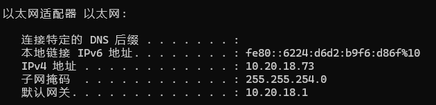
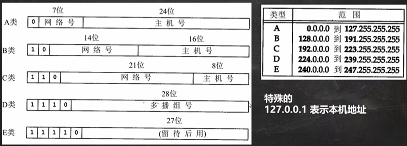
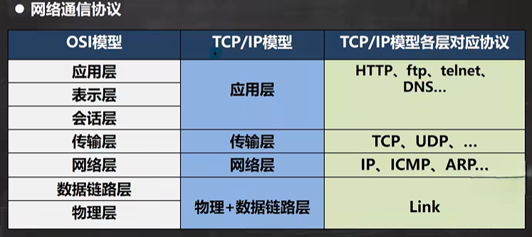
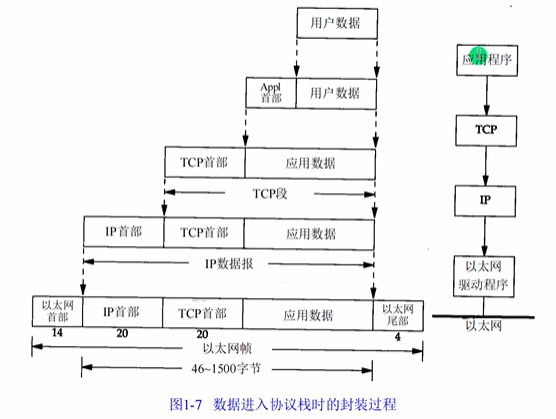
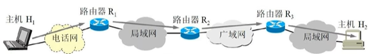

# 网络相关概念

## 基本概念

本文档编写了基础网络知识相关的概念，补充了开发过程中的基本网络概念，文档包含网络、`IP`地址、域名和端口号、网络协议和网络通信等基础概念

## 网络

两台或多台设备通过一定物理设备（路由器，交换机等）连接，构成了网络

根据网络的覆盖范围不同，可以对网络进行分类：

- 局域网：覆盖范围最小，仅仅覆盖一个教室或一个机房
- 城域网：覆盖范围较大，可以覆盖一个城市
- 广域网：覆盖范围最大，可以覆盖全国，甚至全球，万维网是广域网的代表

## `IP`地址

`IP`地址用于唯一标识网络中的每台计算机/主机（`IP`地址是一台主机的网络唯一标识）

查看主机的`IP`地址，在命令行中输入：`ipconfig`

`IP`地址，对于`IPv4`，使用4个字节（32位）来进行表示，每一个字节（十进制）的范围是0~255（一个字节的范围就是0~255）

`IP`地址的表示形式：采用点分十进制：`xx.xx.xx.xx`

`IP`地址的组成 = 网络地址 + 主机地址，如`192.168.16.69`

- 其中`192.168，16`表示了网络地址
- `69`表示了主机地址

`IPv4`地址的分类：根据网络地址和主机地址的长度进行分类，可以分为以下常见的5类：

> - `A`类，网络地址占一个字节（最前面的0是固定的），主机地址占三个字节（可以表示相对多的主机）
> - `B`类，网络地址占两个字节（最前面的1 0是固定的），主机地址占两个字节
> - `C`类，网络地址占三个字节（最前面的1 1 0是固定的），主机地址占一个字节（可以表示主机的数量较少，最多表示255个主机）
> - `D`类和`E`类使用的较少（用于多播地址和待用的）

由于`IPv4`最大的问题在于网络地址资源有限，严重制约了互联网的应用和发展，`IPv6`是互联网工程任务组设计的用于代替`IPv4`的下一代`IP`协议，其地址数量号称可以为全世界的每一粒沙子编上地址。`IPv6`的使用，不仅能解决网络地址资源数量的问题，而且也解决了多种接入设备连入互联网的障碍

`IPv6`使用的是16个字节（128位）表示地址，相当于`IPv4`的四倍

对于自己的本地电脑，一般情况下都是设置了自动分配`ip`地址，每一次开机，底层的协议会自动分配一个`ip`地址，只有服务器才是固定配置的`ip`地址

## 域名和端口号

`ip`地址通常被映射成域名，为了方便记忆，解决记`ip`的困难，如：`www.baidu.com`

端口号用于标识计算机上某个特定的网络程序（每个网络服务都会监听一个端口，当有一个程序想要去访问这个服务时，实际上请求的是这个对应的端口，通过`ip+端口`的方式进行访问），其通过整数形式的方式进行表示，范围：0~65535（2个字节表示端口 0~2^16 - 1）

在一台主机上，是不能同时去监听两个端口的（即被占用的端口不能重复使用）

其中，0~1024已经被系统程序占用，比如`ssh 22`，`ftp 21`，`smtp 25`和`http 80`等（因此，在实际开发中，不要使用0~1024的端口）

常见的网络程序端口号：

- `tomcat`：8080
- `mysql`：3306
- `oracle`：1521
- `sqlserver`：1433

## 网络协议

在日常生活中，人与人的交流过程中，可以通过不同的语言进行交流，其语言的本身就是一种协议

网络通信协议：

> `OSI`模型是一种理论性的协议，在现实中没有使用到（因为分化太细了）
>
> `TCP/ip`模型对`OSI`模型进行了简化合并，其中传输层（典型的是`TCP`），网络层（典型的是`IP`）是最重要的两层

在网络通信中，有着非常重要的协议：`TCP/ip`协议，中文译名为传输控制协议/因特网互联协议，又叫网络通讯协议

> 在`TCP/ip`协议中，用于通信的应用数据会被层层封装，最后变成以太网帧数据，通过物理网络进行发送，对方的网络在进行解包，最后得到具体的应用数据

### `TCP`协议和`UDP`协议

`TCP`协议：传输控制协议

- 使用`TCP`协议前，须先建立`TCP`连接，形成传输数据通道
- 传输前，采用“三次握手”方式，是可靠的
- `TCP`协议进行通信的两个应用进行：客户端、服务端
- 在“三次握手”确定对方的连接后，可以进行大数据量的传输
- 传输完毕，需要释放已建立的连接，效率低

`UDP`协议：用户数据协议

- 将数据、源、目的封装成数据包，不需要建立连接
- 每个数据的大小限制在64K内，不适合传输大量数据
- 因无需连接，故是不可靠的
- 发送数据结束时无需释放资源（因为不是面向连接的），速度快
- 举例：发短信的过程

## 网络通信

网络通信的概念：通过网络完成一个通信的任务（即通过网络，不同的设备进行发送和接受数据）将数据通过网络从一台设备传输到另一台设备

网络通信的示意图：

> 两台主机在一个网络上，数据的传输需要通过网络设备（路由器和交换机等）和不同的网络

在`Java`中，设计者在`java.net`包下提供了一系列的类和接口，来完成网络通信