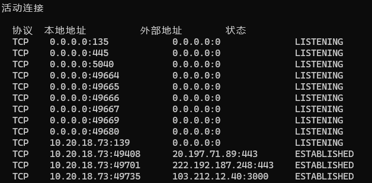
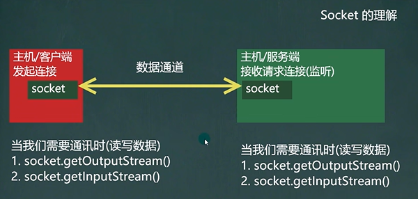
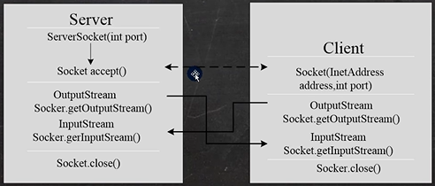
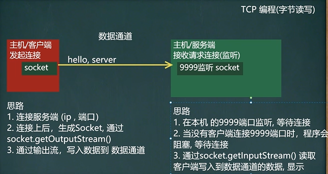
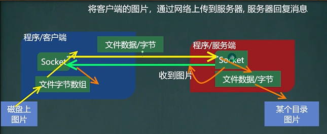
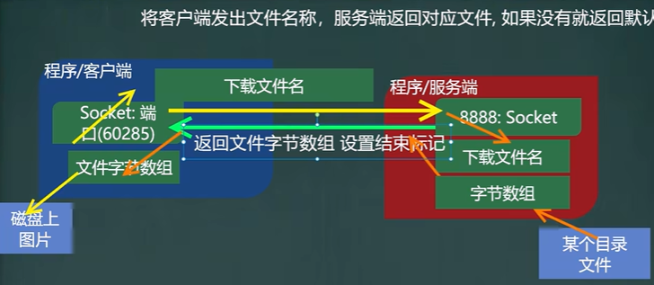
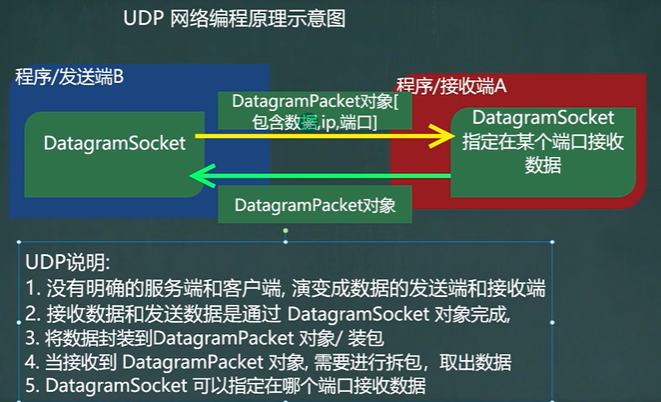

# 网络编程

## 基本概念

本篇内容主要介绍的是网络编程的相关内容，主要通过`Java`语言编写代码来演示网络编程，包括其用于网络编程时常用的包，使用`Java`实现`TCP`字节流编程和`UDP`字节流编程等


## `InetAddress`类

`InetAddress`类主要用于操作我们的`IP`地址，其相关的方法有：

- `getLocalHost`：获取本机`InetAddress`对象
- `getByName`：根据指定主机名/域获取`ip`地址对象
- `getHostName`：获取`InetAddress`对象的主机名
- `getHostAddress`：获取`InetAddress`对象的`IP`地址

```java
import java.net.InetAddress;

public static void main(String[] args) throws UnknownHostException {
    // 获取本机的InetAddress对象（包括IP地址和主机名）
    InetAddress localHost = InetAddress.getLocalHost();
    System.out.println(localHost);   // LAPTOP-4SOCJOED/10.20.18.73
    s
    // 根据主机名 获取InetAddress对象
    InetAddress host1 = InetAddress.getByName("LAPTOP-4SOCJOED");
    System.out.println(host1);  // LAPTOP-4SOCJOED/10.20.18.73   返回的是主机名/IP地址
    
    // 根据域名 获取InetAddress对象
    InetAddress host2 = InetAddress.getByName("www.baidu.com");
    System.out.println(host1);  // www.baidu.com/110.242.68.4   返回的是域名/IP地址
    
    // 通过 InetAddress对象 获取对应的主机名/域名
    String hostName = host2.getHostName();
    System.out.println(hostName);   // www.baidu.com
    
    // 通过 InetAddress对象 获取对应的IP地址
    String hostAddress = host2.getHostAddress();
    System.out.println(hostAddress);   // 110.242.68.4
}
```


## `netstat`指令

`netstat`指令是网络编程中常用的指令：

- `netstat -an` ：可以查看当前主机网络情况，包括端口监听情况和网络连接情况
- `netstat -an | more`：可以分页显示
- 指令要求在`cmd`命令行中执行



> 本地地址内容包括`IP`地址和端口，外部地址是连接到当前主机的某个连接（这些连接也会显示`IP`地址和端口号），最后`LISTENING`表示网络的状态，具体表示正在监听，`ESTABLISHED`表示连接线建立了，但是没有在监听
>
> 具体而言：`LISTENING`表示某个端口正在监听；如果有一个外部程序（客户端）连接到该端口，就会显示一条连接信息
>
> 使用管理员权限运行`cmd`，输入`netstat -anb`，可以更深层次的看到具体哪个程序正在监听


## `Socket`

`Socket`(套接字)编程主要用于实现`Windows`与`Linux`平台间的网络通信，`socket`是对应`TCP/IP`协议的最典型的应用开发接口，它提供了不同主机间进程通信的端点

通信的两端都要有`Socket`，是两台机器间通信的端点

网络通信其实就是`Socket`间的通信

`Socket`允许程序把网络连接当成一个流，数据在两个`Socket`间通过`IO`传输

套接字编程采用客户机/服务器`(C/S)`模式，连接成功后，双方可以进行通信，一般主动发起通信的应用程序为客户端，等待通信请求的为服务端



> `Socket`可以理解为数据通道的两个插头，有其具体的方法去获取输入流和输出流
>
> 应用场景：客户端发送数据，服务端接收并显示在控制台

`Socket`编程有两种编程方式：`TCP`编程（传输可靠）和`UDP`编程

- 创建套接字：`sockfd = socket(domain, type, protocol);`

  > 参数`domain`指定`socket`地址簇类型；`type`为套接字类型；`protocol`指明`socket`请求的协议；`sockfd`为套接字返回的文件描述符

- 绑定套接字与本地地址信息：` bind(sockfd，(struct sockaddr*)&server_addr,sizeof(struct sockaddr));`

  > 将本地主机地址以及端口号与所创建的套接字绑定起来

- 监听连接：`listen(sockfd，backlog);`

  > 此函数表示服务器愿意接收连接，`backlog`指队列中允许的最大排队请求的个数

- 建立连接：`connect(sockfd，(struct sockaddr*) &server_addr，sizeof(struct sockaddr));`

  > `connect`用于建立连接，`server_addr`是保存着服务器IP地址和端口号的数据结构`struct sockaddr`

- 接收连接请求：`accept(sockfd，(struct sockaddr*) &client_addr，sizeof(struct sockaddr));`

  > 用于接收客户机发来的连接请求

- 发送数据：`send(sockfd，msg，len，flags);`

  > 将`len`字节的数据`msg`发送出去，`flags`通常为0

- 接收数据：`recv(sockfd，buf，len，flags);`

  > 从套接字缓冲区`buf`中读取`len`字节长度的数据

- 关闭套接字：`close(sockfd);`


## 基于`Socket`的`TCP`编程

注意事项：

当客户端连接到服务端后，实际上客户端也是通过一个端口和服务进行通信的，这个端口是`TCP/IP`来分配的（这个端口是不确定的，是随机的）（服务器端的端口是我们进行指定的）

基于`Socket`的`TCP`编程的基本流程图：



***

### 使用字节流进行基于`Socket`的`TCP`编程

要求：

1. 编写一个服务器端和一个客户端
2. 服务器端在9999端口监听
3. 客户端连接到服务器端，发送`"hello, server"`，然后退出
4. 服务器端接收到客户端发送的信息，输出，并退出

基本思路：



服务器端的`Java`代码实现：

```java
package com.test.socket;

public class SocketTCPServer {
    public static void main(String[] args) throws IOException {
        // 1.创建一个Socket对象，并指定端口为9999（要求9999端口是没有被占用的）
        ServerSocket serverSocket = new ServerSocket(9999);
        // 2.监听：如果有客户端连接，则会返回Socket对象，程序继续
        System.out.println("服务端在9999端口监听，等待连接");
        Socket socket = serverSocket.accept();// 如果没有客户端连接，程序会在这里阻塞，后面不会执行
        System.out.println("服务器端socket", socket.getClass());
        // 3.通过socket.getInputStream()读取客户端写入到数据通道的数据，并显示
        InputStream inputStream = socket.getInputStream();
        byte[] buf = new byte[1024];
        int readLen = 0;
        while ((readLen = inputStream.read(buf)) != -1) {
            System.out.println(new String(buf, 0, readLen);
        }
        // 4.关闭流对象和socket
        inputStream.close();
        socket.close();
        serverSocket.close();
        System.out.println("服务器端退出");
    }
}
```

> `serverSocket`和`Socket`的区别：`serverSocket`可以创建很多的`Socket`，只要有一次`accept`就会返回一个`socket `，是服务器端可以满足多个客户端来进行连接

客户端的`Java`代码实现：

```java
package com.test.socket;

public class SocketTCPClient throws IOException {
    public static void main(String[] args) {
        // 1.连接服务器（ip，端口）
        // 连接当前主机InetAddress.getLocalHost()的9999端口，如果连接成功返回Socket对象
        Socket socket = new Socket(InetAddress.getLocalHost(), 9999); // 连接的是本机中的端口
        // 2.连接的是远程的服务器，需要指定具体的IP地址和端口
        // Socket socket = new Socket("110.242.68.3", 9999);
        System.out.println("客户端socket", socket.getClass());
        // 3.连接成功后，通过socket.getOutputStream()得到对象关联的输出流对象
        OutputStream outputStream = socket.getOutputStream();
        // 4.通过输出流，写入数据到数据通道
        outputStream.write("hello, server".getBytes());
        // 5.关闭流对象和socket
        outputStream.close();
        socket.close();
        System.out.println("客户端退出");
    }
}
```

要求：

1. 编写一个服务器端和一个客户端
2. 服务器端在9999端口监听
3. 客户端连接到服务器端，发送`"hello, server"`，并接收服务端发的`”hello, client“`，显示，再退出
4. 服务器端接收到客户端发送的信息，显示，并发送`”hello, client“`，再退出
5. 在数据来回发送时，要设置结束标记，提示对方，本次数据发送已经结束了（防止继续等待导致的阻塞）

服务器端的`Java`代码实现：

```java
package com.test.socket;

public class SocketTCPServer {
    public static void main(String[] args) throws IOException {
        // 1.创建一个Socket对象，并指定端口为9999（要求9999端口是没有被占用的）
        ServerSocket serverSocket = new ServerSocket(9999);
        // 2.监听：如果有客户端连接，则会返回Socket对象，程序继续
        System.out.println("服务端在9999端口监听，等待连接");
        Socket socket = serverSocket.accept();// 如果没有客户端连接，程序会在这里阻塞，后面不会执行
        System.out.println("服务器端socket", socket.getClass());
        // 3.通过socket.getInputStream()读取客户端写入到数据通道的数据，并显示
        InputStream inputStream = socket.getInputStream();
        byte[] buf = new byte[1024];
        int readLen = 0;
        while ((readLen = inputStream.read(buf)) != -1) {
            System.out.println(new String(buf, 0, readLen));
        }
        // 4.获取socket相关联的输出流，写入数据到数据通道
        OutputStream outputStream = socket.getOutputStream();
        outputStream.write("hello, client".getBytes());
        // 设置结束标记
        socket.shutdownOutput();
        // 5.关闭流对象和socket
        inputStream.close();
        outputStream.close();
        socket.close();
        serverSocket.close();
        System.out.println("服务器端退出");
    }
}
```

客户端的`Java`代码实现：

```java
package com.test.socket;

public class SocketTCPClient throws IOException {
    public static void main(String[] args) {
        // 1.连接服务器（ip，端口）
        // 连接当前主机InetAddress.getLocalHost()的9999端口，如果连接成功返回Socket对象
        Socket socket = new Socket(InetAddress.getLocalHost(), 9999); // 连接的是本机中的端口
        // 2.连接的是远程的服务器，需要指定具体的IP地址和端口
        // Socket socket = new Socket("110.242.68.3", 9999);
        System.out.println("客户端socket", socket.getClass());
        // 3.连接成功后，通过socket.getOutputStream()得到对象关联的输出流对象
        OutputStream outputStream = socket.getOutputStream();
        // 4.通过输出流，写入数据到数据通道
        outputStream.write("hello, server".getBytes());
        // 设置结束标记
        socket.shutdownOutput();
        // 5.获取和socket相关联的输入流，读取数据，并显示
        InputStream inputStream = socket.getInputStream();
        byte[] buf = new byte[1024];
        int readLen = 0;
        while ((readLen = inputStream.read(buf)) != -1) {
            System.out.println(new String(buf, 0, readLen));
        }
        // 6.关闭流对象和socket
        inputStream.close();
        outputStream.close();
        socket.close();
        System.out.println("客户端退出");
    }
}
```

***

### 使用字符流进行基于`Socket`的`TCP`编程

要求：使用字符流

1. 编写一个服务器端和一个客户端
2. 服务器端在9999端口监听
3. 客户端连接到服务器端，发送`"hello, server"`，并接收服务端发的`”hello, client“`，显示，再退出
4. 服务器端接收到客户端发送的信息，显示，并发送`”hello, client“`，再退出
5. 在数据来回发送时，要设置结束标记，提示对方，本次数据发送已经结束了（防止继续等待导致的阻塞），写入标记可以使用`socket.shutdownOutput()`的方式，也可以使用`writer.newLine()`的方式（实际上就是输入一个换行符），但是使用该方式需要用`readLine()`的方式进行读取

服务器端的`Java`代码实现：

```java
package com.test.socket;

public class SocketTCPServer {
    public static void main(String[] args) throws IOException {
        // 1.创建一个Socket对象，并指定端口为9999（要求9999端口是没有被占用的）
        ServerSocket serverSocket = new ServerSocket(9999);
        // 2.监听：如果有客户端连接，则会返回Socket对象，程序继续
        System.out.println("服务端在9999端口监听，等待连接");
        Socket socket = serverSocket.accept();// 如果没有客户端连接，程序会在这里阻塞，后面不会执行
        System.out.println("服务器端socket", socket.getClass());
        // 3.通过字符流读取客户端写入到数据通道的数据，并显示
        InputStream inputStream = socket.getInputStream();
        // 使用了转换流，使用InputStreamReader将inputStream转换成字符流
        BufferedReader bufferedReader = new BufferedReader(new InputStreamReader(inputStream));
        // 从数据通道中获取数据，并输出
        String s = bufferedReader.readLine();
        System.out.println(s);
        // 4.获取socket相关联的输出流，写入数据到数据通道
        OutputStream outputStream = socket.getOutputStream();
        // 使用字符输出流的方式回复信息
        BufferedWriter bufferedWriter = new BufferedWriter(new OutputStreamWriter(outputStream));
        bufferedWriter.write("hello, client");  // 在数据通道中写入数据
        // 插入一个换行符，表示写入内容结束（要求对方使用readLine()读取，否则是读取不到的）
        bufferedWriter.newLine();   
        bufferedWriter.flush();   // 如果使用字符流，需要手动刷新，否则数据无法进行写入
        // 5.关闭流对象和socket
        bufferedReader.close();  // 关闭外层流
        bufferedWriter.close();  // 关闭外层流
        socket.close();
        serverSocket.close();
        System.out.println("服务器端退出");
    }
}
```

客户端的`Java`代码实现：

```java
package com.test.socket;

public class SocketTCPClient throws IOException {
    public static void main(String[] args) {
        // 1.连接服务器（ip，端口）
        // 连接当前主机InetAddress.getLocalHost()的9999端口，如果连接成功返回Socket对象
        Socket socket = new Socket(InetAddress.getLocalHost(), 9999); // 连接的是本机中的端口
        // 2.连接的是远程的服务器，需要指定具体的IP地址和端口
        // Socket socket = new Socket("110.242.68.3", 9999);
        System.out.println("客户端socket", socket.getClass());
        // 3.连接成功后，通过socket.getOutputStream()得到对象关联的输出流对象
        OutputStream outputStream = socket.getOutputStream();
        // 4.使用字符流来发送数据，将字节流转化为字符流
        BufferedWriter bufferedWriter = new BufferedWriter(new OutputStreamWriter(outputStream));
        bufferedWriter.write("hello, server");  // 在数据通道中写入数据
        // 插入一个换行符，表示写入内容结束（要求对方使用readLine()读取，否则是读取不到的）
        bufferedWriter.newLine();   
        bufferedWriter.flush();   // 如果使用字符流，需要手动刷新，否则数据无法进行写入
        // 5.获取和socket相关联的输入流，读取数据，并显示
        InputStream inputStream = socket.getInputStream();
        // 使用了转换流，使用InputStreamReader将inputStream转换成字符流
        BufferedReader bufferedReader = new BufferedReader(new InputStreamReader(inputStream));
        // 从数据通道中获取数据，并输出
        String s = bufferedReader.readLine();
        System.out.println(s);
        // 6.关闭流对象和socket
        bufferedReader.close();  // 关闭外层流
        bufferedWriter.close();  // 关闭外层流
        socket.close();
        System.out.println("客户端退出");
    }
}
```

***

### 网络上传文件

要求：

1. 编写一个服务器端和一个客户端

2. 服务器端在8888端口监听

3. 客户端连接到服务器端，发送一张图片：`d:\\new.png`

4. 服务器端接收到客户端发送的图片，保存到`src`目录下，并发送`”收到图片“`，再退出

5. 客户端接收到服务端发送的`”收到图片“`，再退出

6. 我们直接使用自己写的类`StreamUtils.java`在`package com.test.upload;`包中

   ```java
   import java.io.BufferedReader;
   import java.io.ByteArrayOutputStream;
   import java.io.IOException;
   import java.io.InputStream;
   import java.io.InputStreamReader;
   
   // 该类的功能：
   // 1.将输入流转换为byte[]（即可以把文件的内容读入到byte[]数组中）
   // 2.将输入的InputStream转换成String
   public class StreamUtils {
       public static byte[] streamToByteArray(InputStream is) throws Exception {
           ByteArrayOutputStream bos = new ByteArrayOutputStream();  // 创建输出流对象
           byte[] b = new byte[1024];   // 字节数组
           int len;
           while((len = is.read(b)) != -1) {
               bos.write(b, 0, len);
           }
           // 将bos转成字节数组，就是思路图中的文件字节数组
           byte[] array = bos.toByteArray();
           bos.close();
           return array;
       }
       public static String streamToString(InputStream is) throws Exception {
           BufferedReader reader = new BufferedReader(new InputStreamReader(is));
           StringBuilder builder = new StringBuilder();
           String line;
           while((line = reader.readLine()) != null) {  // 当读取到null时，就表示结束了
               builder.append(line + "\r\n");
           }
           return builder.toString();
       }
   }
   ```

思路图：



服务器端的`Java`代码实现：

```java
package com.test.upload;

public class TCPFileUploadServer {
    public static void main(String[] args) throws IOException {
        // 1.创建一个Socket对象，并指定端口8888（要求8888端口是没有被占用的）
        ServerSocket serverSocket = new ServerSocket(8888);
        // 2.监听：如果有客户端连接，则会返回Socket对象，程序继续
        System.out.println("服务端在8888端口监听，等待连接");
        Socket socket = serverSocket.accept();// 如果没有客户端连接，程序会在这里阻塞，后面不会执行
        System.out.println("服务器端socket", socket.getClass());
        // 3.读取客户端发送的数据
        // 通过Socket得到输入流
        BufferedInputStream bis = new BufferedInputStream(socket.getInputStream());
        byte[] bytes = StreamUtils.streamToByteArray(bis);  // 得到传输过来的bytes数组
        // 将bytes数组写入到指定的路径
        String destFilePath = "src\\new.png";
        BufferedOutputStream bos = new BufferedOutputStream(new FileOutoutStream(destFilePath));
        bos.write(bytes);   // 将字节数组写入到文件中
        // 4.向客户端回复收到图片
        // 通过socket获取到输出流（字符）
        BufferedWriter writer = new BufferedWriter(new OutputStreamWriter(socket.getOutoutStream()));
        writer.write("收到图片");
        writer.flush();  // 把内容刷新到数据通道
        socket.shutdownOutput();  // 设计结束标记
        // 5.关闭流
        writer.close();
        bos.close();
        bis.close();
        socket.close();
        serverSocket.close();
    }
}
```

客户端的`Java`代码实现：

```java
package com.test.upload;

public class TCPFileUploadClient throws IOException {
    public static void main(String[] args) {
        // 1.连接服务器（ip，端口）
        // 连接当前主机InetAddress.getLocalHost()的8888端口，如果连接成功返回Socket对象
        Socket socket = new Socket(InetAddress.getLocalHost(), 8888); // 连接的是本机中的端口
        // 2.连接的是远程的服务器，需要指定具体的IP地址和端口
        // Socket socket = new Socket("110.242.68.3", 9999);
        System.out.println("客户端socket", socket.getClass());
        // 3.连接成功后，创建读取磁盘文件的输入流
        String filePath = "d:\\new.png";
        BufferedInputStream bis = new BufferedInputStream(new FileInputStream(filePath));
        // 使用自定义的工具类StreamUtils，得到图片文件对应的字节数组
        byte[] bytes = StreamUtils.streamToByteArray(bis);
        // 4.通过socket获取到输出流，将bytes数据发送给服务端
        BufferedOutputStream bos = new BufferedOutputStream(socket.getOutputStream());
        bos.write(bytes);  // 将文件对应的字节数组的内容，写入到数据通道
        socket.shutdownOutout();  // 设置写入数据的结束标记
        // 5.接收从服务端回复的消息
        InputStream inputStream = socket.getInputStream();
        // 使用StreamUtilsd的streamToString方法，直接将inputStream读取到的内容转换成字符串
        String s = StreamUtilsd.streamToString(inputStream);
        System.out.println(s);
        // 6.关闭相关的流
        inputStream.close();
        bis.close();
        bos.close();
        socket.close();
    }
}
```

***

### 文件下载

要求：

1. 编写客户端和服务端程序
2. 客户端可以输入一个文件名，服务端收到了文件名后，可以给客户端返回这个文件，如果没有这个文件，返回一个默认的文件即可
3. 客户端收到文件后，保存到本地：`d:\\`
4. 该程序使用自己写的类`StreamUtils.java`

思路分析：



> 客户端发送一个下载文件的请求，服务端收到了这个请求后， 去查找有没有对应的文件内容，如果找到了，直接将文件读到字节数组中，如果没有找到，将默认的文件读到字节数组中，再通过输出流，将字节数组写入到数据通道中，之后，客户端通过`socket`的输入流，得到读入的文件字符数组，最后将其写入到磁盘中

服务器端的`Java`代码实现：

```java
package com.test.download;

public class TCPFileDownloadServer {
    public static void main(String[] args) throws IOException {
        // 1.创建一个Socket对象，并指定端口8888（要求8888端口是没有被占用的）
        ServerSocket serverSocket = new ServerSocket(8888);
        // 2.监听：如果有客户端连接，则会返回Socket对象，程序继续
        System.out.println("服务端在9999端口监听，等待连接");
        Socket socket = serverSocket.accept();// 如果没有客户端连接，程序会在这里阻塞，后面不会执行
        System.out.println("服务器端socket", socket.getClass());
        // 3.读取客户端发送的要下载的文件名
        InputStream inputStream = socket.getInputStream();
        byte[] b = new byte[1024];
        int len = 0;
        String downLoadFileName = "";
        // 这里使用了while循环来读取文件名，是考虑后续客户端发送的数据量较大可以拓展，但文件名的读取可以不使用while循环
        while((len = inputStream.read(b)) != -1) {
            downLoadFileName += new String(b, 0, len);
        }
        System.out.println("客户端希望下载的文件名为：" + downLoadFileName);
        // 将读取的文件名与服务器文件中的文件进行比较
        // 如果客户端要下载的是new.png，我们就返回该文件；否则一律返回no.png文件（默认返回的文件）
        String resFileName = "";
        if("new.png".equals(downLoadFileName)) {
            resFileName = "src:\\new.png";
        } else {
            resFileName = "src:\\no.png";
        }
        // 4.创建一个输入流来读取文件
        BufferedInputStream bis = new BufferedInputStream(new FileInputStream(resFileName));
        // 5.使用工具类StreamUtils的streamToByteArray方法，读取文件到一个字节数组
        byte[] bytes = StreamUtils.streamToByteArray(bis);   // 对应于思路图中的字节数组
        // 6.得到Socket关联的输出流
        BufferedOutputStream bos = new BufferedOutputStream(socket.getOutputStream());
        // 7.写入到数据通道，返回给客户端
        bos.write(bytes);
        socket.shutdownOutput();  // 设置结束标记
        // 8.关闭相关的流
        bis.close();
        inputStream.close();
        socket.close();
        serverSocket.close();
        System.out.println("服务器端退出");
    }
}
```

客户端的`Java`代码实现：

```java
package com.test.download;
import java.util.Scanner;

public class TCPFileDownloadClient throws IOException {
    public static void main(String[] args) {
        // 1.接收用户输入，指定下载文件名
        Scanner scanner = new Scanner(System.in);
        System.out.println("请输入要下载的文件名");
        String downloadFileName = scanner.next();
        // 2.连接服务器（ip，端口）
        // 连接当前主机InetAddress.getLocalHost()的8888端口，如果连接成功返回Socket对象
        Socket socket = new Socket(InetAddress.getLocalHost(), 8888); // 连接的是本机中的端口
        System.out.println("客户端socket", socket.getClass());
        // 3.连接成功后，获取和Socket关联的输出流
        OutputStream outputStream = socket.getOutputStream();
        outputStream.write(downloadFileName.getBytes());  // 向数据通道发送字节流
        socket.shutdownOutout();  // 设置写入数据的结束标记
        // 4.读取服务端返回的文件（字节数组）
        BufferedInputStream bis = new BufferedInputStream(socket.getInputStream());
        byte[] bytes = StreamUtils.streamToByteArray(bis);
        // 5.得到一个输出流，将bytes写入到磁盘文件
        String filePath = "d:\\" + downloadFileName + ".png";
        BufferedOutputStream bos = new BufferedOutputStream(new FileOutputStream(filePath));
        bos.write(bytes);  // 将数据写入到磁盘
        // 6.关闭相关的流
        outputStream.close();
        bis.close();
        bos.close();
        socket.close();
        System.out.println("客户端退出");
    }
}
```


## 基于`Socket`的`UDP`编程

基本介绍：

- `DatagramSocket`和`DtagramPacket`（数据包/报）类实现了基于`UDP`协议网络程序
- `UDP`数据通过数据报套接字`DatagramSocket`发送和接受，系统不保证`UDP`数据报一定能够安全送到目的地，也不确定什么时候可以抵达
- `DtagramPacket`对象封装了`UDP`数据报，在数据报中包含了发送端的`IP`地址和端口号以及接收端的`IP`地址和端口号
- `UDP`协议中每个数据报都给出了完整的地址信息，因此无需建立发送方和接收方的连接

基于`Socket`的`UDP`编程的基本流程：

1. 核心的两个类/对象`DatagramSocket`和`DtagramPacket`
2. 建立发送端和接受端（没有服务端和客户端的概念了）
   1. 在发送数据之前，建立数据包/报，即`DtagramPacket`对象

3. 调用`DatagramSocket`的发送、接收方法
4. 关闭`DatagramSocket`



> 发送端可以变成接收端，接收端也可以变成发送端，没有服务端和客户端的概念了

应用案例：

- 编写一个接收端`A`和一个发送端`B`
- 接收端`A`在9999端口等待接收数据（`receive`）
- 发送端`B`向接收端`A`发送数据`"hello"`
- 接收端`A`接收到发送端`B`发送的数据，回复`“好的”`，再退出
- 发送端接收回复的数据，再退出

接收端`A`的代码实现：

```java
package com.test.udp;

public class UDPReceiverA {
    public static void main(String[] args) throws IOException {
        // 1.创建一个 DatagramSocket 对象，准备在9999端口接收数据
        DatagramSocket socket = new DatagramSocket(9999);
        // 2.创建一个 DtagramPacket 对象，准备接收数据
        byte[] buf = new byte[1024];  // UDP协议传输时一个数据包最大是64k
        DtagramPacket packet = new DtagramPacket(buf, buf.length);
        // 3.调用接收方法，将通过网络传输的DtagramPacket对象填充到空的packet对象中
        System.out.println("接收端A等待接收数据");
        socket.receive(packet);  // 当有数据包发送到本机的9999端口是，就会接收数据，否则就会阻塞
        // 4.把packet进行拆包，取出数据，并显示
        int length = packet.getLength();   // 实际接收到的数据字节长度
        byte[] data = packet.getData();   // 接收到的数据
        String s = new String(data, 0, length);
        System.out.println(s);
        // 5.发送回复给A端
        data = "好的".getBytes();  // 字节数组
        // 传入主机（通过IP地址获取主机）和端口
        packet = new DtagramPacket(data, data.length, InetAddress.getByName("10.20.18.73"), 9998);
        // 6.发送数据
        socket.send(packet);
        // 7.关闭资源
        socket.close();
        System.out.println("A端退出");
    }
}
```

发送端`B`的代码实现：

```java
package com.test.udp;

public class UDPSenderB {
    public static void main(String[] args) throws IOException {
        // 1.创建一个 DatagramSocket 对象，准备在9998端口接收数据（发送端后续也可以变成接收端接收数据）
        DatagramSocket socket = new DatagramSocket(9998);
        // 2.创建一个 DtagramPacket 对象
        byte[] data = "hello".getBytes();  // 字节数组
        // 传入主机（通过IP地址获取主机）和端口
        DtagramPacket packet = new DtagramPacket(data, data.length, InetAddress.getByName("10.20.18.73"), 9999);
        // 3.发送数据
        socket.send(packet);
        // 4.接收回复的数据
        byte[] buf = new byte[1024];  // UDP协议传输时一个数据包最大是64k
        packet = new DtagramPacket(buf, buf.length);
        // 5.调用接收方法，将通过网络传输的DtagramPacket对象填充到空的packet对象中
        socket.receive(packet);  // 当有数据包发送到本机的9999端口是，就会接收数据，否则就会阻塞
        // 6.把packet进行拆包，取出数据，并显示
        int length = packet.getLength();   // 实际接收到的数据字节长度
        data = packet.getData();   // 接收到的数据
        String s = new String(data, 0, length);
        System.out.println(s);
        // 7.关闭资源
        socket.close();
        System.out.println("B端退出");
    }
}
```

